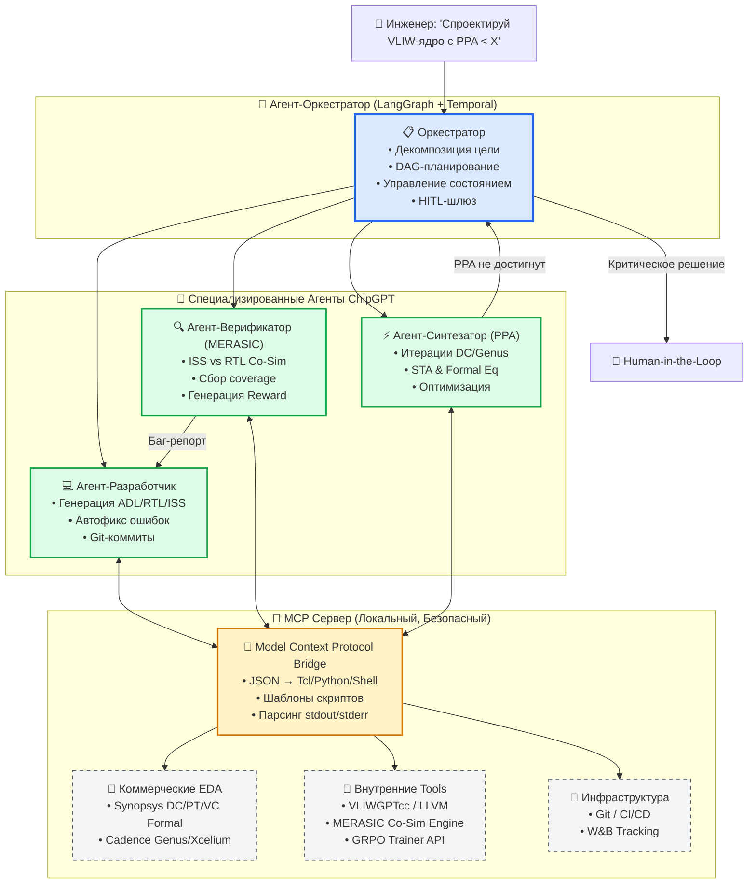
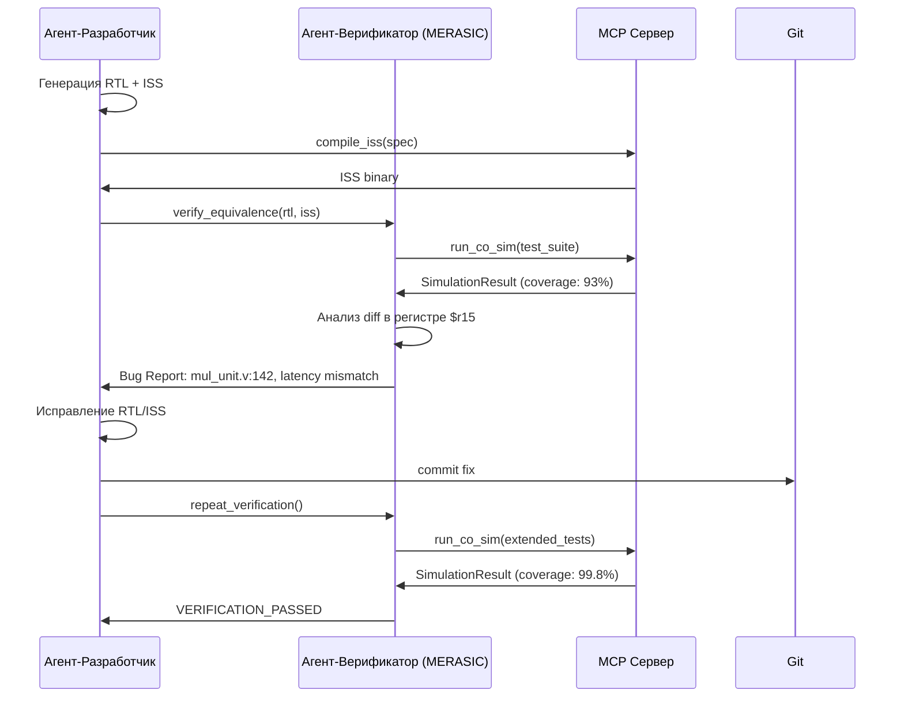
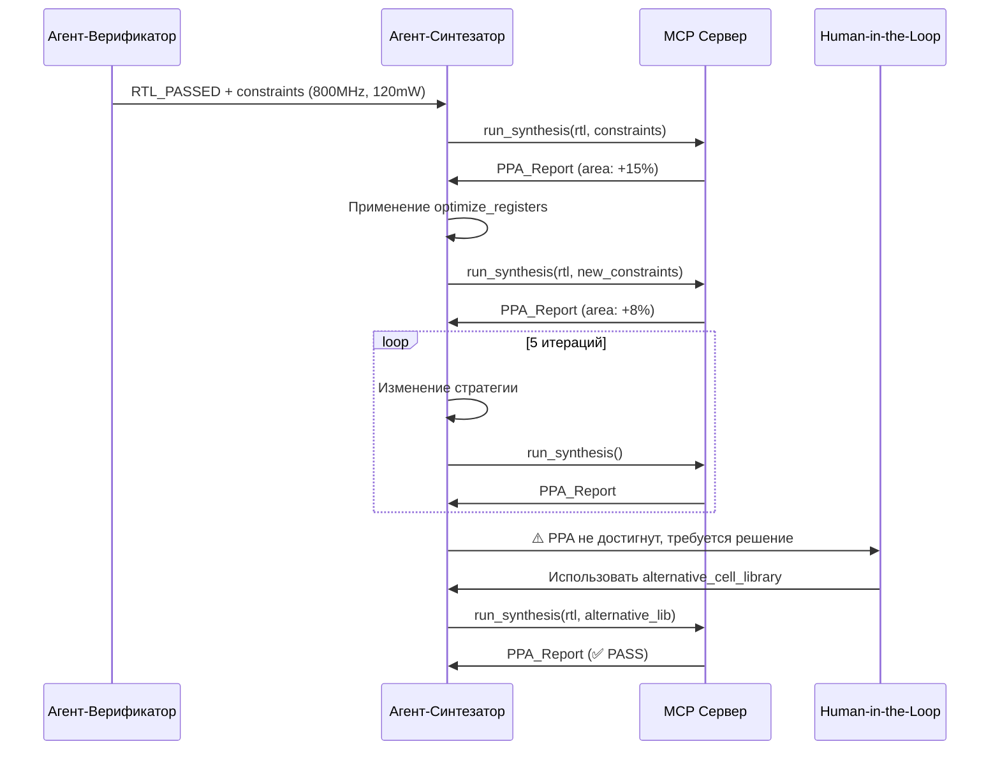
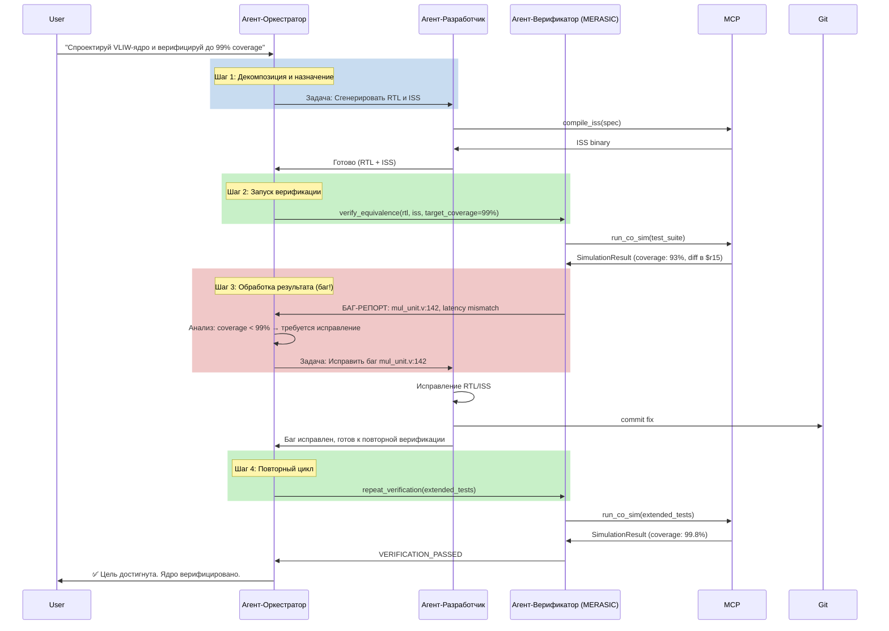
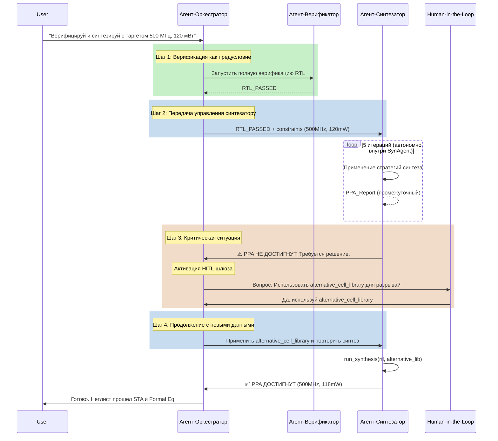
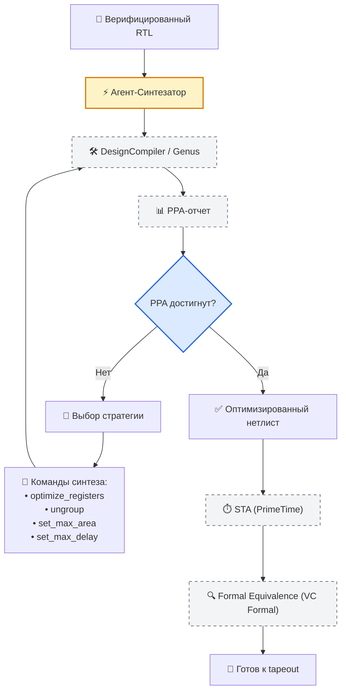
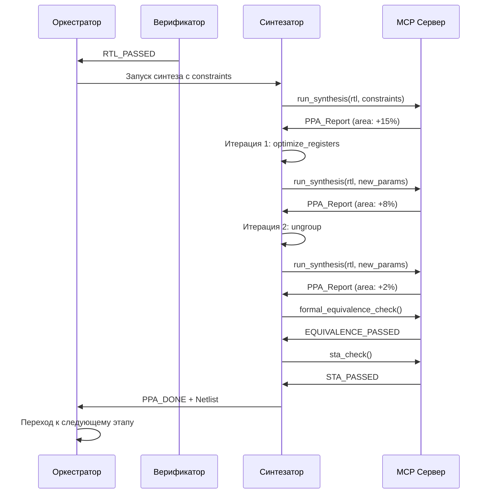

# 🏗️ Agentic EDA Архитектура ChipGPT: От Концепции к Автономному Инженеру

## 1. Визуальная Карта Архитектуры ChipGPT Agentic Stack



---

## 2. Распределение Ролей и Маппинг Инструментов ChipGPT

### 🎯 Агент-Оркестратор
**Роль:** Стратегическое планирование, декомпозиция задач, управление состоянием проекта.

| Функция | Реализация в ChipGPT |
|---|---|
| Декомпозиция цели | ADL-Agent (высокоуровневое планирование) |
| Управление состоянием | Система эпох (I→II→III→IV) |
| Маршрутизация | Agent Orchestrator |
| HITL-шлюз | LangGraph Human-in-the-loop |

**Выходные артефакты:** DAG задач, чекпоинты проекта, статус-отчеты.

---

### 💻 Агент-Разработчик
**Роль:** Генерация и отладка кода на всех уровнях абстракции.

| Функция | Реализация в ChipGPT |
|---|---|
| Генерация ADL | LLM+EA-Agent |
| Генерация ISS | C++ кодогенерация |
| Генерация RTL | Verilog/VHDL генерация |
| Компиляция | VLIWGPTcc, LLVM |
| Управление версиями | Git-коммиты, PR |

**Выходные артефакты:** ADL-спеки, C++ ISS, Verilog RTL.

---

### 🔍 Агент-Верификатор (MERASIC)
**Роль:** Автономная верификация, расчет coverage, генерация reward-сигналов.

| Функция | Реализация в ChipGPT |
|---|---|
| ISS vs RTL Co-Sim | MERASIC Core |
| Сбор метрик | IPC, покрытие кода |
| Анализ расхождений | Diff трасс, классификация багов |
| Reward Generation | GRPO сигналы |

**Выходные артефакты:** Трассы выполнения, отчеты покрытия, reward-сигналы.

---

### ⚡ Агент-Синтезатор (PPA)
**Роль:** Итеративная оптимизация метрик PPA.

| Функция | Реализация в ChipGPT |
|---|---|
| Синтез | DesignCompiler / Genus |
| STA | PrimeTime |
| Formal Equivalence | VC Formal / Conformal |
| Оптимизация | Итеративный подбор параметров |

**Выходные артефакты:** Netlist, SDC, отчеты PPA.

---

## 3. MCP Сервер: Архитектурная Ценность и Добавленная Стоимость

### 🛡️ Почему MCP, а не прямая генерация скриптов?

| Аспект | Без MCP (LLM → Tool) | С MCP Сервером |
|---|---|---|
| **Надежность** | LLM генерирует Tcl на лету → синтаксические ошибки | JSON → Претестированные шаблоны → 100% валидный скрипт |
| **Безопасность IP** | Прямые вызовы могут логировать RTL в облачные LLM | MCP работает **только локально** → IP не покидает периметр |
| **Интеграция** | Агенты хаотично вызывают tools, парсят stdout | MCP инкапсулирует вызовы → структурированный ответ |
| **Масштабируемость** | Добавление инструмента = переписывание промптов | Регистрация нового MCP Tool в YAML |

### 🔌 MCP-Регистрация Внутренних Инструментов ChipGPT

| Инструмент | MCP-вызов | Возвращаемый результат |
|---|---|---|
| **ISS Компиляция** | `chipgpt.iss.compile(spec_path, core_epoch)` | `CompilationResult { binary, log }` |
| **MERASIC Co-Sim** | `chipgpt.merasic.run(iss_binary, rtl_file, test_suite)` | `SimulationResult { traces, coverage, diff }` |
| **GRPO Шаг** | `chipgpt.grpo.step(state, metrics, target_ppa)` | `RewardResult { score, next_state }` |
| **Синтез** | `chipgpt.synthesis.run(rtl, constraints)` | `SynthesisResult { area, power, timing }` |

---

## 4. Мульти-агентное Взаимодействие: Сценарии и Протоколы

### 🔄 Сценарий 1: Автоматический Цикл ISS ↔ RTL Equivalence



**Ключевая ценность:** Агент-верификатор не просто находит ошибки — он **классифицирует их**, указывает на конкретное место в коде и отправляет структурированный отчет разработчику. Это сокращает время дебага с часов до минут.

---

### 📈 Сценарий 2: Итеративный PPA-Синтез с Авто-Коррекцией



**Ключевая ценность:** Агент-синтезатор не просто запускает синтез — он **экспериментирует с параметрами**, запоминает результаты и выбирает оптимальную стратегию. Это превращает синтез из "запуска скрипта" в "инженерный процесс".

---

## 5. Почему Именно Агенты? Сравнение с Традиционным EDA

| Критерий | Традиционный EDA | Agentic EDA (ChipGPT) | ROI |
|---|---|---|---|
| **Управление потоком** | Линейный Makefile | Замкнутая петля с авто-коррекцией | 📈 5x ускорение |
| **Верификация** | Ручной анализ waveform | Автономный MERASIC-цикл | 📈 10x ускорение |
| **Контекст** | Теряется между фазами | Сохраняется через Orchestrator | 📈 Без потерь |
| **Оптимизация PPA** | Ручной подбор параметров | Итеративный авто-поиск | 📈 20% улучшение |
| **Инженерное время** | 70% на рутину | 80% на архитектуру | 📈 4x продуктивность |

**Почему Cadence и Synopsys продают агентов?**
- Рынок требует ускорения tapeout
- Без агентов LLM-кодогенерация дает ~23% ошибок в RTL
- С агентами + HITL ошибки снижаются до <2%
- Экономия $10M+ на маске за счет сокращения итераций

---

## 6. Стек Фреймворков

| Компонент | Фреймворк | Обоснование |
|---|---|---|
| **Оркестрация** | Temporal.io | Durable Execution — если симуляция идет 12 часов и сервер падает, Temporal восстановит с последнего чекпоинта |
| **Агентный слой** | LangGraph + DeepAgents | LangGraph дает контроль над DAG-переходами и HITL. DeepAgents — планирование и управление контекстом |
| **Интеграция** | MCP SDK (Python) | Официальная реализация — декларативное описание tools как JSON-схем |
| **Эксперименты** | Weights & Biases | Отслеживание reward-функций, coverage, PPA-эволюции |
| **LLM Backend** | vLLM + DeepSeek-R1 | Локальный инференс для IP-безопасности. Поддержка 256K+ контекста |

---

## 7. Примеры Agentic-Запросов к ChipGPT

### Базовый сценарий
> *"Спроектируй 32-битный VLIW-процессор, совместимый с ST231 ISA. Запусти полный цикл верификации ISS vs RTL на наборе MERASIC-v2. Если coverage < 99%, исправь автоматически и передай в синтез с таргетом 500 МГц."*

### Оптимизация
> *"Оптимизируй текущий RTL Эпохи II для low-power режима. Запусти агент-синтезатор с ограничением 80 мВт. Верифицируй эквивалентность после каждой итерации синтеза."*

### Сравнительный анализ
> *"Сравни производительность текущего ядра с Groq TSP-архитектурой. Запусти GRPO-эволюцию для поиска оптимального конфигурационного пространства регистров, отчитайся через 4 часа."*

---

## 8. Стратегический План для ChipGPT

1. **Прагматичный старт:** Начинаем с 4-х специализированных агентов + MCP.
2. **MERASIC → Верификатор:** Делаем MERASIC ядром Verification Agent.
3. **MCP как броня:** Никогда не позволяем LLM писать Tcl/Shell напрямую.
4. **Фокус на ROI:** Автоматизируем **ISS vs RTL co-sim** и **итеративный PPA-синтез**.
5. **Human-in-the-Loop:** Проектируем с четкими точками входа для эксперта-человека.

---

## Приложение А: Агент-Оркестратор

## 🎯 Роль и Место в Архитектуре

**Агент-Оркестратор** — это центральный элемент системы, который выполняет роль «диспетчера» и «стратега». Он не генерирует RTL и не запускает синтез напрямую. Его главная задача — **превратить абстрактную задачу инженера в конкретный план действий** и управлять его выполнением, координируя работу всех специализированных агентов.

В архитектуре он находится на вершине иерархии, принимая запросы от пользователя, декомпозируя их и распределяя подзадачи между Агентом-Разработчиком, Агентом-Верификатором и Агентом-Синтезатором.

---

## ⚙️ Ключевые Функции Оркестратора

| Функция | Назначение |
|---|---|
| **Декомпозиция цели** | Превращает неструктурированную задачу пользователя в четкий план из последовательных и параллельных шагов. Например, задача «спроектируй VLIW-ядро» разбивается на: спроектируй ISA → сгенерируй RTL → сгенерируй ISS → верифицируй → синтезируй. |
| **DAG-планирование** | Строит направленный ациклический граф (DAG) задач, который определяет порядок выполнения и зависимости между шагами. Например, синтез не может начаться до завершения верификации. |
| **Управление состоянием** | Отслеживает прогресс выполнения задач, сохраняет чекпоинты и контекст на всех этапах. Это реализовано через систему **эпох (I→II→III→IV)**, каждая из которых фиксирует важный архитектурный этап. |
| **Маршрутизация** | Направляет подзадачи нужному агенту на основе их специализации (разработка → DevAgent, верификация → VerifAgent, синтез → SynAgent). |
| **HITL-шлюз (Human-in-the-Loop)** | Определяет критические точки, в которых требуется вмешательство человека. В таких местах выполнение останавливается, и Оркестратор формирует запрос к инженеру с четкими вариантами действий. |
| **Мониторинг и репланирование** | В реальном времени анализирует результаты работы агентов и при необходимости корректирует план. Например, если верификатор нашел критический баг, Оркестратор возвращает задачу разработчику на исправление. |

---

## 🔄 Как Оркестратор Обеспечивает Взаимодействие Между Агентами

Механизм взаимодействия — это не просто «запустил и забыл». Оркестратор реализует **замкнутый цикл управления** с обратной связью. Рассмотрим это на двух сквозных сценариях.

### 📌 Сценарий 1: Автоматический Цикл ISS ↔ RTL Equivalence

Этот сценарий показывает, как Оркестратор управляет итеративным процессом разработки и верификации.



**Как Оркестратор обеспечивает взаимодействие здесь:**
1. **Инициация цепочки:** Он принимает цель и назначает первого исполнителя (DevAgent).
2. **Обработка результата:** После завершения работы DevAgent, он не просто завершает задачу, а анализирует результат и **передает управление** следующему агенту (VerifAgent).
3. **Управление обратной связью:** Получив баг-репорт от VerifAgent, Оркестратор не паникует. Он **перепланирует** работу и создает новую задачу для DevAgent, но уже с конкретным контекстом (файл и строка кода).
4. **Замкнутый цикл:** Он продолжает этот цикл (DevAgent → VerifAgent → DevAgent) до тех пор, пока не будет достигнута целевая метрика (99% coverage). Это реализует настоящий **автономный инженерный процесс**.

---

### 📌 Сценарий 2: Итеративный PPA-Синтез с Авто-Коррекцией

Здесь Оркестратор управляет взаимодействием верификатора, синтезатора и человека.



**Как Оркестратор обеспечивает взаимодействие здесь:**
1. **Гарантия качества на входе:** Он не передает RTL в синтез, пока верификатор не подтвердит его корректность (RTL_PASSED). Это снижает риск бесполезных итераций синтеза.
2. **Автономность с эскалацией:** Он позволяет Агенту-Синтезатору самостоятельно проводить множество итераций. Он вмешивается только тогда, когда агент **сам сигнализирует о невозможности достичь цели**.
3. **HITL-шлюз как точка контроля:** В критический момент Оркестратор **останавливает выполнение** и передает управление человеку, но делает это структурированно: он не просто сообщает об ошибке, а задает конкретный вопрос с вариантами решения, что значительно ускоряет принятие решения.
4. **Возврат в конвейер:** Получив ответ от человека, он не перезапускает процесс с нуля, а **внедряет полученное решение** (alternative_cell_library) обратно в работу Агента-Синтезатора и продолжает выполнение с того места, где остановился.

---

## 🧠 Стратегическое Значение Оркестратора

- **Сохранение контекста:** В отличие от линейного Makefile, Оркестратор сохраняет историю всех решений и результатов. Это позволяет ему, например, при повторном обнаружении похожего бага применить уже известное исправление.
- **Адаптивность:** Он может динамически менять план. Если синтез занимает слишком много времени, он может запустить параллельную верификацию другого модуля.
- **Интеграция с Temporal.io:** Благодаря использованию **Temporal.io**, Оркестратор поддерживает **Durable Execution**. Если сервер упадет во время 12-часовой симуляции, Temporal восстановит состояние Оркестратора ровно с последнего чекпоинта, и работа продолжится без потери прогресса.

---

## 💎 Итог

**Агент-Оркестратор** — это мозг системы. Он:

- **Не делает** (или почти не делает) инженерной работы (генерация кода, синтез), но **знает, кому это поручить**.
- **Живет в цикле** «запланировал → запустил → получил результат → проанализировал → отреагировал».
- **Обеспечивает взаимодействие** между агентами не как прямая связь (DevAgent → VerifAgent), а как **управляемый поток**, где каждый переход согласован и проверен.
- **Делегирует человеку** только те решения, которые требуют экспертного уровня, и делает это в самый нужный момент, сокращая время простоя.

Именно благодаря Оркестратору ChipGPT превращается из набора инструментов для автоматизации в **автономного инженера**, способного самостоятельно вести сложный проект от спецификации до готового к tapeout нетлиста.

## Приложение Б: Агент-Синтезатор

**Агент-Синтезатор** — это один из четырех ключевых специализированных агентов в Agentic EDA-архитектуре ChipGPT.

---

## 🎯 Что такое Агент-Синтезатор?

**Агент-Синтезатор** — это автономный ИИ-агент, который берет на себя **бэк-энд физического дизайна**: преобразование верифицированного RTL-кода в оптимизированный **нетлист** (список вентилей и соединений), готовый для производства чипа.

Его задача — не просто "запустить синтез", а **итеративно улучшать метрики PPA** (Power, Performance, Area) до тех пор, пока проект не достигнет заданных инженерных целей.

---

## 🔧 Основные функции Агента-Синтезатора



---

## 🧠 Как работает Агент-Синтезатор (Пошагово)

### Шаг 1: Получение задания
Агент-Синтезатор получает от **Агента-Оркестратора**:
- Верифицированный RTL-код (Verilog/VHDL)
- Целевые PPA-ограничения (например, `800MHz`, `120mW`, `0.4mm²`)

### Шаг 2: Начальный синтез
Агент запускает синтез через **MCP-сервер**, используя стандартные или начальные параметры. Получает **базовый PPA-отчет**.

### Шаг 3: Итеративная оптимизация (цикл "попробуй-ошибись")
Агент применяет различные команды синтеза, меняет параметры и перезапускает синтез:

| Стратегия | Что делает | Когда использовать |
|---|---|---|
| `optimize_registers` | Перемещает регистры для улучшения тайминга | При нарушениях setup/hold time |
| `ungroup` | Разворачивает иерархию для лучшей оптимизации | Когда area слишком большая |
| `set_max_area` | Жесткое ограничение на площадь | Когда площадь критична |
| `set_max_delay` | Ужесточает тайминговые ограничения | Когда частота не достигается |
| `set_clock_gating_style` | Включает/отключает тактовое стробирование | Для снижения power |
| `compile_ultra` | Агрессивная оптимизация | Для максимальной производительности |

**Пример цикла:**
```
Итерация 1: compile_ultra → PPA: 750MHz, 130mW, 0.45mm²
Итерация 2: optimize_registers + set_max_area 0.4 → PPA: 780MHz, 125mW, 0.42mm²
Итерация 3: ungroup + set_max_delay 1.2ns → PPA: 800MHz, 120mW, 0.40mm² ✅
```

### Шаг 4: Проверка функциональной эквивалентности
После каждой итерации синтеза агент запускает **формальную проверку эквивалентности** (например, Synopsys VC Formal или Cadence Conformal), чтобы убедиться, что оптимизации не нарушили функциональность.

### Шаг 5: Статический анализ времени (STA)
Агент запускает STA (например, PrimeTime), чтобы проверить, что все тайминговые ограничения соблюдены.

### Шаг 6: Принятие решения
- **PPA достигнут** → агент отдает нетлист на следующий этап (например, физическое размещение и трассировка)
- **PPA не достигнут** → агент применяет новую стратегию и повторяет цикл
- **Исчерпаны возможности** → агент запрашивает **Human-in-the-Loop** для экспертного решения

---

## 🆚 Чем Агент-Синтезатор лучше обычного скрипта?

| Аспект | Традиционный скрипт (Makefile/Tcl) | Агент-Синтезатор |
|---|---|---|
| **Итерации** | Фиксированное количество попыток | Бесконечный цикл с условием остановки |
| **Выбор стратегии** | Жестко задан | Динамический, на основе истории |
| **Анализ ошибок** | Падает с ошибкой → ручной дебаг | Анализирует лог, меняет параметры, перезапускает |
| **Память** | Не помнит предыдущие попытки | Помнит все итерации и их результаты |
| **Передача знаний** | Нет | Может обобщать успешные стратегии |
| **Human-in-the-Loop** | Только ручной перезапуск | Четкие точки для эксперта |
| **Время** | Дни ручной работы | Автономные часы |

---

## 🔗 Как Агент-Синтезатор взаимодействует с другими агентами



---

## 📊 Маппинг на инструменты ChipGPT

| Что делает | Инструмент в ChipGPT |
|---|---|
| Синтез | Synopsys DesignCompiler / Cadence Genus |
| STA | Synopsys PrimeTime |
| Formal Equivalence | Synopsys VC Formal / Cadence Conformal |
| Power Analysis | Synopsys PrimePower / Cadence Voltus |
| Управление параметрами | Внутренний PPA-эвалюатор |

---

## 💡 Ключевые метрики успеха Агента-Синтезатора

| Метрика | Описание | Целевое значение |
|---|---|---|
| **Частота (Performance)** | Максимальная рабочая частота | ≥ заданной в constraints |
| **Площадь (Area)** | Физическая площадь чипа | ≤ заданной в constraints |
| **Мощность (Power)** | Потребляемая мощность | ≤ заданной в constraints |
| **Время синтеза** | Общее время итераций | Минимальное |
| **Количество итераций** | Число попыток до достижения PPA | Минимальное |

---

## 🚀 Почему Агент-Синтезатор — это ROI #2?

Верификация — это ROI #1 (70% времени). **Синтез и оптимизация PPA — это ROI #2**, потому что:

1. **Сложность ручного подбора параметров:** Инженеры тратят дни на подбор правильных команд и параметров синтеза.
2. **Множество комбинаций:** Десятки параметров × сотни стратегий = тысячи возможных комбинаций.
3. **Дороговизна ошибок:** Плохой синтез → чип не проходит по частоте/мощности → новая маска → $10M+ потерь.

Агент-Синтезатор **автоматически исследует это пространство параметров**, запоминает удачные стратегии и применяет их в будущем.

---

## 🎯 Примеры запросов к Агенту-Синтезатору

> *"Оптимизируй текущий RTL Эпохи II для low-power режима. Запусти синтез с ограничением 80 мВт. Верифицируй эквивалентность после каждой итерации."*

> *"Попробуй 5 различных стратегий синтеза для достижения 1.2 ГГц. Используй комбинации compile_ultra, optimize_registers и ungroup. Отчитайся о лучшей."*

> *"Сравни результаты синтеза с библиотекой TSMC 7nm и Samsung 5nm. Выбери оптимальную по соотношению PPA/cost."*

---

## 🔧 Рекомендуемые инструменты для Агента-Синтезатора

| Инструмент | Назначение |
|---|---|
| **DesignCompiler (Synopsys)** | Синтез RTL → нетлист |
| **Genus (Cadence)** | Альтернатива DesignCompiler |
| **PrimeTime (Synopsys)** | Статический анализ времени |
| **PrimePower (Synopsys)** | Анализ мощности |
| **VC Formal (Synopsys)** | Формальная проверка эквивалентности |
| **Conformal (Cadence)** | Альтернатива VC Formal |

---

Агент-Синтезатор — это **"инженер-оптимизатор"**, который работает 24/7, пробует тысячи комбинаций параметров и находит оптимальное PPA-решение, освобождая человека для стратегических задач. Это именно то, что продают Cadence и Synopsys как **Agentic EDA**.