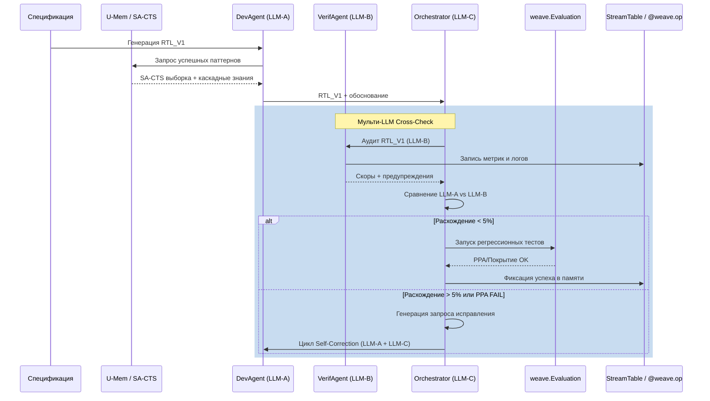
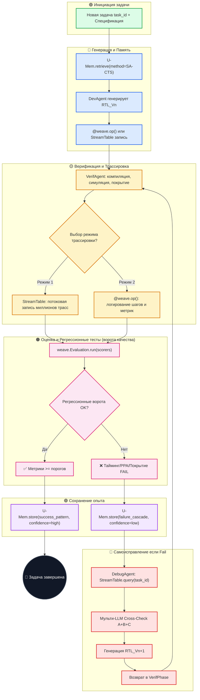

# 🔄 ChipGPT Agentic Loop Engineering: Архитектура замкнутого цикла и самоэволюции

> **Статус**: PRD | **Модуль**: Agentic Loop | **Обновлено**: 2026-06-30

Переход от статической **Agentic EDA-архитектуры** к динамической **Agentic Loop Engineering** меняет парадигму проектирования чипов. Вместо набора изолированных агентов, выполняющих разовые задачи, ChipGPT становится замкнутой, самоподдерживающейся экосистемой. Система не просто генерирует RTL и запускает симуляции — она непрерывно наблюдает, оценивает, запоминает опыт, корректирует ошибки и эволюционирует.

Архитектура строится на четырех фундаментальных контурах:
1. **U-Mem** — автономная долгосрочная память с каскадным извлечением знаний
2. **StreamTable / `@weave.op`** — потоковая и структурированная трассировка верификации
3. **`weave.Evaluation`** — регрессионная оценка и количественные ворота качества
4. **Цикл самоисправления** — автоматический поиск патчей, кросс-модельная проверка и безопасное развертывание

## 1. Дву-режимная архитектура (Dual-Mode Loop)

Для баланса между глубокой аналитикой и операционной скоростью ChipGPT поддерживает два режима работы, которые активируются в зависимости от критичности задачи, доступных ресурсов и фазы проектирования.

### 🔹 1.1 Режимы трассировки и логирования
| Режим | Механизм | Сценарий применения | Архитектура хранения |
|---|---|---|---|
| **Heavy Streaming Mode** | Интеграция `StreamTable` из W&B Weave в VerifAgent | Верификация сложных блоков, отладка таймингов, потоковая запись миллионов трасс MERASIC | Гибридная: TimescaleDB/InfluxDB (метаданные) + S3/MinIO (бинарные трассы) + Elasticsearch (поиск по сигналам) |
| **Standard Tracing Mode** | Декораторы `@weave.op()` на ключевых итерациях | Быстрые итерации генерации, оркестрация, SynAgent-оптимизация, CI/CD-пайплайны | Встроенное хранилище Weave Trace + REST API выгрузка |

### 🔹 1.2 Режимы памяти и оценки
| Режим | Механизм | Фокус | Метод извлечения/оценки |
|---|---|---|---|
| **Autonomous Memory Mode (U-Mem)** | Каскад знаний + Semantic-Aware Thompson Sampling (SA-CTS) | Долгосрочное улучшение, семантический поиск паттернов, обучение на ошибках | Дешевый синтаксис → средние симуляции → дорогие формальные/эмуляции. SA-CTS балансирует эксплуатацию/исследование |
| **Regression Evaluation Mode** | `weave.Evaluation` + исторические датасеты | Гарантия отсутствия регрессий, PPA-ворота, покрытие кода | Автоматический запуск скореров (`syntax_scorer`, `ppa_scorer`, `coverage_scorer`) на каждом коммите |

## 2. Мульти-LLM перекрестная верификация (Cross-Model Consensus)

Агенты ChipGPT не полагаются на единую LLM. Для минимизации галлюцинаций в RTL-генерации и принятия решений введена архитектура **Cross-Model Consensus**:

- **DevAgent** генерирует код на основе спецификации и U-Mem (модель `LLM-A`)
- **VerifAgent** анализирует логи и формирует скоры на другой модели (`LLM-B`)
- **Orchestrator** использует третью модель (`LLM-C`) для арбитража и формирования финального решения
- **Консенсус-порог:** Если расхождение между оценками > 5%, задача возвращается в цикл самоисправления с пометкой `AMBIGUOUS_STATE`

## 3. Технические вызовы и решения

### 📊 Масштабируемость StreamTable
**Вызов:** Обработка миллионов трасс MERASIC в реальном времени превышает пропускную способность стандартных реляционных СУБД.
**Стратегия:** Гибридная архитектура хранения.
- Метаданные (`StreamTable`) → TimescaleDB / InfluxDB (оптимизировано для time-series и агрегаций)
- Бинарные файлы трасс → S3 / MinIO с тегированием по хешам (`input_data_hash`, `task_id`)
- Поиск по сигналам/аномалиям → Elasticsearch, индексирующий только ключевые поля логов

### 💰 Стоимость и производительность EDA-инструментов
**Вызов:** Частые запуски коммерческих синтезаторов (Genus/DC) в цикле верификации ведут к неприемлемым затратам и задержкам.
**Стратегия:** «Градуированная верификация» (Graded Verification Cascade).
1. **L1 (Дешево/Быстро):** Open-source linters, Verilator, статический анализ
2. **L2 (Средне):** Симуляция на Verilator+UVM, базовые PPA-скоры
3. **L3 (Дорого):** Synthesis/STA только если `weave.Evaluation` показывает метрики близко к таргету
Это полностью синхронизировано с каскадом U-Mem: дорогостоящие сигналы запрашиваются только при высокой вероятности успеха.

### 🔌 Адаптация W&B Weave к EDA-домену
- **EDA-адаптеры:** Парсеры логов VCS/Xcelium/Genus, извлекающие `max_memory`, `timing_slack`, `power_estimate` в JSON-схему Weave
- **Deferred Logging:** При падении сети данные буферизуются в локальный SQLite и ретраятся с экспоненциальной задержкой
- **CI/CD-интеграция:** Каждый PR автоматически создает трассировку в Weave, сравнивает PPA-индекс с `main`-веткой и блокирует мерж при регрессии

## 4. Протокол жизненного цикла задачи (Loop Engineering Protocol)

Каждая задача в ChipGPT следует детерминированному протоколу, гарантирующему воспроизводимость и замкнутость.

## 5. Почему W&B Weave? (Преимущества над LangSmith / Arize)

W&B Weave выбран как фундамент наблюдаемости ChipGPT не случайно. В отличие от альтернатив, Weave предоставляет **беспрецедентный уровень прозрачности и контроля над всем процессом проектирования чипов, превращая его из «черного ящика» в полностью наблюдаемую и управляемую систему**.

| Критерий | LangSmith / Arize | W&B Weave |
|---|---|---|
| **Архитектура** | Жесткие абстракции (Chain/LCEL) | `@weave.op()` на любом Python-коде, гибкость без vendor-lock |
| **Интеграция с агентами** | Требует обертки над фреймворком | Встроенная поддержка MCP, логирование across multiple LLM-providers |
| **Оценка** | Отдельные модули эвалюации | `weave.Evaluation` + исторические датасеты + автоматические скореры |
| **Структурированность** | Логирование текста/JSON | Structured Tracing: дерево вызовов от Orchestrator до EDA-инструментов |
| **Единый рабочий процесс** | Раздельные UI для trace/eval/deploy | Целостная платформа: трассировка → оценка → развертывание в одном контуре |

Адаптация Weave для ChipGPT — это не настройка, а создание **специализированной инженерной платформы**. Она требует EDA-коннекторов, доменных схем и внедрения в CI/CD, но результат — полностью детерминированный цикл непрерывного улучшения.

## 6. Заключение: Будущее ChipGPT как самоэволюционирующей системы

Архитектура непрерывного улучшения, предложенная в этом отчете, представляет собой не просто техническое решение для автоматизации отдельных этапов проектирования чипов, а концептуальный прорыв, который определяет будущее всей отрасли EDA. Она воплощает в себе переход от инструментов, которые помогают инженеру, к системам, которые обладают собственным опытом, памятью и способностью к самоулучшению. Эта трансформация коренным образом меняет парадигму проектирования: от процесса, управляемого человеком, к процессу, управляемому системой, где человек выступает в роли стратега и архитектора, а не оператора.

**Ключевым достижением предложенной архитектуры является ее фундаментальная замкнутость.** Все четыре компонента — автономная память U-Mem, потоковая верификация через StreamTable, автоматическая оценка через `weave.Evaluation` и цикл исправления — не являются изолированными модулями, а составляют единый, самоподдерживающийся контур.
- Память U-Mem не просто хранит прошлое; она активно использует его для направления будущих действий.
- StreamTable не просто логирует настоящее; она создает цифровой двойник всего процесса, который становится источником данных для будущего обучения.
- `weave.Evaluation` не просто измеряет результат; она является «нервной системой», которая определяет, когда и что нужно исправить.
- И цикл исправления не просто устраняет ошибки; он превращает каждую неудачу в новый урок, который обогащает память и делает систему умнее.

ChipGPT, построенная по предложенной архитектуре, станет не просто инструментом, а партнером для инженера. Она будет учиться на его опыте, на опыте всей компании и на опыте всей отрасли, становясь с каждым днем все более компетентной, надежной и ценной. Она станет воплощением нового этапа в эволюции EDA — этапа, когда машины не просто вычисляют, а понимают, не просто генерируют, а создают, и не просто работают, а развиваются.