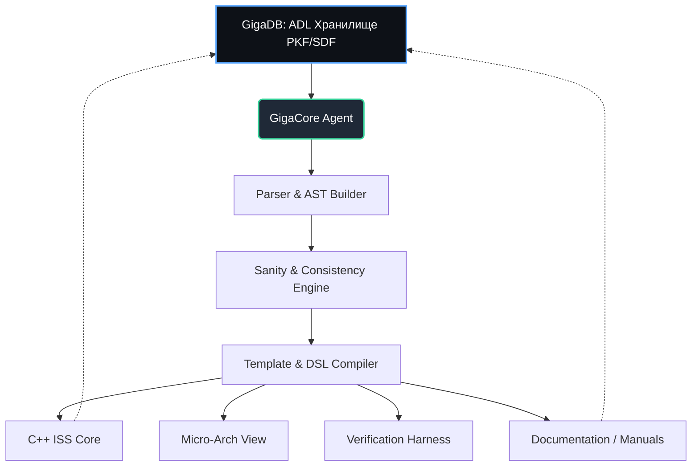

# GigaCore Agent: GigaDB как унифицированная ADL-база для генерации процессорных архитектур

---

## 1. Введение и роль в экосистеме ChipGPT
**GigaCore Agent** — ключевой Agentic EDA-агент платформы **ChipGPT**, отвечающий за автоматизированное проектирование и генерацию программных моделей процессоров (Instruction Set Simulators, ISS). Ядром агента выступает **GigaDB** — централизованное хранилище архитектурных параметров, выполняющее роль собственной **Architecture Description Language (ADL)**.

Цель системы: создать единый источник архитектурного референса (Ground Truth), из которого AI-агент автоматически генерирует:
- C++ код ISS (executable model)
- Микроархитектурные спецификации
- Тестовые обвязки и формальные модели верификации
- Синхронизированную техническую документацию

Подход позволяет масштабировать разработку на любые ISA с рынка: **VLIW, ARM, RISC-V, DSP, кастомные ускорители**, сохраняя консистентность на всех этапах жизненного цикла чипа.

---

## 2. Философия GigaDB: суть ADL-языка
Архитектура GigaDB базируется на принципе канонического хранения параметров. Каждая архитектурная сущность в базе описывается строгой структурой:

`[Primary Key (PKF)] + [Subsidiary Data Fields (SDF1..SDFn)]`

В контексте нашего ADL это превращается в декларативный, машиночитаемый формат:

- **Primary Key** — уникальный идентификатор сущности (мнемоника инструкции, имя регистра, кодовая группа, поле пакета).
- **Subsidiary Fields** — типизированные атрибуты, описывающие поведение и структуру:
  - `opN`: направление (src/dst), тип (reg/imm/mem), знакость, разрядность
  - `pretext / traps / posttext`: семантические правила выполнения, условия исключений, пост-обработка
  - `fields / size / address`: битовые поля регистров, доступ (RW/RO), базовые адреса
  - `meta`: теги для AI-агента, ссылки на спецификации, версии ISA

Такой подход исключает дублирование, обеспечивает строгую типизацию и делает базу идеальным кандидатом для автоматической генерации кода через GigaCore Agent.

---

## 3. Архитектура хранилища и поддержка мульти-ISA
GigaDB спроектирована как расширяемое хранилище с поддержкой **ISA Profiles**. Каждая целевая архитектура (VLIW, ARMv8, RISC-V RV32/64 и др.) подключается через схему расширений, не ломая ядро ADL.

| Компонент | Назначение |
|-----------|------------|
| `Core Schema` | Базовые типы, PKF/SDF контракты, валидаторы |
| `ISA Extension Packs` | Специфичные наборы инструкций, регистровых файлов, системных регистров |
| `View Generators` | Конфигурационные профили для генерации C++, uArch, Verif, Docs |
| `Sanity Engine` | Автоматическая проверка консистентности (битовые перекрытия, диапазоны, trap-совместимость, alignment) |

Масштабирование на новую архитектуру сводится к загрузке нового `ISA Pack` и запуску AI-валидации. GigaCore Agent автоматически индексирует параметры и готовит генерационные шаблоны.

---

## 4. Пайплайн генерации C++ кода ISS
Генерация исполняемой модели (Executable Model View, EMV) происходит в несколько этапов, полностью управляемых через GigaCore Agent:

1. **Загрузка и парсинг ADL** → Агент считывает PKF/SDF структуры из GigaDB, строит абстрактное синтаксическое дерево (AST) архитектуры.
2. **Генерация классов инструкций** → Для каждой мнемоники создаётся C++ класс-наследник базового `Instr`, содержащий мета-информацию об операндах и требованиях к state.
3. **Синтез метода `execute()`** → Поля `pretext / traps / posttext` транслируются в семантический DSL, который агент компилирует в чистый C++ код. Автоматически вставляются проверки переполнений, триггеры исключений, обновление регистрового файла.
4. **Подстановка в шаблоны** → Сгенерированные списки определений (`DefinitionList`) и методов выполнения (`ExecuteMethodList`) встраиваются в готовые `.h / .cpp` шаблоны проекта.
5. **Эмит файлов ISS** → На выходе формируется модульная структура, готовая к сборке, профилированию и интеграции в ChipGPT CI/CD.

Пример логики генерации:
```
GigaDB[Park: add8s] 
  → ADL_SDF(op1=dst,8,s,reg | op2=src,8,s,reg | op3=src,8,s,any)
  → ADL_SDF(pretext="result = src1 + src2", traps="OVERFLOW if < -2^63 or >= 2^63")
  → GigaCore Agent → class InstrAdd8s { void execute(InstrState& s) { ... } }
```

---

## 5. Двусторонняя синхронизация и AI-валидация
Одна из ключевых инноваций GigaDB — **двусторонняя связь между кодом, документацией и базой**.

- **AD → Docs**: Трансляционные инструменты автоматически преобразуют PKF/SDF в структурированные таблицы (MIF/Markdown/Asciidoc), генерируя актуальные архитектурные мануалы.
- **Docs → AD**: При внесении изменений в текстовые спецификации, GigaCore Agent распознаёт новые/изменённые таблицы, парсит их и обновляет GigaDB с автоматическим разрешением конфликтов.
- **Sanity Checks**: AI-валидатор проверяет согласованность битовых полей, отсутствие дублирующихся opcode, корректность trap-переходов, соответствие alignment-правилам ISA.
- **Consistency Enforcement**: Любое изменение в одном view (например, добавление инструкции в ADL) автоматически прокидывается во все зависимые view (ISS, uArch, Verif, Docs) без ручного вмешательства.

Это радикально снижает время итераций, исключает рассинхрон между командой разработки, компиляторщикам и верификаторами.

---

## 6. Сравнение с традиционными ADL (nML, LISA, SystemC-ADL)
GigaDB наследует лучшие практики декларативного описания ISA, заложенные в **nML (Target Compiler Technologies)**, но модернизирует их под требования AI-native EDA:

| Параметр | nML / Классические ADL | GigaDB (ChipGPT) |
|----------|------------------------|------------------|
| Формат хранения | Текстовые грамматики / парсеры | Структурированная PKF/SDF база данных |
| Генерация ISS | Компиляция грамматики в C/C++ | AI-агент + шаблонизация + DSL трансляция |
| Верификация / Документация | Отдельные тулчейны или ручная работа | Автоматическая генерация из единого источника |
| Масштабируемость ISA | Требует переписывания грамматик | Подключение новых ISA через профильные пакеты без изменения ядра |
| Валидация | Статическая проверка синтаксиса | Семантический AI Sanity Engine + cross-view consistency checks |
| Интеграция с EDA | Изолированный инструмент | Встроен в ChipGPT Agentic Pipeline |

GigaDB сохраняет декларативную мощь nML, но заменяет парсинг текстов на работу со строгой схемой, что даёт предсказуемость, скорость и возможность прямой интеграции с LLM-агентами ChipGPT.

---

## 7. Архитектурная схема потока данных



---

## 8. Заключение и дорожная карта
GigaCore Agent вместе с GigaDB формирует технологический фундамент ChipGPT для **автоматизированного проектирования процессорных ISA**. Внедрение ADL-базы позволяет:
- Сократить время генерации ISS с недель до часов
- Гарантировать 100% консистентность между кодом, документацией и верификацией
- Легко добавлять новые архитектуры (RISC-V extensions, VLIW clusters, AI-акселераторы)
- Интегрировать AI-валидацию и авто-рефакторинг на уровне архитектуры

**Следующие шаги:**
1. Реализация базового PKF/SDF парсера GigaDB
2. Интеграция Sanity Engine для RISC-V и VLIW профилей
3. Подключение C++ ISS генератора к CI/CD ChipGPT
4. Разработка UI/CLI для двусторонней синхронизации ADL ↔ Документация

---
*Документ поддерживается командой ChipGPT. Последнее обновление: май 2026.*

