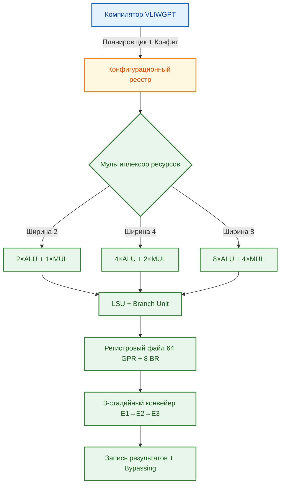
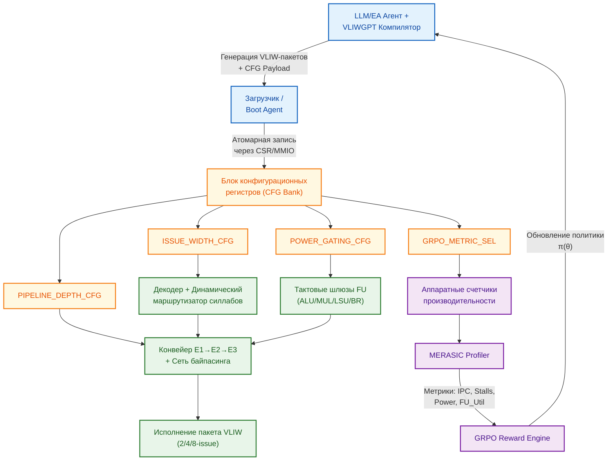
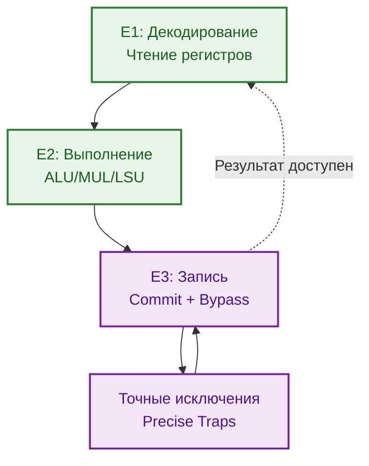
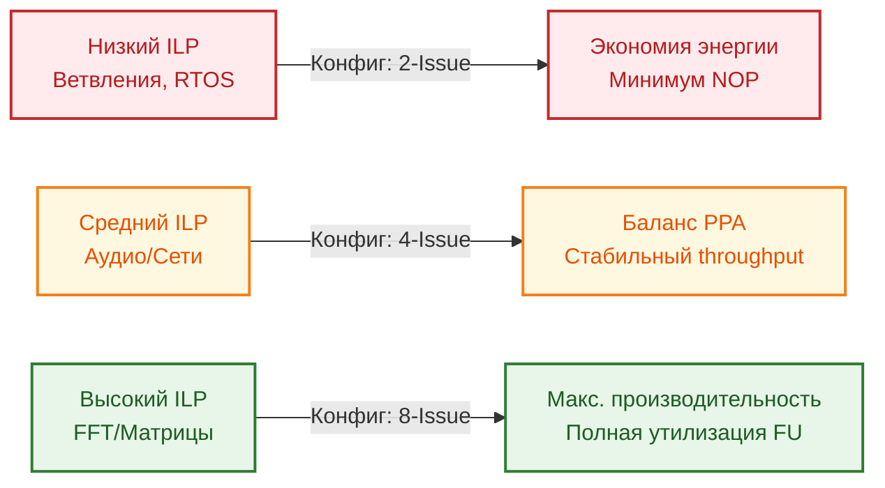
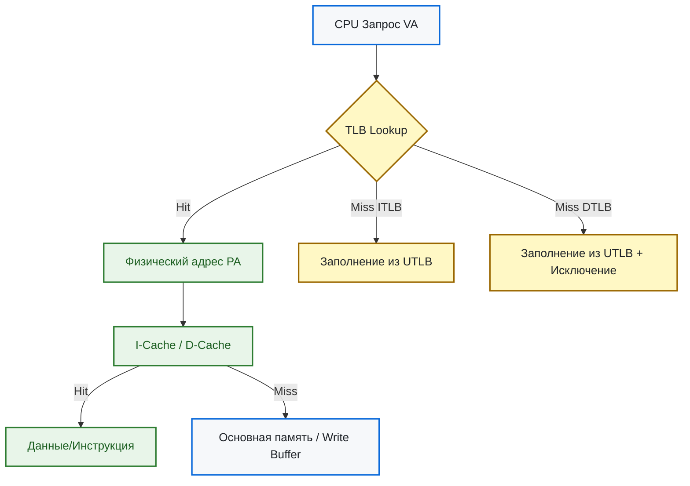
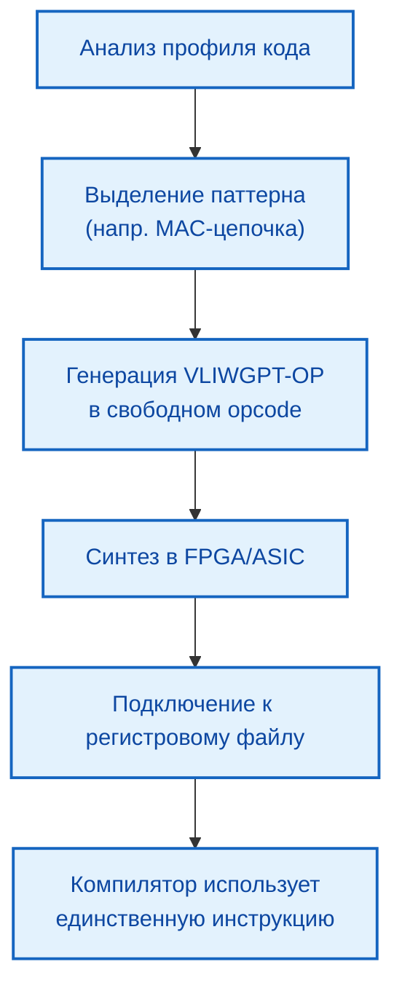
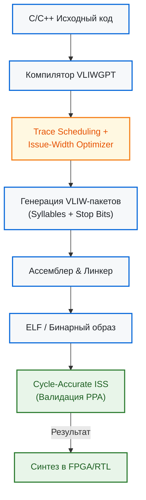
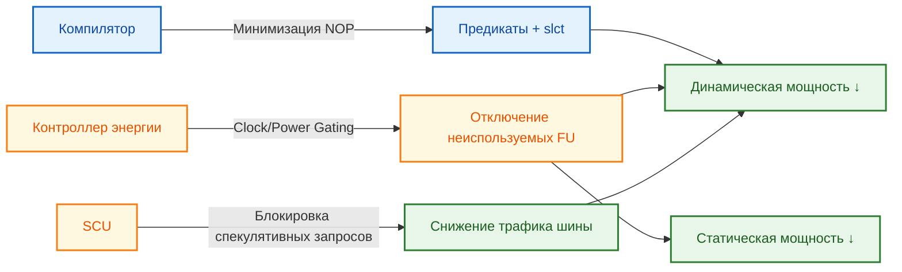

# Архитектура VLIWGPT: Параметризуемое VLIW-ядро с динамической конфигурацией

> **Аннотация**: Документ описывает архитектурную спецификацию VLIWGPT — масштабируемого VLIW-ядра, объединяющего проверенную модель исполнения VLIW ядер VEX-семейства с динамической параметризацией ширины командного слова (ширина bundle) и аппаратной реконфигурируемостью. Ключевой особенностью является адаптивная ширина командного слова (2/4/8 инструкций за такт), обеспечивающая оптимальный баланс между производительностью, энергопотреблением и ресурсами FPGA/ASIC.

---

## 1. Философия и обзор архитектуры

**VLIWGPT** спроектирована как мост между эффективностью фиксированных DSP-ядер и гибкостью программируемых логических матриц. Архитектура базируется на классической VLIW-парадигме, где параллелизм уровня инструкций (ILP) извлекается статически на этапе компиляции, а аппаратная часть обеспечивает детерминированное, предсказуемое выполнение.

В отличие от традиционных решений с фиксированным числом исполнительных блоков, VLIWGPT вводит **динамическую параметризацию ширины bundles (пакетов команд)**. Это позволяет ядру адаптироваться под характер целевых нагрузок: от энергоэффективных embedded-задач до высокопроизводительных DSP-потоков и тяжелых **AI-вычислений**.

В контексте архитектуры **VLIWGPT** эти элементы отражают ключевую идею **совместного проектирования компилятора и аппаратуры (Compiler-Hardware Co-Design)**. Вот подробное описание:

### 🔹 `|Планировщик + Конфиг|` (данные, идущие от компилятора)
Это **двойной вывод** компилятора VLIWGPT, который формируется на этапе трансляции C/C++ или ML-операторов в машинный код:
| Компонент | Что содержит | Зачем нужен |
|:---|:---|:---|
| **Планировщик (Schedule)** | Сами VLIW-пакеты (bundles): сгруппированные независимые инструкции, расставленные `stop`-биты, вставленные NOP'ы (если ILP недостаточен), раскладка операндов по регистрам. | Определяет **логику выполнения**: какие операции исполняются параллельно в каждом такте. |
| **Конфиг (Configuration)** | Набор аппаратных параметров, оптимальных для данного кода: ширина командного слова (`2/4/8` issue), набор активных функциональных блоков (ALU/MUL/LSU), глубина конвейера, режим предикатного исполнения, банковость регистрового файла. | Определяет **физическую структуру ядра**: как datapath, мультиплексоры и тактовые домены будут перестроены под конкретный workload. |

> 💡 Компилятор VLIWGPT не просто "упаковывает" инструкции. Он **анализирует профиль нагрузки** (матричные умножения, свёртки, ветвления) и генерирует **пару**: `(оптимальная планировка, оптимальная конфигурация железа)`.

---

### 🔹 `[Конфигурационный реестр]` (аппаратный блок в CPU)
Это **банк управляющих регистров (CSR / Control & Status Registers)** внутри ядра VLIWGPT, который принимает параметры от компилятора и применяет их к datapath и логике управления.

| Уровень | Функция |
|:---|:---|
| **Аппаратная** | Хранит битовые маски, которые управляют мультиплексорами, тактовым гейтингом (clock gating) неиспользуемых FU, шириной шины инструкций, режимом bypassing. |
| **Программная** | Доступен через memory-mapped I/O или специальные инструкции (`WRCONFIG`, `READCONFIG`). Записывается перед входом в вычислительное ядро (kernel) и восстанавливается при выходе. |
| **Динамическая** | Поддерживает фазовую переконфигуляцию: одна программа может содержать несколько блоков с разной конфигурацией, и реестр переключается между ними без полного сброса конвейера. |

---

### 🔗 Как они взаимодействуют (поток выполнения)
1. **Компиляция**: `LLVM/VLIWGPT-backend` анализирует IR, строит граф зависимостей, подбирает ширину командного слова и генерирует:
   - `.bin` с VLIW-пакетами
   - `.cfg` с битовой маской конфигурации
2. **Загрузка**: При старте потока (или вызове AI-ядра/DSP-фильтра) система записывает `.cfg` в `[Конфигурационный реестр]`.
3. **Применение**: Реестр за 1-2 такта перестраивает внутренние маршруты: активирует нужные ALU/MUL, отключает неиспользуемые шины, настраивает регистровый файл.
4. **Исполнение**: Ядро начинает вычитывать и декодировать `Результат Планировщика` в уже перестроенном datapath. IPC максимизируется, энергопотребление минимизируется.
5. **Восстановление**: По завершении блока реестр возвращается в состояние по умолчанию (или переключается на следующий `.cfg`).

---

### 📌 Практический пример в VLIWGPT
| Нагрузка | Генерируемый `Конфиг` | Поведение реестра | Эффект |
|:---|:---|:---|:---|
| **FIR-фильтр (DSP)** | `ISSUE_WIDTH=4, ALU=2, MUL=2, PRED=ON` | Активирует 2 MAC-цепочки, включает предикаты для ветвлений цикла | IPC ≈ 3.8, NOP < 5% |
| **Attention (AI)** | `ISSUE_WIDTH=8, ALU=4, MUL=4, PRED=OFF` | Разблокирует 2-ю группу FU, расширяет шину до 256 бит, отключает предикаты (линейный граф) | IPC ≈ 7.2, throughput ×2.1 |
| **RTOS** | `ISSUE_WIDTH=2, ALU=1, LSU=1, PRED=ON` | Отключает MUL-блоки (clock gating), сужает шину до 64 бит | Потребление ↓65%, площадь логики ↓40% |

---

### ✅ Почему это идеально для ChipGPT/GRPO

- **GRPO-агент** не просто учится «писать код». Он учится **выбирать конфигурацию железа под паттерн кода**. 
-- Для RTOS/ветвлений → `2-issue + глубокий bypassing`
-- Для DSP/свёрток → `4-issue + средний bypassing`
-- Для MatMul/Attention → `8-issue + полный bypassing`

- **Конфигурационный реестр** превращает статический VLIW в **фазово-адаптивную архитектуру**: ядро не фиксировано на этапе синтеза, а настраивается под workload уже на этапе загрузки/исполнения.
- Это позволяет VLIWGPT конкурировать с SIMD/WARP-решениями без усложнения аппаратуры: гибкость переносится в компилятор и управляющие регистры, что идеально ложится на FPGA/ASIC-гибриды.

---

### 🔄 Полная схема взаимодействия: Компилятор → Конфигурационные регистры → Конвейер

---
---

### 📐 Битовая структура конфигурационных регистров VLIWGPT

Регистры спроектированы с учетом наследия ST231/ρ-VEX, требований к динамической ширине командного слова (2/4/8) и аппаратной поддержки GRPO-петли. Доступ: `RW` (Read/Write), адресное пространство `0xF000_0000` (Memory-Mapped Configuration Space).

### 🔹 `CFG_ISSUE_CTRL` (0x00)
Управление шириной командного слова и маппингом силлабов на исполнительные блоки.

| Биты | Поле | R/W | Сброс | Описание |
|:---|:---|:---|:---|:---|
| [31:10] | `RESERVED` | RO | 0x00000 | Зарезервировано для будущих расширений |
| [9:8] | `SLOT_MAP_MODE` | RW | 0x0 | `00`: Фиксированный (ALU0-1, MUL0, LSU) `01`: Гибкий (Crossbar routing) `10`: SIMD-пакетный `11`: Зарезервировано |
| [7:6] | `ISSUE_WIDTH` | RW | 0x0 | `00`: 2-issue (Low power) `01`: 4-issue (Standard) `10`: 8-issue (HPC) `11`: Invalid |
| [5:0] | `STOP_BIT_POLICY` | RW | 0x01 | Битовая маска разрешенных позиций `stop bit` в пакете |

---

### 🔹 `CFG_FU_ENABLE` (0x04)
Динамическое включение/отключение функциональных блоков (Power Gating).

| Биты | Поле | R/W | Сброс | Описание |
|:---|:---|:---|:---|:---|
| [31:20] | `RESERVED` | RO | 0x000 | Зарезервировано |
| [19:16] | `LSU_MASK` | RW | 0xF | Битовая маска активных портов Load/Store |
| [15:12] | `BR_MASK` | RW | 0x1 | Активация ветвлений (обычно 1 блок) |
| [11:8] | `MUL_MASK` | RW | 0x3 | Битовая маска активных умножителей (0-3) |
| [7:0] | `ALU_MASK` | RW | 0xFF | Битовая маска активных АЛУ (0-7) |

> 💡 **Примечание для GRPO**: Компилятор/агент может отключить неиспользуемые ALU/MUL в режиме 2-issue, снижая статическое энергопотребление. Регистр читается профайлером для расчета `R_power`.

---

### 🔹 `CFG_PIPELINE_MODE` (0x08)
Настройка глубины конвейера, политик bypassing и обработки простоев.

| Биты | Поле | R/W | Сброс | Описание |
|:---|:---|:---|:---|:---|
| [31:6] | `RESERVED` | RO | 0x00000 | Зарезервировано |
| [5:4] | `BYPASS_DEPTH` | RW | 0x1 | `00`: Нет байпаса (строгая 3-тактная задержка) `01`: E1→E1 `10`: E1/E2→E1 `11`: Полный bypassing (E2/E3→E1) |
| [3:2] | `STALL_POLICY` | RW | 0x0 | `00`: Strict (точное соответствие зависимостям) `01`: Speculative (предсказание данных) `10`: Dismissible Loads (нулевая отдача при промахе) `11`: Dynamic (аппаратный арбитраж) |
| [1:0] | `PIPELINE_DEPTH` | RW | 0x1 | `00`: 1-такт (RISC-mode) `01`: 3-такт (Standard VLIW) `10`: 5-такт (Extended) `11`: Reserved |

---

### 🔹 `CFG_POWER_DOMAIN` (0x0C)
Управление тактовыми доменами и режимами сна.

| Биты | Поле | R/W | Сброс | Описание |
|:---|:---|:---|:---|:---|
| [31:4] | `RESERVED` | RO | 0x00000 | Зарезервировано |
| [3] | `CLK_GATE_IDLE` | RW | 0x1 | `1`: Гейтинг тактов при отсутствии готовности пакетов `0`: Постоянный такт |
| [2] | `MEM_STANDBY` | RW | 0x0 | Перевод кэшей/регистрового файла в low-leakage режим |
| [1:0] | `VOLTAGE_SCALE` | RW | 0x0 | `00`: Nominal `01`: Low-V (для 2-issue) `10`: High-V (для 8-issue) `11`: Invalid |

---

### 🔹 `CFG_GRPO_METRIC_SEL` (0x10)
Аппаратный селектор метрик для формирования Reward-сигнала.

| Биты | Поле | R/W | Сброс | Описание |
|:---|:---|:---|:---|:---|
| [31:12] | `RESERVED` | RO | 0x00000 | Зарезервировано |
| [11:8] | `STALL_WEIGHT` | RW | 0x5 | Вес штрафа за простои конвейера в формуле GRPO |
| [7:4] | `POWER_WEIGHT` | RW | 0x4 | Вес метрики энергопотребления |
| [3:0] | `IPC_WEIGHT` | RW | 0xF | Базовый вес производительности (IPC) |

> ⚙️ **Механизм работы**: Аппаратные счетчики (`PMC0..PMC3`) агрегируют данные за эпоху исполнения. По сигналу `GRPO_SYNC` значения передаются в `Reward Engine` как `R = w_IPC*IPC - w_STALL*Stall - w_POWER*PowerEst`.

---

### 🔗 Как это интегрируется в цикл VLIWGPT

1. **Генерация**: LLM+EA Agent анализирует workload и формирует `CFG Payload` + расписание силлабов.
2. **Запись**: Boot Agent атомарно записывает битовые маски в `CFG Bank` (через CSR или память).
3. **Реконфигурация**: Декодер перенастраивает маршруты, тактовые шлюзы активируют только нужные ALU/MUL, сеть байпасинга выбирает оптимальную глубину.
4. **Исполнение**: Конвейер обрабатывает VLIW-пакеты в заданном режиме (2/4/8-issue).
5. **Сбор метрик**: `MERASIC Profiler` читает счетчики, применяет веса из `CFG_GRPO_METRIC_SEL`, вычисляет `R_total`.
6. **Обучение**: GRPO обновляет политику компилятора, закрывая петлю HW/SW ко-эволюции.

---

## 2. Модель исполнения: Пакеты, Силлабы и Конвейер

### 2.1 Структура пакета (Bundle) и силлаба (Syllable)
Инструкция VLIWGPT представляет собой **пакет**, состоящий из 1–8 последовательных 32-битных слов (силлабов). Каждый силлаб кодирует одну микрооперацию или расширенный immediate операнд.
- **Бит останова (Stop Bit)**: Старший бит (bit 31) каждого силлаба маркирует конец пакета. Пакет завершается силлабом, где `stop=1`.
- **Ограничения кодирования**: Расширенные immediate значения размещаются на чётных адресах слов; операции умножения — на нечётных; потоковые переходы (branch/call/rfi) обязаны быть первым силлабом.

### 2.2 Конвейер и задержки
Ядро использует **3-стадийный конвейер** (E1 → E2 → E3):
1. **E1 (Decode & Operand Fetch)**: Чтение регистров, декодирование силлабов, проверка зависимостей.
2. **E2 (Execute)**: Вычисление в ALU/MUL, генерация адресов для LSU.
3. **E3 (Writeback & Commit)**: Запись в регистровый файл, обновление PC, обработка исключений.

Все операции в пакете коммитятся одновременно. Для снижения NOP-пробелов реализован **аппаратный bypassing**: результаты операций, доступные в E2 или E3, могут быть переадресованы на вход E1 последующих операций без ожидания записи в регистровый файл.

---

## 3. Динамическая параметризация ширины bundle (2/4/8)

Ключевая архитектурная инновация VLIWGPT — **гранулированная адаптивность ширины bundle**. Конфигурация задаётся на этапе компиляции/загрузки и определяет количество активных исполнительных блоков за такт.

| Режим | Ресурсы за такт | Целевой Workload | Энерго/Площадь |
|:---|:---|:---|:---|
| **2-Issue** | 2×ALU, 1×MUL, 1×LSU, 1×BR | Контроллеры, RTOS, последовательная логика | Минимальная статическая мощность, <30% логики FPGA |
| **4-Issue** | 4×ALU, 2×MUL, 1×LSU, 1×BR | Аудио/видео кодеки, сетевая обработка, умеренный DSP | Баланс производительности и TDP, ~55% логики |
| **8-Issue** | 8×ALU, 4×MUL, 1×LSU, 1×BR | FFT, фильтрация, матричные операции, HPC-ядра | Максимальная пропускная способность, высокая динамика |

Для задач с низким ILP (сложные ветвления, редкие независимые операции) узкая конфигурация (2/4) предотвращает генерацию пустых силлабов (NOP), снижая активность шин и потребление. Для регулярных вычислений (FFT, FIR-фильтры) режим 8-issue обеспечивает кратный рост IPC без изменения кода.

---

## 4. Подсистема памяти и трансляции адресов

### 4.1 Гарвардская архитектура и кэши
VLIWGPT использует раздельные пути кэширования инструкций (I-side) и данных (D-side):
- **I-Cache**: 32 КБ, прямой (direct-mapped), 512 линий по 64 байта. Инструкции всегда кэшируются.
- **D-Cache**: 32 КБ, 4-канальная ассоциативность, политика Write-Back. Поддержка партиционирования для locked-областей.
- **Write Buffer**: 4-записный LRU-буфер для объединения промахов D-Cache и снижения трафика шины.

### 4.2 TLB и виртуализация
Подсистема включает ITLB, DTLB и UTLB для трансляции 32-битных виртуальных адресов в физические. Размеры страниц: 8 КБ, 4 МБ, 256 МБ. UTLB управляется ПО, ITLB/DTLB работают как аппаратные кэши с LRU-замещением.

---

## 5. Реконфигурируемые аппаратные операции (VLIWGPT-OPS)

Помимо стандартного набора инструкций (ALU, MUL, LSU, Control), VLIWGPT резервирует область кодов операций для **пользовательских реконфигурируемых блоков (VLIWGPT-OPS)**. Это позволяет встраивать специализированные ускорители (криптография, нейронные сети, DSP-ядра) непосредственно в конвейер.

Операции VLIWGPT-OPS могут быть комбинаторными или последовательными, подключаются через свободные opcode-слоты и управляются тем же регистровым файлом. Компилятор автоматически отображает часто встречающиеся паттерны на эти блоки, генерируя одну длинную инструкцию вместо цепочки стандартных силлабов.

---

## 6. Инструментарий и HW/SW Co-Design

Эффективность VLIWGPT на **70%** определяется качеством компилятора. Инструментарий включает:
- **Trace Scheduling & Modulo Scheduling**: Автоматическое выделение ILP, раскрутка циклов, минимизация зависимостей.
- **Issue-Aware Optimizer**: Учитывает целевую ширину командного слова (2/4/8), предотвращает генерацию NOP при нехватке независимых операций.
- **Предикатное исполнение**: Инструкции `slct`/`slctf` заменяют ветвления на условные записи, снижая penalty конвейера.
- **Cycle-accurate ISS**: Cycle-accurate симулятор для валидации планирования, оценки IPC и генерации reward-сигналов для GRPO.

---

## 7. Энергоэффективность и управление питанием

VLIWGPT решает фундаментальную проблему фиксированных VLIW: избыточное энергопотребление при низкой утилизации. Архитектура применяет многоуровневую стратегию:

1. **Динамическое масштабирование ширины**: Переключение 2→4→8 issue отключает неиспользуемые ALU/MUL через clock gating.
2. **Управление простым**: Компилятор заполняет "окна" планировщика предикатными операциями вместо NOP, снижая активность шины декодирования.
3. **Раздельное питание для подсистем**: I-Cache, D-Cache, Write Buffer и регистровый файл имеют независимые домены питания (power domains), отключаемые в idle-режиме.
4. **Speculative Loads Control**: SCU (Speculative Control Unit) блокирует запросы к периферии при промахах кэша, предотвращая лишние шины транзакции.

---

## 8. Позиционирование и сравнительный анализ

VLIWGPT занимает уникальную нишу между коммерческими DSP и реконфигурируемыми матрицами (CGRA):

| Характеристика | TI C6000 (VelociTI) | ADI SHARC/Blackfin+ | ADRES (CGRA) | **VLIWGPT** |
|:---|:---|:---|:---|:---|
| **Ширина командного слова** | Фиксированная (4/8) | Фиксированная/ограниченная | Динамическая маршрутизация | **Параметризуемая (2/4/8)** |
| **Гибкость ISA** | Низкая (фиксированные FU) | Средняя (расширения) | Высокая (переконфигурация матрицы) | **Высокая (VLIWGPT-OPS + ширина)** |
| **Роль компилятора** | Критическая | Критическая | Сложный маппинг на CGRA | **Критическая + Issue-Aware** |
| **Целевая платформа** | ASIC DSP | ASIC DSP | FPGA/ASIC | **FPGA/ASIC с балансировкой PPA** |
| **Энергоэффективность** | Оптимизирована под DSP | Оптимизирована под аудио/связь | Зависит от routing overhead | **Адаптивная (зависит от ILP workload)** |

**Вывод**: VLIWGPT предлагает архитектурный компромисс, где аппаратная простота VLIW сочетается с динамической адаптацией к workload'у. Это делает ядро **идеальным кандидатом для AI-эволюции**: компилятор и GRPO-агент могут автоматически подбирать ширину командного слова и состав VLIWGPT-OPS, максимизируя IPC на Ватт без ручного проектирования микроархитектуры.