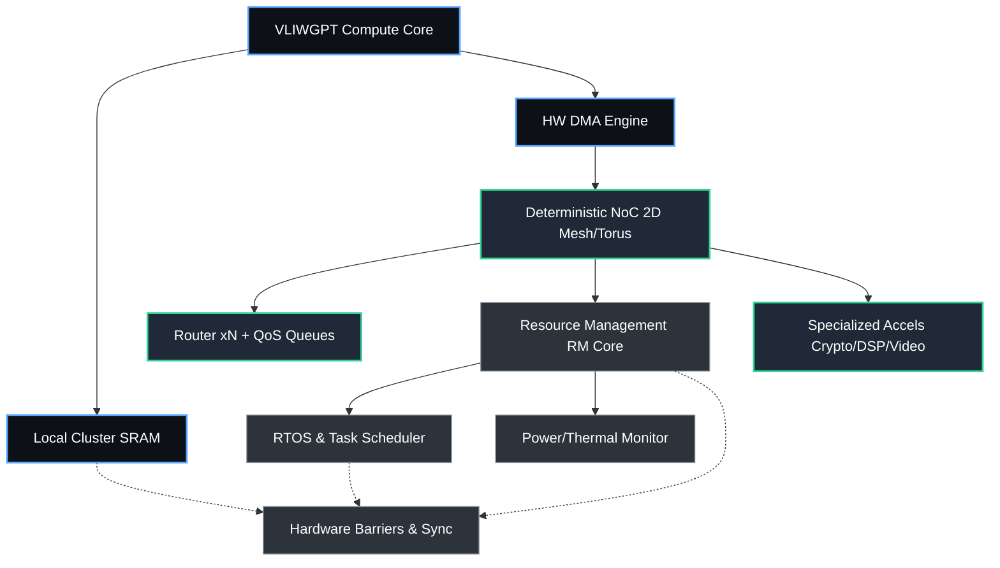

# 🌐 MPPA на базе ChipGPT: Детерминированная матрица от VLIW к Manycore-платформе

---

## 1. Введение: концепция MPPA в экосистеме ChipGPT
Massively Parallel Processor Array (**MPPA**) — это архитектурная парадигма, заменяющая хаотичную когерентность кэшей GPGPU на предсказуемую, детерминированную и масштабируемую систему. В рамках ChipGPT MPPA представляет собой логическую эволюцию базового ядра `VLIWGPT`: от одиночного оптимизированного кластера к гетерогенной матрице вычислительных узлов, связанных высокоскоростной **NoC (Network-on-Chip)** и управляемых автономными RM-ядрами (Resource Management).

Ключевое преимущество MPPA перед GPGPU — **гарантированное время отклика и изоляция workload-ов**. Вместо глобальной памяти и сложных протоколов когерентности используется явное управление данными, аппаратные DMA-движки и packet-switched маршрутизация. Это делает MPPA идеальным фундаментом для систем реального времени, где задержка критична, а энергоэффективность ограничена.

---

## 2. Аппаратная реализация: 4 ключевых класса блоков
Успешная реализация MPPA требует не просто копирования VLIW-ядер, а интеграции специализированных подсистем: детерминированной NoC, аппаратных DMA-движков, управляющих RM-ядер и специализированных ускорителей. Архитектура чипа в ChipGPT строится на четырёх строго определённых аппаратных доменах:

| Компонент | Назначение | Реализация в ChipGPT MPPA |
|-----------|------------|---------------------------|
| **1. Вычислительные кластеры (Compute Clusters)** | Исполнение задач, локальная обработка данных | Параметризуемые ядра `VLIWGPT` с локальной SRAM (256–512 KB), изолированными тактовыми доменами и low-power gating. Нет общей шины, нет кэш-когерентности. Каждый кластер автономен. |
| **2. Детерминированная NoC (Network-on-Chip)** | Межкластерная коммуникация, масштабирование | 2D Mesh / Torus с packet-switched маршрутизацией, QoS-очередями и гарантированной пропускной способностью (Guaranteed Service). Аппаратное избежание deadlock/livelock, предсказуемая латентность ≤2-3 такта на хоп. |
| **3. Явное управление памятью и DMA-движки** | Перемещение данных без участия CPU | Аппаратные DMA-контроллеры на пересечении кластеров и NoC. Программный explicit data movement: компилятор ChipGPT генерирует дескрипторы трансферов заранее, исключая cache-miss штрафы и contention. |
| **4. Система управления (RM-ядра) и ускорители** | Runtime, диспетчеризация, безопасность, специализация | Отдельные легковесные ядра (RISC-V/ARM-M класс) для RTOS, загрузки, мониторинга питания/температуры. Аппаратные барьеры, счётчики синхронизации, крипто/видео/DSP-акселераторы. Полная изоляция control-plane от data-plane. |

**Синтез системы:** Именно комбинация этих блоков превращает набор независимых ядер в единую платформу. NoC обеспечивает связность, DMA гарантирует предсказуемый трафик, RM-ядра (Resource Management) берут на себя системную логику, а VLIW-кластеры фокусируются исключительно на вычислениях. Результат — **детерминизм, масштабируемость и линейный рост производительности с увеличением числа узлов**.

---

## 3. Типичные рынки и применения MPPA
Архитектура MPPA занимает нишу между мощными, но энергозатратными GPGPU и узкоспециализированными ASIC. Её выбирают там, где критичны детерминизм, низкая задержка и работа в ограниченных тепловых бюджетах:

| Рынок | Задача | Почему MPPA |
|-------|--------|-------------|
| 🚗 Автономный транспорт (ADAS, Sensor Fusion) | Обработка лидаров, камер, радаров в реальном времени | Гарантия латентности, отсутствие jitter от кэш-промахов, изоляция критических задач |
| ✈️ Аэрокосмос и Оборонка | Радары, РЭБ, обработка сигналов, БПЛА | Радиационная стойкость (радиация легче локализуется), низкое энергопотребление, предсказуемость |
| 🏭 Промышленная автоматизация | Машинное зрение, робототехника, ПЛК | Детерминированный цикл управления, аппаратные синхронизаторы, отказ от сложных ОС |
| 🏥 Медицинская визуализация | УЗИ, МРТ, КТ в реальном времени | Высокая пропускная способность данных, явное управление памятью, отсутствие артефактов |
| 📡 Телеком и Edge AI | Базовая станция 5G/6G, NFV, инференс на периферийных устройствах | Масштабируемость, аппаратное шифрование, независимость от облака |

---

## 4. Дорожная карта разработки MPPA в ChipGPT
Переход от базового `VLIWGPT` к полноценной MPPA-матрице реализуется через замкнутый эволюционный цикл, управляемый Agentic EDA и GRPO:

| Этап | Цель | Роль ChipGPT / GRPO |
|------|------|---------------------|
| **Фаза I: Оптимизация и валидация базового ядра** | Оптимизация VLIWGPT (ILP, low-power, CGPE, FPU/BF16) | Агент подбирает параметры кластера, минимизирует критический путь, готовит ядро к тиражированию. |
| **Фаза II: Инфраструктура NoC и аппаратные DMA-движки** | Проектирование 2D Mesh, интеграция DMA-движков, explicit memory model | GRPO оптимизирует ширину каналов, буферы маршрутизаторов, пороги срабатывания DMA. Формальная верификация absence of deadlock. |
| **Фаза III: Control-Plane & Синхронизация** | Внедрение управляющих ядер (Resource Management, RM) и аппаратных барьеров, RTOS-уровня | LLM-агент генерирует микрокод диспетчера, настраивает прерывания, валидирует handshake-протоколы через ISS. |
| **Фаза IV: Системная интеграция** | Объединение всех блоков, запуск MERASIC-бенчмарков | Многоуровневая co-simulation: RTOS → NoC traffic → DMA transfers → VLIW execution. Оценка PPA на матрице 4×4 → 8×8. |
| **Фаза V: Sign-off & Tape-out Prep** | Формальный proof, тайминг, power gating sign-off | AlphaEvolve + Formality доказывают доказывают корректность во всех крайних случаях и пограничных условиях. Генерация GDSII-готовых макроблоков, подготовка к кремнию. |

**Критерий перехода к следующей фазе:** `Functional Coverage > 99.99%`, `NoC Latency ≤ Target`, `Power Envelope Met`, `Deadlock/Freedom = Proven`.

---

## 5. Схема архитектуры чипа MPPA

---

## 6. Заключение
**MPPA в ChipGPT** — это не просто «много ядер на одном кристалле». Это системно-инженерный подход, где **предсказуемость важнее пиковой производительности**, а **явное управление данными заменяет сложную когерентность**. Сочетая оптимизированное VLIW-ядро, детерминированную NoC, аппаратные DMA и изолированные RM-ядра, мы получаем платформу, готовую к задачам Edge AI, автономных систем и промышленного реального времени.

Благодаря **Agentic EDA**-петли, каждый компонент проходит эволюционную оптимизацию: от параметров конвейера до маршрутов пакетов в NoC. Это гарантирует, что итоговая матрица будет не только функционально корректной, но и оптимальной по PPA на уровне, недоступном ручному DSE.

**Следующие шаги:**
1. Фиксация параметров VLIWGPT-кластера для тиражирования (Эпоха II)
2. Разработка RTL-шаблона 2D Mesh Router и DMA-контроллера
3. Интеграция RM-ядра и генерация дескрипторов explicit data movement в компиляторе
4. Запуск GRPO-оптимизации NoC routing и QoS-полос на MERASIC-бенчмарках
5. Формальная верификация absence of deadlock/livelock перед масштабированием до 4×4 матрицы

---
*Документ поддерживается командой ChipGPT. Для вопросов по MPPA-архитектуре, NoC-маршрутизации и системной верификации обращайтесь к каналу `#chipgpt-mppa-system-design`.*