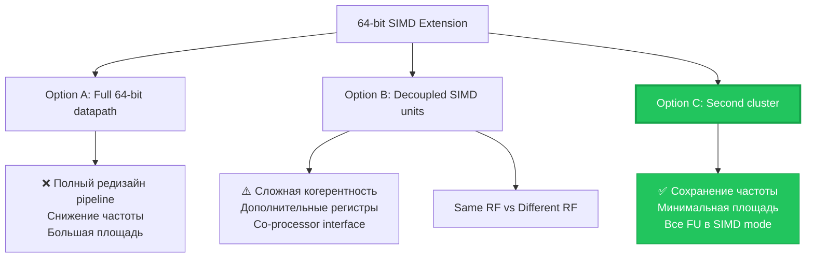
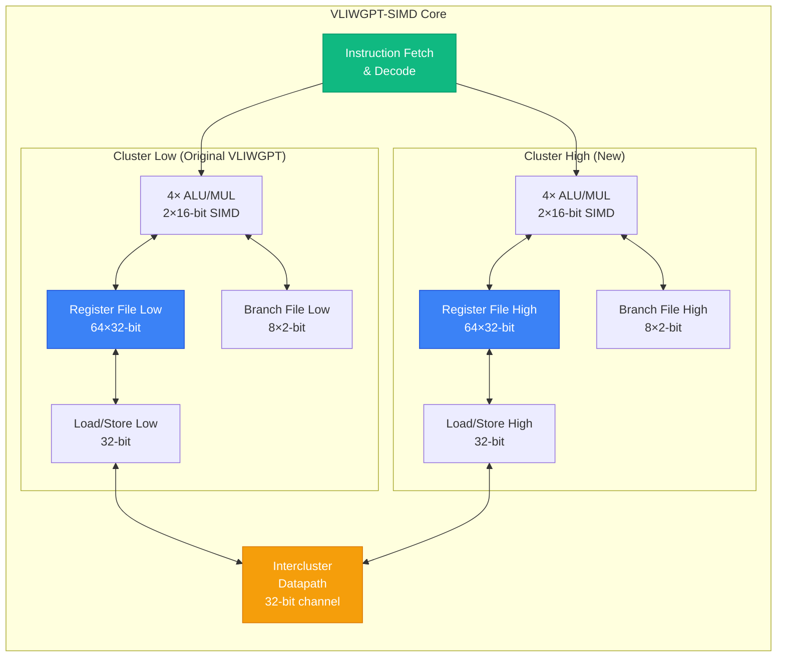
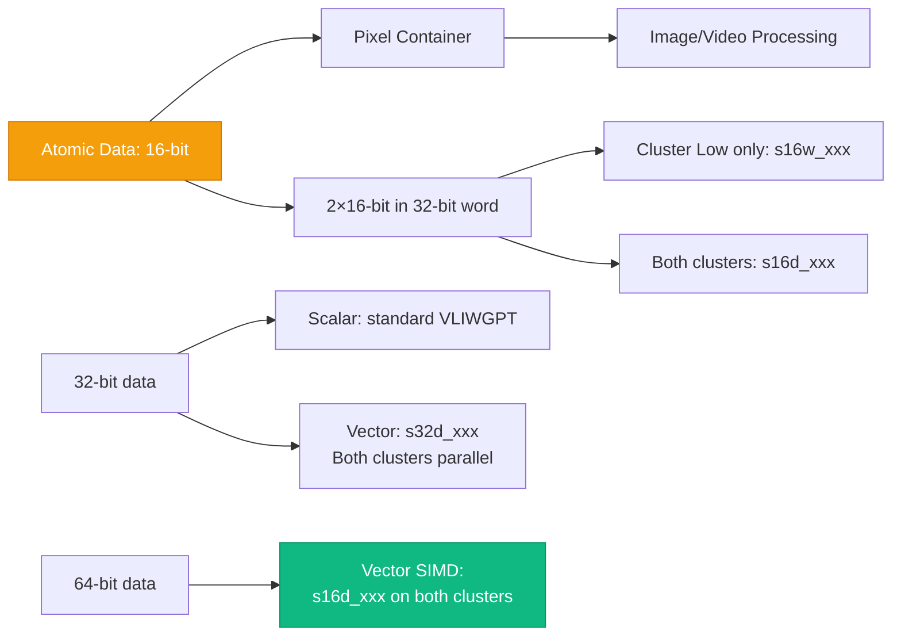
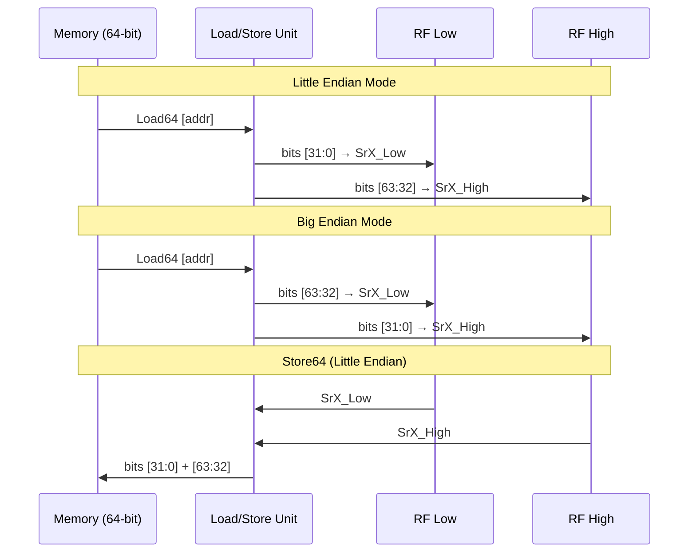
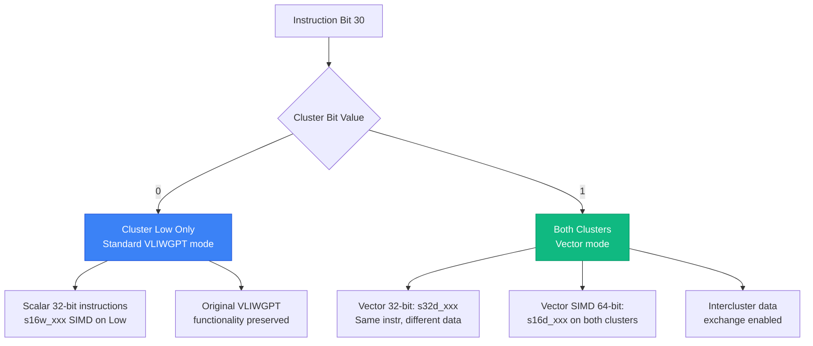
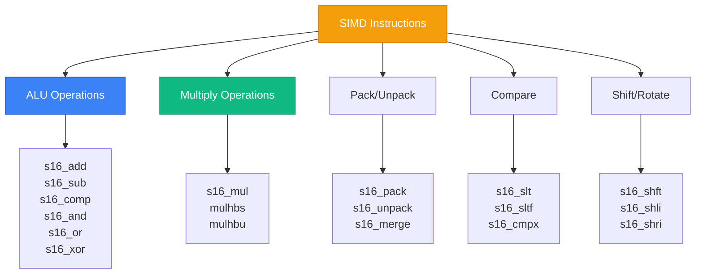
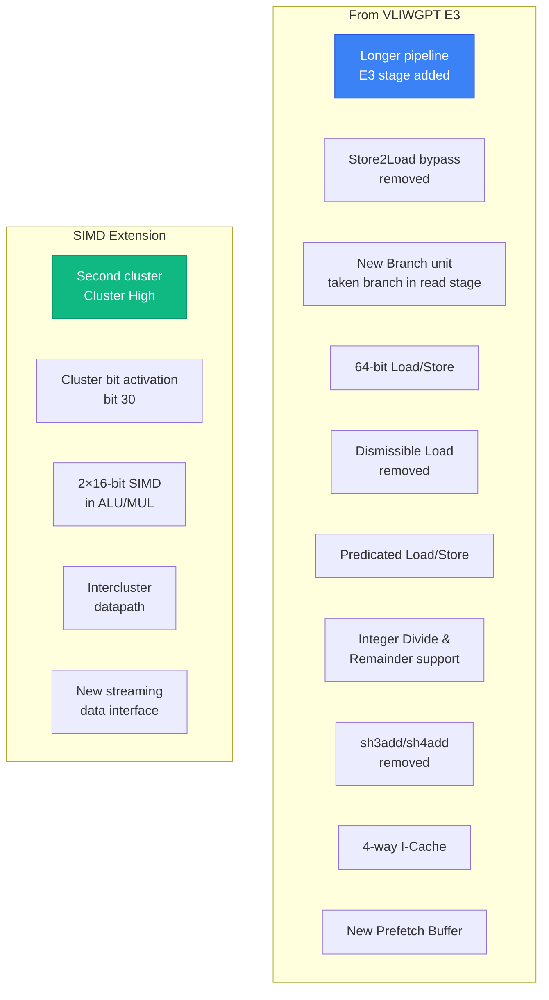
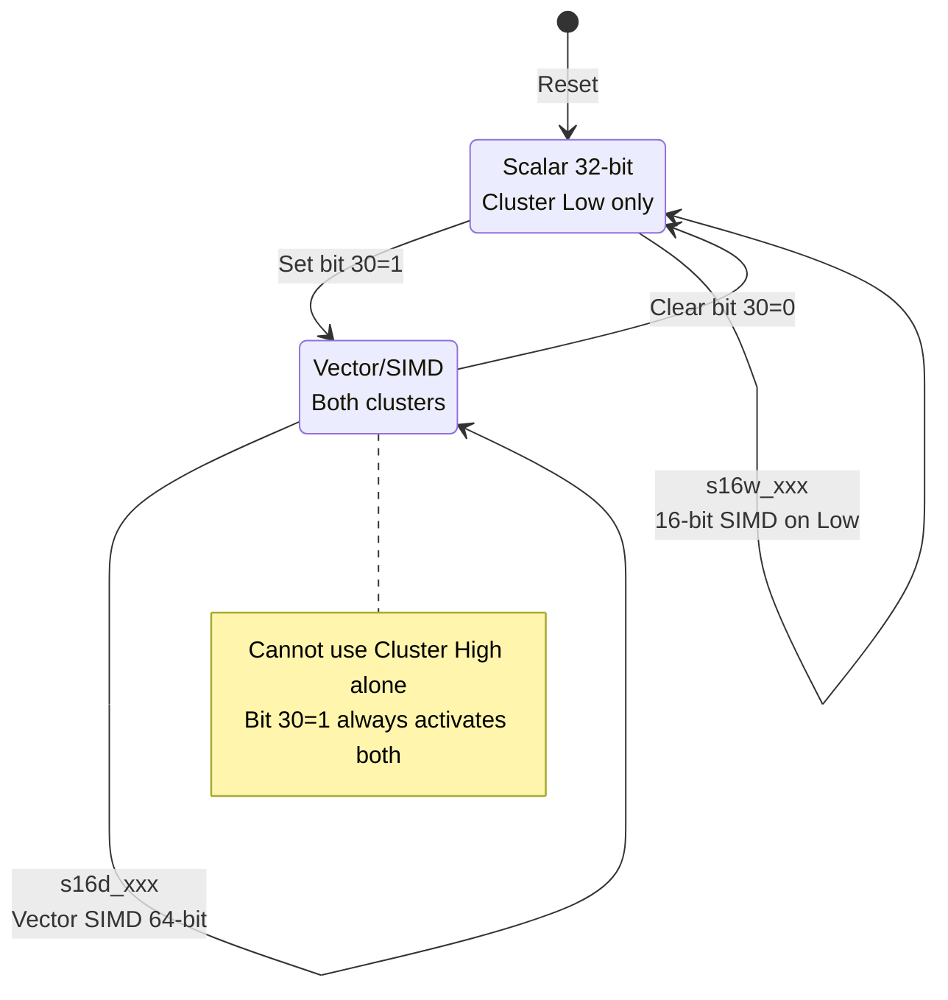
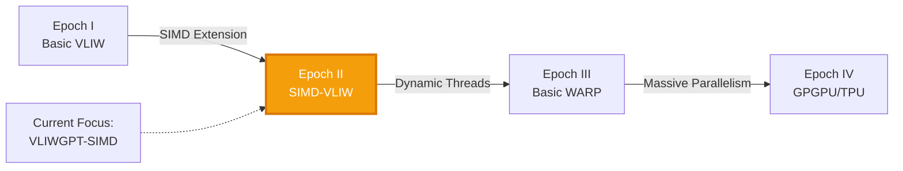
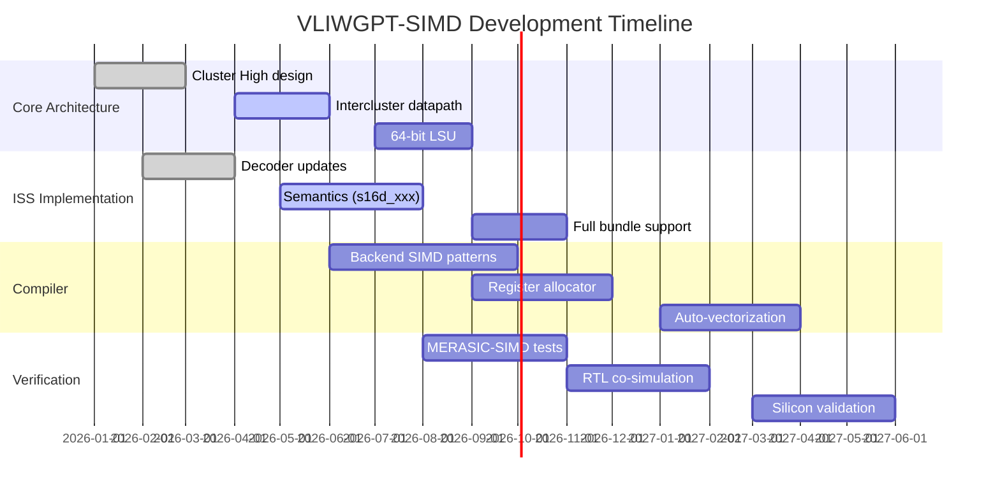

# 🧬 VLIWGPT-SIMD: Архитектура Эпохи II

> **Статус**: Active Development  
> **Версия**: 1.0.0  
> **Последнее обновление**: 2026-06-10  
> **Связанные документы**: [Эволюционная парадигма](#/wiki/evolutionary-paradigm) | [Эпоха I: Basic VLIW](#/wiki/platforms/vliwgpt-rvex-platform) | [Эпоха III: Basic WARP](#/wiki/evolution/vliw-to-warp-scheduler)

---
<!--
## 📋 Содержание

1. [Введение и мотивация](#1-введение-и-мотивация)
2. [Архитектурный обзор](#2-архитектурный-обзор)
3. [Кластерная организация](#3-кластерная-организация)
4. [Система команд SIMD](#4-система-команд-simd)
5. [Микроархитектурные изменения](#5-микроархитектурные-изменения)
6. [Модель программирования](#6-модель-программирования)
7. [Интеграция с ChipGPT](#7-интеграция-s-chipgpt)
8. [Спецификации и метрики](#8-спецификации-и-метрики)

-->
---

## 1. Введение и мотивация

### 1.1 Цели расширения SIMD

Переход от базовой VLIW-архитектуры (Эпоха I) к **VLIWGPT-SIMD** (Эпоха II) обусловлен тремя фундаментальными требованиями современных мультимедийных и DSP-приложений:

#### 🎯 Ключевые преимущества

| Преимущество | Механизм достижения | Практический эффект |
|--------------|---------------------|---------------------|
| **📈 Производительность** | Параллелизм на уровне данных (DLP) + параллелизм на уровне инструкций (ILP) | До 4× ускорение для векторных операций |
| **💾 Размер кода** | Одна инструкция обрабатывает несколько элементов данных | Сокращение на 30-50% для типичных multimedia-алгоритмов |
| **⚡ Энергоэффективность** | Меньше инструкций → меньше переключений → меньше энергопотребления | Снижение энергопотребления на 25-40% |

### 1.2 Области применения

VLIWGPT-SIMD ориентирована на критически важные приложения обработки сигналов:

**Imaging Pipeline:**
- Bayer → RGB конвертация (Image Generation Pipeline)
- Фильтрация, интерполяция, цветокоррекция
- Операции над пикселями (16-bit atomic data)

**Video Processing:**
- MPEG-4 кодирование/декодирование
- Motion estimation & compensation
- DCT/IDCT преобразования

**DSP Algorithms:**
- FFT (Fast Fourier Transform)
- FIR/IIR фильтры
- Matrix operations для ML inference

### 1.3 Ортогональность параллелизма

Ключевая архитектурная инновация VLIWGPT-SIMD — **объединение двух ортогональных форм параллелизма**:

```
                    VLIW (ILP)
                       │
          ┌────────────┴────────────┐
          │                         │
     Scalar ops               Vector ops
          │                         │
          └────────────┬────────────┘
                       │
                  SIMD (DLP)
                       │
          ┌────────────┴────────────┐
          │                         │
     16-bit SIMD              32-bit SIMD
    (2×16-bit lanes)        (2×32-bit lanes)
```

Это позволяет одному VLIW-bundle одновременно содержать:
- Скалярные инструкции (32-bit)
- Векторные инструкции (SIMD 32-bit)
- SIMD-инструкции (2×16-bit)

**Пример bundle:**
```assembly

c0 s16w_and  $r0.30 = $r0.30, $r0.51    # 16-bit SIMD (Cluster Low)
c0 maxu      $r0.48 = $r0.44, $r0.33    # Scalar 32-bit
c0 s32d_r    $r0.43 = $r0.41, $r0.31    # Vector 32-bit (Both clusters)
c0 s16d_add  $r0.45 = $r0.29, $r0.42    # 16-bit SIMD (Both clusters)
```

---

## 2. Архитектурный обзор

### 2.1 Выбор архитектурного подхода

При проектировании 64-bit SIMD расширения были рассмотрены три основных варианта:



**Выбранный подход: Option C** — добавление второго кластера (Cluster High)

**Обоснование:**
1. **Сохранение тактовой частоты** — не требуется полный редизайн критических путей
2. **Максимальная утилизация FU** — все функциональные блоки участвуют в SIMD-вычислениях
3. **Минимальное увеличение площади** — симметричное расширение существующей архитектуры

### 2.2 Высокоуровневая архитектура


### 2.3 Ключевые компоненты

| Компонент | Cluster Low | Cluster High | Примечания |
|-----------|-------------|--------------|------------|
| **ALU/MUL** | 4 unit | 4 unit | Поддержка 2×16-bit SIMD |
| **Register File** | 64×32-bit | 64×32-bit | Физически раздельные банки |
| **Branch Register File** | 8×2-bit | 8×2-bit | Для SIMD select инструкций |
| **Load/Store Unit** | 32-bit | 32-bit | Совместно образуют 64-bit LSU |
| **Intercluster Channel** | ←→ 32-bit ←→ | | Обмен данными между кластерами |

---

## 3. Кластерная организация

### 3.1 Концепция Cluster Low / Cluster High

Архитектура VLIWGPT-SIMD реализует **симметричное расширение** базового ядра через добавление второго идентичного кластера:

```
         64-bit Data Path
    ┌────────────────────────┐
    │                        │
    │   Cluster High         │   Cluster Low
    │   (Upper 32 bits)      │   (Lower 32 bits)
    │                        │
    │  ┌──────────┐         │   ┌──────────┐
    │  │ RF High  │         │   │  RF Low  │
    │  │ 64×32bit │         │   │ 64×32bit │
    │  └──────────┘         │   └──────────┘
    │        │              │         │
    │  ┌──────────┐         │   ┌──────────┐
    │  │ ALU/MUL  │         │   │ ALU/MUL  │
    │  │ 2×16simd │         │   │ 2×16simd │
    │  └──────────         │   └──────────┘
    │        │              │         │
    │  ┌──────────┐         │   ┌──────────
    │  │ LSU High │◄───────►│   │  LSU Low │
    │  │  32-bit  │  32-bit │   │  32-bit  │
    │  └──────────┘ channel │   └──────────
    └────────────────────────┘
```

**Принцип работы:**
- Машина выполняет **одну и ту же инструкцию** одновременно на обоих кластерах
- Данные обрабатываются параллельно: lower 32-bit в Cluster Low, upper 32-bit в Cluster High
- Это создаёт **векторные инструкции VLIWGPT**, работающие с 64-bit данными

### 3.2 Форматы данных и атомарные единицы



**Атомарная единица данных: 16-bit**
- Оптимальный контейнер для пикселей изображений и видео
- Каждый кластер поддерживает 16-bit арифметические SIMD-инструкции:
  - `s16_mul` — умножение
  - `s16_add` — сложение
  - `s16_sub` — вычитание
  - `s16_comp` — компарация
  - `s16_shft` — сдвиги

### 3.3 Регистровые файлы

#### General Purpose Register File

```
┌─────────────────────────────────────────────────────────┐
│             64-bit Register File (Logical)              │
├──────────────────────┬──────────────────────────────────┤
│   Register File High │    Register File Low             │
│   64 registers × 32-bit  │    64 registers × 32-bit     │
│   [63:32] bits       │    [31:0] bits                   │
└──────────────────────┴──────────────────────────────────┘
         │                           │
         │                           │
    Cluster High                Cluster Low
    
64-bit instruction execution:
  - Reads 32 high bits from RF High
  - Reads 32 low bits from RF Low
  - Writes result to both RFs
```

**Характеристики:**
- **Физическая реализация**: Два раздельных банка по 64 регистра × 32-bit
- **Логическое представление**: 64 регистра × 64-bit
- **Доступ**: 64-bit инструкция автоматически читает/пишет в оба банка

#### Branch Register File

```
┌────────────────────────────────────────┐
│   Branch Register File (per cluster)   │
├────────────────────────────────────────┤
│  8 registers × 2-bit each              │
│                                        │
│  BR0: [1:0]   BR4: [1:0]              │
│  BR1: [1:0]   BR5: [1:0]              │
│  BR2: [1:0]   BR6: [1:0]              │
│  BR3: [1:0]   BR7: [1:0]              │
└────────────────────────────────────────┘
```

**Назначение:**
- Дублируется в каждом кластере для поддержки SIMD select инструкций
- Используется для:
  - Условных операций (`s16_slt`, `s16_sltf`)
  - Предикатного выполнения
  - Ветвлений

### 3.4 Load/Store Unit

**64-bit Load/Store возможности:**



**Операции:**
- **Load64 (`l64`)**: Чтение 64-bit слова из памяти
  - Little Endian: `[31:0]` → RF Low, `[63:32]` → RF High
  - Big Endian: `[63:32]` → RF Low, `[31:0]` → RF High
  
- **Store64 (`std`)**: Запись 64-bit слова в память
  - Little Endian: RF Low → `[31:0]`, RF High → `[63:32]`
  - Big Endian: RF Low → `[63:32]`, RF High → `[31:0]`

  ### 3.5 Intercluster Communication

**Межкластерный канал связи:**

```
┌─────────────────┐         32-bit          ┌─────────────────┐
│  Cluster Low    │ ◄─────────────────────► │  Cluster High   │
│                 │      Intercluster       │                 │
│  RF Low         │        Datapath         │  RF High        │
│  ALU/MUL        │   ┌─────────────────┐   │  ALU/MUL        │
│  LSU Low        │   │  • movhl        │   │  LSU High       │
│                 │   │  • movlh        │   │                 │
│                 │   │  • s16d_or_vec  │   │                 │
│                 │   └─────────────────┘   │                 │
└─────────────────┘                         └─────────────────┘
```

**Функции:**
1. **Обмен данными** между кластерами:
   - `movhl` (move high to low): RF High → RF Low
   - `movlh` (move low to high): RF Low → RF High
   
2. **Специализированные операции**:
   - `s16d_or_vec`: Векторная OR с участием обоих кластеров

3. **64-bit операции без явного разделения**:
   - Прямая обработка 64-bit данных без ручного разбиения на 32-bit части

---

## 4. Система команд SIMD

### 4.1 Активация кластеров (Cluster Bit)

**Bit 30 инструкции** управляет режимом работы процессора:



**Поддерживаемые режимы:**

| Bit 30 | Режим | Описание | Примеры инструкций |
|--------|-------|----------|-------------------|
| **0** | Standard VLIWGPT | Только Cluster Low, скалярные 32-bit инструкции | `add`, `mul`, `load` |
| **0** | SIMD 16-bit (Low) | Только Cluster Low, 16-bit SIMD | `s16w_add`, `s16w_mul` |
| **1** | Vector 32-bit | Оба кластера, одна инструкция на разных данных | `s32d_and`, `s32d_or` |
| **1** | Vector SIMD 64-bit | Оба кластера, 16-bit SIMD на 64-bit данных | `s16d_add`, `s16d_mul` |
| **1** | Intercluster | Обмен данными между кластерами | `movhl`, `movlh` |

**Важное ограничение:**
- ⚠️ **Cluster High не может работать изолированно**
- Bit 30=0 → только Cluster Low
- Bit 30=1 → оба кластера одновременно

### 4.2 Векторные инструкции (Vectorial Instructions)

**Активация:** Bit 30 = 1

**Принцип:** Одна стандартная 32-bit инструкция выполняется **параллельно** на обоих кластерах с разными данными.

```
Instruction: s32d_and $r5 = $r3, $r7

Cluster Low:  $r5_low[31:0]  = $r3_low[31:0]  AND $r7_low[31:0]
Cluster High: $r5_high[63:32] = $r3_high[63:32] AND $r7_high[63:32]

Result: 64-bit AND operation in one cycle
```

**Префикс:** `s32d_` (32-bit dual-cluster)

**Поддерживаемые инструкции (текущая реализация ISS):**
- `s32d_and`  — побитовое И
- `s32d_andc` — И с комплементом
- `s32d_or`   — побитовое ИЛИ
- `s32d_orc`  — ИЛИ с комплементом
- `s32d_xor`  — исключающее ИЛИ

**Пример кода:**
```assembly
# 64-bit vector AND
s32d_and $r10 = $r2, $r4    # $r10[63:0] = $r2[63:0] & $r4[63:0]

# Эквивалентно двум скалярным операциям:
# Cluster Low:  $r10_low  = $r2_low & $r4_low
# Cluster High: $r10_high = $r2_high & $r4_high
```

### 4.3 SIMD инструкции (16-bit)

**Префиксы:**
- `s16w_` — SIMD на **одном** кластере (word, 32-bit data = 2×16-bit)
- `s16d_` — SIMD на **обоих** кластерах (dual, 64-bit data = 4×16-bit)

**Разница в opcode:**
```
Bit 30 (Cluster bit):
  s16w_xxx → bit 30 = 0 (Cluster Low only)
  s16d_xxx → bit 30 = 1 (Both clusters)

Bits [20:18] = 3'b011 → SIMD instruction marker
```

#### Категории SIMD инструкций



#### Примеры инструкций

**1. Арифметические операции:**
```assembly
# 2×16-bit addition (Cluster Low only)
s16w_add $r5 = $r3, $r7
# $r5[31:0] = { $r3[31:16]+$r7[31:16], $r3[15:0]+$r7[15:0] }

# 4×16-bit addition (Both clusters)
s16d_add $r5 = $r3, $r7
# $r5[63:0] = 4 parallel 16-bit additions
```

**2. Pack/Unpack инструкции:**
```assembly
# Pack two 32-bit registers into 16-bit elements
s16w_pack $r10 = $r2, $r4
# $r10[31:16] = $r2[15:0]
# $r10[15:0]  = $r4[15:0]

# Unpack 16-bit elements to 32-bit
s16w_unpack $r10 = $r2
# $r10[31:0] = zero_extend($r2[15:0])
# $r11[31:0] = zero_extend($r2[31:16])
```

**3. Compare & Select:**
```assembly
# SIMD compare: set if less than
s16w_slt $r5 = $r3, $r4
# if ($r3[31:16] < $r4[31:16]) $r5[31:16] = 0xFFFF else 0x0000
# if ($r3[15:0]  < $r4[15:0])  $r5[15:0]  = 0xFFFF else 0x0000

# Conditional select
s16d_sct $r10 = $r2, $r4, $r6
# if (pred) $r10 = $r4 else $r10 = $r6
```

**4. Multiply with saturation:**
```assembly
# Multiply high halfwords signed
mulhbs $r17 = $r45, 0x5
# $r17 = ($r45[31:16] * 0x5)[31:16] (signed, saturated)
```

### 4.4 Инструкции межкластерного обмена

**Специализированные инструкции для работы с обоими кластерами:**

| Инструкция | Описание | Семантика |
|------------|----------|-----------|
| `movhl` | Move High to Low | RF High → RF Low |
| `movlh` | Move Low to High | RF Low → RF High |
| `s16d_or_vec` | Векторная OR | Специализированная операция с участием обоих кластеров |

**Пример:**
```assembly
# Exchange data between clusters
movhl $r8 = $r12      # $r8_low = $r12_high
movlh $r9 = $r11      # $r9_high = $r11_low

# Now $r8 and $r9 contain swapped halves
```

### 4.5 64-bit инструкции Load/Store

**Синтаксис:**
```assembly
# Load 64-bit value from memory
l64 $r10 = [$r2 + 8]
# Loads 8 bytes from address ($r2 + 8)
# Lower 32 bits → $r10_low (Cluster Low)
# Upper 32 bits → $r10_high (Cluster High)

# Store 64-bit value to memory
std $r10 = [$r2 + 8]
# Stores $r10_low and $r10_high to memory
```

**Endianness:**
- **Little Endian** (по умолчанию):
  - Load: `[31:0]` → RF Low, `[63:32]` → RF High
  - Store: RF Low → `[31:0]`, RF High → `[63:32]`

- **Big Endian**:
  - Load: `[63:32]` → RF Low, `[31:0]` → RF High
  - Store: RF Low → `[63:32]`, RF High → `[31:0]`

### 4.6 Скалярные инструкции с Branch Register File

**Использование Branch Register File в скалярных операциях:**

```assembly
# Set if less than (uses branch registers)
s16_slt $br2 = $r5, $r8
# if ($r5 < $r8) $br2 = 1 else $br2 = 0

# Conditional branch based on branch register
beq $br2, 0x0, label_skip
```

**Конвенции:**
- Branch registers (8×2-bit) доступны в каждом кластере
- Используются для условных операций и ветвлений
- SIMD select инструкции читают branch bits для выбора значения

---

## 5. Микроархитектурные изменения

### 5.1 Изменения от VLIWGPT E3

VLIWGPT-SIMD наследует оптимизации из **VLIWGPT E3** плюс добавляет SIMD-расширения:


### 5.2 Увеличение глубины конвейера

**Добавлена стадия E3 (Execute 3):**

```
VLIWGPT (Original):
  F → D → E1 → E2 → WB
  │   │   │    │    │
  │   │   │    └────┘ Critical path: bypass network
  
VLIWGPT-SIMD (Proposed):
  F → D → E1 → E2 → E3 → WB
  │   │   │    │    │    │
  │   │   │    │    └────┘ E3 removes critical bypass paths
  │   │   │    └───────────┘ E2 handles execution
  │   │   └─────────────────┘ E1 decode/issue
```

**Цель:**
- Удаление критических путей в области bypass-сети
- Поддержка более высокой тактовой частоты (target: 600 MHz @ 65nm)

**Статус:**
- ⚠️ На этапе оценки (under evaluation)
- Не реализовано в текущей версии ISS

### 5.3 Удаление Store-to-Load Bypass

**Проблема:**
- Bypassing от store к load создаёт сложные тайминговые пути
- Ограничивает максимальную частоту

**Решение:**
```
Old behavior:
  Load [addr]
  Store [addr], $r5
  → Bypass: Load получает данные от Store без ожидания

New behavior:
  Load [addr]
  Store [addr], $r5
  → Stall: Load ждёт завершения Store
```

**Последствия:**
- Увеличение латентности при зависимости load-after-store
- Упрощение критических путей
- Повышение стабильности таймингов

### 5.4 Новый Branch Unit

**Изменения:**
```
Old: Taken branch resolved in Execute stage
New: Taken branch resolved in Read/Decode stage

Benefit: More efficient code fetching & branch buffer management
Tradeoff: +1 cycle branch latency
```

**Влияние на компилятор:**
- Необходимо учитывать увеличенную задержку ветвлений
- Оптимизация branch delay slots

### 5.5 Удаление устаревших инструкций

**Удалённые операции:**

| Инструкция | Причина удаления | Альтернатива |
|------------|------------------|--------------|
| `divs` (divide step) | Тайминговые ограничения | `div`, `rem` (integer divide) |
| `sh3add` (shift+add 3) | Тайминговые ограничения | Отдельные `shl` + `add` |
| `sh4add` (shift+add 4) | Тайминговые ограничения | Отдельные `shl` + `add` |
| Dismissible Load | Усложнение pipeline | Обычные Load с предикатами |

**Новые инструкции:**
- **Integer Divide**: `div` (signed/unsigned 32-bit)
- **Remainder**: `rem` (signed/unsigned 32-bit)
  - Используют load/store slot
  - Только одна операция на bundle
  - Variable latency (зависит от данных)

  ### 5.6 Предикатные Load/Store

**Механизм:**
```assembly
# Predicated load
pload.eq $r5 = [$r2], $br3
# if ($br3 == true) $r5 = mem[$r2]
# else nop (no exception, no cache access, no memory access)

# Predicated store
pstore.ne [$r2] = $r5, $br3
# if ($br3 != true) mem[$r2] = $r5
# else nop
```

**Преимущества:**
- Улучшение scheduling кода
- Избегание ветвлений в критических участках
- Безопасная загрузка/сохранение условных данных

**Особенности:**
- Если предикат ложен → инструкция становится nop
- Не генерирует исключения
- Не обращается к кэшу данных
- Не обращается к системе памяти
- Триггерит data breakpoints только если condition=true и address in range

**Статус:**
- ⚠️ Требует оценки перед внедрением
- Dismissible loads уже удалены

### 5.7 Кэш-память

#### Instruction Cache

**Архитектура:**
- **4-way set associative** (анализировалась для VLIWGPT E3)
- **Line size**: 32 bytes
- **Starting point** для VLIWGPT-SIMD

**Future work:**
- Дополнительный анализ для новых multimedia-приложений
- Возможна адаптация размера/ассоциативности

#### Prefetch Buffer

**Улучшения (planned):**
- До **20 outstanding prefetch addresses**
- До **8 prefetches on GBus** одновременно
- Line size: 32 bytes (unchanged)
- Coherency rules: unchanged from VLIWGPT

**Статус:**
- ⚠️ Не запланировано в первой версии VLIWGPT-SIMD

### 5.8 Исключения и отладка

**Split Debug Exception Register:**

```
Old: Single debug exception register
New: Split registers (increased number of exceptions)

Reason: SIMD extension increases possible exception types
  - Per-cluster exceptions
  - Intercluster communication errors
  - SIMD-specific traps (overflow, saturation)
```

---

## 6. Модель программирования

### 6.1 Режимы выполнения



### 6.2 Примеры кода

#### Пример 1: Image Processing (Bayer → RGB)

```assembly
# Processing 4 pixels (2×16-bit in each cluster)
# Input: Bayer pattern in $r2 (64-bit: 4×16-bit pixels)
# Output: Interpolated RGB in $r10

# Activate vector mode (bit 30=1)
s16d_add $r4 = $r2, $r6        # Interpolate neighboring pixels
s16d_mul $r8 = $r4, $r0.5      # Apply gain (0.5)
s16d_pack $r10 = $r8, $r12     # Pack results
std $r10 = [$r20]              # Store 64-bit result
```

**Параллелизм:**
- 4 пикселя обрабатываются одновременно
- Одна инструкция = 4×16-bit операции
- 4× ускорение по сравнению со скалярным кодом

#### Пример 2: MPEG-4 Motion Estimation

```assembly
# Sum of Absolute Differences (SAD) for 8×8 block
# Cluster Low: pixels 0-3
# Cluster High: pixels 4-7

# Load reference and current blocks
l64 $r2 = [$r_ref]      # Reference block (64-bit)
l64 $r4 = [$r_curr]     # Current block (64-bit)

# Calculate absolute differences
s16d_sub $r6 = $r2, $r4      # Subtract
s16d_comp $r8 = $r6          # Absolute value

# Sum differences (horizontal reduction)
s16d_add $r10 = $r8, $r12    # Partial sums
# ... more reductions

# Result: SAD value for motion estimation
```

**Эффективность:**
- 8 разностей вычисляются параллельно
- Векторизация критического цикла motion estimation
- Значительное ускорение кодирования

#### Пример 3: FFT Butterfly Operation

```assembly
# Complex multiply-add for FFT
# (a + bi) * (c + di) = (ac - bd) + (ad + bc)i

# Load complex operands (64-bit each)
l64 $r2 = [$r_a]    # a (real), b (imag)
l64 $r4 = [$r_c]    # c (real), d (imag)

# Real part: ac - bd
s16d_mul $r6 = $r2, $r4        # ac (low), bd (high)
s16d_sub $r8 = $r6_low, $r6_high

# Imag part: ad + bc
s16d_mul $r10 = $r2, $r4_swapped
s16d_add $r12 = $r10_low, $r10_high

# Store result
s64 [$r_out] = $r8, $r12
```

### 6.3 Соглашения о вызовах (Calling Conventions)

**Register usage:**
```
Cluster Low (RF Low):
  $r0-$r15:  Caller-saved (volatile)
  $r16-$r31: Callee-saved (non-volatile)
  $r32-$r63: Special purpose / temporary

Cluster High (RF High):
  $r0-$r63:  Mirrored from Low
             (same indexing, separate storage)

Branch Registers:
  $br0-$br7:  Condition codes, predicates
```

**64-bit data convention:**
- Чётные регистры ($r0, $r2, ...) используются для 64-bit значений
- $rN (Low) + $rN (High) образуют 64-bit пару

### 6.4 Оптимизации компилятора

**Ключевые стратегии:**

1. **Instruction Scheduling:**
   - Группировка SIMD-инструкций в VLIW bundles
   - Избегание dependencies между кластерами
   - Оптимальное использование intercluster канала

2. **Register Allocation:**
   - Предпочтение 64-bit регистрам для multimedia данных
   - Минимизация movhl/movlh (дорогие межкластерные пересылки)

3. **Loop Unrolling:**
   - Развёртка циклов для использования 4×16-bit параллелизма
   - Software pipelining с учётом латентности SIMD-операций

4. **Predicate Usage:**
   - Замена ветвлений на предикатные инструкции
   - Улучшение utilization функциональных блоков

---

## 7. Интеграция с ChipGPT

### 7.1 Роль в эволюционной цепочке



**Переходные критерии:**
- **Вход в Epoch II**: Functional correctness >99.99% на MERASIC + IPC ≥1.8×
- **Выход в Epoch III**: Достижение порога производительности + поддержка dynamic thread scheduling

### 7.2 GRPO Reward Signals

**Метрики для обучения:**

| Reward Component | Weight | Measurement |
|-----------------|--------|-------------|
| **IPC Growth** | 40% | Целевой: ≥1.8× vs Epoch I |
| **Code Size Reduction** | 20% | % сокращения бинарного кода |
| **Power Efficiency** | 25% | mW per operation |
| **Functional Correctness** | 15% | MERASIC coverage >99.99% |

**Формула reward:**
```
R_total = 0.40 × (IPC_simd / IPC_scalar) 
        + 0.20 × (1 - code_size_simd / code_size_scalar)
        + 0.25 × (power_scalar / power_simd)
        + 0.15 × (functional_coverage / 100)
```

### 7.3 MERASIC Benchmarks для SIMD

**Специализированные тесты:**

```
MERASIC-SIMD v1.0:
  ├── Imaging Pipeline
  │   ├── bayer2rgb_convolution
  │   ├── color_correction_matrix
  │   └── demosaicing_filter
  │
  ├── Video Codec
  │   ├── dct_8x8_forward
  │   ├── motion_estimation_sad
  │   └── idct_reconstruction
  │
  ├── DSP Kernels
  │   ├── fft_256_point
  │   ├── fir_filter_64tap
  │   └── matrix_multiply_4x4
  │
  └── Synthetic
      ├── simd_throughput_stress
      ├── intercluster_latency
      └── vector_scalar_mix
```

**Метрики покрытия:**
- **Functional Coverage**: % пройденных тестов
- **Performance Coverage**: Достижение целевого IPC
- **Code Coverage**: Использование SIMD инструкций
- **Power Coverage**: Соответствие power budget

### 7.4 Evolutionary Agents

**ADL-Agent (Architecture Description Language):**
```
Responsibility:
  - Генерация формальной спецификации SIMD ISA
  - Синхронизация ISS и RTL моделей
  - Валидация opcode encoding
  
Output:
  - nML/ADL specification
  - Instruction decoder tables
  - ISS semantic models
```

**LLM+EA-Agent (Evolutionary Algorithms):**
```
Responsibility:
  - Оптимизация cluster configuration
  - Подбор параметров intercluster bandwidth
  - Балансировка FU allocation (ALU vs MUL)
  
Search Space:
  - Number of SIMD lanes (2×16 vs 4×8)
  - Intercluster datapath width (16/32/64-bit)
  - Register file partitioning strategy
```

### 7.5 RAG Context для SIMD

**Retrieval-Augmented Generation источники:**

1. **Historical SIMD Architectures:**
   - ARM NEON / SVE векторные расширения
   - Intel SSE/AVX инструкции
   - PowerPC AltiVec паттерны

2. **VLIW+SIMD комбинации:**
   - TI C6000 DSP архитектура
   - STMicroelectronics ST200
   - Custom VLIW-SIMD research papers

3. **Best Practices:**
   - Register file banking strategies
   - Intercluster communication patterns
   - Compiler optimization techniques

**Использование в генерации:**
- **LLM Query:** `Design 64-bit SIMD extension for VLIW`
- **RAG Retrieval:**
  - ARM SVE scalable vectors
  - AltiVec vector permute
  - NEON load/store patterns
- **LLM Generation:**
  - Cluster High/Low architecture
  - movhl/movlh instructions
  - s16d_xxx instruction set

---

## 8. Спецификации и метрики

### 8.1 Технологические параметры

**Target Technology:**
```
Process Node: 65nm
Libraries:
  - CORE65LPHVT 2.0 (High-Vt, low power)
  - CORE65LPSVT 2.0 (Standard-Vt)
  - CORE65LPLVT 2.0 (Low-Vt, high performance)
  - CORX65LPHVT 2.0 (Extended)
  - CORX65LPSVT 2.0
  - CORX65LPLVT 2.0
```

**Target Metrics:**
```
Core Frequency: ≤600 MHz (UHD/ST_SPREG rams)
Target Area:    <2 mm² (core only)
Power:          TBD (based on 65nm typical)
```

### 8.2 Производительность

**Ожидаемое ускорение:**

| Операция | Циклы | Ускорение | Примечание |
|----------|-------|-----------|------------|
| Scalar 32-bit | 4 | 1.0× | Базовый режим Эпохи I |
| Vector 32-bit | 2 | 2.0× | s32d_xxx, оба кластера |
| SIMD 16-bit (w) | 2 | 2.0× | s16w_xxx, Cluster Low |
| SIMD 16-bit (d) | 1 | 4.0× | s16d_xxx, 4×16-bit параллельно |


**Benchmark результаты (target):**

| Benchmark | Scalar (cycles) | SIMD (cycles) | Speedup |
|-----------|----------------|---------------|---------|
| **SAD 8×8** | 128 | 32 | 4.0× |
| **FFT butterfly** | 24 | 8 | 3.0× |
| **RGB conversion** | 96 | 28 | 3.4× |
| **FIR filter (16-tap)** | 64 | 18 | 3.6× |

### 8.3 Area Overhead

**Дополнительная площадь:**

| Component | Area Increase | Notes |
|-----------|--------------|-------|
| **Cluster High (full)** | +85% | Duplicate of Cluster Low |
| **Intercluster Datapath** | +5% | 32-bit channel + control |
| **64-bit LSU** | +8% | Extended load/store logic |
| **Branch File (×2)** | +2% | 8×2-bit per cluster |
| **Total Overhead** | **~100%** | ~2× area vs scalar VLIWGPT |

**Trade-off analysis:**
- 2× площадь → 4× производительность на SIMD workloads
- Energy per operation: -60% (меньше инструкций, меньше переключений)

### 8.4 Энергоэффективность

**Power Dissipation:**

```
Dynamic Power ∝ α × C × V² × f

Where:
  α (activity factor): ↓ 40% (fewer instructions)
  C (capacitance):     ↑ 90% (more hardware)
  V (voltage):         → same
  f (frequency):       → same (target 600 MHz)

Net effect:
  Power per operation: ↓ 50-60%
  Power per cycle:     ↑ 40-50%
```

**Energy-Delay Product (EDP):**
```
EDP_simd / EDP_scalar ≈ 0.35
(65% improvement for SIMD-optimized code)
```

### 8.5 Compatibility Matrix

**Обратная совместимость:**

```
┌─────────────────────────────────────────────┐
│          VLIWGPT-SIMD Compatibility         │
├─────────────────────────────────────────────┤
│ ✅ 100% backward compatible with VLIWGPT    │
│    - All scalar instructions supported      │
│    - Original binaries run unchanged        │
│                                             │
│ ⚠️  Compiler support required for:         │
│    - Vector mode activation (bit 30)        │
│    - SIMD instruction scheduling            │
│    - Intercluster optimization              │
│                                             │
│ 🔄  Migration path:                         │
│    - Incremental SIMD optimization          │
│    - Hot-spot vectorization                 │
│    - Full rewrite not required              │
└─────────────────────────────────────────────┘
```

### 8.6 Roadmap развития



### 8.7 Известные ограничения

**Current Limitations:**

1. **Compiler Support:**
   - ⚠️ Vector mode (bit 30=1) не поддерживается автоматически
   - Требуется ручная векторизация критических участков
   - Auto-vectorization в разработке

2. **Instruction Coverage:**
   - Поддерживаются не все s32d_xxx инструкции
   - Текущий ISS: `s32d_and`, `s32d_andc`, `s32d_or`, `s32d_orc`, `s32d_xor`
   - Полный набор в разработке

3. **Pipeline Depth:**
   - E3 stage под оценкой (не реализована)
   - Текущая латентность может ограничивать частоту

4. **Intercluster Bandwidth:**
   - 32-bit канал может стать bottleneck
   - Future work: расширение до 64-bit

**Future Enhancements:**

```
v1.1 (planned):
  - Full s32d_xxx instruction set
  - E3 pipeline stage
  - Compiler auto-vectorization
  
v1.2 (planned):
  - 64-bit intercluster datapath
  - Enhanced prefetch buffer (20 outstanding)
  - Predicated load/store
  
v2.0 (Epoch III prep):
  - Dynamic thread scheduling
  - Shared memory support
  - Basic warp synchronization
```

---

## 📚 Ссылки и ресурсы

### Внутренние документы ChipGPT
- [Эволюционная парадигма дизайна](#/wiki/evolutionary-paradigm)
- [Эпоха I: Basic VLIW](#/wiki/platforms/vliwgpt-rvex-platform)
- [Эпоха III: Basic WARP](#/wiki/evolution/vliw-to-warp-scheduler)
- [MERASIC Benchmark System](#/wiki/merasic/renode-vliw-cosimulation-rtl-verification)
- [GRPO Training Framework](#/wiki/sw-evolution/llm-grpo-vliwgpt-assembly)


### Внешние ресурсы
- **RISC-V Vector Extension**: https://github.com/riscv/riscv-v-spec
- **ARM NEON Technology**: https://developer.arm.com/architectures/neon
- **VLIW-SIMD Research Papers**: [ChipGPT RAG Index](https://rag.chipgpt.org/vliw-simd)

### Инструменты
- **VLIWGPT ISS**: `github.com/chipgpt/vliwgpt-iss`
- **Compiler Backend**: `github.com/chipgpt/vliwgpt-llvm`
- **MERASIC Tests**: `github.com/chipgpt/merasic-benchmarks`

---

## 📝 Changelog

| Version | Date | Changes |
|---------|------|---------|
| **1.0.0** | 2026-06-10 | Initial release. Full SIMD architecture documentation. |
| **0.9.0** | 2026-05-15 | Draft. Core architecture + instruction set. |
| **0.5.0** | 2026-04-01 | Concept. Initial SIMD extension proposal. |

---

**Статус документа**: ✅ Approved for Implementation  
**Ответственные**: ChipGPT Architecture Team  
**Контакты**: chipgpt.dev@gmail.com

---

*Этот документ является частью спецификации ChipGPT Epoch II.  
Следующая версия: Epoch III (Basic WARP) — динамическое управление потоками и разделяемая память.*

---

## Приложение A: Полная таблица инструкций

### A.1 Скалярные инструкции (совместимы с VLIWGPT)

| Mnemonic | Opcode | Description | Latency |
|----------|--------|-------------|---------|
| `add` | 0x01 | 32-bit addition | 1 cycle |
| `sub` | 0x02 | 32-bit subtraction | 1 cycle |
| `mul` | 0x10 | 32-bit multiplication | 3 cycles |
| `and` | 0x03 | Bitwise AND | 1 cycle |
| `or` | 0x04 | Bitwise OR | 1 cycle |
| `xor` | 0x05 | Bitwise XOR | 1 cycle |
| `load` | 0x20 | Load from memory | 3 cycles |
| `store` | 0x21 | Store to memory | 2 cycles |

### A.2 Векторные инструкции (s32d_xxx)

| Mnemonic | Opcode | Cluster Bit | Description |
|----------|--------|-------------|-------------|
| `s32d_and` | 0x03 | 1 | 64-bit vector AND |
| `s32d_andc` | 0x06 | 1 | AND with complement |
| `s32d_or` | 0x04 | 1 | 64-bit vector OR |
| `s32d_orc` | 0x07 | 1 | OR with complement |
| `s32d_xor` | 0x05 | 1 | 64-bit vector XOR |

### A.3 SIMD 16-bit инструкции (s16w_xxx / s16d_xxx)

| Mnemonic | Cluster Low | Both Clusters | Description |
|----------|-------------|---------------|-------------|
| **Add/Sub** |
| `s16w_add` / `s16d_add` | ✅ | ✅ | 2×16-bit / 4×16-bit add |
| `s16w_sub` / `s16d_sub` | ✅ | ✅ | 2×16-bit / 4×16-bit sub |
| **Multiply** |
| `s16w_mul` / `s16d_mul` | ✅ | ✅ | 2×16-bit / 4×16-bit mul |
| `mulhbs` | ✅ | ✅ | Multiply high halfwords signed |
| **Logic** |
| `s16w_and` / `s16d_and` | ✅ | ✅ | 2×16-bit / 4×16-bit AND |
| `s16w_or` / `s16d_or` | ✅ | ✅ | 2×16-bit / 4×16-bit OR |
| `s16w_xor` / `s16d_xor` | ✅ | ✅ | 2×16-bit / 4×16-bit XOR |
| **Pack/Unpack** |
| `s16w_pack` / `s16d_pack` | ✅ | ✅ | Pack 32-bit to 16-bit |
| `s16w_unpack` / `s16d_unpack` | ✅ | ✅ | Unpack 16-bit to 32-bit |
| **Compare** |
| `s16w_slt` / `s16d_slt` | ✅ | ✅ | Set if less than |
| `s16w_cmpx` / `s16d_cmpx` | ✅ | ✅ | Compare and exchange |
| **Shift** |
| `s16w_shft` / `s16d_shft` | ✅ | ✅ | Variable shift |

### A.4 Межкластерные инструкции

| Mnemonic | Opcode | Description | Latency |
|----------|--------|-------------|---------|
| `movhl` | 0x50 | Move High to Low | 2 cycles |
| `movlh` | 0x51 | Move Low to High | 2 cycles |
| `s16d_or_vec` | 0x52 | Vector OR special | 2 cycles |

### A.5 64-bit Load/Store

| Mnemonic | Opcode | Description | Latency |
|----------|--------|-------------|---------|
| `l64` | 0x22 | Load 64-bit | 4 cycles |
| `std` | 0x23 | Store 64-bit | 3 cycles |

---

## Приложение B: Примеры использования

### B.1 Оптимизация цикла суммирования

**Scalar version (VLIWGPT Epoch I):**
```assembly
loop:
    load  $r2 = [$r_ptr]
    add   $r_sum = $r_sum, $r2
    add   $r_ptr = $r_ptr, 4
    cmp   $r_ptr, $r_end
    bne   loop
# Processes 1 element per iteration
```

**SIMD version (VLIWGPT-SIMD):**
```assembly
loop:
    l64   $r4 = [$r_ptr]        # Load 4×16-bit elements
    s16d_add $r_sum = $r_sum, $r4  # Sum 4 elements in parallel
    add   $r_ptr = $r_ptr, 8    # Advance by 8 bytes
    cmp   $r_ptr, $r_end
    bne   loop
# Processes 4 elements per iteration → 4× speedup
```

### B.2 Matrix multiplication (4×4)

**Optimized with SIMD:**
```assembly
# Multiply row of A with column of B
matmul_4x4:
    # Load row A[i] (4×16-bit)
    l64 $r_a = [$r_A + i*8]
    
    # Load column B[j] (4×16-bit)
    l64 $r_b = [$r_B + j*8]
    
    # Element-wise multiply
    s16d_mul $r_prod = $r_a, $r_b
    
    # Horizontal sum (reduction)
    s16d_add $r_sum = $r_prod, $r_prod_shifted
    
    # Store result C[i,j]
    s16w_pack $r_c = $r_sum
    store $r_c = [$r_C + i*4 + j]
```

---

**Конец документа**