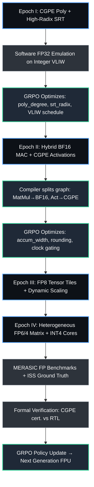

# 🔢 Эволюция FPU: от CGPE-полиномов до FP4/FP6 тензорных блоков

---

## 1. Введение: FPU как коммерческий мультипликатор ChipGPT
Правильная эволюция блока вычислений с плавающей запятой (FPU) определяет энергоэффективность, пропускную способность и итоговую стоимость кремния. В рамках ChipGPT FPU не проектируется статически — он ко-эволюционирует с VLIW-ядром, компилятором и верификатором через замкнутую GRPO-петлю. 

Стратегия разбита на 4 фазы, синхронизированных с архитектурными эпохами ChipGPT:
- **Эпоха I:** Программная эмуляция FP через CGPE + High-Radix SRT (целочисленные VLIW-блоки)
- **Эпоха II:** Гибридный BF16 MAC + CGPE-активации
- **Эпоха III:** FP8 тензорные тайлы + динамическая точность
- **Эпоха IV:** Гетерогенная матрица FP6/FP4 + аппаратные полиномиальные акселераторы

---

## 2. Старт с CGPE: зачем эмулировать FP на целочисленном VLIW?

На базовом уровне (Эпоха I) размещение полнофункциональных FP32/FP16 блоков неоптимально по площади и энергопотреблению. Решение: **использовать библиотеку CGPE (Code Generation for Polynomial Evaluation)** совместно с программными алгоритмами High-Radix SRT-деления [см. ^1], что позволяет реализовать быстрые операции `1/x` и `√x` на стандартных целочисленных ALU без выделенного FP-делителя.

| Компонент | Роль в FPU-эволюции |
|-----------|---------------------|
| **CGPE** | Генерирует сертифицированный, оптимизированный код для бивариантных полиномов. Заменяет аппаратные реализации нелинейных активаций (GELU, SiLU, Softmax) на детерминированные фиксированно-точечные вычисления. |
| **High-Radix SRT [см. ^1]** | Реализует быстрые программные операции `1/x` и `√x` на целочисленных ALU VLIW. Снижает latency деления с ~100 до ~20 тактов без выделенного FP-делителя. |
| **GRPO-оптимизация** | Агент подбирает степень полинома, разрядность fixed-point, schedule VLIW-пакетов и пороги срабатывания SRT-алгоритмов под конкретный workload. |

**Результат Эпохи I:** Полная поддержка FP32-эмуляции при площади FPU ≈ 0. Сохраняется совместимость с AI-стеком, экономится до 35% динамической мощности на активациях.

---

## 3. Переход к BFLOAT16: выравнивание с индустриальным стандартом
На Эпохе II (SIMD-VLIW) вводятся аппаратные MAC-блоки. Выбор падает на **BFLOAT16** (1 bit exponent, 7 bits mantissa), а не FP16, по следующим причинам:
- Совпадает с FP32 по динамическому диапазону (8 бит экспоненты) → стабильное обучение без loss scaling
- Упрощённая логика округления и нормализации → критический путь короче, частота выше
- Прямое преобразование в FP32 без потерь экспоненты

**Стратегия внедрения:**
1. Встраивание BF16 MAC-юнитов в кластеры VLIW
2. CGPE-активации продолжают работать на INT-блоках (экономия площади)
3. Компилятор ChipGPT автоматически расщепляет граф вычислений: `MatMul → BF16 MAC`, `Activations → CGPE fixed-point`
4. GRPO оптимизирует ширину аккумулятора (32/40 bit), логику saturation и clock gating при простое тензорных блоков

---

## 4. Путь к ультра-низкой точности: FP8 → FP6 → FP4 (Эпохи III–IV)
Следуя за трендами NVIDIA (Hopper → Blackwell) и Google TPU, ChipGPT масштабирует FPU до гетерогенной матрицы с динамической сменой точности.

| Точность | Архитектурные особенности | Роль в ChipGPT |
|----------|---------------------------|----------------|
| **FP8 (E4M3 / E5M2)** | E4M3: инференс/forward, E5M2: backprop/gradients. Аппаратные scaling factors, поддержка NaN propagation. | Базовый формат для WARP-кластеров (Эпоха III). Высокая плотность вычислений при сохранении стабильности Attention. |
| **FP6** | Кастомное распределение бит (напр. 3E/2M или 2E/3M). Упрощённый round-to-nearest-even. Требует перенормировки на лету. | Промежуточный формат для edge-inference и специализированных датчиков. Встраивается в shared memory controllers. |
| **FP4** | 1E/2M или 2E/1M. Экстремальная плотность. Полностью зависит от аппаратного scaling/quantization calibration. | Финальный формат для генеративных LLM-матриц (Эпоха IV). Работает в связке с CGPE-кализаторами и INT4-аккумуляторами. |

**Ключевой принцип:** Не вытеснять, а **сосуществовать**. Матрица FPU содержит тайлы разных точностей. GRPO-агент динамически маршрутизирует потоки данных, отключая неиспользуемые домены (low-power clock gating + operand isolation).

---

## 5. Соответствие AI-задач и форматов FPU

| AI-задача | Рекомендуемый FPU формат | Обоснование |
|-----------|--------------------------|-------------|
| LLM Training / Full Fine-tuning | BF16 / FP32 | Широкий динамический диапазон, стабильность градиентов, отсутствие overflow |
| Inference (Vision, NLP, Speech) | FP8 (E4M3) / INT8 | Баланс точности, пропускной способности и энергопотребления |
| LLM Generation / Edge Devices | FP4 / INT4 | Минимальная задержка, экономия HBM, ускорение token/s |
| Активации (GELU, SiLU, Softmax) | CGPE (Fixed-point 16/32) | Детерминированная полиномиальная аппроксимация без FP-делений, сертифицированная точность |
| Управление кластером / Loss Scaling / Attention Softmax | FP16 / BF16 | Промежуточные вычисления, нормализация, стабильность масштабирования |

---

## 6. Интеграция в GRPO-петлю и верификация
Параметры FPU становятся частью конфигурационного генома:
- `fp_precision_set`, `poly_degree_cgpe`, `srt_radix`, `accumulator_width`, `clock_domain_fpu`, `power_gating_threshold`

**Пайплайн валидации:**
1. **ISS Ground Truth**: cycle-accurate симуляция FP/CGPE операций, проверка corner cases (NaN, Inf, denormals, overflow)
2. **Formal Verification**: SMT-проверка сертифицированных полиномов CGPE vs аппаратная реализация
3. **MERASIC FP-Benchmarks**: GEMM, Attention, CGPE-kernels, Mixed-Precision Calibration
4. **GRPO Reward**: `R = α·Throughput + β·(1 - Power_FPU) + γ·Area + δ·Correctness_FP`

---

## 7. Схема пайплайна эволюции FPU

---

## 8. Заключение и дорожная карта
Эволюция FPU в ChipGPT — это не линейное наращивание битности, а **интеллектуальное распределение точности под задачу**. От программной эмуляции через CGPE/SRT до промышленных FP6/FP4 тензорных матриц, каждый шаг верифицируется ISS, формализуется и оптимизируется GRPO-агентом. Это обеспечивает:
- Сокращение площади FPU на 30–40% в ранних эпохах
- Стабильный переход к mixed-precision AI training/inference
- Предсказуемое масштабирование к Эпохе IV без переписывания компилятора

**Следующие шаги:**
1. Интеграция CGPE-генератора в LLVM/MLIR-бэкенд ChipGPT
2. Реализация High-Radix SRT эмуляции в ISS Эпохи I
3. Разработка BF16 MAC RTL-шаблона и верификационных тестов
4. Запуск GRPO-цикла оптимизации `fp_precision_set` на MERASIC-бенчмарках
5. Публикация спецификации динамического переключения точности FP8→FP4 для WARP-кластеров

## 📚 Источники и литература
[^1]: Jeannerod C.-P., Raina S.-K., Tisserand A. *High-Radix Floating-Point Division Algorithms for Embedded VLIW Integer Processors*. Research Report RR2005-39, Laboratoire de l'informatique du parallélisme (ENS Lyon), 2005. [HAL: hal-02102220](https://hal.science/hal-02102220)

---
*Документ поддерживается командой ChipGPT. Для вопросов по FPU-эволюции, CGPE-интеграции и GRPO-оптимизации обращайтесь к каналу `#chipgpt-fpu-evolution`.*