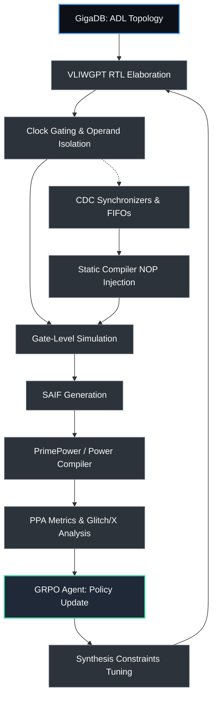

# VLIWGPT Low-Power Clock Domains: AI-оптимизированная кластерная архитектура

---

## 1. Введение: от кластерного VLIW к WARP-блокам (Эпоха 3 ChipGPT)
Кластерная архитектура VLIWGPT становится фундаментом для **Эпохи 3** проекта ChipGPT — перехода к масштабируемым WARP-подобным матрицам GPU. Ключевым ограничением традиционных централизованных ядер выступает суперлинейный рост задержек и энергопотребления при увеличении числа функциональных блоков (FU) и портов регистрового файла (RF). 

Решение: **декомпозиция на независимые тактовые домены (Clock Domains)** в сочетании с агрессивными low-power техниками на уровне RTL и синтеза. В экосистеме ChipGPT эти параметры не фиксируются вручную, а становятся **оптимизируемыми переменными для GRPO-агентов**, формирующих политику распределения ресурсов под конкретные PPA-метрики (Power, Performance, Area).

---

## 2. Архитектура тактовых доменов в кластерных VLIW
Согласно методологии параметризованного исследования пространства проектирования (Veciana, 2002) и платформе Lx (VLIW_3, 2000), архитектура VLIWGPT разделяется на три уровня тактовой изоляции:

| Уровень домена | Назначение | Стратегия управления |
|----------------|------------|----------------------|
| **Cluster Core Domains** | Локальные FU + локальный RF в каждом кластере | Независимый тактовый генератор или динамическое деление частоты. Активация только при наличии валидного VLIW-пакета. |
| **System/Interconnect Domain** | Шины данных, AXI/NOC, контроллеры памяти | Стабильная низкочастотная тактовая сеть. Изоляция от ядра через CDC-мосты. |
| **Accelerator Domains** | Аппаратные ускорители (FFT, Viterbi, Tensor-матрицы) | Полностью отключаемые домены. Запуск по прерыванию или через DMA-триггер. |

### 2.1. Обработка пересечения доменов (CDC)
В статически расписываемых VLIW архитектурах синхронизация критична для сохранения детерминизма ILP:
- **Синхронизаторы**: Multi-flop synchronizers и асинхронные FIFO для сигналов управления и статусных флагов.
- **Компиляторно-инжектируемые NOP/Wait States**: ILP-компилятор ChipGPT анализирует задержки CDC и автоматически вставляет такты ожидания в VLIW-пакеты, исключая гонки данных и мета-стабильность.
- **Handshake-протоколы**: Для межкластерных передач данных используются асинхронные handshake-механизмы с явной валидацией готовности приемника.

---

## 3. Стратегия Low-Power дизайна
Интеграция промышленных методик оптимизации энергопотребления в VLIWGPT осуществляется на трёх уровнях:

### 🔹 3.1. RTL Clock Gating
- Встраивается на этапе elaboration (`elaborate -gate_clock`) с использованием latch-based integrated cells.
- Управляющие сигналы выбираются из тестовых доменов (`test_mode`/`scan_enable`) для сохранения DFT-покрытия.
- Ограничение fanout (`-max_fanout`) и минимальная ширина банка регистров (`-minimum_bitwidth`) предотвращают деградацию частоты и skew.
- **GRPO-агент** оптимизирует пороги срабатывания clock gating: определяет, какие кластеры и регистровые банки можно отключать, когда уровень используемого параллелизма инструкций (ILP) падает ниже 60%.

### 🔹 3.2. Operand Isolation
- Логические вентили и арифметические блоки обкладываются изолирующими логическими элементами, блокирующими переключение при отсутствии валидных данных в VLIW-слоте.
- Снижает динамическую мощность на 15–30% без влияния на критический путь (critical path).
- Встраивается в синтез через `set_max_dynamic_power` и `compile -incremental`.

### 🔹 3.3. Low-Power Flip-Flops (FDV* Cells)
- Замена стандартных FF на FDV*-ячейки, потребляющие минимум энергии при переключении входа D при `CLK=0`.
- Идеально согласуется с clock gating: при отключении такта `CLK` фиксируется в `0`, исключая внутренние переключения.
- Увеличение площади ≤30%, компенсация задержки CP→Q за счёт отрицательного setup time.

### 🔹 3.4. Оценка и верификация энергопотребления
- **SAIF-поток**: Генерация `gate_fwd.saif` (forward annotation) → gate-level simulation → `gate_back.saif` → загрузка в PrimePower/Power Compiler.
- **Glitch & X-state handling**: PrimePower масштабирует мощность глитчей по соотношению transition time/pulse-width, что даёт более реалистичные оценки, чем стандартный Power Compiler.
- Формальная верификация clock-gating через `set verification_clock_gate_hold_mode "low"`.

---

## 4. GRPO-оптимизация PPA-метрик: роль Agentic EDA
В ChipGPT параметры low-power дизайна становятся **набором управляемых переменных** для GigaCore Agent: агент может самостоятельно подбирать пороги отключения кластеров, типы ячеек, стратегии изоляции и другие настройки, оценивая каждый вариант через глобальную функцию вознаграждения (PPA-метрики):

| Оптимизируемый параметр | Влияние на PPA | Механизм GRPO-реварда |
|-------------------------|----------------|------------------------|
| `Cluster Count & Capacity` | Area vs. Clock Rate | Штраф за превышение `set_max_area`, бонус за `initiation_interval` |
| `Clock Gating Threshold` | Dynamic Power | Награды за снижение `toggle_rate` в SAIF при сохранении latency |
| `Operand Isolation Granularity` | Glitch Power / Area | Баланс между `leakage_power` и критическим путём |
| `FDV* Mapping Ratio` | Static Power / Timing | Penalize если CP→Q > целевой частоты |

Глобальная reward-функция агрегирует метрики из PrimePower, timing reports и ILP-эффективности. Механизмы распределения кредита (Credit Assignment) между кластерами гарантируют, что агент не оптимизирует один блок в ущерб общей пропускной способности матрицы.

---

## 5. Процесс синтеза и AI-оптимизации
1. **GigaDB → ADL Parser**: Генерация кластерной топологии VLIWGPT с параметрами доменов.
2. **RTL Elaboration + Gating Insertion**: `elaborate -gate_clock`, настройка стилей gating, изоляция операндов.
3. **Gate-Level Simulation → SAIF**: Запуск тестовых векторов, генерация `gate_back.saif`.
4. **Power Estimation (PrimePower)**: `read_parasitics`, `calculate_power -waveform -statistics`, анализ глитчей.
5. **GRPO Feedback Loop**: Агент корректирует параметры кластеров, пороги gating и маппинг FF → запуск `compile -incremental`.
6. **CDC & Formal Sign-off**: Проверка синхронизаторов, handshake-протоколов, clock-gating hold/setup через Formality.

---

## 6. Схема пайплайна синтеза

---

## 7. Заключение и дорожная карта
Интеграция разнесённых тактовых доменов, RTL clock gating, operand isolation и FDV*-ячеек превращает VLIWGPT из статического ядра в **адаптивную low-power платформу**. В сочетании с GRPO-обучением это обеспечивает:
- Сокращение dynamic power на 25–40% без потери ILP
- Предсказуемое масштабирование к WARP-матрицам GPU (Эпоха 3)
- Автоматизированный синтез с формальной верификацией CDC и gating

**Следующие шаги:**
1. Реализация SAIF-генератора в CI/CD ChipGPT
2. Интеграция PrimePower API в GRPO reward-функцию
3. Разработка компиляторных директив для автоматической CDC-инъекции NOP
4. Валидация на бенчмарках DCT/FFT/Motion Estimation (MediaBench/SPEC)

---
*Документ поддерживается командой ChipGPT. Последнее обновление: май 2026.*