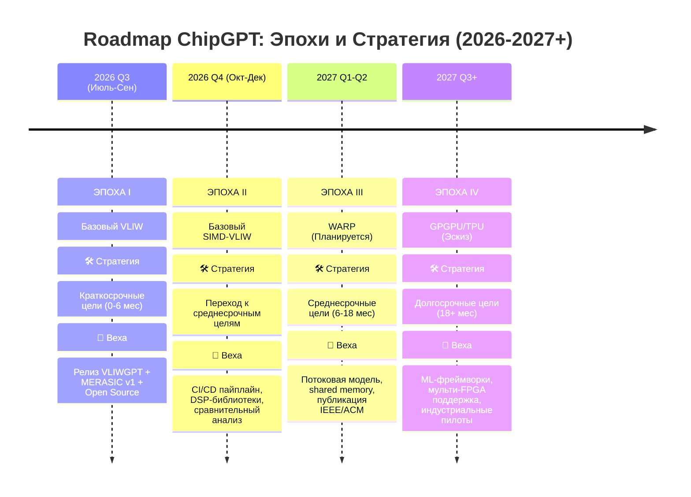

<!--
---
title: "🗺️ Roadmap: Эпохи эволюции и стратегия развития"
description: "Поквартальный план выпуска архитектурных эпох ChipGPT и стратегический переход к промышленному применению"
tags: [roadmap, epochs, vliw, simd, warp, strategy, milestones]
last_updated: 2026-05-14
---
-->

# 🗺️ Roadmap: Эпохи эволюции и стратегия развития

> 🎯 **Главная цель**: Стабильный выпуск одной полноценной архитектурной «эпохи» каждые 3 месяца.  
> 📅 **Текущий статус**: В работе | 🔄 **Последнее обновление**: Май 2026

---

## 📈 Визуальная дорожная карта

---

## 📋 Детальная матрица выполнения по эпохам

| Квартал | Эпоха | Стратегическая фаза | 🔧 HW / Архитектура | 💻 SW / Toolchain | 📦 Инфраструктура & Публикации |
|:---|:---|:---|:---|:---|:---|
| **Q3 2026** (Июль-Сен) | **I: Базовый VLIW** | Краткосрочные (0-6 мес) | Ядро VLIWGPT, статический планировщик, фиксированные FU, базовый регистровый файл | LLVM/GCC бэкенд, ассемблер, линкер, стандартные библиотеки C/C++ | Открытие репозитория (RTL, скрипты), документация toolchain, релиз MERASIC v1 |
| **Q4 2026** (Окт-Дек) | **II: SIMD-VLIW** | Переход к среднесрочным | Векторные расширения, предикатное выполнение, расширенные шины данных | Интеграция SIMD-интринсиков, авто-векторизация в компиляторе, профилировщик | CI/CD пайплайн (тесты, регрессия), библиотека DSP-примеров, публикация сравнительного анализа |
| **Q1-Q2 2027** (Планируется) | **III: WARP** | Среднесрочные (6-18 мес) | Динамическое управление потоками, shared memory, базовая аппаратная когерентность | Runtime-планировщик warps, OpenCL-like API, отладчик параллельных потоков | Публикация в IEEE/ACM (DATE, FPT, TECS), формальная верификация переходов эпох |
| **Q3+ 2027** (Эскиз) | **IV: GPGPU/TPU** | Долгосрочные (18+ мес) | Массовый параллелизм, тензорные блоки, аппаратные планировщики warps, HBM-интерфейс | PyTorch/JAX бэкенды, авто-оптимизация под нейросети, кросс-компиляция | Портирование на Xilinx/Intel/Lattice, пилотные проекты с индустриальными партнёрами |

---

## 🔗 Синхронизация стратегии и эпох

Эпохи не существуют изолированно. Каждая из них активирует конкретный блок стратегического развития платформы VLIWGPT:

### 🟢 Краткосрочные цели (0-6 месяцев) → Эпохи I & II
- **Документация**: Создание детального руководства по архитектуре, параметризации FU и рабочему процессу toolchain.
- **Сравнительный анализ**: Публикация качественных и количественных оценок эффективности VLIWGPT относительно ST231 / TMS320C6000.
- **Открытость**: Размещение RTL-кода, toolchain-скриптов, бенчмарков MERASIC и примеров приложений на GitHub/GitLab под лицензией Apache 2.0.

### 🟡 Среднесрочные цели (6-18 месяцев) → Эпохи II & III
- **Библиотека примеров**: Добавление готовых решений для типовых задач DSP, компьютерного зрения, обработки сигналов (Viterbi, OFDM, свёртки).
- **CI/CD & Верификация**: Автоматизация тестирования, регрессионный анализ при изменениях архитектуры, интеграция FEV-проверок в пайплайн.
- **Академическая публикация**: Представление результатов на DATE, FPT, в IEEE Transactions on Education / ACM TECS. Препринты на arXiv (cs.AR, cs.CE).

### 🔵 Долгосрочные цели (18+ месяцев) → Эпохи III & IV
- **Мульти-платформенность**: Портирование базовых ядер и toolchain на семейства FPGA (Xilinx UltraScale+, Intel Agilex, Lattice CertusPro).
- **ML-экосистема**: Интеграция с фреймворками машинного обучения для автоматической оптимизации архитектуры под нейросетевые графы.
- **Промышленное внедрение**: Сотрудничество с компаниями-разработчиками чипов для использования VLIWGPT как платформы прототипирования кастомных акселераторов.

---

## ✅ Критерии перехода между эпохами

Переход к следующей эпохе возможен только при достижении **пороговых метрик** на текущей:

| Метрика | Порог для перехода | Инструмент оценки |
|:---|:---|:---|
| **Функциональная корректность** | `> 99.99%` покрытие на MERASIC | ISS Co-simulation + FEV |
| **Прирост IPC** | `≥ 1.8x` относительно предыдущей эпохи на целевых бенчмарках | Profiler / Hardware Counters |
| **Стабильность Toolchain** | Успешная компиляция и запуск `100%` тестовых наборов без fallback | CI/CD Pipeline |
| **Документация & Воспроизводимость** | Полное покрытие архитектуры, ISA и workflow примерами | GitHub Wiki + Issue Tracker |

> ⚠️ Если метрики не достигнуты в конце квартала, эпоха получает статус `Extension` (продление на 1-2 месяца) с фокусом на закрытие технических долгов. Переход не осуществляется до прохождения порога.

---

## 📌 Как мы используем этот Roadmap
1. **Для команды разработки**: Таблица служит канбан-доской высокого уровня. Каждая строка соответствует спринтам/итерациям.
2. **Для контрибьюторов**: Открытые задачи маркируются в Issue Tracker тегами `epoch-I`, `epoch-II`, `toolchain`, `verification`.
3. **Для партнёров/инвесторов**: Квартальные релизы формируют прозрачный трек-рекорд прогресса от академического ядра к промышленному акселератору.

---
*Дорожная карта обновляется ежеквартально по итогам закрытия эпохи. Фиксированные даты (Q3/Q4 2026) являются обязательствами. Даты 2027+ носят ориентировочный характер и уточняются по результатам верификации WARP-архитектуры.*

---
