# VLIWGPT Instruction Set Architecture: Справочник операций

Данный документ содержит полный перечень операций ядра VLIWGPT. Каждая инструкция описана согласно архитектуре VLIW: семантика, функциональное назначение, аппаратные ограничения и возможные исключения. Для наглядности добавлены схемы потоков данных.

## 📖 Формат описания
Каждая операция представлена в стандартизированном виде:
- **Название:** `Мнемоника [Вариант кодирования операндов]`
- **Semantics:** Формальное описание поведения (на нотационном языке ISA)
- **Description:** Словесное описание действия
- **Restrictions:** Аппаратные и pipeline-ограничения
- **Exceptions:** Типы прерываний/трапов, которые может сгенерировать инструкция
- **Visualization:** Схема выполнения (Mermaid)

---

### `add Register`
**Semantics:**
```
operand1 ← SignExtend32(RSRC1);
operand2 ← SignExtend32(RSRC2);
result1 ← operand1 + operand2;
RDEST ← Register(result1);
```
**Description:** Сложение двух регистровых операндов со знаком. Результат записывается в целевой регистр общего назначения.
**Restrictions:** Нет ограничений по адресации/бандлам. Нет задержек конвейера (latency = 1 цикл).
**Exceptions:** Нет.

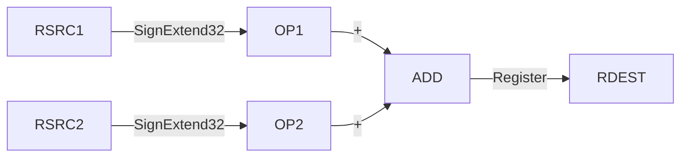
---

### `add Immediate`
**Semantics:**
```
operand1 ← SignExtend32(RSRC1);
operand2 ← SignExtend32(Imm(ISRC2));
result1 ← operand1 + operand2;
RIDEST ← Register(result1);
```
**Description:** Сложение регистрового операнда и знакового немедленного значения (с поддержкой расширенных immediate через `imml`/`immr`).
**Restrictions:** Нет ограничений. Latency = 1 цикл.
**Exceptions:** Нет.

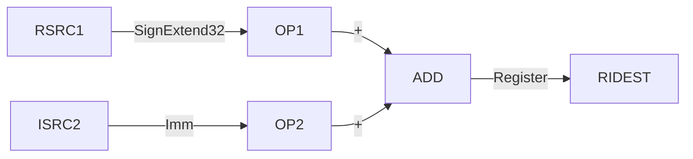
---

### `addcg`
**Semantics:**
```
operand1 ← ZeroExtend32(RSRC1);
operand2 ← ZeroExtend32(RSRC2);
operand3 ← ZeroExtend1(BSCOND);
result1 ← (operand1 + operand2) + operand3;
result2 ← Bit(result1, 32);
RDEST ← Register(result1);
BBDEST ← Bit(result2);
```
**Description:** Сложение с переносом (carry) и генерацией флага переноса в битовый регистр.
**Restrictions:** Нет ограничений. Latency = 1 цикл.
**Exceptions:** Нет.

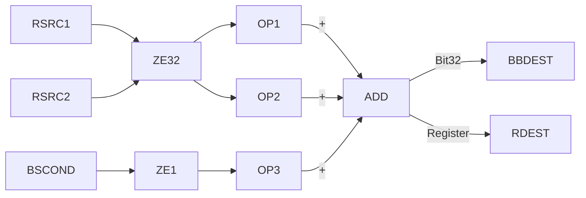
---

### `and Register`
**Semantics:** `operand1 ← SignExtend32(RSRC1); operand2 ← SignExtend32(RSRC2); result1 ← operand1 ∧ operand2; RDEST ← Register(result1);`
**Description:** Побитовое И над регистровыми операндами.
**Restrictions:** Без ограничений.
**Exceptions:** Нет.

---

### `and Immediate`
**Semantics:** `operand1 ← SignExtend32(RSRC1); operand2 ← SignExtend32(Imm(ISRC2)); result1 ← operand1 ∧ operand2; RIDEST ← Register(result1);`
**Description:** Побитовое И регистра и немедленного значения.
**Restrictions:** Без ограничений.
**Exceptions:** Нет.

---

### `andc Register`
**Semantics:** `operand1 ← SignExtend32(RSRC1); operand2 ← SignExtend32(RSRC2); result1 ← (~operand1) ∧ operand2; RDEST ← Register(result1);`
**Description:** Инверсия первого операнда, затем побитовое И со вторым.
**Restrictions:** Без ограничений.
**Exceptions:** Нет.

---

### `andc Immediate`
**Semantics:** `operand1 ← SignExtend32(RSRC1); operand2 ← SignExtend32(Imm(ISRC2)); result1 ← (~operand1) ∧ operand2; RIDEST ← Register(result1);`
**Description:** Инверсия регистра, побитовое И с immediate.
**Restrictions:** Без ограничений.
**Exceptions:** Нет.

---

### `andl Register-Register`
**Semantics:** `operand1 ← SignExtend32(RSRC1); operand2 ← SignExtend32(RSRC2); result1 ← (operand1 ≠ 0) AND (operand2 ≠ 0); RDEST ← Register(result1);`
**Description:** Логическое И (результат 1, если оба операнда не равны нулю).
**Restrictions:** Без ограничений.
**Exceptions:** Нет.

---

### `andl Branch Register-Register`
**Semantics:** `... result1 ← (operand1 ≠ 0) AND (operand2 ≠ 0); BBDEST ← Bit(result1);`
**Description:** Логическое И, результат записывается в битовый регистр ветвления.
**Restrictions:** Без ограничений.
**Exceptions:** Нет.

---

### `andl Register-Immediate`
**Semantics:** `operand1 ← SignExtend32(RSRC1); operand2 ← SignExtend32(Imm(ISRC2)); result1 ← (operand1 ≠ 0) AND (operand2 ≠ 0); RIDEST ← Register(result1);`
**Description:** Логическое И регистра и immediate.
**Restrictions:** Без ограничений.
**Exceptions:** Нет.

---

### `andl Branch Register-Immediate`
**Semantics:** `... result1 ← (operand1 ≠ 0) AND (operand2 ≠ 0); BIBDEST ← Bit(result1);`
**Description:** Логическое И, результат в битовый регистр.
**Restrictions:** Без ограничений.
**Exceptions:** Нет.

---

### `br`
**Semantics:** `operand1 ← ZeroExtend1(BBCOND); operand2 ← SignExtend23(BTARG) << 2; IF(operand1 ≠ 0) PC ← Register(ZeroExtend32(BUNDLE_PC) + operand2);`
**Description:** Условный переход по битовому регистру. Смещение умножается на 4 (выравнивание слов).
**Restrictions:** Должна быть первой операцией (syllable) в бандле. Задержка 2 бандла между записью в `BBCOND` и выполнением.
**Exceptions:** Нет.

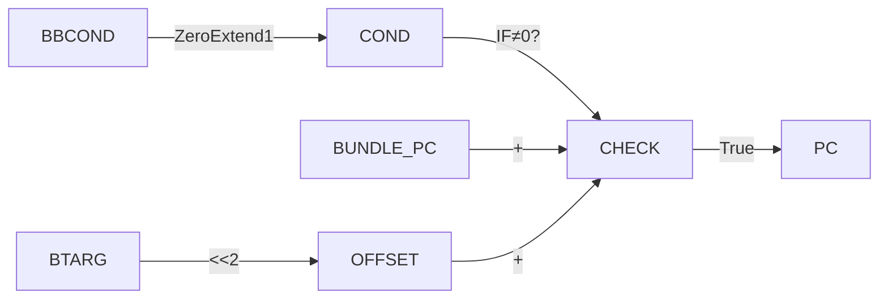
---

### `break`
**Semantics:** `THROW ILL_INST;`
**Description:** Программный брейкпоинт (генерирует исключение нелегальной инструкции для отладки).
**Restrictions:** Без ограничений.
**Exceptions:** `ILL_INST`

---

### `brf`
**Semantics:** `operand1 ← ZeroExtend1(BBCOND); operand2 ← SignExtend23(BTARG) << 2; IF(operand1 = 0) PC ← Register(ZeroExtend32(BUNDLE_PC) + operand2);`
**Description:** Условный переход, если битовый регистр равен 0 (Branch False).
**Restrictions:** Первая операция в бандле. Latency = 2 бандла для условия.
**Exceptions:** Нет.

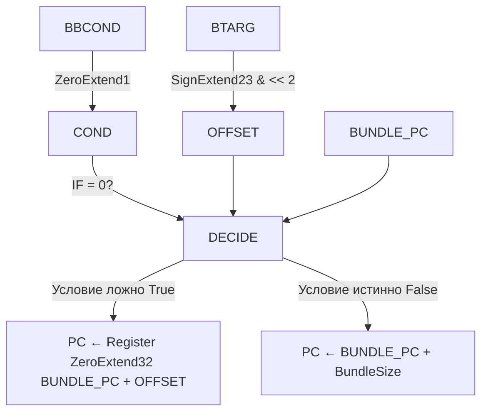
---

### `bswap`
**Semantics:** Извлекает байты 0..3, меняет порядок (0↔3, 1↔2), собирает обратно в 32-битное слово.
**Description:** Обмен порядка байтов (Big/Little Endian swap).
**Restrictions:** Без ограничений.
**Exceptions:** Нет.

---

### `call Immediate`
**Semantics:** `operand1 ← SignExtend23(BTARG) << 2; NEXT_PC ← PC; PC ← Register(ZeroExtend32(BUNDLE_PC) + operand1); LR ← NEXT_PC;`
**Description:** Вызов подпрограммы с переходом по immediate и сохранением адреса возврата в Link Register (`$r63`).
**Restrictions:** Первая в бандле. Без latency.
**Exceptions:** Нет.

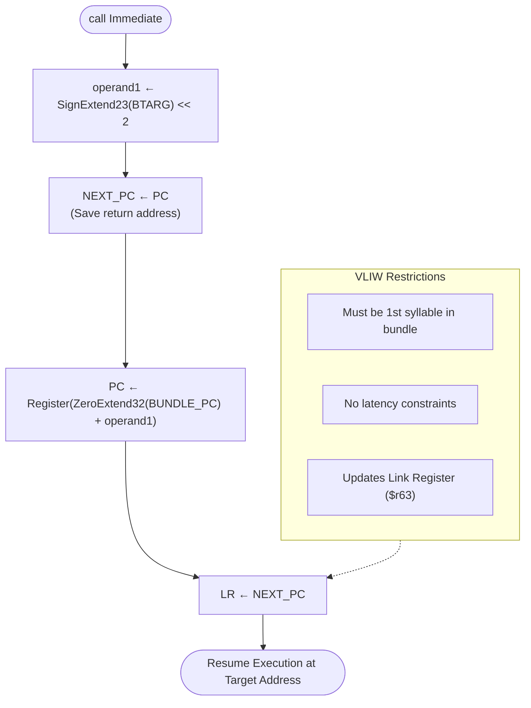
---

### `call Link Register`
**Semantics:** `NEXT_PC ← PC; PC ← Register(ZeroExtend32(LR)); LR ← NEXT_PC;`
**Description:** Косвенный вызов через Link Register.
**Restrictions:** Первая в бандле. Требуется задержка 2 бандла после последней записи в `LR` (кроме предыдущего `call`).
**Exceptions:** Нет.

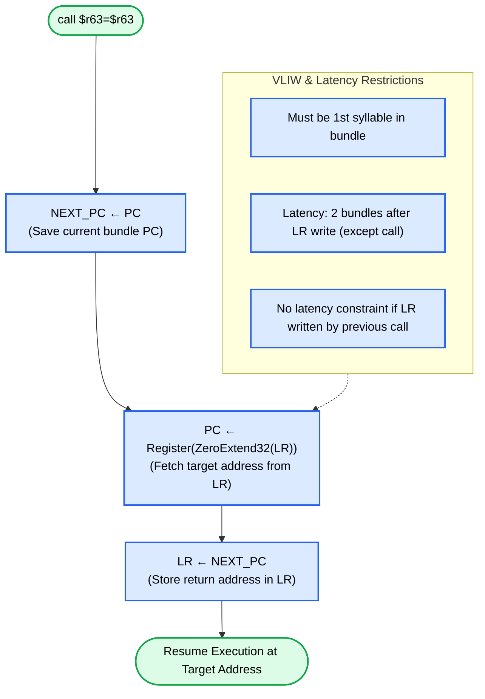
---

### `clz`
**Semantics:** `operand1 ← ZeroExtend32(RSRC1); result1 ← CountLeadingZeros(operand1); RIDEST ← Register(result1);`
**Description:** Подчёт количества ведущих нулевых битов.
**Restrictions:** Без ограничений.
**Exceptions:** Нет.

---

### `cmpeq / cmpge / cmpgt / cmple / cmplt / cmpne` (все варианты: Register-Register, Branch Register-Register, Register-Immediate, Branch Register-Immediate)
**Semantics:** Выполняют соответствующее сравнение (`==, ≥, >, ≤, <, ≠`) между операндами. Для Register-вариантов результат `0/1` пишется в GPR. Для Branch-вариантов результат пишется в битовый регистр.
**Description:** Целочисленное сравнение (знаковое для `cmpge/gt/le/lt`, беззнаковое для `cmpgeu/gtu/leu/ltu`).
**Restrictions:** Без ограничений.
**Exceptions:** Нет.

---

### `divs`
**Semantics:** Реализует один шаг алгоритма деления без восстановления (non-restoring divide stage). Обрабатывает знак делимого и формирует частное/остаток в регистре и бите переноса.
**Description:** Аппаратный шаг итеративного деления.
**Restrictions:** Без ограничений.
**Exceptions:** Нет.

---

### `goto Immediate`
**Semantics:** `operand1 ← SignExtend23(BTARG) << 2; PC ← Register(ZeroExtend32(BUNDLE_PC) + operand1);`
**Description:** Безусловный переход по смещению.
**Restrictions:** Первая в бандле.
**Exceptions:** Нет.

---

### `goto Link Register` (`goto $r63`)
**Semantics:** `PC ← Register(ZeroExtend32(LR));`
**Description:** Безусловный косвенный переход через Link Register (обычно используется для возврата из функции).
**Restrictions:** Первая в бандле. Latency 2 бандла после записи в `LR`.
**Exceptions:** Нет.

---

### `imml` / `immr`
**Semantics:** `extension ← ZeroExtend23(IMM);`
**Description:** Расширение немедленного значения для соседней операции (`imml` - для левой, `immr` - для правой).
**Restrictions:** Должны кодироваться по чётным адресам слов в бандле.
**Exceptions:** Нет.

---

### `ldb` / `ldbu` (и `.d` версии)
**Semantics:** `ea ← Imm + RSRC1; ReadCheckMemory8(ea); ReadMemory8(ea); result ← Sign/ZeroExtend8(...); RNLIDEST ← Register(result);`
**Description:** Загрузка байта (знаковая `ldb` / беззнаковая `ldbu`). Версии `.d` (dismissible) возвращают 0 при исключении, а не трипают.
**Restrictions:** Нельзя писать в `$r63`. Использует LSU (только 1 LSU-операция на бандл). Latency 2 бандла до результата.
**Exceptions:** `DBREAK`, `CREG_ACCESS_VIOLATION`, `DTLB` (для `.d`: `DBREAK`, `DTLB`)

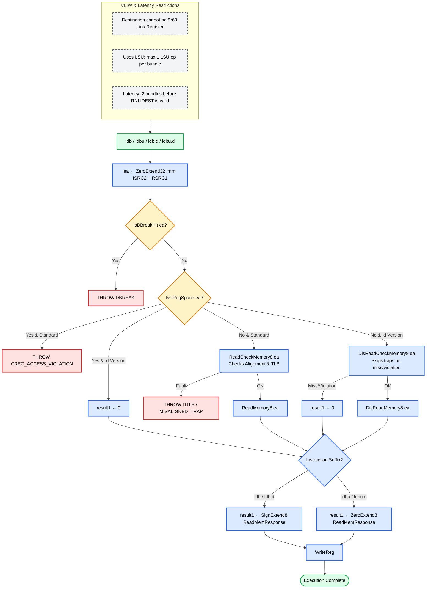
---

### `ldh` / `ldhu` (и `.d`)
**Semantics:** Аналогично `ldb`, но 16 бит. Проверяет выравнивание.
**Description:** Загрузка полуслова (знак/без знака).
**Restrictions:** Нельзя `$r63`. 1 LSU на бандл. Latency 2.
**Exceptions:** `DBREAK`, `CREG_ACCESS_VIOLATION`, `DTLB`, `MISALIGNED_TRAP`

---

### `ldw` / `ldw.d`
**Semantics:** `ea ← Imm + RSRC1; ... ReadCheckMemory32(ea); ReadMemory32(ea); RIDEST ← Register(...);`
**Description:** Загрузка 32-битного слова.
**Restrictions:** 1 LSU на бандл. Latency 2. При записи в `$r63` latency 3 для последующего `call/goto $r63`.
**Exceptions:** `DBREAK`, `DTLB`, `MISALIGNED_TRAP`, `CREG_ACCESS_VIOLATION`, `CREG_NO_MAPPING`

---

### `max` / `maxu` / `min` / `minu` (Register/Immediate)
**Semantics:** `IF(operand1 op operand2) result1 ← operand1; ELSE result1 ← operand2; RDEST ← Register(result1);`
**Description:** Выбор максимума или минимума (знаковые `max/min`, беззнаковые `maxu/minu`).
**Restrictions:** Без ограничений.
**Exceptions:** Нет.

---

### `mulh` / `mulhh` / `mull` / `mullh` / `mulll` / `mulhu` / `mullhu` / `mullu` (Register/Immediate)
**Semantics:** Различные комбинации знакового/беззнакового умножения слов и полуслов. Например, `mulhh`: `(RSRC1>>16) * (RSRC2>>16)`.
**Description:** Умножение частей слов (upper/lower half-word × full/upper half-word).
**Restrictions:** Нельзя `$r63`. Должны быть на нечётных адресах слов. Latency 2 бандла.
**Exceptions:** Нет.

---

### `mulhhs` / `mulhhu` / `mulhs` / `mullhus`
**Semantics:** Аналогично базовым `mul*`, но возвращают старшие 16/32 бита результата (сдвиги `>>16` или `>>32`).
**Description:** Умножение с возвратом старшей части результата (для фиксированной точки).
**Restrictions:** Нельзя `$r63`. Нечётные адреса. Latency 2.
**Exceptions:** Нет.

---

### `mul32` / `mul64h` / `mul64hu` / `mulfrac` (Register/Immediate)
**Semantics:** `mul32`: `RSRC1 * RSRC2`. `mul64h`: `(RSRC1 * RSRC2) >> 32`. `mulfrac`: Фракционное умножение с обработкой переполнения `-1 * -1`.
**Description:** Полное 32×32 умножение, старшая часть 64-битного результата, дробное DSP-умножение.
**Restrictions:** Нельзя `$r63`. Нечётные адреса. Latency 2.
**Exceptions:** Нет.

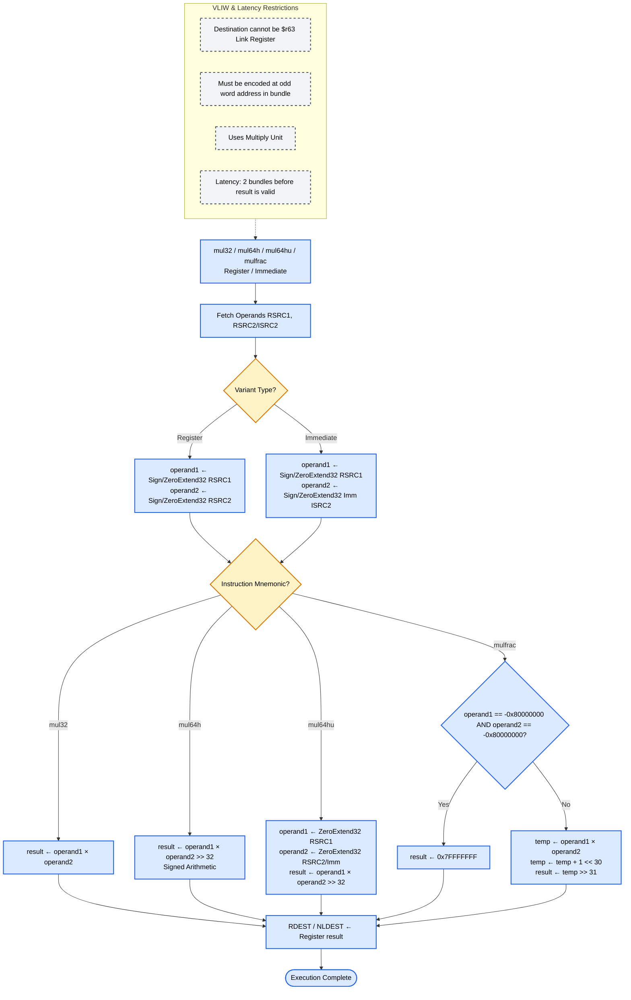
---

### `nandl` / `norl` (все варианты Register/Branch/Immediate)
**Semantics:** `result1 ← NOT((operand1 ≠ 0) AND/OR (operand2 ≠ 0)); ...`
**Description:** Логические NAND и NOR.
**Restrictions:** Без ограничений.
**Exceptions:** Нет.

---

### `or` / `orc` (Register/Immediate)
**Semantics:** `or`: `operand1 ∨ operand2`. `orc`: `(~operand1) ∨ operand2`.
**Description:** Побитовое ИЛИ и ИЛИ с инверсией первого операнда.
**Restrictions:** Без ограничений.
**Exceptions:** Нет.

---

### `orl` (все варианты)
**Semantics:** `result1 ← (operand1 ≠ 0) OR (operand2 ≠ 0); ...`
**Description:** Логическое ИЛИ.
**Restrictions:** Без ограничений.
**Exceptions:** Нет.

---

### `pft`
**Semantics:** `ea ← Imm + RSRC1; PrefetchCheckMemory(ea); PrefetchMemory(ea);`
**Description:** Программный префетч данных в кэш.
**Restrictions:** 1 LSU на бандл. Без latency. Игнорируется при попадании в кэш, uncached областях или нарушении SCU.
**Exceptions:** Нет.

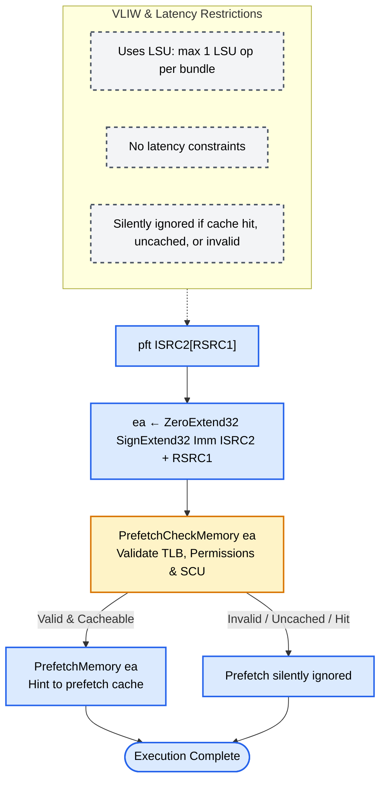
---

### `prgadd`
**Semantics:** `ea ← Imm + RSRC1; PurgeAddressCheckMemory(ea); PurgeAddress(ea);`
**Description:** Очистка (purge) конкретной строки данных по адресу из D-cache.
**Restrictions:** 1 LSU на бандл.
**Exceptions:** `DTLB`

---

### `prgins`
**Semantics:** `IF(PSW[USER_MODE]) THROW ILL_INST; PurgeIns();`
**Description:** Полная инвалидация I-cache.
**Restrictions:** Должна быть одна в бандле. Только режим Supervisor.
**Exceptions:** `ILL_INST`

---

### `prginspg`
**Semantics:** `ea ← Imm + RSRC1; IF(PSW[USER_MODE]) THROW ILL_INST; PurgeInsPg(ea);`
**Description:** Очистка 8 КБ страницы I-cache по виртуальному/физическому адресу.
**Restrictions:** 1 LSU на бандл. Только Supervisor.
**Exceptions:** `ILL_INST`

---

### `prgset`
**Semantics:** `ea ← Imm + RSRC1; PurgeSet(ea);`
**Description:** Очистка набора (set) из 4 строк D-cache.
**Restrictions:** 1 LSU на бандл.
**Exceptions:** Нет.

---

### `pswclr` / `pswset`
**Semantics:** `operand2 ← SignExtend32(RSRC2); IF(PSW[USER_MODE]) THROW ILL_INST; PswClr/PswSet(operand2);`
**Description:** Атомарная очистка/установка битов в Program Status Word.
**Restrictions:** Первая в бандле. 1 LSU на бандл. Только Supervisor.
**Exceptions:** `ILL_INST`

---

### `rfi`
**Semantics:** `IF(PSW[USER_MODE]) THROW ILL_INST; PC ← SAVED_PC; PSW ← SAVED_PSW; SAVED_PC ← SAVED_SAVED_PC; SAVED_PSW ← SAVED_SAVED_PSW; Rfi();`
**Description:** Возврат из прерывания/исключения. Восстанавливает PC и PSW из сохранённого контекста.
**Restrictions:** Первая в бандле. 1 LSU. Только Supervisor. Задержка 4 бандла после записи в `SAVED_*`.
**Exceptions:** `ILL_INST`

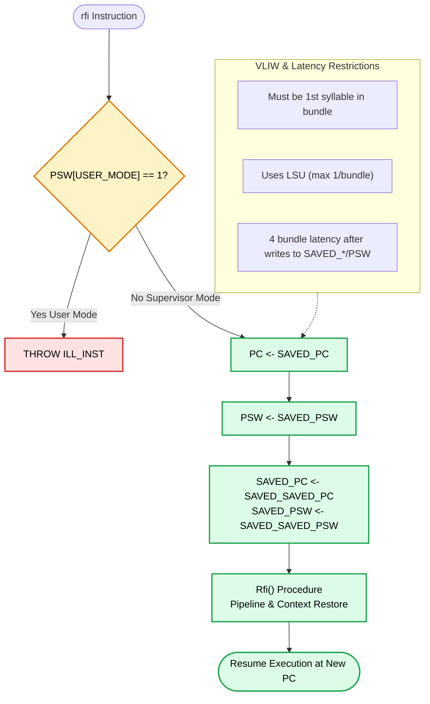

---

### `sbrk`
**Semantics:** `operand1 ← ZeroExtend21(SBRKNUM); THROW SBREAK;`
**Description:** Программный брейкпоинт с кодом отладки.
**Restrictions:** Без ограничений.
**Exceptions:** `SBREAK`

---

### `sh1add` / `sh2add` / `sh3add` / `sh4add` (Register/Immediate)
**Semantics:** `result1 ← (operand1 << N) + operand2; RDEST ← Register(result1);`
**Description:** Сдвиг влево на N позиций и прибавление второго операнда (оптимизация адресной арифметики).
**Restrictions:** Без ограничений.
**Exceptions:** Нет.

---

### `shl` / `shr` / `shru` (Register/Immediate)
**Semantics:** `shl`: Логический сдвиг влево (сдвиг >31 даёт 0). `shr`: Арифметический сдвиг вправо. `shru`: Логический сдвиг вправо.
**Description:** Битовые сдвиги.
**Restrictions:** Без ограничений.
**Exceptions:** Нет.

---

### `slct` / `slctf` (Register/Immediate)
**Semantics:** `slct`: `IF(BSCOND≠0) result←RSRC1 ELSE result←RSRC2/ISRC2`. `slctf`: Инверсия условия (`BSCOND=0`).
**Description:** Предикативный выбор (conditional select). Избегает ветвления.
**Restrictions:** Без ограничений.
**Exceptions:** Нет.

---

### `stb` / `sth` / `stw`
**Semantics:** `ea ← Imm + RSRC1; ... WriteCheckMemoryN(ea); WriteMemoryN(ea, RSRC2);`
**Description:** Сохранение байта/полуслова/слова в память.
**Restrictions:** 1 LSU на бандл. Без latency.
**Exceptions:** `DBREAK`, `CREG_ACCESS_VIOLATION`, `DTLB`, `MISALIGNED_TRAP` (для `sth/stw`), `CREG_NO_MAPPING` (для `stw`)

---

### `sub` (Register/Immediate)
**Semantics:** `result1 ← operand2 - operand1; RDEST ← Register(result1);`
**Description:** Вычитание (первый операнд вычитается из второго/immediate).
**Restrictions:** Без ограничений.
**Exceptions:** Нет.

---

### `sxtb` / `sxth`
**Semantics:** `operand1 ← SignExtend8/16(RSRC1); RIDEST ← Register(operand1);`
**Description:** Знаковое расширение байта/полуслова до 32 бит.
**Restrictions:** Без ограничений.
**Exceptions:** Нет.

---

### `sync`
**Semantics:** `Sync();`
**Description:** Синхронизация D-side: ожидание завершения всех load/store/prefetch, очистка write buffer.
**Restrictions:** 1 LSU на бандл.
**Exceptions:** Нет.

---

### `syscall`
**Semantics:** `operand1 ← ZeroExtend21(SBRKNUM); THROW SYSCALL;`
**Description:** Системный вызов (переход в обработчик SYSCALL).
**Restrictions:** Должна быть одна в бандле.
**Exceptions:** `SYSCALL`

---

### `xor` (Register/Immediate)
**Semantics:** `result1 ← operand1 ⊕ operand2; RDEST ← Register(result1);`
**Description:** Побитовое исключающее ИЛИ.
**Restrictions:** Без ограничений.
**Exceptions:** Нет.

---

### `zxth`
**Semantics:** `operand1 ← ZeroExtend16(RSRC1); RIDEST ← Register(operand1);`
**Description:** Беззнаковое расширение полуслова до 32 бит.
**Restrictions:** Без ограничений.
**Exceptions:** Нет.

---

## 📜 Сводная таблица ограничений VLIW-бандлов
| Тип инструкции | Позиция в бандле | Ресурс | Latency до результата | Примечание |
|---|---|---|---|---|
| `br`, `brf`, `call`, `goto` | Только первая (syllable 1) | Branch Unit | Зависит от цели | Прерывают последовательный поток |
| `ld*`, `st*`, `pft`, `sync`, `prg*`, `psw*` | Любая (макс 1 на бандл) | Load/Store Unit (LSU) | `ld`: 2 цикла, `st`: 0 | Конфликт при дублировании LSU |
| `mul*` | Только нечётные адреса слов | Multiply Unit | 2 цикла | Не пишут в `$r63` |
| `imml`/`immr` | Только чётные адреса слов | Decoder | 0 | Связаны с соседней операцией |
| `prgins`, `sbrk`, `syscall` | Только одна в бандле | Special/Control | - | Stop-bit обязателен |

> 💡 **Рекомендация для VLIWGPT:** При генерации бандлов соблюдайте правило `BUNDLE_CHECKING_ON`: не более 1 LSU, не более 1 ветвления, `mul*` на нечётных адресах, уникальные целевые регистры (кроме `$r0`), `$r63` не допускается в `ldh/ldb/mul*`.
