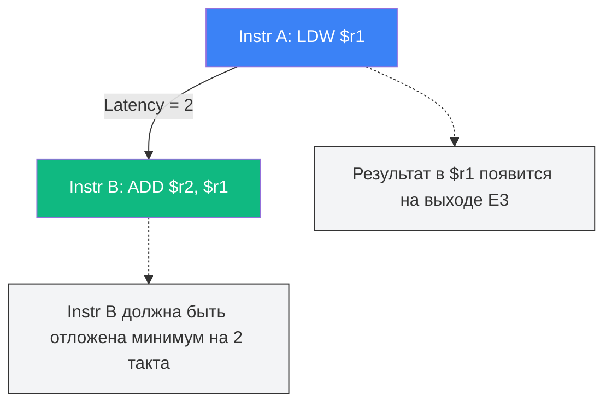
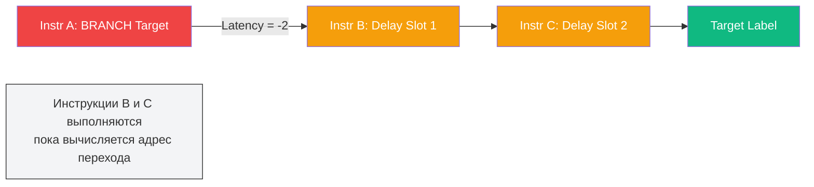
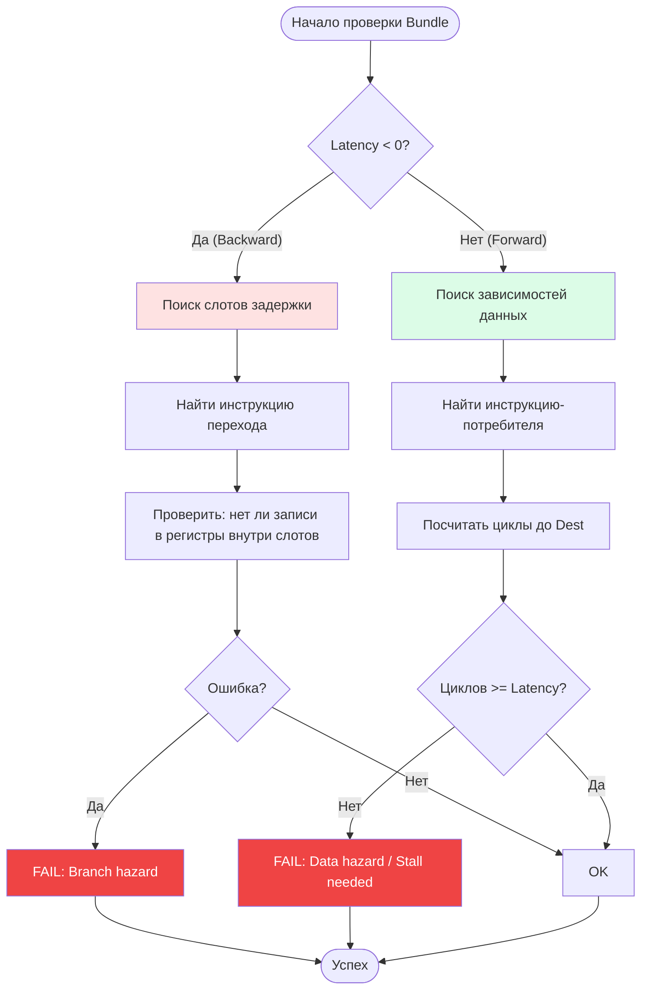

# ⏱️ Механика Латентности VLIWGPT: Backward и Forward Dependencies

> **Статус**: Reference Manual | **Модуль**: Scheduler / ISS | **Обновлено**: 2026-06-23

В архитектуре VLIWGPT (Very Long Instruction Word) отсутствует аппаратный блок переупорядочивания (Reorder Buffer). Вся ответственность за синхронизацию выполнения инструкций лежит на **статическом планировщике компилятора**.

Для корректного планирования используется таблица латентностей (`latencyTable`), которая сообщает компилятору две критически важные характеристики каждой инструкции:
1. **Время готовности результата** (Forward Latency).
2. **Поведение при изменении потока управления** (Backward Latency / Delay Slots).

---

## 1. Типы Латентностей

В VLIWGPT латентность может быть положительной или отрицательной. Это не математическая ошибка, а различие в направлении зависимости.

### 1.1 Forward Latency (Положительная)
**Тип:** Зависимость по данным (RAW — Read After Write).
**Значение:** `> 0`

Определяет, через сколько тактов **результат** инструкции будет доступен для чтения другими инструкциями.


*   **Latency 0:** Результат доступен в том же такте (ALU операции).
*   **Latency 2:** Результат доступен через 2 такта (Load/Mul операции).
*   **Нарушение:** Если **Instr B** стоит раньше, конвейер остановится (Stall) или возникнет ошибка планирования.

### 1.2 Backward Latency (Отрицательная)
**Тип:** Зависимость потока управления (Control Flow / Delay Slots).
**Значение:** `< 0`

Определяет количество инструкций, которые можно безопасно разместить **после** инструкции перехода, но которые будут выполнены **до** того, как переход реально вступит в силу. Это называется **Branch Delay Slots**.


*   **Latency -2:** Компилятор может поместить 2 полезные инструкции в задержку ветвления.
*   **Latency -3:** Компилятор может поместить 3 инструкции (Call/Goto).
*   **Правило:** Инструкции в слотах задержки **никогда** не должны зависеть от результата инструкции перехода.

---

## 2. Визуализация Таблицы Латентностей

В исходном коде ядра используется структура `latencyInfo`, содержащая два поля:
`{ "mnemonic", latency, resource_constraint }`

Ниже представлена полная декомпозиция этой таблицы для планировщика VLIWGPT.

### 2.1 Легенда полей
| Поле | Тип | Описание |
|------|-----|----------|
| **Mnemonic** | String | Мнемоника инструкции |
| **Latency** | Integer | `>0`: циклы до готовности результата<br/>`<0`: количество слотов задержки (Delay Slots) |
| **Resource** | Integer | `0`: Нет ограничений<br/>`VLIWGPT_INT_MAX`: Жесткое ограничение ресурса (нельзя в одном бандле) |

### 2.2 Полная Таблица (Mapping)

#### Группа 1: Управление потоком (Control Flow) — Backward Latency
Эти инструкции меняют `PC`. Отрицательная латентность указывает на длину тени ветвления.

| Инструкция | Latency | Resource | Смысл для Компилятора |
|------------|:-------:|:--------:|-----------------------|
| `call` | **-3** | `0` | Вызов функции. 3 слота задержки. |
| `icall` | **-3** | `0` | Косвенный вызов. 3 слота задержки. |
| `goto` | **-3** | `0` | Безусловный переход. 3 слота задержки. |
| `igoto` | **-3** | `0` | Косвенный безусловный переход. |
| `br` | **-2** | `0` | Условный переход. 2 слота задержки. |
| `brf` | **-2** | `0` | Условный переход (false). |

> ⚠️ **Важно:** Инструкции в слотах задержки (`-3` или `-2`) выполняются **всегда**, независимо от того, возьмется ветвление или нет (если это не предикатная инструкция).

#### Группа 2: Загрузка из памяти (Loads) — Forward Latency
Латентность `2` означает, что данные появятся в регистре через 2 такта.

| Инструкция | Latency | Resource | Особенности |
|------------|:-------:|:--------:|-------------|
| `ldw` | **2** | `0` | Загрузка слова. Можно комбинировать с ALU. |
| `ldw.d` | **2** | `0` | Загрузка слова (двойная). |
| `ldb` | **2** | `VLIWGPT_INT_MAX` | Загрузка байта. **Конфликт ресурса шины данных.** |
| `ldh` | **2** | `VLIWGPT_INT_MAX` | Загрузка полуслова. **Конфликт ресурса.** |
| `ldbu` | **2** | `VLIWGPT_INT_MAX` | Беззнаковый байт. |
| `ldhu` | **2** | `VLIWGPT_INT_MAX` | Беззнаковое полуслово. |

> 🔍 **Почему `VLIWGPT_INT_MAX`?** Инструкции `ldb/ldh` используют специализированные блоки выравнивания, которые не могут работать параллельно с другими загрузками или сложными ALU операциями в том же такте.

#### Группа 3: Умножение (Multiplications) — Forward Latency
Все операции умножения имеют латентность `2` и жесткое ограничение ресурса.

| Инструкция | Latency | Resource | Описание |
|------------|:-------:|:--------:|----------|
| `mulh` | **2** | `VLIWGPT_INT_MAX` | Умножение старших частей. |
| `mull` | **2** | `VLIWGPT_INT_MAX` | Умножение младших частей. |
| `mulhhs` | **2** | `VLIWGPT_INT_MAX` | Signed High-High. |
| `mulllu` | **2** | `VLIWGPT_INT_MAX` | Unsigned Low-Low. |
| ... | **2** | `VLIWGPT_INT_MAX` | Все вариации `mul*` |

> 💡 **Вывод:** Умножение занимает весь блок MUL. В один такт можно выполнить только **одну** инструкцию умножения на кластер.

---

## 3. Алгоритм Проверки (Static Checker)

Планировщик использует рекурсивный обход графа зависимостей, чтобы убедиться, что латентности соблюдены.

### Логика функции `Traverse()`



### Примеры Нарушений

#### Ошибка 1: Forward Hazard (Data Dependency)
```assembly
ldw  $r1, 0($r0)   ; Latency = 2
add  $r2, $r1, 1   ; Использует $r1 сразу!
```
**Результат:** Планировщик увидит `Latency(2)`, но расстояние между инструкциями `1`.
**Ошибка:** `ERROR: Data hazard. Register $r1 not ready.`

#### Ошибка 2: Backward Hazard (Branch Shadow)
```assembly
cmp  $r1, $r2      ; Записывает флаг
brf  target        ; Latency = -2
nop                ; Slot 1
add  $r3, $r3, 1   ; Slot 2
target:
add  $r1, $r1, 1   ; Перезаписывает $r1!
```
**Результат:** Если ветвление берет адрес `target`, инструкция `cmp` может быть перезаписана или условие может быть некорректным из-за изменения регистров в "тени" перехода.
**Ошибка:** `ERROR: Branch hazard in delay slot.`

---

## 4. Сводная шпаргалка для разработчика

| Ситуация | Что делать? |
|----------|-------------|
| **Инструкция `br` или `call`** | Заполнить следующие 2 (`br`) или 3 (`call`) слота независимыми инструкциями. Старайтесь размещать независимые вычисления сразу после инструкций перехода. NOP допустим только в крайнем случае, когда компилятор не находит инструкций, безопасных для выполнения в теневых слотах. |
| **Инструкция `mul`** | Не ставить рядом другую `mul`. Ждать 2 такта перед использованием результата. |
| **Инструкция `ldb`** | Не комбинировать в одном VLIW-слове с другими сложными операциями из-за `VLIWGPT_INT_MAX`. |
| **Нужна максимальная скорость** | Использовать `ldw` вместо `ldb/ldh` где возможно, так как у `ldw` нет ресурсного ограничения (`0`). |
| **Компилятор выдает NOP** | Это значит, что он не нашел независимых инструкций для заполнения Forward/Backward латентности. Попробуйте развернуть цикл (Loop Unrolling). |

---


## Приложение A: Как планировщик VLIWGPT принимает решения

Ниже приведен пример того, как планировщик VLIWGPT принимает решения, натыкаясь на ограничения `VLIWGPT_INT_MAX` и порты Регистрового Файла (RF).

---

### 📝 Входные данные: Фрагмент Ассемблера

Допустим, компилятору нужно сгенерировать код для вычисления:
`$r10 = ($r2 * $r3) + Load($r0) + $r4`

Исходная последовательность инструкций (до планирования):
```assembly
1. mul $r1 = $r2, $r3      ; Latency=2, Resource=VLIWGPT_INT_MAX
2. ldb $r2 = 0($r0)        ; Latency=2, Resource=VLIWGPT_INT_MAX
3. add $r3 = $r1, $r2      ; Latency=1, Resource=0 (Depends on 1 & 2)
4. or  $r10 = $r3, $r4     ; Latency=1, Resource=0 (Depends on 3)
```

**Конфигурация процессора (ограничения):**
*   **RF Ports:** 2 порта чтения, 1 порт записи на цикл.
*   **Bundles:** 4 слота на такт (4-way VLIW).

---

### ⚙️ Процесс планирования (Step-by-Step)

####  Попытка сформировать Bundle 0 (Cycle 0)
Компилятор берет первую инструкцию `mul`.

1.  **Инструкция:** `mul $r1 = $r2, $r3`
    *   *Latency:* 2 (результат в $r1 будет готов только в Cycle 2).
    *   *Resource:* `VLIWGPT_INT_MAX`.
    *   *RF Ports:* 2 чтения ($r2, $r3), 1 запись ($r1).
    *   *Вердикт:* **OK**. Занимает слот 0.

2.  **Инструкция:** `ldb $r2 = 0($r0)`
    *   *Ресурс:* `VLIWGPT_INT_MAX`.
    *   *Проверка:* В Bundle 0 уже есть инструкция с `VLIWGPT_INT_MAX` (`mul`).
    *   *Конфликт:* **Resource Conflict**. В VLIWGPT нельзя выполнять `mul` и `ldb` одновременно (они делят шину данных или специализированный блок).
    *   *Решение:* Перенести `ldb` в следующий доступный Bundle.

3.  **Инструкция:** `add $r3 = $r1, $r2`
    *   *Зависимость:* Нужен результат `mul` ($r1) и `ldb` ($r2).
    *   *Проверка:* `mul` был в Cycle 0 с задержкой 2. Результат $r1 появится в начале Cycle 2.
    *   *Конфликт:* **Forward Latency Violation**.
    *   *Решение:* Перенести `add` в Cycle 2.

4.  **Инструкция:** `or $r10 = $r3, $r4`
    *   *Зависимость:* Нужен $r3.
    *   *Решение:* Отложена далеко вперед.

**Результат Bundle 0:**
```text
Cycle 0 Bundle: [ mul $r1, $r2, $r3 ] [ NOP ] [ NOP ] [ NOP ]
```

---

#### 🟢 Попытка сформировать Bundle 1 (Cycle 1)
Компилятор смотрит на отложенную `ldb`.

1.  **Инструкция:** `ldb $r2 = 0($r0)`
    *   *Latency:* 2.
    *   *Resource:* `VLIWGPT_INT_MAX`.
    *   *RF Ports:* 1 чтение ($r0), 1 запись ($r2).
    *   *Вердикт:* **OK**. Нет других инструкций с `VLIWGPT_INT_MAX`.
    *   *Запись:* Занимает слот 0.

2.  **Проверка зависимостей:**
    *   Инструкция `add` ждала Cycle 2 (из-за `mul` в Cycle 0).
    *   В Cycle 1 она все еще не может выполниться.

**Результат Bundle 1:**
```text
Cycle 1 Bundle: [ ldb $r2, 0($r0) ] [ NOP ] [ NOP ] [ NOP ]
```
*(Примечание: Здесь `NOP` — это wasted cycle, компилятор попытается найти независимую инструкцию из другого места кода, чтобы заполнить дырку, но в нашем примере их нет).*

---

#### 🟢 Попытка сформировать Bundle 2 (Cycle 2)
Теперь готовы и `mul` (Cycle 0 + 2), и `ldb` (Cycle 1 + 1... стоп! `ldb` latency 2, значит результат в $r2 будет в Cycle 3).

*   **Ошибка планирования:** `add` должна ждать **самую позднюю** задержку.
    *   От `mul`: готово в Cycle 2.
    *   От `ldb`: готово в Cycle 3.
    *   Итог: `add` должна стартовать в **Cycle 3**.

*Компилятор корректирует план:*

**Bundle 2:** Пусто (ждем готовности данных из памяти).
**Bundle 3:**
1.  **Инструкция:** `add $r3 = $r1, $r2`
    *   *RF Ports:* Чтение $r1, $r2 (2 порта) — OK. Запись $r3 (1 порт) — OK.
    *   *Verdict:* **OK**.

**Результат Bundle 3:**
```text
Cycle 3 Bundle: [ add $r3, $r1, $r2 ] [ NOP ] [ NOP ] [ NOP ]
```

---

####  Попытка сформировать Bundle 4 (Cycle 4)
1.  **Инструкция:** `or $r10 = $r3, $r4`
    *   *Depends on:* `add` (Cycle 3). Latency 1.
    *   *Verdict:* **OK**.

**Результат Bundle 4:**
```text
Cycle 4 Bundle: [ or $r10, $r3, $r4 ] [ NOP ] [ NOP ] [ NOP ]
```

---

### 📊 Итоговая картина (Взгляд планировщика)

Вот как это выглядит в сгенерированном бинарном коде (упрощенно):

| Cycle | Bundle Content (VLIW Word) | Constraints Check |
| :--- | :--- | :--- |
| **0** | `mul $r1...` \| `NOP` \| `NOP` \| `NOP` | ✅ `mul` забирает ресурс `VLIWGPT_INT_MAX`. |
| **1** | `ldb $r2...` \| `NOP` \| `NOP` \| `NOP` | ✅ `ldb` забирает ресурс `VLIWGPT_INT_MAX`. |
| **2** | `NOP` \| `NOP` \| `NOP` \| `NOP` | ⏳ **Stall**: Ждем `ldb` (Latency 2). |
| **3** | `add $r3...` \| `NOP` \| `NOP` \| `NOP` | ✅ Данные из `mul` и `ldb` готовы. RF порты в норме. |
| **4** | `or $r10...` \| `NOP` \| `NOP` \| `NOP` | ✅ Данные из `add` готовы. |

### 💡 Как компилятор оптимизирует это?

В идеальном мире компилятор VLIWGPT не оставил бы столько `NOP`. Он бы попытался сделать **Instruction Reordering** (перестановку):

Если бы у нас была независимая инструкция, например `sub $r20, $r21, $r22`, компилятор вставил бы её в Cycle 1 или 2, чтобы заполнить дырки:

**Оптимизированный вариант:**
```text
Cycle 0: [ mul $r1... ] [ sub $r20... ] [ NOP ] [ NOP ]
Cycle 1: [ ldb $r2... ] [ NOP ] [ NOP ] [ NOP ]
Cycle 2: [ NOP ] [ NOP ] [ NOP ] [ NOP ]  ; Stall из-за памяти
Cycle 3: [ add $r3... ] [ NOP ] [ NOP ] [ NOP ]
Cycle 4: [ or $r10... ] [ NOP ] [ NOP ] [ NOP ]
```

### 🚩 Резюме по ограничениям

1.  **VLIWGPT_INT_MAX:** Это жесткий барьер. Компилятор **никогда** не положит две инструкции с этим флагом в один Bundle. Это гарантирует, что аппаратный мультиплексор или шина не столкнутся с коллизией.
2.  **RF Ports:** Если в Bundle больше инструкций, чем портов чтения/записи, компилятор разбивает Bundle на два такта.
3.  **Forward Latency:** Компилятор строит **DAG (Directed Acyclic Graph)** зависимостей. Он не выпустит потребителя (`add`), пока производитель (`mul`/`ldb`) не отработает свою задержку.

---

**Статус**: ✅ Approved for Compiler Implementation  
**Ответственные**: ChipGPT Toolchain Team  
**Контакты**: chipgpt.dev@gmail.com

*Этот документ описывает контракт между аппаратным конвейером VLIWGPT и оптимизирующим компилятором.*