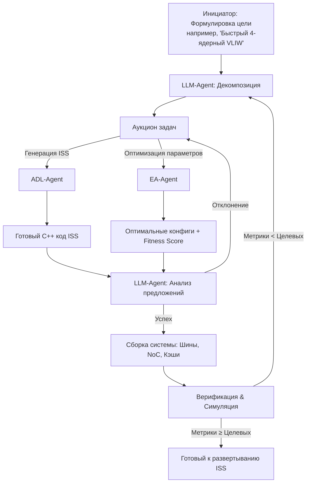

# 🤖 Агентное проектирование процессоров: Комбинирование формальной генерации на ADL с интеллектуальным синтезом на LLM и эволюции

> Гибридная агентная парадигма для автоматизированного проектирования инструкционных симуляторов (ISS) и архитектурного исследования систем-на-кристалле (SoC). Система объединяет детерминированную точность языков описания архитектуры (ADL) с эвристической гибкостью крупных языковых моделей (LLM) и эволюционных алгоритмов (EA).

---

## 🧠 Концептуализация парадигмы

Введение термина **«агентная генерация кода»** обосновано соответствием системы фундаментальным свойствам ИИ-агентов:
- **Автономия:** Самостоятельное выполнение задач без постоянного вмешательства человека.
- **Реактивность:** Мгновенный ответ на изменения в спецификациях или метриках симуляции.
- **Проактивность:** Инициативный поиск решений, декомпозиция сложных целей и запуск новых итераций оптимизации.
- **Социальность:** Координированное взаимодействие между компонентами через стандартизированные протоколы обмена данными.

Парадигма преодолевает ограничения монолитных подходов: чистый ADL обеспечивает корректность, но страдает от жесткости при проектировании сложных SoC; чистый LLM гибок, но склонен к семантическим ошибкам и «галлюцинациям». Их гибридная комбинация создает устойчивый, масштабируемый и самооптимизирующийся пайплайн.

---

## 🏗 Архитектура агентов

Система разделена на два специализированных уровня, каждый из которых выполняет строго определенную функцию в жизненном цикле проектирования.

| Компонент | Роль в системе | Ключевые технологии | Тип поведения | Гарантируемый результат |
|:---|:---|:---|:---|:---|
| **ADL-Agent** | Формальный исполнитель | nML, ASIP Designer, C++ CodeGen | Детерминированный, реактивный | 100% семантическая корректность ISA, генерация ISS/компилятора/ассемблера |
| **LLM+EA-Agent** | Интеллектуальный архитектор | Large Language Models, Evolutionary Algorithms | Эвристический, проактивный, социальный | Оптимизация топологии, кэш-политик, синтез шин/NoC, генерация ускорителей |

---

## 🤝 Синергия и разделение ответственности

Гибридная модель строится на принципе **иерархической дополняемости**:

1. **Фундаментальный уровень (ADL-Agent):**  
   Генерирует семантически верный C++ код ISS на основе формальной спецификации. Гарантирует строгое соблюдение зависимостей данных, порядка выполнения инструкций и организации регистрового файла. Выступает «строительным материалом» и «строительной площадкой».

2. **Интеллектуальный уровень (LLM+EA-Agent):**  
   Работает на уровень абстракции выше ISA. Решает задачи системной интеграции, архитектурной оптимизации и проектирования нестандартных компонентов:
   - **Синтез топологии:** Генерация кода шин, NoC, контроллеров памяти и прерываний.
   - **Архитектурная оптимизация:** Поиск оптимальных конфигураций (размеры буферов, глубина конвейера, политики кэширования) через EA.
   - **Проектирование ускорителей:** Создание кастомных инструкций и аппаратных блоков для специфичных workload'ов.

---

## 📜 Протокол взаимодействия (Contract Net Protocol)

Для обеспечения предсказуемости, отсутствия deadlocks и корректного распределения задач применяется модифицированный протокол **CNP**. Он формализует цикл «запрос → предложение → назначение → интеграция → верификация».

### 🔄 Фазы протокола:
1. **Task Definition:** Человек или верхний планировщик задает высокоуровневую цель и метрики успеха.
2. **Decomposition:** LLM-агент разбивает цель на исполняемые подзадачи.
3. **Bidding:** Распределение задач между ADL-Agent и EA-Agent.
4. **Execution & Proposal:** Генерация кода/параметров и возврат «предложений» с отчетами.
5. **Awarding:** LLM-агент проверяет компилируемость, корректность и выбирает лучший вариант.
6. **Integration:** Сборка единой системы с учетом оптимизированных параметров.
7. **Verification & Feedback:** Запуск симуляции, сравнение с целевыми показателями, запуск новой итерации при необходимости.

> 💡 Для формальной гарантии отсутствия race conditions рекомендуется в будущем расширить протокол через **Multiparty Session Types (MPST)** или спецификации на TLA+.

---

## 📈 Масштабируемость и управление сложностью

### ✅ Факторы роста:
- **Модульность:** Каждый агент изолирован. Легко добавить новые типы агентов (Verilog-генератор, анализатор энергопотребления, FPGA-синтезатор).
- **Распределенность:** Параллельная генерация ядер и запуск distributed EA на кластерах.
- **Экосистемная интеграция:** Использование промышленных симуляторов (Verilator, QEMU) и компиляторов (GCC/LLVM бэкенды).

### ⚠️ Критические вызовы:
| Вызов | Риски | Методы смягчения |
|:---|:---|:---|
| **Координация агентов** | Хаос, дублирование задач, блокировки | Строгий CNP, формальные спецификации диалогов, централизованный IDE-хаб |
| **Качество LLM-кода** | Семантические ошибки, неэффективность, «выдумки» | Обязательный CI/CD пайплайн: компиляция → статический анализ → симуляция → тесты перед приемкой |
| **Констрейнты** | Неконтролируемое «творчество» LLM | Ограничение действий через DSL, правила инвариантов, требование explainability для каждого решения |
| **Вычислительная стоимость** | Долгие EA-итерации, дорогие LLM-запросы | Кэширование промптов, early-stopping в эволюции, использование локальных/оптимизированных моделей |

---

## 🛠 Практический пайплайн: от VLIW к Multicore SoC

1. **Этап 1: Генерация базового ядра (ADL-Agent)**  
   На вход подается `core_adl_spec.nml`. Агент автоматически генерирует cycle-accurate C++ ISS, реализующий конвейер, регистровый файл и логику параллельного выполнения ILP. Результат: проверенный «кирпичик» с гарантированной корректностью.

2. **Этап 2: Синтез топологии и оптимизация (LLM+EA-Agent)**  
   Инженер формулирует цель: *«4-ядерная система, минимизация задержки межъядерной коммуникации»*.  
   - LLM генерирует код шины/NoC, контроллеров памяти, модулей синхронизации.  
   - EA запускает поиск оптимальных параметров кэшей (размер, ассоциативность) через итеративную симуляцию и fitness-оценку.

3. **Этап 3: Верификация и замыкание цикла**  
   Собранный ISS загружает тестовые приложения. Сравниваются IPC, латентность, потребление ресурсов. При отклонении от целевых метрик LLM-агент корректирует топологию, параметры или возвращает задачу на уровень ADL для модификации ISA. Цикл повторяется до сходимости.

---

## 📌 Заключение и вектор развития

Гибридная агентная парадигма трансформирует проектирование процессоров из ручного, итеративного ремесла в **наукоемкий, автоматизированный и кооперативный процесс**. Она не заменяет инженера, а освобождает его от рутинной генерации кода, концентрируя внимание на архитектурных целях, оценке trade-off и валидации результатов.

### 🚀 Шаги для реализации:
1. Создание функционального прототипа с nML → ISS генерацией, ограниченным LLM-планировщиком и базовым EA-оптимизатором.
2. Интеграция CNP-координационного слоя и автоматизированного CI/CD для верификации.
3. Бенчмаркинг: скорость сходимости, качество кода, вычислительная стоимость vs традиционный DSE.
4. Исследование формальных протоколов (MPST, TLA+) для промышленной надежности.

> Система доказывает, что комбинация **формальной строгости** и **эвристического интеллекта** — единственный жизнеспособный путь к автоматизации проектирования чипов следующего поколения.