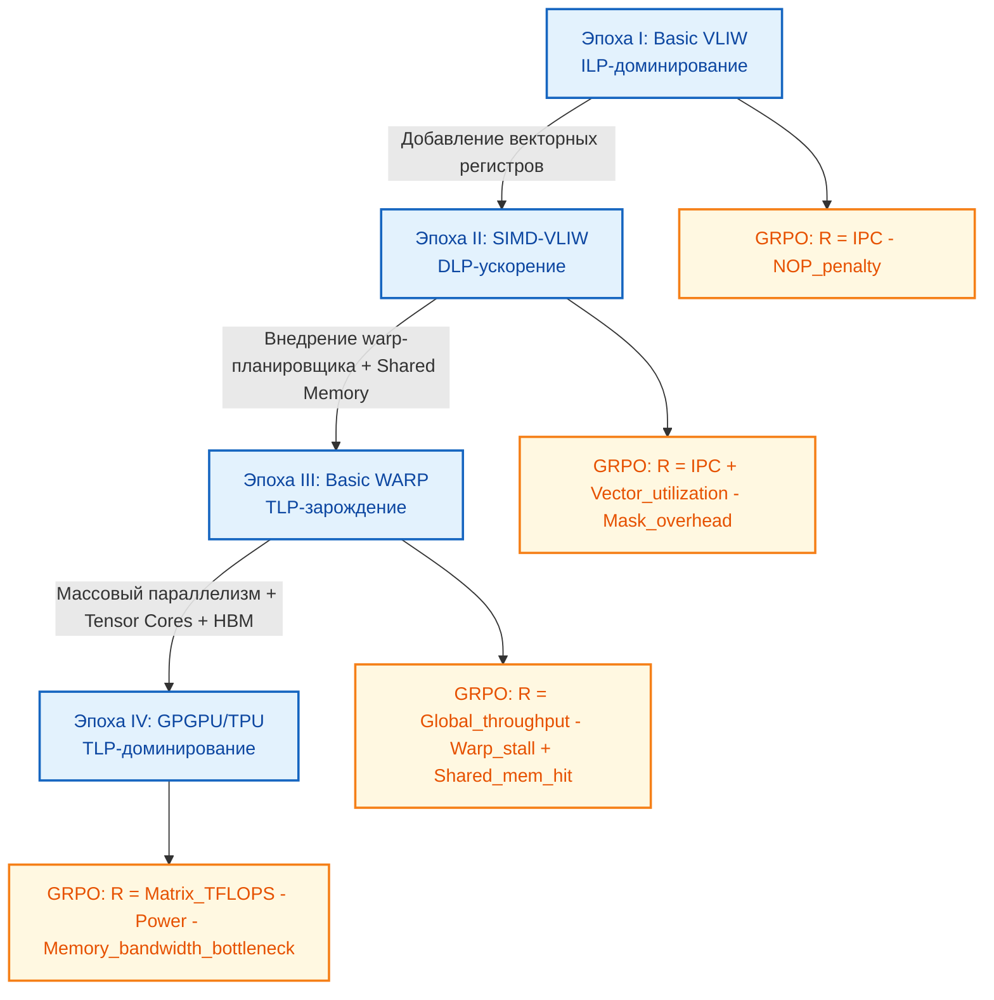

<!--
---
title: "От ILP к TLP: Эволюция VLIW → SIMT и план перехода к GPU"
description: "Архитектурный компромисс, компромиссы HW/SW, латентность и регистровое давление при миграции от статического планирования к динамическому управлению потоками"
tags: [ilp, tlp, vliw, simt, gpu-evolution, compiler, warp-scheduling, chipgpt]
last_updated: 2026-05-14
---
-->

# От ILP к TLP: Эволюция VLIW → SIMT и план перехода к GPU

> **Аннотация**: Анализ фундаментального архитектурного компромисса между Instruction-Level Parallelism (ILP) и Thread-Level Parallelism (TLP). На основе компромиссов VLIW и SIMT сформулирован поэтапный план эволюции ChipGPT от базового VLIW-ядра к GPU/TPU-подобным матрицам, включая привязку аппаратных изменений, сдвигов в инструментарии и целевых программных нагрузок для каждой эпохи.

---

## 🔀 ILP vs TLP: Фундаментальный компромисс

Проектирование современных вычислительных ускорителей сводится к выбору стратегии извлечения параллелизма. Этот выбор определяет распределение ответственности между аппаратным обеспечением и программным стеком, а также диктует архитектуру ядра.

| Аспект | VLIW (ILP-ориентированный) | SIMT / GPU (TLP-ориентированный) |
|:---|:---|:---|
| **Источник параллелизма** | Инструкционный уровень (ILP): упаковка независимых операций в одно длинное слово | Уровень потоков (TLP): массовое выполнение сотен/тысяч потоков со скрытием задержек |
| **Планирование** | Статическое (компилятор). Аппаратура простая, без таблиц переупорядочивания | Динамическое (аппаратура). Warp-планировщик переключает контексты при задержках памяти/ветвлений |
| **Скрытие задержек** | Минимальное. Простои (stalls) напрямую снижают IPC | Активное. Быстрое переключение warps маскирует latency обращения к DRAM |
| **Контрольный поток** | Ветвления разрушают пакет, требуют предикатов/условных NOP | Поддерживается через ветвление warps (серийное выполнение путей с маской отключения) |
| **Давление на регистры** | Побочный эффект software pipelining и раскрутки циклов | Фундаментальное ограничение: хранение контекста каждого потока для мгновенного переключения |

> 💡 **Ключевой вывод**: VLIW — это «спринтер», показывающий максимальную эффективность на коротких, предсказуемых дистанциях с высоким ILP. SIMT — «марафонец», поддерживающий постоянную пропускную способность за счёт массового параллелизма и аппаратного скрытия задержек. Не существует «лучшей» архитектуры; есть оптимальная под конкретный workload.

---

## 🧭 План эпох эволюции: от VLIW к SIMT

Эволюция в ChipGPT спроектирована как плавный переход от компиляторо-зависимой модели к аппаратно-управляемой, с постепенным наращиванием сложности ядра и адаптацией инструментария.

| Эпоха | Архитектурный сдвиг | Ключевые изменения HW | Сдвиг в SW / Toolchain |
|:---|:---|:---|:---|
| **I. Basic VLIW** | ILP-доминирование | Статический планировщик, фиксированные FU, предикатные биты, простой RF | ANSI C/C++ → LLVM backend, ручная раскрутка циклов, статическое расписание |
| **II. SIMD-VLIW** | ILP → DLP (Data-Level Parallelism) | Векторные регистры (128/256/512 bit), lane-based execution, mask-регистры | Авто-векторизация, intrinsics, компилятор генерирует packed-инструкции |
| **III. Basic WARP** | Переход к TLP | Аппаратный warp-планировщик, shared memory, atomic operations, базовая когерентность | Модель потоков (threads/blocks), JIT-компиляция, runtime-балансировка нагрузки |
| **IV. GPGPU / TPU** | TLP-доминирование | Массовый параллелизм, тензорные ядра, аппаратные барьеры, HBM-интерфейс, динамический шейдерный кэш | OpenCL/CUDA-подобный API, графовые вычисления, авто-распределение warps, ML-фреймворки |

---

## 📊 Матрица SW-нагрузок по эпохам

Каждая эпоха требует специфических рабочих нагрузок для валидации архитектуры, калибровки GRPO-функции вознаграждения и настройки MERASIC-бенчмарков.

| Эпоха | Тип нагрузки | Примеры задач | Почему подходит |
|:---|:---|:---|:---|
| **I. Basic VLIW** | Регулярные, предсказуемые, высокий ILP | FIR/IIR-фильтры, скалярные произведения, алгоритмы Витерби, FFT, базовая криптография | Компилятор легко находит независимые операции, упаковывает в VLIW-пакеты без NOP-пробелов |
| **II. SIMD-VLIW** | Данные однородны, векторизуемы | Обработка изображений (свёртки, blur/edge), аудиокодеки, линейная алгебра (BLAS L1/L2), физические симуляции (частицы) | DLP позволяет загрузить векторные lane, маски обрабатывают граничные условия, компилятор генерирует packed-пакеты |
| **III. Basic WARP** | Разветвлённый контроль, локальная память | Ray tracing (divergent paths), графовые обходы (BFS/DFS), sparse matrix operations, базовые нейросетевые слои | Warp-переключение скрывает задержки memory-bound операций, shared memory ускоряет обмен данными внутри warp |
| **IV. GPGPU / TPU** | Массовый параллелизм, тензорные паттерны | Training/Inference (MatMul, Attention, Conv2D), генеративные модели, научные вычисления (CFD, молекулярная динамика) | Аппаратные планировщики и тензорные блоки максимизируют throughput, runtime управляет тысячами потоков |

---

## 🔄 Оптимальная стратегия перехода для ChipGPT

Миграция от VLIW к SIMT не должна быть «большим скачком». Эволюция строится на постепенном переносе ответственности с компилятора на аппаратный планировщик, при сохранении обратной совместимости на уровне ISA и тулчейна.

**Поэтапная реализация:**
1. **Фаза стабилизации VLIW (Эпоха I-II)**: Достичь `IPC ≥ 3.5x` на регулярных нагрузках. Откалибровать компилятор под статическое расписание. Ввести предикаты для минимизации ветвлений.
2. **Мост к TLP (Эпоха II-III)**: Внедрить hardware warp scheduler. Начать с `warp_size = 16`, постепенно увеличивать до 32. Добавить shared memory и барьерные инструкции (`__syncthreads()`-аналоги).
3. **Переход к динамике (Эпоха III-IV)**: Компилятор переходит от полного статического расписания к генерации PTX-подобного IR. Runtime берёт на себя балансировку warps, управление когерентностью и распределение shared memory.
4. **Валидация GRPO**: На каждой фазе функция вознаграждения адаптируется. На ранних этапах штрафуются NOP и простые. На поздних — штрафуются warp divergence, shared memory bank conflicts и промахи HBM.

---

## 🔑 Критические компромиссы при миграции

1. **Сложность железа vs Зависимость от ПО**: VLIW экономит площадь и энергию, но требует «идеального» компилятора. SIMT требует огромного регистрового файла и сложных планировщиков, но прощает неоптимальный код за счёт TLP. ChipGPT должен найти баланс: использовать SIMD/VLIW для предсказуемых ядер, а SIMT — для divergent/memory-bound частей.
2. **Регистровое давление**: В VLIW оно решается упаковкой и software pipelining. В SIMT — лимитирует количество активных warps на SM. Переход требует перепроектирования RF: от 32-64 GPRs к 16K+ registers, разделённых на thread-контексты.
3. **Компиляторный сдвиг**: От LLVM-бэкенда с modulo scheduling → к JIT-компилятору с runtime register allocation и automatic warp formation. GRPO должен обучать не только ядро, но и стратегию компилятора.
4. **Энергоэффективность**: VLIW потребляет энергию на бесполезные NOP. SIMT потребляет на idle warps и контекстные переключения. Оптимальный путь — гибридная модель: статическое планирование на уровне warp + динамическое скрытие задержек на уровне матрицы.

---

## 🏁 Заключение

Эволюция от ILP к TLP — это не замена одной архитектуры другой, а **постепенный перенос интеллекта планирования из компилятора в аппаратный планировщик**. ChipGPT реализует этот переход через четвёрку эпох, где каждая фаза:
- Валидируется на специфических SW-нагрузках, отражающих текущий архитектурный потенциал.
- Калибрует GRPO-функцию вознаграждения под новые метрики (от `IPC` до `Global TLP throughput`).
- Сохраняет обратную совместимость через эволюцию ISA и тулчейна.

Понимание компромиссов VLIW и SIMT позволяет избежать слепого копирования коммерческих GPU. Вместо этого создаётся **адаптивная архитектура**, где статическое планирование оптимизирует предсказуемые ядра, а динамическое управление потоками маскирует задержки в сложных, разветвлённых workload'ах. Это единственный путь к созданию энергоэффективных, масштабируемых ускорителей следующего поколения.

> 📌 *Данный раздел описывает архитектурный переход от ILP к TLP, компромиссы VLIW/SIMT и поэтапный план эволюции ChipGPT. Последнее обновление: май 2026.*

---
