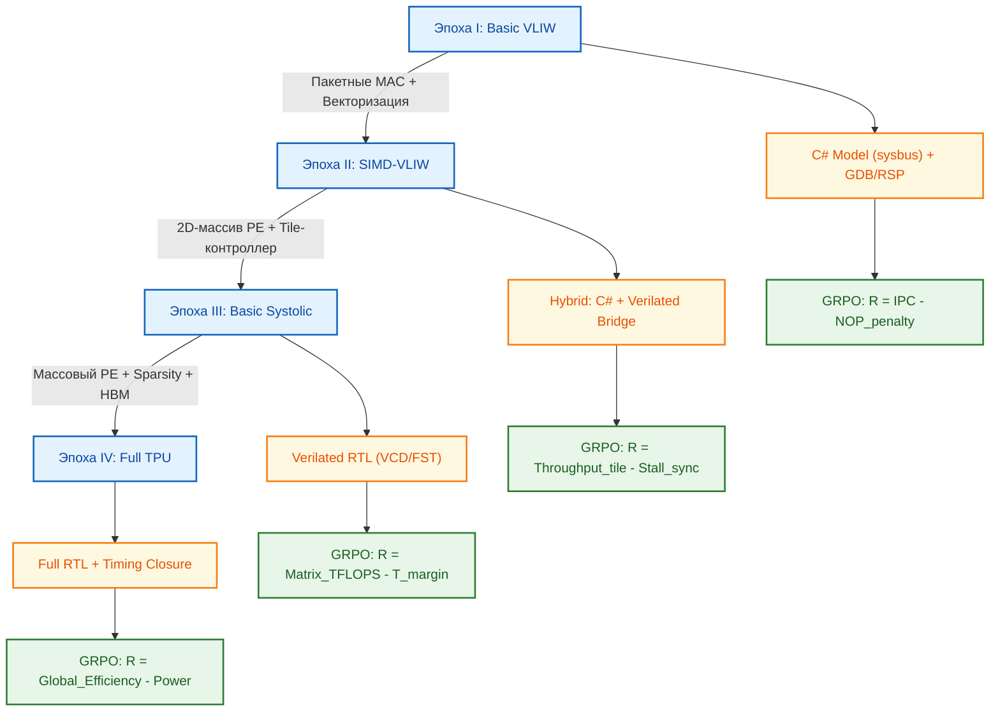

<!--
---
title: "Эволюция VLIW → TPU: Интеграция в Renode и план перехода к тензорным ядрам"
description: "Архитектурный компромисс, фазовая интеграция C#/RTL-моделей в Renode, эволюционные эпохи и сравнительный анализ путей VLIW→GPU vs VLIW→TPU"
tags: [vliw, tpu, systolic-array, renode, csharp-model, verilator, chipgpt, evolution]
last_updated: 2026-05-14
---
-->

# Эволюция VLIW → TPU: Интеграция в Renode и план перехода к тензорным ядрам

> **Аннотация**: Анализ фундаментального компромисса между ILP-ориентированным VLIW и пространственным параллелизмом TPU. Сформулирован поэтапный план эволюции ChipGPT от базового VLIW-ядра к TPU-подобной матрице, включая стратегию фазовой интеграции в Renode (C# vs Verilator), подбор SW-нагрузок для каждой эпохи и сравнительную оценку перспективности путей VLIW→GPU и VLIW→TPU.

---

## 🔀 ILP vs Systolic: Фундаментальный компромисс

Проектирование ускорителей для нейросетевых вычислений требует перехода от извлечения параллелизма на уровне инструкций (ILP) к пространственному потоку данных (Spatial Dataflow). Этот сдвиг определяет распределение логики между компилятором и аппаратным планировщиком.

| Аспект | VLIW (ILP-ориентированный) | TPU / Systolic Array (TPU-ориентированный) |
|:---|:---|:---|
| **Источник параллелизма** | Инструкционный уровень (ILP): компилятор упаковывает независимые скалярные/векторные операции в длинное слово | Пространственный/потоковый уровень: данные проходят через 2D-матрицу MAC-блоков, минимизируя обращения к памяти |
| **Планирование** | Статическое (компилятор). Аппаратура простая, без таблиц переупорядочивания | Фиксированный датафлоу. Аппаратура управляет синхронной передачей весов/активаций, контроллер лишь загружает блоки |
| **Скрытие задержек** | Минимальное. Простои напрямую снижают IPC | Встроено в архитектуру: пока данные проходят через массив, предыдущие блоки уже завершают вычисления |
| **Контрольный поток** | Ветвления разрушают пакет, требуют предикатов/NOP | Практически отсутствует внутри массива. Ветвление обрабатывается контроллером до/после матричных операций |
| **Энергоэффективность** | Зависит от плотности упаковки; NOP потребляют энергию | Высокая для плотных матриц: минимум логики управления, максимум MAC-операций на такт |

> 💡 **Ключевой вывод**: VLIW — это «универсальный атлет», эффективный при сложной логике и предсказуемом ILP. TPU — «узкий спринтер», максимизирующий throughput для матричных операций за счёт жёсткой синхронизации и минимизации управления. Выбор зависит от целевого workload'а.

---

## 🧭 План эпох эволюции: от VLIW к TPU

Эволюция спроектирована как плавный перенос ответственности за распараллеливание из компилятора в аппаратный датафлоу, с постепенным наращиванием специализированных MAC-блоков и контроллеров загрузки данных.

| Эпоха | Архитектурный сдвиг | Ключевые изменения HW | Сдвиг в SW / Toolchain |
|:---|:---|:---|:---|
| **I. Basic VLIW** | ILP-доминирование | Статический планировщик, фиксированные FU (ALU/MAC), простой RF | ANSI C/C++ → LLVM backend, ручная раскрутка циклов, статическое расписание |
| **II. SIMD-VLIW** | ILP → Пакетные MAC | Векторные регистры, packed-MAC инструкции, mask-регистры, расширенные шины | Авто-векторизация, intrinsics, компилятор генерирует packed-пакеты для BLAS L1/L2 |
| **III. Basic Systolic** | Переход к пространственному датафлоу | 2D-массив PE (4x4), локальная shared-память, статический загрузчик весов, VLIW-контроллер feed'а | Генерация tile-расписаний, runtime-управление загрузкой блоков, базовый matrix-IR |
| **IV. Full TPU** | TPU-доминирование | Массовый PE-массив (16x16+), аппаратные планировщики warps/tiles, поддержка sparsity, HBM-интерфейс | High-level graph compiler (MLIR/XLA-подобный), авто-распределение tile'ов, фреймворки PyTorch/JAX |

---

## 📊 Матрица SW-нагрузок по эпохам

Каждая эпоха валидируется на специфических workload'ах, отражающих текущий архитектурный потенциал и калибрующих GRPO-функцию вознаграждения.

| Эпоха | Тип нагрузки | Примеры задач | Почему подходит |
|:---|:---|:---|:---|
| **I. Basic VLIW** | Регулярные, предсказуемые, высокий ILP | FIR/IIR-фильтры, скалярные произведения, алгоритмы Витерби, FFT | Компилятор легко находит независимые операции, упаковывает в VLIW-пакеты без NOP-пробелов |
| **II. SIMD-VLIW** | Векторизуемые, packed-операции | Свёртки изображений, аудиокодеки, линейная алгебра (BLAS L1/L2), физические симуляции | DLP позволяет загрузить векторные MAC-блоки, маски обрабатывают границы, высокая утилизация FU |
| **III. Basic Systolic** | Потоковые матричные, tile-структура | Small MatMul (64x64), базовые слои MLP/Conv2D, attention-проекции | Данные проходят через PE-массив синхронно, shared memory ускоряет обмен, VLIW-контроллер управляет feed'ом |
| **IV. Full TPU** | Массовые тензорные, sparse/dense паттерны | Training/Inference LLM (Attention, MoE), генеративные модели, научные вычисления | Аппаратные планировщики и sparsity-юниты максимизируют TFLOPS, runtime управляет тысячами потоков данных |

---

## 🔗 Стратегия интеграции в Renode: C# vs Verilator/RTL

Эволюция требует надёжной симуляционной среды. Renode предоставляет два фундаментально разных метода моделирования кастомного TPU, которые должны применяться на разных этапах зрелости архитектуры.

| Фаза | Масштаб | Архитектура симуляции в Renode | Цель и фокус GRPO |
|:---|:---|:---|:---|
| **1. Ранняя (0-6 мес)** | ISA + 2x2 PE | C# модель периферии (Register Framework + sysbus) | Быстрая итерация драйверов, валидация проприетарных инструкций, отладка eSW через GDB/RSP |
| **2. Гибридная (6-12 мес)** | 4x4 PE | C# модель + Verilated bridge (частичный RTL) | Функциональная верификация PE-синхронизации, тестирование tile-расписаний, сбор метрик для R_perf |
| **3. Продуктивная (12+ мес)** | 8x8 → 16x16 PE | Чистый Verilated блок (RTL-уровень) | Точный timing closure, отладка метастабильности/гонок, генерация VCD/FST, валидация sparsity-логики |

### Механизм работы
1. **C# модель (Быстрая итерация)**: TPU эмулируется как периферийное устройство на `sysbus`. Логика декодирования и выполнения матричных операций реализуется вручную в C#. Позволяет запускать реальные eSW-драйверы и собирать ранние метрики для GRPO за минуты.
2. **Verilator/RTL (Точная верификация)**: RTL-код TPU компилируется в C++ библиотеку и подключается к Renode через `sysbus`. Обеспечивает cycle-accurate симуляцию, включая задержки шин, конфликты когерентности и timing violations. Генерирует VCD/FST для глубокой отладки PE-массива.
3. **GRPO-петля**: На ранних этапах C# модель даёт быстрый reward-сигнал (`R = IPC_tile - Stall_penalty`). По мере роста сложности массива включается RTL-проверка, добавляющая штраф за `T_margin` (нарушение setup/hold в PE-цепочках).

> 📌 **Ключевой принцип Renode**: Платформа не генерирует семантику инструкций автоматически. На этапе C# логика кодируется вручную, на этапе RTL — она уже заложена в Verilog/VHDL. Комбинация быстрых C#-итераций и точных RTL-симуляций покрывает полный цикл SoC-разработки.

---

## 🔄 Оптимальная стратегия перехода для ChipGPT

**Поэтапная реализация:**
1. **Фаза ISA-валидации (Эпохи I-II)**: Развёртывание C# модели в Renode. Быстрая отладка драйверов, сбор метрик утилизации векторных MAC. Компилятор генерирует tile-IR.
2. **Мост к датафлоу (Эпоха III)**: Внедрение 4x4 PE-массива. Переход к Verilated-модели для верификации синхронизации потоков данных. GRPO начинает штрафовать задержки синхронизации и bank conflicts.
3. **Переход к TPU (Эпоха IV)**: Масштабирование массива, внедрение sparsity-поддержки и HBM. Полная RTL-симуляция в Renode. Финальная калибровка GRPO под энергоэффективность и throughput.

---

## ⚖️ Сравнение путей: VLIW→GPU (SIMT) vs VLIW→TPU

| Критерий | Путь 1: VLIW → SIMT (GPU) | Путь 2: VLIW → TPU (Systolic) |
|:---|:---|:---|
| **Архитектурный сдвиг** | От статического планирования к динамическому warp-менеджменту | От ILP к пространственному датафлоу и фиксированной синхронизации |
| **Контрольный поток** | Поддерживается через ветвление warps (divergence penalty) | Практически отсутствует внутри массива; управляется внешним контроллером |
| **Гибкость** | Высокая: подходит для графики, разветвлённых алгоритмов, GPGPU | Низкая: оптимизирована под матричные/тензорные операции, требует компиляторного tile-расписания |
| **Энергоэффективность** | Средняя: значительные накладные расходы на warp-сcheduling и RF | Высокая: минимум логики управления, максимум MAC/Вт, эффективная реюза данных |
| **Сложность верификации** | Высокая: множество состояний warps, когерентность, dynamic scheduling | Средняя: детерминированный датафлоу, легче формализовать в RTL и Renode |
| **Перспективность для ChipGPT** | Подход "универсального ускорителя" | Подход "специализированного AI-ядра" |

### 🔍 Какой вариант более перспективен?
Для **ChipGPT**, ориентированного на эволюцию AI-акселераторов, **путь VLIW → TPU выглядит более оптимальным** по следующим причинам:
1. **Прямое соответствие workload'ам**: Современные нейросети (Transformers, CNNs, GNNs) на 80-90% состоят из матричных умножений. TPU архитектурно заточен под это, давая 5-10x выигрыш в TFLOPS/Вт по сравнению с SIMT.
2. **Детерминизм для GRPO**: Фиксированный датафлоу TPU упрощает моделирование в Renode и снижает шум в reward-сигнале. Нет динамического warp-сcheduling, который трудно верифицировать на ранних этапах.
3. **Эволюционная совместимость с VLIW**: VLIW-контроллер естественно трансформируется в tile-loader, управляющий загрузкой весов/активаций в PE-массив. Переход требует меньше изменений в ISA, чем внедрение warp-планировщика.
4. **Гибридный запас**: При необходимости можно добавить небольшой SIMT-кластер рядом с TPU-массивом для обработки ветвлений и нестандартных операций, сохраняя основную матрицу детерминированной.

> ✅ **Рекомендация**: Выбрать эволюцию **VLIW → TPU** как базовую траекторию. Использовать Renode (C# → Verilator) для безопасного масштабирования PE-массива. При необходимости поддержки general-purpose workloads добавить опциональный SIMT-контроллер на Эпохе IV.

---

## 🏁 Заключение

Переход от VLIW к TPU — это не замена архитектуры, а **перенос фокуса с извлечения параллелизма инструкций на оптимизацию потока данных**. ChipGPT реализует этот переход через чёткую последовательность эпох, где каждая фаза:
- Валидируется на workload'ах, отражающих текущий уровень параллелизма.
- Интегрируется в Renode по стратегии «C# для скорости → Verilator для точности».
- Калибрует GRPO-функцию вознаграждения под новые метрики (от `IPC` до `Matrix_TFLOPS` и `T_margin`).

Понимание компромиссов между гибкостью GPU и эффективностью TPU позволяет избежать слепого копирования коммерческих архитектур. Вместо этого создаётся **адаптивное тензорное ядро**, где статический VLIW-контроллер обеспечивает надёжный tile-feed, а пространственный PE-массив максимизирует throughput для AI-workload'ов. Это наиболее прямой и энергоэффективный путь к чипам следующего поколения.

> 📌 *Данный раздел описывает архитектурный переход от VLIW к TPU, фазовую интеграцию в Renode и сравнительный анализ эволюционных траекторий. Последнее обновление: май 2026.*

---
