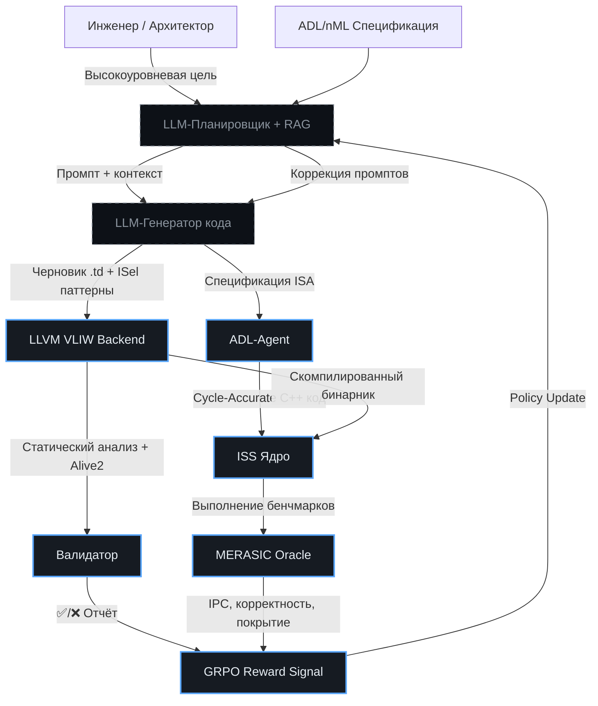

# 🔄 Гибридная адаптация LLVM под VLIW: Ручной контроль + LLM-генерация
> Интеграция ручного инженерного контроля и LLM-ассистированной генерации для ускоренного совместного цикла эволюции ISS и LLVM-бэкенда в VLIWGPT.

## 🎯 Концепция: Скорость LLM × Надёжность Эксперта
Адаптация компилятора LLVM под VLIW-архитектуру традиционно требует глубокого погружения в TableGen, Instruction Selection (ISel), Scheduler и `test-suite`. Чисто ручной подход гарантирует производительность, но занимает недели на одну инструкцию. Чистый LLM-подход даёт черновик за минуты, но несёт риски семантических ошибок и неоптимального кода. 

**Гибридная стратегия VLIWGPT** не заменяет инженера, а переводит его роль из «писателя кода» в «архитектора-валидатора». LLM выступает как генератор шаблонов и ускоритель синтаксически детерминированных задач, а человек и автоматизированные пайплайны гарантируют корректность, производительность и соответствие ISA.

---

## 🗺 План интеграции в эволюционные циклы ChipGPT

| Фаза | Задача | Роль LLM | Роль Инженера / Системы | Результат для ChipGPT |
|:---|:---|:---|:---|:---|
| **1. Фундамент** | Реализация ядра бэкенда: TableGen-структура, базовый ISel, VLIW-планировщик | Анализ аналогов (RISC-V, Hexagon), генерация каркасов | Ручная реализация критических алгоритмов, настройка CI | Надёжная база для Эпохи I (Basic VLIW) |
| **2. База знаний** | Формализация правил VLIW, ограничений портов, паттернов IR→ASM | Структурирование документации, создание RAG-индекса | Верификация правил, наполнение `alive2`/`test-suite` контекстом | Контекст для LLM+EA-Agent и ADL-Agent |
| **3. Параллельный эксперимент** | Добавление новых инструкций (SIMD, предикаты, кастомные операции) | Генерация `.td`-описаний, черновиков ISel-паттернов, ассемблерных тестов | Ревью, правка логики планирования, валидация зависимостей данных | Сокращение цикла `spec → valid backend` с недель до часов |
| **4. Жёсткая валидация** | Проверка корректности и производительности | Генерация fuzz-тестов, IR-паттернов для `IRFuzzer` | Запуск `test-suite`, Alive2 (Translation Validation), MERASIC-бенчмарков | Гарантированная корректность перед коммитом в эпоху |
| **5. Обратная связь** | Обучение системы на успешных паттернах | Fine-tuning на паре `(prompt → validated .td + C++)` | Курирование датасета, обновление RAG-индекса, GRPO reward-сигнал | Самоулучшающийся цикл эволюции компилятора |

---

## 🛠 Архитектура совместного пайплайна VLIWGPT
Ниже представлена схема взаимодействия компонентов. Она заменяет линейный DSE на замкнутый цикл `Генерация → Компиляция → Симуляция → Оценка → Мутация`.

---

## 🔬 Критические компоненты валидации (без них LLM неприемлем)
LLM не заменяет тестирование, а ускоряет подготовку кода к нему. В VLIWGPT внедряются три уровня контроля:

1. **Translation Validation (Alive2):** Гарантирует, что оптимизации и новые паттерны ISel не меняют семантику LLVM IR. Автоматически отклоняет «галлюцинации» модели.
2. **Специфичный `test-suite` для r-VEX:** Набор бенчмарков, нагружающих именно VLIW-особенности (заполнение бандлов, конфликты портов, предикатные вычисления). Запускается на каждом `git push`.
3. **MERASIC как Ground Truth:** Сгенерированный LLVM бинарник выполняется на ISS. Любое расхождение в регистрах/памяти между ISS и эталоном мгновенно формирует отрицательный reward для GRPO и блокирует переход к следующей эпохе.

---

## 📈 Практические рекомендации по внедрению

### ✅ Как ускорить добавление инструкций
- **TableGen-генерация:** LLM отлично справляется с шаблонами `def Instr : InstVLIW<...>`. Инженеру остаётся лишь проверить порты и латентность.
- **Планировщик (Scheduler):** Не генерировать алгоритм с нуля. Использовать LLM для генерации `ScheduleDAG` эвристик и приоритетов, а базовый `list scheduling` оставить ручным.
- **Ассемблерный вывод:** LLM генерирует `InstrInfo.td` + тесты `.s`. Валидатор проверяет дизассемблирование и бинарное кодирование.

### ⚠️ Чего избегать
- **Полной автономии LLM в ISel:** Сложные DAG-преобразования для VLIW требуют понимания регистровых аллокаций и зависимостей. LLM может предложить синтаксически верный, но логически сломанный граф.
- **Игнорирования `alive2`:** Без формальной валидации оптимизаций компилятор может «тихо» ломать код на edge-case'ах.
- **Раздельной эволюции ISS и LLVM:** Если ISS обновляется, а LLVM-бэкенд отстаёт (или наоборот), цикл генерации reward-сигналов разрывается. Обновлять нужно атомарно.

---

## 🚀 Итог: Почему гибридный подход работает для VLIWGPT
Традиционная адаптация LLVM под VLIW — это «тяжёлая артиллерия» для долгосрочных проектов. LLM-подход — это «быстрый прототип». Их гибрид создает **адаптивный конвейер**, где:
1. **Скорость** обеспечивается LLM (генерация `.td`, тестов, шаблонов ISel за минуты).
2. **Корректность** обеспечивается формальными методами (Alive2, MERASIC, `test-suite`).
3. **Эволюция** замыкается через GRPO: успешные валидированные паттерны автоматически усиливают policy модели, снижая долю ошибок в следующих поколениях.

Это позволяет переходить между эпохами ChipGPT (Basic VLIW → SIMD-VLIW → WARP) не с пересборкой компилятора «с нуля» за месяцы, а с итеративным расширением бэкенда и ISS в режиме **непрерывной интеграции архитектурных инноваций**.
