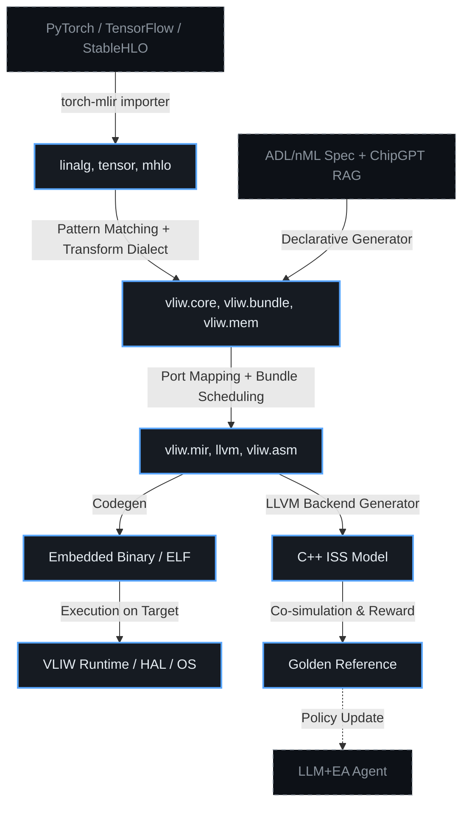

# ⚡ MLIR-генерация IR-слоя и эволюция Embedded SW для VLIW
> Стратегия автоматизированного построения многоуровневого IR-слоя на базе MLIR, ко-эволюция компиляторного стека с аппаратными эпохами ChipGPT и формирование независимой embedded-экосистемы вокруг VLIW-ускорителей.

## 🎯 Научная основа и стратегическое соответствие GIR (GPT IR)
MLIR является не просто одним из возможных инструментов, а **единственной научно обоснованной основой** для решения задачи генерации IR-слоя под специализированное VLIW-железо. Его многоуровневая архитектура, базирующаяся на концепции диалектов, предоставляет теоретически доказанный способ преодоления семантического разрыва между высокоуровневыми ИИ-фреймворками (PyTorch, TensorFlow) и диверсифицированным ландшафтом гибридных и VLIW-архитектур. Это не догма, а вывод, подтверждённый практикой проектов ARIES, POM, HIR и cgrame.

В рамках бизнес-видения ChipGPT не изобретает новый IR, а строго формализует и расширяет существующую парадигму MLIR для конкретной задачи: **автоматической генерации компиляторного стека под корректно сгенерированное HW-ядро**. Прямой ответ на требование «генерации IR слоя под специализированное железо» достигается за счёт декларативного описания архитектуры, из которого автоматически выводятся диалекты, правила понижения (lowering) и базовый embedded-рантайм. Это превращает ручную, многомесячную работу компиляторных инженеров в детерминированный, повторяемый процесс.

---

## 🏗 Архитектура многоуровневого IR-слоя (HLD → HAD → LLD)
Система строится как иерархия диалектов MLIR, где каждый уровень отвечает за определённую степень абстракции. Для VLIW-ядер ChipGPT стек выглядит следующим образом:

| Уровень | Диалект / Роль | Содержание | Взаимодействие с ChipGPT |
|:---|:---|:---|:---|
| **HLD** (High-Level) | `linalg`, `tensor`, `stablehlo`, `torch` | Высокоуровневые графы вычислений из AI-фреймворков. Аппаратно-независимые операции. | Импортируется через `torch-mlir` / `iree-compiler`. Является входом для ADL+LLM-оркестратора. |
| **HAD** (Hardware-Aware) | `vliw.core`, `vliw.bundle`, `vliw.mem`, `vliw.vec` | Операции, отражающие физические ограничения VLIW: порты ALU/FPU, бандлы, предикаты, локальные SRAM, политики кэширования. | Генерируется автоматически из ADL-спецификации (nML/DSL) + RAG-контекста. Содержит явные hint'ы для планировщика. |
| **LLD** (Low-Level) | `llvm`, `vliw.mir`, `vliw.asm` | Финальное машинное представление: расписание тактов, распределение регистров, генерация бандлов, ассемблерный вывод. | Транслируется в C++ для ISS, в RTL для верификации, и в бинарник для embedded-рантайма. |


---

## 🤖 План максимальной автоматизации генерации IR
Процесс генерации IR-слоя в ChipGPT полностью автоматизирован и замыкается в цикл HW/SW ко-эволюции:

1. **Декларативный вход:** ADL-Agent передаёт валидированную спецификацию ядра (порты, латентность, регистры, ISA, ограничения конвейера) в формате YAML/JSON или DSL.
2. **Автоматическая генерация диалектов:** Специальный MLIR-генератор парсит описание и создаёт кастомные диалекты (`vliw.*`). Операции, типы операндов и атрибуты выводятся формально, без ручного C++.
3. **Вывод правил трансформации:** На основе графа зависимостей ISA и ограничений портов генерируется набор MLIR `Transform` правил. Они описывают, как `linalg.matmul` → `vliw.bundle`, как распределять векторные операции по портам, как вставлять NOP или предикаты.
4. **Синтез бэкенда LLVM:** Сгенерированные `.td` файлы (TableGen) и MIR-паттерны автоматически компилируются в `LLVM VLIW Backend`. Это включает ISel (Instruction Selection), RegAlloc и VLIW Scheduler.
5. **Генерация тестового окружения:** Автоматически создаётся `test-suite`, `lit` тесты, `alive2` правила валидации и C++ обёртки для ISS.
6. **Валидация через MERASIC:** Сгенерированный IR компилируется, выполняется на ISS, сравнивается с эталоном. Если корректность <99.99%, LLM+EA-Agent корректирует ADL или правила трансформации, цикл повторяется.

---

## 🔄 Ко-эволюция IR-стека с эпохами ChipGPT
IR-слой не статичен. Он эволюционирует синхронно с аппаратными эпохами, сохраняя обратную совместимость через механизмы MLIR-опциональностей:

| Эпоха | Аппаратный сдвиг | Эволюция IR-стека | Влияние на Embedded SW |
|:---|:---|:---|:---|
| **I. Basic VLIW** | Статический планировщик, фиксированные ALU/FPU, регистровый файл | Введение `vliw.bundle` и `vliw.port_constraint`. Базовый ISel для скалярных ops. Генерация статического расписания. | Минимальный HAL, прямой доступ к регистрам, bare-metal загрузчик, статическое распределение памяти. |
| **II. SIMD-VLIW** | Векторные расширения, предикаты, широкие шины | Добавление `vliw.vec` и `vliw.mask`. Правила авто-векторизации `linalg` → векторные бандлы. Предикатное выполнение в MIR. | Библиотека векторных intrinsic'ов, поддержка SIMD-рантайма, динамическое управление масками, оптимизированный memcpy для широких шин. |
| **III. Basic WARP** | Потоки, разделяемая L1/SRAM, когерентность | Введение `vliw.thread`, `vliw.shared_mem`, `vliw.sync`. Трансформации для warp-level primitives, барьеров, атомарных ops. | Многопоточный рантайм, планировщик warp'ов, когерентный драйвер памяти, поддержка POSIX-подобного API для embedded OS. |
| **IV. GPGPU/TPU** | Массовый параллелизм, тензорные блоки, HBM | Интеграция `linalg`/`mhlo` напрямую в HAD. Авто-маппинг на systolic/tensor dialects. Динамическое расписание + dataflow hints. | Полноценная heterogeneous runtime, драйверы DMA/HBM, поддержка CUDA/OpenCL-совместимого API, JIT-компиляция кернелов. |

Переход между эпохами IR-стека происходит **автоматически**: ADL-Agent расширяет спецификацию, MLIR-генератор добавляет новые диалекты и правила, LLM+EA-Agent оптимизирует пути понижения. Embedded SW слой наращивается инкрементально, не ломая ABI предыдущих эпох.

---

## 🛠 Построение Embedded SW вокруг IR-слоя
IR-слой выступает **фундаментом**, на котором автоматически собирается остальной embedded-софт:

1. **Hardware Abstraction Layer (HAL):** Генерируется из HAD-диалектов. Включает API для доступа к портам, управления тактированием, настройки кэшей и синхронизации. Полностью типизирован и соответствует физической модели ISS.
2. **Memory Management & Allocators:** Встроенные аллокаторы (например, модифицированный `CAllocator` из ChipGPT) автоматически адаптируются под иерархию памяти ядра (регистры → L1 SRAM → HBM/DRAM). Распределение буфферов выводится из IR-анализа lifetime.
3. **Runtime & Scheduler:** Для эпох III+ генерируется легковесный планировщик задач (warp/thread manager), интегрированный с VLIW ISA. Поддерживает асинхронный запуск кернелов, барьеры и атомарные операции.
4. **Toolchain Integration:** Автоматически собираются `clang` (как фронтенд), `llc` (как бэкенд), `ld` (линкер с кастомными секциями для VLIW бандлов), `gdb` (плагин отладки с привязкой к MIR).
5. **Driver Generation:** Для шин (AXI, NoC, TileLink) автоматически генерируются C/C++ драйверы и DMA-контроллеры на основе спецификаций памяти в HAD.

Все компоненты проходят **CI/CD валидацию**: компиляция → статический анализ → выполнение на ISS → сравнение с эталоном → генерация отчёта для GRPO.

---

## 📐 Практические примеры трансформаций
### Пример 1: Картирование линейного слоя на VLIW-бандл
**Исходный IR (HLD):**
```
%out = linalg.matmul ins(%input, %weights : tensor<128x256xf32>, tensor<256x512xf32>)
outs(%init : tensor<128x512xf32>)
```
**Правило трансформации (HAD):** Генератор распознаёт паттерн `matmul` с фиксированными размерами, проверяет наличие векторных портов в ADL, и применяет правило `linalg.matmul -> vliw.vec_matmul_bundle`.
**Результат (HAD):**
```
%out = vliw.vec_matmul_bundle
  %input, %weights
  : tensor<128x256xf32> x tensor<256x512xf32> -> tensor<128x512xf32>
  {ports = [ALU0, ALU1, FPU0], latency = 4, bundle_slots = 3}
```
Это позволяет планировщику LLD упаковать вычисления в 3 такта без NOP, используя все доступные порты VLIW.

### Пример 2: Интеграция кастомной VLIW-инструкции
**Исходный IR (HAD):**
```
%result = vliw.core.custom_fma %a, %b, %c : tensor<f32>
```
**Правило трансформации (LLD):** Связывает операцию с конкретной инструкцией из сгенерированного TableGen (`VEX_FMA3_RR`).
**Результат (LLD/MachineIR):**
```
%r5 = VEX_FMA3_RR %r1, %r2, %r3
```
Инструкция автоматически попадает в бандл, проверяется на конфликты портов и распределяется регистровым аллокатором без вмешательства человека.

---

## 🌐 Независимая экосистема и инструменты
В соответствии с видением GIR, IR-слой ChipGPT распространяется как **открытая, независимая платформа**:
- **Лицензия:** Apache 2.0 / MIT. Полная свобода модификации и коммерческого использования.
- **IDE Integration:** VSCode плагин с подсветкой `vliw.*` диалектов, автодополнением, валидацией в реальном времени и встроенным MLIR Viewer.
- **Симулятор & Отладчик:** Базовый ISS (на C++17) с поддержкой `DAP` (Debug Adapter Protocol). Позволяет отлаживать IR-программы до появления физического чипа.
- **Библиотека базовых ускорителей:** Готовые наборы правил для `conv2d`, `matmul`, `attention`, `softmax` под VLIW/WARP/TPU эпохи.
- **Обратная связь с GRPO:** Успешные трансформации и оптимизированные IR-паттерны автоматически сохраняются в RAG-индекс. LLM+EA-Agent использует их как positive examples для обновления policy, формируя самообучающуюся компиляторную систему.

## 📌 Итог
MLIR-генерация IR-слоя в ChipGPT — это не просто автоматизация компилятора, а **системный переход от ручного ретаргетинга к декларативной ко-эволюции HW/SW**. Многоуровневая архитектура диалектов обеспечивает плавный переход от AI-фреймворков к VLIW-ассемблеру, а автоматическая генерация embedded-стека гарантирует, что каждое новое аппаратное ядро сразу получает полноценный, верифицированный компиляторный и рантайм-окружение. Это замыкает цикл GIR: HW генерируется → IR генерируется → SW строится → MERASIC верифицирует → GRPO обучает → новая эпоха.