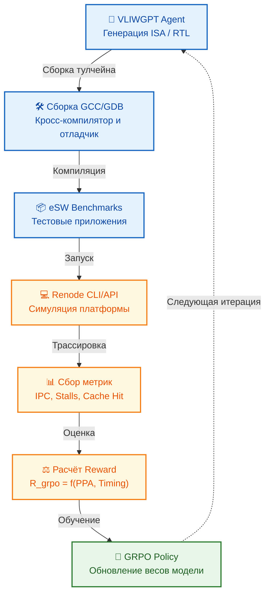

<!--
---
title: "Отладка eSW в Renode: интеграция VLIW и GRPO-петля"
description: "Поэтапное внедрение пользовательской VLIW-архитектуры в Renode, автоматизация отладки embedded-ПО и интеграция метрик исполнения в функцию вознаграждения GRPO"
tags: [renode, vliw, esw-debugging, grpo, gdb-rsp, simulation, toolchain, vliwgpt]
last_updated: 2026-05-14
---
-->

# Отладка eSW в Renode: интеграция VLIW и GRPO-петля

> **Аннотация**: Данный раздел описывает оптимальную методологию внедрения пользовательской VLIW-архитектуры в симуляционный фреймворк Renode. Рассматривается поэтапная настройка ядра, интеграция GDB/RSP, конфигурация периферии и, что критически важно, автоматизация сбора метрик исполнения для формирования reward-сигналов в цикле обучения GRPO платформы VLIWGPT.

---

## 🎯 Почему Renode идеален для VLIWGPT?

Renode выступает не просто как эмулятор, а как **высокоуровневая платформа аппаратно-программной ко-верификации**. Для эволюционного проектирования чипов это критично по трем причинам:

1. **Декларативное описание платформ**: Формат `.repl` позволяет описывать топологию SoC (ядро, память, шины, периферию) в человекочитаемом виде. Это идеально стыкуется с генерацией конфигураций в VLIWGPT.
2. **Расширяемость на Python/C#**: Логика процессора, декодер инструкций и обработка прерываний реализуются скриптовыми плагинами. Нет необходимости перекомпилировать ядро фреймворка при изменении ISA.
3. **Нативная поддержка отладки и трассировки**: Встроенный GDB Server (RSP), механизм захвата выполнения (`trace`), моделирование кэшей и co-simulation с HDL-симуляторами позволяют получать детальные метрики (IPC, cache hit/miss, stall cycles) без модификации исходного кода eSW.

---

## 🛠️ Поэтапный метод внедрения VLIW в Renode

Интеграция новой архитектуры строится по принципу «от минимального работоспособного ядра к полной экосистеме». Это гарантирует быструю валидацию и снижает риск блокирующих ошибок на ранних этапах.

### Шаг 1: Минимальная модель CPU (Python)
Создается базовый класс, наследующий `renode_ctypes.cpu.Cpu`. На этом этапе реализуется только цикл выборки и исполнения одной простой инструкции (например, `ADD`). Конфигурируется `.repl` файл с адресом загрузки и точкой входа.
**Цель**: Убедиться, что Renode загружает ELF-образ, находит `entry point` и начинает выполнение.

### Шаг 2: Базовая интеграция с GDB через RSP
Реализуется минимальный набор обработчиков протокола Remote Serial Protocol: чтение/запись регистров (`g`/`G`), доступ к памяти (`m`/`M`), управление выполнением (`c`/`s`). Особое внимание уделяется обработке программных точек останова (`BKPT`).
**Цель**: Программа корректно останавливается на `main()` в GDB, возможна пошаговая отладка.

### Шаг 3: Расширение до VLIW-семантики
Самый трудоемкий этап. Декодер адаптируется для разбора длинного слова инструкции на набор микроопераций. Исполнительный блок запускает их параллельно в рамках одного такта. Внедряется логика предикатного выполнения (условные NOP) и управления зависимостями (буферы переупорядочивания, если требуется архитектурой).
**Цель**: Корректное исполнение сложных VLIW-пакетов, точный расчет IPC на уровне симуляции.

### Шаг 4: Моделирование ключевой периферии
Создаются модели UART (для логов), таймеров (для RTOS/задержек) и контроллеров прерываний. Используется `SystemRDL` → `peakrdl-renode` для автогенерации простых регистровых блоков, либо кастомные плагины на C# для сложной логики.
**Цель**: Полноценная инициализация eSW, работа драйверов, генерация IRQ.

### Шаг 5: Настройка полного тулчейна
Сборка кросс-компилятора GCC, отладчика GDB и binutils, сконфигурированных под новую VLIW-ISA. Без корректного тулчейна симуляция бесполезна: код не скомпилируется или GDB не сможет декодировать машинные инструкции.
**Цель**: Замкнутый цикл `Код → Компиляция → Запуск в Renode → Отладка`.

---

## 🔗 Интеграция с GRPO: автоматизация и визуализация

Renode не только отлаживает eSW, но и выступает **источником данных для петли обучения GRPO**. Для этого симулятор интегрируется в автоматизированный пайплайн VLIWGPT.

### Механизм формирования Reward-сигнала
GRPO требует количественных метрик. Renode предоставляет их через CLI/API и механизмы трассировки:
- `IPC (Instructions Per Cycle)`: Извлекается из внутренних счетчиков CPU.
- `Stall Reasons`: Профилирование простоев (cache miss, branch mispredict, resource conflict).
- `Execution Time / Cycles`: Точное тактовое время выполнения тестового набора.
- `Memory Access Patterns`: Статистика попаданий/промахов для оценки кэш-политик.

Эти метрики агрегируются в составную функцию вознаграждения:
`R_grpo = w1 * IPC_norm - w2 * Stall_cycles_norm - w3 * Execution_time_norm`

### Автоматизация пайплайна

1. **Headless-режим Renode**: Запуск без GUI через скрипты (`.resc`), что позволяет интегрировать симуляцию в CI/CD и Python-пайплайны.
2. **Автоматический парсинг логов**: Регулярные выражения или JSON-экспорт метрик напрямую передаются в вектор состояния GRPO.
3. **Визуализация**: Дашборды (Grafana/Matplotlib) строят графики роста IPC, распределения stalls и сходимости reward по эпохам, позволяя инженеру наблюдать за эволюцией архитектуры в реальном времени.

---

## 🧰 Тулчейн и экосистема отладки

Для работы связки VLIW + Renode + GRPO требуется строго согласованный набор инструментов:

| Компонент | Роль в VLIWGPT | Особенности конфигурации |
|:---|:---|:---|
| **GCC Cross-Compiler** | Генерация машинного кода для кастомной ISA | Требуется backend с описанием VLIW-пакетов, регистрового файла и латентностей |
| **GDB** | Интерактивная отладка, автоматический сбор состояний | Должен поддерживать расширенный набор регистров и RSP-команды Renode |
| **Binutils** | Ассемблирование, линковка, дамп ELF/дисассемблирование | `objdump` используется для валидации корректности упаковки VLIW-инструкций |
| **Renode CLI** | Headless-запуск симуляции, исполнение скриптов, экспорт трасс | Интегрируется через `subprocess` или `renode-remote-api` для автоматизации |
| **Python/C# Plugins** | Расширение логики CPU, сбор кастомных метрик | Позволяют инжектировать хуки для прямого экспорта состояния в GRPO |

---

## ⚠️ Ключевые вызовы и стратегии их решения

| Вызов | Влияние на проект | Стратегия смягчения |
|:---|:---|:---|
| **Производительность Python-эмуляции** | Параллельное исполнение VLIW-микроопераций на Python может стать бутылочным горлышком | Вынести критический цикл исполнения в C# плагин; использовать JIT-оптимизацию или кэширование декодированных пакетов |
| **Отсутствие готовых шаблонов VLIW** | Придется реализовывать логику конвейера и предикатов с нуля | Начинать с упрощенной модели (1 пакет = 2 операции), постепенно добавлять зависимости и предикаты |
| **Сложность верификации на RTL** | Renode работает на уровне ISS, не гарантирует gate-level корректность | Интегрировать co-simulation с Verilator для финальной валидации критических блоков перед запуском GRPO-эпохи |
| **Шум в метриках для GRPO** | Неоптимальная трассировка или артефакты симуляции искажают reward | Использовать скользящее усреднение метрик, применять фильтрацию выбросов, валидировать на эталонных тестах |

---

## 📌 Заключение

Интеграция пользовательской VLIW-архитектуры в Renode превращает процесс отладки embedded-ПО из ручной процедуры в **автоматизированный, измеримый и воспроизводимый пайплайн**. Для VLIWGPT это означает, что каждая сгенерированная конфигурация ISA и микроархитектуры может быть мгновенно скомпилирована, запущена в реалистичной среде, отлажена при необходимости, а ее производительность — преобразована в точный reward-сигнал. Renode становится мостом между абстрактной эволюционной политикой GRPO и физической реальностью выполнения кода на кремнии.

> 📌 *Данный раздел описывает методологию внедрения VLIW в Renode, настройки тулчейна и интеграции метрик исполнения в петлю обучения GRPO. Последнее обновление: май 2026.*

---
