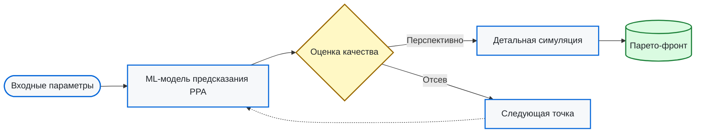
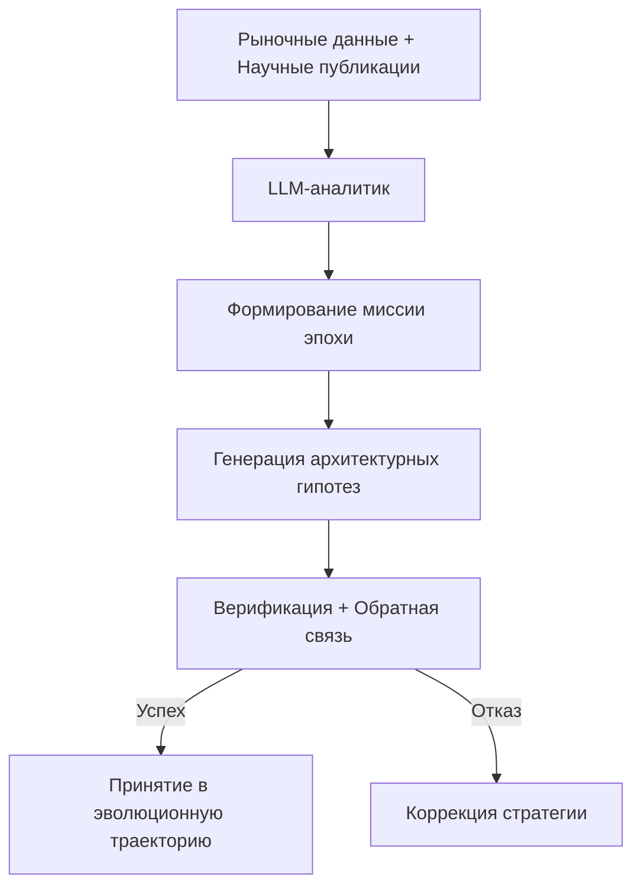
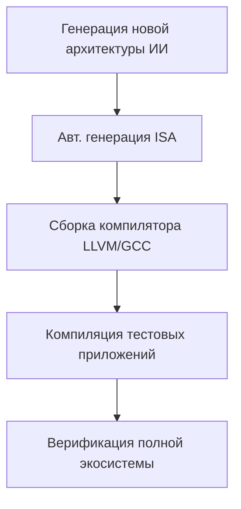
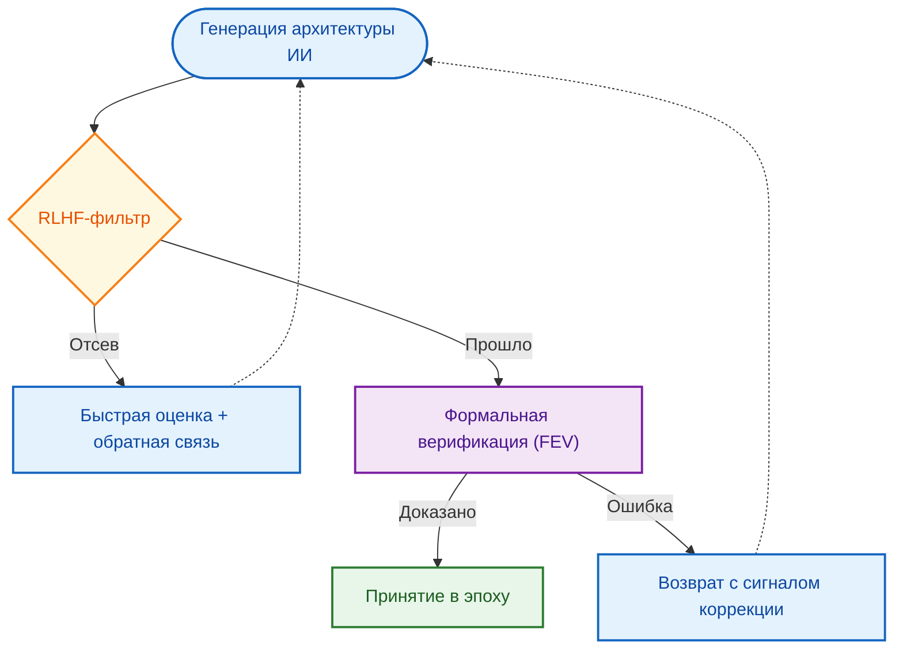
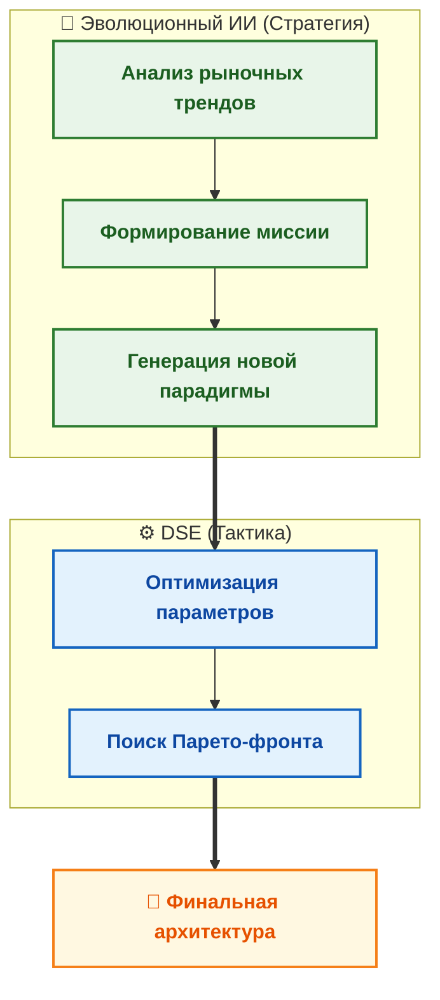

# DSE vs Evolution: Сравнительный анализ парадигм проектирования чипов

> **Аннотация**: Данный раздел представляет концептуальное и методологическое сравнение двух парадигм проектирования интегральных схем: традиционного исследования пространства проектов (Design Space Exploration, DSE) и нового эволюционного подхода на базе искусственного интеллекта. Анализ охватывает философию поиска, роль ИИ, подходы к HW/SW co-design и механизмы обеспечения функциональной корректности.

---

## 📖 Введение

Проектирование современных интегральных схем (SoC, AI-акселераторов) представляет собой сложную задачу **многомерной оптимизации**, где необходимо найти компромисс между множеством взаимоисключающих целей:

- **Performance** — производительность и пропускная способность
- **Power** — энергопотребление и тепловыделение
- **Area** — площадь кристалла и стоимость производства
- **Time-to-market** — сроки разработки и верификации

В ответ на возрастающую сложность сформировались две принципиально различные методологии:

| Парадигма | Ключевая идея | Аналогия |
|-----------|--------------|----------|
| **Design Space Exploration (DSE)** | Систематический поиск оптимальных конфигураций в *заранее заданном* пространстве параметров | Поиск лучшей точки на существующей карте рельефа |
| **Эволюционный подход** | Генерация и исследование *качественно новых* архитектурных уровней на базе ИИ-аналитики | Рисование новой карты мира и прокладка маршрута по ней |

Понимание этих концептуальных основ является отправной точкой для глубокого сравнения двух методологий.

---

## 🔍 Концептуальные основы и методология поиска

### Природа пространства решений

| Характеристика | Традиционный DSE | Эволюционный подход |
|:---|:---|:---|
| **Определение пространства** | Математически заданное, ограниченное, дискретное или непрерывное. Определяется инженером на основе известных паттернов (ASIP, CGRA, MPSoC). | Динамически генерируемое, открытое. Формируется в процессе анализа трендов, гипотез и рыночных данных. |
| **Тип параметров** | Дискретные (количество ядер, размер кэша) или непрерывные (частота, ширина шины). | Качественные архитектурные переходы (VLIW → SIMD-VLIW → GPGPU), новые блоки, гибридные концепции. |
| **Цель поиска** | Нахождение множества **Парето-оптимальных** решений: улучшение одной метрики невозможно без ухудшения другой. | Создание и исследование новых, ранее не существовавших архитектурных концепций («первое из первых»). |
| **Роль инженера** | Определение границ пространства, выбор метрик, интерпретация результатов. | Формулирование миссии, предоставление данных, контроль за этапами эволюции. |
| **Аналогия в ML** | Подбор гиперпараметров для заданной архитектуры нейросети. | Neural Architecture Search (NAS) с нуля: создание новой архитектуры нейросети. |

### Стратегии навигации

#### __В традиционном DSE__:
- **Полный перебор / ветви и границы** — для небольших, хорошо структурированных пространств.
- **Стохастические алгоритмы**: генетические алгоритмы, имитация отжига, поиск с запретами (Tabu Search).
- **Суррогатные модели на базе МО**: предсказание задержек и энергопотребления без дорогостоящих симуляций.
- **Агентные фреймворки** (например, CSDSE): баланс между *исследованием* (exploration) и *эксплуатацией* (exploitation).
- **LLM-интерфейсы** (например, iDSE): интерпретация намерений дизайнера для адаптивного поиска.

#### __В эволюционном подходе__:
- **Стратегическое планирование вместо навигации**: ИИ определяет *что* искать, а не только *где*.
- **Анализ глобальных данных**: рыночные тренды, научные публикации, спецификации рабочих нагрузок.
- **Генерация гипотез**: предложение качественных архитектурных переходов (например, «добавить тензорный блок к VLIW»).
- **Принцип «REASONING-DRIVEN»**: смещение фокуса с механического перебора на интеллектуальное планирование долгосрочного пути развития.

> 💡 **Ключевое различие**: DSE оптимизирует *внутри* заданных контуров; эволюционный подход *расширяет* сами контуры, создавая новые парадигмы.

---

## 🤖 Роль искусственного интеллекта

### ИИ в традиционном DSE: «Ускоритель и помощник»

ИИ применяется для преодоления вычислительных *bottlenecks* при оценке тысяч конфигураций:

**Основные применения:**
- Суррогатные модели: быстрое предсказание PPA-метрик на основе исторических данных симуляций.
- Навигационные алгоритмы: балансировка исследования/эксплуатации в сложных пространствах.
- Интерактивные фреймворки: LLM как интерфейс между инженером и системой DSE.

### ИИ в эволюционном подходе: «Стратегический руководитель»

ИИ (преимущественно LLM и агентные системы) переходит на уровень принятия стратегических решений. Схема эволюционного цикла:

**Ключевые функции:**
- Формирование миссии: выбор долгосрочного вектора развития на основе анализа трендов.
- Генерация концепций: предложение гибридных архитектур, выходящих за рамки человеческих шаблонов.
- Совместная генерация экосистемы: архитектура + ISA + компилятор + драйверы как единое целое.

| Аспект | Роль ИИ в DSE | Роль ИИ в эволюционном подходе |
|:---|:---|:---|
| **Основная функция** | Ускоритель и оптимизатор поиска; помощник дизайнера чипа | Стратегический руководитель и генератор идей; «REASONING-DRIVEN» идеология|
| **Цель** | Найти лучшее решение в заданном пространстве | Определить новое перспективное пространство и направить эволюцию к нему |
| **Тип задач** | Операционная оптимизация (хорошо поставленная задача) | Стратегическое планирование и открытия/инновации (нечетко поставленная задача) |
| **Входные данные** | Параметры пространства, целевые функции | Глобальные рыночные данные, научные статьи, спецификации задач |
| **Выходные данные** | Множество Парето-оптимальных решений | Стратегический план развития («эпохи»), новые архитектурные концепции |

---

## 🔗 HW/SW Co-дизайн

### В традиционном DSE: итеративная оптимизация

**Характеристики:**
- Параллельный или последовательный поиск пары «архитектура ↔ ПО».
- ПО адаптируется под выбранную аппаратную платформу.
- Ограниченная гибкость: изменения ПО — это адаптация к данной платформе.
- Примеры: фреймворки SECDA, CHaNAS (совместный поиск архитектуры НС и политики компилятора).

### В эволюционном подходе: совместная генерация

**Характеристики:**
- Единый интегрированный процесс: при генерации архитектуры одновременно создаётся её ПО-экосистема.
- Высокая гибкость: возможна генерация полностью нового набора инструкций и соответствующего компилятора.
- Старые решения признаются устаревшими при качественных переходах; экосистема создаётся заново.

| Аспект | HW/SW Co-design в DSE | HW/SW Co-design в эволюционном подходе |
|:---|:---|:---|
| **Основной принцип** | Итеративная оптимизация: поиск лучшей пары «архитектура-софт» в заданном пространстве | Совместная генерация: создание новой, взаимосвязанной экосистемы «архитектура-софт» с нуля |
| **Процесс** | Параллельный/последовательный поиск: архитектура → адаптация ПО → оценка | Единый процесс: генерация архитектуры + автоматическая генерация ISA, компилятора, драйверов |
| **Гибкость** | Ограничена выбранной платформой; ПО адаптируется к «железу» | Высокая; возможна генерация принципиально новой ISA и инструментария |
| **Отношение к legacy** | Старые решения — часть пространства поиска | Старые решения могут быть заменены при качественных переходах |

---

## 🛡️ Обеспечение функциональной корректности

### Традиционный DSE: затратная, но стандартная процедура

**Методы верификации:**
- Моделирование (симуляция): запуск RTL-модели на тестовых наборах. Главный недостаток — неполное покрытие.
- Формальная верификация (FEV): математическое доказательство эквивалентности RTL и высокоуровневой модели (C/C++/SystemVerilog). Инструменты: SymbiYosys, Synopsys, Cadence.
- Проблема масштаба: полная верификация для каждой точки пространства поиска невозможна, поэтому используются суррогатные модели предсказания, что оставляет риск скрытых дефектов.

### Эволюционный подход: верификация как неотъемлемая часть генерации

Ключевой вызов: нельзя доверять архитектурам, сгенерированным «чёрным ящиком», без автоматизированной гарантии корректности. 

Требуется двухуровневая система:

**Уровень 1: RLHF (обучение с подкреплением от человеческой обратной связи)**
- Роль: быстрый статистический фильтр.
- Механизм: ИИ получает вознаграждение за архитектуры, успешно прошедшие оценку, и штраф за некорректные.
- Ограничение: вероятностная, а не математическая гарантия.

**Уровень 2: Формальные методы доказательства**
- Роль: абсолютный «экзаменатор».
- Механизм: FEV доказывает соответствие сгенерированной RTL-модели высокоуровневой спецификации.
- Результат: «цепь доверия», где каждое новое поколение архитектуры доказуемо корректно.

| Аспект | RLHF | Формальные методы верификации |
|:---|:---|:---|
| **Основной принцип** | Статистическое обучение на основе обратной связи | Математическое доказательство свойств системы |
| **Тип гарантии** | Вероятностная (обучение на данных) | Абсолютная (доказательство для всех состояний) |
| **Скорость** | Относительно быстрая | Относительно медленная, ресурсоёмкая |
| **Область применения** | Широкий поиск, отсев некорректных вариантов | Окончательная верификация перспективных архитектур |

> ✅ **Синергия**: RLHF направляет ИИ в безопасное пространство решений; формальные методы предоставляют окончательную, неопровержимую оценку.

---

## 🔄 Синергия и гибридные модели

Парадигмы не являются взаимоисключающими. Наиболее перспективной считается **гибридная архитектура проектирования**:

**__Принцип работы__:**
- Эволюционный ИИ определяет стратегию (`что создавать`): например, «архитектура с упором на обработку графов».
- Традиционный DSE берёт на себя тактику (`как реализовать оптимально`): оптимизация размера кэшей, глубины конвейера, топологии шин для данной новой парадигмы.

**__Преимущества гибридного подхода__:**
- Сочетание инновационности генеративного поиска с инженерной надёжностью методов оптимизации.
- Возможность масштабировать верификацию: формальные методы применяются к финальным кандидатам после DSE.
- Гибкость: можно переключаться между парадигмами в зависимости от стадии проекта.

---

## 📊 Сравнительная матрица

| Характеристика | Design Space Exploration (DSE) | Эволюционный подход (Evolutionary) |
|:---|:---|:---|
| **Философия** | Оптимизация в известных рамках | Исследование и создание нового |
| **Пространство решений** | Фиксированное, параметризуемое | Динамическое, генерируемое |
| **Роль ИИ** | Ускоритель, предиктор, помощник | Стратегический аналитик, генератор |
| **HW/SW Co-design** | Итеративная адаптация ПО под аппаратуру | Единая генерация архитектуры + ISA + компилятора |
| **Верификация** | Финальный, затратный этап выборочной проверки | Встроенный, автоматизированный пайплайн (RLHF + FEV) |
| **Основной риск** | Застревание в локальных оптимумах, скрытые дефекты после предсказания | Генерация некорректных архитектур, сложность управления «чёрным ящиком» |
| **Масштабируемость** | Ограничена вычислительной стоимостью симуляций | Ограничена надёжностью автоматизированной верификации |
| **Готовность к внедрению** | Зрелая, промышленно отлаженная методология | Экспериментальная, требует развития инструментов верификации |

---

## 🔮 Перспективы развития

### Для традиционного DSE:
- Точные суррогатные модели: снижение зависимости от дорогостоящих симуляций.
- Explainable-DSE: интеграция LLM для объяснимого поиска и интерпретации результатов.
- Масштабирование инфраструктуры: поддержка многопроцессорных, киберфизических и нейроморфных систем.

### Для эволюционного подхода:
- Автоматизированные формальные верификаторы: инструменты, способные работать с динамически генерируемыми ISA и гетерогенными блоками.
- Стандартизация «эпох»: формализация интерфейсов между этапами эволюции для обеспечения преемственности.
- Доверие к генеративным моделям: развитие методов интерпретируемости и аудита решений ИИ.

### Общий тренд:
Индустрия движется к полной автоматизации цикла `Concept → RTL → ISA → Compiler → Verification`, где DSE остаётся незаменимым инструментом для детальной оптимизации существующих технологий, а эволюционные методы открывают путь к созданию чипов, адаптированных к задачам будущего. Гибридные системы сочетают сильные стороны обеих парадигм, обеспечивая баланс между инновационностью и надёжностью.

---

## 📚 Ссылки и источники

1. Synopsys. *Equivalence Checking, Functional ECO & SoC Verification*.
2. Springer. *A Case Study on Formal Equivalence Verification Between a C/C++ Model and Its RTL Design*
3. MDPI. *A Survey on Design Space Exploration Approaches for Approximate...*
4. ACM. *Explainable-DSE: An Agile and Explainable Exploration of Efficient...*
5. arXiv. *MAGE: A Multi-Agent Engine for Automated RTL Code Generation*.
6. arXiv. *iDSE: Navigating Design Space Exploration in High-Level Synthesis*.
7. arXiv. *Fully Automated Hardware and Software Design for Processor Chip*.
8. Springer. *Handbook of Hardware/Software Codesign*.
9. MDPI. *Towards Secure and Adaptive AI Hardware: A Framework for Optimizing LLM-Oriented Architectures*
10. IEEE. *Neural Architecture Search and Hardware Accelerator Co-Search*.

> 📌 *Данный раздел основан на методологическом анализе парадигм проектирования интегральных схем, охватывающем концептуальные различия, роль ИИ, подходы к HW/SW co-design и механизмы обеспечения функциональной корректности. Последнее обновление: май 2026.*