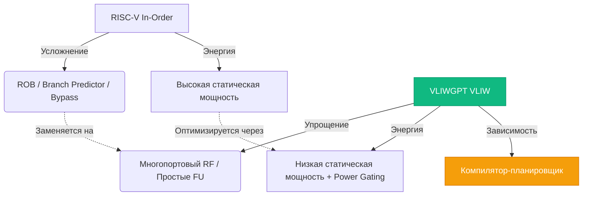
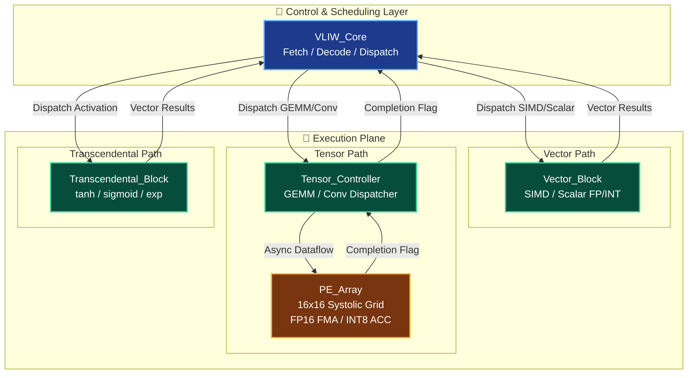
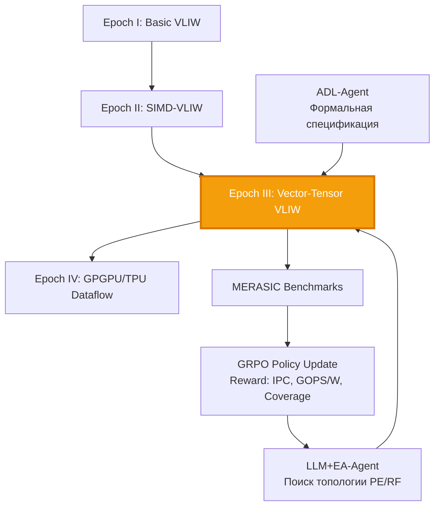

# 🧬 Эволюция VLIWGPT: Векторно-тензорный ускоритель для AI и H.264

> **Статус**: Active Development | **Эпоха**: III → IV | **Обновлено**: 2026-06-10  
> **Связанные документы**: [Парадигма эволюции](#/wiki/evolutionary-paradigm) | [Эпоха II: SIMD-VLIW](#/docs/blocks/epoch-2-simd-vliw) | [MERASIC Benchmarks](#/wiki/merasic/merasic-genesys-pro-hybrid-verification)

---

<!--

## 📋 Содержание
1. [Архитектурный сдвиг: RISC-V In-Order → VLIW-ядро](#1-архитектурный-сдвиг-risc-v-in-order--vliw-ядро)
2. [Три столпа эволюции](#2-три-столпа-эволюции)
   - [Векторный вычислительный блок](#21-векторный-вычислительный-блок)
   - [Тензорный вычислительный блок](#22-тензорный-вычислительный-блок)
   - [Блок трансцендентных функций](#23-блок-трансцендентных-функций)
3. [Управление данными и памятью](#3-управление-данными-и-памятью)
4. [Целевые нагрузки: H.264 и INT8 AI](#4-целевые-нагрузки-h264-и-int8-ai)
5. [Риски и стратегические рекомендации](#5-риски-и-стратегические-рекомендации)
6. [Интеграция в цикл ChipGPT](#6-интеграция-в-цикл-chipgpt)

---
-->

## 1. Архитектурный сдвиг: RISC-V In-Order → VLIW-ядро

Гипотеза архитектуры Эпохи III предполагает замену скалярного RISC-V in-order конвейера в эталоне ET-Minion на **VLIWGPT VLIW-ядро**. Это не механическая замена компонента, а фундаментальный переход от парадигмы *«аппаратное управление параллелизмом»* к парадигме *«компиляторное статическое планирование»*.

### Ключевые отличия и преимущества
| Характеристика | RISC-V In-Order (ET-Minion) | VLIWGPT VLIW (Эпоха III) |
|----------------|-----------------------------|--------------------------|
| **Управление параллелизмом** | Динамическое (аппаратное) | Статическое (компиляторное) |
| **Сложность ядра** | Высокая (ROB, bypass, branch predictor) | Низкая (многопортовый RF, простые FU) |
| **Энергопотребление** | Высокая статическая мощность | Низкая статическая мощность, зависит от загрузки FU |
| **Зависимость от ПО** | Средняя | Критически высокая (качество планировщика) |
| **Реакция на задержки** | Динамическое переупорядочивание | Вставка NOP, простой конвейера |

Переход сохраняет два ключевых принципа ET-Minion:
1. **Энергоэффективность при низком напряжении** → Упрощённая VLIW-логика снижает утечки, открывая путь к Near-Threshold Computing (NTC) и агрессивному Power Gating.
2. **Программно-конфигурируемый L1 (Cache/Scratchpad)** → Scratchpad становится критическим элементом: компилятор явно управляет данными, исключая неопределённость кэш-промахов и гарантируя доставку операндов к VLIW-инструкции.


---

### 🧠 Почему Scratchpad критичен для VLIW?

VLIW-архитектуры **статически планируют** выполнение инструкций на этапе компиляции. Это означает:

1. **Компилятор знает заранее**, какие данные понадобятся в каждом такте.
2. Если данные не придут вовремя — конвейер простаивает, выполняя NOP-инструкции.
3. Кэш-промах (cache miss) в такой ситуации **катастрофичен**: он ломает статический план и убивает производительность.

**Scratchpad решает эту проблему:**
- Компилятор явно генерирует инструкции для загрузки данных в scratchpad **до** начала вычислений.
- Доступ к scratchpad всегда детерминирован (1 такт, без промахов).
- Это позволяет компилятору **гарантировать**, что операнды будут готовы к моменту исполнения VLIW-инструкции.

---

### 🛠️ Как это работает в VLIWGPT / ET-Minion


| Параметр сравнения | CACHE (Аппаратный кэш) | SCRATCHPAD (Программная память) |
| :--- | :--- | :--- |
| **Управление** | Аппаратный контроллер | Программное (через прямые `load/store` или DMA) |
| **Механизм работы** | Автоматические алгоритмы замещения (LRU) | Явное размещение данных компилятором/разработчиком |
| **Доступ и промахи** | Непредсказуемые задержки при промахе | Детерминированный доступ (1 такт, 0 промахов) |
| **Идеально для** | Общий код, непредсказуемые паттерны | VLIW-циклы, DSP, AI-инференс, предсказуемые данные |


**Пример использования в коде:**
```c
// Компилятор генерирует:
// 1. Заранее загружаем данные в scratchpad
dma_load_to_sp(src_addr, sp_addr, size);  // DMA-транзакция

// 2. Выполняем VLIW-цикл, зная, что данные уже на месте
for (int i = 0; i < N; i += VLIW_WIDTH) {
    // VLIW-инструкция: 4 параллельных операции
    // Все операнды читаются из scratchpad за 1 такт
    vliw_add_sp(r0, r1, r2, r3);  // r1,r2,r3 из scratchpad
}

// 3. При необходимости — сохраняем результат обратно
dma_store_from_sp(sp_addr, dst_addr, size);
```

---

### ✅ Преимущества Scratchpad для VLIW

| Преимущество | Почему это важно для VLIW |
|--------------|---------------------------|
| **Детерминизм** | Компилятор может точно спланировать доступ к данным без риска промаха |
| **Энергоэффективность** | Нет логики тегов, сравнения, замещения → меньше переключений → меньше энергопотребления |
| **Контроль** | Разработчик может оптимизировать размещение данных под конкретный алгоритм |
| **Предсказуемость времени** | Критично для real-time систем (видео, DSP, AI inference) |

---

### ⚠️ Недостатки (и почему не всегда используют)

| Недостаток | Когда это проблема |
|------------|-------------------|
| Требует ручного управления данными | Для общего кода с непредсказуемыми доступами — сложно и трудоёмко |
| Нужно писать/генерировать DMA-код | Усложняет компилятор и тулчейн |
| Меньший размер (обычно 16–64 КБ) | Не подходит для больших working set'ов |

---

### 🔗 Связь с ET-Minion и VLIWGPT

В процессоре **Esperanto ET-Minion** (и в предлагаемом VLIWGPT-SIMD) реализована **гибридная модель**:
- L1 данных можно программно переключить между режимом **кэша** и режимом **scratchpad**.
- Это даёт гибкость: общий код работает через кэш, а критичные VLIW-циклы — через scratchpad.
- Компилятор (или разработчик) сам решает, какой режим использовать для каждой области памяти.

**Именно эта гибкость делает scratchpad «критическим элементом»**: он позволяет сохранить преимущества VLIW (простота, энергоэффективность) без жертв в предсказуемости выполнения.

## 2. Три столпа эволюции

Центральный элемент архитектуры Эпохи III/IV — гибридный **векторно-тензорный блок**, разделяющий линейную алгебру, массовый параллелизм и нелинейные функции.

### 2.1 Векторный вычислительный блок
Блок обеспечивает высокую пропускную способность для стандартных SIMD-операций и служит интерфейсом между скалярным VLIW-ядром и тензорным массивом.

**Архитектурные параметры:**
- **Целочисленная шина:** 512 бит → 128 параллельных INT8 операций/такт → **128 GOPS/ГГц** (целевой показатель).
- **Шина FP:** 256 бит → поддержка 64 FMA для FP16 и 32 FMA для FP32 одновременно.
- **Модульность:** Закладывается поддержка FP8 (E4M3/E5M2) и INT4 через расширяемые вычислительные ячейки.
- **Смешанная точность:** Аппаратные блоки on-the-fly де/квантизации (например, W4A16) для снижения трафика памяти.
- **Variable Length (VL):** Мелкозернистое программное управление длиной вектора для минимизации простаивающих ресурсов.

### 2.2 Тензорный вычислительный блок
В отличие от монолитной модели ET-Minion (где одна инструкция «усыпляет» скалярный конвейер на 512 циклов), предлагается **асинхронная архитектура на основе массива конвейеризированных ячеек (Processing Elements, PEs)**.

**Принцип работы:**
- **Массив PEs:** Регулярная сетка (например, 16×16), где каждый PE выполняет FP16 FMA или INT8 accumulation.
- **Контроллер тензоров:** Декодирует высокоуровневые вызовы (GEMM, свёртки), планирует поток данных и инициализирует массив.
- **Асинхронность:** Основной VLIW-конвейер **не блокируется**. Ядро продолжает выполнение управляющей логики, пока тензорный блок вычисляет матрицы. По завершении генерируется прерывание/флаг готовности.
- **Совместимость с TVM:** Регулярная структура идеальна для автоматического распараллеливания графов нейросетей современными компиляторами.

### 2.3 Блок трансцендентных функций
Неотъемлемая часть графа вычислений нейросетей (функции активации, нормализация). Аппаратная реализация снимает нагрузку с VLIW-ядра и векторного блока.

**Реализация:**
- **Алгоритм CORDIC:** Вычисление `tanh`, `sigmoid`, `exp`, `log` через сдвиги и сложения. Чрезвычайно эффективен по площади и энергии.
- **Конвейер:** Непрерывная обработка векторов активаций без stalls.
- **Аппроксимация:** Настройка количества итераций CORDIC для баланса точность/энергия (approximate computing).


---

## 3. Управление данными и памятью

VLIW-архитектуры критически чувствительны к задержкам доступа к памяти («проблема фон Неймана»). Любой stall аннулирует преимущества параллелизма.

**Стратегия минимизации задержек:**
1. **Многоуровневые регистровые файлы:** `Vector RF` и `VPU RF T0/T1` физически расположены рядом с FU. Служат для сквозной передачи данных (bypassing) между блоками без обращения к общей памяти.
2. **Программируемый Scratchpad:** Разработчик явно размещает веса и активации в быстрой SRAM. Компилятор генерирует инструкции DMA/LOAD заранее, гарантируя наличие данных к моменту исполнения VLIW-пакета.
3. **Streaming Interfaces:** Потоковая передача данных между L1/L2 и векторно-тензорным блоком минимизирует количество транзакций шины.
4. **Bypass-пути:** Прямые соединения `Vector → Tensor` и `Tensor → Vector` для промежуточных результатов слоёв нейросети.

---

## 4. Целевые нагрузки: H.264 и INT8 AI

Архитектура оптимизирована под два класса задач, где статическое планирование VLIW раскрывает максимальный потенциал:

### 🎥 Декодирование видео H.264/AVC
- **Параллелизм макроблоков:** Независимая обработка блоков позволяет компилятору группировать операции де-квантования, IDCT и предсказания в плотные VLIW-пакеты.
- **Роль блоков:** VLIW-ядро управляет буферами и потоком, векторный блок выполняет линейные преобразования, тензорный блок ускоряет сложные фильтры или нестандартные алгоритмы предсказания.

###  Целочисленный AI (INT8/FP8 Inference)
- **Квантизация:** Переход весов/активаций в INT8/FP8 сокращает трафик памяти и позволяет использовать простые ЦАЛУ вместо тяжёлых FP-блоков.
- **Синергия:** VLIW-ядро выполняет управляющую логику (attention masks, normalization, post-processing), а векторно-тензорный блок берёт на себя массовые MAC-операции.
- **Арифметическая интенсивность:** VLIW-упаковка повышает отношение `FLOPs:Bytes`, снижая sensitivity к bandwidth памяти (критично для LLM inference).

---

## 5. Риски и стратегические рекомендации

Замена RISC-V in-order на VLIW технически осуществима, но сопряжена с архитектурными компромиссами. Успех зависит не от «железа», а от экосистемы и выбора сценариев.

### ⚠️ Ключевые риски
1. **Зависимость от компилятора:** Без продвинутого планировщика VLIW-ядро будет простаивать, выполняя NOP. Производительность на ватт резко упадёт на нерегулярных задачах.
2. **Раздувание кода:** Вставка NOP для заполнения FU увеличивает размер бинарника, требуя большего L1 I-Cache и пропускной способности шины инструкций.
3. **Энергоэффективность на широком спектре:** Теоретически VLIW потребляет меньше статической мощности, но на практике плохая утилизация FU нивелирует выигрыш.

### 📐 Стратегические рекомендации
| Направление | Действие |
|-------------|----------|
| **Фокус на компиляторе** | Инвестировать в адаптацию LLVM/TVM. Компилятор должен оптимально распараллеливать код и распределять задачи между VLIW и тензорным блоком. Это основа успеха. |
| **Специализированная платформа** | Не стремиться к универсальности. Создать нишевый ускоритель для H.264 и INT8 AI, где VLIW играет роль специализированного контроллера, а не общего CPU. |
| **Параллельная разработка инструментов** | Одновременно с RTL проектировать компилятор, библиотеки и отладочные средства. Рынок не примет архитектуру без мощного тулчейна. |
| **Метрики оценки** | Акцент на `GOPS/W` и `Performance/Watt` на целевых бенчмарках, а не на пиковых GOPS. Анализировать сложность разработки ПО и гибкость системы. |
| **Управление энергией** | Внедрить гранулярный Power Gating и Clock Gating для простаивающих PEs и FU. Поддержать DVFS (300 МГц – 2 ГГц) для адаптации к нагрузке. |

---

## 6. Интеграция в цикл ChipGPT

Данная архитектура является естественным продолжением эволюционной цепочки ChipGPT:



**Критерии перехода к Эпохе III:**
- Функциональная корректность >99.99% на MERASIC (H.264 macroblock, INT8 GEMM)
- Достижение целевой энергоэффективности ≥128 GOPS/ГГц при DVFS 1 ГГц
- Успешная генерация VLIW-пакетов с утилизацией FU ≥75% через адаптивный компилятор


---

## 📎 Приложения

### A. Спецификации интерфейсов
- **VLIW ↔ Vector:** 512-bit INT8 bus, 256-bit FP16/FP32 bus, VL control registers
- **VLIW ↔ Tensor:** Async command queue, DMA descriptors, completion interrupts
- **Memory:** Configurable L1 (Cache/Scratchpad), 32B line size, streaming load/store

### B. Бенчмарки MERASIC-Vector-Tensor
- `h264_decode_macroblock_parallel`
- `int8_gemm_128x128_async`
- `fp16_conv3x3_systolic`
- `activation_tanh_sigmoid_vector`
- `vliw_nop_inflation_stress`

---

**Статус**: ✅ Approved for Microarchitecture Exploration  
**Ответственные**: ChipGPT Architecture & Compiler Team  
**Контакты**: chipgpt.dev@gmail.com  

*Документ описывает переходный мост между классическим VLIW и современными Dataflow-ускорителями, сохраняя детерминизм планирования и добавляя аппаратную мощь для AI/Video задач.*