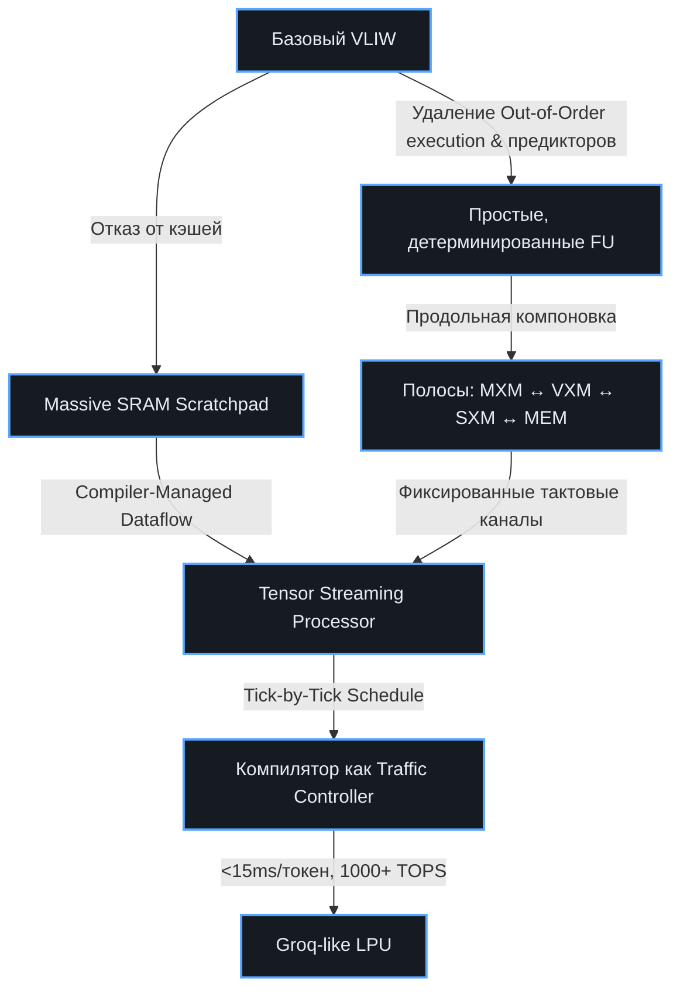
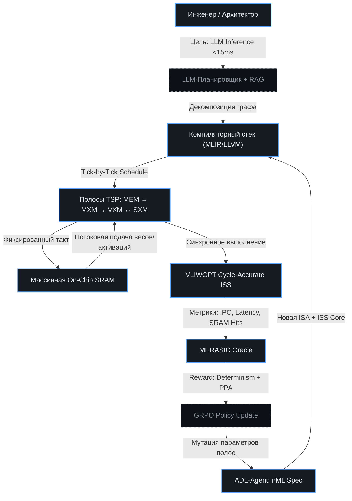

# 🔄 Эволюция VLIW → Groq: Dataflow, SRAM и детерминированный TSP
> Стратегия перехода от классического VLIW к Groq-подобной потоковой архитектуре (Tensor Streaming Processor) для сверхнизкой задержки инференса LLM. План ко-эволюции HW/SW в рамках ChipGPT.

## 🎯 Концепция: VLIW как фундамент детерминизма
Применение архитектуры VLIW в ускорителе Groq — это не просто выбор способа упаковки команд, а **фундаментальный архитектурный принцип**, определяющий всю платформу: от микроархитектуры исполнительных блоков и системы памяти до роли компилятора и итоговых характеристик производительности. Groq доказала, что в условиях узкоспециализированных задач, таких как инференс LLM при `batch=1`, глубокая интеграция «аппаратного обеспечения + программного обеспечения» и сознательный отказ от универсальности приносят больше пользы, чем попытки построить гибкую, но энергозатратную superscalar-платформу.

В парадигме ChipGPT переход к Groq-like ядру рассматривается не как смена ISA, а как **эволюционное уплотнение детерминизма**: перенос всей сложности динамического планирования с аппаратной части на компилятор, замена многоуровневой иерархии кэшей на массивную on-chip SRAM и организация вычислительных блоков в потоковые полосы (strips). Это позволяет достичь предсказуемой задержки `<15 мс/токен` и пропускной способности, ограниченной не памятью, а вычислительными блоками.

---

## 📐 План эволюции ChipGPT: от Basic VLIW к Groq TSP
Эволюция разбита на 4 последовательные эпохи. Каждая эпоха синхронно обновляет ISA, микроархитектуру, компиляторный стек и ISS-модель, формируя замкнутую петлю верификации через GRPO.

| Эпоха | Архитектурный сдвиг | Ключевые изменения HW | Ключевые изменения SW/Компилятора | Метрика успеха (GRPO Reward) |
|:---|:---|:---|:---|:---|
| **I. Basic VLIW** | Статический параллелизм на уровне инструкций | Фиксированные ALU/FPU/MAC, простой RF, статический конвейер без branch prediction | Топологическое планирование бандлов, TableGen-описание ISA, базовый list-scheduler | `IPC ≥ 2.0`, компиляция `100%` |
| **II. Stream-VLIW** | Введение потоковой передачи данных (scratchpad) | Замена L1/L2 кэшей на управляемые SRAM-банки, DMA-контроллеры, bypass-сети | Автоматическое размещение данных в scratchpad, генерация `load/store` паттернов, устранение cache-miss logic | `Latency variance < 2%`, пропускная способность шин `≥ 80%` |
| **III. Dataflow-TSP** | Переход от instruction-driven к data-driven execution | Функциональные полосы (MXM, VXM, SXM, MEM), детерминированные маршруты, тактовая синхронизация | Компилятор строит tick-by-tick график движения тензоров, генерация потоковых бандлов, отладка через cycle-accurate ISS | `ALU Utilization ≥ 90%`, память не является bottleneck |
| **IV. Groq-Ready LPU** | Полная детерминированная платформа для LLM инференса | Массовая on-chip SRAM (сотни МБ), тензорные массивы, аппаратные барьеры, нулевая динамика | Генерация microcode для flash-attention/matmul, автоматическая валидация через MERASIC, JIT-оптимизация графа модели | `<15 мс/токен`, `Energy ≤ X W`, стабильный reward на длинных контекстах |

---

## 🔑 Ключевые компоненты Groq-архитектуры в ChipGPT

### 💾 1. Массовая on-chip SRAM вместо кэшей и HBM
Главное архитектурное решение Groq — отказ от внешней DRAM/HBM и сложных иерархий кэшей в пользу огромного массива статической памяти прямо на кристалле. 
- **Проблема памяти в LLM:** Инференс с `batch=1` быстро переходит из категории `compute-bound` в `memory-bound`. Чтение 140 ГБ весов (Llama-70B) через HBM3 (~3 ТБ/с) создаёт простои вычислительных ядер.
- **Решение в ChipGPT:** Моделирование scratchpad-памяти через параметрические банки SRAM в ISS. Компилятор заранее планирует загрузку весов/активаций в SRAM. Доступ к любому байту занимает фиксированное число тактов → устраняются cache misses, непредсказуемые задержки и энергетические всплески от шин HBM.
- **Эволюционный шаг:** ADL-Agent генерирует конфигурацию банков, EA-Agent оптимизирует размер и ассоциативность под конкретный LLM-слоёный граф.

### 🧩 2. Архитектура «полос»: MXM, VXM, SXM, MEM
Вместо универсальных ядер Groq использует функционально-разделённые продольные полосы (strips), чередующиеся с блоками управления памятью. ChipGPT адаптирует эту модель для своей эволюции:
- **MXM (Matrix-Multiply Units):** Сердце LLM-слоёв. Высокоплотные MAC-массивы для `C=A×B`. В ChipGPT генерируются как кастомные расширения ISA для эпох III-IV.
- **VXM (Vector-Multiply Units):** Оптимизация линейной алгебры (умножение вектора на скаляр, сложение, нормализация). Критичны для слоёв Multi-Head Attention.
- **SXM (Shuffle/Merge Units):** Блоки детерминированной реорганизации тензорных данных. Выполняют транспонирование размерностей, слияние/разделение потоков и маршрутизацию между вычислительными полосами. Обеспечивают поддержку сложных ветвящихся графов LLM (Multi-Head Attention, MoE) без нарушения предсказуемости конвейера.
- **MEM (Memory Access Units):** Контроль потоковой загрузки из SRAM, синхронизация с MXM/VXM/SXM. Гарантируют, что данные прибывают точно в такт вычислений.
В ChipGPT эти блоки описываются декларативно в nML/ADL, после чего LLM+EA-Agent эволюционирует их топологию и пропускную способность шин.

### 🔍 3. Groq — это VLIW? Эволюционный разрыв и ключевые отличия

**Краткий ответ:** Да, Groq фундаментально построен на принципах VLIW, но представляет собой **эволюционное развитие до уровня детерминированной Dataflow-архитектуры (TSP)**. Это не просто «широкий VLIW», а качественный сдвиг парадигмы, где статическое планирование достигает абсолюта, а аппаратная часть максимально упрощается за счёт переноса всей сложности в компилятор.

#### 📊 Сравнительный анализ: Классический VLIW vs Groq TSP
| Параметр | Классический VLIW | Groq TSP (Tensor Streaming Processor) | Эволюционный шаг для ChipGPT |
|:---|:---|:---|:---|
| **Модель исполнения** | Instruction-Driven (выборка → декод → исполнение) | Data-Driven / Streaming (исполнение по готовности данных, фиксированный поток) | Требуется переход от `fetch/execute` к tick-by-tick dataflow scheduling |
| **Память** | Иерархия кэшей (L1/L2/DRAM), hardware coherency | Massive On-Chip SRAM (scratchpad), compiler-managed | Замена кэш-контроллеров на компиляторное распределение SRAM-банков |
| **Аппаратная сложность** | Динамические планировщики, bypass-сети, предикторы ветвлений | Полное отсутствие динамики. Простые FU, фиксированные пути данных | Удаление OoO logic, branch predictors, cache controllers. Упрощение RTL |
| **Топология** | Shared buses / Crossbar, динамическая маршрутизация | Продольные полосы (Strips: MXM, VXM, SXM, MEM), детерминированные каналы | Переход от shared resources к spatially partitioned functional strips |
| **Роль компилятора** | Упаковка независимых инструкций в бандлы, list scheduling | Полный tick-by-tick контроль: движение тензоров, активация портов, загрузка SRAM | Компилятор становится «диспетчером потоков», генерирует микрокод расписания |

---

#### 🧬 Насколько сильной должна быть эволюция?
Переход от базового VLIW к Groq-like ядру — это **не линейное расширение, а смена архитектурного класса**. В терминах ChipGPT это соответствует переходу от **Эпохи II (SIMD-VLIW)** к **Эпохе III/IV (Dataflow-TSP / LPU)**. Требуется ко-эволюция трёх слоёв:

1. **HW-уровень:** Отказ от кэшей в пользу конфигурируемых SRAM-банков. Замена динамической маршрутизации на фиксированные dataflow-каналы между полосами (MXM/VXM/SXM). Аппаратура становится «тупой» и сверхбыстрой, так как не принимает динамических решений.
2. **SW/Компилятор-уровень:** Компилятор перестаёт быть просто «упаковщиком инструкций». Он становится **планировщиком данных**, который на этапе компиляции строит точное планирование тактов: когда какой банк SRAM читается, когда данные прибывают под MXM, когда активируется SXM для перестановки осей. Это требует внедрения MLIR-диалектов для dataflow и scratchpad management.
3. **ISS/Симуляция:** Cycle-accurate ISS должен эволюционировать от моделирования «конвейерных конфликтов» к моделированию **потоковой передачи тензоров**. VERIFICATOR должен проверять не только корректность ISA, но и отсутствие deadlocks в dataflow, корректность синхронизации полос и загрузку SRAM.

---

### 🔄 4. Схема эволюционного перехода в ChipGPT

---
#### 🎯 Выводы:
Groq доказывает, что **VLIW не умер, а достиг своей логической вершины в виде детерминированного потокового процессора**. Эволюция к этой архитектуре в рамках ChipGPT требует не просто добавления новых инструкций, а **перепроектирования взаимодействия между HW и SW**:
- HW жертвует универсальностью ради предсказуемости.
- SW берет на себя 100% ответственности за планирование и управление памятью.
- Компенсация достигается за счет **стабильной задержки <15 мс/токен** и **пропускной способности, ограниченной вычислениями, а не памятью**.

В ChipGPT этот переход автоматизируется через `LLM+EA-Agent`, который эволюционирует конфигурацию полос и размер SRAM, а `ADL-Agent` формализует новую ISA в nML/MLIR. Цикл замыкается через `MERASIC`, где reward формируется на основе `Strip Utilization`, `SRAM Hit Rate` и детерминированной задержки.

---

### ⏱️ 5. Детерминированная тактовая синхронизация
Ядро TSP работает по строгому, заранее спланированному графику. Данные не ждут обработки — они физически движутся через полосы с постоянной скоростью (один шаг за такт).
- **Компилятор как «мозг»:** На этапе компиляции анализируется DAG модели LLM, создаётся детальное планирование на уровне тактов. Определяется, в какой такт какой банк SRAM читается, куда передаются данные, когда срабатывает MXM.
- **Аппаратная простота:** Отсутствие динамических планировщиков, предикторов ветвлений и сложных кэш-контроллеров. Исполнительные блоки работают в режиме «выполнил → жди следующей команды». Это позволяет поднять тактовую частоту и снизить энергопотребление.
- **Интеграция в ISS:** VLIWGPT ISS получает новые хуки для детерминированного трекинга потоков данных. MERASIC проверяет отсутствие конфликтов портов и простоев полос.

---

## 🧬 Интеграция с ChipGPT: Роль компилятора и агентов
Переход к Groq-подобной архитектуре невозможен без смещения бремени сложности на компиляторный стек. В ChipGPT это реализуется через гибридный агентный пайплайн:

1. **ADL-Agent:** Формализует ISA для полосовых операций (`vliw.mxm`, `vliw.vxm`, `vliw.sxm`, `vliw.mem_load`). Гарантирует семантическую корректность и генерирует cycle-accurate C++ ISS.
2. **LLM+EA-Agent:** 
   - LLM декомпозирует граф LLM на потоковые этапы, предлагает начальные планировки передачи данных.
   - EA эволюционирует параметры: количество полос, размер SRAM-банков, латентность маршрутизации SXM, политику упаковки бандлов.
3. **Компиляторный стек (LLVM/MLIR):** Генерирует не просто машинный код, а **микросхемное планирование**. Трансформирует `linalg.matmul` → `mxm_strip.execute` с привязкой к тактам. Управляет scratchpad-аллокацией вместо кэшей.
4. **GRPO-Reward:** Формируется на основе: `ΔLatency`, `SRAM Hit Rate`, `Strip Utilization`, `Energy/Token`. Отрицательный reward выдаётся за любые неопределённости в расписании или cache-miss аналоги в SRAM.

---

## 📊 Архитектура потоковой эволюции (Dataflow-TSP)

---

## 🏁 Заключение: Почему эволюция к Groq оптимальна для ChipGPT
Традиционный VLIW даёт контроль над параллелизмом, но страдает от неоптимального доступа к памяти и статического планирования в условиях сложных графов. Архитектура Groq показывает, что **детерминизм + потоковые данные + массивная SRAM** — это не нишевое решение, а следующий логический шаг для инференса LLM.

В рамках ChipGPT этот переход реализуется не как ручная переделка RTL, а как **автоматизированная ко-эволюция**:
- HW упрощается (убираются динамические блоки, кэши, предикторы)
- SW усложняется (компилятор строит тактовые расписания, управляет SRAM как scratchpad)
- ISS становится Ground Truth для валидации детерминизма архитектурного поведения и исполнения кода
- GRPO оптимизирует баланс между загрузкой полос и энергопотреблением

Это позволяет ChipGPT создавать ядра, которые не просто «быстрее считают», а **предсказуемо доставляют результат**, что является критическим требованием для коммерческого инференса больших языковых моделей.