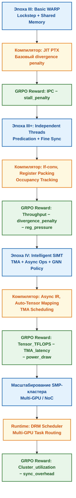

<!--
---
title: "Эволюция Warp Scheduler: От VLIW к интеллектуальному SIMT"
description: "Переход от статического планирования к динамическому управлению варпами, SMP-масштабирование и роль компилятора в архитектуре ChipGPT"
tags: [warp-scheduler, simt, vliw-to-simt, independent-thread, tma, smp, compiler-optimization, grpo, chipgpt]
last_updated: 2026-05-14
---
-->

# Эволюция Warp Scheduler: От VLIW к интеллектуальному SIMT

> **Аннотация**: Анализ архитектурного перехода от статического VLIW-планирования к динамическому SIMT/WARP управлению. Сформулирован поэтапный план эволюции ChipGPT к современным warp-планировщикам, рассмотрено системное SMP-масштабирование и влияние компилятора на раскрытие потенциала аппаратного планировщика в рамках GRPO-оптимизации.

---

## 🔄 Фундаментальный сдвиг: От статического VLIW к динамическому SIMT

История высокопроизводительных вычислений демонстрирует чёткий тренд: переход от сложных, но негибких статических подходов к более простым, но чрезвычайно эффективным динамическим моделям, где адаптивность берёт на себя аппаратное обеспечение.

Классический VLIW делегирует всю тяжесть извлечения параллелизма компилятору. Если компилятор не находит независимые инструкции, аппаратные блоки простаивают, а ветвления разрушают длинные пакеты. Наглядным доказательством преимуществ динамического планирования стал переход AMD от архитектуры R600 (VLIW) к GCN (SIMD). В GCN работа организована вокруг концепции **Wavefront** (группы из 64 потоков), выполняемых в строгой синхронизации (lockstep), а планировщик на уровне Compute Unit (CU) динамически выбирает, какие инструкции запускать, адаптируясь к реальным данным и задержкам памяти.

SIMT (Single Instruction, Multiple Thread) стал де-факто стандартом, найдя оптимальный баланс между эффективностью SIMD и гибкостью MIMD. Ключевой элемент SIMT — **Warp Scheduler** (планировщик варпов). Он управляет пулом готовых потоков, мгновенно переключая контекст при задержках памяти, скрывая латентность и поддерживая постоянную загрузку вычислительных ядер без накладных расходов на сохранение состояния.

---

## 🧭 План эволюции ChipGPT: Эпохи Warp Scheduler

Эволюция ChipGPT от базового VLIW к современному WARP-ядру выстроена как постепенное перенесение логики планирования из компилятора в аппаратный контроллер, синхронно с усложнением инструментов и workload'ов.

| Эпоха | Архитектурный сдвиг | Ключевые изменения HW | Сдвиг в SW / Toolchain |
|:---|:---|:---|:---|
| **III. Basic WARP** | Введение аппаратного планировщика | Базовый warp-планировщик (lockstep), shared memory, atomic ops, обработка divergence через маскирование | Модель потоков (threads/blocks), базовый runtime, JIT-компиляция PTX-подобного IR |
| **III+. Advanced WARP** | Независимое планирование потоков | Independent Thread Scheduling (Volza/Turing): собственный PC и стек на поток, предикаты на уровне warp | Явные барьеры `__syncwarp()`, продвинутая if-conversion, оптимизация регистра под occupancy |
| **IV. Intelligent SIMT** | Интеграция вычислений и передачи данных | Асинхронные операции с памятью (Ampere LDGSTS), Tensor Memory Accelerator (Hopper/Blackwell), STAS | Async API (`cudaMemcpyAsync`), автоматическое формирование warps, графовые компиляторы (XLA/MLIR) |

**Поэтапная реализация:**
1. **Фаза стабилизации VLIW → Базовый WARP**: Достижение `IPC ≥ 3.5x`. Компилятор генерирует packed-инструкции, но ветвления обрабатываются через предикаты. Внедряется аппаратный планировщик, начинающий скрывать задержки L1/L2.
2. **Мост к динамике (Advanced WARP)**: Внедрение `warp_size = 32` с независимыми счётчиками команд. Компилятор переходит к агрессивной конверсии ветвлений (predication) для минимизации divergence penalty.
3. **Переход к Intelligent SIMT**: Аппаратный TMA берет на себя адресацию и копирование тензоров. Планировщик координирует вычисления и асинхронный I/O, достигая почти полного совмещения. Runtime управляет распределением warps и shared memory.
4. **Валидация GRPO**: На каждой фазе функция вознаграждения адаптируется. На ранних этапах штрафуются NOP и idle cycles. На поздних — `warp_divergence`, `shared_memory_bank_conflicts` и `TMA_stalls`.

---

## 🌐 SMP-масштабирование в концепции ChipGPT

Принцип SMP (Symmetric Multiprocessing) в ChipGPT выступает не как технология базовых ядер, а как **организационный принцип масштабирования** на уровне кластеров и систем.

| Уровень применения | Пример в ChipGPT | Описание | Преимущества |
|:---|:---|:---|:---|
| **Уровень микро-архитектуры** | WGP-подобный режим (AMD GFX10+) | Распределение wavefront/warp между несколькими CU/WARP-кластерами внутри одного чипа | Повышение throughput для больших рабочих групп, гибкое использование ресурсов |
| **Уровень чипа/пакета** | Mesh/NoC Coherence Cluster | Несколько WARP-ядер объединены общим L2/L3 кэшем и аппаратными барьерами | Низколатентный обмен данными, единое адресное пространство на кристалле |
| **Уровень системы** | Multi-GPU Clustering (NVLink/PCIe) | Объединение нескольких чипов ChipGPT в единый вычислительный узел | Масштабирование до 100+ ядер, единый драйвер, распределение тензоров по памяти |
| **Уровень ОС/Драйвера** | DRM GPU Scheduler / Runtime | Приоритезация задач от множества процессов, управление dma_fence, fair scheduling | Отзывчивость системы, изоляция workloads, эффективное использование очередей HW |

**Стратегия ChipGPT:** Начать с изолированного WARP-ядра (Эпоха III), добавить аппаратные барьеры и shared L2 для локального SMP (Эпоха III+), затем внедрить высокоскоростные межчиповые линки и единый runtime для распределённого SMP (Эпоха IV). Это обеспечит плавный переход от single-chip ускорителя к кластерному AI-суперкомпьютеру.

---

## 🛠️ Влияние компилятора и системного ПО на потенциал Warp Scheduler

Архитектура планировщика не существует в вакууме. Его реальная эффективность напрямую зависит от тесного взаимодействия с компилятором и системным ПО (Hardware-Software Co-Design).

| Компонент | Роль в раскрытии потенциала | Интеграция в ChipGPT |
|:---|:---|:---|
| **Промежуточное представление (PTX/IR)** | Абстрагирует приложение от конкретного поколения HW. Позволяет одному коду работать на разных эпохах ChipGPT. | Генерация JIT-компилятором из ANSI C++/Python. GRPO оптимизирует IR-паттерны под текущую эпоху. |
| **If-Conversion & Predication** | Заменяет условные переходы на предикаты. Все потоки выполняют код, но результат записывается только при `true`. Снижает divergence. | LLM+EA-Agent генерирует предикатные пакеты. Компилятор автоматически применяет конверсию для минимизации штрафа ветвлений. |
| **Регистровое давление & Occupancy** | Лимитирует количество активных warps на CU. Высокое давление → меньше warps → хуже скрытие задержек. | GRPO штрафует конфигурации, снижающие occupancy ниже `70%`. Компилятор использует агрессивное переименование регистров. |
| **Async Memory & Runtime API** | Позволяет перемещать данные в фоне, не блокируя ядра. Планировщик переключается между I/O и вычислениями. | Внедрение `async_load/store` в ISA. Runtime автоматически формирует очереди передач для TMA/LDGSTS. |
| **Профилирование (Nsight/ChipGPT Profiler)** | Визуализирует `stall reasons`, активность тензорных блоков, пропускную способность памяти. | Данные профиля подаются в MERASIC. GRPO использует их как `reward_shaping` для коррекции политики планировщика. |

---

## 🔮 Современные тренды и интеграция с GRPO

Современные планировщики (Hopper/Blackwell) превратились из механизмов кругового перебора в **интеллектуальные узлы управления данными**. ChipGPT адаптирует эти тренды под автоматизированную эволюцию:

1. **Tensor Memory Accelerator (TMA) в ISA**: Аппаратный блок выносит адресацию и копирование больших тензоров. Планировщик лишь инициирует операцию, освобождая ядра для MatMul/Attention.
2. **Dynamic Warp Formation & Specialization**: Аппаратное группирование потоков с одинаковым путём выполнения. Снижает penalty от ветвлений. GRPO обучает политику `warp_grouping_threshold`.
3. **AI-Driven Scheduling Policy**: Замена статических алгоритмов на обучаемые политики. Графовые нейросети (GNN) обрабатывают топологию warps и очередей памяти, предсказывая оптимальный порядок выдачи инструкций.
4. **Energy-Aware Clock & Power Gating**: Отключение неиспользуемых функциональных блоков в реальном времени. GRPO включает `power_draw` в составную reward-функцию, балансируя `throughput` и `TDP`.

**Схема эволюции планировщика и его интеграции в GRPO-петлю ChipGPT:**

---

## 📊 Сравнительная матрица планировщиков по эпохам

| Характеристика | Эпоха III (Basic WARP) | Эпоха III+ (Independent) | Эпоха IV (Intelligent SIMT) |
|:---|:---|:---|:---|
| **Базовая единица** | Warp (32 потока, общий PC) | Поток (свой PC, стек, маски) | Warp + Tensor-группа (динамическая) |
| **Обработка ветвлений** | Последовательное выполнение путей, маска отключения | Предикаты, `__syncwarp()`, независимый выход из циклов | Аппаратный merge, GNN-предсказание пути, dynamic formation |
| **Скрытие задержек** | Быстрое переключение warps при cache miss | Улучшенный контекст + регистровая упаковка | Асинхронная память (TMA/LDGSTS), совмещение вычислений и I/O |
| **Роль компилятора** | Генерация lockstep-инструкций, базовая оптимизация | Агрессивная if-conversion, контроль occupancy | Генерация async-операций, авто-маппинг тензоров на TMA |
| **Метрика GRPO** | `IPC - idle_cycles` | `Throughput - divergence_penalty` | `Tensor_TFLOPS - TMA_latency - power_draw` |
| **SMP-уровень** | Изолированное ядро | Локальная когерентность (shared L2) | Кластерное масштабирование (NVLink/NoC) |

---

## 🏁 Заключение

Эволюция от VLIW к WARP и далее к Intelligent SIMT — это не просто замена статического планировщика динамическим. Это **системный перенос интеллекта управления ресурсами** из этапа компиляции в реальное время, поддержанный асинхронными механизмами передачи данных и обучаемыми политиками. ChipGPT реализует этот переход через чёткую последовательность эпох, где каждая фаза:
- Валидируется на специфических workload'ах, отражающих текущий уровень параллелизма и скрытия задержек.
- Интегрируется с компилятором и runtime через JIT-IR, предикаты и асинхронные API.
- Калибрует GRPO-функцию вознаграждения под новые метрики (от `IPC` до `Tensor_TFLOPS` и `TMA_latency`).
- Масштабируется по SMP-принципу: от одиночного WARP-ядра к распределённым кластерам с единым планировщиком задач.

Понимание эволюции Warp Scheduler позволяет ChipGPT избегать слепого копирования коммерческих архитектур. Вместо этого создаётся **адаптивная SIMT-экосистема**, где динамическое планирование скрывает задержки, аппаратные ускорители (TMA) разгружают вычислительные ядра, а компилятор и системное ПО работают в тесной связке с аппаратными планировщиками. Это прямой путь к энергоэффективным, масштабируемым AI-ускорителям следующего поколения.

> 📌 *Данный раздел описывает эволюцию Warp Scheduler, переход к динамическому SIMT, SMP-масштабирование и влияние компилятора на архитектуру ChipGPT. Последнее обновление: май 2026.*

---
