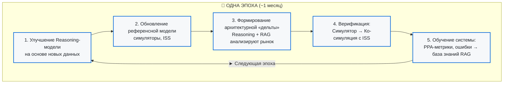
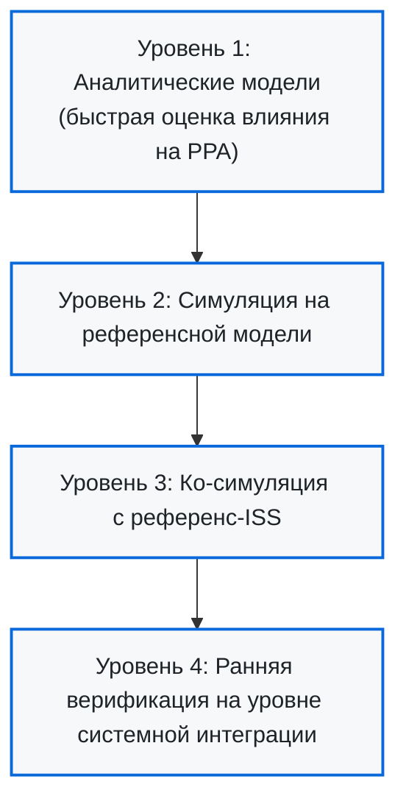
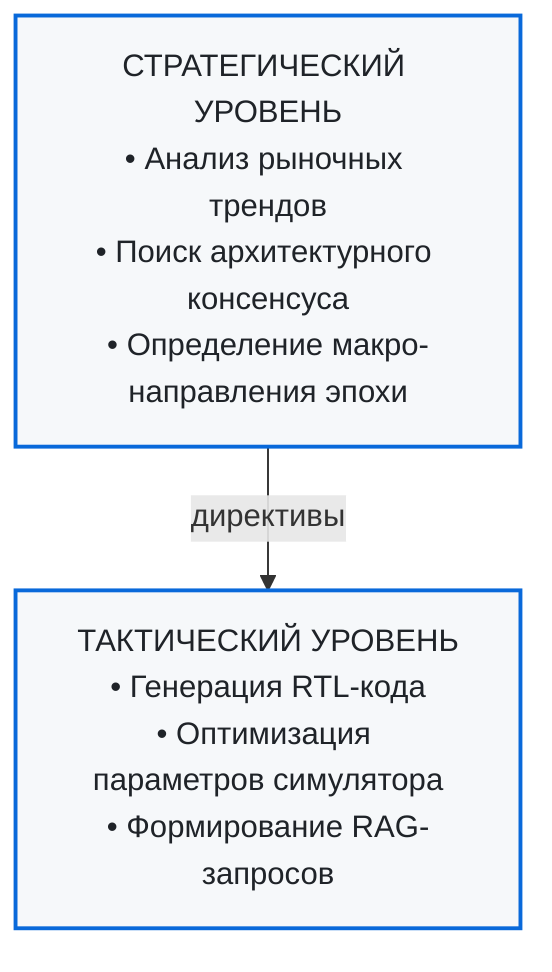

# Парадигма эволюционного дизайна чипов

> **Оценка адаптивной модели на основе RAG и Reasoning**  
> *Стратегическая логика и соответствие современным трендам*

---

## 🔍 Введение: От статического дизайна к динамической эволюции

Традиционный дизайн процессоров — это **линейный, документо-ориентированный процесс** с чётко определёнными этапами: спецификация → RTL → верификация → синтез → place&route. Однако этот подход не масштабируется в условиях беспрецедентной скорости изменений рынка AI-чипов.

ChipGPT предлагает **эволюционную парадигму «REASONING-DRIVEN»**, где архитектура не проектируется вручную, а **выращивается** через циклы «эпох», управляемые интеллектуальной связкой **Reasoning + RAG**.

### Ключевая инновация

| Традиционный подход | Эволюционная парадигма |
|:-------------------|:----------------------|
| Фиксированные технические спецификации | Динамическая адаптация к рыночным данным |
| Итерации занимают **годы** | Цикл «эпохи» — **~1 месяц** |
| Улучшение существующей архитектуры | Формирование **архитектурного консенсуса** рынка |
| RTL-уровень абстракции | **Высокоуровневая** архитектурная «дельта» |

---

## 🧬 Архитектура эволюционной системы

### Замкнутый цикл обратной связи

Этот цикл реализует парадигму **Agentic EDA** с циклом «мыслить-действовать-отражать», где автономный агент достигает уровня автономии L3-L4.

---

## 🤖 Reasoning + RAG: Стратегический аналитик системы

### Две взаимосвязанные функции

#### 📚 **RAG (Retrieval-Augmented Generation)**  
*Высокоинтеллектуальный библиотекарь*

RAG обеспечивает доступ к широкому и разнородному массиву данных, выходящему далеко за рамки стандартных интернет-корпусов:

| Источник данных | Примеры применения |
|:----------------|:-------------------|
| **Научные публикации и конференции** | Новые архитектурные парадигмы, алгоритмы (MLA, GQA), методы компрессии моделей |
| **Патентные заявки** | Предсказание стратегических движений игроков рынка. *Пример: пик патентной активности NVIDIA в области межсоединений в 2022 году* |
| **Технические спецификации** | Параметры HBM, MEMS, оптических модулей, ограничения EDA-флоу (OpenLane) |
| **Открытые исходные коды** | Практический опыт проектов типа NL2GDS, успешные дизайнерские решения и ошибки |
| **Отчёты аналитиков** | Прогнозы роста рынка AI-чипов ($500 млрд к 2026 году), потребность в памяти, сдвиги в прикладных задачах |

#### 🧠 **Reasoning (Логический вывод)**  
*Стратегический аналитик*

Простого извлечения информации недостаточно. Reasoning должен выполнять **высокоуровневую аналитическую работу**:

1. **Выявлять скрытые корреляции**  
   *Пример:* Связать рост контекстных окон LLM до 128K-256K токенов с ростом пропускной способности межчипового соединения (×90 с 2016 года).

2. **Формировать архитектурный консенсус**  
   Отличать долгосрочные векторы развития от поверхностных мод.  
   *Пример:* Chiplet-архитектуры — это не мода, а **стратегическая необходимость** для преодоления физических ограничений монолитных кристаллов (~800 мм²).

3. **Переводить абстрактные тренды в технические требования**  
   - Тренд «увеличение context window» → требование к размеру внутренней памяти и пропускной способности interconnect
   - Тренд «повышение энергоэффективности» → требование к форматам FP8, NVFP4

---

## 📊 Эпохи эволюции: От базовых блоков к GPU

### Стратегия «дельты»

Каждая эпоха формирует **архитектурную дельту** — итеративное улучшение, начинающееся от базовых блоков (VLIW, RISC-V) и движущееся к сложным GPU-подобным структурам.

| Эпоха | Архитектурный фокус | Ключевые метрики перехода |
|:------|:--------------------|:--------------------------|
| **I** | Базовое VLIW/RISC-V | Functional Coverage >99.9% |
| **II** | SIMD-VLIW расширения | IPC ≥1.8x vs Epoch I |
| **III** | Basic WARP + chiplet | Warp occupancy ≥85%, interconnect bandwidth |
| **IV** | GPGPU/TPU архитектура | TFLOPS/W ≥ target, HBM integration |

### Соответствие рыночным трендам

Предложенная модель отвечает на **четыре ключевых тренда** рынка AI-чипов:

#### 1️⃣ Переход к многочиповым архитектурам
- **Проблема:** Монолитные кристаллы достигают физических пределов (ретикль ~800 мм²)
- **Решение модели:** Итеративная интеграция chiplet-структур
- **Пример из индустрии:** NVIDIA Blackwell — двухчиповое решение с 208 млрд транзисторов, объединённых NVLink

#### 2️⃣ Рост спроса на пропускную способность interconnect
- **Проблема:** Объём данных между ускорителями стал критическим фактором
- **Решение модели:** Reasoning выявляет этот сдвиг и закладывает в «дельту» увеличение портов interconnect
- **Статистика:** Пропускная способность NVLink выросла в **90 раз** с 2016 года

#### 3️⃣ Поддержка новых алгоритмов и форматов чисел
- **Проблема:** AI-модели требуют новых вычислительных паттернов
- **Решение модели:** Быстрая интеграция Tensor Cores, FP8 precision, динамического управления диапазоном
- **Пример:** NVIDIA NVFP4 для повышения производительности на ватт

#### 4️⃣ Горизонтальная и вертикальная интеграция экосистем
- **Проблема:** CUDA создаёт барьер входа в 6–12 месяцев инженерных усилий
- **Решение модели:** Гибкая архитектура, адаптируемая под существующие программные среды
- **Преимущество:** Месячный цикл позволяет опережать традиционные многолетние циклы разработки

---

## ⚖️ Сравнительный анализ с альтернативными подходами

### Три категории методологий проектирования

| Характеристика | **Эволюционная модель** | **Классические RTL-итерации** | **Обучение с подкреплением (RL)** |
|:---------------|:------------------------|:------------------------------|:----------------------------------|
| **Уровень абстракции** | Высокий (архитектура, консенсус рынка) | Низкий (Register-Transfer Level) | Средний/Высокий (решения, политики) |
| **Движущий фактор** | Reasoning-модель на основе рыночных данных | Технические спецификации, PPA-метрики | Функция награды, оптимизация метрик |
| **Скорость итерации** | **~1 месяц** | **Годы** | Дни/недели/месяцы (зависит от задачи) |
| **Процесс** | Итеративная, на основе архитектурного консенсуса | Последовательное улучшение RTL-кода | Проб и ошибок в симуляторе |
| **Преимущества** | • Быстрая адаптация к рынку • Автоматизация анализа • Гибкость архитектуры | • Доказанная надёжность • Высокий контроль • Интеграция в EDA | • Находит неочевидные решения • Адаптивность |
| **Недостатки** | • Зависимость от качества Reasoning • Риск ошибочной интерпретации | • Медленная реакция на рынок • Высокая стоимость итераций | • Требует много данных/симуляций • Риск локальных оптимумов • «Чёрный ящик» |

### Ключевые отличия

**vs RTL-итерации:**  
Эволюционная модель оперирует на **уровне архитектуры**, а не битов и регистров. Это как сравнение инженера, оптимизирующего циклы на C++, и архитектора, проектирующего микросервисы для масштабируемости.

**vs RL:**  
Модель **не конкурирует, а дополняет** RL. Reasoning выполняет роль «стратега», определяющего направление поиска, а RL-агент может использоваться для тонкой настройки конкретных параметров (например, floorplan, routing, распределение данных в chiplet-архитектуре).

---

## ⚠️ Критические риски и ограничения

Несмотря на стратегическую привлекательность, модель сталкивается с **серьёзными вызовами**:

### 1. Качество и доступность данных

**Риск:** Зависимость от открытых источников (статьи, конференции, форумы) означает, что модель всегда будет **на шаг позади лидеров** (NVIDIA, AMD), обладающих внутренними базами данных и коммерческой информацией.

**Пример:** Если все пишут о Tensor Cores, модель может слепо добавлять их, игнорируя потенциально более эффективные альтернативы.

**Смягчение:** Создание собственной структурированной базы знаний (Knowledge Graph), включающей патенты, внутренние исследования, историю проектирования.

---

### 2. Сложность и стоимость валидации

**Риск:** Месячный цикл «дельта → симулятор → ко-симуляция» — амбициозный срок для комплексной верификации. Ошибка в архитектуре чипа приводит к **перепроектированию и повторной печати кристаллов**, что стоит **миллиарды долларов**.

**Сравнение:** В ML-моделях ошибка исправляется обновлением весов. В чипах — это физическая переработка.

**Решение:** Многоуровневая система валидации:
- Аналитические модели для предварительной оценки (например, математическая модель влияния context window на требования к bandwidth)
- Ранняя верификация на уровне системной интеграции
- Только затем — полная симуляция и ко-симуляция с ISS

---

### 3. Технологические ограничения LLM

**Риск:** Reasoning-модели плохо понимают **физические ограничения** проектирования:
- Тепловыделение
- Электромиграция
- Нарушения правил разводки (DRC)
- Производственный выход годных изделий

**Пример:** Project NL2GDS успешно использует RAG для понимания параметров EDA-флоу OpenLane. Аналогичное решение необходимо для понимания физических ограничений самого чипа.

**Без этого:** Reasoning может генерировать теоретически производительные, но **практически невыводимые в производство** архитектуры.

---

### 4. Единая точка отказа

**Риск:** Зависимость от одной Reasoning-модели создаёт уязвимость. Если модель начнёт ошибаться в прогнозах, это может **парализовать весь процесс разработки**.

**Решение:** 
- Разделение на стратегический и тактический уровни Reasoning
- Ensemble-подход (несколько моделей)
- Человеческий overwatch на критических точках

---

### 5. Организационные и экономические вызовы

**Проблема:** Разработка требует команды с **уникальным набором навыков**:
- Глубокие знания EDA и проектирования чипов
- Машинное обучение и LLM
- Управление данными и Knowledge Graphs

**Стоимость:** Сбор и индексация данных (патенты, исследования) — огромная работа, требующая значительных инвестиций. Хотя обучение LoRA занимает мало времени, **создание качественного датасета** — трудоемкий и дорогостоящий процесс.

---

### 6. Границы применимости

**Важно понимать:** Модель **не универсальна**.

| Подходит ✅ | Не подходит ❌ |
|:------------|:--------------|
| **ASIC для широкого круга задач** (универсальные AI-ускорители) | **Узкоспециализированные чипы** с малым объёмом производства |
| Где способность быстро адаптироваться к новым моделям — ключевое преимущество | Где предсказуемость и надёжность важнее гибкости |
| Рынок быстро меняется (AI/ML workload) | Стабильные, зрелые домены (automotive MCU, industrial control) |

---

## 🎯 Стратегические рекомендации

На основе проведённого анализа сформулированы **пять ключевых рекомендаций** для реализации модели:

### 1. Усиление многоуровневой системы верификации

Разработать и внедрить **многоуровневую валидацию** «архитектурной дельты»:

Это позволит выявлять нежизнеспособные решения на **самом раннем этапе**, минимизируя затраты на полную симуляцию.

---

### 2. Создание закрытой базы знаний (Knowledge Graph)

Минимизировать зависимость от открытых данных путём создания **собственной структурированной базы знаний**, включающей:

- Патенты и научные публикации
- Внутренние исследования и результаты симуляций
- Историю проектирования (успешные решения и ошибки)
- Данные о производственных дефектах и ограничениях

Такая база станет **основой для RAG**, обеспечивая Reasoning достоверной и своевременной информацией.

---

### 3. Интеграция RL как вспомогательного инструмента

Не рассматривать RL как самостоятельную систему, а **интегрировать RL-агентов** как вспомогательный инструмент для решения конкретных оптимизационных задач внутри каждой «эпохи»:

| Задача | Применение RL |
|:-------|:--------------|
| Физический дизайн | Оптимизация floorplan и routing |
| Chiplet-архитектура | Распределение данных между chiplet'ами для минимизации задержек и энергопотребления |
| Параметры симулятора | Автоматическая настройка под конкретную «дельту» |

**Под руководством** стратегических директив, задаваемых Reasoning-моделью.

---

### 4. Разделение стратегического и тактического уровней Reasoning

Разделить Reasoning-модель на **два взаимодействующих модуля**:

---

### 5. Чёткое определение границ применимости

Сфокусироваться на разработке **ASIC для широкого круга задач** (универсальные AI-ускорители), где способность быстро адаптироваться к новым моделям и алгоритмам является **ключевым конкурентным преимуществом**.

Для узкоспециализированных чипов с малым объёмом производства традиционные, более предсказуемые методы могут остаться **более рациональным выбором**.

---

## 🔮 Заключение: От статичного объекта к живому организму

Предложенный план — это **не просто очередной метод итеративного проектирования**, а смелая попытка создать **новый парадигмальный подход** к разработке чипов.

### Философский сдвиг

| Было | Становится |
|:-----|:-----------|
| Аппаратное обеспечение — **статичный объект** | Аппаратное обеспечение — **живой, развивающийся организм** |
| Проектирование — **линейный процесс** | Проектирование — **цикл самообучения и адаптации** |
| Архитектура — **фиксированная спецификация** | Архитектура — **динамический консенсус рынка** |

### Потенциальное воздействие

Успешная реализация этой концепции может **кардинально изменить ландшафт разработки AI-чипов**:

- **Скорость:** Сокращение цикла разработки с лет до месяцев
- **Адаптивность:** Мгновенная реакция на новые алгоритмы и рыночные сдвиги
- **Экономическая эффективность:** Автоматизация наиболее трудоёмкого этапа — исследования и анализа
- **Инновационность:** Генерация архитектурных решений, основанных на глобальном рыночном консенсусе, а не на интуиции отдельных инженеров

### Вызовы

Реализация потребует:
- Значительных усилий по преодолению технологических барьеров
- Создания надёжных механизмов контроля и верификации
- Формирования междисциплинарной команды (EDA + ML + Data Engineering)
- Инвестиций в создание качественной базы знаний

**Однако** потенциал перевешивает риски: в условиях, когда рынок AI-ускорителей достигнет **$500 млрд к 2026 году**, способность к быстрой эволюции архитектуры станет **критическим конкурентным преимуществом**.

---

## 📚 Ссылки и источники

### Упомянутые проекты и технологии
- **NL2GDS**: [LLM-aided interface for Open Source Chip Design](https://arxiv.org/html/2603.05489v1)
- **NVIDIA Blackwell**: [GPU architecture roadmap](https://developer.nvidia.com/blog/)
- **Chiplet optimization**: [Reinforcement Learning approach](https://arxiv.org/html/2406.00858v1)

### Аналитика рынка
- **Deloitte**: [2026 Global Semiconductor Industry Outlook](https://www.deloitte.com/us/en/insights/industry/technology/technology-media-telecom-outlooks/semiconductor-industry-outlook.html)
- **PatSnap**: [NVIDIA patent analysis](https://www.patsnap.com/resources/blog/articles/nvidia-gpu-architecture-roadmap-cuda-to-blackwell/)

### Смежные исследования
- **Agentic EDA**: [AI-Powered Chip Design Survey](https://www.linkedin.com/posts/dair-ai_comprehensive-survey-on-the-future-of-ai-powered-activity-7412223551056957440-bSgG)

---

## 🔗 Навигация

- [← DSE vs Evolution: Сравнительный анализ](#/wiki/dse-vs-evolution)
- [RAG в эволюционном дизайне](#/wiki/rag-chip-design)
- [Агентное проектирование процессоров](#/wiki/agent-pipeline)
- [→ На главную](#/readme)

---

*Эта статья является частью документации ChipGPT.*