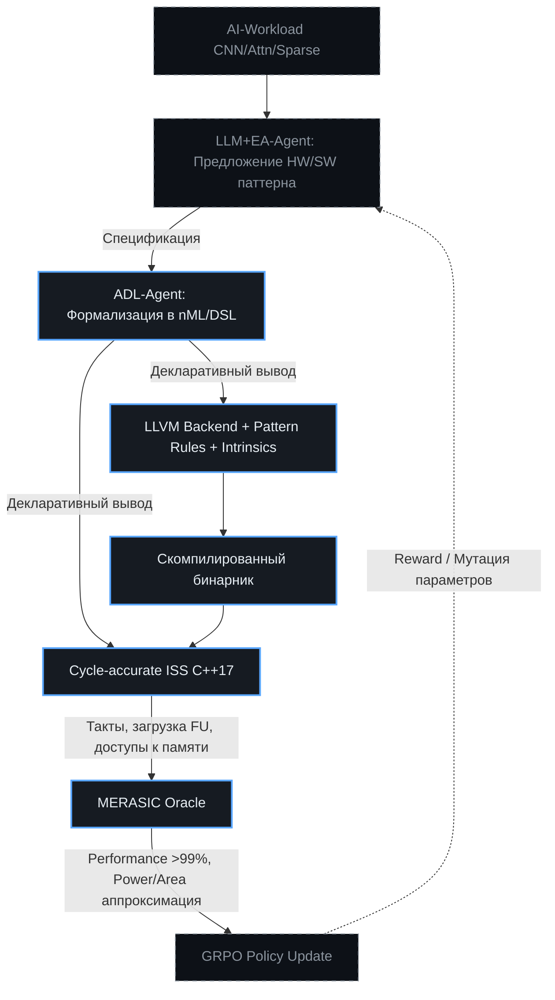

# 🔬 Эволюция оптимизирующих инструкций VLIW: от универсальной методологии к ускорению AI-нагрузок
> Как метод ChipGPT (VLIWGPT) автоматизирует проектирование аппаратных расширений для CNN, механизмов внимания и разреженных свёрток через замкнутый цикл HW/SW ко-эволюции и цикло-точной ISS-верификации.

## 🎯 Концепция: От ручного прототипирования к эволюционной генерации
Традиционный процесс добавления новой инструкции в VLIW-ядро — это длительная, многоэтапная инженерная задача, требующая синхронного изменения аппаратного дизайна, компиляторного бэкенда и симуляционной модели. В парадигме ChipGPT этот процесс трансформируется из ручного ремесла в **автоматизированный эволюционный цикл**. Система не просто «придумывает» инструкцию, она последовательно проходит три неразрывных этапа: комплексную аппаратную интеграцию, расширение программного стека (компилятор + ISS) и строгую PPA-оценку через цикло-точную симуляцию. Успех каждого этапа генерирует reward-сигналы для GRPO, замыкая петлю самооптимизации.

---

## 🏗 1. Аппаратная интеграция: Проектирование системы «Исполнительный блок + Память + Декодер»
Аппаратная интеграция — это не просто добавление одной инструкции, а комплексная задача по проектированию взаимосвязанной системы. Успех этого этапа определяет, сможет ли новая инструкция в принципе достичь заявленной производительности. Без соответствующей аппаратной поддержки даже самая совершенная компиляторная оптимизация будет бесполезна.

В ChipGPT этот этап автоматизируется через кооперацию `LLM+EA-Agent` и `ADL-Agent`:

| Компонент | Роль в традиционном подходе | Автоматизация в ChipGPT |
|:---|:---|:---|
| **Исполнительный блок (FU)** | Ручное проектирование ALU/MAC/SFU, анализ задержек и конфликтов портов | LLM предлагает топологию блока → EA оптимизирует ширину шин и латентность → ADL/nML формализует в ISA-спецификацию |
| **Декодер VLIW** | Ручное добавление полей в бандл, обеспечение неконфликтного парсинга | Автоматическая генерация полей декодера из ADL. Валидация на отсутствие критических путей через статический анализ до RTL |
| **Система памяти** | Проектирование многопортовых банков, шин адреса/данных, паттернов доступа | EA ищет оптимальную конфигурацию кэшей/SRAM. Генерация перестраиваемых сетей (reordering networks) для нелинейного доступа через ADL-драйверы |

ChipGPT гарантирует, что каждая предложенная инструкция сопровождается полным аппаратным контекстом: спецификация портов, требования к пропускной способности памяти и логика декодирования выводятся декларативно и немедленно транслируются в C++17 код для ISS.

---

## 💻 2. Программный стек: Компилятор + ISS как цифровой двойник для HW
Аппаратные изменения являются необходимым условием, однако сами по себе не приводят к ускорению. Ключевую роль играет программный стек, который включает в себя компилятор и симулятор набора инструкций (ISS). Именно он отвечает за генерацию машинного кода, использующего новую инструкцию, и за моделирование её поведения для оценки выгоды.

### 🔹 Расширение компилятора (LLVM / TableGen)
В ChipGPT генерация компиляторного стека полностью автоматизирована на уровне IR-трансформаций:
1. **Синтаксическая поддержка:** LLM генерирует `.td` определения инструкций, типы операндов и регистровые классы. ADL-Agent компилирует их в готовый LLVM TableGen-бэкенд.
2. **Механизм сопоставления с образцом (Pattern Matching):** Система автоматически выводит правила преобразования LLVM IR. Например, циклические зависимости `load → mul → add` распознаются и заменяются на единый вызов `conv_vliw_opt`.
3. **Интринсики C/C++:** Автогенерация заголовочных файлов с `__builtin_...` функциями, позволяющими разработчикам явно вызывать аппаратные ускорители без ожидания компиляторного паттерн-матчинга.

### 🔹 Модификация ISS (Instruction Set Simulator)
Параллельно с компилятором модифицируется cycle-accurate ISS. Он должен точно моделировать все побочные эффекты инструкции: чтение/запись регистров, изменение флагов, взаимодействие с виртуальной памятью и точный подсчёт тактов. В ChipGPT ISS генерируется из той же ADL-спецификации, что гарантирует 100% согласованность между симулятором, компилятором и будущим RTL. Это превращает ISS из отладочного инструмента в полноценный инструмент архитектурного проектирования и ранней оценки PPA.

---

## 📊 3. Оценка PPA: Роль цикло-точного ISS как Ground Truth
Центральный вопрос метода — достаточность ISS-симуляции для принятия архитектурных решений. Ответ ChipGPT однозначен: **да, для ранней эволюционной отбора ISS является абсолютно достаточным и предпочтительным инструментом.**

| Параметр | ISS-симуляция в ChipGPT | RTL-моделирование |
|:---|:---|:---|
| **Скорость** | Очень высокая (тысячи тактов/сек) | Очень низкая (десятки-сотни тактов/сек) |
| **Точность (Performance)** | Очень высокая (>99.9%) | 100% (при полных тестах) |
| **Точность (Power/Area)** | Аппроксимационная, но достигает ~94.6% | Высокая, основана на синтезе |
| **Назначение** | Ранний отбор, эволюционная оптимизация, GRPO-reward | Финальная верификация, tape-out |

Оценка выгоды с помощью ISS-симуляции для CNN-задач является прямолинейной и показательной. Cycle-accurate ISS-симулятор покажет значительное снижение общего количества тактов, необходимых для выполнения свёрточного слоя. Поскольку каждая итерация цикла свёртки заменяется одной высокоуровневой инструкцией, общее число исполняемых команд уменьшается на порядок. Это приводит к прямому увеличению производительности. Кроме того, благодаря снижению количества тактов, энергоэффективность (измеряемая в GOP/s/W) также возрастает. В исследовании ConvAix было продемонстрировано, что использование векторных инструкций с 16-битной арифметикой позволяет достичь средней загрузки ALU на уровне 72.5% и энергоэффективности до 497 GOP/s/W. Эти результаты были получены с помощью симуляции, что подтверждает силу ISS-подхода для оценки PPA. ISS также может быть использован для анализа загрузки разных исполнительных блоков, что помогает в дальнейшей оптимизации расписания VLIW-инструкций.

В ChipGPT эти метрики автоматически конвертируются в скалярные reward-сигналы для GRPO, направляя эволюционный поиск в сторону архитектур с максимальной PPA-эффективностью.

---

## 🧬 4. Практическая адаптация ChipGPT: Эволюция инструкций для AI-нагрузок
ChipGPT доказывает преимущества метода эволюции на конкретных примерах оптимизации нейросетевых алгоритмов. Ниже показано, как система адаптирует универсальный метод под три доминирующих класса нагрузок.

### 🔹 4.1 CNN: Ускорение паттерна `load-multiply-add`
Основная вычислительная нагрузка CNN — повторяющийся цикл загрузки весов, загрузки активаций, умножения и накопления. 
- **HW-эволюция:** ChipGPT предлагает создание специализированного векторного MAC-блока, интегрированного в VLIW-слот. ADL-Agent автоматически описывает его порты, латентность и поддержку SIMD-расширений.
- **SW-эволюция:** LLM генерирует правила `linalg.matmul → vliw.mac_bundle`. Компилятор заменяет вложенные циклы IR на одну инструкцию. Генерируются интринсики для ручного контроля критических участков.
- **ISS-валидация:** Цикло-точная модель фиксирует падение количества тактов на порядок, рост загрузки ALU до ~70%+ и прямой выигрыш в GOP/s/W. Если метрики не превышают порог эпохи, EA-Agent мутирует конфигурацию MAC-блока или ширину бандла, цикл повторяется.

### 🔹 4.2 Механизмы внимания: Снятие memory bottleneck через FlashAttention и on-chip SRAM
В отличие от CNN, механизмы внимания (Transformer) требуют вычисления `softmax(QK^T)V`, что создаёт квадратичную сложность по памяти и вычислениям.
- **HW-эволюция:** ChipGPT анализирует паттерн и предлагает либо модификацию SFU для векторных `exp/sum/div`, либо (что эффективнее) создание специализированного блока, реализующего алгоритм FlashAttention на аппаратном уровне. Блок проектируется с учётом блочной обработки (tiling) и интеграции быстрой внутренней SRAM, чтобы избежать обращений к внешней DRAM.
- **SW-эволюция:** Автоматический паттерн-матчинг сложен из-за разнородности реализаций внимания. ChipGPT генерирует высокоуровневые интринсики `__builtin_attention_flash(q, k, v)` и дополняет компилятор логикой автоматического разбиения тензоров на блоки, оптимальные для SRAM целевого ядра.
- **ISS-валидация:** Ключевая роль ISS здесь — моделирование иерархии памяти. При симуляции длинных последовательностей стандартный алгоритм покажет множество кэш-промахов и провал пропускной способности. Аппаратно-ускоренная версия покажет резкое снижение внешних обращений и предсказуемое ускорение (до 15.5x для длинных контекстов). Эти данные формируют сильный positive-reward для эволюционного отбора.

### 🔹 4.3 Разреженные свёртки: Индексный доступ и пропуск нулей
Разреженные сети (Sparsity) экономят вычисления, но стандартные VLIW-блоки тратят такты на умножение на ноль.
- **HW-эволюция:** ChipGPT предлагает инструкцию, принимающую `[values]` и `[indices]` вместо плотного массива. Исполнительный блок проектируется так, чтобы использовать индексы для прямого доступа к ненулевым элементам, полностью пропуская нулевые операции. Система памяти адаптируется под нелинейный доступ: генерируются многопортовые банки с перестраиваемыми шинами (аналогично `loadRing()` в ORB-ASIP), обеспечивающие одновременное чтение разрозненных ячеек за один такт.
- **SW-эволюция:** Компиляторный слой автоматически трансформирует веса из плотного формата в сжатый (CSR/CSC). Генерируются вызовы `sparse_conv_vliw`, передающие массивы значений и индексов. Интринсики позволяют разработчикам управлять степенью прунинга на лету.
- **ISS-валидация:** Cycle-accurate (потактовый) ISS показывает не только снижение тактов, но и критическое падение активности ALU/MAC и шины данных. Это напрямую транслируется в улучшение метрики энергоэффективности (GOP/s/W). ISS-модель заранее подтверждает целесообразность аппаратного блока, отсекая неэффективные ветви эволюции до этапа RTL.

---

## 🔄 5. Замкнутый эволюционный цикл VLIWGPT
Автоматизация добавления инструкций в ChipGPT реализуется через непрерывную петлю ко-эволюции, где каждый компонент усиливает следующий:

### 📌 Как работает цикл на практике:
1. **Инициация:** Инженер или система ставит цель: *«Ускорить sparse-conv2d на 3x без роста площади >15%»*.
2. **Генерация:** `LLM+EA-Agent` предлагает топологию индексного MAC-блока, конфигурацию памяти и правила IR-сопоставления.
3. **Синтез:** `ADL-Agent` мгновенно генерирует C++ ISS, LLVM `.td` файлы и ассемблерные тесты.
4. **Верификация:** `MERASIC` запускает бенчмарки на цикло-точном ISS. Сравнивает такты, загрузку портов, аппроксимацию потребления.
5. **Эволюция:** Если цель не достигнута, `GRPO` формирует отрицательный reward, `EA-Agent` мутирует параметры (ширину бандла, количество банков памяти, латентность MAC), цикл повторяется. При достижении порога архитектура фиксируется как кандидат для RTL-верификации.

## 🏁 Итог
Метод ChipGPT доказывает, что добавление оптимизирующих инструкций для нейросетевых нагрузок перестает быть ручным, многомесячным процессом. Благодаря строгой формализации аппаратной интеграции (блок+память+декодер), автоматической генерации программного стека (компилятор+ISS) и использованию цикло-точной ISS-симуляции как математически верного Ground Truth, VLIWGPT превращает эволюцию ISA в детерминированный, измеримый и самообучающийся инженерный конвейер. Это позволяет переходить от простых VLIW-ядер к специализированным AI-ускорителям за часы итераций, а не месяцы ручного прототипирования, сохраняя при этом промышленный уровень достоверности метрик PPA.