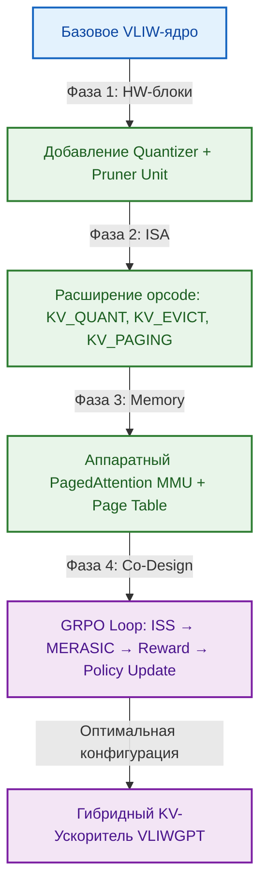
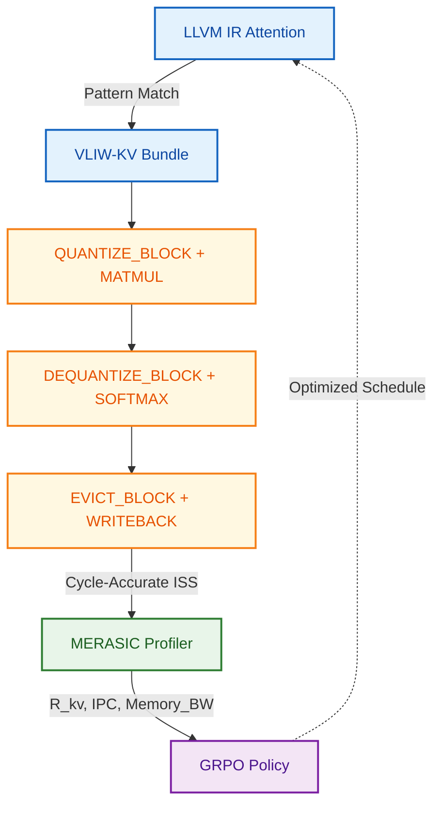

# Эволюция VLIW → KV-Ускоритель: Гибридный сопроцессор и расширение ISA

## 🎯 Контекст и цель эволюции
В архитектуре больших языковых моделей (LLM) фаза декодирования упирается в фундаментальное «бутылочное горлышко» памяти: экспоненциальный рост KV-кэша вынуждает систему постоянно перемещать данные между медленной внешней памятью (HBM/DDR) и быстрой внутричиповой SRAM. Классические вычислительные ядра простаивают в ожидании данных, что снижает эффективность GPU/NPU.

Цель данной эволюционной ветки — трансформировать базовое VLIW-ядро (VLIWGPT) в **гибридный KV-Сопроцессор**, способный аппаратно управлять жизненным циклом кэша, сжимать данные на лету и минимизировать трафик шины памяти, не нарушая детерминизм исполнения основного ядра.

---

## 📉 Почему TCAM — не панацея, а VLIW — оптимальный фундамент
Анализ троичной ассоциативной  памяти (**TCAM**) показывает теоретическую привлекательность поиска `O(1)`, но на практике она сталкивается с непреодолимыми барьерами для KV-кэша:
- **Энергопотребление и плотность:** >10 транзисторов на бит против ~6 в SRAM. Масштабирование до гигабайтных кэшей экономически невыполнимо.
- **Динамическое управление:** Удаление/сдвиг элементов в середине массива TCAM требует сложных операций, нарушающих детерминизм.
- **Роль TCAM в эволюции:** TCAM целесообразен только как нишевый **высокоскоростной селектор** (кэш тегов/метаданных), но не как основное хранилище.

**Преимущество VLIW-базиса:** Статическое планирование ILP, предсказуемые задержки и динамическая ширина бандла (2/4/8-issue) создают идеальную среду для встраивания специализированных KV-блоков. Компилятор может упаковывать инструкции управления памятью параллельно с вычислениями, а конфигурационные регистры VLIWGPT позволяют динамически выделять ресурсы под KV-задачи без ручного проектирования микроархитектуры.

---

## 🗺️ План эволюционного перехода (Roadmap)
Переход от универсального VLIW к KV-ускорителю реализуется через 4 фазы аппаратно-программной ко-эволюции:

| Фаза | Цель эволюции | Ключевые изменения | Метрика успеха (GRPO Reward) |
|:---|:---|:---|:---|
| **1. Интеграция блоков** | Добавить специализированные datapath-блоки | HW-квантователь (FP16→FP4/INT8), Блок динамической обрезки (Pruning Unit) | `↓Трафик HBM`, `↑SRAM hit-rate` |
| **2. Расширение ISA** | Внедрить высокоуровневые инструкции управления KV | Новые opcode для квантования, PagedAttention, eviction, prefetch-подсказок | `↓Счетчик NOP`, `↑IPC на decode-step` |
| **3. MMU & PagedAttention** | Аппаратная поддержка фрагментированной памяти | Таблицы страниц (Page Table), аппаратный обработчик `PAGE_FAULT`, страничный LRU | `↓Latency page-load`, `↓Memory fragmentation` |
| **4. Замкнутая петля GRPO** | Автоматическая оптимизация планирования KV-инструкций | Cycle-Accurate ISS + MERASIC Profiler → Reward → LLM+EA Agent | `R_total = w_IPC*IPC - w_POWER*Power - w_STALL*Stalls` |

---

## 🔧 Расширение ISA: Специализированные инструкции для KV-кэша
Для эффективной реализации методов сжатия и управления памятью проектируется набор **атомарных, высокоуровневых инструкций**, которые абстрагируют аппаратную сложность от ПО. Они интегрируются в VLIW-бандлы через свободные opcode-слоты и управляются тем же регистровым файлом, что и стандартные ALU/MUL операции.

### 📦 Группа 1: Квантование и де-квантование (Quantization)
Управление конвертацией FP16/FP32 → INT8/FP4/Троичные форматы и обратно. Поддержка группового квантования и генерации LUT в регистрах (аналог T-SAR).

| Инструкция | Формат | Описание |
|:---|:---|:---|
| `QUANTIZE_BLOCK` | `QUANTIZE_BLOCK src_reg, dst_mem, fmt, group_size` | Применяет заданный алгоритм (FP4/INT8/FP8) к блоку регистров, сохраняет в SRAM/HBM. |
| `DEQUANTIZE_BLOCK` | `DEQUANTIZE_BLOCK src_mem, dst_reg, fmt` | Загружает сжатый блок, восстанавливает точность для Attention-вычислений. |
| `PACK_TERNARY` | `PACK_TERNARY src_block, dst_mem` | Упаковка в троичный формат (-1, 0, +1) ~1.58 бит/эл. с сохранением семантической структуры. |
| `GEN_LUT_INLINE` | `GEN_LUT_INLINE reg_a, reg_b, table_reg` | Генерация таблицы преобразования прямо в SIMD-регистрах, исключая обращения к памяти. |

### 📑 Группа 2: Управление страницами (PagedAttention & MMU)
Аппаратная поддержка фрагментированного кэша. Аналог виртуальной памяти ОС, но оптимизированный под LLM-decode.

| Инструкция | Формат | Описание |
|:---|:---|:---|
| `SET_PAGE_TABLE_BASE` | `SET_PAGE_TABLE_BASE base_addr` | Установка базового адреса таблицы страниц для текущего потока/контекста. |
| `LOAD_PAGE_TABLE_ENTRY`| `LOAD_PAGE_TABLE_ENTRY log_addr, phys_reg` | Чтение записи таблицы: маппинг логического KV-адреса в физический SRAM/HBM. |
| `PAGE_FAULT_HANDLER` | `PAGE_FAULT_HANDLER page_id` | Программируемый обработчик прерываний при промахе. Запускает SW-процедуру загрузки страницы с диска/HBM. |

### 🧹 Группа 3: Вытеснение и предзагрузка (Eviction & Hints)
Динамическая обрезка «мусора» и оптимизация трафика шины.

| Инструкция | Формат | Описание |
|:---|:---|:---|
| `CACHE_HIT_HINT` | `CACHE_HIT_HINT addr` | Подсказка планировщику: данные уже в SRAM. Оптимизирует prefetch и снижает спекулятивные запросы. |
| `MARK_FOR_EVICT` | `MARK_FOR_EVICT block_id` | Помечает блок как кандидат на удаление (на основе важности токена/LRU). |
| `EVICT_BLOCK` | `EVICT_BLOCK block_id` | Принудительное освобождение блока в памяти. Агрегированная операция для снижения overhead. |
| `FLUSH_CACHE` | `FLUSH_CACHE stream_id` | Полная очистка KV-кэша потока (reset context). |

---

## 🤝 Эффективность VLIW-базиса для инструкций ускорителей
**Ответ: Да, VLIW-архитектура исключительно эффективна для работы с KV-ускорителями.** Это подтверждается методологией из `optimizing-vliw-instructions-evolution.md` и спецификой VLIWGPT:

1. **Детерминированное планирование:** В отличие от OoO-процессоров, VLIW-компилятор заранее знает латентность `QUANTIZE_BLOCK` или `EVICT_BLOCK`. Он упаковывает их в бандлы вместе с Attention-вычислениями, скрывая задержки доступа к памяти (`load → quantize → compute` в одном пакете).
2. **Адаптивная ширина бандла:** При высоком ILP Attention-слоя активируется `8-issue`, где 1-2 слота заняты KV-управлением, а остальные — MAC-операциями. При последовательной генерации токенов ядро переключается на `2-issue`, минимизируя энергию и фокусируясь на `DEQUANTIZE_BLOCK + Attention`.
3. **Отсутствие аппаратного арбитража:** VLIWGPT не тратит такты на динамическое переименование регистров или разрешение конфликтов. Инструкции KV-кэша исполняются ровно в назначенных слотах, что критично для предсказуемости latency в LLM-decoding.
4. **Интеграция с компилятором (LLVM TableGen):** По методике ChipGPT, новые инструкции автоматически описываются через `.td` файлы. LLM+EA-Agent генерирует паттерн-матчинг (`linalg.attention → vliw.kv_attention_bundle`), а ADL-Agent выводит C++17 код для Cycle-Accurate ISS.
5. **GRPO-оптимизация:** Аппаратные счетчики (`PMC`) отслеживают `KV_STALL_CYCLES`, `QUANT_THROUGHPUT`, `PAGE_FAULT_RATE`. Эти метрики напрямую формируют reward `R_kv`, направляя эволюцию компилятора к оптимальному планированию KV-инструкций.

---

## 🔄 Замкнутый цикл проектирования (ChipGPT Pipeline)
Эволюция ISA для KV-кэша следует строгому детерминированному пайплайну, исключающему ручное прототипирование:
1. **Генерация спецификации:** `LLM+EA-Agent` предлагает набор opcode на основе паттерна декодирования LLM.
2. **ADL-формализация:** `ADL-Agent` транслирует предложения в nML/DSL, автоматически генерируя поля декодера, порты исполнителя и логику bypassing.
3. **Компилятор + ISS:** Параллельно выводятся LLVM TableGen-бэкенд и Cycle-Accurate C++17 симулятор. 100% согласованность HW/SW.
4. **Верификация PPA:** `MERASIC` прогоняет бенчмарки (FlashAttention, SparseConv, Long-Context Decoding). Фиксирует снижение кэш-промахов, трафика HBM и энергопотребления.
5. **GRPO-Reward:** Скалярная оценка `R = α·IPC - β·Memory_Stalls - γ·Power`. При `R < threshold` агент мутирует конфигурацию (ширину бандла, глубину квантования, политику eviction). Цикл повторяется до достижения коммерческих метрик.

---

## ✅ Итог
Интеграция гибридного KV-сопроцессора в VLIWGPT не требует создания отдельного ядра процессора с нуля. Достаточно расширить ISA высокоуровневыми инструкциями управления памятью, добавить специализированные datapath-блоки (квантование, pruning, PagedAttention MMU) и замкнуть процесс эволюции через цикл `ADL → ISS → GRPO`. 

VLIW-базис демонстрирует превосходную совместимость с KV-ускорителями благодаря статическому планированию, динамической параметризации ширины бандла и возможности аппаратно-программной ко-эволюции. Это позволяет перейти от универсальных вычислителей к специализированным LLM-декодерам за часы итераций, сохраняя детерминизм исполнения и промышленный уровень достоверности метрик PPA.