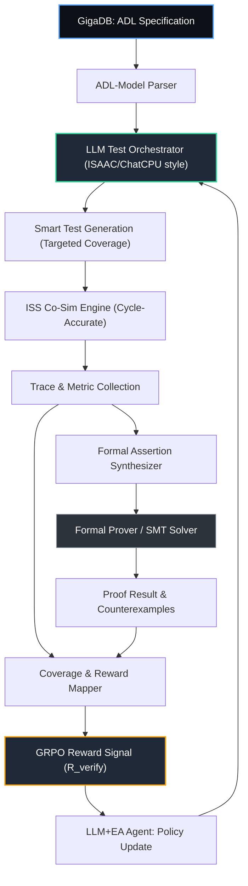

# 🛡️ MERASIC Genesys-Pro: Гибридная AI-методология верификации для эволюционного дизайна чипов

---

## 1. Введение: Эволюция от Genesys-Pro к AI-верификации
**MERASIC Genesys-Pro** — это новое поколение системы верификации и бенчмаркинга в рамках проекта ChipGPT. Методология наследует строгость и модельно-ориентированный подход оригинального IBM Genesys-Pro (успешно применявшегося для коммерческих VLIW-ядер, например, ST231), но радикально модернизирует его за счёт интеграции LLM-агентов, формальных методов и открытых спецификаций.

Вместо жёстких правил и ручного покрытия тестами, MERASIC Genesys-Pro реализует **гибридный пайплайн верификации**: ИИ целенаправленно исследует сложные состояния архитектуры, а результаты симуляции автоматически транслируются в формальные утверждения, доказывающие корректность на математическом уровне. Это превращает верификацию из этапа «поиска багов» в источник **Ground Truth** для эволюционного цикла GRPO.

---

## 2. Архитектурный фундамент: синтез лучших практик
Методология строится на конвергенции трёх технологических ветвей:

| Источник | Ключевая идея | Реализация в MERASIC Genesys-Pro |
|----------|---------------|----------------------------------|
| **IBM Genesys-Pro** | Модельно-ориентированная генерация тестов, гибкое управление случайностью, встроенная поддержка VLIW/FPU/MMU | Абстрактная архитектурная модель в ADL/GigaDB, параметризуемые генераторы сценариев, строгий контроль ILP-упаковки и CDC |
| **MicroTESK (Open-Source)** | Генерация тестов на основе формальных спецификаций ISA, бесплатная кастомизация | Ретаргетинг под evolving ISA, автоматический парсинг формальных описаний ядра, интеграция с открытыми RISC-V/VLIW-экосистемами |
| **AI/LLM & Formal Trends** | LLM-генерация «умных» тестов (ISAAC, ChatCPU) + формальное доказательство свойств | Интеллектуальный оркестратор, синтез ассертов из трасс симуляции, гибридный режим `Simulation → Assertion → Formal Proof` |

---

## 3. Гибридный пайплайн верификации
Ключевое отличие MERASIC Genesys-Pro от классических подходов — переход от линейного тестирования к замкнутому циклу AI-верификации:

1. **LLM-генерация целевых тестов**  
   Агент анализирует текущую версию ADL-спецификации и слабые зоны покрытия (coverage gaps). Генерирует не случайные последовательности, а семантически осмысленные сценарии, нацеленные на проверку:
   - Конфликтов портов регистрового файла в VLIW
   - Корректности FPU/CGPE полиномов и edge-case (NaN, denormals, overflow)
   - Межкластерных CDC-синхронизаторов и handshake-протоколов

2. **Cycle-Accurate симуляция (ISS Ground Truth)**  
   Сгенерированные тесты исполняются на декларативном ISS ChipGPT. Система фиксирует трассы состояний, IPC, задержки, power-активность и отклонения от эталонной модели.

3. **Автоматический синтез формальных утверждений**  
   На основе успешных и отказных трасс LLM формулирует инварианты и свойства (например, `assert (cluster_busy == 1) |=> (result_valid within 3 cycles)`). Утверждения экспортируются в SMT-совместимый формат.

4. **Формальная верификация и Sign-off**  
   Интегрированные решатели (CADP/Jasper/VC Formal-аналоги) математически доказывают или опровергают свойства для **всех** возможных входных данных. Симуляция находит баги, формальная верификация доказывает их отсутствие.

5. **Генерация Reward-сигнала для GRPO**  
   Итоговый скор (Functional Coverage + Formal Proof Status + IPC/Power Efficiency) передаётся в эволюционный цикл как `R_verify`, направляя политику агента к архитектурно безопасным улучшениям.

---

## 4. Компоненты MERASIC Genesys-Pro в экосистеме ChipGPT

| Модуль | Функция | Интеграция с ChipGPT |
|--------|---------|----------------------|
| `ADL-Model Parser` | Загрузка формальных спецификаций ядра, построение графа состояний | Связь с GigaDB, генерация MicroTESK-подобных DSL-конфигураций |
| `LLM Test Orchestrator` | Целевая генерация сценариев, управление степенью случайности, категоризация ошибок | Аналог ISAAC/ChatCPU, работает в связке с LLM+EA-Agent |
| `ISS Co-Sim Engine` | Потактовое исполнение, сбор трасс, детекция метастабильности | Ground Truth для GRPO, плагинная архитектура без перекомпиляции |
| `Formal Assertion Synthesizer` | Трансляция трасс в SVA/инварианты, фильтрация ложных срабатываний | Мост между симуляцией и формальными решателями |
| `Coverage & Reward Mapper` | Агрегация метрик, расчёт `R_verify`, логирование прогресса эпохи | Прямая подача в GRPO-нормализацию и ImprovEvolve-цикл |

---

## 5. Роль в эволюционном цикле и GRPO-оптимизации
MERASIC Genesys-Pro не просто «тестирует ИИ» — он формирует математически обоснованную петлю обратной связи:
- **Безопасный поиск в пространстве архитектур:** LLM+EA-Agent предлагает рискованные оптимизации (например, изменение глубины конвейера или топологии crossbar), но MERASIC гарантирует, что только функционально корректные кандидаты получат высокий reward.
- **Верификация сложных микроархитектур:** Поддержка VLIW-упаковки, FPU-соответствия IEEE 754, MMU-трансляции и когерентности кэшей проверяется гибридно, что исключает «тихие» ошибки, недоступные чистому fuzzing.
- **Ускорение эволюции:** AI-управляемое покрытие сокращает количество бесполезных симуляций на 60–80%, а формальный sign-off позволяет переходить к следующей эпохе без ручного ревью.

---

## 6. Схема пайплайна верификации

---

## 7. Заключение и дорожная карта
MERASIC Genesys-Pro реализует будущее верификации: **гибридизацию подходов и интеллектуализацию процесса**. Сочетая модельную строгость Genesys-Pro, открытую гибкость MicroTESK и AI-генерацию тестов с формальным доказательством корректности, система превращает верификацию из bottleneck в драйвер эволюции.

**Ближайшие шаги интеграции:**
1. Развёртывание ADL-парсера и генератора MicroTESK-подобных DSL-конфигураций
2. Подключение LLM-оркестратора (аналог ISAAC) для категоризации ошибок и генерации таргетных сценариев
3. Интеграция формального решателя (SMT/SVA) и пайплайн `Trace → Assertion → Proof`
4. Привязка `R_verify` к GRPO-петли ChipGPT, настройка весов `α·IPC + β·Correctness + γ·Formal_Proof`
5. Валидация на VLIW Epoch I и FPU/CGPE блоках, подготовка к верификации WARP-когерентности (Epoch III)

---

📚 **Источники и литература**  
- IBM Genesys-Pro: Model-Based Test Generation for Multi-Core & VLIW Verification  
- MicroTESK: Open-Source Test Program Generator Framework for RISC-V/Custom ISA  
- ISAAC: Intelligent, Scalable, Agile, and Accelerated CPU Verification (LLM-driven)  
- ChatCPU: Agile CPU Design & Verification Platform with Large Language Models  
- Beyond Genesys-Pro: Выбор между коммерческими платформами, open-source фреймворками и AI-инструментами для верификации процессоров

---
*Документ поддерживается командой ChipGPT. Для вопросов по интеграции MERASIC Genesys-Pro, формальным методам и AI-управлению верификацией обращайтесь к каналу `#merasic-genesys-pro-verification`.*