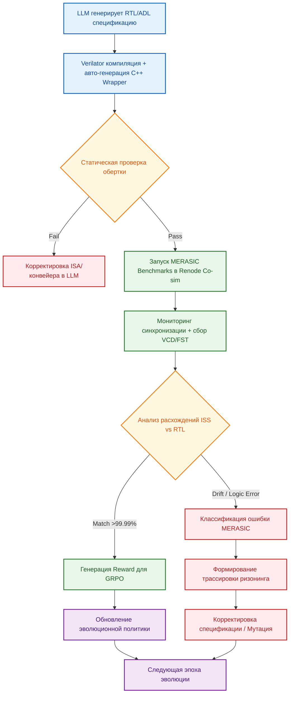

<!--
---
title: "Co-simulation VLIW-чипов в Renode: Оценка реализуемости, синхронизации и роль в верификации RTL-кода"
description: "Методология гибридной симуляции ISS и Verilator в Renode, проблемы синхронизации многоядерных VLIW-архитектур и интеграция в бенчмарк MERASIC для верификации RTL, генерируемого LLM"
tags: [renode, verilator, vliw, co-simulation, rtl-verification, iss, merasic, chipgpt, grpo, synchronization, llm-rtl-generation, hybrid-simulation]
last_updated: 2026-05-16
---
-->

# Co-simulation VLIW-чипов в Renode: Оценка реализуемости, синхронизации и роль в верификации RTL-кода

## 1. Обзор и мотивация
В рамках парадигмы эволюционного AI-дизайна ChipGPT, генерация RTL-кода с помощью LLM требует замкнутого цикла верификации с математически гарантированной корректностью. Традиционные RTL-симуляторы обеспечивают высокую точность, но крайне медленны для регрессионного тестирования и оптимизации архитектурных параметров. Гибридная co-simulation на базе **Renode + Verilator** решает эту проблему, объединяя высокоскоростную эмуляцию программного стека (через ISS) и потактовую точность аппаратной реализации (через Verilator).

Интеграция данного подхода в бенчмарк **MERASIC** превращает co-simulation из экспериментального инструмента в инженерный стандарт, обеспечивая автоматическую оценку сгенерированного RTL, формирование reward-сигналов для GRPO и масштабируемую валидацию на каждом этапе эволюции ядер (от Basic VLIW до GPGPU/TPU).

## 2. Архитектура гибридной симуляции (Renode + Verilator + ISS)
Renode предоставляет официальную поддержку интеграции внешних HDL-моделей через механизмы межпроцессного взаимодействия (IPC) и обратных вызовов (callbacks). Архитектура строится на следующих ключевых компонентах:

| Компонент | Роль в co-simulation |
|---|---|
| **ISS-ядро (C++17)** | Высокоскоростная эмуляция набора команд, выполнение ПО, профилирование |
| **Verilator-модель** | Компиляция RTL (Verilog/SystemVerilog) в C++/SystemC, потактовая симуляция логики |
| **C++ Wrapper** | Мост между API Renode и сгенерированной моделью. Вызывает `top->eval()` на каждом тике |
| **IPC-канал (сокеты)** | Обмен данными между процессом Renode и внешним Verilator-бинарником (два порта на запуск) |
| **Платформа `.repl`** | Декларативное описание системы: частота (`frequency`), буфер тактов (`limitBuffer`), шины (AXI-Lite/UART) |

Процесс интеграции требует наличия репозиториев `renode` и `renode-verilator-integration`, а также использования CMake-скрипта `configure-and-verilate.cmake`. Верилатор версии ≥v4.024 обязателен. Система не эмулирует чип целиком на RTL, а симулирует только критичные блоки (например, ядро или периферию), оставляя ОС и прикладное ПО на ISS.

## 3. Критическая проблема синхронизации в многоядерных и VLIW-конфигурациях
Renode использует модель **дискретного времени**, где все события упорядочиваются по тикам (ticks). Центральный монитор синхронизирует все встроенные ISS-модули относительно общего временного шага. Однако граница между ISS и co-simulated Verilator-моделью является зоной повышенного риска.

### Вызовы синхронизации:
1. **Вариабельность конвейера VLIW:** Одна инструкция может занимать от 1 до N тактов в зависимости от данных, конфликтов ресурсов и предсказаний.
2. **Асинхронность реакции на тик:** Если `top->eval()` выполняется за разное количество внутренних тактов RTL, реакция на один внешний тик Renode становится непредсказуемой.
3. **Многоядерная когерентность:** В конфигурации с несколькими ядрами, подключенными к общей шине, рассинхронизация приводит к гонкам состояний (race conditions) и некорректным чтениям общих регистров/памяти.

### Решение на уровне Wrapper:
- Внедрение **внутреннего счетчика тактов** внутри C++ обертки, отслеживающего прогресс RTL-конвейера.
- Детерминистическое выравнивание: обертка должна сигнализировать Renode о готовности только после полного завершения логического такта RTL.
- Использование параметра `limitBuffer` для контроля частоты IPC-вызовов и предотвращения перегрузки канала.
Без такой логики многоядерная co-simulation остается экспериментальной и непригодной для строгих метрик MERASIC.

## 4. Интеграция Renode в MERASIC: Новый стандарт верификации
MERASIC (Microarchitectural Evaluation & Reasoning for AI Silicon Co-design) использует co-simulation как высокоскоростной оркестратор верификации, заменяя вероятностную проверку на инженерный цикл с замкнутой петлей.

### Роль Renode в MERASIC-пайплайне:
- **Ground Truth & Oracle:** ISS-модель вычисляет эталонные результаты выполнения бенчмарков.
- **Co-simulation Engine:** Renode+Verilator проверяет, что сгенерированный RTL-код сохраняет функциональную эквивалентность ISS в реальном времени.
- **Reward Signal Generator:** Расхождения (дрейф регистров, ошибки шины, тайминговые рассинхроны) преобразуются в штрафные сигналы для GRPO.

### Метрики, вычисляемые в цикле:
| Категория | Метрика | Источник данных |
|---|---|---|
| Функциональная корректность | Совпадение состояний регистров/памяти (100% match) | Сравнение ISS vs Verilator на каждом тике |
| Архитектурная эффективность | IPC, латентность конвейера, заполнение буферов | Профилирование Renode + анализ RTL-трасс |
| Стабильность синхронизации | Детерминизм отклика на tick, drift < 0.01% | Мониторинг C++ wrapper counters |
| Компиляционная пригодность | Успешность Verilation, отсутствие синтез-ошибок | EDA-лог + лог сборки Verilator |

Renode не заменяет UVM или формальную верификацию, но выступает как **интеграционный фильтр**, отсеивающий архитектурно-несовместимые или синхронно-нестабильные кандидаты до передачи на формальные проверки.

## 5. Оптимальная методология верификации RTL-кода (ChipGPT Pipeline)
На основе анализа реализуемости и ограничений co-simulation, сформирован следующий оптимальный метод валидации RTL, генерируемого LLM:

### Пошаговый алгоритм:
1. **Верификация Single-Core:** Инициализация co-simulation для одного ядра. Валидация корректности C++ обертки, `top->eval()`, IPC-каналов и базовой шинной логики.
2. **Запуск MERASIC-бенчмарков:** Выполнение эталонных тестов через ISS. Параллельная передача тактов в Verilator-модель через Renode tick-механизм.
3. **Синхронизационный аудит:** Мониторинг внутренних счетчиков обертки. Проверка детерминизма: одинаковый вход → одинаковое количество RTL-тактов → идентичное состояние.
4. **Трассировочный анализ:** Экспорт `.vcd`/`.fst`. Сравнение с pure-RTL симуляцией (ModelSim/Vivado) для локализации источника расхождения (ПО, RTL или интеграция).
5. **Классификация и Reward:** MERASIC автоматически категоризирует ошибки (логические, тайминговые, ресурсные, ISA-несоответствия) и генерирует скалярный reward для GRPO.
6. **Масштабирование до Multi-Core:** Только после достижения порога корректности `>99.99%` и стабильной синхронизации добавляются дополнительные ядра с общей шиной и механизмами когерентности.
7. **Замкнутый цикл:** Результаты передаются в Agent Orchestrator. При успехе → фиксация архитектуры эпохи. При провале → мутация спецификации, повторный прогон.

## 6. Инструментарий отладки и валидации
Co-simulation в Renode предоставляет мощный набор диагностических средств, интегрируемых в MERASIC:

| Инструмент | Назначение | Интеграция в MERASIC |
|---|---|---|
| **VCD/FST Trace Export** | Запись всех изменений сигналов RTL для анализа в GTKWave | Автоматическая генерация при обнаружении drift, привязка к шагу бенчмарка |
| **Renode CLI Monitor** | Интерактивное управление, просмотр регистров, памяти, состояния периферии | Остановка на точке сбоя, дампы состояний для сравнения ISS vs RTL |
| **Execution Tracing & Profiling** | Подсчет команд, анализ горячих путей, профилирование функций | Оценка IPC, выявление узких мест конвейера VLIW, генерация метрик энерго-эффективности |
| **Виртуальная периферия** | Подстановка кастомных устройств с заданным поведением | Тестирование драйверов, прерываний и шинных протоколов (AXI/TileLink) без физического железа |

Комбинация этих инструментов превращает co-simulation из "черного ящика" в прозрачную среду, где ошибка может быть локализована на уровне RTL-сигнала, такта конвейера или инструкции компилятора.

## 7. Практические рекомендации и ограничения
Для успешного внедрения Renode co-simulation в MERASIC необходимо придерживаться следующих инженерных правил:

✅ **Рекомендации:**
- Начинать верификацию строго с **одноядерной конфигурации**. Переход к матрице ядер возможен только после стабилизации C++ обертки.
- Уделять первостепенное внимание **детерминизму синхронизации**. Обертка должна гарантировать предсказуемый ответ на каждый Renode tick.
- Активно использовать **кросс-валидацию трассировок**. Поведение co-simulated ядра должно периодически сверяться с результатами чистого RTL-симулятора.
- Рассматривать подход как **инструмент регрессионного и интеграционного тестирования**, а не как замену формальным методам.

⚠️ **Ограничения:**
- Не обеспечивает 100% покрытие логических состояний, метастабильности или асинхронных гонок. Для этого требуется UVM/Formal.
- Любая ошибка в C++ обертке создает "слепую зону": симуляция может выдавать ложноположительные результаты.
- Высокий порог входа: требуются компетенции в C++, сетевых сокетах, CMake, Verilator и внутренней архитектуре Renode.

## 8. Заключение
Интеграция co-simulation VLIW-чипов в Renode в бенчмарк MERASIC закрывает критический разрыв между высокоскоростной эмуляцией и потактовой точностью RTL. Подход обеспечивает автоматизированную, воспроизводимую и математически контролируемую верификацию архитектур, генерируемых LLM. При строгом соблюдении методологии синхронизации и интеграции в замкнутый цикл GRPO, Renode становится не просто симулятором, а ключевым компонентом эволюционного движка ChipGPT, позволяющим безопасно проходить через эпохи: от Basic VLIW к SIMD-VLIW, WARP и, в конечном итоге, к GPGPU/TPU-ускорителям с гарантированной корректностью на уровне транзисторной логики.