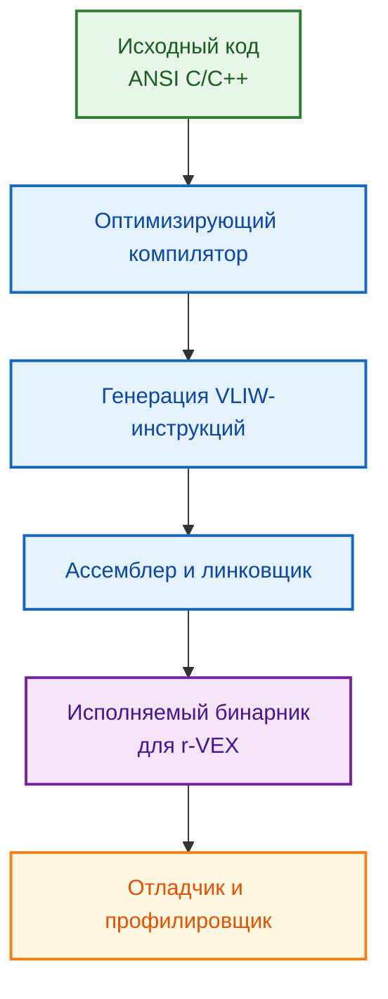
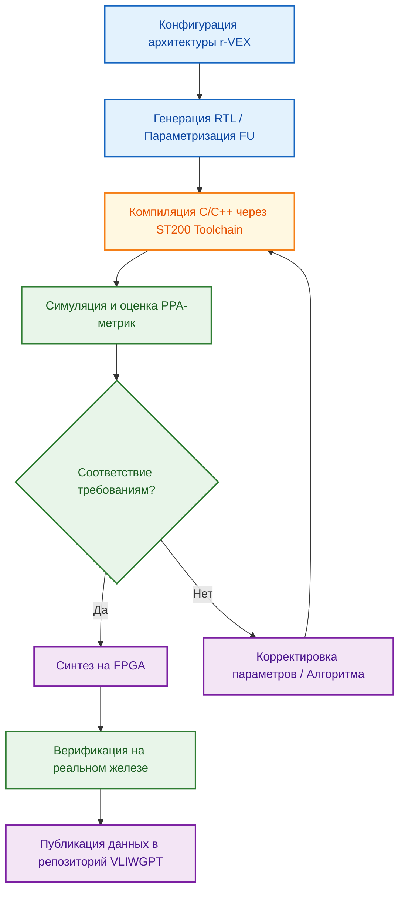

<!--
---
title: "Платформа VLIWGPT: Реализация VLIW-ядра коммерческого уровня на базе r-VEX"
description: "Архитектурное обоснование, оценка эффективности и стратегия развития учебно-исследовательской платформы VLIWGPT"
tags: [vliw, rvex, vliwgpt, chip-design, fpga, compiler, performance, asip, cgra]
last_updated: 2026-05-14
---
-->

# Платформа VLIWGPT: Реализация VLIW-ядра коммерческого уровня на базе r-VEX

> **Аннотация**: Данный раздел представляет комплексное обоснование использования академической платформы r-VEX в качестве фундамента для проекта VLIWGPT. Анализируются архитектурные решения, механизмы достижения сопоставимой с коммерческими ядрами эффективности, роль инструментария разработки и стратегия публикации проекта в научно-инженерном сообществе.

---

## 📖 Введение

Проектирование современных специализированных процессоров для цифровой обработки сигналов (DSP), высокопроизводительных вычислений (HPC) и встраиваемых систем представляет собой сложную задачу **многомерной оптимизации**, где необходимо найти компромисс между множеством взаимоисключающих целей:

- **Performance** — производительность и пропускная способность
- **Power** — энергопотребление и тепловыделение
- **Area** — площадь кристалла и стоимость производства
- **Time-to-market** — сроки разработки и верификации

Платформа **VLIWGPT** создана как структурированный учебно-исследовательский ресурс, демонстрирующий, что академические решения могут достигать уровня коммерческих VLIW-ядер не через изобретение новых принципов, а через грамотную адаптацию проверенных временем архитектурных парадигм. В основе платформы лежит параметризуемый softcore-процессор **r-VEX**, чья архитектура и экосистема полностью соответствуют индустриальным стандартам проектирования.

---

## 🎯 Обоснование выбора r-VEX как архитектурной основы

Использование r-VEX в качестве ядра для VLIWGPT обусловлено четырьмя фундаментальными факторами:

| Фактор | Обоснование |
|:---|:---|
| **Промышленное происхождение** | Архитектура r-VEX наследует принципы коммерческих платформ Lx (HP/STMicroelectronics) и TMS320C6000 (TI), что гарантирует заложенный потенциал высокой производительности и масштабируемости. |
| **Глубокая параметризуемость** | Возможность динамического изменения количества/типа функциональных блоков (FU) и конфигурации регистрового файла позволяет адаптировать ядро под конкретную рабочую нагрузку, достигая максимальной энергоэффективности. |
| **Зрелый инструментарий** | Наследие экосистемы ST200 Micro Toolset обеспечивает полноценный цикл разработки: компиляцию из ANSI C/C++, отладку, профилирование и бесшовный переход от моделирования к FPGA-реализации. |
| **Практическая верификация** | Платформа успешно применялась в сложных научных задачах (масштабируемое пересечение воксельных облаков, отказоустойчивость через неиспользуемые аппаратные ресурсы), что подтверждает её готовность к не-игрушечным вычислениям. |

> 💡 **Ключевой вывод**: r-VEX — не теоретическая модель, а практическая, программируемая аппаратная платформа, чья эффективность подтверждена архитектурным родством с массовыми коммерческими решениями и реальным использованием в исследовательских проектах.

---

## 🏗️ Архитектурные принципы и сопоставимость с коммерческими аналогами

Фундамент эффективности r-VEX строится на классических VLIW-принципах, адаптированных под современные требования кастомизации:

### Принцип 1: Параллелизм инструкций (VLIW)
Совмещение нескольких независимых операций в одной длинной инструкции позволяет выполнять арифметические, логические и load/store операции за один такт. Это кардинально повышает IPC на задачах с высоким уровнем параллелизма:
- Скалярные произведения векторов
- Свёртки и фильтрация сигналов
- Алгоритмы Витерби и OFDM-модуляция

### Принцип 2: Гибкость конфигурации
В отличие от универсальных процессоров, r-VEX позволяет задавать архитектуру под целевой workload через:
- Параметризацию функциональных блоков (ALU, MAC, LSU, FPU)
- Динамически переопределяемый регистровый файл
- Настраиваемую шину данных и межсоединения

### Принцип 3: Компилятороцентричное планирование
В VLIW статическое расписание инструкций вынесено на уровень компилятора. r-VEX использует этот подход, превращая инструментальную цепочку из простого транслятора в активного соучастника проектирования системы.

| Характеристика | r-VEX / ρ-VEX | Коммерческие аналоги (TMS320C6000, ST231) |
|:---|:---|:---|
| **Базовый принцип** | Very Long Instruction Word (VLIW) для параллелизма инструкций | Very Long Instruction Word (VLIW) для параллелизма инструкций |
| **Гибкость архитектуры** | Параметризуемая и переопределяемая; можно изменять количество и тип функциональных блоков | Менее гибкая, но предлагает семейства ядер с разным количеством ресурсов |
| **Связь с инструментарием** | Инструментарий основан на ST200 Micro Toolset, обеспечивающем компиляцию и отладку | Зрелый инструментарий (например, Code Composer Studio) с оптимизирующим компилятором и отладчиком |
| **Область применения** | Исследования, образование, прототипирование кастомных ядер | Цифровая обработка сигналов (DSP), встраиваемые системы, HPC |
| **Примеры продуктов** | Реализация на FPGA | Технологии, такие как STM32MP231, использующие ядро ST231 |

---

## ⚡ Качественная оценка производительности

Хотя прямые численные бенчмарки (IPC, PPA) против конкретных коммерческих ядер в открытых источниках отсутствуют, качественная оценка подтверждает сопоставимость:

### Ключевые метрики эффективности

| Метрика | Значение для r-VEX | Обоснование сопоставимости |
|:---|:---|:---|
| **IPC (Instructions Per Cycle)** | Потенциально высокий благодаря параллельному исполнению независимых операций | Параметризация позволяет максимизировать утилизацию FU под конкретный алгоритм |
| **Энергоэффективность** | Переопределяемая архитектура позволяет отключать неиспользуемые блоки | Критично для embedded/IoT применений, соответствует стратегии коммерческих ASIP |
| **Пропускная способность** | Архитектура ориентирована на DSP/HPC: выполнение векторно-матричных операций в одном такте | Даёт кратный прирост throughput для задач обработки сигналов и нейросетей |
| **Масштабируемость** | Поддержка добавления новых функциональных блоков без изменения базовой микроархитектуры | Соответствует тренду на кастомизацию в коммерческих CGRA/ASIP-решениях |

### Примеры практического применения

Платформа прошла успешную апробацию в нетривиальных вычислительных задачах:

1. **Масштабируемое пересечение облаков точек**
   - Использование воксельных структур требовало высокой вычислительной мощности и эффективного управления памятью
   - r-VEX продемонстрировал способность ускорять геометрические алгоритмы за счёт параллельного выполнения операций

2. **Отказоустойчивость через неиспользуемые ресурсы**
   - Демонстрация возможности перенаправления свободных аппаратных модулей для выполнения дублирующих вычислений
   - Подтверждает гибкость архитектуры и пригодность для критических приложений

Эти примеры подтверждают, что r-VEX способен выступать в роли вычислительного ускорителя для сложных алгоритмов, что является прямым индикатором его инженерной зрелости.

---

## 🛠️ Инструментарий разработки и экосистема

В VLIW-архитектурах компилятор выполняет роль аппаратного диспетчера. Для r-VEX это реализовано через наследие экосистемы **ST200 Micro Toolset**:

### Компоненты toolchain

### Ключевые возможности

- **Статическое единичное присваивание (SSA)**: Стандартизация цепочек определений/использования переменных упрощает анализ потоков данных и упаковку инструкций
- **Поддержка FPGA-конфигурирования**: Инструментарий адаптирован под генерацию битстримов для кастомных конфигураций r-VEX
- **Профилирование и отладка**: Интеграция с симуляторами и отладчиками позволяет измерять производительность на ранних этапах
- **Совместимость с EABI**: Embedded Application Binary Interface обеспечивает предсказуемость поведения приложений

Наличие полноценного toolchain снижает порог входа для исследователей и превращает r-VEX из академического прототипа в рабочую платформу для создания реальных приложений.

---

## 🔬 Практическая верификация и цикл разработки

Для перехода от концепции к работающему прототипу VLIWGPT предлагает следующий цикл разработки:

### Этапы верификации

1. **Функциональная симуляция**: Проверка корректности RTL-модели на тестовых наборах
2. **Синтез и оценка ресурсов**: Анализ использования LUT, FF, DSP-блоков на целевой FPGA
3. **Тайминг-анализ**: Проверка соблюдения временных ограничений при целевой частоте
4. **Аппаратная верификация**: Запуск реальных приложений на FPGA-прототипе
5. **Сравнение с эталоном**: Сопоставление полученных метрик с коммерческими аналогами

---

## 🗺️ Стратегия развития платформы VLIWGPT

Для перехода от академического инструмента к промышленно-ориентированному ресурсу предложен следующий roadmap:

### Краткосрочные цели (0-6 месяцев)
- Структурирование документации: создание детального руководства по архитектуре, параметризации и рабочему процессу toolchain
- Публикация сравнительного анализа: качественные и количественные оценки эффективности относительно коммерческих аналогов
- Открытие репозитория: размещение RTL-кода, toolchain-скриптов и примеров приложений на GitHub/GitLab

### Среднесрочные цели (6-18 месяцев)
- Расширение библиотеки примеров: добавление готовых решений для типовых задач DSP, компьютерного зрения, обработки сигналов
- Интеграция с CI/CD: автоматизация тестирования и регрессионного анализа при изменениях архитектуры
- Публикация в рецензируемых изданиях: представление результатов на конференциях DATE, FPT, в журналах IEEE Transactions on Education / ACM TECS

### Долгосрочные цели (18+ месяцев)
- Поддержка дополнительных платформ: портирование на различные семейства FPGA (Xilinx, Intel, Lattice)
- Расширение экосистемы: интеграция с фреймворками машинного обучения для автоматической оптимизации архитектуры под нейросетевые задачи
- Промышленное внедрение: сотрудничество с компаниями-разработчиками чипов для использования VLIWGPT в качестве платформы для прототипирования кастомных акселераторов

---

## 📊 Сравнительная таблица эффективности

| Метрика | r-VEX (VLIWGPT) | Коммерческие VLIW (ST231 / C6000) |
|:---|:---|:---|
| **Параллелизм исполнения** | Статический VLIW, настраиваемый компилятором | Статический VLIW, оптимизированный коммерческим компилятором |
| **Адаптивность к workload** | Высокая (динамическая конфигурация FU и RF) | Средняя (фиксированные семейства ядер) |
| **Инструментальная зрелость** | Наследие ST200, открытые скрипты конфигурации | Проприетарные IDE, глубокая интеграция с экосистемой |
| **Верификация** | Симуляция + FPGA-прототипирование + формальные методы | Полноценный цикл: симуляция, эмуляция, silicon validation |
| **Готовность к внедрению** | Исследования, образование, кастомные акселераторы | Массовое производство, embedded, IoT, промышленность |
| **Стоимость владения** | Низкая (открытый код, академические лицензии) | Высокая (проприетарные инструменты, лицензии на ядра) |

---

## 📚 Источники и литература

1. STMicroelectronics. *ST200 VLIW Series Using the ST200 tools on the ST231-EVAL*. Application Note AN3833.
2. Texas Instruments. *TMS320C6x VLIW DSP Architecture Overview*. Technical Reference.
3. Wong, H., Anjam, M. *The Delft Reconfigurable VLIW Processor (ρ-VEX / r-VEX)*. Academic Architecture Description.
4. STMicroelectronics. *ST200 Micro Toolset User Manual & Data Brief*.
5. Synopsys. *Equivalence Checking, Functional ECO & SoC Verification*. White Paper.
6. STMicroelectronics. *Datasheet STM32MP231A/D*.
7. MDPI. *A Survey on Design Space Exploration Approaches for Approximate Computing*.
8. arXiv. *MAGE: A Multi-Agent Engine for Automated RTL Code Generation*.
9. IEEE. *Real-Time Performance Benchmarking of RISC-V Architecture*.
10. ACM. *Explainable-DSE: An Agile and Explainable Exploration of Efficient Architectures*.

> 📌 *Данный раздел подготовлен на основе анализа архитектурных решений, методологий верификации и стратегий публикации проекта VLIWGPT. Последнее обновление: 14 мая 2026 г.*

---
