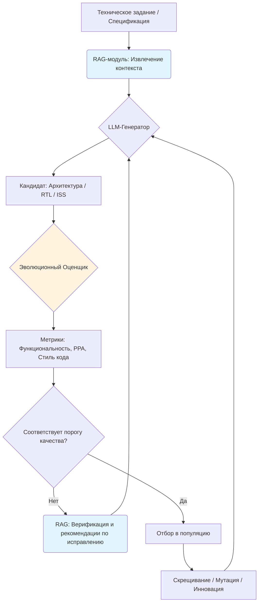

# RAG в эволюционном дизайне чипов: от теоретической возможности до практической реализации

## 1. Введение
Retrieval-Augmented Generation (RAG) представляет собой архитектурный паттерн, расширяющий возможности больших языковых моделей (LLM) за счёт динамического извлечения релевантного контекста из внешних баз знаний. В контексте электронного проектирования и производства (ЭПП) гипотеза применения RAG для эволюционного дизайна чипов предполагает создание замкнутого цикла, в котором генерация, оценка и оптимизация аппаратных архитектур направляются проверенными инженерными паттернами, спецификациями и историческими данными.

Основная цель интеграции RAG — преодоление ограничений контекстного окна LLM и устаревания внутренних весов модели. В области проектирования микросхем это критически важно, поскольку работа с большими кодовыми базами, техническими спецификациями и архитектурными документами требует широкого, точного и постоянно обновляемого контекста.

---

## 2. Роль RAG в извлечении архитектурных паттернов

### 2.1 Функциональная роль в эволюционном цикле
RAG не является самостоятельным генератором или трансформатором архитектур. Его ключевая задача — **предоставление LLM актуального, структурированного контекста** в момент принятия решений. Это позволяет формировать жизнеспособные пути развития, например, переход от архитектур Very Long Instruction Word (VLIW) к SIMD VLIW или GPU-подобным WARP-архитектурам, опираясь на проверенные инженерные решения.

### 2.2 Состав специализированной базы знаний
Эффективность RAG напрямую зависит от качества и покрытия корпуса данных. Для эволюционного дизайна чипов база знаний должна включать:
- Технические спецификации ISA (RISC-V, ARM, x86, VLIW-семейства)
- Научные статьи, патенты и документацию по API
- Примеры успешных миграций между поколениями процессоров (например, Texas Instruments C6000 → C7000)
- Верифицированный открытый исходный код (CoreMark, GitHub-репозитории, r-VEX)
- Данные о технологических процессах (PDK, метрики синтеза, ограничения библиотек стандартных ячеек)

### 2.3 Понятие «реалистичности» архитектуры
Реалистичность в контексте генерации чипов — многомерная характеристика, включающая:
- Функциональную корректность (соответствие ISA и контрактам)
- Технологическую осуществимость (соответствие правилам DRC/LVS, ограничениям техпроцесса)
- Экономическую целесообразность (площадь кристалла, энергопотребление, yield)

RAG способен учитывать функциональные и технологические ограничения, если они явно зафиксированы в базе знаний. Однако **проверка физической осуществимости требует обязательной интеграции с классическими EDA-инструментами**. Сам по себе RAG не выполняет физические расчёты и не гарантирует соответствие технологическим нормам.

---

## 3. Вклад RAG в обеспечение корректности генерации кода (ISS и Verilog)

### 3.1 Проблема прямой генерации RTL
LLM склонны генерировать синтаксически валидный, но функционально некорректный Verilog/SystemVerilog код. Основные риски:
- Ошибки в логике управления состоянием и тактировании
- Игнорирование временных ограничений (timing closure)
- Несоответствие требованиям технологии производства (fabrication compliance)
- Неспособность моделировать сложные состояния (конвейеризация, out-of-order ответы, несколько транзакций в полете)

Прямая генерация без промежуточной верификации приводит к созданию «чёрного ящика», требующего длительной и дорогостоящей отладки.

### 3.2 RAG как механизм повышения качества
Интеграция RAG в пайплайн генерации RTL позволяет модели получать релевантные примеры, спецификации и лучшие практики в реальном времени. Доказанная эффективность подхода:
- **VeriRAG** — использование RAG для переписывания кода под стандарты DFT (Design for Testability)
- **DeepV** — модельно-независимая рамка генерации RTL с динамическим контекстом
- **AI FPGA Agent** — ускорение интеграции нейросетей на ПЛИС за счёт RAG-подсказок

### 3.3 Необходимость комбинированного подхода
RAG не заменяет этапы верификации, а дополняет их. Устойчивый результат достигается при комбинации:
1. Дообучение на высококачественных датасетах (VeriCoder)
2. Циклы обратной связи с исправлением ошибок (AutoVeriFix, AutoVeriFix+)
3. RAG-контекстуализация на каждом шаге генерации
4. Многоступенчатая проверка: синтаксис → ISS-симуляция → формальная верификация → PPA-анализ

---

## 4. Интеграция с эволюционными алгоритмами

Философия эволюционного дизайна (на примере AlphaEvolve, ArchAgent, REvolution) строится на итеративном отборе «приспособленных» архитектурных решений. RAG органично встраивается в этот цикл, выполняя две ключевые функции:

### 4.1 RAG как контекст для LLM-генератора
В каждой итерации эволюции модель запрашивает у RAG конкретные инженерные паттерны:
- Организация регистрового файла (банковский доступ, конвейеризация)
- Примеры реализации шин данных и контроллеров памяти
- Исторически успешные оптимизации для целевых нагрузок

### 4.2 RAG как экспертная система для оценщика
Оценщик (Judge) использует RAG для валидации сгенерированных кандидатов:
- Проверка соответствия стандартам именования и архитектурным соглашениям
- Выявление антипаттернов проектирования
- Сравнение с эталонными реализациями из базы знаний

---

## 5. Архитектурная схема эволюционного цикла

---

## 6. Практические ограничения и зоны неопределенности

Несмотря на высокий потенциал, успешная реализация RAG в эволюционном дизайне сопряжена с системными рисками:

| Ограничение | Описание | Последствия |
|-------------|----------|-------------|
| **Полнота и актуальность данных** | Коммерческие решения закрыты NDA, открытые источники могут содержать ошибки или устаревшие данные | Формирование «слепых зон», повторение известных паттернов без инноваций |
| **Несоответствие физическим ограничениям** | LLM/RAG оперируют абстрактными знаниями, не выполняют расчёты электромиграции, тепловыделения, DRC | Генерация синтаксически верных, но непригодных к производству архитектур |
| **Устойчивость к ошибкам генерации** | Эволюционный алгоритм может закрепить функционально ошибочное решение, если оно случайно прошло один из тестов | Дрейф популяции в «болотное» направление, накопление скрытых дефектов |
| **Качество индексации базы знаний** | Необходим семантический, а не лексический поиск; требуется аннотирование и структурирование корпуса | Снижение релевантности извлекаемого контекста, падение качества генерации |

---

## 7. Стратегические рекомендации и дорожная карта внедрения

Для минимизации рисков и максимизации отдачи от RAG в эволюционном дизайне рекомендуется следующий подход:

1. **Разработка архитектуры «RAG-агента»**
   - Разделить систему на специализированных агентов: `Генератор` (контекстуализация при создании) и `Оценщик` (верификация по стандартам).
   - Исключить монолитный подход; внедрить оркестрацию взаимодействий.

2. **Создание доменной базы знаний**
   - Начать с открытых ISA (RISC-V), научных публикаций и верифицированного open-source кода.
   - Постепенно расширять покрытие коммерческими спецификациями (через партнёрства и лицензирование).

3. **Интеграция многоуровневой верификации**
   - Внедрить обязательный пайплайн: синтаксический парсинг → ISS-симуляция → формальная верификация → PPA-анализ в EDA.
   - Использовать ISS как промежуточный референсный слой для валидации логики до RTL-синтеза.

4. **Поэтапный запуск (Narrow-to-Broad)**
   - Не начинать с эволюции «VLIW → GPU». Начать с оптимизации конкретных модулей (ALU, регистровый файл, контроллер шины).
   - Протестировать экосистему на задачах миграции известных архитектур (например, имитация перехода C6000 → C7000).

---

## 8. Заключение

RAG представляет собой мощный, но не самодостаточный инструмент в эволюционном дизайне чипов. Он эффективно решает проблему контекста, повышает качество генерации RTL и направляет эволюционные алгоритмы в сторону инженерно обоснованных решений. Однако успех проекта зависит не от выбора модели, а от тщательной инженерии всей системы: качества данных, архитектуры агентского взаимодействия, глубины интеграции с EDA-инструментами и надёжности многоуровневой верификации. При соблюдении этих условий RAG становится критическим катализатором перехода от ручного проектирования к автоматизированному открытию микроархитектур.

---
*См. также:* [Эволюционные алгоритмы в EDA](#) | [ISS-симуляторы как референсный слой](#) | [LLM-генерация Verilog: риски и методы верификации](#)