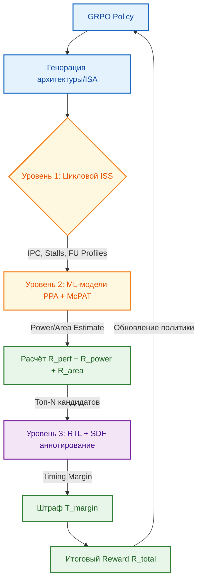

<!--
---
title: "Многоуровневая симуляция для GRPO: Интеграция ISS и RTL в функцию вознаграждения PPA"
description: "Архитектура гибридной симуляции, составная reward-функция и верификация тайминга для эволюционного проектирования чипов"
tags: [grpo, iss, rtl-simulation, ppa-optimization, reward-function, gem5, verilator, mcpat, chipgpt]
last_updated: 2026-05-14
---
-->

# Многоуровневая симуляция для GRPO: Интеграция ISS и RTL-симуляторов в составную функцию вознаграждения оптимизации PPA

> **Аннотация**: Данный раздел описывает архитектуру гибридной симуляционной экосистемы ChipGPT, обеспечивающей физически обоснованную оптимизацию метрик PPA (Performance, Power, Area) с помощью алгоритма GRPO. Анализируется роль ISS как фундаментального ядра, механизмы компенсации пробелов в данных через RTL-симуляцию и SDF-аннотирование, а также формула составной функции вознаграждения.

---

## 🎯 Обоснование использования ISS как основы для проекта

Instruction Set Simulator (ISS) выбран в качестве базового вычислительного ядра эволюционной петли ChipGPT по следующим ключевым причинам:

- **Скорость и масштабируемость**: Цикловые ISS (на базе архитектур, совместимых с gem5) выполняют симуляцию на порядки быстрее RTL-инструментов. Это критично для GRPO, требующего тысяч итераций для стабильного обновления политики.
- **Детальная архитектурная видимость**: ISS предоставляет прямой доступ к IPC, причинам простоев (stall reasons), профилям использования функциональных блоков и статистике кэшей. Эти метрики формируют первичный, высокочастотный сигнал для функции вознаграждения.
- **Независимость от RTL-деталей**: На ранних этапах эволюции микроархитектурные параметры меняются радикально. ISS позволяет оценивать концепции до генерации RTL, избегая дорогостоящего синтеза на каждой итерации.
- **Интеграция с MERASIC**: ISS выступает как `Golden Reference` для потактового сравнения сгенерированных RTL-реализаций, обеспечивая математическую корректность на уровне ISA и формируя базу для reward-сигналов.
- **Косвенная оценка PPA**: Через взвешенные архитектурные метрики и ML-модели (тренированные на McPAT) ISS позволяет получить относительные оценки Power и Area без физического синтеза, что достаточно для градиентной оптимизации на промежуточных этапах.

---

## 🏗️ Многоуровневая экосистема симуляции

Для компенсации фундаментальных ограничений ISS (отсутствие gate-level тайминга, физическая оценка мощности/площади) в ChipGPT реализована трехуровневая пирамида валидации:

| Уровень | Инструмент/Метод | Скорость | Точность | Роль в GRPO |
|:---|:---|:---|:---|:---|
| **1. Архитектурный** | Цикловой ISS | Высокая (MIPS/GIPS) | Средняя (только производительность) | Быстрая фильтрация по IPC, сбор метрик для ML-моделей |
| **2. Модельный PPA** | ML-аппроксимация + McPAT | Очень высокая | Низкая-Средняя (относительная оценка) | Прогноз Power/Area на основе архитектурных параметров ISS |
| **3. Физический (Timing)** | RTL-симулятор + SDF (Verilator) | Низкая (kIPS) | Высокая (gate-level) | Финишная проверка timing closure, расчёт штрафов за тайминг |

---

## 📐 Составная функция вознаграждения для GRPO

Формула итогового сигнала оптимизации сбалансирована так, чтобы поощрять архитектурную эффективность, но жёстко штрафовать физически нереализуемые решения:

`R_total = w_perf ⋅ R_perf + w_power ⋅ R_power + w_area ⋅ R_area − w_timing ⋅ T_margin`

### Компоненты функции

| Компонент | Источник данных | Логика расчёта |
|:---|:---|:---|
| **`R_perf`** | Цикловой ISS | Базовое значение: `IPC`. Штрафы за cache misses, branch mispredictions, pipeline stalls. Поощряет эффективный параллелизм и минимизацию простоев. |
| **`R_power`** | ML-модель (тренирована на McPAT) | `R_power = -P_estimated`. Минимизация энергопотребления через вес `w_power`. Чем ниже оценка, тем выше reward. |
| **`R_area`** | ML-модель (архитектурные параметры) | `R_area = -A_estimated`. Стимулирует компактность дизайна (оптимальные размеры кэшей/FIFO без избыточности). |
| **`T_margin`** | RTL-симулятор + SDF | Разница между целевой и реальной частотой. Если `f_real < f_target`, штраф резко возрастает. Вес `w_timing` доминирует, отсекая архитектуры с нарушениями setup/hold. |

---

## 🔗 Интеграция с архитектурой ChipGPT

Многоуровневая симуляция не изолирована, а встроена в эволюционный цикл проекта:

1. **Связь с MERASIC**: Данные ISS и RTL-прогонов автоматически классифицируются MERASIC. Ошибки тайминга или ресурсные конфликты формируют `negative reward`, направляя GRPO от анти-паттернов.
2. **Синхронизация с Эпохами**: 
   - На **Эпохе I (Basic VLIW)** доминирует Уровень 1. Быстрый поиск базовых конфигураций.
   - При переходе к **Эпохе III (WARP)** и **IV (GPGPU)** вес `w_timing` и `w_power` увеличивается, так как критические пути усложняются, а требования к энергоэффективности растут.
3. **HW/SW Co-Design**: Компилятор и рантайм эволюционируют параллельно. ISS симулирует не только ядро, но и выполнение сгенерированного бинарного кода, обеспечивая корректность `R_perf` для реальных workload'ов.
4. **Автоматизация пайплайна**: ADL-Agent генерирует ISS-модель из спецификации. LLM+EA-Agent предлагает топологии. GRPO обновляет политику на основе `R_total`. Цикл замыкается на MERASIC.

---

## 🗺️ Поэтапное внедрение в GRPO

Для стабильного обучения рекомендуется следующая дорожная карта активации уровней симуляции:

| Фаза | Активные уровни | Цель |
|:---|:---|:---|
| **1. Базовая** | Только ISS | `R = IPC`. Быстрое обучение архитектуры на функциональных паттернах без тайминговых ограничений. |
| **2. PPA-баланс** | ISS + ML/McPAT | Подключение оценок Power/Area. Агент учится находить компромисс между скоростью, энергопотреблением и площадью. |
| **3. Timing Closure** | Все 3 уровня | Интеграция RTL+SDF для топ-10% кандидатов. Введение `T_margin` гарантирует, что финальные архитектуры проходят timing closure и готовы к синтезу. |

---

## 📚 Источники и инструменты

1. **gem5 Architecture Simulator** — цикловая симуляция, сбор метрик IPC/stalls.
2. **McPAT** — интегрированное моделирование Power, Area, Timing для обучения ML-аппроксиматоров.
3. **Verilator + SDF Annotation** — gate-level симуляция с обратным аннотированием задержек.
4. **OpenSTA** — статический тайминг-анализ для выявления критических путей перед RTL-прогонами.
5. **Rhea Framework** — пример ко-симуляции gem5 + Verilator для валидации подсистем.
6. **OneDSE** — методология косвенной оценки PPA через взвешенные архитектурные метрики.

> 📌 *Данный раздел описывает методологию построения физически обоснованной функции вознаграждения для GRPO. Последнее обновление: май 2026.*

---
