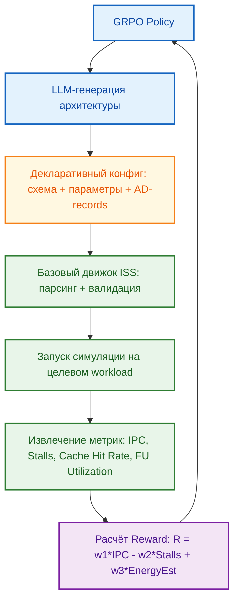

<!--
---
title: "Архитектура ISS как платформа для генерации процессорных конфигураций"
description: "Почему декларативная и параметризуемая реализация ISS идеальна для LLM-генерации и GRPO-оптимизации. Декларативный ISS: платформа для GRPO и LLM."
tags: [iss, grpo, chip-design, llm, simulation, architecture-exploration, declarative, modular]
last_updated: 2026-05-14
---
-->

# Архитектура ISS как платформа для генерации процессорных конфигураций: Почему это идеально для GRPO

> **Аннотация**: Данный раздел объясняет, почему реализация Instruction Set Simulator (ISS) в виде декларативного параметризуемого конструктора, а не монолитного приложения, является архитектурным фундаментом для эволюционного проектирования. Анализируются принципы модульности, разделения логики и реализации, механизмы декларативных схем и параметризации, а также их критическая роль в эффективности алгоритма GRPO.

---

## 🧱 Конструктор вместо монолита: Модульность и декларативность

Традиционные симуляторы проектируются как жестко связанные программы: изменение архитектуры требует правки исходного кода, перекомпиляции и глубокого понимания внутренних зависимостей. В эволюционной парадигме ChipGPT это неприемлемо.

Реализация ISS основана на двух принципах, делающих её идеальной платформой для генерации множества архитектурных комбинаций:

### Принцип 1: Строгая модульность
Система разделена на независимые функциональные блоки, каждый из которых отвечает за свою специфическую область:
- Управление конвейером инструкций (pipeline controller)
- Выполнение операций (ALU, FPU, MAC, LSU модули)
- Регистровый файл и банковая организация
- Обработка прерываний и исключений
- Модель памяти и кэш-иерархия

**Ключевая особенность**: модули могут быть либо скомпилированы в ядро симулятора, либо загружены динамически как отдельные библиотеки. Это позволяет:
- Добавлять новый функционал без перекомпиляции всего проекта
- Изолировать сгенерированный LLM код в отдельном модуле с чётким интерфейсом
- Тестировать и отлаживать модули независимо

### Принцип 2: Декларативное описание через схемы
Логика архитектуры задаётся не императивным кодом, а внешними текстовыми файлами — **схемами (schemas)**. Эти файлы описывают *что* должно происходить, а не *как*.

**Структура типичной схемы**:
```
{
  "instruction_name": "mul_add",
  "opcode": "0x1F",
  "operation_type": "ALU_3OP",
  "operands": ["R1", "R2", "R3", "R4"],
  "stages": [
    {"stage": "DECODE", "action": "parse_opcode_and_operands"},
    {"stage": "EXECUTE", "action": "ALU.execute('MULTIPLY', [R2, R3])"},
    {"stage": "EXECUTE", "action": "ALU.wait_for_result()", "dependency": "EXECUTE:0"},
    {"stage": "EXECUTE", "action": "ALU.execute('ADD', [ALU.result, R4])"},
    {"stage": "WRITE_BACK", "action": "write_register(R1, ALU.final_result)"}
  ]
}
```

**Преимущества декларативного подхода для LLM**:
- Простая, предсказуемая структура (JSON/XML-подобный синтаксис)
- Чёткие поля для заполнения вместо генерации сложной логики
- Автоматическая валидация парсером перед исполнением
- Возможность генерации через шаблон с метками-заменителями (`[[REG_COUNT]]`, `[[PIPELINE_STAGES]]`)

### Принцип 3: Записи архитектуры (AD-records) как таблицы переходов
Для описания поведения инструкций используются **записи архитектуры (Architecture Description records)**, которые формируют таблицы переходов состояний симулятора. Каждая запись определяет:
- Условие перехода (тип инструкции, состояние конвейера)
- Действие (чтение регистра, вызов ALU, запись результата)
- Зависимости от других стадий или ресурсов

Это позволяет LLM описывать поведение новой инструкции как последовательность состояний и условий, не вникая в низкоуровневую реализацию сигналов управления.

---

## 📐 Параметризация пространства поиска

Архитектура ISS предоставляет высокоуровневый интерфейс конфигурации, позволяющий задавать ключевые характеристики процессора через набор параметров:

| Компонент архитектуры | Пример параметра | Роль в генерации |
|:---|:---|:---|
| **Конвейер** | Количество ступеней: 5, 7, 9; Наличие ступеней: fetch, decode, execute, mem, wb, branch_resolve | LLM определяет глубину и состав этапов, оптимизируя баланс между латентностью и пропускной способностью |
| **Регистровый файл** | Общие: 32, Специализированные: 16 (SIMD/FPU); Размер: 32/64/128 бит | Быстрое изменение ширины и банковости без переписывания кода; параметризация под целевой workload |
| **Иерархия памяти** | L1d=32KB, L1i=16KB, L2=256KB; Политика: LRU/FIFO/Random | Автоматическая настройка кэшей под паттерны доступа; оценка влияния размера кэша на IPC |
| **Набор инструкций** | Типы: R/I/J; Расширения: SIMD, AES, SHA; Свойства: latency, throughput, dependencies | Декларативное описание латентности и зависимостей; генерация новых инструкций через AD-records |
| **Шины и межсоединения** | Ширина шины данных: 32/64/128 бит; Топология: crossbar/mesh | Оценка влияния пропускной способности на параллелизм; оптимизация под гетерогенные конфигурации |

Такой подход превращает проектирование процессора в задачу конфигурирования. LLM генерирует или модифицирует небольшие файлы параметров, после чего базовый движок ISS мгновенно собирает и запускает симуляцию новой конфигурации. Это позволяет автоматически создавать и тестировать тысячи комбинаций, что является ядром любого GRPO-эксперимента.

---

## 🔀 Разделение логики и реализации

Ключевое архитектурное преимущество — четкое разделение между описанием логики выполнения и её низкоуровневой реализацией.

- **Уровень LLM (Логика)**: Модель определяет состояния, переходы и операции. Например: *«Инструкция `mul_add` читает R2 и R3, передает на ALU, ожидает результат, добавляет R4, записывает в R1»*.
- **Уровень ISS (Реализация)**: Базовый движок берет это описание, управляет сигналами, маршрутизирует данные, обновляет счетчики команд и обрабатывает исключения.

**Практический пример**: Добавление новой инструкции `mat_mul` для ускорения матричных операций.

| Шаг | Задача для LLM | Что генерирует LLM | Что делает ISS |
|:---|:---|:---|:---|
| 1 | Описать логику выполнения | Декларативная схема с последовательностью стадий и зависимостями | Парсит схему, валидирует синтаксис |
| 2 | Определить зависимости ресурсов | Список используемых регистров, ALU, портов памяти | Резервирует ресурсы, проверяет конфликты |
| 3 | Задать тайминг-характеристики | Латентность, throughput, pipeline stalls | Интегрирует в цикл симуляции, обновляет IPC-метрики |
| 4 | Протестировать на бенчмарке | Набор тестовых векторов в формате ISS | Запускает симуляцию, собирает метрики для reward |

Для LLM это означает работу в предсказуемом, ограниченном пространстве с известным синтаксисом. Модель не должна знать, как именно реализовано ALU внутри или как обрабатываются гонки сигналов. Она оперирует высокоуровневыми архитектурными концепциями, что радикально снижает сложность генерации, повышает надежность и открывает путь к креативным решениям.

---

## ⚡ Почему это критически важно для GRPO?

Group Relative Policy Optimization (GRPO) требует массовой, быстрой и стабильной оценки архитектурных политик. Реализация ISS в виде конструктора решает фундаментальные проблемы, которые делают традиционные симуляторы непригодными для RL-обучения:

| Требование GRPO | Проблема традиционного ISS | Решение декларативной архитектуры |
|:---|:---|:---|
| **Высокая скорость итераций** | Каждая новая архитектура требует правки кода и перекомпиляции (часы/дни) | Генерация конфига → мгновенный запуск симуляции (секунды/минуты) |
| **Масштабируемость** | Невозможно параллельно оценивать тысячи вариантов из-за монолитной структуры | Полная автоматизация пайплайна: LLM → конфиг → симуляция → метрики |
| **Низкий риск ошибок** | Генерация сложного кода LLM приводит к синтаксическим и логическим ошибкам | Ограниченный синтаксис схем, валидация на уровне парсера, безопасная интерпретация |
| **Четкий Reward-сигнал** | Шумные метрики из-за артефактов реализации или багов симулятора | Изолированная оценка чистой архитектуры, детерминированные результаты |
| **Воспроизводимость** | Сложно отследить, какое изменение кода привело к изменению метрик | Конфигурационные файлы — чистый, версионируемый артефакт |

Благодаря этому GRPO получает не просто "симулятор", а **высокопроизводительную среду для эволюционного поиска**. Алгоритм может систематически исследовать пространство: от базовых конвейеров до сложных гетерогенных конфигураций с расширенными наборами инструкций, получая стабильный, воспроизводимый сигнал для обновления политики.

---

## 🔄 Цикл генерации и оценки в GRPO

Ниже представлена схема интеграции декларативного ISS в петлю обучения GRPO:


---

## 📊 Сравнение подходов к проектированию ISS

| Аспект | Монолитный симулятор | Декларативный ISS-конструктор |
|:---|:---|:---|
| **Создание варианта** | Ручная правка кода, высокий риск ошибок | Генерация малого конфига, валидация парсером |
| **Сложность для LLM** | Очень высокая (генерация связанного C++ кода) | Низкая/Средняя (заполнение шаблонов, декларативные схемы) |
| **Скорость прототипирования** | Медленная (сборка → тест → отладка) | Мгновенная (парсинг → запуск) |
| **Масштабируемость** | Низкая (не для больших пространств) | Высокая (полная автоматизация тысяч прогонов) |
| **Надежность** | Низкая (баги в критическом пути) | Высокая (изолированная логика, тестированный движок) |
| **Воспроизводимость** | Сложно (зависит от состояния кода) | Высокая (конфиги — версионируемые артефакты) |
| **Интеграция с GRPO** | Затруднена (медленная обратная связь) | Естественна (быстрый reward-цикл) |

---

## 🔮 Заключение

Архитектура ISS, реализованная как параметризуемый декларативный конструктор, трансформирует процесс проектирования процессоров из искусства в управляемый инженерный конвейер. Для GRPO это означает переход от "попыток запустить сгенерированный код" к **систематической эволюции архитектурных политик**.

Модель генерирует конфигурации, базовый движок безопасно их интерпретирует, симулятор выдает точные метрики, а алгоритм оптимизации обновляет стратегию поиска. Такой замкнутый цикл, построенный на принципах модульности, декларативности и разделения логики/реализации, является единственным жизнеспособным путем к автоматизированному созданию чипов коммерческого уровня.

> 📌 *Данный раздел описывает архитектурные принципы реализации ISS, обеспечивающие масштабируемость генерации конфигураций и их интеграцию в петлю GRPO. Последнее обновление: май 2026.*

---
