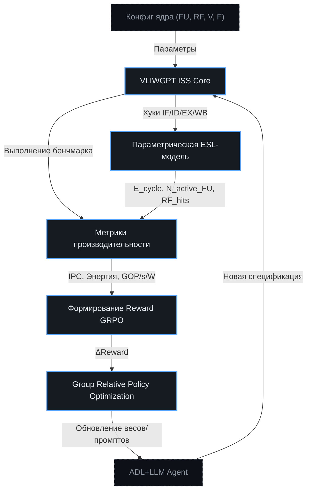

# ⚡ Параметрическая ESL-модель энергопотребления для GRPO
> Интеграция cycle-accurate мониторинга потребления энергии в VLIWGPT ISS для формирования reward-сигналов GRPO, параметрическая оценка PPA и автоматизация архитектурного поиска на уровне ESL.

## 🎯 Роль энергопотребления в петле ко-эволюции ChipGPT
Энергетическая симуляция на уровне Electronic System Level (ESL) является критическим компонентом reward-функции GRPO. При смене алгоритмических нагрузок (разные модели AI, алгоритмы сжатия, паттерны доступа к памяти) архитектура ядра должна адаптироваться не только ради роста IPC, но и в рамках заданного теплового бюджета. Без точного моделирования энергопотребления эволюционный поиск рискует сгенерировать высокопроизводительные, но термически нежизнеспособные конфигурации.

---

## ⚖️ Абсолютные vs Относительные величины: что нужно GRPO?
**Для обучения GRPO достаточно относительных величин.** Алгоритмы групповой оптимизации политики (Group Relative Policy Optimization) работают на градиентах разницы между вариантами. Если конфигурация `A` потребляет на 30% меньше энергии, чем `B` при том же IPC, GRPO получит чёткий positive-reward и сместит policy в сторону архитектурного пространства `A`. Абсолютное значение в джоулях или ваттах не требуется для сходимости.

**Однако абсолютная калибровка необходима на двух уровнях:**
1. **Валидация и TDP-лимиты:** Чтобы GRPO не выходил за физические рамки (например, `max_power_budget = 15W`), абсолютные аппроксимации позволяют отсекать нереализуемые варианты.
2. **Сравнение cross-workload:** При переходе от CNN к Attention или Sparse-conv относительные метрики искажаются из-за разной плотности вычислений. Нормализация к абсолютному эталону (например, через калибровку на `MiBench` или `gem5`) сохраняет согласованность reward-сигналов между эпохами.

**Достаточно ли статистики инструкций?**  
Да. Параметрическая модель на ESL-уровне опирается на **активности**, а не на RTL-симуляцию транзисторов. Статистика выборки бандлов, активных FU, обращений к RF, промахов кэшей и частоты NOP-ов формирует достаточный базис для оценки динамической энергии с точностью >90% относительно RTL, что идеально подходит для раннего DSE и GRPO.

---

## 🔌 Практическая интеграция в ISS-симулятор
Главная техническая задача — внедрить логику расчета энергии в существующий цикл VLIWGPT ISS. Это потребует модификации кода симулятора и внедрения параметрических хуков на границах стадий конвейера.

### 📍 Точки интеграции (Integration Hooks)
В каждой итерации такта ISS вызывает модуль `EnergyModel` на 4 ключевых этапах:

| Стадия конвейера | Передаваемые данные в модель | Формула аппроксимации (параметрическая) |
|:---|:---|:---|
| **IF (Выборка)** | `bundle_size`, `active_instructions` | `E_IF = P_static_IF * T + N_bytes * P_dyn_per_byte` |
| **ID/RR (Декод/Переименование)** | `N_non_NOP_instrs`, `RF_read_ports_used` | `E_IDRR = P_static * T + N_active * P_dyn_decode` |
| **EX (Исполнение)** | `active_FUs[]`, `FU_types`, `operation_bits` | `E_EX = Σ(P_static_FU + A_FU * P_dyn_op(FU))` |
| **WB (Запись)** | `N_results_to_write`, `RF_write_ports_used` | `E_WB = P_static * T + N_writes * P_dyn_regfile` |

### 🧮 Механизм накопления
В структуре ISS добавляется контекст `EnergyContext`:
```cpp
struct CycleEnergyReport {
    double e_if, e_idrr, e_ex, e_wb;
    double total_cycle_energy;
    uint64_t active_fus_mask;
    uint64_t mem_accesses;
};

class ISS_Core {
    double accumulated_energy = 0.0;
    void tick() {
        // ... выполнение стадий ...
        auto report = EnergyModel::calculate_cycle(state, arch_params);
        accumulated_energy += report.total_cycle_energy;
        telemetry.log_energy(report); // Для анализа GRPO
    }
};
```
Все параметры (`arch_params`) загружаются из внешнего конфигурационного файла (YAML/JSON), что позволяет мгновенно менять топологию ядра, типы FU, структуру RF, напряжение и частоту без перекомпиляции ISS.

---

## 📊 Интеграция в Reward-функцию GRPO
Reward-сигнал формируется как многокритериальная функция, где энергия выступает регулятором компромисса между производительностью и эффективностью:

```math
Reward = α \cdot \frac{IPC_{config}}{IPC_{baseline}} 
       - β \cdot \frac{E_{total\_config}}{E_{baseline}} 
       + γ \cdot \frac{GOP/s/W_{config}}{GOP/s/W_{baseline}}
       - λ \cdot \max(0, E_{config} - E_{TDP\_limit})
```
- **α, β, γ, λ** — гиперпараметры GRPO, настраиваемые через RAG-контекст или вручную.
- **Относительные дроби** обеспечивают стабильность обучения независимо от масштаба нагрузки.
- **Штраф за TDP** гарантирует, что эволюция не уходит в термически нежизнеспособные регионы пространства поиска.

Статистика энергомодели передаётся в GRPO после каждого `MERASIC`-бенчмарка, формируя скалярный сигнал для обновления policy. Это позволяет системе самостоятельно «понимать», что для задачи `Sparse Conv` выгоднее уменьшить количество MAC-блоков, но увеличить пропускную способность шины и RF.

---

## 🗺️ Архитектура потока данных (ISS → Energy → GRPO)



---

## 🛠 Практический план внедрения
1. **Создание параметрического реестра:** Определить `vliw_energy_config.yaml` с полями для каждого FU, RF-порта, ширины шины, напряжения/частоты.
2. **Внедрение хуков в ISS:** Добавить вызовы `EnergyModel::estimate(stage, state)` на границах IF/ID/EX/WB без влияния на скорость симуляции (inline-оптимизации).
3. **Телеметрия для GRPO:** Реализовать логгер, агрегирующий `total_energy`, `dynamic_ratio`, `static_ratio`, `FU_utilization` за весь запуск бенчмарка.
4. **Валидация трендов:** Запустить `MiBench` на 3-5 конфигурациях ядра. Убедиться, что модель правильно предсказывает относительную разницу энергии (±10% достаточно для GRPO).
5. **Интеграция в пайплайн:** Подключить вывод энергетических метрик к MERASIC Oracle и GRPO policy updater.

---

## 🌐 Итог: Исследовательская платформа, а не просто калькулятор
Итоговый продукт — это не просто программа, а исследовательская платформа. Она должна быть хорошо документирована, с четким описанием всех параметров, допущений и ограничений. Такой инструмент станет бесценным активом для дальнейших исследований в области проектирования энергоэффективных встраиваемых систем, позволяя исследователям быстро и экономически эффективно оценивать огромное количество потенциальных архитектурных решений на самых ранних этапах разработки, задолго до изготовления физического прототипа.

Благодаря параметрической природе модели и интеграции с VLIWGPT ISS, ChipGPT получает возможность:
- Проводить **автоматизированный DSE** с учётом PPA-метрик за минуты, а не месяцы.
- Обучать GRPO на **реалистичных компромиссах** (скорость vs тепло), а не только на IPC.
- Гарантировать, что каждая сгенерированная эпоха VLIW→GPU не только функциональна, но и **термически жизнеспособна** для целевой embedded- или datacenter-платформы.