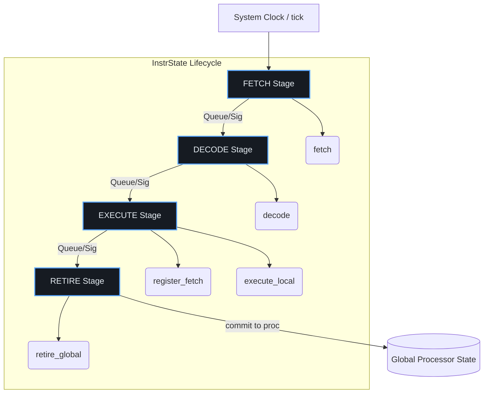

<!--
---
title: "VLIWGPT ISS: Детерминированная симуляция конвейера Эпохи 1"
description: "Поэтапная логика работы Instruction Set Simulator: разделение функционала и тайминга, класс InstrState, конвейерный tick-механизм и интеграция в пайплайн VLIWGPT"
tags: [iss, vliw, epoch1, cycle-accurate, simulation, pipeline, instrstate, vliwgpt, ground-truth, merasic]
last_updated: 2026-05-18
---
-->

# 🧠 VLIWGPT ISS: Детерминированная симуляция конвейера Эпохи 1

## 1. Фундаментальная концепция: Разделение функции и производительности
Архитектура Instruction Set Simulator (ISS) для Эпохи 1 (Basic VLIW) построена на строгом разделении **функционального поведения** (что делает инструкция) и **временной модели** (когда и в каком порядке она выполняется). Вместо монолитного эмулятора, где логика вычислений жёстко вплетена в код конвейера, VLIWGPT использует объектно-ориентированный подход, при котором каждая инструкция получает собственный изолированный экземпляр состояния. Это позволяет:
- Независимо валидировать ISA и семантику операций без привязки к таймингам.
- Масштабировать модель от быстрой функциональной проверки до `cycle-accurate` симуляции конвейера.
- Детерминированно рассчитывать reward-сигналы для GRPO, исключая временные гонки состояний.

## 2. Ядро симуляции: Класс `InstrState`
Центральный элемент ISS — структура `InstrState`, инкапсулирующая полный жизненный цикл одной VLIW-инструкции (или пакета). Класс содержит:

| Элемент | Назначение в VLIW-контексте |
|:---|:---|
| `pc` | Счетчик команд. Кратен ширине VLIW-слова. |
| `opcode` | Код операции, считанный из памяти модели. |
| `instr` | Указатель на декодированное описание пакета (содержит методы `execute` для каждого слота). |
| `op[]` | Локальные копии входных/выходных операндов. Хранятся внутри экземпляра, а не в глобальном регистровом файле. |
| `trap` | Запись об исключениях/прерываниях. Активируется только на стадии `retire`. |
| `proc` | Ссылка на полное архитектурное состояние процессора на момент выборки. |

**Ключевое преимущество:** Локальное хранение операндов позволяет симулятору безопасно спекулятивно выполнять несколько пакетов одновременно, не затрагивая реальный регистровый файл до момента финального коммита. Это критично для корректной работы статического планировщика и оценки IPC.

## 3. Жизненный цикл VLIW-инструкции
Каждый экземпляр `InstrState` проходит 5 логических фаз, строго отделённых от аппаратного конвейера:

1. **`fetch()`** → Считывает VLIW-пакет из памяти по `pc`, загружает `opcode`.
2. **`decode()`** → Сопоставляет `opcode` с таблицей декодирования, инициализирует массив операндов `op[]` для каждого слота.
3. **`register_fetch()`** → Копирует значения исходных регистров из `proc` в локальный `op[]` пакета.
4. **`execute()`** → Вызывает функциональную логику каждого слота. Результаты записываются **локально** в `op[]`. Глобальные регистры **не изменяются**.
5. **`retire()`** → Финальный коммит: результаты из `op[]` атомарно попадают в регистровый файл, `pc` обновляется, обрабатываются `trap`.

## 4. Двухуровневая архитектура моделирования
VLIWGPT использует одну кодовую базу в двух режимах:

### 🔹 Функциональная модель (Functional Mode)
- Использует **один экземпляр** `InstrState`.
- Строго последовательное выполнение: `fetch → decode → register_fetch → execute → retire`.
- **Роль в VLIWGPT:** Быстрая валидация корректности ISA, запуск эталонных тестов MERASIC, генерация Ground Truth для обучения GRPO. Скорость на 2–3 порядка выше cycle-accurate.

### 🔹 Модель точной производительности (Performance Mode)
- Управляет **множеством перекрывающихся экземпляров**, находящихся на разных стадиях конвейера.
- Вводит тактирование через `tick()`. Моделирует конвейерные конфликты, задержки доступа к памяти, статическое расписание VLIW.
- **Роль в VLIWGPT:** Точная оценка IPC, латентности, заполнения функциональных блоков. Формирует метрики для PPA-оптимизации и ко-симуляции с Verilator.

## 5. Логика конвейера и механизм `tick()`
Конвейер реализуется как сеть объектов-стадий (`Fetch`, `Decode`, `Execute`, `Retire`), соединённых через шаблонные классы очередей и сигналов:

| Связь | Механизм |
|:---|:---|
| `QueueInput<T>` / `QueueOutput<T>` | Передают указатели на `InstrState` между стадиями с учётом заполненности буферов. |
| `SignalInput<T>` / `SignalOutput<T>` | Мгновенная передача событий (адрес ветвления, flush-запрос, исключение). |

Системный генератор вызывает `tick()` для каждой стадии. Логика обработки:
1. Проверка сигналов управления (ветвление, исключение).
2. Проверка заполненности выходной очереди → при переполнении: `stall` (блокировка).
3. Проверка пустоты входной очереди → при отсутствии данных: `bubble` (простой).
4. Основное действие: извлечение указателя, вызов соответствующего метода (`decode()`, `execute()` и т.д.), помещение в выходную очередь.

Это гарантирует детерминированное продвижение VLIW-пакетов, корректную обработку задержек и предотвращение гонок состояний в многослотной архитектуре.

## 6. Разрешение зависимостей и Forwarding
В VLIW-архитектуре статический планировщик старается избегать RAW-зависимостей, но в конвейере они неизбежны. Решение в ISS:
- Результаты хранятся в **локальных операндах** текущего `InstrState`.
- Стадия `Execute` может напрямую передавать указатель на вычисленный результат следующей инструкции через сигналы или дополнительные каналы bypass.
- Логика forwarding реализуется как надстройка над очередями. Зависимость разрешается на уровне симулятора **без изменения функционального кода** инструкций.
- Это позволяет моделировать сложные конвейерные оптимизации и оценивать эффективность статического расписания, генерируемого LLM-компилятором.

## 7. Управление ветвлениями и сброс конвейера
Ветвление обрабатывается асинхронно через сигналы:
1. На стадии `Execute` вычисляется целевой адрес перехода (или используется статическое предсказание).
2. Сигнал мгновенно рассылается в `Fetch` и `Decode`.
3. `Fetch` переключается на новый адрес.
4. `Decode` получает команду на очистку входной очереди (`goto.is_valid()` → flush), имитируя аппаратный сброс конвейера.
5. Инструкции, уже попавшие в конвейер по ошибочному пути, не доходят до `retire`, их локальные результаты игнорируются.

Это обеспечивает корректное моделирование штрафов за misprediction и точный подсчёт реального IPC.

## 8. Интеграция в пайплайн VLIWGPT
Архитектура ISS напрямую встроена в цикл эволюции Эпохи 1:

| Компонент VLIWGPT | Использование ISS |
|:---|:---|
| **LLM-Compiler** | Генерирует VLIW-код и расписание. ISS быстро валидирует синтаксис и семантику в Functional Mode. |
| **MERASIC Oracle** | ISS выступает эталоном. Результаты `retire()` сравниваются с co-simulated RTL через Renode. |
| **GRPO Reward** | На основе метрик ISS (IPC, latency, stall cycles, flush count) вычисляется составной reward-сигнал. |
| **Agent Orchestrator** | При расхождении ISS vs RTL > 0.01% автоматически генерирует трассу ризонинга для коррекции LLM-спецификации. |

## 9. Потоковая схема данных в ISS

- Каждый шаг тактируется вызовом `tick()`.
- Состояние инструкции перемещается по очереди как указатель.
- Глобальное состояние процессора (`proc`) обновляется **только** на стадии `retire`.
- Ветвления и исключения обрабатываются через асинхронные сигналы, мгновенно прерывающие нормальный поток.

## 10. Заключение
Архитектура ISS для Эпохи 1 представляет собой не императивный эмулятор, а **объектно-ориентированный конвейерный интерпретатор**, где каждый VLIW-пакет является автономным агентом с изолированным состоянием. Такой подход радикально упрощает верификацию генерируемого LLM кода, ускоряет итерации при изменении ISA и позволяет плавно масштабировать модель от быстрой функциональной проверки до точного `cycle-accurate` симулятора без переписывания ядра. Именно эта архитектура обеспечивает математически гарантированный Ground Truth для MERASIC, формирует стабильные reward-сигналы для GRPO и служит фундаментом для перехода к Эпохам 2–4.