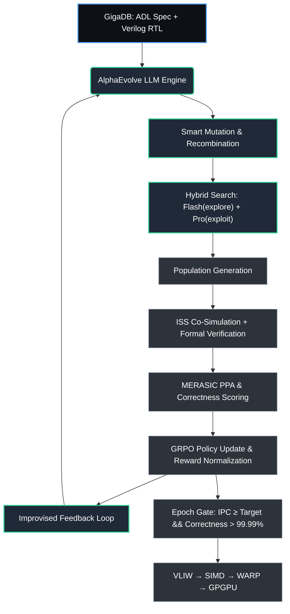

<!--
---
title: AlphaEvolve × ChipGPT: Параметры эволюционного поиска
description: Конфигурационное пространство ISS, стратегии популяций и HW/SW co-evolution для автономной оптимизации архитектур от VLIW до TPU/GPU.
tags: [evolution, alphaevolve, iss, dse, vliw, gpu, tpu, grpo]
---
-->

# 🧬 AlphaEvolve × ChipGPT: Параметры эволюционного поиска

Данный раздел описывает конфигурационное пространство, используемое GigaCore Agent и AlphaEvolve для генерации, оценки и отбора архитектурных кандидатов. Каждый кандидат представляет собой структурированный геном (JSON/YAML/ADL), который транслируется в cycle-accurate симулятор (ISS) для расчёта фитнес-метрик.

## 1. Параметры ISS для генерации популяций

Ниже приведён полный набор оптимизируемых параметров, сгруппированных по архитектурным доменам. Изменение любого из них напрямую влияет на IPC, энергопотребление, площадь кристалла или функциональную корректность.

| Домен | Параметры (Knobs) | Влияние на метрики |
|-------|-------------------|-------------------|
| **Pipeline & Execution** | `issue_width` (1–8)<br>`pipeline_depth` (3–7)<br>`fu_types_per_slot`<br>`fu_latency`, `fu_ii`<br>`branch_prediction`<br>`speculation_buffer_depth` | IPC, CPI, штрафы за mispredict, конвейерные простои |
| **Clustering & Interconnect** | `num_clusters` (1–8)<br>`max_fu_per_cluster`<br>`cluster_topology`<br>`cross_cluster_bus_width`<br>`arbitration_policy`<br>`scratchpad_size` | Масштабируемость, межкластерный трафик, clock skew, granularity power gating |
| **Register File & Data Path** | `rf_size_per_cluster` (32–128)<br>`rf_read/write_ports`<br>`rf_banking_strategy`<br>`bypass_mux_delay`<br>`register_renaming_depth`<br>`immediate_field_width` | Register pressure, congestion портов, dynamic power, критический путь |
| **ISA & Encoding** | `vliw_bundle_size_bits`<br>`slot_encoding_density`<br>`opcode_space_allocation`<br>`macro_op_fusion_enable`<br>`vector_lane_count`<br>`data_type_support` | Size кода, fetch bandwidth, гибкость расписания компилятора |
| **Memory Hierarchy** | `l1_icache/dcache_size`<br>`cache_associativity`<br>`cache_line_size`<br>`replacement_policy`<br>`write_buffer_depth`<br>`dma_engine_enable` | Latency памяти, miss rate, utilization полосы, power toggles |
| **Low-Power & Clocking** | `clock_domain_count`<br>`clock_gating_granularity`<br>`gating_threshold_toggle_rate`<br>`operand_isolation_enable`<br>`dvfs_points`<br>`fdv_cell_mapping_ratio` | Dynamic/static power, glitch activity, SAIF toggle rate, area overhead |
| **Compiler/Scheduling Hooks** | `loop_unroll_factor_range`<br>`software_pipelining_ii_target`<br>`scheduling_heuristic`<br>`spill_threshold`<br>`tiling_block_size`<br>`prefetch_distance` | ILP exposure, register pressure, паттерны доступа, стабильность reward |

> 💡 **Геном кандидата**: Параметры кодируются в единый конфигурационный файл. LLM-агент мутирует, скрещивает и валидирует этот геном через ISS, формируя новое поколение архитектур.

## 2. Размер популяции и стратегия отбора

AlphaEvolve не требует массовых популяций, как классические генетические алгоритмы. LLM выполняет семантически осмысленные мутации, что позволяет достигать сходимости на меньшем объёме выборок.

| Сценарий | Размер популяции (`N`) | Стратегия отбора | Комментарий |
|----------|------------------------|------------------|-------------|
| **Базовый поиск** | `32–48` | Top-20% survive + LLM crossover | Быстрая валидация через ISS + суррогатные модели MERASIC |
| **Глубокая PPA/IPC оптимизация** | `64–128` | Elitism (K=5) + GRPO normalization + ImprovEvolve feedback | Гибридный цикл: Flash (80% exploration) + Pro (20% exploitation) |
| **HW/SW Co-Evolution** | `N_hw = 64`<br>`N_sw = 64` | Cross-evaluation reward, alternating epochs | Программные мутации оцениваются на фиксированной HW-популяции и наоборот |

**Рекомендуемый старт**: `N = 96`, `epochs = 50–150`. При использовании суррогатных ISS-моделей и кэширования верификаторов, одна эпоха занимает минуты, а не часы.

## 3. Роль входного ПО (Workloads & Benchmarks)

Входное ПО формирует **ландшафт фитнеса**. Без репрезентативных workload-ов оптимизация вырождается в overfitting на синтетические циклы.

| Функция workload-а | Использование в AlphaEvolve |
|--------------------|---------------------------|
| **Instruction mix** | Определяет частоту использования FU, RF-портов и bypass-сетей |
| **Memory access patterns** | Влияет на cache hit/miss, bus toggle rate, эффективность power gating |
| **ILP exposure** | Показывает, насколько микроархитектура успевает исполнять VLIW-пакеты |
| **Branch behavior** | Тестирует предикатор, speculation buffer, штрафы за pipeline flush |
| **Power activity profile** | Генерирует `toggle_rate` для SAIF-аннотаций, оценивает glitch power |

> ⚠️ **Важно**: Компиляция workload-ов должна адаптироваться к evolving ISA. В ChipGPT для этого используется **retargetable LLVM/MLIR backend**, пересобираемый на лету под параметры популяции. Базовый набор: `MERASIC_v1` (DCT, FFT, GEMM, Attention, FHE kernels).

## 4. HW/SW Co-Evolution: Интеграция софта в поиск

Программный код не просто «запускается» — он становится **активной частью пространства поиска**. В ChipGPT это реализуется тремя стратегиями:

### 🔹 Вариант A: Joint Genotype (Совместный геном)
Один конфигурационный файл описывает и аппаратуру, и компиляторные настройки:
```yaml
hw:
  issue_width: 4
  clusters: 2
  rf_size: 64
  clock_gating: true
sw:
  loop_unroll: 4
  tiling: [32, 32]
  scheduling: modulo
  prefetch: 2
```

LLM мутирует оба блока одновременно. Фитнес рассчитывается как:  
`Fitness = IPC(hw, sw) × (1 - power_penalty)`

### 🔹 Вариант B: Alternating Co-Evolution
1. Фиксируем HW-популяцию → эволюционируем SW-трансформации (compiler passes, kernel layout).
2. Фиксируем лучшие SW-конфиги → эволюционируем HW под них.
3. Цикл повторяется до сходимости. Устойчив к локальным оптимумам.

### 🔹 Вариант C: Hierarchical Search (AlphaEvolve-native)
- **Level 1 (Flash)**: Широкий поиск по SW-параметрам (tiling, unroll, fusion).
- **Level 2 (Pro)**: Глубокая доработка HW-конфигов под отобранные SW-паттерны.
- **ImprovEvolve**: LLM анализирует лучшие пары `(hw, sw)` и предлагает архитектурный сдвиг (например, добавление предикатных масок или изменение cross-cluster topology).

## 5. Практические рекомендации для запуска

1. **Стартовая конфигурация**: `N = 64`, `epochs = 50`, `benchmark_set = MERASIC_v1 + custom_attention_kernel`.
2. **Суррогатная валидация**: Используйте быстрый аппроксиматор ISS для отбраковки 80% кандидатов. Cycle-accurate симуляцию запускайте только для top-20%.
3. **Пайплайн данных**: Параметры → ADL/GigaDB → AlphaEvolve генерирует JSON → GigaCore Agent транслирует в ISS config + Verilog stub.
4. **Reward-функция**:  
   `R = α·IPC + β·(1 - Power/W) + γ·Area_norm + δ·Correctness`  
   GRPO нормализует reward внутри группы, ImprovEvolve предлагает targeted mutations.
5. **Верификация**: MERASIC (functional), SAIF-generator + PrimePower API (power), formal CDC check (clock domains), timing closure proxy (static analysis).
6. **Масштабирование к Эпохам III–IV**: При переходе к WARP → GPGPU добавляйте параметры `warp_scheduler`, `shared_memory_banking`, `hbm_controller`. Софт-популяция автоматически адаптирует `kernel_launches` и `thread_mapping`.

## 6. Схема интеграционного пайплайна



---
*Документ поддерживается командой ChipGPT.*
