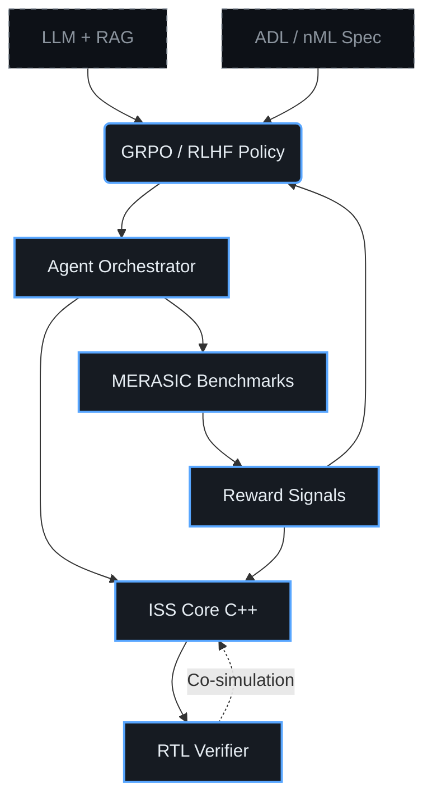

# 🧠 ChipGPT: Evolutionary AI-Driven Processor Architecture Design

<picture>
  <source srcset="assets/banner.webp" type="image/webp">
  
</picture>

> An automated pipeline from baseline commercial cores (VLIW/RISC-V) to complex GPU/TPU accelerators, enabled by a closed-loop HW/SW co-evolution cycle with mathematically guaranteed correctness.

[](LICENSE)
[](https://www.python.org/downloads/)
[](https://isocpp.org/)
[](https://thechipgpt.github.io/chipgpt/)

## 1. 🎯 Problem Statement

Modern LLMs excel at generating high-level code but **fail catastrophically when synthesizing RTL (chip-level Verilog code)**. The reason: chip design is a *zero-tolerance domain*—an error in logic or clocking means a non-functional silicon die costing hundreds of millions of dollars, not a cheap hotfix (as in software).

ChipGPT addresses three fundamental challenges:

1. **Lack of an automated architectural search space.** Typical ASIP (Application-Specific Instruction-Set Processor) generation pipelines require manual selection of ISA extensions and microarchitectural parameters.
2. **The HW/SW gap.** Evolving the core is useless without the synchronous evolution of the compiler, assembler, and runtime.
3. **No mathematically grounded verification loop.** Generative models lack a built-in mechanism for instant functional correctness checking.

We introduce **evolutionary HW/SW co-design**, where each iteration is accompanied by rigorous formal control through a cycle-accurate ISS (Instruction Set Simulator) and the MERASIC self-assessment system.

📖 *Learn more:* [The Evolutionary Chip Design Paradigm](#/wiki/evolutionary-paradigm) | [DSE vs. Evolution: A Comparative Analysis](#/wiki/dse-vs-evolution)

---

## 2. 📐 System Architecture



The system replaces the linear `Design Space Exploration (DSE)` with an **evolutionary closed-loop verification cycle**: generation → simulation → evaluation → selection → mutation/crossover → next epoch.

---

## 3. 🧬 Epochs of Processor Core Evolution

The evolution **from VLIW to GPU** is divided into four qualitatively distinct epochs. Each epoch entails the **synchronous evolution of three layers**: core architecture, assembler/ISA, and the optimizing compiler.
Each epoch may consist of intermediate sub-epochs.

| Epoch | Architectural Shift | Key Changes |
|:------|:---------------------|:------------|
| **I** | Basic VLIW | Static scheduler, fixed functional units, simple register file |
| **II** | SIMD-VLIW | Vector extensions, predicated execution, widened data buses |
| **III** | Basic WARP | Dynamic thread management, shared memory, basic coherence |
| **IV** | GPGPU / TPU | Massive parallelism, tensor cores, hardware warp schedulers, HBM interface |

Transition between epochs occurs only upon achieving functional correctness `>99.99%` on MERASIC and an IPC increase of `≥1.8x`.

---

## 4. 📊 MERASIC: Benchmarking and Self-Assessment System

**MERASIC** (**M**icroarchitectural **E**valuation & **R**easoning for **A**I **Si**licon **C**o-design) is the infrastructure layer that transforms chip generation from a probabilistic lottery into an engineering process.

### Why LLMs Fail at RTL Generation Directly?
- They fail to track parallel states (pipelines, reorder buffers)
- They generate syntactically valid but functionally broken code
- They lack an integrated mechanism for instant verification

### How MERASIC Works:
1. **ISS Generation** → validated against reference tests → produces a mathematically correct reference.
2. **ISS as Oracle** → used to verify generated Verilog/SystemVerilog.
3. **Evaluation Metrics:** functional coverage, IPC, energy efficiency (estimate), code density, compilation success rate.
4. **Automated Error Classification:** logical, timing, resource, ISA-mismatch errors.

MERASIC is not just about "testing the AI." It generates **reward signals for GRPO** and ensures result reproducibility.

We validate the pipeline: **LLM (generator) → EDA tools (compilers) → ISS model (judge/reference)**. Input is a textual specification. Output is a verified RTL, JSON architecture, and reasoning trace. The model learns not just to "produce code," but to make engineering decisions and prove their correctness through simulation.

---

## 5. ⚙️ ISS: The Core of the Evolution System

**ISS (Instruction Set Simulator)** is the 100% functional equivalent of the actual chip, written in C++17. It implements cycle-accurate simulation of pipelines, memory, buses, and synchronization mechanisms.

### The Three Roles of ISS in ChipGPT:
| Role | Description |
|:-----|:------------|
| 🎯 **Ground Truth** | Reference model for computing reward functions in GRPO/RLHF |
| 🔍 **Golden Reference** | Mathematical oracle for comparing RTL implementations (co-simulation) |
| 🔄 **Evolving Core** | Dynamically updated each epoch (e.g., VLIW → SIMD-VLIW) |

ISS is built as a plugin architecture: new ISAs, memory controllers, and schedulers can be attached via a unified API without recompiling the simulator core.

---

## 6. 🧱 Baseline Processor Cores

Evolution starts from commercially proven and academically documented architectures:

| Core | Type | Source | Role in Evolution |
|:-----|:-----|:-------|:-------------------|
| `r-VEX` | VLIW | Open-source / HP legacy | Seed for Epoch I, foundational core for evolution |
| `RV32I_Min` | RISC-V | RISC-V Foundation | Alternative starting point, focus on ISA extensibility |
| `Custom ADL Spec` | nML/ArchDL | ChipGPT DSL | Formal description for the ADL-Agent |

Baseline cores include complete toolchains (GCC/LLVM backends, assembler, linker, profiler), which are also subject to evolutionary updates.

---

## 7. 🤖 GRPO Training

To emulate architectural reasoning, the model is trained using **Group Relative Policy Optimization (GRPO)** — a variant of RLHF optimized for discrete decision spaces with group-normalized rewards.

### What is Trained:
| Stream | Objective | Reward Signal |
|:-------|:-----------|:---------------|
| `6.1 Compiler` | Auto-generation of optimizing backend | Compilation success, binary size, execution speed |
| `6.2 Assembler/ISA` | Generation of mnemonics and instruction formats | MERASIC coverage, decode correctness, ADL compatibility |
| `6.3 Architecture` | Microarchitecture evolution | IPC, pipeline latency, energy estimate, formal correctness |

The model is continuously enriched with new architectural patterns from the market (Tensor Cores, Systolic Arrays, Mesh NoC) via the RAG index and formulates testable hypotheses.

---

## 8. 📚 RAG Assistants

RAG (Retrieval-Augmented Generation) serves as **contextual memory and an expert system**, guiding evolution.

### 8.1 RAG as Context Source
When generating a new architecture, the LLM queries relevant patterns:
- Examples of register file banking in modern GPUs
- Implementations of vector extensions in RISC-V V / ARM SVE
- Cache coherence and bus protocol patterns (AXI, TileLink)

### 8.2 RAG as Code Evaluator
A parallel agent uses RAG for static and semantic checking:
- Detection of anti-patterns in Verilog/SystemVerilog
- Conformance to coding and naming standards
- Comparison with best practices from open-source IP blocks

📖 *Learn more:* [RAG in Evolutionary Design: From Theory to Practice](#/wiki/rag-chip-design)

---

## 9. 🕳️ Agent-Based Generation

The system is split into two complementary agents operating in a closed loop:

| Agent | Technology | Task | Guarantee |
|:------|:-----------|:------|:-----------|
| **ADL-Agent** | Formal ADL/nML + CodeGen | Generates ISS, compiler, assembler from ISA specification | 100% semantic correctness, determinism |
| **LLM+EA-Agent** | LLM + Evolutionary Algorithms | Explores optimal topology, cache parameters, pipeline depth, synchronization policies | Creativity, optimization in non-formalizable spaces |

**Interaction:** ADL-Agent builds the formal foundation. LLM+EA-Agent generates a population of architectural variants. MERASIC evaluates them. GRPO updates the policy. The cycle repeats until the target epoch metrics are achieved.

📖 *Learn more:* [Agent-Based Processor Design: ADL + LLM + EA](#/wiki/agent-pipeline)

---

## 🚀 Quick Start

```bash
# 1. Clone the repository
git clone https://github.com/thechipgpt/chipgpt.git && cd chipgpt

# 2. Install dependencies (Python + C++)
pip install -r requirements.txt
./scripts/setup_cxx_deps.sh

# 3. Download the base model and GRPO weights
./scripts/download_models.sh

# 4. Run the first evolution epoch (VLIW → SIMD-VLIW)
python chipgpt/evolve.py --epoch 1 --base-core rvex --benchmarks merasic_v1
```