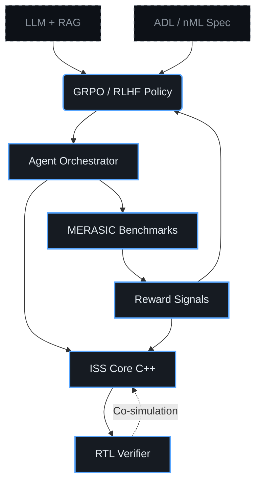

# 🧠 ChipGPT: Эволюционный AI-дизайн процессорных архитектур

<picture>
  <source srcset="/assets/banner.webp" type="image/webp">
  
</picture>

> Автоматизированный переход от базовых коммерческих ядер (VLIW/RISC-V) к сложным GPU/TPU-ускорителям через замкнутый цикл HW/SW ко-эволюции с математически гарантированной корректностью.

[](LICENSE)
[](https://www.python.org/downloads/)
[](https://isocpp.org/)
[](https://thechipgpt.github.io/chipgpt/)


## 1. 🎯 Постановка задачи

Современные LLM отлично генерируют высокоуровневый код, но **фатально ошибаются при синтезе RTL (код чипа на языке Verilog)**. Причина: проектирование чипов — это «домен нулевого допуска» (область с крайне низкой толерантностью к ошибкам). Ошибка в логике или в тактировании чипа означает нерабочий кремний за сотни миллионов долларов, а не дешевый hotfix (как в софте).

ChipGPT решает три фундаментальные проблемы:
1. **Отсутствие автоматического пространства архитектурного поиска.** Типичные ASIP-пайплайны генерации процессорных ядер требуют ручного выбора расширений ISA и микроархитектурных параметров.
2. **Разрыв между HW и SW.** Эволюция ядра бесполезна без синхронной эволюции компилятора, ассемблера и рантайма.
3. **Отсутствие математически обоснованной петли верификации.** Генеративные модели не имеют встроенного механизма мгновенной проверки функциональной корректности.

Мы вводим **эволюционный HW/SW ко-дизайн**, где каждая итерация сопровождается строгим формальным контролем через потактовый симулятор (ISS) и систему само-оценки MERASIC.

📖 *Подробнее:* [Парадигма эволюционного дизайна чипов](#/wiki/evolutionary-paradigm) | [DSE vs Evolution: Сравнительный анализ](#/wiki/dse-vs-evolution)

---

## 2. 📐 Архитектура системы



Система заменяет линейный `Design Space Exploration (DSE)` на **эволюционный цикл с замкнутой петлей верификации**: генерация → симуляция → оценка → отбор → мутация/скрещивание → новая эпоха.

---


## 3. 🧬 Эпохи эволюции процессорных ядер

Эволюция **от VLIW-к-GPU** разбита на 4 качественно различные эпохи. Каждая эпоха подразумевает **синхронную эволюцию трёх слоёв**: архитектуры ядра, ассемблера/ISA, и оптимизирующего компилятора.
Каждая эпоха может состоять из промежуточных мини-эпох.

| Эпоха | Архитектурный сдвиг | Ключевые изменения |
|:------|:-------------------|:-------------------|
| **I** | Basic VLIW | Статический планировщик, фиксированные функциональные блоки, простой регистровый файл |
| **II** | SIMD-VLIW | Векторные расширения, предикатное выполнение, расширенные шины данных |
| **III** | Basic WARP | Динамическое управление потоками, разделяемая память, базовая когерентность |
| **IV** | GPGPU / TPU | Массовый параллелизм, тензорные блоки, аппаратные планировщики warps, HBM-интерфейс |

Переход между эпохами происходит только при достижении порога функциональной корректности `>99.99%` на MERASIC и роста IPC `≥1.8x`.

---

## 4. 📊 MERASIC: Система бенчмарков и само-оценки

**MERASIC** (**M**icroarchitectural **E**valuation & **R**easoning for **A**I **Si**licon **C**o-design) — инфраструктурный слой, превращающий генерацию чипов из вероятностной лотереи в инженерный процесс.

### Почему LLM не справляются с RTL напрямую?
- Не отслеживают параллельные состояния (конвейеры, буферы переупорядочивания)
- Генерируют синтаксически верный, но функционально сломанный код
- Отсутствует встроенный механизм мгновенной проверки

### Как работает MERASIC?
1. **Генерация ISS** → проверка на эталонных тестах → получение математически верного референса.
2. **ISS как Oracle** → используется для верификации сгенерированного Verilog/SystemVerilog.
3. **Метрики оценки:** функциональное покрытие, IPC, энерго-эффективность (оценка), плотность кода, успешность компиляции.
4. **Автоматическая классификация ошибок:** логические, тайминговые, ресурсные, ISA-несоответствия.  
  
MERASIC не просто «тестирует ИИ». Он формирует **reward-сигналы для GRPO** и обеспечивает воспроизводимость результатов.

Мы тестируем связку: **LLM (генератор) → EDA-инструменты (компиляторы) → ISS-модель (судья/референс)**. Вход — текстовая спецификация. Выход — верифицированный RTL, JSON-архитектура + трассировка ризонинга. Модель учится не просто «выдавать код», а принимать инженерные решения и доказывать их корректность через симуляцию.

---

## 5. ⚙️ ISS: Ядро системы эволюции

**ISS (Instruction Set Simulator)** — 100% функциональный эквивалент реального чипа, написанный на C++17. Реализует cycle-accurate симуляцию конвейеров, памяти, шин и механизмов синхронизации.

### Три роли ISS в ChipGPT:
| Роль | Описание |
|:-----|:---------|
| 🎯 **Ground Truth** | Эталонная модель для расчёта reward-функций в GRPO/RLHF |
| 🔍 **Golden Reference** | Математический оракул для сравнения RTL-реализаций (co-simulation) |
| 🔄 **Evolving Core** | Динамически обновляется на каждой эпохе (напр. VLIW → SIMD-VLIW) |

ISS спроектирован как плагин-архитектура: новые ISA, контроллеры памяти и планировщики подключаются через унифицированный API без перекомпиляции ядра симулятора.

---

## 6. 🧱 Базовые процессорные ядра

Эволюция начинается с коммерчески проверенных и академически документированных архитектур:

| Ядро | Тип | Источник | Роль в эволюции |
|:-----|:----|:---------|:----------------|
| `r-VEX` | VLIW | Open-source / HP legacy | Seed для Эпохи I, базовое ядро для эволюции |
| `RV32I_Min` | RISC-V | RISC-V Foundation | Альтернативный старт, фокус на расширяемости ISA |
| `Custom ADL Spec` | nML/ArchDL | ChipGPT DSL | Формальное описание для ADL-Agent |

Базовые ядра содержат полные тулчейны (GCC/LLVM бэкенды, ассемблер, линкер, профилировщик), которые также подлежат эволюционному обновлению.

---

## 7. 🤖 GRPO обучение

Для эмуляции архитектурного мышления модель обучается с использованием **Group Relative Policy Optimization (GRPO)** — варианта RLHF, оптимизированного для дискретных пространств решений с групповой нормализацией reward.

### Что обучается:
| Поток | Цель | Reward-сигнал |
|:------|:------|:--------------|
| `6.1 Compiler` | Автогенерация оптимизирующего бэкенда | Успешность компиляции, размер бинарника, скорость выполнения |
| `6.2 Assembler/ISA` | Генерация мнемоник и форматов инструкций | Покрытие MERASIC, корректность декодирования, совместимость с ADL |
| `6.3 Architecture` | Эволюция микроархитектуры | IPC, латентность конвейера, энерго-оценка, формальная корректность |

Модель непрерывно обогащается новыми архитектурными паттернами с рынка (Tensor Cores, Systolic Arrays, Mesh NoC) через RAG-индекс и формирует проверяемые гипотезы.

---

## 8. 📚 RAG помощники

RAG (Retrieval-Augmented Generation) выполняет роль **контекстной памяти и экспертной системы**, направляющей эволюцию.

### 8.1 RAG как источник контекста
При генерации новой архитектуры LLM запрашивает релевантные паттерны:
- Примеры банковского доступа к регистровым файлам в современных GPU
- Реализации векторных расширений в RISC-V V / ARM SVE
- Паттерны когерентности кэшей и протоколов шин (AXI, TileLink)

### 8.2 RAG как оценщик кода
Параллельный агент использует RAG для статической и семантической проверки:
- Выявление анти-паттернов в Verilog/SystemVerilog
- Проверка соответствия стандартам кодирования и именования
- Сравнение с лучшими практиками из открытых IP-блоков

📖 *Подробнее:* [RAG в эволюционном дизайне: от теории к практике](#/wiki/rag-chip-design)

---

## 9. 🕳️ Агентный подход к генерации

Система разделена на два комплементарных агента, работающих в замкнутом цикле:

| Агент | Технология | Задача | Гарантия |
|:------|:-----------|:--------|:---------|
| **ADL-Agent** | Формальные ADL/nML + CodeGen | Генерация ISS, компилятора, ассемблера из спецификации ISA | 100% семантическая корректность, детерминизм |
| **LLM+EA-Agent** | LLM + Эволюционные Алгоритмы | Поиск оптимальной топологии, параметров кэша, глубины конвейера, политик синхронизации | Креативность, оптимизация в неформализуемых пространствах |

**Взаимодействие:** ADL-Agent создаёт формальный фундамент. LLM+EA-Agent генерирует популяцию архитектурных вариантов. MERASIC оценивает. GRPO обновляет политику. Цикл повторяется до достижения целевых метрик эпохи.

📖 *Подробнее:* [Агентное проектирование процессоров: ADL + LLM + EA](#/wiki/agent-pipeline)

---

## 🚀 Quick Start

```bash
# 1. Клонирование
git clone https://github.com/thechipgpt/chipgpt.git && cd chipgpt

# 2. Зависимости (Python + C++)
pip install -r requirements.txt
./scripts/setup_cxx_deps.sh

# 3. Загрузка базовой модели и весов GRPO
./scripts/download_models.sh

# 4. Запуск первой эпохи эволюции (VLIW → SIMD-VLIW)
python chipgpt/evolve.py --epoch 1 --base-core rvex --benchmarks merasic_v1