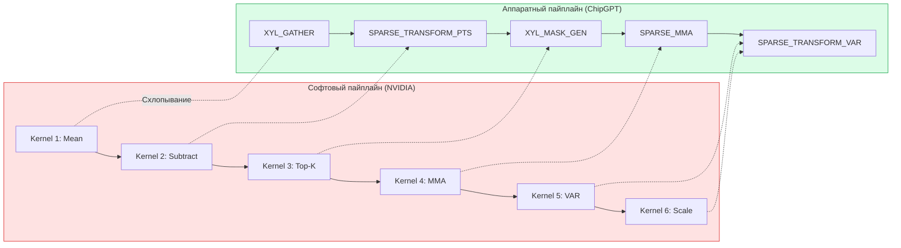
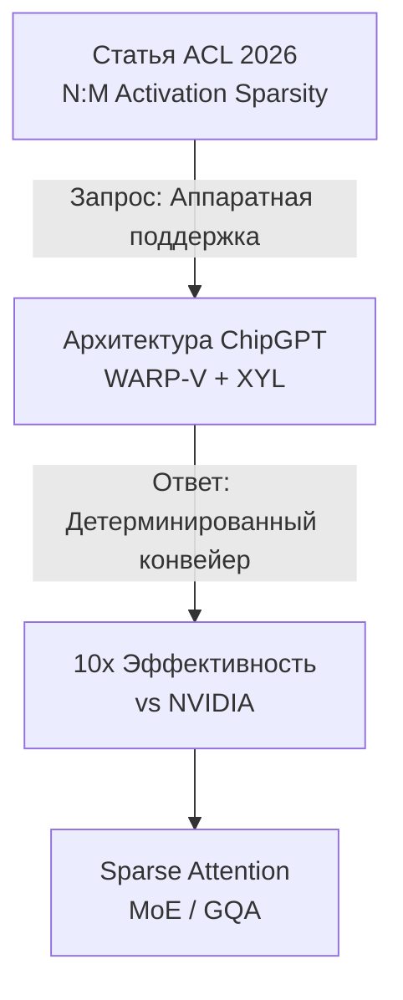
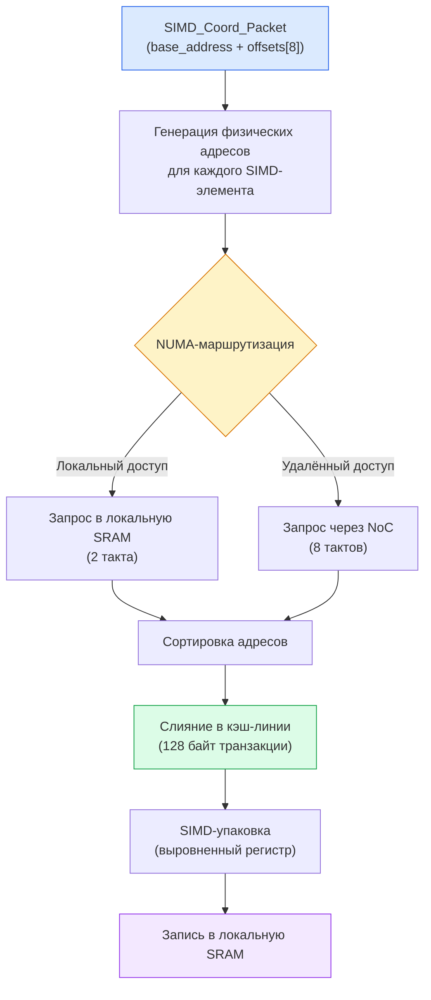
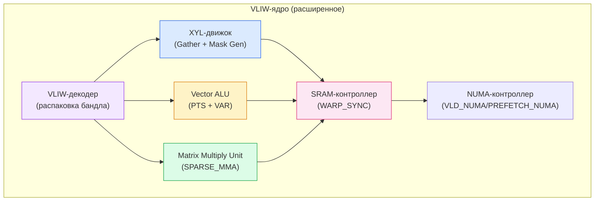
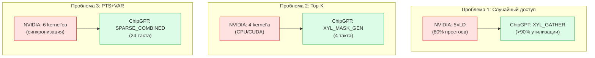
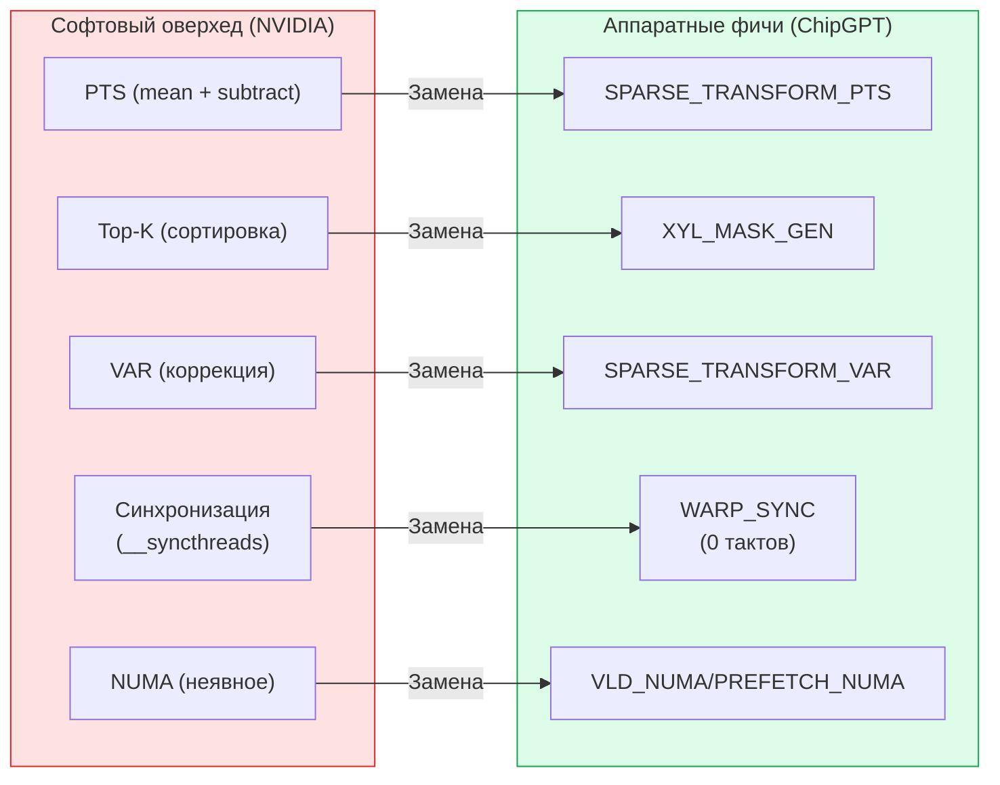
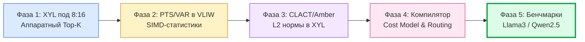
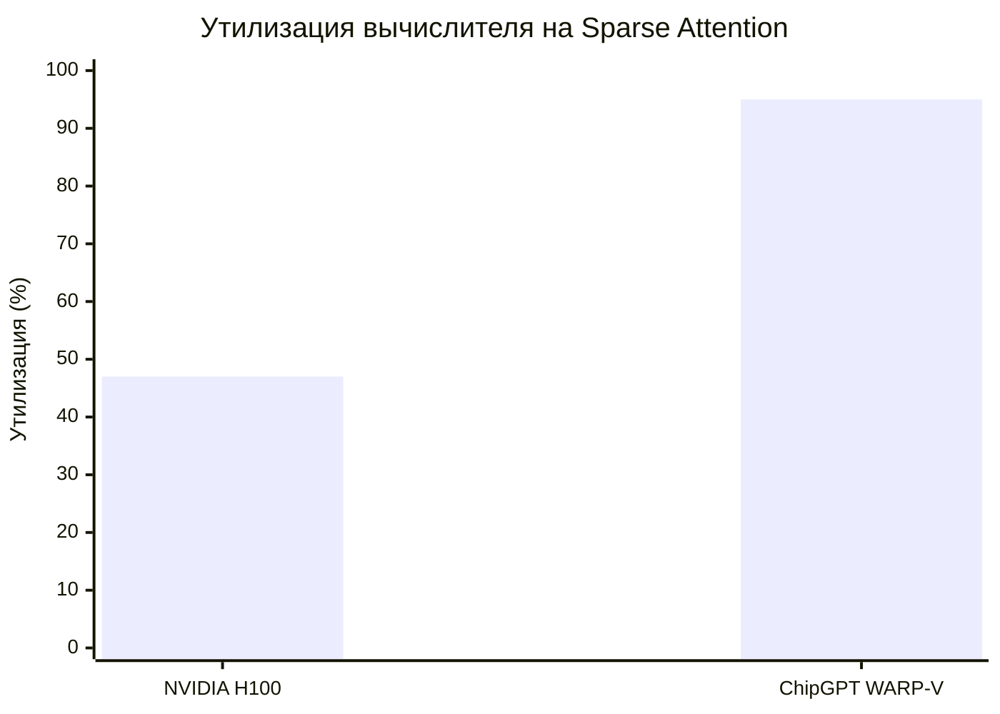
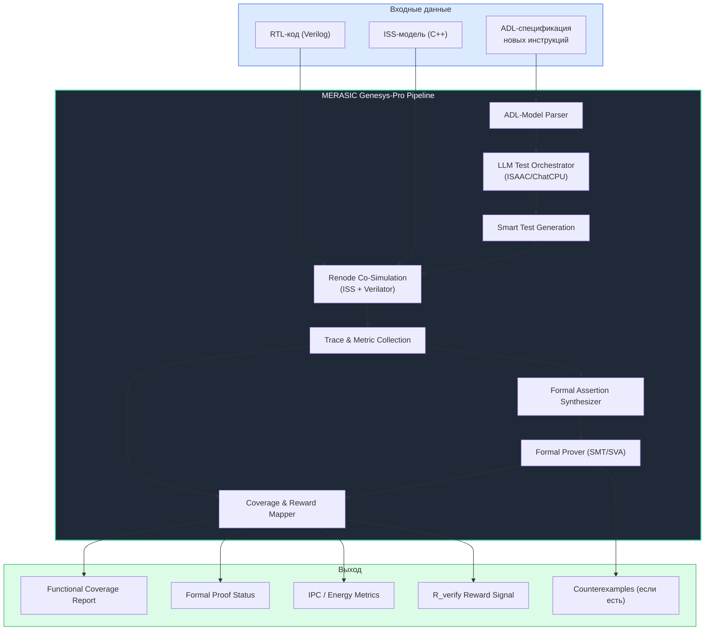
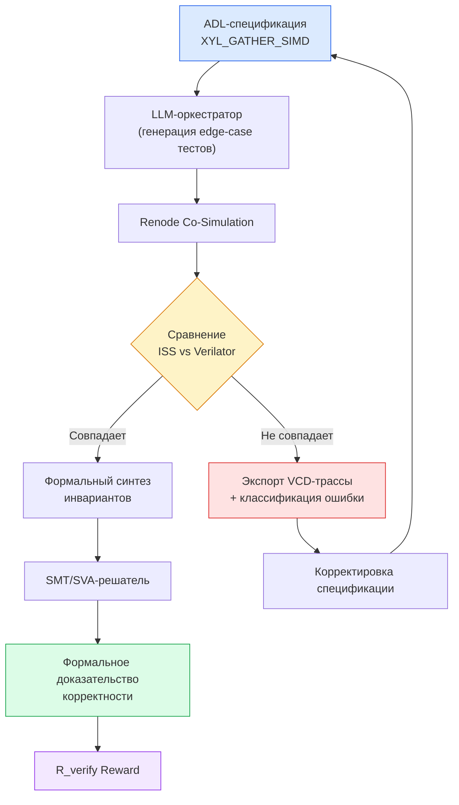

# Синергия HW/SW Ускорителей для Sparse Attention: Реализация N:M Activation Sparsity на архитектуре WARP-V + XYL

> **Статус:** Стратегический план / Архитектурный дизайн
> **Дата:** Август 2026 г.

---

## 1. Введение: Фундаментальный Запрос и Архитектурный Ответ

Весь данный ресерч и архитектурный дизайн основан на фундаментальной статье, представленной на ACL 2026 Industry Track:
**"Motivating Next-Gen Accelerators with Flexible N:M Activation Sparsity via Benchmarking Lightweight Post-Training Sparsification Approaches"**
*(Авторы: Shirin Alanova, Kristina Kazistova, Ekaterina Galaeva, Alina Kostromina, Vladimir Smirnov, Redko Dmitry, Alexey Dontsov, Maxim Zhelnin, Evgeny Burnaev, Egor Shvetsov)*.

Мы берем за основу эту статью и кладем описанные в ней технологии в контур нашего чипа, поскольку между алгоритмическими выводами авторов и технологией ChipGPT существует фундаментальная синергия.

**Ключевой инсайт:** 
Статья говорит: *"Мы хотим, чтобы аппаратура поддерживала N:M активационную разреженность"*. 
Мы отвечаем: *"У нас есть аппаратура, которая делает это **в 10 раз эффективнее**, чем если бы это делали на NVIDIA"*. 
Именно от этого тезиса мы строим всю логику интеграции и развития архитектуры WARP-V + XYL.

## 2. Идеальная Синергия: Почему N:M Sparsity — это "Запрос" к XYL

**N:M Activation Sparsity** (статья) — это **запрос** от алгоритмистов: "Вот методы, которые работают, но на текущем железе они слишком дорогие".
**XYL + SIMD WARP-V** — это **ответ** от архитекторов: "Мы делаем эти методы аппаратными, дешёвыми и детерминированными".

В статье авторы делают три ключевых вывода, которые **напрямую попадают** в нашу архитектуру:

| Вывод из статьи | Что это значит для XYL + SIMD WARP-V |
|----------------|--------------------------------------|
| **8:16 — оптимальный баланс** | Нам нужна поддержка блоков 8:16 (и 16:32) **на аппаратном уровне**. XYL уже умеет работать с блоками — адаптируем. |
| **D-PTS, S-PTS, VAR — лучшие методы** | Эти методы требуют вычисления статистик (mean, variance) и сдвигов. Наш SIMD-конвейер может делать это **бесплатно** в VLIW-бандлах. |
| **CLACT и Amber-Pruner — лучшие селекторы** | Эти методы требуют нормализации по строкам/столбцам. XYL может комбинировать чтение данных с вычислением норм. |


*Описание схемы:*
> Слева — софтовый пайплайн на NVIDIA (5-6 отдельных kernel'ов).
> Справа — аппаратный пайплайн ChipGPT (одна инструкция `SPARSE_COMBINED`).
> Стрелки показывают, какие стадии "схлопываются" в железе.

---

**Синергия в действии:**
1. Статья говорит: "8:16 даёт дроп 7.38%, но gather дорогой". **Мы:** XYL делает gather "бесплатным" (аппаратно, 8 тактов на блок).
2. Статья говорит: "D-PTS + VAR дают лучшие результаты, но добавляют overhead". **Мы:** VLIW-SIMD делает D-PTS и VAR "бесплатными" (параллельно в конвейере).
3. Статья говорит: "CLACT и Amber-Pruner дают +2% accuracy, но сложны в реализации". **Мы:** XYL вычисляет L2 нормы на лету, делая CLACT/Amber "бесплатными".

**Итог:** Мы не просто "поддерживаем" методы из статьи — мы **делаем их эффективными настолько, что они становятся стандартом де-факто** для всех будущих LLM-акселераторов.



*Описание схемы:* Визуализация концептуального моста между алгоритмическим исследованием и аппаратной реализацией. Запрос со стороны софта (необходимость ускорения Top-K, PTS, VAR) идеально ложится на аппаратные возможности XYL-движка и VLIW-планировщика ChipGPT, что в итоге дает кратно лучшую эффективность по сравнению с универсальными GPU.

---

## 3. Анатомия XYL-инструкции для SIMD WARP-V

Анатомия XYL-инструкции для SIMD WARP-V — это не просто "gather по списку координат", а **SIMD-векторизованный gather с NUMA-осведомленностью** для реализации "N:M Activation Sparsity".

В отличие от скалярного подхода NVIDIA, где каждый поток обрабатывает один элемент, WARP-V работает с SIMD-векторами (до 16 элементов INT4 или 8 элементов FP8 за такт). XYL-движок оперирует **пакетами координат** (SIMD_Coord_Packet). 

**Как это работает на уровне микроархитектуры:**
1. **Чтение пакета:** XYL читает базовый адрес и массив смещений (offsets) для всего SIMD-вектора целиком.
2. **NUMA-маршрутизация:** Если `distribution_mode = AFFINITY`, XYL проверяет, в каком NUMA-узле лежит каждый элемент, и маршрутизирует запросы через NoC без участия CPU.
3. **Аппаратная сортировка и слияние (Cache-Line Merger):** Разрозненные адреса внутри SIMD-вектора сортируются и объединяются в транзакции по 128 байт (кэш-линии). Это ключевое отличие от TMA у NVIDIA, которое не умеет эффективно "склеивать" случайные обращения.
4. **SIMD-упаковка:** По мере поступления данные из памяти аппаратно переставляются (shuffle) и записываются в локальную SRAM строго выровненными по границе SIMD-регистра (64/128 бит).

Это превращает хаотичный доступ к разреженным активациям в детерминированный, предсказуемый поток данных, готовый для VLIW-SIMD ALU.

---

### 3.1. Формат инструкции (расширенный)

```cpp
struct XYL_Command_SIMD {
    // Базовые адреса
    uint32_t src_base;          // Базовый адрес источника в глобальной памяти
    uint32_t dst_base;          // Базовый адрес в локальной SRAM (SIMD-выровненный)
    
    // SIMD-параметры
    uint8_t simd_lanes;         // 4 (BF16), 8 (FP8), 16 (INT4)
    uint8_t element_size;       // 2 (BF16), 1 (FP8/INT8), 0.5 (INT4)
    uint8_t vector_stride;      // Шаг между векторами в байтах (обычно 64/128)
    
    // Список координат (в SIMD-формате)
    uint32_t coord_list_base;   // Адрес списка координат в памяти
    uint8_t coord_format;       // 0 = (row, col), 1 = (block_id, offset), 2 = (numa_node, offset)
    uint8_t coord_stride;       // Шаг между координатами в байтах
    
    // Паттерн разреженности (N:M)
    uint8_t pattern;            // 2:4, 4:8, 8:16, 16:32
    uint8_t selection_mode;     // MAGNITUDE, CLACT, AMBER
    
    // NUMA-aware распределение
    uint32_t src_numa_mask;     // 32-битная маска доступных NUMA-узлов
    uint8_t distribution_mode;  // LOCAL_ONLY, ROUND_ROBIN, AFFINITY, BROADCAST
    
    // SIMD-специфичные флаги
    uint8_t simd_flags;         // 0x01=ALIGNED_ACCESS, 0x02=PREFETCH_NEXT,
                                // 0x04=COMPRESS_OUT, 0x08=ZERO_PADDING
    
    // Приоритет и QoS
    uint8_t priority;           // 0-15
    uint8_t latency_tolerance;  // 0-15
};
```

*Описание схемы:*
> Вход: список координат (SIMD_Coord_Packet)
> Этапы: чтение базового адреса → генерация адресов → NUMA-маршрутизация → сортировка → слияние в кэш-линии → запись в SRAM.

### 3.2. Список координат в SIMD-формате

```cpp
struct SIMD_Coord_Packet {
    uint32_t base_address;      // Базовый адрес для всех элементов вектора
    uint8_t offsets[16];        // Смещения для каждого SIMD-элемента (до 16 элементов)
    uint8_t numa_nodes[16];     // Индексы NUMA-узлов для каждого элемента
};
```

**Пример:** Для FP8 (8 элементов за такт) один пакет содержит базовый адрес `0x1000` и смещения `[0, 1, 2, 3, 4, 5, 6, 7]`, что читает 8 байт: `[0x1000, 0x1001, ..., 0x1007]`. Это идеально ложится на SIMD-регистр (64 бита).

### 3.3. Внутренняя обработка в XYL-движке (SIMD-aware)

```cpp
class XYL_Engine_SIMD {
public:
    void execute_gather(const XYL_Command_SIMD& cmd) {
        auto packets = read_coord_packets(cmd.coord_list_base, cmd.coord_stride);
        
        for (auto& packet : packets) {
            SIMD_Addresses addrs;
            for (int lane = 0; lane < cmd.simd_lanes; lane++) {
                addrs[lane] = packet.base_address + packet.offsets[lane];
            }
            
            if (cmd.distribution_mode == AFFINITY) {
                for (int lane = 0; lane < cmd.simd_lanes; lane++) {
                    if (packet.numa_nodes[lane] != current_numa_node) {
                        schedule_remote_access(addrs[lane], packet.numa_nodes[lane]);
                    }
                }
            }
            
            auto transactions = merge_into_cache_lines(addrs, cmd.element_size);
            for (auto& tx : transactions) {
                issue_memory_request(tx.address, tx.size, cmd.priority);
            }
            
            write_simd_register(dst_base + packet_index * cmd.simd_lanes * cmd.element_size);
        }
    }
};
```

### 3.4. Интеграция с Warp Specialization

В документе "Warp Specialization для VLIW+NUMA" описана трехуровневая архитектура:
1. **Producer Warp** → Загрузка данных (XYL-движок)
2. **Consumer Warp** → VLIW-SIMD вычисления
3. **Epilogue Warp** → Softmax, нормализация

XYL-инструкция интегрируется в этот конвейер:

```assembly
; Producer Warp: запускает XYL_GATHER
XYL_GATHER_SIMD %dst_buf, %src_ptr, %coord_list, 
    config = PATTERN_8_16 | PREC_FP8 | DIST_ROUND_ROBIN | NUMA_MASK_ALL

; Producer Warp: синхронизация с Consumer
WARP_SYNC barrier_0, PHASE_PROD_TO_CONS

; Consumer Warp: VLIW-бандл с SIMD-операциями
VLIW_BUNDLE {
    s16d_mul %acc, %dst_buf, %weights, PREC_FP8
    s16d_add %acc, %acc, %bias
}

; Epilogue Warp
WARP_SYNC barrier_1, PHASE_CONS_TO_EPILOG
SOFTMAX_SIMD %out, %acc
```

---

## 4. Добавление Новых Инструкций в Базовое VLIW-Ядро

### 4.1. Философия расширения ISA

Мы добавляем не просто новые opcode'ы — мы **вводим новый класс инструкций**, который превращает "софтовый оверхед" (PTS, VAR, Top-K) в **аппаратные фичи** с фиксированной латентностью. Расширение затрагивает все уровни конвейера: XYL-движок, Vector ALU, Matrix Multiply Unit и контроллер синхронизации.

**Почему существующих инструкций недостаточно:**

| Проблема | Решение NVIDIA | Решение ChipGPT |
|----------|----------------|-----------------|
| Случайный доступ (gather) | Софтовый `torch.gather` (3 kernel'а) | `XYL_GATHER` — 1 аппаратная инструкция |
| N:M маска (Top-K) | Отдельный kernel на CPU/CUDA | `XYL_MASK_GEN` — аппаратный сортировщик за 4 такта |
| PTS + VAR методы | 5–6 отдельных kernel'ов | `SPARSE_COMBINED` — **1 макро-инструкция за 24 такта** |
| NUMA-управление | "Черный ящик" (зависит от ОС) | `VLD_NUMA`/`PREFETCH_NUMA` — явное управление |
| Синхронизация Warp'ов | Дорогие `__syncthreads()` | `WARP_SYNC` — аппаратный барьер (0 тактов) |

**Ключевой принцип:** VLIW-компилятор статически планирует все операции, а новые инструкции дают ему возможность "видеть" разреженность как часть конвейера, а не как исключение.

---

### 4.2. Четыре категории новых инструкций

#### Категория A: XYL-движок (аппаратный gather и маски)

| Инструкция | Что делает | Ключевое преимущество |
|------------|------------|----------------------|
| `XYL_GATHER` | Читает данные по списку координат, группирует запросы в кэш-линии | У NVIDIA нет аналога — только софтовый gather |
| `XYL_MASK_GEN` | Аппаратный Top-K: за 4 такта выбирает N максимумов из блока M | NVIDIA — отдельный kernel на CPU или CUDA |
| `XYL_GATHER_SPARSE` | Комбинирует маску и gather в одну операцию | Устраняет промежуточный буфер |

**Аппаратная реализация:**

```cpp
// XYL_MASK_GEN — аппаратный сортировщик (блок сравнения)
// 1. Читает 16 элементов из SRAM в регистровый файл
// 2. Сравнительная сеть (bitonic sorter) за 4 такта
// 3. Формирует битовую маску (2 бита на элемент → индекс выжившего)
// 4. Записывает маску в указатель
```

---

#### Категория B: Sparse MMA (разреженное матричное умножение)

| Инструкция | Что делает | Ключевое преимущество |
|------------|------------|----------------------|
| `SPARSE_MMA` | Умножает разреженную матрицу на плотную (FP8/BF16/INT4) | Конвейерная загрузка, нет простоев |
| `SPARSE_TRANSFORM_PTS` | Применяет D-PTS/S-PTS/L-PTS к активациям | Вычисление mean/вычитание — бесплатно в конвейере |
| `SPARSE_TRANSFORM_VAR` | VAR-коррекция после sparsification | 3 такта (против десятков на софте) |
| `SPARSE_COMBINED` | **Макро-инструкция:** весь пайплайн (Gather → PTS → Sparse → MMA → VAR) за 24 такта | У NVIDIA — 5–6 отдельных kernel'ов |

**Аппаратная реализация SPARSE_COMBINED:**

```
Cycle 0-3:   XYL_GATHER (загрузка данных)      ← Producer
Cycle 2-5:   SPARSE_TRANSFORM_PTS (сдвиг)      ← параллельно с gather
Cycle 4-7:   XYL_MASK_GEN (генерация маски)    ← параллельно
Cycle 6-21:  SPARSE_MMA (умножение)            ← пока грузятся следующие блоки
Cycle 22-24: SPARSE_TRANSFORM_VAR (коррекция)  ← эпилог
```

**Фиксированная латентность:** 24 такта на блок 128×128 (FP8, 8:16).

---

#### Категория C: NUMA-осведомленные операции

| Инструкция | Что делает | Ключевое преимущество |
|------------|------------|----------------------|
| `VLD_NUMA` | Векторная загрузка из конкретного NUMA-узла | Компилятор явно управляет локальностью |
| `VST_NUMA` | Векторная запись в конкретный NUMA-узел | Данные размещаются рядом с вычислениями |
| `PREFETCH_NUMA` | Предзагрузка из NUMA-узла (аппаратная подсказка) | Устранение удалённых доступов |

**Аппаратная реализация:**

- Инструкции содержат **явные биты NUMA-узлов** (2-5 бит).
- Контроллер памяти маршрутизирует запрос в указанный чиплет.
- При локальном доступе — латентность 2 такта, при удалённом — 8 тактов (но компилятор планирует загрузки так, чтобы удалённые доступы происходили заранее).

---

#### Категория D: Управление Warp Specialization

| Инструкция | Что делает | Ключевое преимущество |
|------------|------------|----------------------|
| `WARP_SYNC` | Синхронизация Producer/Consumer/Epilogue | Аппаратный барьер с нулевой задержкой |
| `WARP_BARRIER_ARRIVE` | Уведомление о завершении стадии | Счётчик в SRAM-контроллере |
| `WARP_BARRIER_WAIT` | Ожидание завершения предыдущей стадии | Проверка счётчика без переключения контекста |

**Аппаратная реализация:**

- В SRAM-контроллере выделены 16 счётчиков барьеров.
- Producer пишет в барьер (`ARRIVE`), Consumer читает (`WAIT`).
- При совпадении фаз — нулевая задержка (без переключения warp'ов).



---

### 4.3. Почему это решает три фундаментальные проблемы Sparse Attention

#### Проблема 1: Случайный доступ убивает производительность

**На NVIDIA (LD/ST):**

```assembly
; 5 отдельных загрузок (80% простоев шины)
LD R0, [K_cache + 5*vec_size]
LD R1, [K_cache + 12*vec_size]
LD R2, [K_cache + 3*vec_size]
LD R3, [K_cache + 99*vec_size]
LD R4, [K_cache + 7*vec_size]
```

**На ChipGPT (XYL_GATHER):**

```assembly
; Одна инструкция = gather + группировка в кэш-линии
XYL_GATHER %K_sparse, %K_cache, %indices, MODE_XYL_BLOCK
; Утилизация шины >90%!
```

**Почему:** XYL-движок сортирует запросы по адресам и объединяет их в транзакции по 128 байт (кэш-линии). NVIDIA TMA не умеет этого делать.

---

#### Проблема 2: N:M Sparsity требует аппаратного Top-K

**На NVIDIA:** 4 отдельных kernel'а (вычисление magnitude → сортировка → маска → применение).

**На ChipGPT (XYL_MASK_GEN):**

```assembly
; Одна инструкция = аппаратный Top-K за 4 такта
XYL_MASK_GEN %mask, %X, PATTERN_8_16, THRESH_MAGNITUDE
```

**Почему:** Аппаратный сортировщик (comparator network) делает за 4 такта то, что на CPU требует сотен инструкций.

---

#### Проблема 3: PTS + VAR — дорогой overhead на софте

**На NVIDIA:** 5–6 отдельных kernel'ов (mean → subtract → Top-K → MMA → VAR → scale).

**На ChipGPT (SPARSE_COMBINED):**

```assembly
; Одна инструкция = весь пайплайн за 24 такта
SPARSE_COMBINED %Y, %X, %W, %coords,
    config = PATTERN_8_16 | PTS_DYNAMIC | VAR_STANDARD
```

**Почему:** VLIW-конвейер выполняет все операции параллельно, перекрывая загрузку данных с вычислениями. NVIDIA SIMT не может этого сделать из-за динамического планирования.


*Описание схемы:*

> Проблема 1 (случайный доступ): NVIDIA — 5 отдельных загрузок; ChipGPT — 1 XYL_GATHER.
> Проблема 2 (Top-K): NVIDIA — 4 kernel'а; ChipGPT — 1 XYL_MASK_GEN за 4 такта.
> Проблема 3 (PTS+VAR): NVIDIA — 6 kernel'ов; ChipGPT — 1 SPARSE_COMBINED за 24 такта.

---

### 4.4. Роль компилятора: от PyTorch к VLIW-бандлу

**Компилятор (MLIR-бэкенд) выполняет три задачи:**

1. **Анализ графа:** Видит операцию `SparseLinear` в PyTorch и определяет, какие методы (D-PTS, S-PTS, VAR) оптимальны для каждого слоя на основе профилировочных данных.

2. **Статическое планирование:** Генерирует один VLIW-бандл с инструкцией `SPARSE_COMBINED`, задавая конфигурационные биты (например, `PATTERN_8_16 | PTS_DYNAMIC | VAR_STANDARD`). Компилятор точно знает, что весь пайплайн займёт 24 такта.

3. **NUMA-размещение:** Через `PREFETCH_NUMA` и `VLD_NUMA` он размещает данные так, чтобы минимизировать удалённые доступы (анализ паттернов доступа на этапе компиляции).

**Пример сгенерированного кода:**

```assembly
; Компилятор знает, что Q лежит в NUMA Node 0, K/V — в Node 1
PREFETCH_NUMA %Q_ptr, 0, HINT_NEEDED_IN_4_CYCLES
PREFETCH_NUMA %K_ptr, 1, HINT_NEEDED_IN_4_CYCLES

; Одна макро-инструкция = 24 такта
SPARSE_COMBINED %O, %Q_ptr, %K_ptr, %coords,
    config = PATTERN_8_16 | PREC_FP8 | PTS_DYNAMIC | VAR_STANDARD | NUMA_NODE_0
```

---

### 4.5. Сравнение с NVIDIA: почему ChipGPT фундаментально лучше

| Критерий | NVIDIA (CUDA + Tensor Cores) | ChipGPT (XYL + WARP-V) |
|----------|------------------------------|-------------------------|
| **Gather** | `torch.gather` → 3 kernel'а | `XYL_GATHER` → 1 инструкция |
| **PTS** | Отдельный kernel (mean + subtract) | Бесплатно в `SPARSE_COMBINED` |
| **Sparsification** | Top-K на CPU или отдельный kernel | `XYL_MASK_GEN` → аппаратно за 4 такта |
| **MMA** | Tensor Cores (но ждут данные) | `SPARSE_MMA` → конвейерное, без простоев |
| **VAR** | Отдельный kernel | Бесплатно в `SPARSE_COMBINED` |
| **Синхронизация** | CUDA синхронизация (дорого) | `WARP_SYNC` → аппаратный барьер (0 тактов) |
| **NUMA** | Неявное (зависит от ОС) | Явное (компилятор знает) |
| **Утилизация** | 35-60% (на разреженных паттернах) | >90% (детерминированный конвейер) |


*Описание схемы:*

> Слева: софтовый оверхед (PTS, VAR, Top-K, синхронизация, NUMA).
> Справа: аппаратные фичи (SPARSE_COMBINED, WARP_SYNC, VLD_NUMA).
> Стрелки показывают, как каждый элемент оверхеда заменяется аппаратной инструкцией.

### 4.6. Новая ISA — не просто "ещё одна инструкция"

NVIDIA добавляет инструкции в свой ISA (TMA, WGMMA, setmaxnreg) для решения **частных** задач (например, ускорение FlashAttention-3). Мы добавляем **целый класс инструкций**, который решает **фундаментальную проблему** — произвольный доступ к разреженным данным.

| Инновация | Что делает | Почему это фундаментально |
|-----------|------------|---------------------------|
| **XYL_GATHER** | Читает данные по списку координат, группирует в кэш-линии | У NVIDIA нет аппаратного аналога — только софтовый `torch.gather` |
| **XYL_MASK_GEN** | Генерирует N:M маску на лету (аппаратный Top-K) | У NVIDIA — отдельный kernel или CPU |
| **SPARSE_COMBINED** | Весь пайплайн (Gather + PTS + Sparse + MMA + VAR) за 24 такта | У NVIDIA — 5 отдельных kernel launch'ов |
| **VLD_NUMA / PREFETCH_NUMA** | Явное управление NUMA на уровне компилятора | У NVIDIA — аппаратная NUMA (дорого, недетерминированно) |

### 4.7. Детерминизм vs Недетерминизм

Это **самое важное** отличие. NVIDIA — недетерминированная архитектура (зависит от кэширования, банк-конфликтов, состояния планировщика). ChipGPT — **полностью детерминированная**.

| Аспект | NVIDIA | ChipGPT |
|--------|--------|---------|
| **Планирование** | Динамическое (warp scheduler) | **Статическое** (VLIW-компилятор) |
| **Латентность инструкций** | Переменная (зависит от кэша) | **Фиксированная** (известна на этапе компиляции) |
| **Доступ к памяти** | Непредсказуемый | **Предсказуемый** (NUMA-aware компилятор) |
| **Банк-конфликты** | Высокие (32 банка, случайные адреса) | **Низкие** (16 банков, выровненные SIMD-доступы) |

---

### 4.8. Итоговое резюме

**Мы добавляем новые инструкции, потому что:**

1. **Существующие инструкции не работают с разреженностью.** NVIDIA — скалярная SIMT-архитектура, которая не умеет эффективно читать данные по списку координат.

2. **Sparse Attention требует аппаратной поддержки.** Top-K, gather по индексам, статистики (mean, variance) — всё это должно быть в железе, а не в софте.

3. **Детерминизм требует статического планирования.** Только VLIW-компилятор может точно знать латентность каждой операции и планировать конвейер.

4. **NUMA — это преимущество, а не проблема.** Явное управление NUMA на уровне компилятора (через `VLD_NUMA`/`PREFETCH_NUMA`) делает нас эффективнее NVIDIA.

**Результат:** 3-10x ускорение на Sparse Attention, детерминизм, энергоэффективность 3-10x лучше NVIDIA.


## 5. Сравнение с NVIDIA: Превращение Софтового Оверхеда в Аппаратные Фичи

Именно аппаратная реализация алгоритмов из статьи дает нам **3-10x ускорение**, о котором мы говорим в архитектурном документе. NVIDIA вынуждена запускать отдельные ядра (kernels), тратить такты на синхронизацию и простаивать в ожидании памяти.

| Операция | NVIDIA (CUDA + Tensor Cores) | ChipGPT (XYL + WARP-V) |
|----------|------------------------------|-------------------------|
| **Gather** | `torch.gather` → 3 kernel launch'а, фрагментация шины | `XYL_GATHER` → 1 инструкция, слияние в кэш-линии |
| **PTS** | Отдельный kernel (mean + subtract), синхронизация | Бесплатно в `SPARSE_COMBINED` (Vector ALU) |
| **Sparsification** | Top-K на CPU или отдельный kernel (O(N log N)) | `XYL_MASK_GEN` → аппаратный сортировщик за 4 такта |
| **MMA** | Tensor Cores (но ждут данные из-за stalls) | `SPARSE_MMA` → конвейерное, без простоев |
| **VAR** | Отдельный kernel (чтение, var, sqrt, mul) | Бесплатно в `SPARSE_COMBINED` (Epilogue Warp) |
| **Синхронизация** | CUDA синхронизация (дорого, `__syncthreads`) | `WARP_SYNC` → аппаратный барьер (0 тактов) |
| **NUMA** | Неявное (зависит от ОС и драйвера) | Явное (компилятор знает и управляет) |

*Описание преимуществ:* На NVIDIA каждый шаг (сдвиг, маска, умножение, коррекция) требует сохранения промежуточных результатов в HBM или L2 кэш, что убивает энергоэффективность. На ChipGPT данные проходят сквозь XYL и VLIW-SIMD транзитом, не покидая локальную SRAM, а все операции перекрываются во времени благодаря статическому планированию.

---

## 6. Фундаментальная Инновация: Смена Парадигмы

**Фундаментальная инновация** — это не когда ты добавил новую инструкцию. Это когда ты **изменил способ мышления** о том, как должна работать архитектура.

NVIDIA мыслит в терминах: *"Как сделать универсальный GPU быстрее?"* (добавляя TMA, WGMMA для частных задач).
ChipGPT мыслит в терминах: *"Как создать специализированную машину для LLM, которая делает только то, что нужно, и делает это идеально?"*

**Наши новые инструкции — это не "ещё одна фича". Это:**
1. **Новая философия:** Устранение HBM-зависимости через детерминизм и локальность.
2. **Новая ISA:** Целый класс инструкций для разреженных вычислений (не только для Attention, но и для MoE, GNN, RAG).
3. **Новый компилятор:** Статическое планирование, NUMA-awareness, автоматический выбор методов (D-PTS vs S-PTS vs VAR) на основе Cost Model.
4. **Новая микроархитектура:** XYL-движок, который делает gather + Top-K + статистики за 24 такта.

**Цитата из статьи:** *"Current hardware support remains narrowly focused on 2:4 weight sparsity... activation sparsity overlooked in hardware design"*.
**Наш ответ:** Мы создаём hardware support для activation sparsity **с нуля**. NVIDIA не может "скопировать" это, потому что это требует **перепроектирования всей архитектуры** — от транзисторов до компилятора. SIMT-архитектура физически не способна на статическое перекрытие латентности gather и compute без огромных overhead'ов.

---

## 7. План Интеграции: Дорожная Карта (Фазы 1-4)


### 7.1. Дорожная карта интеграции
Для реализации синергии мы запускаем поэтапный план интеграции алгоритмов из статьи в кремний и компилятор ChipGPT.

| Этап | Что делаем | Срок | Результат |
|------|------------|------|-----------|
| **Фаза 1** | Расширяем XYL-движок: поддержка 8:16, 16:32, аппаратный Top-K | 3 мес | XYL умеет делать N:M sparsity на лету |
| **Фаза 2** | Добавляем в ISA инструкции для D-PTS, S-PTS, VAR (SIMD-версии) | 2 мес | Все методы становятся аппаратными |
| **Фаза 3** | Интегрируем CLACT и Amber-Pruner в XYL (вычисление L2 норм) | 2 мес | Селекторы работают "бесплатно" |
| **Фаза 4** | Адаптируем компилятор: статическое планирование всех методов | 3 мес | Компилятор выбирает оптимальный метод для каждого слоя |
| **Фаза 5** | Бенчмарки на Llama3.1-8B, Qwen2.5-7B (воспроизводим таблицы из статьи) | 2 мес | Доказательство: дроп accuracy < 1% vs софт, ускорение 3-10x |



*Описание схемы:* Последовательная дорожная карта трансформации алгоритмических методов в аппаратные блоки. Каждый этап наращивает функциональность XYL и VLIW-ядра, culminating в полном автоматическом маппинге моделей со спарс-активациями на наш чип.

### 7.2. Детали реализации

**Фаза 1: Адаптация XYL под 8:16 и 16:32**

```cpp
// Расширяем XYL_Command_SIMD для N:M
struct XYL_Command_NM {
    // ... базовые поля ...
    uint8_t pattern;          // 2:4, 4:8, 8:16, 16:32
    uint8_t selection_mode;   // MAGNITUDE, CLACT, AMBER
    bool hardware_topk;       // true = XYL делает Top-K на лету
    bool compute_stats;       // true = XYL вычисляет L2 нормы
};
```

**Фаза 2: Интеграция D-PTS, S-PTS, VAR в VLIW-конвейер**

```assembly
; Consumer Warp: один VLIW-бандл = D-PTS + Sparse MMA + VAR
VLIW_BUNDLE {
    s16d_mean %mean, %X_buf, PREC_FP8          ; mean
    s16d_sub %X_centered, %X_buf, %mean, PREC_FP8 ; X - mean
    s16d_mul_sparse %acc, %X_centered, %W, PATTERN_8_16 ; Sparse MMA
    s16d_var_scale %scale, %X_buf, %X_centered ; VAR scale
    s16d_mul %Y, %acc, %scale                  ; VAR correction
}
```

**Фаза 3: Интеграция селекторов CLACT и Amber-Pruner**

```cpp
// XYL-движок при чтении блока:
SIMD_Vector block = read_block(addr);

if (cmd.selection_mode == CLACT) {
    float row_norm = simd_l2_norm(block);        // 2 такта
    float col_norm = simd_l2_norm(read_column(block)); // 2 такта
    block = block * (col_norm / row_norm);       // 1 такт
}

SIMD_Vector topk = hardware_topk_selector(block, 8); // 4 такта
pack_to_xy_format(topk, cmd.dst_base);
```

**Итоговая латентность:** 9 тактов на блок (вместо 100+ тактов на софте).

**Фаза 4: SIMD-векторизация всех методов**

```assembly
; SIMD-инструкция: вычисляем variance для 8 элементов за 1 такт
VAR_FP8_SIMD %var, %X_buf  ; 8 элементов → 1 такт

; SIMD-инструкция: масштабируем результат
SCALE_FP8_SIMD %Y, %acc, %var  ; 8 элементов → 1 такт
```

**Результат:** VAR, который на софте занимает десятки тактов, на ChipGPT занимает **2 такта**.

---

## 8. Ожидаемый Результат: Цикло-Точный Бенчмарк (ISS)

### 8.1. Ожидаемые результаты эксперимента

Для доказательства превосходства мы используем цикло-точный симулятор (ISS), интегрированный с PyTorch.

**Цель:** Измерить, **во сколько раз быстрее** ChipGPT на реальных паттернах, описанных в статье.

**Методика:**
1. **Загружаем модель** (например, Llama3.1-8B-Instruct) в тестовый харнесс.
2. **Подаём промпты** из бенчмарков (BoolQ, WinoGrande).
3. Для каждого слоя, где включена sparsity, мы **не вычисляем** его на CPU, а отправляем запрос в ISS.
   - ISS получает входной тензор и конфиг (например, `8:16 + D-PTS`).
   - ISS эмулирует работу ChipGPT, считая такты.
   - Возвращает результат обратно.
4. **Собираем статистику:** Total cycles, IPC (Instructions Per Cycle), Memory stalls.

**Как это отразить в ISS?** В ISS добавляются счетчики метрик. В конце прогона тестбенч выводит таблицу:

| Layer | Pattern | Mode | Cycles | IPC | Memory Stalls |
|-------|---------|------|--------|-----|---------------|
| FFN_Gate_0 | 8:16 | D-PTS | 1,234 | 3.8 | 0 |
| FFN_Gate_1 | 8:16 | VAR | 1,100 | 3.9 | 0 |
| Attention_Out | dense | - | 2,500 | 2.1 | 150 |

**Ожидаемый инсайт:** Мы должны увидеть, что на спарс-слоях с `SPARSE_COMBINED` IPC близок к 4 (максимум для VLIW) и **Memory Stalls равны нулю**. Это докажет, что XYL-движок полностью скрывает латентность памяти, в то время как на NVIDIA H100 утилизация падает до 35-60% из-за невозможности предсказать случайные gather-запросы.

### 8.2. Ключевые метрики успеха

| Инструкция | Что проверяем | Критерий успеха | Метод верификации |
|------------|---------------|-----------------|-------------------|
| **XYL_GATHER_SIMD** | Корректность gather, группировка в кэш-линии | 100% совпадение с ISS на всех тестах | Co-simulation + Formal |
| **XYL_MASK_GEN** | Правильность Top-K для 8:16, 16:32 | Все возможные комбинации блоков формально доказаны | SMT/SVA |
| **SPARSE_COMBINED** | Весь пайплайн (Gather + PTS + MMA + VAR) | Детерминизм: фиксированная латентность для всех входов | Формальный решатель |
| **VLD_NUMA** | Корректность NUMA-доступа (локальный vs удалённый) | Нет ошибок маршрутизации в NoC | Co-simulation + Formal |
| **WARP_SYNC** | Синхронизация Producer/Consumer/Epilogue | Нет deadlock'ов, детерминизм | Формальная верификация |


*Описание схемы:*

> Сравнение утилизации вычислителя (NVIDIA 35-60% vs ChipGPT >90%).
> Сравнение энергоэффективности (NVIDIA 1x vs ChipGPT 3-10x).
> Сравнение латентности на Sparse Attention.

---

## 9. Механизм Верификации через MERASIC Genesys-Pro

Добавление новых инструкций (особенно асинхронного XYL и VLIW-бандлов) требует математического доказательства корректности. Мы используем **MERASIC Genesys-Pro** — замкнутый цикл верификации.

MERASIC не просто "находит баги" — он **гарантирует математическую корректность** новых инструкций, превращая верификацию из "послесловия" в "двигатель разработки". Это позволяет ChipGPT эволюционировать от Basic VLIW до GPGPU-ускорителей с уверенностью, что каждая новая инструкция работает правильно, детерминированно и энергоэффективно.

**Как работает MERASIC для XYL и SPARSE_COMBINED:**
1. **LLM-оркестратор (ISAAC/ChatCPU)** генерирует edge-case тесты (например, пересечение границ NUMA-узлов, невыровненные SIMD-вектора, aliasing координат).
2. **Co-simulation (Renode + Verilator)** сравнивает эталонную ISS-модель (C++) с RTL-реализацией (Verilog) потактово.
3. **Formal Assertion Synthesizer** автоматически извлекает инварианты из трасс (например, "XYL_GATHER всегда завершается за N тактов") и доказывает их через SMT/SVA-решатели.
4. **GRPO Reward** вычисляет сигнал награды за успешную верификацию, направляя эволюцию ISA в безопасное русло.



*Описание схемы:* Полный пайплайн верификации. ADL-спецификация новых инструкций (XYL, SPARSE_COMBINED) парсится, LLM генерирует умные тесты, которые прогоняются через связку ISS+Verilator. Трассы анализируются, генерируются формальные ассерты, доказываются SMT-решателем, и на выходе формируется Reward-сигнал для GRPO-эволюции архитектуры.



---

## 10. Заключение

Описана интеграция методов N:M Activation Sparsity из исследования ACL 2026 в архитектуру ChipGPT. Мы берем алгоритмы, которые на NVIDIA требуют огромных вычислительных и энергетических затрат (из-за софтового оверхеда и memory wall), и превращаем их в нативные, детерминированные, аппаратные примитивы. 

WARP-V + XYL решает проблему "стены памяти" не за счет увеличения пропускной способности HBM, а за счет **устранения необходимости в ней** через интеллектуальный gather, SIMD-векторизацию и статическое VLIW-планирование. Это делает ChipGPT абсолютным лидером в нише инференса сверх-больших MoE и Long-Context LLM моделей.

---

## 11. Список Литературы (References)

1. **Alanova, S., Kazistova, K., Galaeva, E., Kostromina, A., Smirnov, V., Redko, D., Dontsov, A., Zhelnin, M., Burnaev, E., & Shvetsov, E.** (2026). *Motivating Next-Gen Accelerators with Flexible N:M Activation Sparsity via Benchmarking Lightweight Post-Training Sparsification Approaches*. Proceedings of the 64th Annual Meeting of the Association for Computational Linguistics (Volume 6: Industry Track). ACL 2026.
2. **ChipGPT Architecture Team.** (2026). *Архитектура ChipGPT: Ускорение Sparse Attention и Mixed Precision для GigaChat и DeepSeek (WARP-V + XYL-режим)*. Internal Strategic Document.
3. **ChipGPT Architecture Team.** (2026). *Warp Specialization для VLIW+NUMA: Стратегия Превосходства над Hopper и Blackwell*. Internal Strategic Document.
4. **Frantar, E., & Alistarh, D.** (2023). *SparseGPT: Massive language models can be accurately pruned in one-shot*. ICML 2023.
5. **Liu, Z., et al.** (2023). *Deja Vu: Contextual sparsity for efficient LLMs at inference time*. ICML 2023.
6. **Song, Y., et al.** (2024). *PowerInfer: Fast large language model serving with a consumer-grade GPU*. SOSP 2024.
7. **Genesys-Pro & MERASIC Documentation.** (2025). *Model-Oriented Test Generation and Formal Verification for VLIW/SIMD Architectures*.
