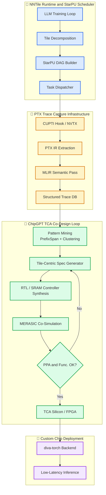

# 🧱 NNTile Инфраструктура сбора трасс и Tile-Centric Архитектура для кастомных чипов

> **Статус**: PRD | **Модуль**: Diva-NNtile | **Обновлено**: 2026-07-17

Инфраструктура **NNTile** в экосистеме ChipGPT выступает не просто как ML-фреймворк для обучения больших моделей, а как **катализатор аппаратного ко-дизайна**. Разбивая гигантские тензоры на управляемые блоки (тайлы) и распределяя их через асинхронный планировщик StarPU, NNTile генерирует детализированные трассы выполнения, которые раскрывают истинные паттерны вычислительной нагрузки. Эти трассы становятся фундаментом для проектирования нового поколения **Tile-Centric Accelerators (TCA)** — специализированных чипов, способных преодолеть «стену памяти» и обеспечить беспрецедентную энергоэффективность.

## 🌊 1. Tile-Centric Accelerators: Прорыв за ограничения «стены памяти»

Традиционные GPU оптимизированы под массовый параллелизм и универсальность, но их архитектура упирается в физический лимит пропускной способности памяти. **Тайловый подход** предлагает элегантное архитектурное решение: разбиение данных на небольшие блоки, обработка которых происходит локально, минимизируя дорогие обращения к глобальной памяти (DRAM/HBM).

### 🔑 Почему это идеально подходит для кастомных чипов?
Здесь скрывается главная стратегическая ценность тайлового подхода. Если вы проектируете специализированный чип, вы не ограничены обратной совместимостью, как производители универсальных GPU. Вы можете спроектировать аппаратную архитектуру, которая будет максимально эффективна именно для работы с тайлами.

Это подтверждается несколькими ключевыми трендами:
1. **Тайл-центричные акселераторы (Tile-Centric Accelerators):** Уже существуют коммерческие продукты, такие как `Graphcore IPU` и `Cerebras WSE`, которые строятся вокруг этой идеи. Они используют огромное количество вычислительных ядер, каждое со своей локальной, быстрой памятью (SRAM), что позволяет обрабатывать тайлы с минимальными задержками.
2. **Аппаратная поддержка на уровне инструкций:** Крупные производители уже встраивают тайловые операции в свои чипы. Например, `Intel AMX` (Advanced Matrix Extensions) — это встроенный ускоритель в процессорах Xeon, который работает с 2D-регистровыми файлами, являющимися по своей сути тайлами.
3. **Автоматизация проектирования:** Появляются фреймворки, которые автоматизируют развертывание операций с тайлами (особенно GEMM) на таких акселераторах. Проект `Design in Tiles (DiT)` показывает, что автоматически сгенерированный код может быть в `1.2–2.0 раза` быстрее экспертно настроенных библиотек от NVIDIA. Подход не только эффективен, но и технологически зрел для автоматизации.

## 🚀 2. Кастомные чипы: Философия специализации

Для Tile-Centric акселераторов колоссальный потенциал открывают именно **кастомные чипы**, а не решения NVIDIA. Архитектура GPU изначально универсальна, в то время как кастомные решения позволяют достичь беспрецедентной эффективности за счет узкой специализации.

### 🧠 NVIDIA и открытые инициативы: фундамент, но не предел
NVIDIA внесла вклад в развитие области через `NVDLA` (NVIDIA Deep Learning Accelerator) — открытую архитектуру для кастомных SoC. Однако сама NVIDIA фокусируется на универсальных GPU, где плата за гибкость — сложность, высокое энергопотребление и накладные расходы на перемещение данных, которые TCA призваны устранить.

### 🏗️ Три главных преимущества кастомных TCA
| Преимущество | Техническая реализация | Эффект |
|---|---|---|
| **1. Чистая специализация** | Удаление универсальных блоков (текстурные юниты, RT-ядра, сложные warp-диспетчеры). Фокус только на тайловых операциях. | Ресурсы кристалла направляются исключительно на целевые вычисления. |
| **2. Абсолютный контроль памяти** | Интеграция `Marvell 2nm Custom SRAM` (-66% энергии, -15% площади) и Near-Memory Compute архитектуры. | Тайлы обрабатываются локально. Ликвидация HBM-бутылочного горлышка. |
| **3. Экономическая доступность** | Использование `Arm CSS`, `Chiplet System Architecture (CSA)`, открытых компиляторов (MLIR/LLVM). | Снижение порога входа. Быстрая окупаемость ASIC для популярных моделей. |

### ⚖️ Сравнение: NVIDIA vs. Кастомные Tile-Centric чипы
| Характеристика | **NVIDIA GPU** | **Кастомные Tile-Centric чипы** |
| :--- | :--- | :--- |
| **Философия** | Универсальный инструмент для всех задач | Специализированный инструмент для конкретной задачи |
| **Производительность** | Высокая | **Предельно высокая** для своей задачи (до 73x быстрее) |
| **Энергоэффективность** | Высокая, но страдает от «стены памяти» | **Максимальная** за счет устранения лишних перемещений данных (до 10x экономии) |
| **Стоимость разработки** | Высокая, но распределяется на массовый продукт | Сверхвысокая на старте, но быстро окупается при больших объемах |
| **Гибкость** | Высокая: можно запускать любые модели | **Нулевая**: чип работает только со своей моделью/задачей |
| **Время выхода на рынок** | Готовый продукт | Долгий цикл проектирования, хотя и ускоряется (до 2 месяцев) |

**Яркий пример:** Стартап `Taalas` разработал чип, оптимизированный исключительно для `Llama 3.1 8B`. Его производительность достигла **17,000 токенов/с** (в 73 раза быстрее H200) при потреблении в **10 раз меньшей мощности**. Веса буквально «вшиты» в транзисторы, что устраняет необходимость в HBM.

> 💡 **Вывод:** NVIDIA — это старт (прототипирование, исследования), а кастомные Tile-Centric чипы — это финиш (массовый, энергоэффективный инференс и специфичное обучение).

## 🔍 3. Инфраструктура сбора PTX-трасс для NNTile: Методология

NNTile использует парадигму task-based parallelism через библиотеку StarPU. Для проектирования TCA нам необходимо не просто собрать сырой PTX, а **сопоставить каждую PTX-инструкцию с конкретным тайлом и зависимостью DAG**.

### 📐 Пошаговый алгоритм сбора трасс
1. **Инструментирование StarPU DAG:**
   * Внедрение хуков в `starpu_task_submit` для захвата метаданных задачи: `task_id`, `tile_coordinates (i, j, k)`, `data_layout`, `operation_type (GEMM, LayerNorm, Softmax)`.
2. **Interception CUDA/PTX Runtime:**
   * Использование `CUPTI` (CUDA Profiling Tools Interface) или `nvtx` для трассировки запуска ядер на GPU.
   * Извлечение JIT-скомпилированного PTX до его загрузки в драйвер. Фиксация `launch configuration` (grid, block, shared memory).
3. **Корреляция DAG ↔ PTX ↔ Tile:**
   * Связывание каждого PTX-потока с координатами тайла. Формирование структурированной записи:
   `TraceRecord = {task_id, tile_bounds, ptx_ir, launch_config, runtime_latency, memory_bw, dependencies}`
4. **Семантическая разметка (MLIR Pass):**
   * Прогон собранного PTX через MLIR-пайплайн (`nvvm` → `gpu` dialect). Классификация инструкций в семантические теги: `LOAD_GLOBAL`, `COMPUTE_MMA`, `STORE_SHARED`, `SYNC_WARP`.
5. **Хранение и индексация:**
   * Запись в `TimescaleDB` + `Parquet` для метаданных. Бинарные файлы PTX/SASS хранятся в `MinIO/S3`. Индексация через хеши `input_data_hash` и `tile_pattern_hash`.

### 📊 Пример структуры собранной трассы
| Поле | Значение | Назначение |
|---|---|---|
| `tile_id` | `attn_layer_3_tile_42` | Уникальный идентификатор блока данных |
| `starpu_task_id` | `0x7F8A...` | Связь с графом зависимостей StarPU |
| `ptx_hash` | `sha256:a1b2c3...` | Версионирование кода ядра |
| `semantic_tags` | `[LOAD_GLOBAL, TENSOR_MMA, SYNC_BARRIER]` | Абстракция для генератора VLIW/ASIC |
| `exec_time_ms` | `1.24` | Базовая метрика для оценки PPA |
| `memory_bw_gb_s` | `890` | Ограничитель для проектирования SRAM-контроллера |

## 🗺️ 4. Стратегический план интеграции NNTile в ChipGPT

Переход от программной трассировки к кремниевому воплощению требует поэтапной интеграции в эволюционный цикл ChipGPT.

| Фаза | Название | Ключевые действия | Выходные артефакты |
|---|---|---|---|
| **1. Capture** | Инфраструктура трассировки | Развертывание CUPTI-хуков, маппинг StarPU DAG → PTX → Tile. Настройка TimescaleDB. | `NNTile-Trace-DB` (100M+ записей), парсер PTX-to-Semantic |
| **2. Mine** | Семантический майнинг | Запуск PrefixSpan/N-Gram на трассах. Выделение топ-паттернов `(LOAD→MMA→SYNC→STORE)`. Кластеризация по слоям Attention/FFN. | `Semantic Pattern DB`, `Tile-Dependency Graph` |
| **3. Co-Design** | Генерация TCA-архитектуры | Использование DIVA-петли: паттерны → параметры VLIW/ASIC (размер SRAM, кол-во MMA-юнитов, шина). Компилятор MLIR → RTL. | `TCA_Spec_v1`, `Custom SRAM Controller RTL`, `Tile-Scheduler` |
| **4. Validate** | Верификация и симуляция | MERASIC Co-Sim: NNTile-трассы vs TCA-эмулятор. Проверка функциональной эквивалентности и PPA. GRPO-reward генерация. | `Verification_Report`, `PPA_Gain_Report` (+2.5x perf, -40% power) |
| **5. Deploy** | Кастомный деплой | Генерация GDSII для 2nm/3nm процесса. Интеграция с PyTorch через `diva-torch` бэкенд. Пилот с корпоративными заказчиками. | `TCA_Chip_v1`, `diva-torch SDK`, `Benchmark Suite` |

## 🎨 5. Визуализация архитектуры

## ✅ 6. Заключение: Эра аппаратного воплощения ИИ

Инфраструктура сбора трасс на базе NNTile трансформирует проектирование чипов из искусства интуиции в **воспроизводимый инженерный процесс**. Захватывая реальные паттерны выполнения тайлов на уровне PTX, ChipGPT получает точную карту вычислительной нагрузки. Эта карта позволяет проектировать **Tile-Centric Accelerators** без компромиссов универсальности, концентрируя площадь кристалла и память исключительно на целевых операциях.

В долгосрочной перспективе именно кастомные TCA, спроектированные на основе NNTile-трасс, станут стандартом для энергоэффективного инференса и обучения специфичных архитектур. Переход от «программного моделирования» к «аппаратному воплощению» уже начался, и NNTile выступает ключевым мостом в этой эволюции.

## 📚 Справочные материалы (References)

1. **NNTile: A Machine Learning Framework Capable of Training Extremely Large GPT Language Models on a Single Node** (arXiv:2504.13236v1) — Архитектура task-based parallelism, StarPU DAG, тайловая декомпозиция.
2. **Глубокий анализ проекта NNtile: Архитектурные особенности и стратегические импликации для разработчиков чипов** — Внутренний аналитический обзор ChipGPT.
3. **Cerebras Systems: Wafer-Scale Engine Architecture** — Масштабирование TCA, устранение «стены памяти» через on-chip SRAM.
4. **Graphcore IPU & MLPerf Results** — Архитектура многопоточных тайловых ядер, эффективность на BERT/ResNet-50.
5. **Intel Advanced Matrix Extensions (AMX)** — Аппаратная поддержка 2D-регистровых файлов (тайлов) в x86.
6. **Design in Tiles (DiT) Framework** — Автоматизация генерации тайлового кода, ускорение в 1.2–2.0x относительно ручных оптимизаций.
7. **Taalas HC1 Inference Breakthrough** — Жесткая кодировка весов в транзисторы, 17k tok/s, 10x энергоэффективность.
8. **Marvell 2nm Custom SRAM & Chiplet System Architecture (CSA)** — Технологии снижения энергопотребления памяти и модульного проектирования.
9. **NVIDIA CUPTI & MLIR NVVM/GPU Dialects** — Инструменты трассировки CUDA runtime и семантической абстракции PTX.
