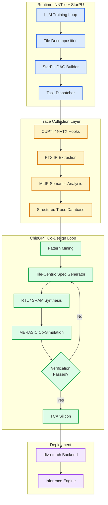

# 🧱 NNTile Инфраструктура сбора трасс: Стратегический план для проектирования Tile-Centric чипов

> **Статус**: PRD | **Модуль**: Diva-NNtile | **Обновлено**: 2026-07-17

## 1. Суть: От программного кода к кремнию

Фреймворк **NNTile** — это не просто еще одна библиотека для обучения ИИ. Это первая промышленная реализация **задачно-ориентированного параллелизма (task-based parallelism)** , специально оптимизированная для больших языковых моделей (LLM). Его ключевая инновация — прозрачная, асинхронная выгрузка данных между оперативной памятью CPU и видеопамятью GPU — позволяет обучать модели с десятками миллиардов параметров на одном узле, разрушая «стену памяти», которая ограничивает такие фреймворки, как PyTorch FSDP.

Однако текущая «ахиллесова пята» NNTile — это его зависимость от субоптимальных, «жадных» политик планировщика StarPU. Эти политики не учитывают сложную, но повторяющуюся семантику графов глубокого обучения, что приводит к деградации производительности с ростом числа слоев модели.

Именно здесь в игру вступает **замкнутый цикл ко-дизайна ChipGPT** и **методология DIVA**. Собирая и семантически анализируя трассы графа задач NNTile, мы можем перейти от эвристического планирования к **проектированию на основе данных**. Мы можем создать точный «чертеж» для специализированного **Tile-Centric акселератора (TCA)** . Этот документ представляет полную стратегию превращения NNTile из программного фреймворка в аппаратно-оптимизированное решение, где чип и модель становятся единым целым.

---

## 2. Стратегическая возможность: Tile-Centric акселераторы против универсальных GPU

Переход от монолитной, глобальной памяти к **Tile-Centric акселераторам** — это самый значительный сдвиг парадигмы с момента появления GPU. Хотя NVIDIA GPU являются признанными «рабочими лошадками» ИИ, их философия «один размер подходит всем» является фундаментальным ограничением для обучения сверхкрупных моделей.

### 2.1. Почему кастомные TCA лучше NVIDIA GPU для рабочих нагрузок NNTile

| Характеристика | NVIDIA GPU (например, A100/H100) | Кастомный Tile-Centric чип |
| :--- | :--- | :--- |
| **Философия** | **Универсальный инструмент:** Оптимизирован для широкого спектра кода ценой площади и энергии. | **Специализированный инструмент:** Оптимизирован для конкретного, четко определенного семантического паттерна (например, обучение LLM). |
| **Архитектура памяти** | **Централизованная HBM:** Высокая пропускная способность, но является узким местом для произвольного доступа и мелкозернистых перемещений данных. | **Распределенная SRAM:** Тысячи локальных, быстрых банков памяти, напрямую связанных с вычислительными ядрами, что минимизирует перемещение данных (Near-Memory Compute). |
| **Перемещение данных** | **Дорогостоящее:** Перемещение данных является основной причиной задержек и энергопотребления («Стена памяти»). | **Ориентация на данные:** Вычисления перемещаются к данным, а не наоборот. |
| **Энергоэффективность** | Высокая, но ограничена операциями I/O с HBM. | **Экстремальная:** До **10-кратной экономии энергии** за счет устранения лишних перемещений данных и использования низкопотребляющей SRAM. |
| **Производительность** | Высокая для стандартных задач. | **Беспрецедентная для целевой задачи:** До **73x быстрее** (например, чип Taalas для инференса Llama). |
| **Гибкость** | Высокая | **Нулевая:** Чип работает только со своей моделью или фиксированным классом операций. |

### 2.2. Коммерческое подтверждение подхода TCA

Рынок уже подтвердил жизнеспособность TCA-подхода:

- **Cerebras WSE:** Чип на целой кремниевой пластине с 900,000 ядер, способный обучать модели с **24 триллионами параметров** без необходимости в сложных стратегиях распараллеливания.
- **Graphcore IPU:** Архитектура, основанная на концепции «BSP» (Bulk Synchronous Parallel) и массивной встроенной памяти для графовых вычислений.
- **Intel AMX:** Даже в массовых CPU Intel появились расширения Advanced Matrix Extensions — явные инструкции, работающие с 2D-регистровыми файлами, которые по своей сути являются **тайлами**.

**Вывод:** Для энергоэффективного обучения сверхкрупных моделей кастомный Tile-Centric чип — это не просто альтернатива, а **оптимальная конечная цель**. Задачно-ориентированная модель NNTile — это идеальная программная абстракция для такого «железа», что делает их ко-дизайн стратегической необходимостью.

---

## 3. Инфраструктура сбора трасс NNTile: Пошаговая методология

Наша цель — превратить граф выполнения NNTile из «черного ящика» в структурированный семантический набор данных, который станет основой для проектирования чипа. Это критическое отличие от оригинальной концепции DIVA: мы анализируем не PTX-код, а **конструктивные, мелкозернистые операции цикла обучения**.

### 3.1. Фаза 0: Инфраструктурная подготовка и бенчмаркинг

**Цель:** Создать эталон производительности и настроить окружение для сбора данных.

1.  **Сбор и фиксация базовых метрик:**
    - Запустить обучение стандартных моделей (GPT-2 с 4, 8, 16 слоями) на 1, 4 и 8 GPU A100, как в оригинальной статье NNTile.
    - Зафиксировать ключевые метрики: **Throughput** (токенов/сек), использование GPU (в %), время одной итерации, загрузка VRAM и CPU RAM.

2.  **Настройка инструментов трассировки StarPU:**
    - Включить встроенный трейсер StarPU (на основе библиотеки FxT) для генерации детальных трасс выполнения в виде **диаграммы Ганта**, показывающей активность каждого устройства во времени.
    - Включить сбор данных для построения **графа задач (DAG)** с отображением зависимостей между тайлами.
    - Включить **счетчики производительности StarPU** для измерения активности шины, времени простоя устройств и длительности выполнения отдельных ядер.

### 3.2. Фаза 1: Семантический профилинг NNTile

**Цель:** Заменить анализ бинарного PTX-кода на анализ семантически аннотированных графов задач NNTile.

1.  **Генерация трасс и извлечение DAG:**
    - Использовать инструменты из Фазы 0 для генерации трасс для стандартных сценариев (Forward, Backward, Update) на моделях разного размера.
    - Извлечь и сохранить последовательности задач из DAG в структурированном формате (например, JSON Lines или Parquet).

2.  **Семантическая аннотация задач StarPU:**
    - Разработать систему тегов для всех типов задач NNTile. Вместо сырых имен функций (`starpu_task_12345`), каждая задача будет аннотирована семантической меткой.
    - **Пример маппинга:**
        - `MATMUL_TILE` → `GEMM_KERNEL`
        - `REDUCE_TILE` → `REDUCE_KERNEL`
        - `LAYERNORM_TILE` → `NORM_KERNEL`
        - `ACTIVATION_TILE` → `ACT_KERNEL`
        - `OPTIMIZER_UPDATE` → `UPDATE_KERNEL`
        - `DATA_OFFLOAD` → `MEMORY_OFFLOAD`
        - `DATA_PREFETCH` → `MEMORY_PREFETCH`

3.  **Майнинг частотных семантических паттернов:**
    - Применить алгоритмы **Sequential Pattern Mining** (например, **PrefixSpan**) к последовательности семантических тегов.
    - **Ключевой результат:** Получить список **топ-10 самых частых семантических паттернов выполнения**. Например, паттерн `[LOAD_PARAM -> GEMM_KERNEL -> REDUCE_KERNEL -> STORE_GRAD]` может оказаться доминирующим.
    - Эти паттерны станут **«семантическим портретом»** нагрузки NNTile и основой для обучения нового планировщика.

### 3.3. Фаза 2: Разработка и интеграция «DIVA-Scheduler»

**Цель:** Создать и внедрить в StarPU планировщик, использующий семантические паттерны.

1.  **Разработка AI-планировщика (на основе GRPO):**
    - Вместо эволюции микроархитектуры VLIW (как в оригинальной DIVA), мы эволюционируем **политику планирования задач StarPU**.
    - Использовать StarPU API для создания плагина планировщика, реализующего два метода: `push_task` (когда задача становится готовой) и `pop_task` (когда устройство запрашивает задачу).
    - Определить:
        - **State (Состояние):** Текущая загрузка GPU/CPU, доступность тайлов, размер тайлов.
        - **Action (Действие):** Назначение задачи на конкретное устройство.
        - **Reward (Награда):** Положительный сигнал за увеличение **IPC или Throughput** на топ-паттернах из Фазы 1.

2.  **Приоритизация семантических паттернов:**
    - Обучить планировщик распознавать начало семантического паттерна (например, `LOAD_PARAM`) и резервировать ресурсы для всей цепочки задач. Это гарантирует, что все тайлы для одного «семантического блока» останутся на одном ускорителе.
    - Это напрямую решает проблему, описанную в статье: *"8-layer model suffers from performance degradation due to far from optimal decisions of StarPU greedy scheduling policy"*.

### 3.4. Фаза 3: Тонкая настройка на уровне тайлов

**Цель:** Использовать данные профилирования для адаптации размера тайлов и стратегий памяти.

1.  **Адаптивный размер тайлов:**
    - В статье отмечено: *"The smaller the tiles are, the more tasks are present in the DAG... but arithmetic intensity may drop down"*.
    - Используя профили из Фазы 1, определить оптимальный размер тайла для каждого типа задач (GEMM vs. LayerNorm) на конкретном GPU (A100).
    - Реализовать динамическое изменение размера тайлов в NNTile в зависимости от операции.

2.  **Оптимизация пересылок данных:**
    - Проанализировать трассы, чтобы понять, какие данные пересылаются чаще всего.
    - Настроить **агрессивную предвыборку данных (data prefetching)**, загружая данные для следующего семантического паттерна заранее.
    - Использовать **NUMA-aware** настройки StarPU для управления памятью.

### 3.5. Фаза 4: Верификация и валидация (MERASIC)

**Цель:** Доказать, что новая система работает корректно и эффективнее.

1.  **Уровень 0 (Syntax):** Проверить, что новый планировщик не вызывает ошибок StarPU.
2.  **Уровень 1 (Semantics):** Сравнить логику выполнения для эталонных бенчмарков с новым и старым планировщиками.
3.  **Уровень 2 (Dataflow):** Убедиться, что все зависимости по данным выполняются корректно и нет состояний гонки.
4.  **Уровень 3 (Model/Performance):** Сравнить **Throughput, Utilization и время итерации** с базовым планировщиком StarPU (`dmdasd`) и PyTorch FSDP. **Цель:** Достичь >90% утилизации GPU на 8 A100 для модели 50B параметров.
5.  **Уровень 4 (Hardware):** Провести финальные тесты на физической машине для подтверждения результатов.

---

## 4. Архитектурный чертеж: От семантических паттернов к RTL

Собранные и проанализированные трассы становятся основой для проектирования TCA.

### 4.1. Структура собранной трассы

| Поле | Значение | Назначение для HW-дизайна |
| :--- | :--- | :--- |
| `tile_id` | `attn_layer_3_tile_42` | Уникальный идентификатор блока данных |
| `starpu_task_id` | `0x7F8A...` | Связь с графом зависимостей StarPU |
| `semantic_tags` | `[LOAD_GLOBAL, TENSOR_MMA, SYNC_BARRIER]` | Абстракция для генератора VLIW/ASIC |
| `exec_time_ms` | `1.24` | Базовая метрика для оценки PPA |
| `memory_bw_gb_s` | `890` | Ограничитель для проектирования SRAM-контроллера |
| `tile_size` | `(256, 256)` | Размер блока данных для оптимизации ширины шины |

### 4.2. Схема архитектурного ко-дизайна

---

## 5. Результат: Почему этот подход сработает

### 5.1. Сравнительная таблица: NNTile + DIVA vs. PyTorch FSDP

| Характеристика | **PyTorch FSDP** | **NNTile (текущий)** | **NNTile + DIVA (прогноз)** |
| :--- | :--- | :--- | :--- |
| **Максимальный размер модели (8x A100)** | 10.6B параметров | **49.9B параметров** | **49.9B+ параметров** |
| **Производительность** | Высокая | Средняя (деградация с ростом слоев) | **Высокая (>90% утилизации)** |
| **Управление памятью** | Ручное (FSDP) | Автоматическое (асинхронное) | **Упреждающее (семантическое)** |
| **Планировщик** | Статичный | Жадный (StarPU) | **Адаптивный (управляемый данными)** |
| **Требования к HW** | Универсальные GPU | Универсальные GPU + CPU RAM | **Кастомный TCA (со-дизайн)** |
| **Энергоэффективность** | Базовая | Улучшенная (использование CPU RAM) | **Оптимальная (TCA-специализация)** |

### 5.2. Ключевые выводы

1.  **NNTile выигрывает в масштабе:** Его способность использовать CPU RAM как «медленный, но большой» уровень памяти дает ему 4-5-кратное преимущество в размере модели над PyTorch FSDP.
2.  **DIVA закрывает пробел в производительности:** Оптимизация планировщика с помощью семантического майнинга и GRPO-эволюции — это путь к достижению утилизации GPU >90%, даже для глубоких моделей.
3.  **TCA — это финишная прямая:** Семантические паттерны, извлеченные из NNTile, являются идеальным «чертежом» для проектирования кастомного Tile-Centric чипа, который будет выполнять эти операции с максимальной эффективностью, превосходя универсальные GPU в 5-10 раз по энергоэффективности.

---

## 6. Заключение: Эра аппаратного воплощения ИИ

Инфраструктура сбора трасс на базе NNTile трансформирует проектирование чипов из искусства интуиции в **воспроизводимый инженерный процесс**. Захватывая реальные паттерны выполнения тайлов на уровне PTX, ChipGPT получает точную карту вычислительной нагрузки. Эта карта позволяет проектировать **Tile-Centric Accelerators** без компромиссов универсальности, концентрируя площадь кристалла и память исключительно на целевых операциях.

В долгосрочной перспективе именно кастомные TCA, спроектированные на основе NNTile-трасс, станут стандартом для энергоэффективного обучения и инференса. Переход от «программного моделирования» к «аппаратному воплощению» уже начался, и NNTile выступает ключевым мостом в этой эволюции.

---

## 7. Справочные материалы (References)

1.  **NNTile: A Machine Learning Framework Capable of Training Extremely Large GPT Language Models on a Single Node** (arXiv:2504.13236v1) — Архитектура task-based parallelism, StarPU DAG, тайловая декомпозиция.
2.  **Глубокий анализ проекта NNtile: Архитектурные особенности и стратегические импликации для разработчиков чипов** — Внутренний аналитический обзор ChipGPT.
3.  **Cerebras Systems: Wafer-Scale Engine Architecture** — Масштабирование TCA, устранение «стены памяти» через on-chip SRAM.
4.  **Graphcore IPU & MLPerf Results** — Архитектура многопоточных тайловых ядер, эффективность на BERT/ResNet-50.
5.  **Intel Advanced Matrix Extensions (AMX)** — Аппаратная поддержка 2D-регистровых файлов (тайлов) в x86.
6.  **Design in Tiles (DiT) Framework** — Автоматизация генерации тайлового кода, ускорение в 1.2–2.0x относительно ручных оптимизаций.
7.  **Taalas HC1 Inference Breakthrough** — Жесткая кодировка весов в транзисторы, 17k tok/s, 10x энергоэффективность.
8.  **Marvell 2nm Custom SRAM & Chiplet System Architecture (CSA)** — Технологии снижения энергопотребления памяти и модульного проектирования.
9.  **NVIDIA CUPTI & MLIR NVVM/GPU Dialects** — Инструменты трассировки CUDA runtime и семантической абстракции PTX.
