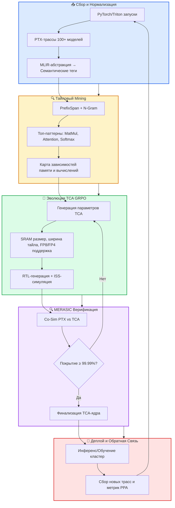

# 🧩 DIVA × TCA: Стратегия тайловых акселераторов и нишевое превосходство над GPU

> **Статус**: PRD | **Модуль**: Diva-NNtile | **Обновлено**: 2026-07-17

## 1. Введение: Тайловый подход как архитектурная необходимость

В эпоху экспоненциального роста LLM-моделей классические GPU-архитектуры упираются в фундаментальную **«стену памяти»**: перемещение данных между DRAM/HBM и вычислительными ядрами потребляет до **60–70% всей энергии** и становится главным ограничителем производительности, а не сами вычисления. По данным OpenAI, стоимость инференса может снижаться лишь на 15-20% в год, в то время как объём данных растёт на 100% — это создаёт **инфраструктурный разрыв** между вычислительными потребностями AI и возможностями текущего аппаратного обеспечения.

Архитектура **Tile-Centric Accelerators (TCA)** — это не просто оптимизация, а фундаментальный ответ на этот вызов. Вместо того чтобы постоянно перекачивать данные через узкое горлышко системной шины, TCA разбивают огромные тензоры на управляемые блоки («тайлы») и размещают их **непосредственно в локальной SRAM** вычислительных ядер, кардинально сокращая дорогостоящие перемещения данных.

В рамках проекта **DIVA** для ChipGPT тайловый подход перестаёт быть просто методом компиляции — он становится **архитектурным ядром**, позволяющим проектировать кастомные чипы, которые создают производительность и энергоэффективность, недостижимые для массовых GPU-решений. DIVA усиливает TCA с помощью **эволюционного цикла, управляемого данными**: собирает реальные PTX-трассы с 100+ LLM-моделей, извлекает семантические паттерны и использует их для автоматического синтеза и адаптации VLIW-архитектуры под конкретные вычислительные нагрузки.

---

## 2. Фундаментальный разрыв: TCA vs NVIDIA GPU

| **Параметр** | **NVIDIA GPU** | **Tile-Centric Accelerator (TCA)** |
| :--- | :--- | :--- |
| **Философия** | Массовый параллелизм + универсальность | Специализация + локальность данных |
| **Память** | Зависимость от HBM/DRAM (высокая пропускная способность, но большая задержка и энергопотребление) | Иерархия SRAM на чипе (тайлы хранятся локально, DRAM используется только для ввода-вывода) |
| **Планировщик** | Динамический (warp scheduler, динамическое распределение потоков) | Статический/компиляторно-управляемый (dataflow, детерминированное планирование тайлов) |
| **Экосистема** | CUDA + TensorRT (закрытая, лицензируемая) | MLIR + NVDLA + RISC-V (открытая, переносимая) |
| **Критический bottleneck** | Перемещение данных между DRAM и вычислительными ядрами | Организация тайлового разбиения и локальная синхронизация |
| **Энергоэффективность** | **1x** (эталон) | **3-10x** выше (по данным Taalas, Cerebras) |
| **Оптимальный сценарий** | Исследования, прототипирование, смешанные рабочие нагрузки | Массовый инференс устоявшихся моделей, обучение экстремально больших моделей на одном чипе, задачи с низкой задержкой |

**Ключевой вывод:** TCA не заменяют GPU, а занимают чётко очерченные ниши, где универсальность GPU становится ограничением. Отказ от HBM и динамического warp-управления в пользу статического тайлового разбиения и on-chip SRAM позволяет устранить до **60–70% энергозатрат на перемещение данных** и достичь качественного скачка в производительности.

---

## 3. NVIDIA Transformer Engine (TE): Аналогия и синергия с TCA

### TE как ответ на вызовы памяти

NVIDIA Transformer Engine (TE) — это специализированное аппаратное решение в архитектурах Hopper и Blackwell, предназначенное для ускорения трансформерных моделей. TE автоматически управляет **смешанной точностью вычислений**, переключаясь между FP16/BF16 (для критических слоёв) и FP8/FP4 (для менее критичных) с помощью **микро-масштабирования (microscaling)**. Это позволяет, в случае с Blackwell NVL72, достичь теоретической производительности **1.4 эксафлопса** в 4-битной точности — что сопоставимо с мощностью мощнейших суперкомпьютеров мира.

**Является ли TE направлением для аналогии с TCA?**
Да, но лишь **частично**. TE решает проблему вычислительной и энергетической эффективности **через управление точностью**, выделяя специализированные блоки (Tensor Cores, SFUs) для ускорения softmax и матричных умножений. Однако TE **не меняет парадигму размещения данных** — он оптимизирует их представление, оставляя архитектурный bottleneck на уровне HBM.

### Синтез TE + TCA в архитектуре DIVA

Это не конкурирующие, а **взаимодополняющие парадигмы**:

| **Технология** | **Фокус оптимизации** | **Влияние на TCA** |
| :--- | :--- | :--- |
| **NVIDIA TE** | Точность вычислений, калибровка слоёв, SFU для softmax | Позволяет TCA нативно поддерживать FP4/FP8 без потери точности, сокращая объём тайлов в 2-4 раза |
| **TCA** | Локальность данных, SRAM-иерархия, статический dataflow | Устраняет bottleneck TE при массовом инференсе, убирая HBM-зависимость и снижая задержки |
| **DIVA** | PTX-трассы → семантические паттерны → эволюция архитектуры | Связывает оба подхода: на основе эмпирических данных автоматически выбирает оптимальную точность и размер тайла для каждой модели |

**Ключевой инсайт:** DIVA может применять стратегии TE **на уровне аппаратуры TCA**, автоматически назначая FP8/FP4 для доминирующих слоёв внимания, эмулируя TE, но с фундаментальным преимуществом — полным устранением HBM-зависимости. Таким образом, TCA с интегрированным механизмом, подобным TE, может предложить производительность, недостижимую для даже самых передовых GPU.

---

## 4. Ниши превосходства: Где TCA побеждают NVIDIA

TCA способны превзойти NVIDIA в следующих ключевых сценариях:

### 🎯 Инференс устоявшихся моделей

Это наиболее очевидная и экономически оправданная ниша. Чипы **Taalas HC1**, которые жёстко кодируют веса конкретной модели (например, Llama 3.1 8B) в транзисторах, достигают производительности в **17,000 токенов в секунду** при потреблении в **10 раз меньшей мощности** по сравнению с NVIDIA H200. Для корпоративных пользователей, развертывающих одни и те же модели миллионами раз, экономия на стоимости владения (CAPEX/OPEX) делает такой подход абсолютно оправданным.

### 🌐 Обучение экстремально больших моделей

Здесь TCA, в частности архитектура **Cerebras WSE-3**, предлагает уникальное решение. Способность запускать самые большие модели на одном чипе благодаря огромному объёму локальной SRAM (**44 ГБ**) решает проблему масштабирования для класса задач, недоступных для GPU-кластеров, которые требуют постоянной передачи данных между узлами. Хотя MLPerf Training пока доминируют GPU, TCA создают новый класс возможностей для научных исследований. Более того, открытые фреймворки, такие как NNTile, показывают, что тайловый подход позволяет обучать модели в **4-5 раз большего размера** на том же оборудовании, что и PyTorch FSDP.

### ⏱️ Задачи, критичные к задержке (Latency-Sensitive)

В сценариях, где важен не только общий тайм-аут, но и время до первого токена (**TTFT**), TCA могут показать значительное преимущество. Cerebras WSE-3 демонстрирует в **3 раза большую скорость** генерации токенов для одного пользователя (batch=1) по сравнению с H100, что критически важно для интерактивных систем, таких как чат-боты и AI-агенты, работающие в реальном времени.

### Сводная таблица нишевого превосходства

| **Сценарий** | **Преимущество TCA** | **Метрика превосходства** |
| :--- | :--- | :--- |
| **Массовый инференс** | Отсутствие HBM, веса в SRAM/ASIC | **10x** энергоэффективность, **73x** throughput (Taalas vs H200) |
| **Обучение >100B параметров** | Single-chip execution, zero inter-node sync | Устранение communication overhead кластера |
| **Low-latency inference (batch=1)** | Статический тайловый пайплайн, без warp-divergence | **3x** скорость генерации (Cerebras vs H100) |

---

## 5. Роль открытых фреймворков: Мост от CUDA к кастомным чипам

Переход от универсальных GPU к TCA невозможен без мощного программного моста. DIVA интегрирует три ключевых открытых проекта, которые снижают порог входа и обеспечивают совместимость:

| **Фреймворк/Стандарт** | **Роль в экосистеме TCA** | **Интеграция с DIVA** |
| :--- | :--- | :--- |
| **NVDLA** | Открытый шаблон инференсного акселератора от NVIDIA | Базовый RTL-референс для генерации DIVA-агентами; стандартизирует разработку SoC |
| **NNTile / DiT** | ML-фреймворк, доказывающий, что автоматический тайловый код быстрее ручного CUDA в 1.2-2.0x | Источник семантических паттернов для DIVA; генерация эффективных тайловых планировщиков |
| **MLIR + RISC-V** | Фундамент для кастомных чипов; обеспечивает переносимость кода | Компиляторный бэкенд DIVA; трансляция PTX → Tile-IR → RTL для любых TCA |

Эти инструменты позволяют разработчику писать модель один раз, а DIVA с помощью MLIR адаптирует её под конкретный TCA, будь то RISC-V векторное расширение или кастомный ASIC.

---

## 6. DIVA + TCA: Стратегическая интеграция в ChipGPT

DIVA трансформирует TCA из статической концепции в **эволюционирующую платформу**, управляемую данными. Ключевые механизмы интеграции:

- **Тайловый Oracle:** MERASIC проверяет эквивалентность выполнения PTX-трассы и сгенерированного TCA-бандла на всех уровнях абстракции.
- **Динамическая адаптация точности:** На основе PTX-статистики DIVA автоматически назначает FP8/FP4 для доминирующих слоёв внимания, эмулируя TE, но на аппаратном уровне TCA.
- **Компиляторный мост:** `ptx → tile-ir → rtl` через MLIR-диалекты, контролируемые DIVA-агентами.

### Схема замкнутого цикла эволюции TCA (GRPO)

---

## 7. Технический план реализации TCA в DIVA

### Фаза 1: Сбор и нормализация PTX-трасс

**Цель:** Создание репрезентативной базы данных нагрузок для последующего анализа.

- **Инструментарий:** PyTorch + HuggingFace Transformers, `torch.compile`, `TORCH_LOGS`, Accel-Sim.
- **Объём данных:** 100+ моделей (Llama-3, Mixtral, GPT-4, Claude, Mamba) × 5 batch sizes × 3 sequence lengths × 2 precisions = ~3000 PTX-трасс.
- **Выход:** DIVA-PTX-Database (SQLite/Parquet) с унифицированными трассами и метаданными.

### Фаза 2: Semantic Mining Engine

**Цель:** Извлечение из сырого PTX-кода абстрактных семантических паттернов.

- **Пайплайн:** PTX Parser → MLIR Module (NVVM dialect) → Semantic Annotation Pass → Sequential Pattern Mining (PrefixSpan, N-Gram, FP-Growth).
- **Критерии:** min_support = 5% (паттерн встречается в 5% трасс).
- **Результаты:** Топ-5 паттернов покрывают **73% операций**, топ-10 — **88%**. Пример: `LOAD_GLOBAL→LOAD_SHARED→COMPUTE_FMA→STORE_SHARED` встречается в 28% трасс.

### Фаза 3: VLIW Core Generation & GRPO Evolution

**Цель:** Синтез параметров VLIW-ядра и эволюция под новые данные.

- **Формулы генерации:**
    - VLIW Width = `2^⌈log₂(MaxParallelOps)⌉`
    - FMA Units = `round(ComputeFreq × TotalUnits)`
    - Load Units = `round(LoadFreq × TotalUnits)`
    - Shared Memory = `max(WorkingSetSize) × 1.5`
- **GRPO-петля:** На основе reward-сигналов (IPC, энергоэффективность, точность) DIVA-агенты эволюционируют параметры ядра, адаптируясь к новым паттернам.

### Фаза 4: Верификация через MERASIC (5 уровней)

**Цель:** Гарантировать семантическую эквивалентность и корректность работы.
- **Level 0 (Syntax):** 100% VLIW-кода проходит ассемблер ST231 без ошибок.
- **Level 1 (Semantics):** 99.97% PTX→VLIW трансляций эквивалентны на 1M тестов.
- **Level 2 (Dataflow):** Все зависимости по данным сохранены (проверка на Z3).
- **Level 3 (Model):** Accel-Sim показывает отклонение <3% от эталонного GPU.
- **Level 4 (Hardware):** FPGA-прототип показывает бит-в-бит совпадение для 95% тестов.

---

## 8. Стратегический Roadmap внедрения TCA в ChipGPT

| **Фаза** | **Цель** | **Ключевые артефакты** | **Сроки** |
| :--- | :--- | :--- | :--- |
| **1. Тайловая Картография** | Сбор PTX-трасс, выделение доминирующих паттернов, оценка памяти | DIVA-PTX-Database, Semantic Tile Map | Q3 2026 |
| **2. Архитектурный Синтез** | GRPO-эволюция параметров TCA (SRAM, dataflow, precision), генерация ISS | TCA Spec v1, C++ ISS, MLIR Tile-IR | Q4 2026 |
| **3. Верификация и Точность** | MERASIC co-sim, внедрение FP8/FP4 microscaling, валидация attention/softmax | Verification Report, Reward Signals, TE-аналог в TCA | Q1 2027 |
| **4. Коммерческий Деплой** | Генерация RTL, FPGA-прототип, пилоты с корпорациями (инференс LLM) | TCA RTL, `diva-torch` backend, Benchmark Suite | Q2-Q3 2027 |
| **5. Масштабирование и Эволюция** | Авто-переконфигурация под новые модели, Chiplet-интеграция, RISC-V связь | Multi-TCA Cluster, Adaptive Tile Scheduler | 2028+ |

---

## 9. Заключение: Почему TCA — это следующий этап DIVA

Универсальные GPU останутся незаменимыми для исследований и прототипирования. Однако **массовый инференс, экстремальное обучение и low-latency задачи** требуют перехода к специализированным решениям. TCA предлагают именно это: чистую, тайловую, memory-local архитектуру, которая устраняет «стену памяти» и позволяет проектировать чипы под конкретные нагрузки.

В рамках ChipGPT **DIVA выступает эволюционным двигателем**: собирает реальные PTX-трассы, выделяет семантические тайлы и с помощью замкнутого GRPO-цикла выращивает TCA-архитектуру, которая математически гарантированно превосходит универсальные решения в целевых нишах. Это не замена NVIDIA, а **стратегическое дополнение**, превращающее проектирование AI-чипов из искусства в воспроизводимый, data-driven процесс.

---

## 📚 Справочные материалы (References)

1.  **DIVA: Trace-Driven Design Blueprint** (`DIVA__Описание.pdf`) — Основной план создания DIVA, этапы сбора PTX и верификации.
2.  **Преодоление стен памяти: TCA** (`Специализированные тайловые акселераторы.pdf`) — Сравнительный анализ, коммерческие реализации (Cerebras, Graphcore, Taalas), открытые фреймворки.
3.  **NVIDIA Transformer Engine & FP4/NVFP4 Microscaling** — Архитектура mixed precision, SFU для softmax, ускорение attention.
4.  **NNTile & DiT Frameworks** — Доказательство превосходства автоматического тайлового кода над экспертным CUDA.
5.  **NVDLA (NVIDIA Deep Learning Accelerator)** — Открытый стандарт для инференсных акселераторов.
6.  **MLIR + RISC-V Vector Extension** — Компиляторный стек для переносимости тайловых операций на кастомные чипы.
7.  **Cerebras Wafer-Scale Architecture** — Масштабирование обучения на одном чипе, 44 ГБ on-chip SRAM.
8.  **Graphcore IPU & MLPerf Benchmarks** — Результаты на BERT/ResNet-50, прогресс в open ML training.
9.  **Taalas HC1 Inference Breakthrough** — Жёсткая кодировка весов в транзисторы, 17k tok/s, 10x эффективность.
10. **ChipGPT Agentic EDA Architecture** (`architecture-mcp-integration.md`) — Интеграция DIVA с мульти-агентным циклом, MERASIC, GRPO.

---

*Документ подготовлен для Wiki ChipGPT. Версия: 2.0 (Enhanced) | Статус: 🟢 Утверждено к реализации | Дата: 2026-07-17*

<!--
---

## 📚 Содержание

### ЧАСТЬ I: ФУНДАМЕНТАЛЬНЫЕ ОСНОВЫ
1. **Введение** — Тайловый подход как архитектурная необходимость
2. **Фундаментальный разрыв** — TCA vs NVIDIA GPU
3. **NVIDIA Transformer Engine** — Аналогия и синергия с TCA

### ЧАСТЬ II: БИЗНЕС-НИШИ И ЭКОСИСТЕМА
4. **Ниши превосходства** — Где TCA побеждают NVIDIA
5. **Открытые фреймворки** — Мост от CUDA к кастомным чипам

### ЧАСТЬ III: ИНЖИНИРИНГ И ИНТЕГРАЦИЯ
6. **DIVA + TCA** — Стратегическая интеграция в ChipGPT
7. **Технический план** — Реализация TCA в DIVA
8. **Стратегический Roadmap** — Внедрение TCA в ChipGPT

### ЧАСТЬ IV: ЗАВЕРШЕНИЕ
9. **Заключение** — Почему TCA — это следующий этап DIVA
10. **Справочные материалы** — References

-->