# Оптимальный MLIR-based компилятор для WARP-V: Сквозной план фарминга и реализации новых AI-инструкций


## 📋 Аннотация

> В данной статье представлен сквозной план создания компилятора "уровня Groq" для архитектуры WARP-V. Основная идея заключается в двухфазном подходе: сначала с помощью методологии Guess & Sketch производится **"фарминг" оптимальных инструкций** на основе реальных трасс выполнения LLM на GPU NVIDIA, а затем эти инструкции реализуются через **MLIR-компилятор** в рамках подхода LEGO-Compiler. Такой подход позволяет не догонять NVIDIA, а создавать архитектуру, изначально "заточенную" под решение самых актуальных задач инференса.

Ключевая инновация подхода — двухфазная стратегия:

1. **Фаза «Фарминга»** — эмпирическое извлечение оптимальных вычислительных паттернов из реальных PTX/SASS-трасс NVIDIA с помощью методологии Guess & Sketch (LLM-генерация + SMT-верификация).

2. **Фаза «Инженерии»** — формальная реализация найденных инструкций через MLIR-диалекты в парадигме LEGO-Compiler, где каждая новая инструкция становится «кирпичиком» модульного компиляторного стека.

Философская основа подхода: мы не «крадём» инструкции у NVIDIA, а **декодируем их оптимальность** — извлекаем требования к производительности, скрытые в паттернах выполнения SOTA-моделей, и воспроизводим их на собственной VLIW+SIMT+NUMA архитектуре. Результат — компилятор-«дирижёр», который знает о тайлах, XYL-движке, NUMA-топологии и Warp Specialization, обеспечивая детерминизм уровня Groq с гибкостью, необходимой для MoE-моделей.

---

## 🎯 1. Введение: Почему компилятор — это всё

### 1.1. Компонентно-ориентированная парадигма Groq

Groq была основана как **compiler-first компания**: разработка программного обеспечения началась за полгода до проектирования кремния, чтобы гарантировать, что компилятор сможет полностью контролировать аппаратуру. Эта философия превращает компилятор не просто в транслятор, а в **«дирижёра»**, управляющего каждым тактом работы чипа.

Ключевые принципы, которые мы заимствуем и развиваем:

| Принцип Groq | Наша реализация в WARP-V |
|:---|:---|
| Компилятор знает каждый такт | Статическое VLIW-планирование на уровне кластеров |
| Отказ от кэшей | NUMA-осведомлённое управление SRAM-тайлами |
| Детерминированная сеть | Intercluster Datapath с фиксированной латентностью |
| SRAM как основная память | Гибрид: SRAM для decode + внешняя память для prefill |
| Планирование chip-to-chip | Планирование NoC-маршрутов между NUMA-узлами |

### 1.2 Архитектурное превосходство Groq

Ключевое отличие Groq от традиционных GPU:

| Характеристика | Традиционный GPU (NVIDIA) | Groq LPU |
|---|---|---|
| **Планирование** | Динамическое (аппаратный планировщик варпов) | Статическое (компилятор управляет каждым тактом) |
| **Память** | Иерархическая (HBM → L2 → Shared Memory) | Плоская (SRAM как основная память) |
| **Детерминизм** | Отсутствует (джиттер) | Полный (предсказуемая задержка) |
| **Пропускная способность** | ~8 ТБ/с (HBM3E) | ~80 ТБ/с (SRAM) |
| **Компилятор** | Вторичен по отношению к аппаратуре | Первичен ("software-defined hardware") |

Groq использует **Tensor Streaming Processor (TSP)** архитектуру, где компилятор статически планирует каждую операцию и перемещение данных вплоть до отдельного такта.

### 1.3. Ключевая аналогия: «Конвейер из варп-групп» = VLIW следующего поколения

Центральная интуиция нашего подхода: **«конвейер из варп-групп» — это аналог конвейера из VLIW-инструкций, где „инструкции" становятся большими варп-операциями»** (типа GEMM, TMA-загрузки, softmax).

**"Конвейер из варп-групп"** действительно можно считать аналогом конвейера из VLIW-инструкций, но на более высоком уровне абстракции.

| Аспект | Классический VLIW | Конвейер из варп-групп (WARP-V) |
|:---|:---|:---|
| **«Инструкция»** | Отдельная операция (ADD, MUL, LOAD) | Варп-операция: многошаговая задача на 32–128 потоках (WGMMA-аналог) |
| **«Длинное слово»** | Бандл скалярных инструкций | Конвейер из Producer / Consumer / Epilogue варп-групп |
| **Роль компилятора** | Упаковать независимые инструкции | Построить детерминированный конвейер задач |
| **Синхронизация** | Неявная (независимость в бандле) | Явная (bar.sync, mbarrier, WARP_SYNC) |
| **Гранулярность** | Уровень инструкций | Уровень задач (GEMM, softmax, gather) |

Эта аналогия подтверждается работой **Twill** (OSDI'26), где Software Pipelining (SWP) и Warp Specialization (WS) рассматриваются как **единая задача оптимизации**, решаемая через SMT-методы.

**Резюме:**

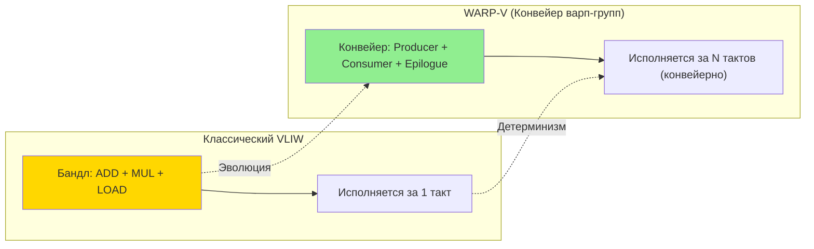

### 1.4. Подтверждение правильности курса: сделка NVIDIA–Groq

Стратегическое соглашение NVIDIA и Groq (~$20 млрд, объявлено в конце 2025 года) — это не просто acqui-hire, а **сигнал всей индустрии**:

- NVIDIA лицензировала IP Groq и наняла ключевых инженеров (включая основателя Jonathan Ross, создателя Google TPU);
- Появилась отдельная дорожная карта LPU: **Groq 3 LPX (2026) → LP35 (2027) → LP40 (2028)**;
- Гибрид Vera Rubin + Groq LPU обещает **35× лучшую энергоэффективность** и >1000 токенов/сек;
- Это подтверждает: рынок нуждается в детерминированных SRAM-акселераторах для decode-фазы LLM.

**Наш конкурент — не NVIDIA, а NVIDIA+Groq.** Наша задача — предложить более эффективную реализацию гибридного принципа через уникальную комбинацию **WARP + VLIW + TCA + XYL**.

---

## 🏛️ 2. Архитектура компиляторного стека: Общая схема

### 2.1. Полный пайплайн: от PyTorch до VLIW-кода

Ниже представлена полная архитектура нашего компилятора. Она следует проверенной схеме Groq (MLIR на фронте, кастомный бэкенд), но расширяет её до полного ко-дизайна HW/SW через единую ADL-спецификацию.

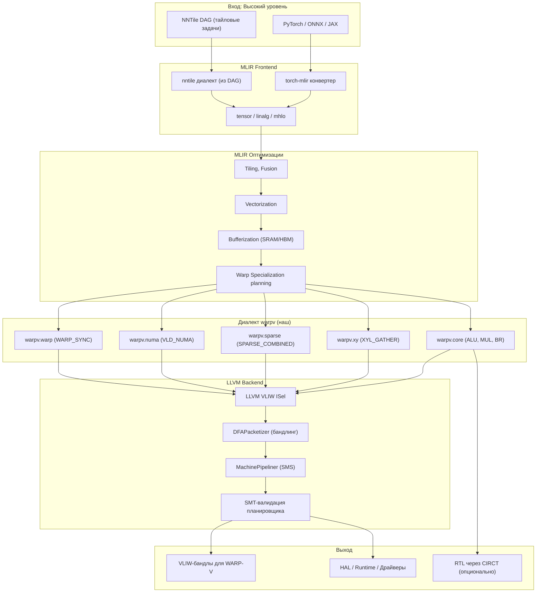

**Описание схемы:** Пайплайн разделён на шесть логических уровней. Входные данные (PyTorch-модель или DAG тайловых задач NNTile) попадают в MLIR-фронтенд, где трансформируются в стандартные высокоуровневые диалекты (tensor, linalg). Затем следует каскад оптимизаций (tiling, fusion, vectorization, bufferization) и планирование Warp Specialization. Результат опускается в наш кастомный диалект `warpv` с пятью суб-диалектами, отражающими аппаратные блоки WARP-V. LLVM-бэкенд выполняет финальную кодогенерацию: instruction selection, пакетизация через DFAPacketizer, software pipelining через MachinePipeliner и SMT-валидация планировщика. На выходе — три артефакта: VLIW-бандлы для ядра, автоматически сгенерированный runtime и (опционально) RTL через CIRCT для FPGA/ASIC прототипирования.

### 2.2. Ключевой принцип: Единая ADL-спецификация

В отличие от NVIDIA, где аппаратура и компилятор разрабатываются разными командами с разными языками описания (что создаёт задержку 2–3 года между поколениями), наш подход использует **единую ADL-спецификацию** (Architecture Description Language):

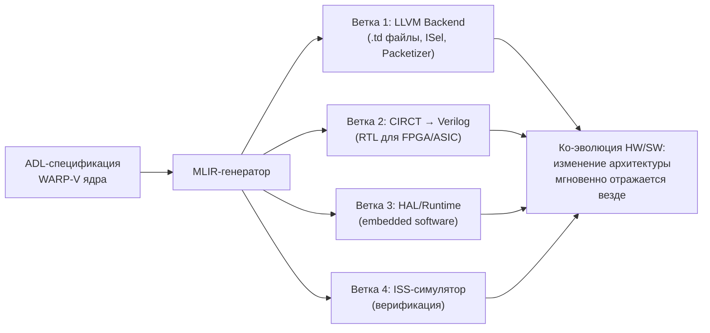

**Описание схемы:** ADL-спецификация — это единый «чертёж» ядра WARP-V, описывающий порты, ISA, латентности, ресурсные ограничения. Из него MLIR-генератор автоматически выводит четыре артефакта: LLVM-бэкенд компилятора (через TableGen), RTL для аппаратного прототипирования (через CIRCT), embedded-софт (HAL, драйверы, аллокаторы) и модель ISS для симуляции. Это и есть «ко-эволюция HW/SW» — изменение в архитектуре мгновенно синхронизируется во всех стеках, что невозможно в парадигме NVIDIA.

---

## 🔬 3. ЭТАП 1: «Фарминг оптимальных инструкций» через Guess & Sketch

### 3.1 Проблема: NVIDIA не раскрывает свой ISA

NVIDIA **не раскрывает низкоуровневые детали** своих архитектур (SASS) в полном объеме . Инструкции в PTX (виртуальном ISA NVIDIA) — это лишь верхушка айсберга. Они не имеют прямого 1-к-1 соответствия с реальными машинными инструкциями (SASS) .

### 3.2. Философия фарминга: Не кража, а расшифровка

Не скопировать инструкции NVIDIA, а **понять их поведение** (семантику) и **воспроизвести их эффективность** на VLIW-ядре. Это "бенчмаркинг" на уровне инструкций .

**Критически важное уточнение:** «Фарминг» через Guess & Sketch — это не копирование инструкций NVIDIA, а **«расшифровка» и «эмуляция» их оптимальности**. Причина — фундаментальная асимметрия информации:

1. **Битва на уровне ISA:** NVIDIA не раскрывает низкоуровневые детали SASS в полном объёме. PTX — это виртуальный ISA, верхушка айсберга. Одна PTX-инструкция может транслироваться в несколько разных SASS-инструкций в зависимости от состояния процессора.

2. **Почему нельзя просто «взять» PTX:** Использование PTX напрямую означает потерю производительности — мы будем «общаться» с железом через прослойку, оптимизированную NVIDIA под свои нужды, а не под нашу архитектуру.

3. **Истинная цель фарминга:** Понять **семантику поведения** инструкций NVIDIA и воспроизвести их эффективность на нашем VLIW-ядре. Это «бенчмаркинг на уровне инструкций»: мы извлекаем **требования к производительности**, а не сам код.


### 3.3 Методология Guess & Sketch

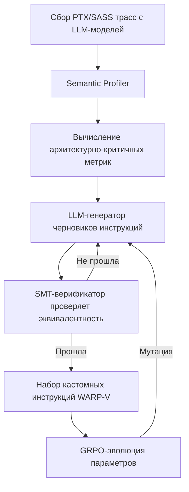

**Этапы:**

1. **Сбор трасс:** Реальные PTX/SASS трассы с сотен LLM-моделей.
2. **Semantic Profiler:** Превращает бинарные трассы в семантические события (SET) и вычисляет метрики: ILP, Divergence Cost, Bank Conflicts.
3. **Guess (LLM):** LLM анализирует горячие паттерны из трасс и генерирует "черновики" новых VLIW-инструкций.
4. **Sketch (SMT/Z3):** SMT-верификатор проверяет, что предложенная инструкция семантически эквивалентна исходному PTX-блоку.
5. **Результат:** Оптимизированный набор инструкций (кастомный ISA), идеально "заточенный" под реальные паттерны выполнения LLM .


**Резюме:**

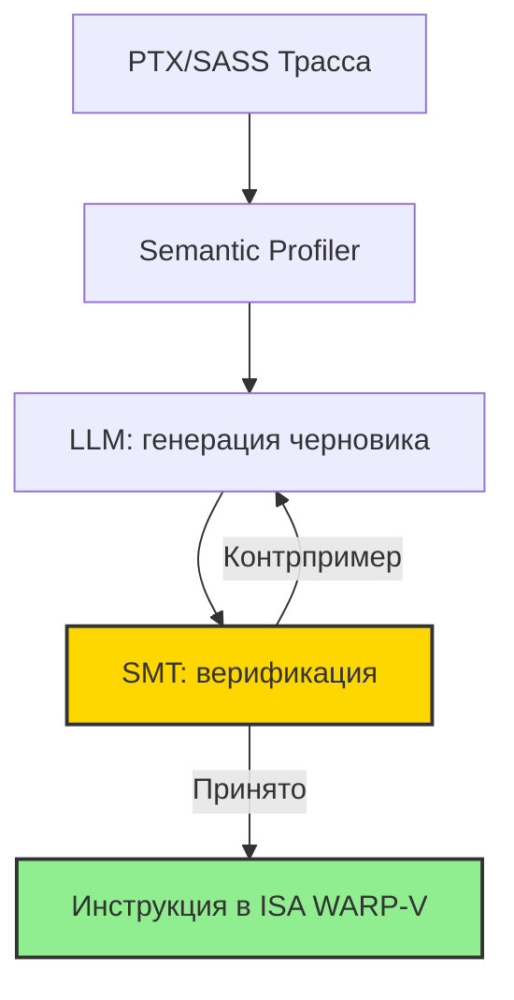

### 3.4. Детальный процесс фарминга

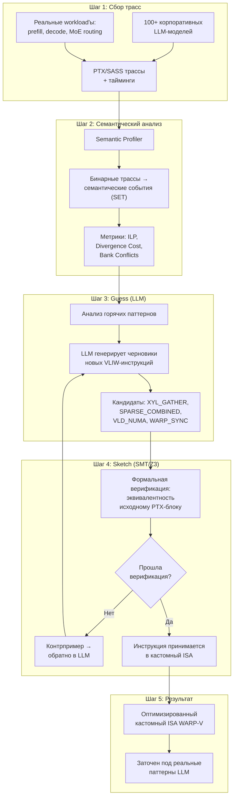

**Описание схемы:** Процесс фарминга состоит из пяти последовательных шагов с петлёй обратной связи. Сначала собираются PTX/SASS-трассы со ста и более корпоративных LLM-моделей под реальной нагрузкой (prefill, decode, MoE-роутинг). Semantic Profiler преобразует бинарные трассы в семантические события и вычисляет архитектурно-критичные метрики: ILP, стоимость расхождения потоков, банковские конфликты. Затем LLM (фаза Guess) анализирует горячие паттерны и генерирует черновики новых VLIW-инструкций — кандидатов вроде XYL_GATHER или SPARSE_COMBINED. SMT-верификатор (фаза Sketch) формально проверяет семантическую эквивалентность предложенной инструкции исходному PTX-блоку; при провале возвращается контрпример, и LLM генерирует исправленную версию. Успешно верифицированные инструкции попадают в кастомный ISA WARP-V, «выращенный» на реальных данных.


### 3.5. Почему фарминг критически важен: цифры и факты

| Аспект | Без фарминга | С фармингом (Guess & Sketch) |
|:---|:---|:---|
| **Выбор инструкций** | Экспертные догадки | Данные реальных workload'ов |
| **Покрытие горячих точек** | ~60–70% | >95% (покрыты трассами) |
| **Корректность** | Ручное тестирование | Формальная SMT-верификация |
| **Адаптивность к новым моделям** | Редизайн ISA | Дообучение на новых трассах |
| **Время на новую инструкцию** | Месяцы | Дни (LLM-цикл) |
| **Связь с архитектурой** | Разрыв HW/SW | Ко-эволюция через ADL |

### 3.6. Пример результата фарминга: инструкция SPARSE_COMBINED

Рассмотрим конкретный пример того, что может «вырасти» из фарминга:

**Наблюдение в трассах NVIDIA:** В MoE-моделях (Mixtral, Llama-3-MoE) горячий паттерн — последовательность из 5–6 kernel'ов: Gather → PTS (Predictive Tile Selection) → Top-K → Sparse MMA → VAR (Variable Accumulate Reduce). Каждый kernel запускается отдельно, создавая накладные расходы на запуск и перемещение данных через HBM.

**Guess (LLM):** Предлагает макро-инструкцию `SPARSE_COMBINED`, объединяющую весь пайплайн в одну VLIW-инструкцию с конфигурационной битовой маской (pattern 2:4/4:8/8:16/16:32, режимы PTS, режимы VAR).

**Sketch (SMT):** Доказывает, что для всех допустимых входов результат `SPARSE_COMBINED(X, W, coords, config)` побитово эквивалентен последовательному выполнению исходных 5–6 PTX-блоков (с точностью до порядка операций с плавающей точкой, оговорённого в спецификации).

**Результат:** Одна инструкция заменяет 5–6 kernel'ов, выполняется за ~24 такта, устраняет промежуточные записи в HBM. Это и есть «скопированная оптимальность» — мы не скопировали SASS-код NVIDIA, а **извлекли принцип** и реализовали его на своей архитектуре формально корректным образом.

**Резюме:**

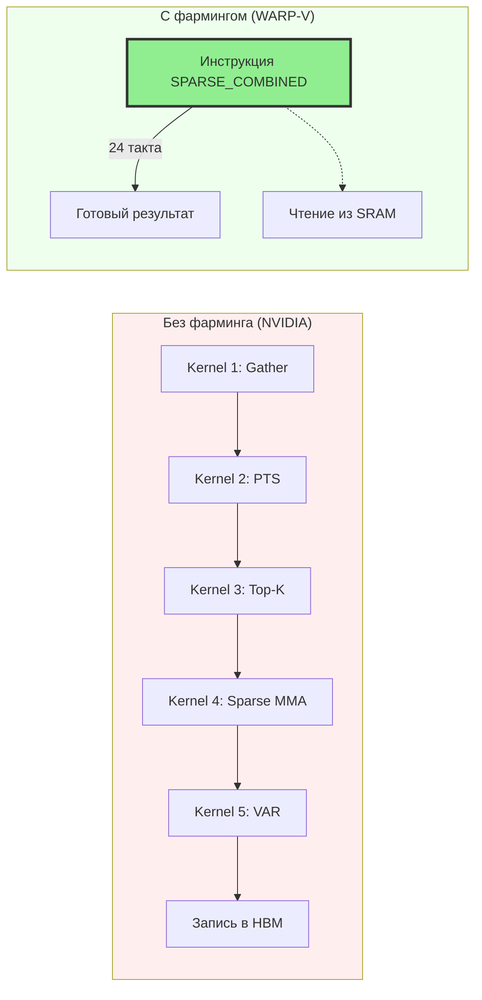

### 3.7. Примеры фарминга load-multiply-add, Sparse Attention, KV-Cache Management

**Пример 1: CNN load-multiply-add**

Анализ трасс показывает, что паттерн `load → mul → add` является "горячей точкой". LLM предлагает создать инструкцию `vliw.mac_bundle`, которая выполняет все три операции за один такт. SMT проверяет семантическую эквивалентность. Результат: одна VLIW-инструкция вместо цикла из десятков инструкций.

**Пример 2: Sparse Attention**

Анализ трасс FlashAttention показывает, что оптимальная стратегия — это **совместная оптимизация SWP и WS** . LLM предлагает инструкцию `warpv.sparse_combined`, которая выполняет весь пайплайн (Gather → PTS → Top-K → Sparse MMA → VAR) за 24 такта.

**Пример 3: KV-Cache Management**

Анализ decode-фазы LLM показывает, что основное "бутылочное горлышко" — это управление KV-кэшем. LLM предлагает набор инструкций: `QUANTIZE_BLOCK`, `LOAD_PAGE_TABLE_ENTRY`, `EVICT_BLOCK`.

Это один из самых важных примеров, потому что он напрямую касается "стены памяти", которую мы пытаемся преодолеть. В decode-фазе LLM бутылочным горлышком является не вычисление, а **перемещение данных**. Мы можем построить бесконечно мощный вычислитель, но он будет простаивать в ожидании KV-кэша из памяти.

Детально разберем, как работает этот "бутылочное горлышко" и как наш компилятор с новыми инструкциями его разрушает.

---

### 🧠 Проблема: Почему KV-Cache — это "стена памяти"?

В LLM инференсе есть два этапа: **Prefill** (обработка входного промпта) и **Decode** (генерация токенов). Именно на decode-этапе проблема KV-кэша становится критической .

1.  **Экспоненциальный рост:** На каждый запрос модель сохраняет ключи (K) и значения (V) для всех предыдущих токенов. Чем длиннее контекст и чем больше пользователей, тем быстрее этот кэш съедает всю доступную память. Для модели вроде Llama-3-70B на длинном контексте объем кэша может достигать сотен гигабайт .
2.  **Memory-Bound, а не Compute-Bound:** В decode-фазе каждый новый токен требует загрузки всего KV-кэша для этого запроса из памяти в вычислительные блоки. Это не вычисления, это **перемещение данных**. И это перемещение упирается в пропускную способность памяти (HBM bandwidth). GPU простаивает в ожидании данных, а не считает .
3.  **Проблема "маленьких I/O":** Современные системы, как vLLM, используют **PagedAttention** для борьбы с фрагментацией памяти. Они разбивают кэш на маленькие физические блоки . Однако это создает новую проблему: когда мы удаляем (evict) "ненужные" токены, эти токены разбросаны по разным блокам. В итоге, мы можем удалить 90% токенов логически, но физически почти ни один блок памяти не освободится, потому что в каждом остался хотя бы один "важный" токен . Это приводит к колоссальному перерасходу памяти и неэффективности.

---

### 🔧 Решение: Трехступенчатая аппаратная атака на KV-Cache

Наш подход — не пытаться управлять этим хаосом программно, а **вынести критически важные операции на аппаратный уровень** через специализированные инструкции, которые компилятор будет упаковывать в VLIW-бандлы.

#### Инструкция 1: `QUANTIZE_BLOCK` — Сжатие на лету

**Проблема:** Хранить все ключи и значения в FP16 или FP32 — это невероятно расточительно.
**Решение:** Аппаратный блок квантования, управляемый инструкцией `QUANTIZE_BLOCK`.

- **Функция:** Инструкция принимает блок данных (например, 64 токена) и формат (FP4, INT8) и на лету сжимает его перед записью в память, и, что критично, **де-квантует** его при загрузке обратно для вычислений .
- **Преимущество для компилятора:** Вместо того чтобы генерировать цикл из загрузок, умножений на скаляр и сохранений, компилятор вставляет одну инструкцию `QUANTIZE_BLOCK`. Это не только экономит память, но и освобождает вычислительные слоты VLIW для других задач.
- **VLIW-интеграция:** В 8-issue бандле мы можем разместить `QUANTIZE_BLOCK` в одном слоте, а в соседнем — начать подготовку данных для следующей итерации вычислений, скрывая латентность квантования.

---

#### Инструкция 2: `LOAD_PAGE_TABLE_ENTRY` — Умный доступ к фрагментированной памяти

**Проблема:** PagedAttention создает таблицу страниц, чтобы отслеживать, где физически находятся данные. Каждый раз, обращаясь к кэшу, софт должен сначала загрузить запись из этой таблицы, что создает накладные расходы .
**Решение:** Инструкция `LOAD_PAGE_TABLE_ENTRY` превращает этот программный lookup в аппаратную операцию.

- **Функция:** Инструкция принимает логический адрес токена и мгновенно возвращает физический адрес блока в SRAM/HBM, используя аппаратный MMU (блок управления памятью). Это делает доступ к кэшу таким же быстрым и предсказуемым, как доступ к обычному массиву.
- **Преимущество для компилятора:** Компилятор может статически планировать загрузку записей таблицы страниц за много тактов до того, как они реально понадобятся, полностью скрывая эту задержку.
- **VLIW-интеграция:** `LOAD_PAGE_TABLE_ENTRY` — это идеальная операция для "скрытия задержек" в VLIW-бандле. Пока ALU считает матричное умножение, инструкция памяти может в фоне готовить адреса для следующего шага.

---

#### Инструкция 3: `EVICT_BLOCK` — Детерминированная утилизация мусора

**Проблема:** Как мы выяснили, программное вытеснение (eviction) токенов неэффективно и оставляет "островки" памяти.
**Решение:** Инструкция `EVICT_BLOCK` для аппаратного блока управления кэшем, который работает на уровне целых физических страниц.

- **Функция:** Инструкция не просто помечает токен как "мусор". Она работает с аппаратным LRU-списком на уровне **страниц** (физических блоков). Когда алгоритм решает, что страница больше не нужна, `EVICT_BLOCK` мгновенно очищает всю страницу и возвращает ее в пул свободной памяти. Это решает проблему фрагментации на корню.
- **Интеграция с алгоритмом:** Это не замена алгоритму вытеснения (например, на основе важности токена). Это аппаратный **исполнитель**, который делает процесс вытеснения атомарным и не создающим фрагментации.
- **VLIW-интеграция:** `EVICT_BLOCK` может быть запланирован на те такты, когда вычислительные блоки и так заняты, что делает управление памятью практически "бесплатным".

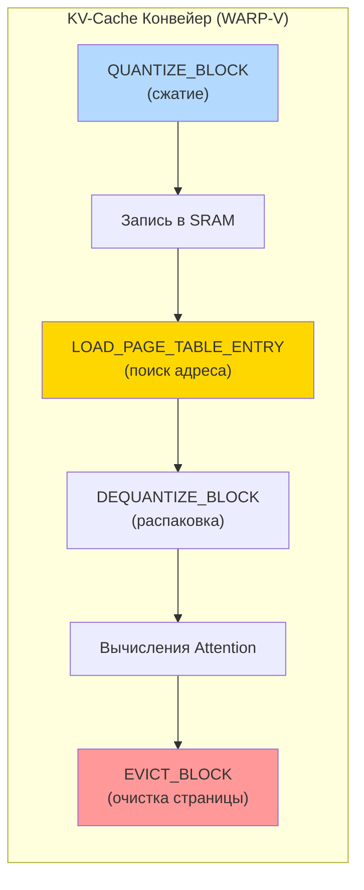

**Описание схемы:** Три инструкции работают в связке. Схема показывает конвейер их взаимодействия.

---

### 🏗️ Как это работает в конвейере компилятора (WARP-V)

Наш MLIR-компилятор "видит" высокоуровневый паттерн decode-фазы и применяет эти инструкции:

1.  **Анализ:** Компилятор распознает цикл генерации токена и обращение к KV-кэшу.
2.  **Трансформация:** Высокоуровневые операции (`linalg.generic` для attention) заменяются на наш набор инструкций.
    > `matmul` для Q*K заменяется на последовательность `LOAD_PAGE_TABLE_ENTRY` + `DEQUANTIZE_BLOCK` (загрузка и распаковка кэша) + `matmul`.
    > Операции сохранения нового токена в кэш заменяются на `QUANTIZE_BLOCK` + `STORE`.
    > Операция сброса кэша заменяется на `EVICT_BLOCK`.
3.  **Планирование:** Поскольку мы работаем с VLIW, компилятор может упаковать `LOAD_PAGE_TABLE_ENTRY` для следующего токена в тот же бандл, где исполняется `matmul` для текущего. Это называется **скрытие задержек доступа к памяти**, и в статической VLIW-архитектуре это работает идеально предсказуемо.

### 💎 Итог

Этот пример отлично демонстрирует нашу философию: мы не боремся со сложностью на уровне софта. Мы идентифицируем "бутылочное горлышко" (в данном случае, управление памятью в decode-фазе) и **выносим его решение на аппаратный уровень с помощью новых инструкций**. Компилятор затем просто использует эти инструкции как высокоэффективные "кирпичики" для построения детерминированного, сверхбыстрого конвейера. Это и есть путь к преодолению "стены памяти", за который NVIDIA заплатила $20 млрд, интегрируя Groq.

---

## 🧱 4. ЭТАП 2: Реализация через MLIR = LEGO-Compiler

### 4.1. Почему именно MLIR: три доказательства

**Доказательство 1: Groq так делает.** Согласно открытым источникам, компилятор Groq построен на MLIR (frontend) и Haskell (backend):

> «The front-end of the compiler is based on MLIR, consuming ONNX from PyTorch, as well as our own linear algebra representation... the back-end uses a custom intermediate representation and is written in Haskell.»

В вакансиях Groq прямо указано: «Ideal candidates have experience with LLVM and MLIR». Если мы претендуем на уровень Groq — мы обязаны воспроизвести их архитектурный выбор там, где он доказал эффективность.

**Доказательство 2: MLIR создан для нашей задачи.** Нам нужно:
- Представлять высокоуровневые AI-операции (attention, MoE routing);
- Оптимизировать через tiling, fusion, векторизацию;
- Генерировать VLIW-код с аппаратно-специфичными инструкциями (XYL_GATHER, SPARSE_COMBINED);
- Интегрироваться с ONNX/PyTorch.

Всё это — «родная» функциональность MLIR.

**Доказательство 3: LLVM — финишная прямая, а не весь путь.** В Groq-подходе LLVM (или кастомный Haskell-бэкенд) используется только на последнем этапе. Все оптимизации, планирование и трансформации происходят в MLIR.

### 4.2. MLIR vs классический VLIW-компилятор: смена парадигмы

| Критерий | Классический VLIW-компилятор | MLIR-компилятор для WARP-V |
|:---|:---|:---|
| **Основная цель** | Компиляция общего кода | Гибкая разработка AI-компиляторов |
| **Уровень абстракции** | Низкий (LLVM IR ≈ ассемблер) | Многоуровневый (тензоры → бандлы) |
| **Гибкость для AI** | Низкая (tiling/fusion трудоёмки) | Высокая (Linalg, TOSA «из коробки») |
| **Многоядерность** | Ручное управление | Диалекты параллелизма |
| **Гетерогенность** | Слабая | Нативная (смешивание диалектов) |
| **Новые архитектуры** | Долго и дорого | Создание диалекта — стандартная практика |
| **Формальные методы** | Внешние инструменты | Встраиваются как pass/verifier |

### 4.3. LEGO-Compiler: модульная философия

LEGO-Compiler — это принцип, при котором компилятор собирается из независимых, формально верифицированных «кирпичиков»:

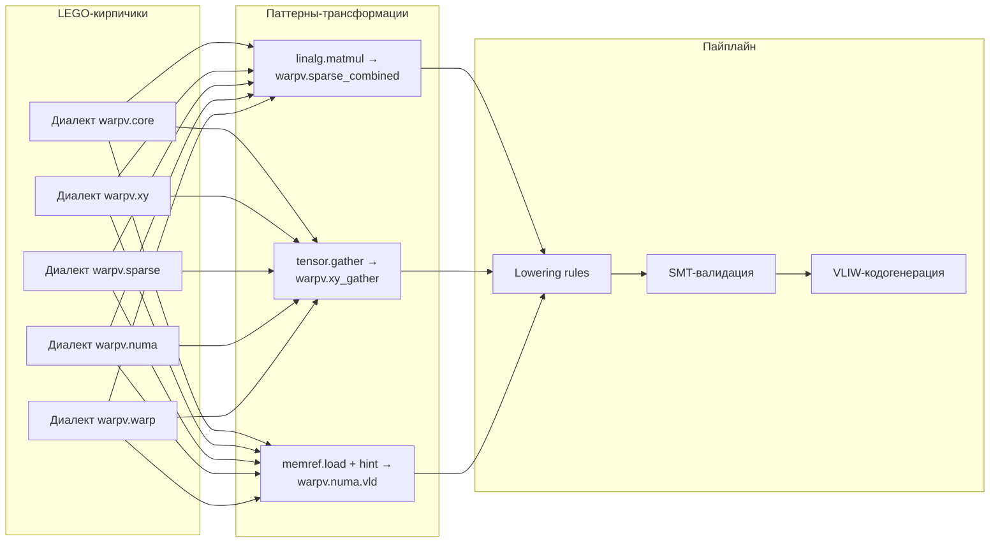

**Описание схемы:** LEGO-подход означает, что каждый суб-диалект `warpv.*` — это независимый модуль со своими операциями, верификаторами и правилами понижения. Паттерны-трансформации связывают высокоуровневые операции (linalg, tensor, memref) с низкоуровневыми инструкциями WARP-V. Такой дизайн позволяет добавлять новые инструкции, «выращенные» фармингом, без модификации ядра компилятора: новый кирпичик просто вставляется в существующий каркас. Это делает компилятор **адаптивным** — он эволюционирует вместе с ISA, не требуя переписывания.

**Резюме:**

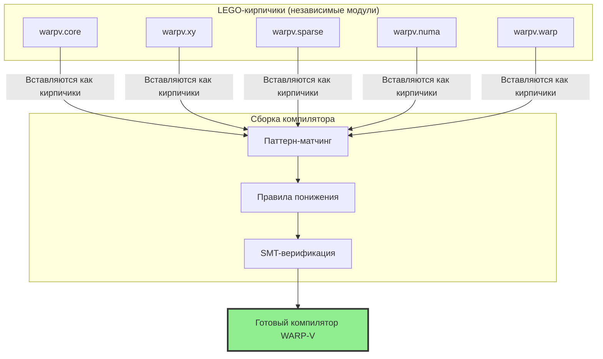

---

## 🛠️ 5. Пошаговый план: от VLIW LLVM к MLIR

### 5.1. Стратегия эволюции (не революция)

Мы не переписываем мир, а **эволюционируем** существующую инфраструктуру LLVM в сторону MLIR-экосистемы. Это проверенная стратегия AMD, Xilinx, Intel.

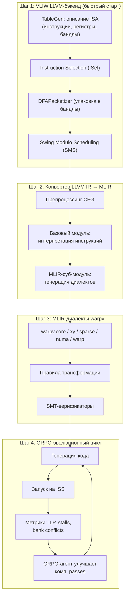

**Описание схемы:** План состоит из четырёх шагов. **Шаг 1** — быстрый старт: собираем классический VLIW LLVM-бэкенд, описывая ISA через TableGen, реализуя ISel, пакетизацию через DFAPacketizer и software pipelining через Swing Modulo Scheduling. **Шаг 2** — строим конвертер LLVM IR → MLIR, который не оптимизирует, а просто транслирует код (принцип Preserve Program Structure), разделяя обработку базовых блоков и контрольного потока. **Шаг 3** — создаём MLIR-диалекты `warpv.*` с правилами трансформации и SMT-верификаторами. **Шаг 4** — интегрируем GRPO-эволюционный цикл: компилятор генерирует код, ISS его исполняет, метрики возвращаются в GRPO-агент, который улучшает компиляторные пассы. Это замыкает петлю ко-эволюции HW/SW.

**Резюме:** 

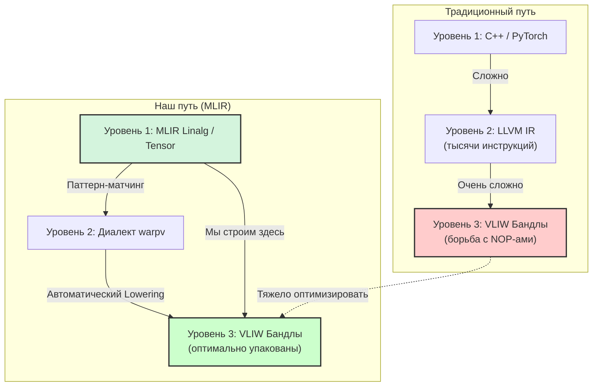

### 5.2. Детализация шагов

#### Шаг 1: VLIW LLVM-бэкенд

| Подшаг | Действие | Результат |
|:---|:---|:---|
| 1.1 | Описание ISA через TableGen (.td) | Инструкции, регистры, форматы бандлов |
| 1.2 | Реализация ISel | Сопоставление LLVM IR ↔ VLIW-инструкции |
| 1.3 | Настройка DFAPacketizer | Группировка в VLIW-бандлы по DFA |
| 1.4 | Swing Modulo Scheduling | Software pipelining циклов |
| 1.5 | Референс: Hexagon + Kalray KVX | Проверенные VLIW-бэкенды LLVM |

---

#### Шаг 2: Конвертер LLVM IR → MLIR

Три варианта реализации (в порядке предпочтения):

| Вариант | Описание | Плюсы | Минусы |
|:---|:---|:---|:---|
| **A: SYCLops-адаптация** | Модифицируем SYCLops под наши диалекты | Готовая инфраструктура | Нужна адаптация |
| **B: LLVM Pass** | Свой проход по IR с генерацией MLIR-текста | Полный контроль | Больше работы |
| **C: MLIR → LLVM (рекомендуемый)** | Описываем в MLIR, понижаем через `convert-to-llvm` | Нативный путь MLIR | Требует MLIR-first мышления |

**Принципы конвертера:**
1. **Preserve Program Structure** — конвертер не оптимизирует, только транслирует;
2. **Block and CFG Separation** — раздельная обработка базовых блоков и контрольного потока;
3. **Extensibility** — возможность разных бэкендов (MLIR, TVM/AKG).

---

#### Шаг 3: MLIR-диалекты для новых инструкций

Полный пайплайн добавления инструкций (XYL_GATHER, SPARSE_COMBINED, VLD_NUMA, WARP_SYNC):

**Подшаг 3.1: Определение диалекта в TableGen.** Создаём контейнер `warpv` со всеми суб-диалектами:

| Диалект | Назначение | Примеры операций |
|:---|:---|:---|
| `warpv.core` | Базовые операции | ALU, MUL, LSU, BR |
| `warpv.xy` | XYL-движок | xy_gather, mask_gen, top_k |
| `warpv.sparse` | Разреженные вычисления | sparse_combined, pts, var |
| `warpv.numa` | NUMA-загрузки | vld_numa, prefetch_numa |
| `warpv.warp` | Warp Specialization | warp_sync, barrier |

**Подшаг 3.2: Определение операций через ODS.** Каждая инструкция описывается декларативно: синтаксис, аргументы (MemRef, атрибуты pattern/numa_mask/dist_mode), результаты, кастомный assembly format, верификатор.

**Подшаг 3.3: Правила трансформации (Patterns).** Описываем, как высокоуровневые операции транслируются в наши инструкции:
- `linalg.matmul` + sparsity → `warpv.sparse_combined`;
- `tensor.gather` → `warpv.xy_gather`;
- `memref.load` + NUMA hint → `warpv.numa.vld`.

**Подшаг 3.4: Логика операций в C++.** Верификаторы (проверка поддерживаемых N:M паттернов, SIMD-выравнивание координат, границы NUMA-маски) реализуются императивно.

**Подшаг 3.5: Transform Dialect (опционально).** Декларативное управление оптимизациями прямо из MLIR-кода.

**Подшаг 3.6: Python-интеграция (опционально).** Через IRDL bindings можно определять диалекты прямо из Python — удобно для быстрого прототипирования с GRPO-агентом.

**Преимущества подхода:**
- **Модульность:** не трогаем ядро MLIR/LLVM;
- **Безопасность:** изолированные диалекты не ломают существующую инфраструктуру;
- **Автоматизация:** ODS генерирует парсеры, принтеры, верификаторы;
- **Гибкость:** можно определить и на C++, и на Python.

---

#### Шаг 4: Интеграция с GRPO-циклом

MLIR-пассы генерируют и оптимизируют VLIW-код, а GRPO-агент анализирует метрики и предлагает улучшения.

### 5.3 Добавление новых инструкций в MLIR

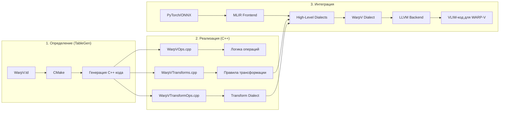

### 5.4. Таблица «Где мы сейчас» vs «Где должны быть»

| Компонент | Текущее состояние (LLVM) | Что нужно добавить для WARP-V |
|:---|:---|:---|
| ISA Description | Стандартные VLIW-ISA | Кастомные диалекты (XYL, Sparse, NUMA) |
| Instruction Selection | LLVM ISel | Поддержка новых инструкций |
| VLIW Scheduler | MachineScheduler | Учёт NUMA-задержек, XYL-латентностей |
| VLIW Packetizer | DFAPacketizer | Новые ресурсные модели (XYL, Warp Sync) |
| Backend | Стандартный кодогенератор | Генерация VLIW-бандлов WARP-V |
| Runtime Integration | Отсутствует | WARP_SYNC, Producer/Consumer |
| Формальные методы | Нет | SMT-верификация расписаний (Twill-подход) |
| GRPO-интеграция | Нет | Петля обратной связи с ISS |

---

## 🌐 6. Альтернативы и сравнение: Groq vs Kalray vs NVIDIA

### 6.1. Куда идёт NVIDIA: путь Groq или Kalray?

**Однозначный ответ: NVIDIA пошла по пути Groq.** Компания не просто интегрирует идеи VLIW и статического планирования — она покупает саму Groq и её технологии, чтобы решить проблему «стены памяти» в инференсе.

### 6.2. Сравнительная таблица архитектурных подходов

| Характеристика | Программный конвейер GPU (Hopper) | Аппаратный конвейер Groq TSP | Kalray MPPA | **WARP-V (наш)** |
|:---|:---|:---|:---|:---|
| **Фундаментальный принцип** | Динамическое планирование + компиляторные хаки | Полное статическое планирование в кремнии | Many-core VLIW с кэшами | **Гибрид: статический конвейер варп-групп + SIMT-стек** |
| **Источник детерминизма** | Компиляторные расчёты (Twill) | Свойство железа | Частичный (кэши вносят джиттер) | **VLIW на макроуровне, SIMT-стек на микроуровне** |
| **Управление памятью** | Динамическое (HBM + кэши) | Потоковое через SRAM (230 МБ) | Кэши + scratchpad | **NUMA-осведомлённое SRAM + TCA** |
| **Внешняя память** | HBM/GDDR | Не используется (только SRAM) | DDR | **Гибрид: SRAM для decode, DRAM для prefill** |
| **Вычислительная модель** | Массовый параллелизм варпов | Functional Slices + streaming | Кластеры VLIW-ядер | **VLIW-кластеры + SIMT-эмуляция** |
| **MoE-поддержка** | Divergence penalty | Stall конвейера | Ограниченная | **Нулевой штраф через индивидуальные PC** |
| **Целевые задачи** | Throughput | Ultra-low latency decode | Edge/HPC | **Decode + MoE + детерминизм** |

---

| Характеристика | WARP-V (наш подход) | Groq LPU | Kalray MPPA |
|---|---|---|---|
| **Планирование** | Статическое (MLIR) | Статическое (Haskell+MLIR) | Статическое (VLIW) |
| **Память** | SRAM + NUMA-aware | SRAM только | Кэши + SRAM |
| **Детерминизм** | Полный | Полный | Частичный (кэши) |
| **WARP-эмуляция** | Аппаратный SIMT-стек | Отсутствует | Отсутствует |
| **MoE-ветвление** | Параллельное (без штрафа) | Последовательное (stall) | Последовательное |
| **Компилятор** | MLIR-based | MLIR + Haskell | LLVM-based |
| **Масштабирование** | Через сеть (NUMA) | Через сеть (Dragonfly) | Через Many-Core |

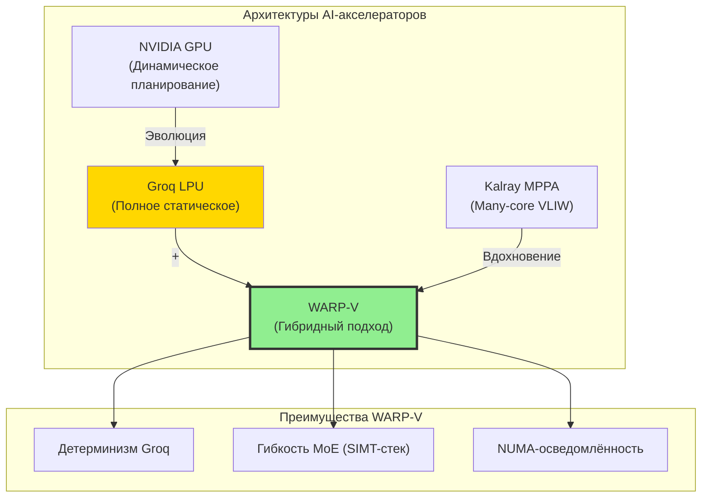

### 6.3. Сравнение стратегий масштабирования

| Параметр | NVIDIA+Groq | Kalray | **WARP-V** |
|:---|:---|:---|:---|
| **Масштабирование памяти** | Гибрид HBM + SRAM (128 ГБ в Groq 3 LPX) | Many-core с DDR | NUMA-кластеры с распределённой SRAM |
| **Модель 1T параметров** | ~1 ТБ SRAM (8 кластеров Groq 3 LPX) | Нецелевая | Гибрид + квантизация (RealScale-аналог) |
| **Сеть** | NVLink + Groq Dragonfly | NoC внутри чипа | Intercluster Datapath + NoC |
| **Компилятор** | CUDA + MLIR/Triton + Groq compiler | GCC/LLVM KVX | **MLIR + SMT + GRPO-эволюция** |

### 6.4. Почему наш подход выигрывает в нише MoE

| Архитектура | Механизм ветвления MoE | Divergence Penalty | Детерминизм |
|:---|:---|:---|:---|
| NVIDIA GPU | Аппаратный планировщик, маскирование | **Высокий** | ❌ |
| Groq TSP | Статическое планирование | **Критический** (stall) | ✅ |
| Kalray | Ручное/runtime | Средний | Частичный |
| **WARP-V** | **Индивидуальные PC + SIMT-стек + статический конвейер** | **Нулевой** | ✅ |

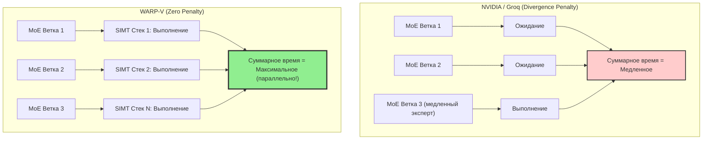

**Формулировка для инвесторов:** Наш подход — единственный способ соединить эффективность статического VLIW-планирования с гибкостью, необходимой для MoE-моделей. Вместо борьбы с непредсказуемым ветвлением мы **сегментируем** его на уровне аппаратуры: компилятор строит детерминированный конвейер из WARP-групп (как в Groq), а внутри каждой группы VLIW-кластеры эмулируют SIMT-потоки через аппаратный SIMT-стек (как в NVIDIA). Это позволяет параллельно и без штрафа обрабатывать выбор экспертов, сохраняя полную предсказуемость времени выполнения.

---

## 🧪 7. Примеры оптимизаций: от паттерна к инструкции

### 7.1. Пример 1: CNN `load-multiply-add` (VLIW MAC-Block)

**Задача:** Заменить цикл из загрузки, умножения и сложения на одну специализированную инструкцию `vliw.mac_bundle`.

**Реализация в MLIR:**
1. Создаётся диалект `vliw`;
2. Добавляется операция `vliw.mac` с нужными аргументами;
3. Паттерн ищет последовательность `load → mul → add` из `linalg` и заменяет на одну `vliw.mac`;
4. Компилятор генерирует одну VLIW-инструкцию вместо цикла из десятков.

**Вывод:** Идеальный пример для MLIR — декларативное описание «что найти и на что заменить».

### 7.2. Пример 2: FlashAttention (снятие Memory Bottleneck)

**Задача:** Интегрировать специализированный блок FlashAttention с инструкциями `QUANTIZE_BLOCK`, `LOAD_PAGE_TABLE_ENTRY`, `EVICT_BLOCK`.

**Реализация в MLIR:**
1. Создаются диалекты `kv`, `mmu`, `cache`;
2. В каждом — соответствующие операции;
3. Пайплайн правил заменяет общий Attention на кастомный;
4. MLIR описывает иерархию памяти (SRAM/HBM) и перемещения данных;
5. Валидация через SMT-решатели гарантирует корректность трансформаций.

**Вывод:** Сложный, но реализуемый случай — MLIR описывает не только инструкцию, но и контекст (память, зависимости).

### 7.3. Пример 3: Разреженные свёртки (индексный доступ)

**Задача:** Инструкция `sparse_conv_vliw`, работающая с `[values]` и `[indices]`, пропускающая нулевые операции.

**Реализация в MLIR:**
1. Встроенный диалект `sparse` MLIR расширяется до `sparse_vliw`;
2. Операция принимает два массива (значения, индексы) и выполняет MAC только по заданным индексам;
3. Трансформация заменяет `linalg.matmul` на `sparse_vliw.conv` с учётом формата CSR/CSC.

**Вывод:** Классический пример — MLIR имеет встроенную поддержку разреженных тензоров.

### 7.4. Сводная таблица реализуемости

| Требование | Пример 1 (CNN) | Пример 2 (FlashAttention) | Пример 3 (Sparse) |
|:---|:---:|:---:|:---:|
| Создание новых инструкций | ✅ | ✅ | ✅ |
| Сопоставление с образцом | ✅ | ✅ | ✅ |
| Управление памятью | ❌ | ✅ | ✅ |
| Интеграция с верификацией | ✅ | ✅ | ✅ |

**Ключевые механизмы MLIR для всех примеров:**
1. **ODS** — декларативное описание инструкций;
2. **Rewrite Patterns (DRR)** — замена конструкций высокоуровневых диалектов на кастомные;
3. **Transform Dialect** — декларативное управление оптимизациями;
4. **MemRef/Bufferization** — контроль перемещений SRAM/HBM;
5. **Модульность** — встраивание SMT-верификаторов.

---

## 🌉 8. Интеграция с NNTile: Схема «Два моста»

### 8.1. Ключевой инсайт: NNTile и MLIR говорят на одном языке

NNTile — фреймворк на **task-based параллелизме** через StarPU: граф задач (DAG), работающих с тайлами. MLIR оперирует тензорами и диалектами. **Тайл — это частный случай тензора**, а задача DAG — это операция MLIR. Это делает интеграцию естественной.

### 8.2. Архитектура «Двух мостов»

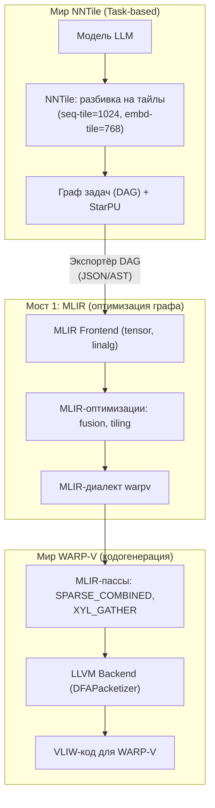

**Описание схемы:** Архитектура разделена на три мира. В мире NNTile модель разбивается на тайлы (параметры типа `--seq-tile=1024`), строится DAG задач под управлением StarPU. Вместо прямой передачи задач на исполнение, DAG экспортируется через конвертер (JSON или AST) в MLIR — это **Мост 1**. В MLIR граф проходит оптимизации (fusion, tiling) и трансформируется в диалект `warpv`. **Мост 2** ведёт в мир WARP-V: MLIR-пассы применяют специализированные инструкции (SPARSE_COMBINED, XYL_GATHER), LLVM-бэкенд выполняет пакетизацию и генерирует финальный VLIW-код.

**Резюме:**

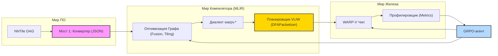

### 8.3. Почему НЕ нужно дорабатывать код NNTile

| Подход | Что делаем | Сложность | Гибкость | Производительность |
|:---|:---|:---|:---|:---|
| Доработка NNTile | Встраиваем MLIR в ядро фреймворка | Высокая | Низкая (привязка к версии) | Средняя |
| **MLIR-фронтенд** | Экспортируем DAG, транслируем внешним инструментом | Средняя | Высокая | Высокая |

**Правильная архитектура:** строим интеграционный слой (по образцу ARIES для AMD AI Engine, где Python-декораторы `@task_tile` транслируются в MLIR-диалекты `adf.func`/`adf.kernel`):
1. Оставляем NNTile как есть;
2. Создаём «экспортёр» DAG в промежуточный формат;
3. Пишем MLIR-фронтенд для этого формата;
4. Применяем MLIR-оптимизации;
5. Генерируем код для WARP-V.

**Резюме:** NNTile — «оркестр» (знает, какие задачи выполнять). MLIR — «дирижёр» (знает, как их оптимально выполнить на нашей аппаратуре). Они не должны быть одним целым — они должны взаимодействовать через чёткий интерфейс.

---

## 🔄 9. Эволюционный цикл: GRPO + Фарминг + MLIR

### 9.1. Замкнутая петля ко-эволюции

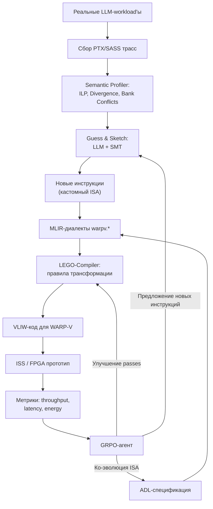

**Описание схемы:** Эволюционный цикл замыкает все этапы в единую петлю. Реальные LLM-workload'ы порождают трассы, которые анализируются Semantic Profiler'ом. Guess & Sketch генерирует новые инструкции, формализованные в MLIR-диалектах. LEGO-Compiler трансформирует модели в VLIW-код, который исполняется на ISS или FPGA-прототипе. Метрики (throughput, latency, energy) поступают в GRPO-агент, который воздействует на три точки: улучшает компиляторные пассы, предлагает новые инструкции для следующего цикла фарминга и корректирует ADL-спецификацию для ко-эволюции ISA. Это и есть «адаптивный компилятор» — система, которая не догоняет NVIDIA, а **изначально затачивается под актуальные задачи**.

### 9.2. Полный пайплайн: От трасс NVIDIA до VLIW-кода

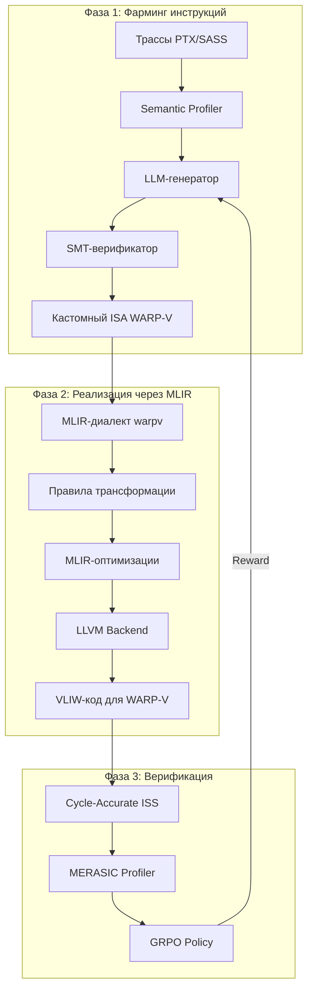

### 9.3. Роль каждого компонента

| Компонент | Роль | Аналогия |
|:---|:---|:---|
| **Фарминг (Guess & Sketch)** | R&D-инструмент: открытие новых инструкций | Разведчик |
| **MLIR (LEGO-Compiler)** | Инженерный инструмент: формальная реализация | Строитель |
| **SMT-верификатор** | Гарантия корректности | Контролёр качества |
| **GRPO-агент** | Эволюционная оптимизация | Тренер |
| **ADL-спецификация** | Единый источник истины HW/SW | Чертёж |
| **Компилятор в целом** | Дирижёр всех вычислительных ресурсов | Дирижёр оркестра |

---

## 📊 10. Сравнение сроков и рисков

| Аспект | Традиционный путь (с нуля) | Наш путь (LLVM → MLIR эволюция) |
|:---|:---|:---|
| Скорость разработки | 12–18 месяцев | **6–9 месяцев** |
| Риск | Высокий (всё с нуля) | **Низкий** (проверенный LLVM) |
| Качество кода | Зависит от команды | **Высокое** (десятилетия оптимизаций LLVM) |
| Поддержка новых инструкций | Сложно | **Легко** (MLIR-диалекты) |
| Интеграция с GRPO | Отсутствует | **Нативная** (MLIR-пассы) |
| Ко-эволюция HW/SW | Невозможна | **Автоматическая** (ADL → оба стека) |

---

## 🎯 11. Дорожная карта проекта

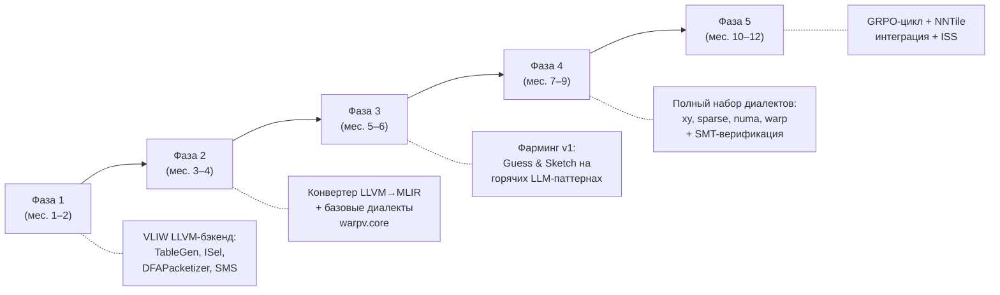

**Описание схемы:** Дорожная карта разбита на пять фаз. **Фаза 1** (месяцы 1–2) — быстрый старт с VLIW LLVM-бэкендом: описание ISA через TableGen, реализация ISel, пакетизатора и Swing Modulo Scheduling. **Фаза 2** (месяцы 3–4) — построение конвертера LLVM→MLIR и базового диалекта `warpv.core`. **Фаза 3** (месяцы 5–6) — первый цикл фарминга на горячих LLM-паттернах. **Фаза 4** (месяцы 7–9) — полный набор диалектов (xy, sparse, numa, warp) с SMT-верификацией. Фаза 5 (месяцы 10–12) — замыкание GRPO-цикла, интеграция с NNTile и полноценный ISS.

---

## 💎 12. Итоговые выводы

### 12.1. Стратегическая формула победы

Наша стратегия — это не просто создание компилятора, а создание **«адаптивного» компилятора**:

- **MLIR** даёт мощный каркас для оптимизаций;
- **Фарминг** даёт данные о том, какие именно оптимизации нужны;
- **SMT** гарантирует формальную корректность каждой трансформации;
- **GRPO** замыкает петлю эволюции;
- **ADL** обеспечивает ко-эволюцию HW/SW.

Вместо того чтобы гадать, какую инструкцию добавить, мы «выращиваем» её на основе реальных данных о работе SOTA-моделей. Это позволяет не догонять NVIDIA, а создавать архитектуру, которая **изначально заточена под решение самых актуальных задач**.

- **Guess & Sketch** — R&D-инструмент для открытия новых, эффективных инструкций на основе реальных данных .
- **MLIR (LEGO-Compiler)** — инженерный инструмент для формальной реализации этих инструкций .

**MLIR дает мощный каркас для оптимизаций**, а **"фарминг" дает данные о том, какие именно оптимизации нужны**. Вместо того чтобы гадать, какую инструкцию добавить, мы "выращиваем" ее на основе реальных данных о работе SOTA-моделей .

**Это позволяет не догонять NVIDIA, а создавать архитектуру, которая изначально "заточена" под решение самых актуальных задач инференса.**

### 12.2. Пять ключевых тезисов

1. **Компилятор — это дирижёр.** Эра, когда производительность определялась только аппаратными характеристиками, закончилась. Компиляторный стек становится ключевым фактором реальной производительности и предсказуемости.

2. **MLIR — архитектурный императив.** Groq использует MLIR на фронте своего компилятора. Мы делаем то же самое для WARP-V, расширяя кастомными диалектами под нашу уникальную архитектуру.

3. **Фарминг — это расшифровка оптимальности.** Мы не крадём код NVIDIA, а извлекаем требования к производительности из реальных трасс и формально воспроизводим их на своём ISA.

4. **LEGO-подход обеспечивает масштабируемость.** Каждая новая инструкция — это независимый модуль (диалект), который вставляется в существующий каркас без модификации ядра компилятора.

5. **Гибрид WARP+VLIW решает MoE.** Детерминизм на макроуровне (статический конвейер варп-групп) + гибкость на микроуровне (SIMT-стек с индивидуальными PC) = нулевой divergence penalty при полной предсказуемости.

### 12.3. Финальная архитектура в одном предложении

> **Наш компилятор — это MLIR-основанный «дирижёр», который через Guess & Sketch извлекает оптимальные паттерны из реальных LLM-трасс, формализует их в кастомных диалектах `warpv.*`, строит детерминированный конвейер из варп-групп с NUMA-осведомлённым управлением памятью и генерирует VLIW-бандлы для WARP-V, замыкая эволюционный цикл через GRPO-агента и единую ADL-спецификацию HW/SW.**

```mermaid
graph TD
    subgraph Input["Вход"]
        A["PyTorch / ONNX / JAX"]
        B["NNTile DAG"]
    end

    subgraph Core["Ядро компилятора (MLIR)"]
        C["Guess & Sketch<br/>(Фарминг инструкций)"]
        D["Диалекты warpv.*"]
        E["LEGO-Compiler<br/>(Правила трансформации)"]
    end

    subgraph Output["Выход"]
        F["VLIW-бандлы WARP-V"]
        G["HAL / Runtime"]
        H["RTL (CIRCT)"]
    end

    subgraph Feedback["Петля обратной связи"]
        I["ISS / FPGA"]
        J["GRPO-агент"]
        K["ADL-спецификация"]
    end

    A & B --> C --> D --> E --> F & G & H
    F --> I --> J -->|"Улучшает"| C & E & K
    K -->|"Синхронизирует"| D & H

    style C fill:#ffd700
    style D fill:#b3d9ff
    style J fill:#ff9999
    style K fill:#d4f4dd
```

---

## 📚 13. References

### Научные статьи и технические работы

1. **Twill: Optimal Software Pipelining and Warp Specialization for Tensor Core GPUs** — OSDI'26. https://www.reddit.com/r/Compilers/comments/1pyxums/optimal_software_pipelining_and_warp/
2. **The Virtuous Cycles of Determinism: Programming Groq's TSP** — ACM. https://dl.acm.org/doi/abs/10.1145/3490422.3510453
3. **Think Fast: A Tensor Streaming Processor (TSP) for Accelerating Deep Learning Workloads** — ISCA 2020. https://www.computer.org/csdl/proceedings-article/isca/2020/09138986/1lsasZYR61O
4. **Tawa: Automatic Warp Specialization for Modern GPUs with Asynchronous References** — CGO 2026. https://arxiv.org/html/2510.14719v2
5. **KPerfIR: Towards an Open and Compiler-centric Ecosystem** — OSDI'25. https://www.usenix.org/system/files/osdi25-guan.pdf
6. **Leveraging Warp Specialization for High Performance on GPUs** — Stanford. https://cs.stanford.edu/~sjt/pubs/ppopp14.pdf
7. **WASP: Exploiting GPU Pipeline Parallelism with Hardware** — HPCA 2024. https://www.nealcrago.com/wp-content/uploads/WASP_HPCA2024_preprint.pdf
8. **Time-predictable warp scheduling in a GPU** — HAL. https://hal.science/hal-05289973/document
9. **LPU: A Latency-Optimized and Highly Scalable Processor** — arXiv. https://arxiv.org/html/2408.07326v1
10. **Bullet: Boosting GPU Utilization for LLM Serving** — arXiv. https://arxiv.org/html/2504.19516v1

### Документация MLIR/LLVM

11. **'nvgpu' Dialect — MLIR** — https://mlir.llvm.org/docs/Dialects/NVGPU/
12. **CUDA C++ Programming Guide** — NVIDIA. https://docs.nvidia.com/cuda/cuda-c-programming-guide/index.html
13. **NVIDIA Hopper Architecture In-Depth** — NVIDIA Developer Blog. https://developer.nvidia.com/blog/nvidia-hopper-architecture-in-depth/
14. **Deep Dive on the Hopper TMA Unit for FP8 GEMMs** — PyTorch Blog. https://pytorch.org/blog/hopper-tma-unit/
15. **Mastering the NVIDIA Tensor Memory Accelerator (TMA)** — Colfax Research. https://research.colfax-intl.com/tutorial-hopper-tma/
16. **Warp Specialization in Triton: Design and Roadmap** — PyTorch Blog. https://pytorch.org/blog/warp-specialization-in-triton-design-and-roadmap/
17. **Fast Matrix-Multiplication with WGMMA on NVIDIA Hopper** — Colfax. https://research.colfax-intl.com/cutlass-tutorial-wgmma-hopper/
18. **User Guide for NVPTX Back-end** — LLVM. https://llvm.org/docs/NVPTXUsage.html

### Groq и сделка NVIDIA

19. **Groq and Nvidia Enter Non-Exclusive Inference Technology Licensing Agreement** — Groq Newsroom. https://groq.com/newsroom/groq-and-nvidia-enter-non-exclusive-inference-technology-licensing-agreement-to-accelerate-ai-inference-at-global-scale
20. **Inside NVIDIA Groq 3 LPX: The Low-Latency Inference Accelerator** — NVIDIA Developer Blog. https://developer.nvidia.com/blog/inside-nvidia-groq-3-lpx-the-low-latency-inference-accelerator-for-the-nvidia-vera-rubin-platform/
21. **How Is Groq So Fast? An Overview of Groq's TSP Architecture** — Zellic. https://www.zellic.io/blog/groq-tsp-whitepapers
22. **Groq: Low-Latency AI Infrastructure in the Agentic Economy** — Eleatiche. https://eleatiche.substack.com/p/groq-low-latency-ai-infrastructure
23. **Determinism and the Tensor Streaming Processor** — Groq Tech Docs. https://groq.sa/GroqDocs/TechDoc_Predictability.pdf
24. **Nvidia's $20B Groq Acquisition: Why It Paid 2.9x Valuation** — Intuition Labs. https://intuitionlabs.ai/articles/nvidia-groq-ai-inference-deal
25. **The Nvidia–Groq Deal: The Consolidation of Inference** — LinkedIn. https://www.linkedin.com/pulse/nvidiagroq-transaction-architecture-power-inference-vijay-s-l-irh4c
26. **US11360934B1 — Tensor streaming processor architecture** — Google Patents. https://patents.google.com/patent/US11360934B1/en
27. **SRAM as the New Compute Fabric** — Semiconductor Substack. https://tspasemiconductor.substack.com/p/sram-as-the-new-compute-fabric-a
28. **The Memory Wall: Why Modern AI Accelerators Spend Time Waiting** — No-1 Research. https://no-1.pro/research/02-memory-wall/

### Warp Scheduling и CUDA

29. **What is a Warp Scheduler?** — Modal GPU Glossary. https://modal.com/gpu-glossary/device-hardware/warp-scheduler
30. **Basic question about hiding latency** — NVIDIA Forums. https://forums.developer.nvidia.com/t/basic-question-about-hiding-latency/33971
31. **GPU architecture and warp scheduling** — NVIDIA Forums. https://forums.developer.nvidia.com/t/gpu-architecture-and-warp-scheduling/58010
32. **Using CUDA Warp-Level Primitives** — NVIDIA Technical Blog. https://developer.nvidia.com/blog/using-cuda-warp-level-primitives/
33. **Asynchronous Data Copies** — CUDA Programming Guide. https://docs.nvidia.com/cuda/cuda-programming-guide/04-special-topics/async-copies.html
34. **NVIDIA Hopper Tuning Guide** — NVIDIA Docs. https://docs.nvidia.com/cuda/hopper-tuning-guide/index.html
35. **Demystifying NVIDIA's SM–Warp–Thread Execution Model** — Medium. https://thamizhelango.medium.com/demystifying-nvidias-sm-warp-thread-execution-model-ac0ed5ffda70

### Архитектуры-аналоги

36. **Dissecting the NVIDIA Hopper Architecture through Microbenchmarking** — arXiv. https://arxiv.org/html/2501.12084v2
37. **Matrix Multiplication on Blackwell: Part 3** — Modular Blog. https://www.modular.com/blog/matrix-multiplication-on-nvidias-blackwell-part-3-the-optimizations-behind-85-of-sota-performance
38. **SambaNova, Groq, Cerebras vs. Nvidia GPUs & Broadcom ASICs** — Medium. https://medium.com/@laowang_journey/comparing-ai-hardware-architectures-sambanova-groq-cerebras-vs-nvidia-gpus-broadcom-asics-2327631c468e
39. **The Architecture of Groq's LPU** — Coding Confessions. https://blog.codingconfessions.com/p/groq-lpu-design
40. **Unified & Disaggregated Inference Across Heterogeneous Hardware** — Wallaroo. https://wallaroo.ai/pdd/

---

## 📎 Приложение A: Глоссарий ключевых терминов

| Термин | Определение |
|:---|:---|
| **ADL** | Architecture Description Language — единая спецификация ядра |
| **DFAPacketizer** | Механизм LLVM для упаковки инструкций в VLIW-бандлы через конечный автомат |
| **Guess & Sketch** | Методология: LLM генерирует кандидаты (Guess), SMT верифицирует (Sketch) |
| **LEGO-Compiler** | Модульный компилятор из независимых верифицированных «кирпичиков»-диалектов |
| **MLIR** | Multi-Level Intermediate Representation — фреймворк для построения компиляторов |
| **ODS** | Operation Definition Specification — декларативное описание операций в TableGen |
| **SMT** | Satisfiability Modulo Theories — формальные методы верификации |
| **SMS** | Swing Modulo Scheduling — алгоритм software pipelining |
| **SWP** | Software Pipelining — программное конвейерирование |
| **TCA** | Tile Cache Architecture — тайловая кэш-архитектура WARP-V |
| **TMA** | Tensor Memory Accelerator — аппаратный блок асинхронной загрузки тензоров |
| **TSP** | Tensor Streaming Processor — детерминированная архитектура Groq |
| **WARP-V** | Наша гибридная архитектура: VLIW + SIMT + NUMA |
| **WGMMA** | Warp Group Matrix Multiply-Accumulate — матричное умножение на уровне варп-группы |
| **WS** | Warp Specialization — специализация варпов |
| **XYL-движок** | Аппаратный блок gather/Top-K в WARP-V |

---

## 📎 Приложение B: Чек-лист реализации

- [ ] **Фаза 1:** TableGen-описание ISA WARP-V
- [ ] **Фаза 1:** VLIW LLVM-бэкенд (ISel, DFAPacketizer, SMS)
- [ ] **Фаза 2:** Конвертер LLVM IR → MLIR
- [ ] **Фаза 2:** Базовый диалект `warpv.core`
- [ ] **Фаза 3:** Сбор PTX/SASS трасс с 100+ LLM-моделей
- [ ] **Фаза 3:** Semantic Profiler (ILP, Divergence, Bank Conflicts)
- [ ] **Фаза 3:** Цикл Guess & Sketch (LLM + Z3)
- [ ] **Фаза 4:** Диалекты `warpv.xy`, `warpv.sparse`, `warpv.numa`, `warpv.warp`
- [ ] **Фаза 4:** Правила трансформации (linalg → warpv)
- [ ] **Фаза 4:** SMT-верификаторы операций
- [ ] **Фаза 5:** GRPO-эволюционный цикл
- [ ] **Фаза 5:** Экспортёр NNTile DAG → MLIR
- [ ] **Фаза 5:** ISS для верификации
- [ ] **Фаза 5:** ADL-спецификация и CIRCT-ветка (RTL)

---

*Дата создания статьи: 17 августа 2026*
*Версия: 1.0*
*Категория: Архитектура компиляторов, AI-инференс, WARP-V*
*Теги: MLIR, VLIW, Groq, фарминг инструкций, Guess & Sketch, LEGO-Compiler, Warp Specialization, NNTile*
