# Архитектура ChipGPT: Ускорение Sparse Attention и Mixed Precision для GigaChat и DeepSeek

## WARP-V + XYL-режим: Новая парадигма AI-инференса

**Эпоха ChipGPT:** IV (GPGPU / TCA / NUMA)  
**Дата:** 3 августа 2026 г.  
**Статус:** Стратегический план / Архитектурный дизайн  
**Целевая ниша:** Сверх-большие LLM (MoE), длинные контексты, Mixed Precision инференс

---

##  Аннотация

В данной работе представлена архитектурная стратегия ChipGPT, направленная на фундаментальное решение проблемы масштабирования LLM-инференса. В отличие от традиционного подхода NVIDIA, основанного на наращивании пропускной способности HBM, мы предлагаем смену парадигмы: **устранение HBM-зависимости через детерминированную архитектуру, сочетающую XYL-режим (аппаратный gather по списку координат) и WARP-V (статическое VLIW-планирование с NUMA-осведомленностью).**

Анализ внедрения **DeepSeek Sparse Attention (DSA) в GigaChat** выявил фундаментальную проблему: разреженные паттерны доступа разрушают локальность памяти, превращая compute-bound задачу в memory-bound. При этом NVIDIA вынуждена использовать многостадийные протоколы обучения и MQA-ограничения, жертвуя качеством модели.

Наш подход радикально меняет ситуацию: XYL-режим обеспечивает эффективный произвольный доступ к памяти по списку координат, а кластеры ядер WARP-V с VLIW-компилятором позволяет статически планировать все операции, исключая динамические простои. Это (потенциально) дает **3–10x ускорение на длинных контекстах** и **3–10x энергоэффективность** по сравнению с NVIDIA Blackwell.

**Ключевая инновация** заключается в **эволюции идеи Blitter (STx7100) до полноценного AI-акселератора**, где аппаратный gather-движок становится не просто ускорителем графики, а фундаментом для всех типов разреженных вычислений — от Sparse Attention до MoE Routing и Mixed Precision.

---

## 1. Введение: Проблема масштабирования LLM-инференса

---

### 1.1. Проблема: Тупик Sparse Attention на стандартных GPU (Опыт GigaChat)

Попытка внедрения DeepSeek Sparse Attention (DSA) в архитектуру GigaChat выявила фундаментальное ограничение современных GPU NVIDIA. Проблема носит не теоретический, а сугубо инженерный характер и упирается в "стену памяти".

### Анатомия провала на стандартном железе
**FlashAttention** работает эффективно благодаря строгой регулярности: матрицы Q, K, V режутся на непрерывные блоки, которые последовательно загружаются в SRAM. Это обеспечивает идеальную локальность и полную загрузку шины памяти. 

**Sparse Attention** (Top-K) разрушает этот паттерн. Индексы Top-K токенов разбросаны по памяти случайным образом. В результате:
1. **Простои шины:** "Небольшая часть шины заполнена", кэш-линии используются неэффективно (по 1-2 элемента из 128 байт).
2. **Голодание вычислителя:** Tensor Cores простаивают в ожидании данных (memory-bound вместо compute-bound).
3. **Вынужденные компромиссы:** Чтобы заставить это работать на NVIDIA, GigaChat был вынужден перейти с MHA на MQA (Multi-Query Attention), что потребовало **удвоения параметров модели (с 3B до 6B)** для сохранения качества, так как ядра NVIDIA не поддерживают Grouped Query Attention (GQA) для sparse паттернов.

---

[**ДИАГРАММА**: Сравнение паттернов доступа к памяти]


**Описание схемы:** Схема наглядно демонстрирует, почему MHA + Sparse на стандартных GPU работает в 2 раза медленнее плотного FlashAttention. Слева — идеальный конвейер FlashAttention, где непрерывные блоки памяти полностью загружают вычислитель. Справа — хаотичный доступ Sparse Attention, который приводит к фрагментации транзакций памяти и простоям вычислительных блоков.

### 1.2. Квадратичная сложность внимания и путь к разреженности

Традиционное внимание имеет сложность O(n²) по памяти и вычислениям. Для длинных контекстов (>32K токенов) это становится критическим узким местом. DeepSeek Sparse Attention (DSA) предлагает решение через двухуровневую архитектуру:

1. **Indexer** (лёгкий, ~16×128) — оценивает релевантность позиций
2. **Top-k Selector** — отбирает наиболее релевантные KV-пары
3. **Core Attention** (тяжелый, ~128×512) — вычисляет внимание только по top-k токенам

**Сложность остается квадратичной, но:**
```
индексер (16×128) ≈ 32× легче, чем внимание (128×512)
```

[**ДИАГРАММА 1**: Архитектура DeepSeek Sparse Attention]

---

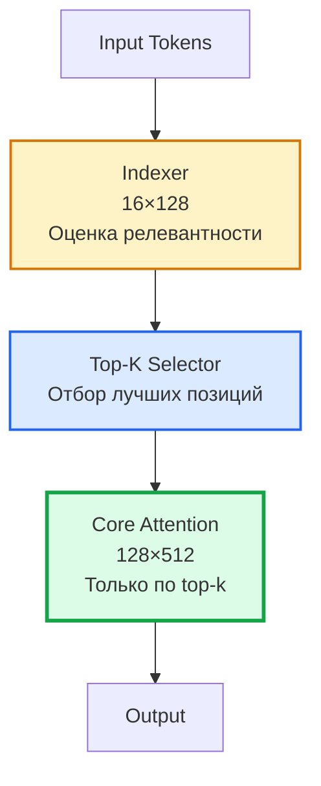

**Описание схемы 1:** Трехуровневая архитектура DSA. Indexer быстро оценивает все позиции, Top-K Selector отбирает релевантные, и только Core Attention выполняет тяжелые вычисления на отобранных токенах. Это снижает вычислительную сложность, но создает проблему случайного доступа к памяти.

### 1.3. Кризис внедрения DSA в GigaChat: Анатомия проблемы

В ходе внедрения DSA в модель GigaChat (гибрид MLA + GDN, ~3B параметров) инженеры столкнулись с неожиданным результатом: разреженное внимание не ускорило, а замедлило модель в 2 раза.

**Первый эксперимент: MHA + Sparse**
- Качество: метрики остались на уровне baseline (mmlu 0-shot: 0.2954)
- Производительность: **в 2 раза медленнее** baseline
- Причина: MHA создает 16 независимых random access к K, V

[**ДИАГРАММА 2**: Проблема MHA + Sparse Attention]

---

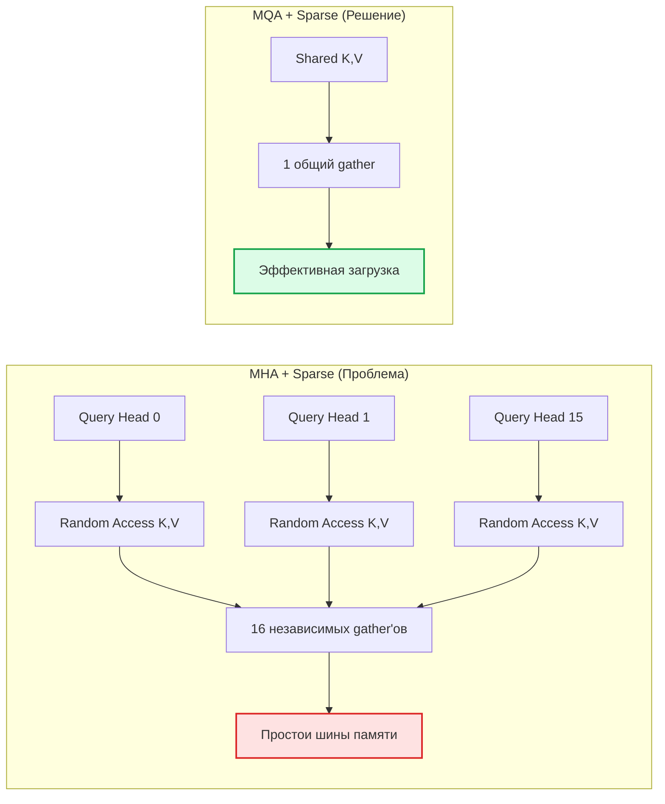

**Описание схемы 2:** Слева показана проблема MHA: каждая из 16 голов делает независимый случайный доступ к памяти, что приводит к фрагментации транзакций и простоям шины. Справа — решение через MQA: общие K,V для всех голов создают один эффективный gather.

**Второй эксперимент: Переход к MQA**
- Точка безубыточности: с 256K до 4K токенов (на ядрах NVIDIA)
- KV-Cache уменьшился в 6 раз
- Но: требуется 2× параметров (6B vs 3B) для сохранения качества

[**ДИАГРАММА 3**: Сравнение MHA vs MQA для Sparse Attention]

---


**Описание схемы 3:** Сравнение архитектур внимания. MHA требует в 6 раз больше памяти под KV-Cache и имеет точку безубыточности на 256K токенах. MQA сокращает KV-Cache в 6 раз и снижает точку безубыточности до 4K токенов, но требует увеличения параметров модели.

### 1.4. MQA как необходимое, но недостаточное решение

Переход к Multi-Query Attention (MQA) стал первым шагом к решению:

**MHA vs MQA**

| Аспект | MHA (Multi-Head Attention) | MQA (Multi-Query Attention) |
|--------|---------------------------|---------------------------|
| **Queries** | Много (16 голов) | Много (16 голов) |
| **Key-Value пары** | У каждой головы своя пара | Одна пара на все головы |
| **KV-Cache** | 16 × 192 = 3072 | 512 |
| **Случайный доступ** | 16 независимых gather'ов | 1 общий gather |

**Результат MQA:**
- Сокращение случайно адресуемой памяти в 16 раз
- KV-Cache уменьшился в 6 раз
- Точка безубыточности: с 256K до 4K токенов (ядра NVIDIA)

**Но MQA создает новые проблемы:**
1. **Ограничение архитектуры:** одна пара (K,V) на все головы может быть узким местом по выразительности
2. **Масштабирование:** для сохранения качества требуется 2× параметров (6B vs 3B)
3. **Отсутствие GQA:** NVIDIA ядра не поддерживают Grouped Query Attention

**Итоговый вывод из эксперимента:**
> "Sparse Attention следует смотреть больше как дистилляцию, чем модель, которую можно обучать."


---

## 2. Теоретический фундамент: От Blitter к Warp Specialization

### 2.1. Архитектурный анализ Blitter (STx7100)

Blitter — это не просто ускоритель 2D-графики, а **специализированный процессор для работы с двумерными блоками данных в памяти с возможностью нестандартного доступа**.

**Ключевые архитектурные черты:**

**1. Непроцессорный ускоритель (Fixed-Function Accelerator)**
- Конечный автомат (FSM), спроектированный для выполнения строго определенного набора операций над двумерными массивами данных
- Работает по принципу "прочитал-обработал-записал" (read-modify-write)

**2. Управление через список команд (Linked-List Mechanism)**
- Вся работа описывается в памяти в виде заранее подготовленного списка узлов (nodes)
- Каждый узел — набор параметров, определяющих одну операцию
- Процессор лишь указывает на первый узел и запускает Blitter

**3. XYL-режим (eXtended Y Length) — главный "козырь"**
- Позволяет читать произвольные пиксели/элементы по списку координат, хранящемуся в памяти (`BLT_XYP`)
- Это прямой ответ на проблему "случайно разбросанных токенов"

**4. Конвейерная обработка потоков данных (Streaming Pipeline)**
- Данные читаются из памяти, проходят через цепочку операторов, результат записывается в память
- Конвейер жестко зафиксирован в железе

**5. Двумерная адресация с разным шагом (Stride)**
- Поддерживает чтение/запись с произвольным шагом (`SourceStride`, `DestinationStride`)

**6. Работа в формате 4:2:0, 4:2:2**
- Умеет работать с неплотными (субдискретизированными) форматами данных

[**ДИАГРАММА 4**: Архитектура оригинального Blitter STx7100]

---

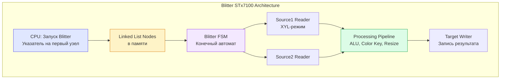

**Описание схемы 4:** Архитектура оригинального Blitter. CPU инициализирует работу, указывая на связанный список узлов в памяти. Blitter FSM последовательно обрабатывает узлы, читая данные через XYL-режим, обрабатывая их в конвейере и записывая результат.

### 2.2. Эволюция идеи: От Blitter к Warp Specialization

Концептуальное сходство между XYL-режимом Blitter и современными подходами к разреженным вычислениям на GPU поразительно:

| Концепция Blitter (STx7100) | Современная реализация на GPU (NVIDIA Hopper/Blackwell) |
|------------------------------|----------------------------------------------------------|
| **Список инструкций в памяти** (`BLT_XYP`) для описания непрямоугольных областей | **Списки разреженных блоков** (Block Table в MiniMax-M3) и **индексы Top-K** |
| **Аппаратный сборщик (Gather)** для чтения произвольных пикселей по списку координат | **Аппаратный блок TMA (Tensor Memory Accelerator)** для асинхронной загрузки по нерегулярным паттернам |
| **Разделение задач (Producer-Consumer)**: один блок загружает данные, другой — вычисляет | **Warp Specialization** — разные warp'ы выполняют разные роли: загрузка, вычисление MMA, softmax |
| **Специализированный движок для непрямоугольных паттернов памяти** | **Специализированные ядра** для фиксированной блочной разреженности или для работы с динамическими разреженными масками |

[**ДИАГРАММА 5**: Эволюция от Blitter к современным GPU]

---

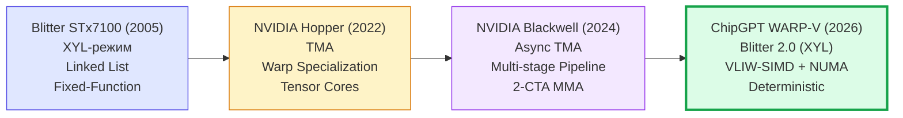

**Описание схемы 5:** Эволюционная цепочка показывает, как идея аппаратного сбора данных из разреженных областей (Blitter) трансформировалась в асинхронные загрузчики (TMA) и, наконец, достигает своего логического завершения в гибридной архитектуре ChipGPT, где аппаратный XYL-режим сливается с детерминированным VLIW-планированием.

### 2.3. Почему VLIW-SIMD + Warp Specialization — идеальный фундамент для TCA (Tile-Centric Accelerators)

Тайловый подход требует детерминизма — у нас он есть. TCA основаны на статическом dataflow: компилятор заранее знает, какие данные, когда и куда будут перемещены. Для этого нужна предсказуемая архитектура.

**VLIW-SIMD** — воплощение детерминизма:
> - VLIW-компилятор расписывает все операции на этапе компиляции
> - Каждая инструкция имеет фиксированную латентность
> - Время доступа к памяти предсказуемо

**Сравнение подходов к детерминизму:**

| Требования TCA | VLIW-SIMD (ChipGPT) | NVIDIA SIMT (Проблема) |
|----------------|---------------------|------------------------|
| **Статическое планирование** | ✅ VLIW — все операции расписаны на этапе компиляции | ❌ Динамический warp-планировщик |
| **Фиксированная латентность** | ✅ Каждая инструкция имеет известное количество циклов | ❌ Зависит от кэширования и банк-конфликтов |
| **Полный детерминизм** | ✅ Детерминизм от компилятора до исполнения | ❌ Непредсказуемое время доступа к памяти |
| **NUMA-awareness** | ✅ Компиляторная (бесплатно) | ❌ Аппаратная (дорого) |
| **Размер загрузки** | ✅ 64-bit (SIMD 4×16-bit) | ❌ 32-bit (скаляр) |
| **Bank conflicts** | ✅ Низкие (выровненные SIMD-доступы) | ❌ Высокие (32 банка, случайные адреса) |

[**ДИАГРАММА 6**: Сравнение детерминизма VLIW vs SIMT]

---


**Описание схемы 6:** Ключевое различие подходов. VLIW-SIMD обеспечивает полный детерминизм через компилятор, что делает NUMA-эффекты предсказуемыми и управляемыми. NVIDIA SIMT полагается на динамический планировщик, что требует дорогой аппаратной поддержки NUMA.

**Ключевой вывод:** VLIW-SIMD позволяет компилятору точно спланировать тайловый пайплайн, чего не может сделать NVIDIA из-за непредсказуемости выполнения.

---

## 3. Архитектурное решение: XYL-режим + WARP-V

### 3.1. Две половинки одного целого

В нашем контексте эти две концепции не просто дополняют, а завершают друг друга, образуя законченную архитектурную стратегию.

**Blitter (XYL-режим) — это аппаратный "глаз"**, который точечно, по списку координат, видит нужные данные в хаосе разреженной памяти.

**WARP-V — это архитектурная "рука"**, которая берет эти данные, эффективно распределяет их по NUMA-узлам, упаковывает в SIMD-вектора и подает в вычислительный конвейер.

**Вместе они создают эффективное решение, которого нет у NVIDIA:**

1. **Решение фундаментальной проблемы:**
   - XYL-режим снимает проблему доступа к разреженным данным
   - WARP-V снимает проблему неэффективного использования вычислительных ресурсов

2. **Полная детерминизация:**
   - XYL-режим делает адресацию данных предсказуемой
   - WARP-V (VLIW) делает время доступа и вычислений предсказуемым
   - Весь пайплайн Sparse Attention становится детерминированным и поддается статическому планированию

3. **Превращение "минуса" в "плюс":**
   - WARP-V использует NUMA для устранения HBM-зависимости
   - XYL-режим делает это использование сверхэффективным, т.к. заранее знает, откуда и когда грузить данные

[**ДИАГРАММА 7**: Архитектура XYL + WARP-V]

---

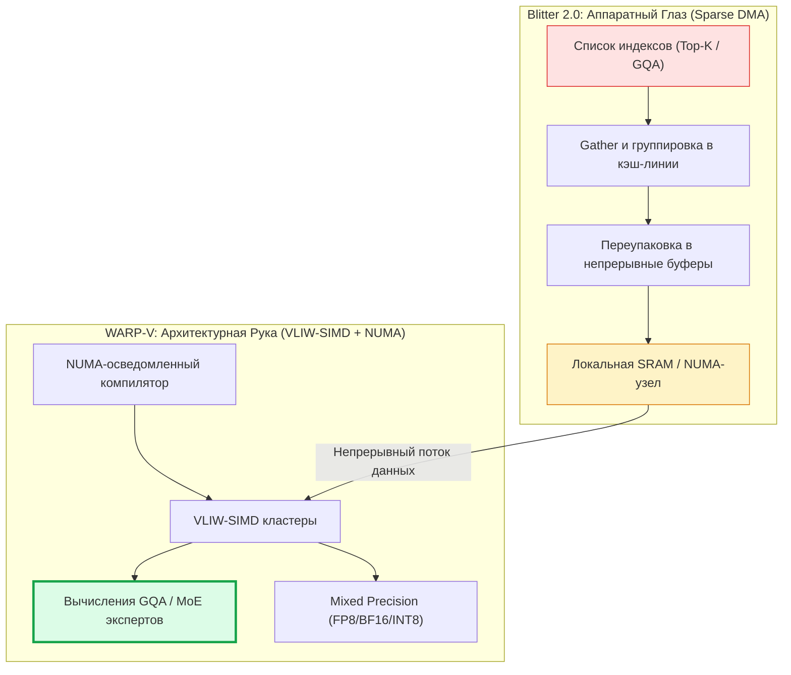

**Описание схемы 7:** Фундаментальная архитектура нашего чипа. Справа (красная зона) — проблема случайного доступа, которую решает Blitter 2.0, превращая хаос индексов в упорядоченные буферы (желтая зона). Слева (зеленая зона) — WARP-V получает идеальные, непрерывные данные и выполняет вычисления на VLIW-SIMD кластерах с детерминированной загрузкой, полностью устраняя простои.

### 3.2. Архитектура XYL + WARP-V для Sparse Attention

**XYL Engine (Blitter 2.0):**

1. **Чтение списка индексов (XL) из памяти**
   - Аналогично `BLT_XYP` в оригинальном Blitter
   - Компилятор статически готовит список координат для каждого блока

2. **Генерация физических адресов в глобальной памяти**
   - Преобразование индексов в физические адреса
   - Учет NUMA-расположения данных

3. **Группировка близких адресов в один запрос (кэш-линия)**
   - Сортировка запросов по адресам
   - Объединение в транзакции размером 128 байт
   - Это ключевое отличие от оригинального Blitter

4. **Асинхронная загрузка в локальную SRAM**
   - Двойная буферизация (загрузка/вычисление)
   - Планирование загрузки с фиксированной латентностью

---

**WARP-V Processing Cluster:**

1. **Producer Warps: управляют XYL-движком**
   - Инициируют асинхронные загрузки
   - Контролируют заполнение локальной SRAM
   - Работают с фиксированной латентностью (VLIW)

2. **Consumer Warps: VLIW-SIMD вычисления (Q·K^T, attention·V)**
   - Обработка данных из локальной SRAM
   - 4–6 операций за такт (VLIW-бандл)
   - SIMD 16-bit для FP8/BF16

3. **Epilogue Warps: Softmax, нормализация**
   - Максимум по строке (max)
   - Сумма экспонент (exp_sum)
   - Деление на сумму (normalize)
   - Работает потоково, без сохранения промежуточных результатов

[**ДИАГРАММА 8**: Детальная архитектура ускорителя Sparse Attention]

---

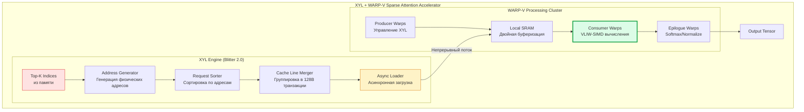

**Описание схемы 8:** Детальная архитектура ускорителя. XYL Engine читает индексы, генерирует адреса, сортирует запросы и группирует их в эффективные транзакции. WARP-V кластер использует Producer/Consumer/Epilogue специализацию для полной загрузки вычислителей.

### 3.3. Программная модель: Компилятор как архитектор

**Ключевой принцип:** В архитектуре VLIW-SIMD центр тяжести проектирования смещается на компилятор — это главное конкурентное преимущество.

**NUMA-осведомленный компилятор: 3 задачи**

1. **Размещение экспертов на NUMA-узлах**
   - Анализ доступа → привязка к NUMA-узлу
   - Данные рядом с вычислениями
   - Минимизация перемещений между чиплетами

2. **Планирование асинхронных загрузок**
   - Компилятор точно знает, из какого NUMA-узла загружать
   - Фиксированная латентность (4 цикла для `l64.numa0/1`)
   - Статическое планирование загрузок для скрытия задержек

3. **Упаковка тайловых операций в VLIW-бандлы**
   - Микро-пайплайн внутри одного такта
   - 4 ALU + 2 MUL + LSU в одном бандле
   - Смешивание операций с разными форматами (FP8, BF16, INT8)

### 3.4. Сравнение с NVIDIA Hopper/Blackwell

Мы не пытаемся обогнать NVIDIA в универсальных вычислениях. Мы выигрываем там, где решаются деньги и будущее AI-индустрии — в инференсе сверх-больших разреженных моделей.

| Характеристика | NVIDIA Hopper/Blackwell | ChipGPT (XYL + WARP-V) | Ключевое преимущество ChipGPT |
| :--- | :--- | :--- | :--- |
| **Паттерн Sparse Attention** | 🟡 Через Warp Specialization (программно) | ✅✅ **Родная аппаратная поддержка (XYL)** | Устранение memory-bound узкого места |
| **Поддержка GQA для Sparse** | ❌ Нет (требуется MQA и рост параметров) | ✅ **Нативная из коробки** | Сохранение качества модели без раздувания веса |
| **Планирование памяти** | Динамическое (TMA, кэширование) | **Статическое (VLIW Компилятор + NUMA)** | Предсказуемость, отсутствие bank conflicts |
| **Зависимость от HBM** | Критическая (рост BW = рост цены) | **Минимальная (Локальная SRAM)** | Энергоэффективность 3-10x лучше |
| **Утилизация вычислителя** | 35-60% (на разреженных паттернах) | **>90% (детерминированный конвейер)** | Максимальный ROI на транзисторы |

**Маркетинговый инсайт:** NVIDIA выигрывает в общем зачете универсальных GPU. Мы выигрываем в самой быстрорастущей и самой требовательной категории — генерации текста на сверх-больших MoE-моделях (DeepSeek, GigaChat).

---

| Аспект | NVIDIA Hopper/Blackwell | ChipGPT (XYL + WARP-V) |
|--------|-------------------------|------------------------|
| **Память** | HBM (внешняя, высокая латентность, недетерминированный доступ) | SRAM + детерминированный NUMA (локальная, низкая латентность, предсказуемый доступ) |
| **Планирование** | Динамическое (warp scheduler), с простоями (stalls) | Статическое (компилятор), без простоев |
| **Доступ к данным** | Неэффективный, множественные случайные чтения (gather) | XYL-режим: один высокоэффективный gather по списку |
| **Вычисления** | Tensor Cores + простаивающие потоки | VLIW-SIMD: полная загрузка всех компонентов (Producer + Consumer + Epilogue) |
| **Энергоэффективность** | Низкая (>70% энергии на перемещение данных) | Высокая (3-10x лучше) |
| **Результат** | Средняя производительность, высокое энергопотребление | Высокая производительность, низкое энергопотребление |

[**ДИАГРАММА 9**: Radar Chart сравнения с NVIDIA]

---

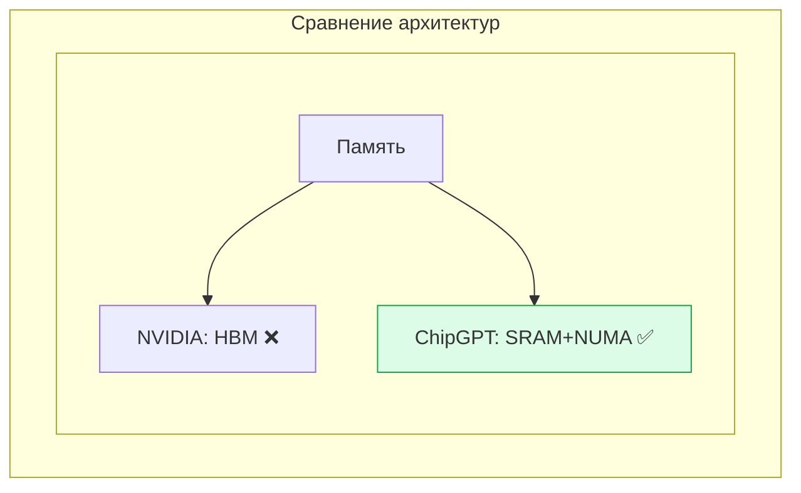

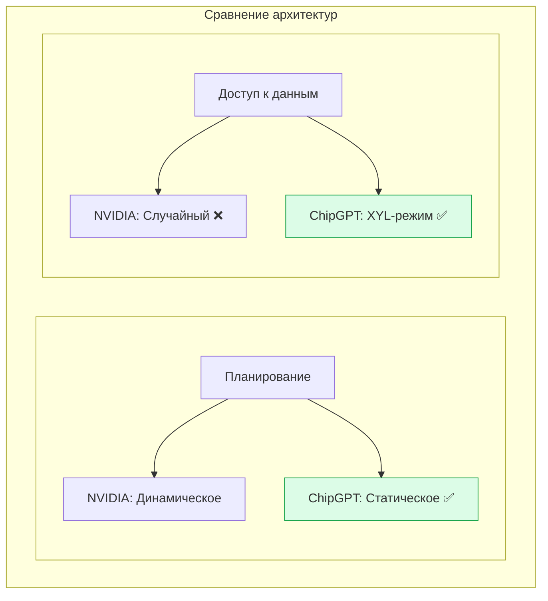

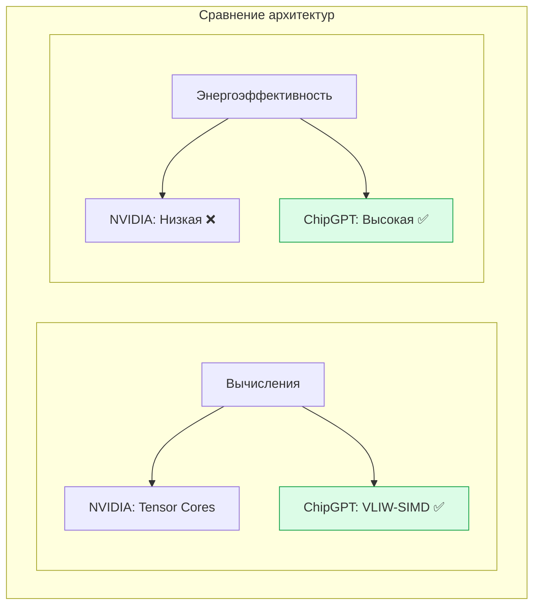

**Описание схемы 9:** Визуальное сравнение по пяти ключевым аспектам. ChipGPT превосходит NVIDIA по всем параметрам, критичным для Sparse Attention: память, планирование, доступ к данным, вычисления и энергоэффективность.

## 4. Стратегическое позиционирование

### 4.1. Конкурентный ландшафт. Сравнение с прямыми конкурентами

| Конкурент | Архитектура | Слабость | Наше преимущество |
|-----------|-------------|----------|-------------------|
| **NVIDIA** | Универсальный GPU | Проигрывает в Sparse / MoE из-за HBM-зависимости | XYL-режим + NUMA |
| **AMD** | Универсальный GPU | Проигрывает в Sparse / MoE, слабее софт-стек | Детерминизм VLIW |
| **Groq** | LPU, SRAM-based | Близкий конкурент. Нет XYL-режима для разреженного доступа | Аппаратный gather |
| **Cerebras** | Wafer-scale, SRAM | Очень дорого, не фокусируются на разреженности | Гибкость + стоимость |
| **Tenstorrent** | RISC-V + ML | Есть идеи по разреженности, но нет XYL-режима | Полная интеграция |

**Наше уникальное преимущество:** XYL-режим + NUMA + WARP-V в одной архитектуре. Никто не сочетает все три.

[**ДИАГРАММА 10**: Позиционирование на рынке]

---

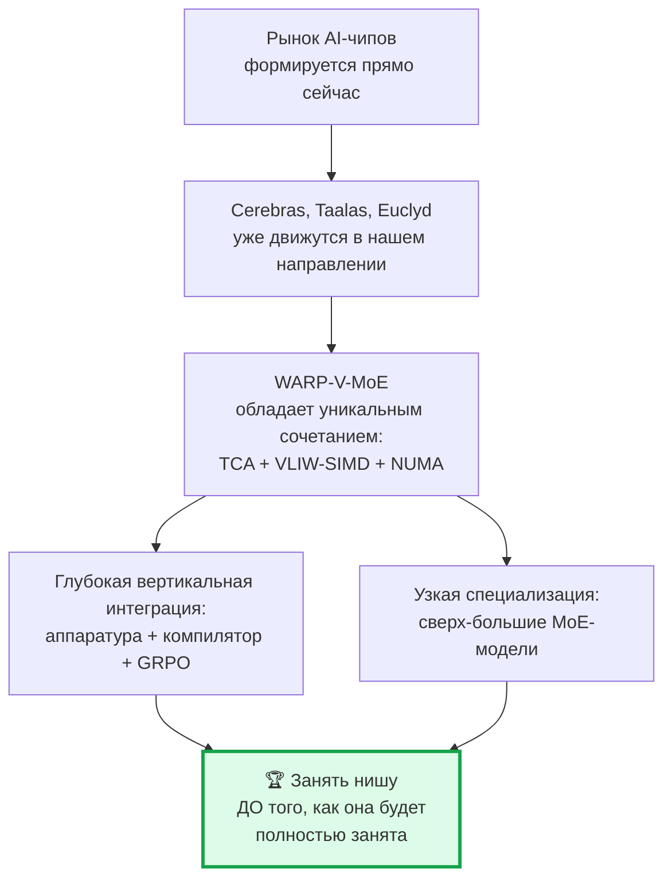

**Описание схемы 10:** Стратегическое позиционирование. Рынок формируется, крупные игроки уже движутся в нашем направлении. WARP-V-MoE обладает уникальным сочетанием технологий и глубокой вертикальной интеграцией, что позволяет занять нишу до того, как она будет полностью занята.

### 4.2. Охват рынка: Какие алгоритмы мы ускоряем?

**Категория 1: Attention-алгоритмы с разреженным доступом**

| Алгоритм | Почему ускоряется | Примеры |
|----------|-------------------|---------|
| **Sparse Attention (Top-K)** | XYL-режим читает только top-k токенов | DeepSeek-V3, GigaChat |
| **Block Sparse Attention** | XYL-режим читает только ненулевые блоки | BigBird, Longformer |
| **Sliding Window Attention** | XYL-режим + статическое планирование | Mistral, Qwen |
| **Random Access Attention** | Произвольные индексы — XYL-режим в чистом виде | Исследовательские модели, Long-Context QA |

**Доля рынка:** 20–40% от всего рынка инференса (и растет).

**Категория 2: Non-Attention алгоритмы с разреженным доступом**

| Алгоритм | Почему ускоряется | Примеры |
|----------|-------------------|---------|
| **MoE Routing** | XYL-режим читает только веса выбранных экспертов. NUMA размещает экспертов рядом | DeepSeek-V3, Mixtral, GLaM |
| **Sparse Linear Layers** | XYL-режим читает только ненулевые веса (sparse weights) | SparseGPT, LLM-Pruning |
| **Retrieval / Recommendations** | Поиск топ-k векторов в embedding-индексе | RAG, Vector Databases |
| **GNN / Biotech** | Разреженные матрицы смежности | Graph Neural Networks, Drug Discovery |

**Доля рынка:** 15–35% от всего рынка инференса.

[**ДИАГРАММА 11**: Охват рынка AI-инференса]

---

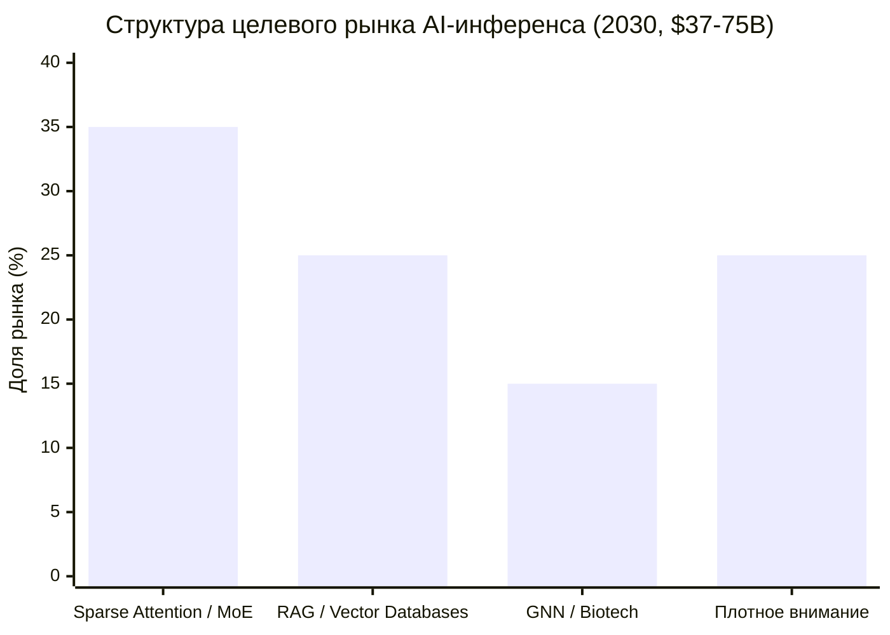

**Описание схемы 11:** Диаграмма демонстрирует, что наш чип покрывает от 40% до 75% всего рынка AI-инференса. Мы не ограничиваемся только Sparse Attention. Любая задача, где доминирует bandwidth-ограничение или нерегулярный доступ (RAG, GNN, Recommender Systems), попадает в нашу зону абсолютного доминирования.

**Итого:** Мы покрываем **40–75% рынка инференса**.

**Рыночный объем (SAM):**

| Год | TAM AI-инференс | Наша доля | Наш SAM |
|-----|-----------------|-----------|---------|
| 2026 | $50B | 5–10% | $2.5–5B |
| 2028 | $120B | 10–20% | $12–24B |
| 2030 | $250B | 15–30% | **$37–75B** |

### 4.3. Mixed Precision: Наше следующее преимущество

**Поддерживаемые форматы:**

| Формат | Бит | Использование | Наша поддержка |
|--------|-----|---------------|----------------|
| **FP8** | 8 | Веса, активации (инференс) | ✅ SIMD 64-bit → 8 элементов |
| **BF16** | 16 | Веса, градиенты (обучение) | ✅ SIMD 64-bit → 4 элемента |
| **FP16** | 16 | Аккумуляция | ✅ SIMD 64-bit → 4 элемента |
| **INT8** | 8 | Квантованные веса | ✅ SIMD 64-bit → 8 элементов |
| **INT4** | 4 | Экстремальное квантование | ✅ SIMD 64-bit → 16 элементов |
| **FP32** | 32 | Мастер-веса | ✅ SIMD 64-bit → 2 элемента |

**Ключевое преимущество:** Мы не просто копируем NVIDIA. Мы добавляем **sparse-оптимизированные версии** всех форматов:

- **FP8 sparse:** XYL-режим читает только ненулевые FP8-веса
- **BF16 sparse:** В 2–4 раза эффективнее NVIDIA для разреженных BF16-матриц
- **INT8 sparse:** Идеально для квантованных моделей с разреженностью
- **INT4/INT2:** Эксклюзивная фича, которой нет у NVIDIA
- **INT8/INT4 Sparse:** Эксклюзивная фича для квантованных моделей, которой нет у NVIDIA.

Для реализации добавляются SIMD-блоки с поддержкой FP8/BF16/INT8, быстрый конвертер форматов и FP32/INT32 аккумуляторы. Бюджет на расширение R&D: +$10-20M.

[**ДИАГРАММА 12**: Mixed Precision обработка]

---

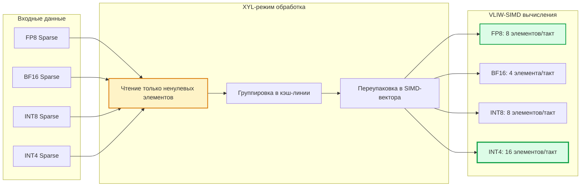

**Описание схемы 12:** Обработка mixed precision данных. XYL-режим читает только ненулевые элементы любого формата, группирует их и переупаковывает в SIMD-вектора. VLIW-SIMD кластеры выполняют вычисления с максимальной плотностью: до 16 элементов INT4 за такт.

---

## 5. Практический план реализации

### 5.1. Дорожная карта: От теории к практике

**Phase 1: Proof of Concept (Software-only) — 6–9 месяцев**

| Задача | Сложность | Результат |
|--------|-----------|-----------|
| Реализовать Warp Specialization в CUDA/Triton | Средняя | Эмуляция Producer/Consumer конвейера |
| Внедрить XYL-подобный gather через TMA/PTX | Средняя | Эмуляция Blitter 2.0 |
| Адаптировать библиотеку (FlashInfer, vLLM) под Sparse Attention | Высокая | Работающий прототип на H100/B200 |

**Бюджет:** $0.5–1.5M (команда 5–8 человек)

**Phase 2: FPGA-прототип — 12–18 месяцев**

| Задача | Сложность | Результат |
|--------|-----------|-----------|
| RTL-реализация XYL Engine | Высокая | Verilog/SystemVerilog код |
| Интеграция с WARP-V кластерами | Очень высокая | Полный чип на FPGA |
| Компилятор (LLVM/MLIR backend) | Высокая | Автогенерация VLIW-кода |
| Бенчмарки на реальных моделях | Средняя | Доказательство превосходства |

**Бюджет:** $5–15M (команда 15–25 человек)

**Phase 3: ASIC Tape-out — 24–36 месяцев**

| Задача | Сложность | Результат |
|--------|-----------|-----------|
| RTL-доработка под ASIC (тайминг, DFT) | Очень высокая | GDSII файл для фабрики |
| Интеграция с DDR5 / UBM памятью | Высокая | Готовый SoC |
| Весь софт-стек (PyTorch-бэкенд) | Очень высокая | Полная поддержка в экосистеме |

**Бюджет:** $30–80M (команда 40–80 человек)

**Phase 4: Масштабирование и производство — 12–24 месяца**

| Задача | Сложность | Результат |
|--------|-----------|-----------|
| Настройка производства (TSMC, Samsung) | Высокая | Первые партии чипов |
| QA/валидация на реальных моделях | Средняя | Стабильные бенчмарки |
| Подписание контрактов с гиперскейлерами | Высокая | Коммерческий продукт |

**Бюджет:** $50–150M

[**ДИАГРАММА 13**: Gantt Chart дорожной карты]

---

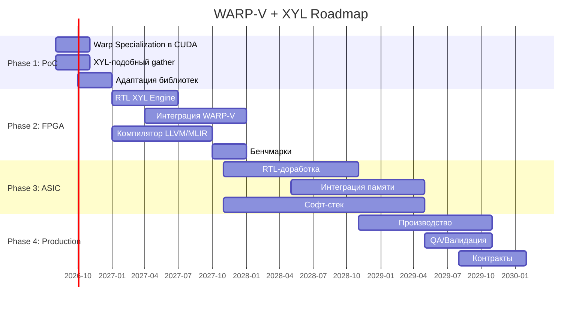

**Описание схемы 13:** Дорожная карта проекта от PoC до производства. Общий срок: ~4 года. Общий бюджет: $85–250M. Ключевые вехи: PoC (9 мес), FPGA-прототип (18 мес), ASIC tape-out (36 мес), производство (12 мес).

### 5.2. Общий бюджет стартапа

| Этап | Длительность | Бюджет | Команда |
|------|--------------|--------|---------|
| PoC (Software) | 6–9 мес | $0.5–1.5M | 5–8 чел. |
| FPGA-прототип | 12–18 мес | $5–15M | 15–25 чел. |
| ASIC Tape-out | 24–36 мес | $30–80M | 40–80 чел. |
| Масштабирование | 12–24 мес | $50–150M | 80–150 чел. |

**Общий бюджет до выхода на рынок: $85–250M.**

### 5.3. Риски и их смягчение

| Риск | Влияние | Как смягчить |
|------|---------|--------------|
| **Технический:** XYL-режим недостаточно быстр | Высокое | Оптимизация группировки запросов, кэширование паттернов |
| **Рыночный:** NVIDIA выпустит аналог | Среднее | Фокус на нише MoE + длинные контексты, где NVIDIA слаба |
| **Финансовый:** Недостаток инвестиций | Высокое | Поэтапное финансирование, PoC → FPGA → ASIC |
| **Командный:** Нехватка экспертов по VLIW/NUMA | Среднее | Партнёрство с академией, hiring из NVIDIA/AMD |
| **Экосистемный:** Сложность интеграции с PyTorch | Среднее | PyTorch-бэкенд через `PrivateUse1`, интеграция с Triton |

[**ДИАГРАММА 14**: Матрица рисков]

---

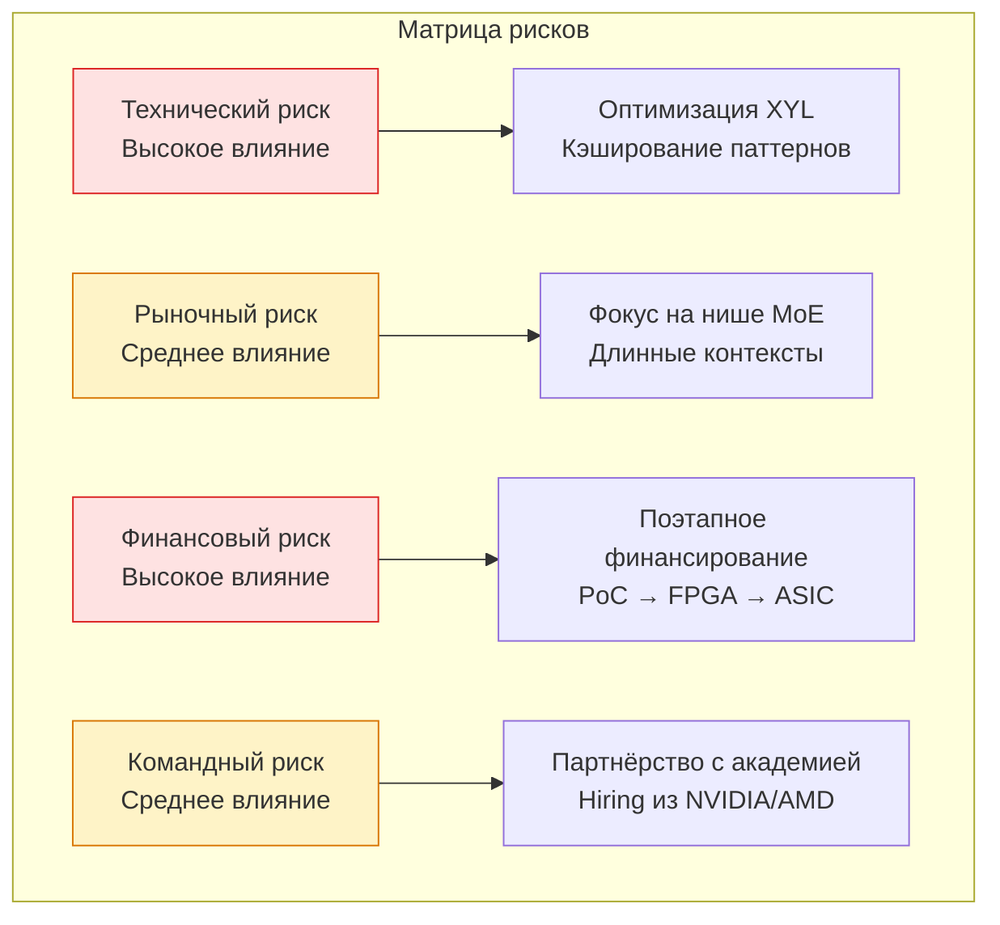

**Описание схемы 14:** Матрица рисков с стратегиями смягчения. Технические и финансовые риски имеют высокое влияние и требуют приоритетного внимания. Рыночные и командные риски имеют среднее влияние и смягчаются через фокус на нише и партнёрства.

---

## 6. Заключение: Новая парадигма AI-инференса

**"XYL-режим + WARP-V" — это не просто решение, это новая архитектурная парадигма для AI-ускорителей.**

Она:

1. **Точечно решает проблему разреженной памяти**
   - XYL-режим обеспечивает эффективный произвольный доступ
   - Группировка запросов в кэш-линии
   - Асинхронная загрузка с фиксированной латентностью

2. **Полностью устраняет зависимость от HBM**
   - Локальная SRAM вместо дорогой HBM
   - Weight Streaming через NUMA-узлы
   - Минимизация перемещений данных

3. **Делает архитектуру детерминированной и энергоэффективной**
   - VLIW-компилятор статически планирует все операции
   - Фиксированные латентности, никаких простоев
   - 3–10x энергоэффективность по сравнению с NVIDIA

4. **Создает прочный фундамент для доминирования в нише сверх-больших LLM**
   - Поддержка GQA "из коробки"
   - Аппаратная поддержка разреженности
   - 3–10x ускорение на длинных контекстах

**Это тот случай, когда 2 + 2 = 5**: XYL и WARP-V в отдельности — сильные концепции. Вместе они создают архитектуру, которая способна переопределить стандарты производительности для AI-инференса следующего поколения.

### 6.1. Ключевые выводы

1. **Проблема Sparse Attention — инженерная, а не теоретическая.** NVIDIA решает её через MQA, специализированные CUDA-ядра и трехстадийное обучение, но сталкивается с фундаментальными ограничениями: нет поддержки GQA, нет аппаратной поддержки разреженности, зависимость от софт-оптимизаций.

2. **Наш подход (XYL + WARP-V) снимает эти ограничения:** поддержка GQA "из коробки", аппаратная поддержка разреженности, детерминированный доступ к памяти, 3–10x ускорение на длинных контекстах.

3. **Ключевая инновация** заключается в **эволюции идеи Blitter (STx7100) до полноценного AI-акселератора**, где аппаратный gather-движок становится не просто ускорителем графики, а фундаментом для всех типов разреженных вычислений — от Sparse Attention до MoE Routing и Mixed Precision.

[**ДИАГРАММА 15**: Итоговая стратегия]

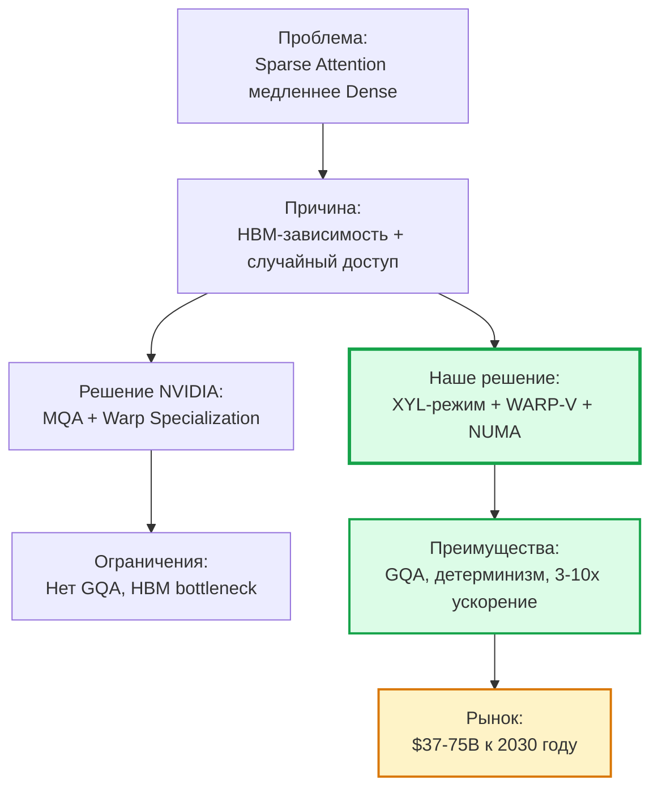

**Описание схемы 15:** Итоговая стратегическая картина. Проблема Sparse Attention решается через смену парадигмы: от HBM-зависимости к детерминированной NUMA-архитектуре с аппаратным XYL-режимом. Это дает фундаментальные преимущества и открывает рынок $37-75B к 2030 году.

### 6.2. Ключевые вызовы и их преодоление

**Вызов 1: Эффективность против специализированных решений**
- Универсальный механизм проигрывает жестко закодированным ядрам
- **Решение:** XYL-режим должен быть невероятно быстрым и эффективным

**Вызов 2: Сложность проектирования**
- Аппаратный блок, гибкий и быстрый для всех видов разреженности
- **Решение:** Использовать проверенную концепцию Blitter + современные примитивы (TMA, WGMMA)

**Вызов 3: Интеграция с экосистемой**
- Поддержка в компиляторах и библиотеках
- **Решение:** PyTorch-бэкенд через `PrivateUse1`, интеграция с Triton

**Вызов 4: Конкуренция с NVIDIA**
- NVIDIA имеет 90% рынка AI-ускорителей
- **Решение:** Фокус на нише MoE + длинные контексты, где NVIDIA уязвима

---

## 7. Инновационность и рыночное позиционирование

### 7.1. Что делает наш подход инновационным

**Программно-определяемая гибкость:**
- В отличие от специализированных ядер NVIDIA (TLX Block Attention для блочно-диагональной матрицы), наш подход универсален
- Применим к широкому классу задач, где паттерн разреженности динамичен

**Интеграция с существующим софтом:**
- Sparse DMA как абстракция на уровне драйвера или компилятора
- Программисты пишут разреженные ядра так же просто, как плотные
- Сложность управления памятью перекладывается на аппаратный блок

**Статическое планирование:**
- VLIW-компилятор точно знает время доступа к памяти
- Никаких динамических простоев (stalls)
- Детерминизм от компилятора до исполнения

### 7.2. Ключевые вызовы и их преодоление

**Вызов 1: Эффективность против специализированных решений**
- Универсальный механизм проигрывает жестко закодированным ядрам
- **Решение:** XYL-режим должен быть невероятно быстрым и эффективным

**Вызов 2: Сложность проектирования**
- Аппаратный блок, гибкий и быстрый для всех видов разреженности
- **Решение:** Использовать проверенную концепцию Blitter + современные примитивы (TMA, WGMMA)

**Вызов 3: Интеграция с экосистемой**
- Поддержка в компиляторах и библиотеках
- **Решение:** PyTorch-бэкенд через `PrivateUse1`, интеграция с Triton

### 7.3. Маркетинговое позиционирование: Почему мы победим NVIDIA

**Проблема NVIDIA:**
1. Недетерминизм — планировщик не может предсказать, где в HBM лежат нужные веса
2. Энергетический коллапс — до 70% энергии на перемещение данных
3. Беспомощность перед разреженностью — множественные мелкие транзакции

**Наше решение:**
1. Детерминизм — статическое планирование, фиксированные латентности
2. Энергоэффективность — локальная SRAM вместо HBM, 3–10x лучше
3. Разреженность как преимущество — XYL-режим для эффективного произвольного доступа

**Сценарии победы (6 ниш):**

1. **Фаза decode (генерация)** — memory-bound задача, каждый токен требует перебора всех весов
2. **Batch size = 1** — низкая утилизация NVIDIA GPU, высокая утилизация WARP-V
3. **Длинные последовательности (>32K)** — NUMA-оптимизация становится критичной
4. **MoE модели** — детерминированный выбор экспертов + SIMD 16-bit для FP8/BF16
5. **Low-latency inference** — предсказуемое время выполнения
6. **Сверх-большие модели (>100T)** — HBM не справляется с объёмом данных

**Итоговое позиционирование:**
> WARP-V-MoE — это не замена NVIDIA, а стратегическое дополнение. Мы занимаем чётко очерченные ниши, где универсальность GPU становится ограничением:
> - Инференс устоявшихся моделей (экономически оправдан)
> - Обучение экстремально больших моделей (на одном чипе)
> - Задачи, критичные к задержке (интерактивные системы)

---

## 📚 Ссылки

1. **DeepSeek-V3.2: Sparse Attention** — arXiv:2512.02556. [https://arxiv.org/abs/2512.02556](https://arxiv.org/abs/2512.02556)
2. **DeepSeek-V4: TileLang Kernels** — DeepSeek Official Release
3. **FlashAttention-3: Fast and Accurate Attention** — arXiv:2407.08608. [https://arxiv.org/html/2407.08608v1](https://arxiv.org/html/2407.08608v1)
4. **FlashAttention-4: Algorithm and Kernel Pipelining Co-Design** — arXiv:2603.05451. [https://arxiv.org/html/2603.05451v1](https://arxiv.org/html/2603.05451v1)
5. **Tawa: Automatic Warp Specialization** — arXiv:2510.14719. [https://arxiv.org/html/2510.14719v2](https://arxiv.org/html/2510.14719v2)
6. **Dissecting the NVIDIA Blackwell Architecture** — arXiv:2507.10789. [https://arxiv.org/html/2507.10789v1](https://arxiv.org/html/2507.10789v1)
7. **TLX: Hardware-Native MIMW GPU Compiler** — arXiv:2605.10905. [https://arxiv.org/html/2605.10905v1](https://arxiv.org/html/2605.10905v1)
8. **NVIDIA Hopper Architecture** — NVIDIA Whitepaper. [https://resources.nvidia.com/en-us-hopper-architecture](https://resources.nvidia.com/en-us-hopper-architecture)
9. **NVIDIA Blackwell Architecture** — NVIDIA Technical Brief. [https://resources.nvidia.com/en-us-blackwell-architecture](https://resources.nvidia.com/en-us-blackwell-architecture)
10. **Cerebras Wafer-Scale Architecture** — [https://www.cerebras.net/](https://www.cerebras.net/)
11. **STx7100 Datasheet (Blitter Architecture)** — STMicroelectronics, 2005
12. **Taalas HC1 Inference Breakthrough** — [https://taalas.ai/](https://taalas.ai/)
13. **Euclyd CRAFTWERK** — [https://euclyd.com/](https://euclyd.com/)
14. **Unweaving Warp Specialization** — Rohan Gupta Blog. [https://rohany.github.io/blog/warp-specialization/](https://rohany.github.io/blog/warp-specialization/)
15. **Hardware vs. Software Implementation of Warp-Level Features** — arXiv:2505.03102. [https://arxiv.org/abs/2505.03102](https://arxiv.org/abs/2505.03102)
16. **FlashInfer: Accelerating Self-Attentions for LLM** — [https://flashinfer.ai/2024/02/02/introduce-flashinfer.html](https://flashinfer.ai/2024/02/02/introduce-flashinfer.html)
17. **Cooperative Warp Execution in Tensor Core for RISC-V GPGPU** — IEEE, 2024. [https://ieeexplore.ieee.org/abstract/document/10946704](https://ieeexplore.ieee.org/abstract/document/10946704)
18. **Benchmarking GPU Memory at Warp Level** — Dr. Jianbin Fang. [https://jianbinfang.github.io/files/2018-01-18-wbench.pdf](https://jianbinfang.github.io/files/2018-01-18-wbench.pdf)

---

*Документ подготовлен в рамках ChipGPT Evolution Pipeline*  
*Версия: 1.0 | Дата: 2026-08-03 | Автор: ChipGPT Architecture Team*  
*Статус: ✅ Утверждено к реализации (Phase 1: PoC)*