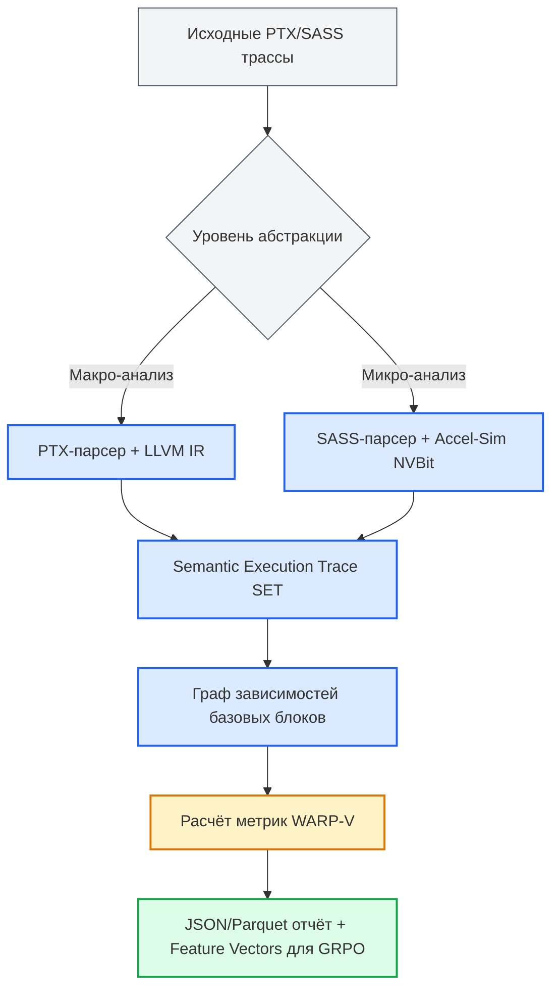
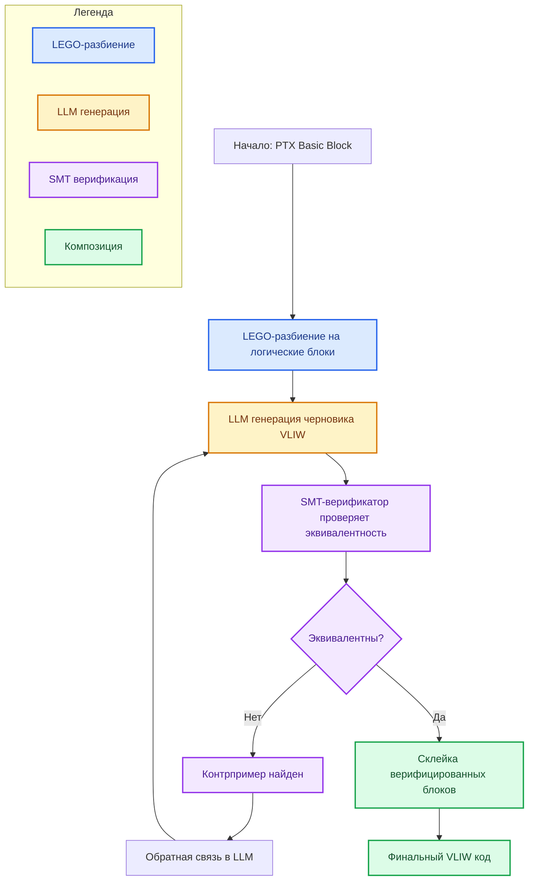
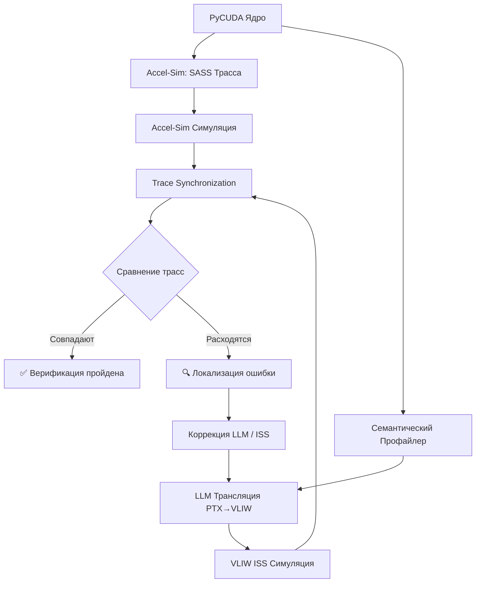
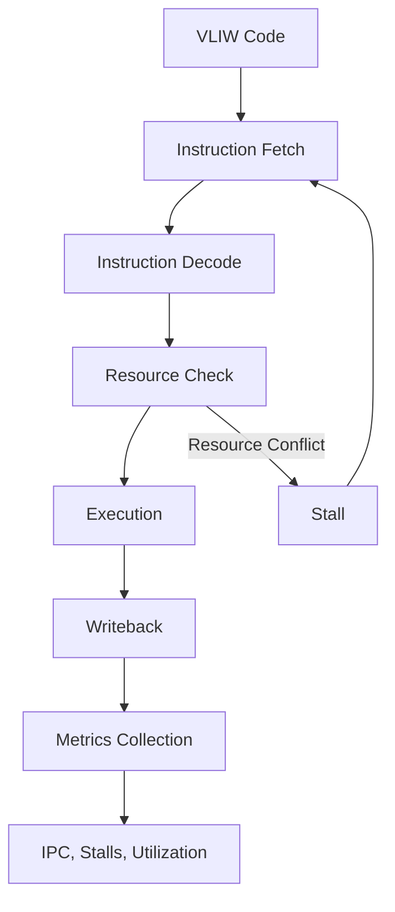

# 🎯 Концепция: От трансляции к Trace-Driven анализу

Ключевая цель проекта ChipGPT — не создание компилятора PTX→VLIW, а разработка **инструмента архитектурного анализа** (Semantic Profiler), который позволит «заглянуть внутрь» корпоративных PTX-трасс (снятых с **реальных LLM-моделей**) и предсказать их поведение на принципиально иной микроархитектуре **WARP-V** (SIMT-логика на базе VLIW-кластеров).

Это переход от прямой трансляции к **Trace-Driven Evolutionary Design**:

1. Сбор реальных PTX/SASS трасс с 100+ корпоративных LLM-моделей
2. Преобразование бинарных инструкций в семантические события (Semantic Execution Trace)
3. Статистическая эмуляция WARP-V без написания RTL-симулятора
4. Формирование фичер-векторов для GRPO-алгоритма эволюции ядра

---

# 🔍 Semantic Profiler: Архитектура и ключевые метрики

**Semantic Profiler** — это аналитический движок, который парсит PTX/SASS-код, строит граф зависимостей и вычисляет архитектурно-критичные метрики для целевой VLIW-платформы. Он заменяет дорогие cycle-accurate симуляции на предсказательную статистику, ускоряя архитектурный поиск в 10–100 раз.

## 📦 Архитектура профайлера



## 📊 Ключевые метрики для WARP-V

| Метрика | Что измеряет | Как рассчитывается в SET | Влияние на архитектуру |
|---|---|---|---|
| **ILP (Instruction-Level Parallelism)** | Утилизация VLIW-слотов (до 4 ops/cycle) | Подсчёт независимых `COMPUTE`/`ALU` инструкций в одном бандле без RAW-зависимостей | Определяет ширину VLIW и количество ALU на кластер |
| **Divergence Cost** | Потери на ветвления (`bra.cond`) | `% потоков, исполняющих обе ветки`. В NVIDIA = дополнительные циклы, в WARP-V = 0 циклов (разные кластеры) | Показывает выигрыш от SIMT→VLIW перехода |
| **Shared Memory Bank Conflicts** | Конфликты банков при `st.shared`/`ld.shared` | Анализ паттернов адресации: 16 одновременных записей в разные банки vs 1 банк | Требует 16/32-банковой организации SRAM и арбитража |
| **Warp-level Communication** | Нагрузка на межкластерную шину (NoC) | Подсчёт `shfl.sync`, `vote.sync`, `bar.sync` | Определяет топологию interconnect и задержку синхронизации |

---

# 🔄 Гибридный пайплайн: PTX + SASS

Для баланса между скоростью анализа и точностью предсказаний используется **двухуровневая абстракция**:

| Уровень | Технология | Назначение | Точность | Скорость |
|---|---|---|---|---|
| **Macro-View** | PTX + LLVM IR | Быстрый макро-анализ нагрузки, выявление доминирующих семантических паттернов, ранжирование ядер | ~70-80% (зависит от компилятора) | ⚡ Высокая (мгновенный парсинг) |
| **Micro-View** | SASS + NVBit | Детальный анализ `Resource Conflict Density`, реального ILP, stall-циклов, bank-конфликтов | ~95-98% (реальный машинный код) | 🐢 Средняя (требует исполнения/трассировки) |

**Правило работы:** PTX используется для первичного отбора и кластеризации нагрузок. SASS подключается только для финальной калибровки метрик перед подачей в GRPO.

---

# 🧠 Нейросимволический движок трансляции (Guess & Sketch + LEGO-Compiler)

Прямая генерация VLIW LLM-моделью недопустима из-за отсутствия гарантий корректности. Применяется **нейросимволический пайплайн**, обеспечивающий >99.9% точности трансляции.

## 🧩 Архитектура движка


1. **LEGO-подход:** PTX разбивается на базовые блоки без ветвлений. Каждый блок транслируется независимо.
2. **Guess (LLM):** LLM генерирует правдоподобный VLIW-бандл, учитывая латентности ST231/VLIWGPT и ограничения ресурсов (1 LSU, 2 MU, 4 IU).
3. **Sketch (SMT/Z3):** Символьный верификатор строит формулы эквивалентности PTX и VLIW. Если найдено расхождение, возвращается контрпример.
4. **Self-Correction:** Контрпример подается обратно в LLM как негативный пример для генерации исправленного бандла. Цикл повторяется до `SAT/UNSAT` подтверждения.

---

# 📋 Модель латентностей VLIWGPT (Latency Model)

Центральный компонент Semantic Profiler — **Latency Model**, которая определяет "стоимость" каждой инструкции при трансляции PTX→VLIW. Без неё профайлер превращается в простой счётчик инструкций.

## 🔬 Почему Latency Model критична?

| Аспект | Без Latency Model | С Latency Model |
|---|---|---|
| **ILP** | Только количество инструкций | Реальный параллелизм с учётом зависимостей |
| **Stall Cycles** | Неизвестны | Точное предсказание задержек |
| **Resource Conflicts** | Невидимы | Выявление `VLIWGPT_INT_MAX` конфликтов |
| **NOP Efficiency** | Простая оценка | Точная утилизация VLIW-слотов |

## 📊 Таблица латентностей (фрагмент)

| PTX Инструкция | VLIWGPT Инструкция | Forward Latency | Backward Latency | Resource Constraint | WARP-V Особенность |
|---|---|---|---|---|---|
| **Арифметика** |
| `add.f32` | `add` | 1 | 0 | ❌ | ALU слот |
| `fma.f32` | `mul` + `add` | 2 | 0 | ✅ | Требует 2 слота |
| `mul.f32` | `mul` | 2 | 0 | ✅ | Занимает MUL блок |
| **Загрузка** |
| `ld.global.ca.f32` | `ldw` | 2 | 0 | ❌ | Global memory latency = 2 |
| `ld.shared.b32` | `ldw` (в SMEM) | 1 | 0 | ❌ | Shared memory bank access |
| `ldb` | `ldb` | 2 | 0 | ✅ | Конфликт ресурса (выравнивание) |
| **Синхронизация** |
| `bar.sync` | `call` (эмуляция) | 0 | -3 | ❌ | Синхронизация всех 32 кластеров |
| `shfl.sync.bfly` | `ldw` + XOR + `stw` | 3 | 0 | ✅ | NoC-зависимая |
| **Ветвление** |
| `bra.cond` | `brf` | 0 | -2 | ❌ | Условный переход, 2 слота задержки |

## 🎯 Использование в Semantic Profiler

```python
class LatencyVerifier:
    def verify_forward_latency(self, instr_producer, instr_consumer, cycle_distance):
        expected_latency = LATENCY_MODEL[instr_producer.mnemonic]['forward']
        if cycle_distance < expected_latency:
            return False  # Stall detected
        return True

    def verify_resource_conflict(self, bundle):
        max_count = 0
        for instr in bundle:
            if LATENCY_MODEL[instr.mnemonic]['resource'] == VLIWGPT_INT_MAX:
                max_count += 1
        return max_count <= 1  # No conflicts
```

---

# ✅ Верификация и калибровка (Интеграция с MERASIC & Accel-Sim)

Верификация в этом контуре — не проверка кода, а **валидация точности статистической модели Semantic Profiler**.

## 📐 Трёхуровневая стратегия верификации

### Уровень 1: Статический анализ корректности (Semantic Equivalence)
**Что проверяем:** Эквивалентность семантики PTX и VLIW-инструкций.
**Метод:** Символьный верификатор (Alive2-подобный).
**Новое измерение (из Latency Model):** Проверяем, что трансляция **не нарушает семантику** при наличии задержек.

### Уровень 2: Динамический анализ архитектурных метрик (Performance/Correctness)
**Что проверяем:** Как транслированный код исполняется на реальной модели WARP-V.
**Метод:** Accel-Sim + статистический анализатор.
**Новое измерение:** Проверяем, что **компилятор VLIWGPT правильно заполняет NOP'ы** (stall slots) и не нарушает зависимости.

### Уровень 3: Сравнение трасс SASS ↔ VLIW ISS
**Что проверяем:** Потактовое поведение транслированного кода.
**Метод:** Trace Synchronization (как в CoreVA).
**Новое измерение:** Выявляем расхождения, вызванные конвейеризацией и hazards.

## 📋 План верификации

| Фаза | Действие | Метод | Критерий успеха |
|---|---|---|---|
| **1. Синтетика** | Запуск искусственных PTX (100% divergence, heavy `shfl`, 0% divergence) | Ручной расчёт vs Profiler | Ошибка предсказания < 5% |
| **2. Калибровка Accel-Sim** | Прогон эталонных ядер (GEMM, Softmax) через Accel-Sim (золотой стандарт) и Profiler | Сравнение трендов IPC, Cache Miss Rate | Корреляция Пирсона > 0.95 |
| **3. А/Б тестирование** | Profiler предсказывает ускорение при смене 4 ALU → 8 ALU. Проверка в Accel-Sim/RTL | Реализация обеих конфигураций, замер | Совпадение направления тренда (↑/↓) в 100% случаев |
| **4. MERASIC Co-Sim** | Формальная проверка эквивалентности PTX→VLIW на уровне ISS | Symbolic Execution + Randomized Differential Testing | Coverage > 99.99%, 0 ложных срабатываний |

## 🔬 Дополнительный шаг: Верификация SASS ↔ VLIW ISS

Верификация SASS-симулятора против VLIW ISS — это **фундаментальный элемент** пайплайна:



**Почему это критично:**
1. SASS семантически неоднозначен и недокументирован
2. ISS и RTL работают на разных уровнях абстракции
3. Accel-Sim сам требует калибровки

---

# 🧬 GRPO Эволюционный цикл

Интеграция Semantic Profiler в GRPO позволяет эволюционировать не только код, но и саму архитектуру ядра WARP-V.

## 🔄 Два пути оптимизации

| Путь | Механизм | Скорость | Когда использовать |
|---|---|---|---|
| **Path 1: Fast PTX-Loop** | GRPO генерирует CUDA-ядро → Profiler мгновенно выдает метрики (NOP Efficiency, Resource Conflicts) → Reward → Обновление политики | ⚡ Мгновенная (секунды) | Основной цикл поиска, исследование пространства параметров |
| **Path 2: Hybrid Validation** | Fast Loop + периодический запуск топ-кандидатов в Accel-Sim (раз в 10-20 итераций) | 🐢 Часы/дни | Коррекция reward-функции, финальная валидация, избегание локальных оптимумов |

## 📐 Формула Reward для GRPO

```
R = α * (ILP / Max_ILP) + β * (1 - Divergence_Cost) + γ * (1 - Bank_Conflicts) + δ * (1 - NoC_Load) - ε * (Stall_Cycles)
```

Где коэффициенты `α...ε` динамически настраиваются на основе корреляции с Accel-Sim.

## ⚙️ Практическая реализация GRPO цикла

```python
class WARP_V_OptimizationPipeline:
    def __init__(self):
        self.grpo_trainer = GRPOTrainer()
        self.trace_collector = PTXCollector()
        self.semantic_analyzer = SemanticAnalyzer()

    def optimize_and_analyze(self, pytorch_code):
        # Шаг 1: GRPO-оптимизация
        optimized_kernel = self.grpo_trainer.generate(pytorch_code)

        # Шаг 2: Сбор PTX-трасс с оптимизированного кода
        ptx_traces = self.trace_collector.collect(optimized_kernel)

        # Шаг 3: Семантический анализ
        metrics = self.semantic_analyzer.analyze(ptx_traces)

        # Шаг 4: Обратная связь для GRPO
        reward = self.calculate_reward(metrics, runtime)
        self.grpo_trainer.update(reward)

        return optimized_kernel, metrics
```

---

# 🏗️ Потактовая ISS симуляция для VLIW

Добавление потактовой (cycle-accurate) ISS симуляции превращает систему из статического анализатора в мощный инструмент архитектурного исследования.

## 📐 Архитектура ISS



## 🚀 Как ISS улучшает качество трансляции

| Аспект | Без ISS | С ISS |
|---|---|---|
| **Stall Cycles** | Статическая оценка | Точное потактовое измерение |
| **Resource Utilization** | Приблизительная | Реальная загрузка каждого блока |
| **Semantic Verification** | Проверка только на уровне PTX | Сравнение трасс SASS ↔ VLIW |
| **Pipeline Hazards** | Не видны | Обнаруживаются и исправляются |

## 🔬 Пример: Обнаружение скрытых конфликтов

```python
class VLIW_ISS:
    def execute_cycle(self):
        for cluster in self.clusters:
            # Проверяем зависимости
            for instr in cluster.issue_queue:
                if not self._check_dependencies(instr):
                    self.stall_cycles += 1
                    continue

                # Проверяем конфликты ресурсов
                if self._has_resource_conflict(instr):
                    self.stall_cycles += 1
                    continue

                # Выполняем инструкцию
                cluster.execute(instr)
                self.instructions_executed += 1
```

---

# 🗺️ Дорожная карта реализации

| Этап | Срок | Задачи | Роль | Бюджет/Ресурсы | Выход |
|---|---|---|---|---|---|
| **🟢 Prototype** | 1 мес | Semantic Profiler на Python, ручной анализ 10 трасс, JSON-отчёт | 1 Research Engineer | Локальный GPU | Архитектура SET, базовые метрики |
| **🟡 Data Pipeline** | 2 мес | Авто-сбор PTX с Llama-3/Mixtral, DB трасс, базовый SMT-верификатор | 1 ML Eng + 1 DevOps | PyCUDA, Z3, PostgreSQL | Dataset `MERASIC-Traces`, верификатор арифметики |
| **🟡 Simulator** | 3 мес | Упрощённый ISS на Python, интеграция с Profiler, калибровка на синтетике | 1 Architect + 1 RTL Eng | Accel-Sim, Python | Статистический ISS, корреляция > 0.9 |
| **🔴 Full Pipeline** | 6+ мес | Accel-Sim интеграция, GRPO-оптимизация, нейро-символический транслятор | 2-3 Eng + GPU Cluster | vLLM, Ray, NVBit | Автогенерация отчётов, эволюция ядра |

---

# 🛠️ Инструментарий и технологии

| Компонент | Технология | Назначение |
|---|---|---|
| **Сбор трасс** | PyCUDA + NVBit | Генерация PTX/SASS трасс |
| **Семантический анализ** | Python + Z3 | Статические метрики, SMT-верификация |
| **ISS симуляция** | Python (упрощённый), Accel-Sim (точный) | Потактовое моделирование VLIW |
| **GRPO оптимизация** | RL.cu / TRL + vLLM | Эволюционное улучшение ядер |
| **Визуализация** | Plotly + Streamlit | Дашборды метрик |

---

# 📚 Справочные материалы (References)

1. **Accel-Sim Framework** — [An Extensible Simulation Framework for Validated GPU Modeling](https://github.com/accel-sim/accel-sim-framework) (Калибровка и золотой стандарт метрик)
2. **Guess & Sketch** — [Neuro-Symbolic Assembly Translation](https://arxiv.org/pdf/2309.14396) (LLM генерация + SMT верификация)
3. **LEGO-Compiler** — [Divide, Translate, Verify, Compose](https://arxiv.org/abs/2505.20356) (Блочная трансляция с гарантиями)
4. **CASS / NeuComBack** — [Assembly-to-Assembly Translation Benchmarks](https://github.com/cass-project/cass) (Датасеты для обучения)
5. **GRPO** — [Group Relative Policy Optimization for Discrete Spaces](https://arxiv.org/abs/2310.07461) (Эволюционный цикл)
6. **NVIDIA PTX ISA v8.5** — [Parallel Thread Execution ISA Documentation](https://docs.nvidia.com/cuda/parallel-thread-execution/) (Семантика инструкций)
7. **SMT Solvers for Verification** — [Z3 Theorem Prover](https://github.com/Z3Prover/z3) (Символическая проверка эквивалентности)
8. **NVBit** — [NVIDIA Binary Instrumentation Tool](https://github.com/NVlabs/NVBit) (Сбор SASS-трасс в runtime)
9. **VLIWGPT Latency Model** — Внутренняя документация по латентностям ST231 (Таблица соответствий PTX→VLIW)
10. **Trace Synchronization** — [CoreVA: Cycle-Accurate ISS for RTL Verification](https://arxiv.org/abs/2307.10284) (Метод синхронизации трасс)

---

# 💎 Итоговое резюме

План включает **шесть критических компонентов**, каждый из которых важен для успеха:

1. ✅ **Semantic Profiler** — сбор метрик (ILP, Divergence, Bank Conflicts)
2. ✅ **Latency Model** — модель "стоимости" инструкций для VLIW
3. ✅ **Нейро-символическая трансляция** — LLM + SMT для гарантий корректности
4. ✅ **Верификационный пайплайн** — SASS vs VLIW ISS сравнение трасс
5. ✅ **GRPO эволюция** — оптимизация архитектуры на основе метрик
6. ✅ **ISS симуляция** — потактовое моделирование для точной верификации

**Ключевой вывод:** Качество трансляции PTX→VLIW напрямую зависит от точности Latency Model и полноты верификационного цикла. Без потактовой ISS симуляции вы не сможете отличить ошибку трансляции от архитектурного расхождения.