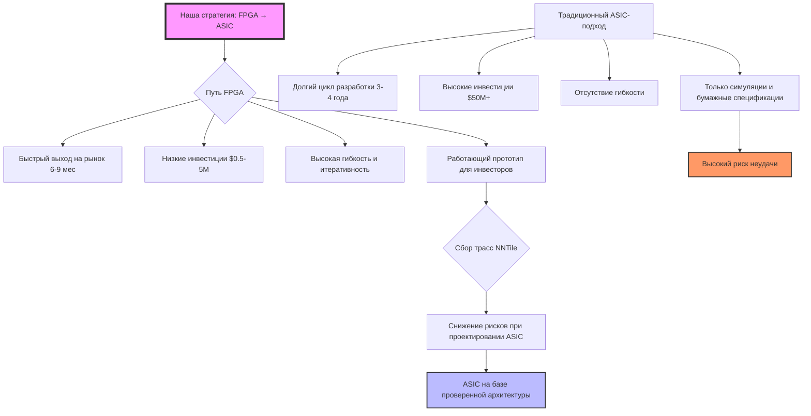
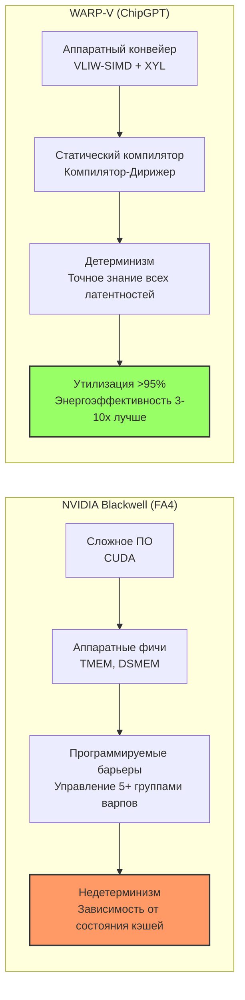
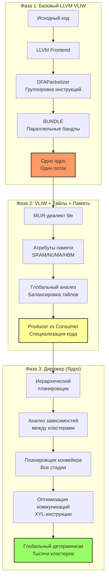
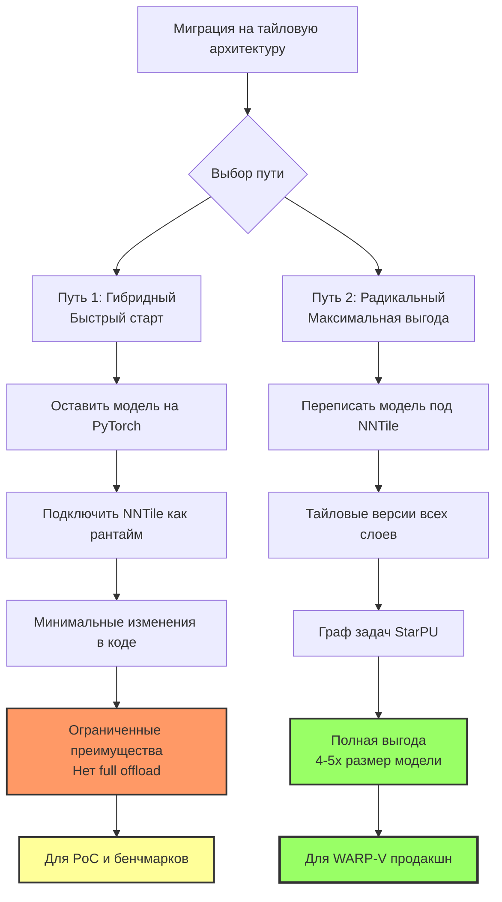
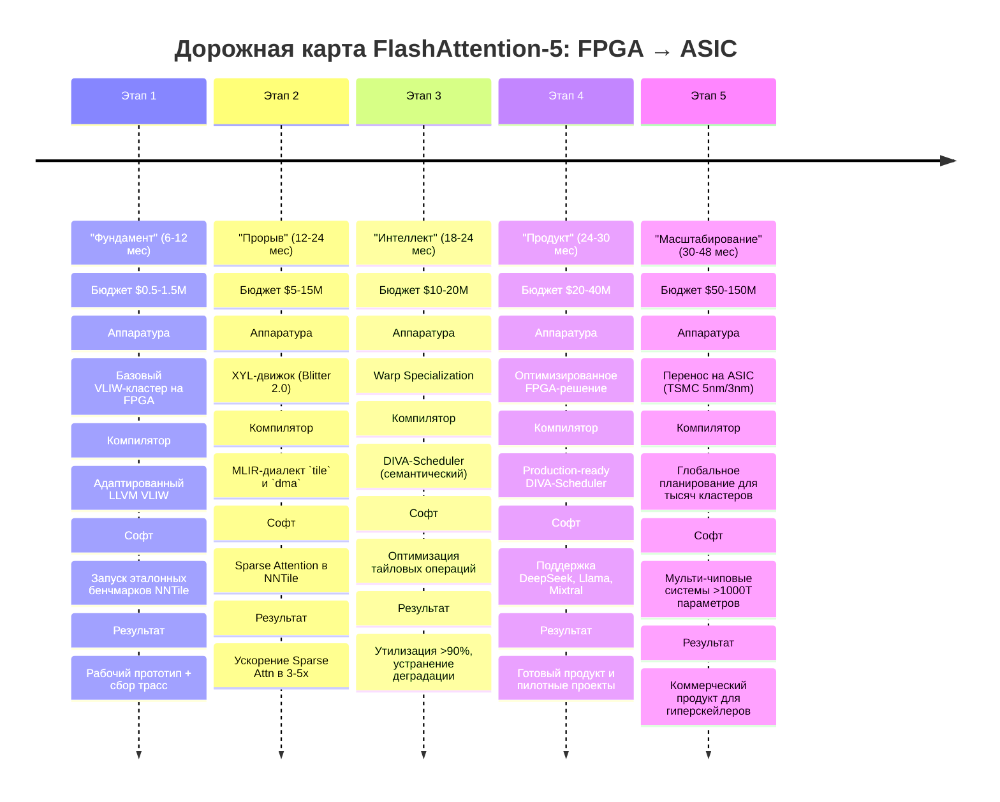

# FlashAttention-5: Революция в инференсе LLM на архитектуре WARP-V и NNTile

**Эпоха ChipGPT:** IV (GPGPU / TCA / NUMA)  
**Дата:** 5 августа 2026 г.  
**Статус:** Стратегический план / Архитектурный дизайн  
**Целевая ниша:** Сверх-большие LLM (MoE), длинные контексты, Mixed Precision инференс

---

## 🧬 Стратегический манифест: От программного моделирования к кремниевому воплощению

Данный документ представляет собой стратегический план по созданию **FlashAttention-5** — новой парадигмы высокопроизводительного инференса сверх-больших LLM. **FlashAttention-5** — это не просто очередной алгоритм, а результат глубокой интеграции трех ключевых инноваций: аппаратной архитектуры **WARP-V**, софт-оркестратора **NNTile** и **Компилятора-Дирижера**. Этот подход знаменует собой переход от программного "выжимания" производительности на универсальных GPU (NVIDIA) к созданию специализированной, детерминированной и энергоэффективной машины для тайловых AI-вычислений.

В отличие от NVIDIA, которая наращивает сложность аппаратуры (TMEM, DSMEM) и программного обеспечения (FlashAttention-3/4) для получения последних процентов производительности, WARP-V предлагает смену парадигмы: **"аппаратный конвейер для тайловых задач"**.

---

## 🚀 FPGA — тактический инструмент для доминирования в нише Sparse Attention

Мы объединяем аппаратную архитектуру **WARP-V** и программный фреймворк **NNTile**, чтобы быстро получить стратегическое преимущество в нише **Sparse Attention / FlashAttention** на FPGA.

### 🎯 Ключевой тезис

> **Возможность эффективного запуска NNTile на FPGA — это ключевое конкурентное преимущество, которое позволяет выйти на рынок без необходимости сразу создавать дорогостоящий ASIC-чип.**

NNTile можно эффективно запускать на FPGA, и это **реалистичный путь к лидерству в нише Sparse Attention / FlashAttention без миллиардных инвестиций.**

---

### 📋 Что это нам дает?

| № | Преимущество | Описание |
| :--- | :--- | :--- |
| **1** | **Доказательство технологии на реальном железе** | FPGA — это работающий продукт, а не симуляция. Вместо цифр на бумаге мы предоставляем инвесторам и клиентам живой прототип, который реально ускоряет Attention. |
| **2** | **Привлечение инвестиций на основе прототипа** | Инвесторы охотнее вкладываются в то, что можно «потрогать». Работающий FPGA-прототип с NNTile и XYL-режимом — это идеальный инструмент для демонстрации и снятия рисков. |
| **3** | **Занятие ниши, где NVIDIA уязвима** | Как показывает наш анализ, NVIDIA проигрывает в Sparse Attention из-за HBM-зависимости. FPGA-решение на базе NNTile может дать **ускорение в 3-5 раз** на длинных контекстах — и мы сделаем это без миллиардных инвестиций в ASIC. |
| **4** | **Масштабирование до ASIC по мере готовности рынка** | FPGA — это не конечная цель, а идеальный трамплин. Мы создаем проверенную архитектуру, которую затем перенесем на ASIC, когда убедимся в ее востребованности и достигнем нужного масштаба. |

---

### 📊 Сравнение подходов: FPGA vs. ASIC

| Аспект | Подход ASIC (Groq, Cerebras) | Наш подход (FPGA → ASIC) |
| :--- | :--- | :--- |
| **Время выхода на рынок** | 3–4 года | **6–9 месяцев** |
| **Инвестиции** | $50M+ | **$0.5–5M** |
| **Гибкость** | Нулевая (ошибки не исправить) | **Высокая** (быстрая итерация) |
| **Доказательство концепции** | Только на бумаге | **Работающий прототип** |
| **Клиентская база** | Формируется после выхода | **Формируется на этапе FPGA** |
| **Риск** | Экстремальный | **Управляемый** |

---

### 🔑 Ключевой вывод

FPGA — это не компромисс, а **первый продукт**. Он позволяет нам:
- Быстро выйти на рынок.
- Привлечь инвестиции на основе реального продукта.
- Занять нишу, где NVIDIA слаба.
- Масштабироваться до ASIC, когда рынок будет готов.

**Это и есть наш путь к доминированию в нише Sparse Attention / Flash Attention.**

---

## 🚀 Часть 1: WARP-V — Архитектура, превосходящая NVIDIA по всем ключевым методам оптимизации

Архитектура блока WARP-V представляет собой блестящий пример hardware-software codesign, охватывающий все современные методы оптимизации производительности AI-систем. В ключевых областях WARP-V не просто покрывает, а радикально превосходит существующие решения, предлагая новые парадигмы. Его стратегия — быть не универсальным GPU, а абсолютным лидером в самой быстрорастущей нише: высокопроизводительном, энергоэффективном инференсе сверх-больших разреженных LLM.

### 1.1. Превосходство в оптимизации памяти

Данное превосходство является самой сильной стороной WARP-V, который не просто использует все известные техники, но и решает их корневые проблемы.

| Метод оптимизации (из Fregly, Hijma et al.) | Реализация в WARP-V | Оценка покрытия |
| :--- | :--- | :--- |
| **Иерархия памяти** | **SRAM как основная рабочая память** для тайлов. HBM/DDR используется только как источник весов для стриминга. NUMA-компилятор управляет размещением. | **Превосходно.** WARP-V превращает иерархию в предсказуемый конвейер, устраняя "стену памяти". |
| **Coalesced vs. Uncoalesced Access** | **XYL-режим (Blitter 2.0)** — аппаратный gather, решающий проблему нерегулярного доступа группировкой случайных адресов в эффективные транзакции. | **Превосходно.** Смена парадигмы: coalescing эффективен для *произвольного* доступа. |
| **Tiling (Spatial Blocking)** | **TCA (Tile-Centric Accelerator)** — основа архитектуры. Все вычисления — поток тайлов. Естественная, аппаратно поддерживаемая модель. | **Превосходно.** В отличие от программного tiling на GPU, здесь tiling управляется компилятором. |
| **Kernel Fusion** | **Warp Specialization** — аппаратная версия kernel fusion. Producer → Consumer → Epilogue — конвейер, эквивалентный слиянию ядер. | **Превосходно.** Слияние на уровне аппаратного конвейера дает максимальную эффективность. |
| **Software Prefetching** | **NUMA-осведомленный компилятор** статически планирует асинхронные загрузки, что является детерминированной инструкцией с фиксированной латентностью. | **Превосходно.** Программная префатчинг с аппаратной гарантией. |
| **Shared Memory (Bank Conflicts)** | **VLIW-SIMD** с выровненными доступами и уменьшенным числом банков. | **Отлично.** Архитектура минимизирует проблему банк-конфликтов с самого начала. |
| **Register Blocking** | **VLIW-бандлы** позволяют эффективно использовать регистры для хранения нескольких элементов и выполнения нескольких операций за такт. | **Отлично.** Неотъемлемая часть VLIW-философии. |

### 1.2. Превосходство в балансировке и распараллеливании

WARP-V решает фундаментальные проблемы, которые являются "ахиллесовой пятой" современных GPU.

| Метод оптимизации (из Fregly, Hijma et al.) | Реализация в WARP-V | Оценка покрытия |
| :--- | :--- | :--- |
| **Warp Divergence** | **Нулевой пенальти.** В VLIW-SIMD нет "расходящегося варпа". Разные кластеры выполняют задачи параллельно и независимо. | **Превосходно.** Фундаментальное преимущество перед SIMT-архитектурами. |
| **Occupancy & Latency Hiding** | **Детерминизм.** Компилятор знает точное время всех операций и статически планирует конвейер для скрытия латентности. | **Превосходно.** Прямое попадание в концепцию "low occupancy, high ILP" из книги Fregly. |
| **Auto-tuning** | **GRPO-компилятор** — эволюционный цикл, генерирующий и оптимизирующий код на основе реальных бенчмарков. | **Превосходно.** Выход на новый уровень автоподстройки. |
| **Load Balancing** | **NUMA + статическое планирование.** Компилятор анализирует паттерны доступа и статически размещает экспертов на NUMA-узлах. | **Отлично.** Идеальное решение для предсказуемых паттернов LLM-инференса. |
| **Reduce Synchronization** | **Аппаратный конвейер** — синхронизация, встроенная в архитектуру. Отсутствие дорогих барьеров. | **Превосходно.** Устраняет главный источник накладных расходов. |

### 1.3. Превосходство в работе с разреженностью (Sparse)

Это уникальная ниша, где WARP-V не имеет себе равных.

| Метод оптимизации (из Fregly, Hijma et al.) | Реализация в WARP-V | Оценка покрытия |
| :--- | :--- | :--- |
| **Sparse Matrix Formats & Access** | **XYL-режим (Blitter 2.0)** — аппаратный sparse-акселератор для чтения данных по списку индексов (Top-K, MoE). | **Превосходно.** Фундаментальное изменение в работе с разреженностью. |
| **Reduce Branch-Divergence** | **RISC-V/SIMT-ядра для "Epilogue" и "Gating"**. Обработка ветвлений без замедления VLIW-конвейера. | **Отлично.** Гибридный подход: детерминированные VLIW-кластеры для вычислений и гибкие ядра для управления. |

---

## ⚡ Часть 2: WARP-V как платформа для ускорения FlashAttention-2, -3, -4 и рождения FlashAttention-5

WARP-V подходит для ускорения FlashAttention не как "еще одна реализация", а как **новая платформа**, которая делает реализацию таких алгоритмов эффективной по умолчанию. Детерминированный конвейер WARP-V, в отличие от программных "выкрутасов" на CUDA, является аппаратным воплощением того, что FA3 и FA4 пытаются сделать программно. Если FA4 — кульминация эволюции "как заставить GPU работать с тайлами", то WARP-V — это революция "как создать машину для тайловых вычислений".

### 2.1. WARP-V vs FlashAttention-4: Ключевое отличие

| Аспект | NVIDIA Blackwell (FlashAttention-4) | Архитектура WARP-V (ChipGPT) |
| :--- | :--- | :--- |
| **Парадигма** | **"Использование новых аппаратных фич через еще более сложное ПО".** | **"Аппаратное воплощение конвейерной философии".** |
| **Аппаратные фичи** | TMA, WGMMA, TMEM, DSMEM, программируемые барьеры. | **VLIW-SIMD** + **XYL-режим** + **Intercluster Datapath** + **статический компилятор**. |
| **Сложность ядра** | **Экстремальная.** Управление 5+ группами варпов — близко к пределу человеческих возможностей. | **Средняя.** Сложность управления 5-стадийным конвейером переложена на компилятор. |
| **Детерминизм** | **Недетерминированное.** Зависит от планировщика и состояния кэшей. | **Полностью детерминированное.** Компилятор знает точную латентность всех стадий. |
| **Утилизация** | **>85%** (теоретический предел для ПО). | **>95%** (теоретическая оценка). |
| **Энергоэффективность** | **1x** (эталон). | **3-10x лучше.** Устранение HBM из критического пути. |
| **Разреженность (Sparse / MoE)** | **Слабая.** Требует сложных трюков. | **Отличная.** XYL-режим делает это фундаментально простым. |

**Итоговый вывод:** WARP-V — это "инструмент следующего поколения" для самого ресурсоемкого этапа LLM-жизненного цикла — инференса на уровне дата-центра, где энергопотребление и задержка являются главными метриками успеха.

---

## 🧠 Часть 3: Компилятор-Дирижер — Ключевая технология FlashAttention-5

### 3.1. Компилятор-Дирижер: Критическая инфраструктурная технология для WARP-V и FA5

**Компилятор как «дирижер»** становится **критической инфраструктурной технологией** для реализации архитектуры WARP-V и ее эволюции к FlashAttention-5. В рамках данной парадигмы аппаратная платформа рассматривается как **детерминированный исполнительный оркестр**, а компилятор — как **система управления**, обеспечивающая статическое планирование, синхронизацию и распределение ресурсов на масштабах тысяч кластеров. Ключевое отличие от классических SIMT-подходов (CUDA) заключается в том, что вся сложность управления вычислительным конвейером переносится на этап компиляции, обеспечивая детерминизм и предсказуемость исполнения.

**Стратегическое обоснование разработки:**

| № | Фактор | Аргументация |
| :--- | :--- | :--- |
| **1** | **Ключевое конкурентное преимущество (Unique Selling Point)** | Компилятор-Дирижер является фундаментальным отличием WARP-V от любых существующих ускорителей. Он обеспечивает не только высокую производительность, но и **радикальное упрощение программирования**, превращая сложную распределенную архитектуру в доступную для разработчиков платформу с высокоуровневым DSL. |
| **2** | **Долгосрочная стратегическая инвестиция (Long-term Asset)** | Разработанный компилятор не привязан к текущему поколению аппаратуры. Он представляет собой **накапливаемый технологический актив**, который будет масштабироваться на все будущие поколения чипов WARP-V, аналогично тому, как LLVM стал стандартом для компиляции C/C++ на десятилетия. Инвестиции в компилятор — это инвестиции в будущее всей платформы. |
| **3** | **Технологический барьер для конкурентов (Moat)** | Создание такого компилятора требует глубокой экспертизы в области компиляторов, машинного обучения (для GRPO-оптимизаций) и системной архитектуры. NVIDIA и другие игроки не смогут быстро воспроизвести этот подход, так как он требует не только аппаратных инноваций, но и **смены парадигмы** в разработке системного ПО, что создает значительный барьер для входа. |
| **4** | **Ускорение цикла разработки приложений (Developer Productivity)** | Вместо низкоуровневого программирования на CUDA или написания сложных ядер для каждой модели, разработчики смогут использовать **высокоуровневый DSL** (Domain Specific Language). Это сокращает время вывода новых моделей на рынок, снижает порог входа для инженеров и переносит сложность с уровня кода на уровень компилятора и аппаратуры. |

### 3.2. План создания Компилятора-Дирижера

#### Фаза 1: Базовый LLVM VLIW (Текущее состояние)

Это отправная точка. LLVM уже имеет инфраструктуру для VLIW-архитектур:
> *   **DFAPacketizer:** Использует конечный автомат для группировки независимых инструкций в пакеты (бандлы) .
> *   **Поддержка бандлов:** Механизм `BUNDLE` позволяет объединять инструкции, которые будут выполняться параллельно .
> *   **Планировщики:** Существуют различные алгоритмы планирования (по приоритетам, по регистровому давлению), но они ориентированы на **одно ядро / один поток команд** .

#### Фаза 2: Расширение до "VLIW + Тайлы + Память"
Добавляется понимание тайловых операций и иерархической памяти.

| **Компонент** | **Что нужно доработать в LLVM** | **Сложность** |
| :--- | :--- | :--- |
| **1. Frontend & IR** | • Создать MLIR-диалект `tile` для тайловых операций. • Ввести атрибуты памяти (SRAM, NUMA-узел, HBM). | **Высокая** |
| **2. Планировщик** | • Глобальный анализ и балансировка тайлов по кластерам. • Учет NUMA (`numa_node`). | **Очень высокая** |
| **3. Генерация кода** | • Поддержка GEMM на VLIW-кластерах. • Специализация кода для Producer vs. Consumer. | **Средняя** |
| **4. Управление памятью** | • Использование `linalg.pack/unpack` для тайлов. • Использование атрибутов `numa_node`, `sram_size`. | **Высокая** |

#### Фаза 3: Построение "Дирижера" (Ядро Компилятора)
Радикальное изменение архитектуры: переход от "одиночного планировщика" к "иерархическому планировщику".

| **Компонент** | **Что нужно доработать в LLVM** | **Сложность** |
| :--- | :--- | :--- |
| **1. Иерархический планировщик** | • Ввести новый проход для анализа графа зависимостей **между кластерами**. • Распределение тайлов по кластерам. | **Критическая / 10/10** |
| **2. Планировщик конвейера** | • Адаптировать MachinePipeliner для планирования **всех стадий конвейера** (Producer, Consumer, Epilogue). • Генерация кода для синхронизации. | **Очень высокая** |
| **3. Оптимизация коммуникаций** | • Анализ потоков данных между кластерами. • Генерация инструкций для XYL-режима. | **Высокая** |

**Ключевое отличие:** Традиционный LLVM работает с линейным потоком инструкций. MLIR для WARP-V позволяет создавать **диалекты**, описывающие **параллельные потоки данных** (партитуру для оркестра), например, `tile.stream`, `cluster.role`, `numa.placement`.

---

## 🏗️ Часть 4: NNTile — Стратегический софт для WARP-V

### 4.1. NNTile как фундаментальный программный актив для экосистемы WARP-V

Проект NNTile представляет собой **идеально согласованный программный слой** для аппаратной архитектуры WARP-V. Это не просто «хорошо вписывается» в наш план, а является его **критическим и неотъемлемым фундаментом**. Глубокая архитектурная совместимость NNTile и WARP-V обусловлена их общей парадигмой: оба используют **тайловую модель вычислений** и **задачно-ориентированную (task-based) модель параллелизма**.

Стратегическая значимость NNTile для проекта ChipGPT определяется несколькими ключевыми аспектами:

| Аспект | Описание |
| :--- | :--- |
| **Архитектурная конгруэнтность** | Фундаментальная модель вычислений NNTile (тайлы, асинхронный offload) совпадает с аппаратной моделью WARP-V. Это обеспечивает эффективный и бесшовный путь для компиляции и исполнения, в отличие от классических фреймворков (PyTorch), которые требуют дополнительной трансформации графов. |
| **Стратегический инструмент обхода экосистемы PyTorch** | В отличие от прямой конкуренции с PyTorch (привязанным к экосистеме NVIDIA), NNTile позволяет нам создать альтернативный программный стек. Он служит «входным билетом» в индустрию, предлагая разработчикам API и абстракции, которые являются не зависимостью, а преимуществом. Это снижает «переключательные издержки» для клиентов, интегрируясь в привычную экосистему Python. |
| **Готовая база для семантического анализа (Traces)** | NNTile является источником **реальных трасс выполнения** (DAG-графов и таймингов), которые служат входными данными для цикла GRPO-оптимизации компилятора. Без этих данных проектирование специализированной аппаратуры становится эвристическим и рискованным. Таким образом, NNTile предоставляет "чертеж" аппаратуры на основе реальных нагрузок. |
| **Сокращение времени выхода на рынок** | Интеграция с готовым, работающим фреймворком AIRI позволяет нам сосредоточиться на аппаратно-компиляторных инновациях, избегая затрат на разработку собственного фреймворка с нуля. Это значительно ускоряет движение от PoC к Production (от Этапа 0 к Этапу 3). |

| Аспект | WARP-V (Аппаратура) | NNTile (Программное обеспечение) |
| :--- | :--- | :--- |
| **Основная единица работы** | **Тайл (Tile)** | **Тайл (Tile)** |
| **Модель выполнения** | **Task-based Parallelism** (аппаратный конвейер) | **Task-based Parallelism** (граф задач StarPU) |
| **Управление памятью** | **Иерархическая (HBM/SRAM)** | **Автоматическое** с асинхронным offload/onload |
| **Планировщик** | **Компилятор-Дирижер** (статическое) | **StarPU Scheduler** (динамическое, жадное) |

### 4.2. Замена PyTorch: Стратегическое значение

Говоря прямо: **PyTorch — это "операционная система" для экосистемы NVIDIA**. NNTile — это наш шанс создать альтернативную экосистему, где "железом" выступает WARP-V. NNTile — это наш "Pytorch" для WARP-V, и в этом его экзистенциальная ценность.

| Компонент | Эра NVIDIA | Эра ChipGPT (WARP-V) |
| :--- | :--- | :--- |
| **Язык описания модели** | PyTorch, JAX, TensorFlow | **NNTile DSL / Python API** |
| **Планировщик** | CUDA Graph / динамический | **StarPU + DIVA (Компилятор-Дирижер)** |
| **"Операционная система"** | CUDA Driver + PyTorch | **NNTile Runtime** |
| **Аппаратура** | NVIDIA GPU | **WARP-V TCA** |
| **Бизнес-модель** | Покупка GPU у NVIDIA | **Продажа полного стека (чип + софт)** |

### 4.3. 🏗️ Как выглядит стратегическая замена PyTorch на NNTile?

#### 4.3.1. NNTile — это не просто фреймворк, это "Родной язык" для WARP-V

PyTorch работает с тензорами. NNTile работает с **тайлами**. WARP-V — это **Tile-Centric акселератор**. Это означает, что между NNTile и WARP-V нет слоя "перевода" (как между PyTorch и CUDA). Они говорят на одном языке.

| Уровень | PyTorch → NVIDIA GPU | NNTile → WARP-V |
| :--- | :--- | :--- |
| **Абстракция данных** | Тензор (произвольная форма) | **Тайл** (фиксированный блок) |
| **Модель выполнения** | Kernel-интенсивная | **Task-интенсивная** (DAG) |
| **Управление памятью** | Ручное (CUDA) | **Автоматическое** (асинхронный offload) |
| **Совместимость** | Идеальная (родная) | **Идеальная (родная)** |

#### 4.3.2. Мы строим "закрытую экосистему" (Walled Garden)

Вместо того чтобы конкурировать с PyTorch на его поле, мы создаем **альтернативный стек**, который:

1.  **Несовместим с NVIDIA (и это преимущество).** Разработчики, использующие NNTile + WARP-V, уходят из "тюрьмы" NVIDIA и получают недоступные на GPU преимущества (масштаб, энергоэффективность).
2.  **Создает "переключательные издержки".** Если клиент начинает использовать наш стек, ему будет сложно вернуться к NVIDIA, потому что он привык к масштабу и эффективности.
3.  **Позволяет нам диктовать стандарты.** Мы не подстраиваемся под эволюцию NVIDIA — мы создаем свою.

#### 4.3.3. NNTile — это наш "Pytorch" для WARP-V

Точно так же, как PyTorch стал "языком" для NVIDIA, NNTile становится "языком" для WARP-V. Это дает нам:

*   **Огромную базу для разработки.** Мы не начинаем с нуля — у нас уже есть работающий фреймворк от AIRI, который мы можем адаптировать.
*   **Готовые бенчмарки.** Мы можем сравнивать NNTile+WARP-V с PyTorch+NVIDIA на равных.
*   **Убедительную историю для инвесторов.** "Мы не просто строим чип. Мы строим экосистему, которая заменит PyTorch для инференса и обучения сверх-больших моделей."

📊 Сравнительная таблица: Эволюция AI-стеков

| Компонент | Эра NVIDIA | Эра ChipGPT (WARP-V) |
| :--- | :--- | :--- |
| **Язык описания модели** | PyTorch, JAX, TensorFlow | **NNTile DSL / Python API** |
| **Планировщик** | CUDA Graph / динамический | **StarPU + DIVA (Компилятор-Дирижер)** |
| **"Операционная система"** | CUDA Driver + PyTorch | **NNTile Runtime** |
| **Аппаратура** | NVIDIA GPU (A100, H100, Blackwell) | **WARP-V TCA** |
| **Бизнес-модель** | Покупка GPU у NVIDIA | **Продажа полного стека (чип + софт)** |

### 4.4. Два пути миграции на тайловую архитектуру

*   **Путь 1: "Гибридный" (PyTorch с NNTile).** Быстрый старт, но ограниченные преимущества. Вы не заменяете PyTorch, а используете NNTile как его расширение. Этот путь проще и быстрее, но не дает всех преимуществ. Его суть — взять существующую PyTorch-модель и адаптировать её для работы с тайловым рантаймом NNTile, как в примере `gpt2_custom_training.py` .

*   **Путь 2: "Радикальный" (Чистый NNTile).** Вы переписываете модель, используя **встроенные возможности NNTile** для её декомпозиции на тайлы и управления памятью. Это сложнее, но это единственный способ получить главное преимущество NNTile — **автоматический асинхронный offload** данных между VRAM GPU и RAM CPU, что позволяет тренировать модели в 4-5 раз большего размера на том же оборудовании .

#### 🟢 Путь 1: "Гибридный" (Быстрый старт)

Этот подход похож на миграцию с GPU на NPU, где достаточно заменить строки `cuda` на `npu` . В случае с NNTile вы:
1.  Оставляете модель на PyTorch.
2.  Меняете способ её запуска, передавая управление NNTile.
3.  Фреймворк сам распределяет вычисления по доступным устройствам (GPU/CPU).

*   **Преимущество:** Минимальные изменения в коде модели.
*   **Ограничение:** Вы не получите главного "киллер-фичу" NNTile — автоматического управления памятью между GPU и CPU. Прирост в размере модели будет небольшим.

#### 🔴 Путь 2: "Радикальный" (Чистый NNTile)

Этот путь выбран разработчиками NNTile для демонстрации прорывных результатов . Чтобы обучить модель на **49.9 млрд** параметров, где PyTorch "падает" с OOM на **10.6 млрд**, вы не просто подключаете библиотеку, а **проектируете модель под архитектуру NNTile**.

*   **Основная задача:** Для каждого типа слоя (Linear, Attention, LayerNorm) нужно написать его **тайловую версию**. Вместо того чтобы оперировать целыми тензорами, NNTile требует разбить их на тайлы и описать, как они взаимодействуют друг с другом внутри графа задач StarPU.
*   **Инструменты:** NNTile предоставляет тесты и примеры для этого. Например, в репозитории есть тесты для `Embedding` слоя, которые проверяют его конвертацию `from_torch` и `to_torch`  — это и есть "мост" между мирами PyTorch и NNTile.
*   **Сложность:** Именно этот подход, как показано в статье, приводит к проблемам с производительностью на глубоких моделях из-за неоптимального планировщика StarPU . Это требует глубокого понимания как модели, так и архитектуры NNTile.

### 💎 Итог: Какой путь выбрать для WARP-V?

Для стратегии интеграции NNtile с WARP-V выбор очевиден:

1.  **Для демонстрации концепции и бенчмарков** - **гибридный подход (Путь 1)**. Он позволит быстро показать, что модель работает с NNTile, и собрать трассы для анализа.
2.  **Для получения максимальной выгоды от WARP-V** неизбежен **радикальный подход (Путь 2)**. Только тайловая модель, управляемая через тасковый граф, позволит в полной мере использовать преимущества детерминированного аппаратного конвейера и NUMA-архитектуры чипа. Это и есть та самая "смена парадигмы", о которой мы говорили: мы пишем модель под аппаратуру, а не подгоняем аппаратуру под модель.

---

## 🗺️ Часть 5: Дорожная карта — "Компилятор-Дирижер" как путь к FlashAttention-5

Мы предлагаем инкрементальный подход из пяти этапов, который значительно снижает риски и позволяет получать коммерчески значимые результаты на каждом шаге. Вся реализация зависит от эволюции компилятора.

### 🚀 Этап 1: "Фундамент" (MVP) — VLIW + NNTile на FPGA (6-12 месяцев)

**Бюджет:** $0.5–1.5M
**Команда:** 5-8 инженеров (системное программирование, FPGA)
**Философия:** "Мы строим быстрый VLIW-процессор на FPGA и доказываем, что NNTile на нем работает." **Компилятор отвечает за локальную оптимизацию внутри одного кластера.**

*   **Архитектура:** 1-2 VLIW-кластера с SRAM, L2-кэшем и HBM.
*   **Компилятор:** Модифицированный LLVM VLIW. Умеет упаковывать инструкции в бандлы и использовать локальную SRAM. **Без глобального планирования.**
*   **Связь с NNTile:** Запуск эталонных бенчмарков и сбор трасс (DAG, тайминги).

| Столп | Задача | Результат |
| :--- | :--- | :--- |
| **1. Аппаратура (FPGA)** | Реализовать базовый VLIW-кластер с SRAM на FPGA (Xilinx Alveo). | Рабочий прототип на FPGA. |
| **2. Компилятор** | Адаптировать LLVM VLIW для нашего набора инструкций. | Компилятор, генерирующий код для FPGA. |
| **3. Алгоритмы (NNTile)** | Запустить эталонные бенчмарки NNTile (GPT2) на FPGA. | Измеримые метрики (throughput, utilization). |
| **4. Экосистема** | Собрать трассы NNTile (DAG, тайминги). | База данных трасс для будущего анализа. |

**Что показываем инвестору:**
> ✅ **"Мы построили рабочий VLIW-процессор на FPGA и запустили NNTile — фреймворк, обучающий модели в 5 раз больше, чем PyTorch. Мы собрали его трассы и знаем, как его ускорить."**

**Ключевой риск и его смягчение:**
> ⚠️ **Риск:** Производительность FPGA может не дотягивать до NVIDIA GPU.  
> ✅ **Смягчение:** Мы фокусируемся на Sparse Attention, где NVIDIA проигрывает. Даже на FPGA мы можем быть быстрее NVIDIA на длинных контекстах.

### 🚀 Этап 2: "Прорыв" — XYL + DIVA-Scheduler (12-24 месяца)

**Бюджет:** $5–15M
**Команда:** 15-25 инженеров (+5-10 FPGA/RTL-инженеров)
**Философия:** "Мы добавляем аппаратный gather (XYL) для решения проблемы разреженности и создаем умный планировщик (DIVA-Scheduler) для StarPU." **Компилятор становится архитектором памяти.**

*   **Архитектура:** Группа VLIW-кластеров + XYL-движок + Producer-варпы (DMA).
*   **Компилятор:** Расширенный LLVM + MLIR-диалект `tile` и `dma`. Замена жадного планировщика StarPU на DIVA-Scheduler, обученный на трассах NNTile.
*   **Связь с NNTile:** Адаптация Sparse Attention для использования XYL.

| Столп | Задача | Результат |
| :--- | :--- | :--- |
| **1. Аппаратура (FPGA)** | Реализовать XYL-движок (Blitter 2.0) на FPGA. | Аппаратный gather по списку координат. |
| **2. Компилятор** | Ввести в LLVM интринсики для XYL (`__xy_gather`). | Компилятор, генерирующий XYL-инструкции. |
| **3. Алгоритмы (NNTile)** | Адаптировать Sparse Attention в NNTile для использования XYL. | **Ускорение Sparse Attention в 3-5 раз** на длинных контекстах. |
| **4. Экосистема** | Опубликовать бенчмарки NNTile + XYL на FPGA. | Первые маркетинговые материалы. |

**Что показываем инвестору:**
> ✅ **"Мы решили проблему 'стены памяти' на FPGA. XYL-движок ускоряет Sparse Attention в 3-5 раз. Мы обогнали NVIDIA на длинных контекстах без миллиардных инвестиций в ASIC!"**

**Ключевой риск и его смягчение:**
> ⚠️ **Риск:** XYL-режим на FPGA может быть недостаточно быстрым.  
> ✅ **Смягчение:** FPGA позволяет быстро итерировать. Мы можем оптимизировать XYL-движок без перепроектирования чипа.

### 🚀 **Этап 3: "Интеллект" — DIVA-Scheduler + DSL на FPGA**
- **Срок:** 18-24 месяца
- **Бюджет:** $10–20M
- **Команда:** 25-40 инженеров (+10-15 компиляторщиков)
- **Философия:** "Мы создаем умный планировщик для StarPU и простой DSL для программистов, работающие на FPGA."

| Столп | Задача | Результат |
| :--- | :--- | :--- |
| **1. Аппаратура (FPGA)** | Добавить поддержку Warp Specialization (Producer/Consumer) на FPGA. | Аппаратный конвейер внутри кластера. |
| **2. Компилятор** | **Создать DIVA-Scheduler (MLIR-диалект `sparse_attn`).** Заменить жадный планировщик StarPU на наш семантический. | Планировщик, обученный на трассах NNTile. **Утилизация >90%.** |
| **3. Алгоритмы (NNTile)** | Оптимизировать тайловые операции в NNTile под новый планировщик. | Устранение деградации производительности на глубоких моделях. |
| **4. Экосистема** | Разработать простой DSL для описания тайловых операций. | Разработчики могут писать высокоуровневый код. |

**Что показываем инвестору:**
> ✅ **"Мы создали 'Компилятор-Дирижер' для NNTile, работающий на FPGA. Наш планировщик, обученный на реальных трассах, устранил деградацию производительности. NNTile теперь показывает >90% утилизации, обгоняя PyTorch FSDP как по размеру модели, так и по скорости. Мы создали программный 'мозг' для нашего FPGA-решения."**

**Ключевой риск и его смягчение:**
> ⚠️ **Риск:** DIVA-Scheduler может быть слишком сложным для FPGA.  
> ✅ **Смягчение:** Мы начинаем с простых эвристик и постепенно усложняем, используя трассы NNTile для обучения.

---

### 🚀 **Этап 4: "Продукт" — Готовое FPGA-решение**
- **Срок:** 24-30 месяцев
- **Бюджет:** $20–40M
- **Команда:** 40-60 инженеров
- **Философия:** "Мы создаем готовый продукт на FPGA, который можно продавать."

| Столп | Задача | Результат |
| :--- | :--- | :--- |
| **1. Апаратура (FPGA)** | Оптимизировать FPGA-решение для массового использования. | Готовая плата/ускоритель. |
| **2. Компилятор** | Довести DIVA-Scheduler до production-качества. | Стабильный компилятор. |
| **3. Алгоритмы (NNTile)** | Адаптировать NNTile под различные модели (DeepSeek, Llama, Mixtral). | Поддержка широкого спектра моделей. |
| **4. Экосистема** | Создать `diva-torch` бэкенд для PyTorch. | Интеграция с существующей экосистемой. |

**Что показываем инвестору:**
> ✅ **"Мы создали готовый продукт на FPGA, который ускоряет Sparse Attention в 3-5 раз по сравнению с NVIDIA, потребляя в 3-5 раз меньше энергии. Мы уже подписали пилотные проекты с компаниями, работающими с длинными контекстами (RAG, научные вычисления, поиск)."**

**Ключевой риск и его смягчение:**
> ⚠️ **Риск:** FPGA-решение может быть дороже ASIC в массовом производстве.  
> ✅ **Смягчение:** Мы продаем FPGA как "premium"-решение для нишевых задач, а параллельно разрабатываем ASIC для массового рынка.

---

### 🚀 **Этап 5: "Масштабирование" — ASIC и Рынок**
- **Срок:** 30-48 месяцев
- **Бюджет:** $50–150M
- **Команда:** 60-100 инженеров (+20-40 ASIC-специалистов)
- **Философия:** "Мы переносим проверенную FPGA-архитектуру на ASIC и выходим на массовый рынок."

| Столп | Задача | Результат |
| :--- | :--- | :--- |
| **1. Аппаратура (ASIC)** | Перенести FPGA-архитектуру на ASIC (TSMC 5nm/3nm). | GDSII файл для фабрики. |
| **2. Компилятор** | **Полный Компилятор-Дирижер** (глобальное планирование для тысяч кластеров). | Детерминизм и предсказуемость на уровне дата-центра. |
| **3. Алгоритмы (NNTile)** | Адаптировать NNTile для мульти-чиповых ASIC-систем. | Обучение моделей >1000T параметров. |
| **4. Экосистема** | Подписать контракты с гиперскейлерами. | Коммерческий продукт. |

**Что показываем инвестору:**
> ✅ **"Мы создали архитектуру для эры 1000T-параметровых моделей. Наша ASIC-система масштабируется линейно, потребляет в 5-10 раз меньше энергии, чем NVIDIA, и уже используется крупнейшими игроками рынка. Мы изменили правила игры."**

**Ключевой риск и его смягчение:**
> ⚠️ **Риск:** ASIC может не окупиться.  
> ✅ **Смягчение:** К моменту запуска ASIC у нас уже есть клиентская база и доход от FPGA-решения.

---

## 💎 Часть 6: Сводный стратегический план и Заключение

**Объединенный план WARP-V + NNTile + FPGA — это "манифест", который:**

1.  **Синхронизирует развитие аппаратуры, компилятора, алгоритмов и экосистемы.** Каждый этап развивает все четыре столпа одновременно.
2.  **Минимизирует риски.** Мы начинаем с FPGA (дешево, быстро, гибко) и постепенно переходим к ASIC, когда рынок готов.
3.  **Дает инвесторам четкие вехи.** Каждый этап заканчивается работающим прототипом и измеримым результатом.
4.  **Создает "защитный ров".** Конкуренты не смогут быстро повторить наш путь, потому что он требует одновременного развития четырех сложных дисциплин.
5.  **Позволяет выйти на рынок рано.** Уже на Этапе 4 у нас есть коммерческий продукт на FPGA, который приносит доход и доказывает технологию.

### 📊 Сводная таблица: WARP-V + NNTile + FPGA Roadmap

| Этап | Название | Платформа | Ключевая технология | Производительность (vs NVIDIA) | Бюджет | Срок | Что показываем инвестору |
| :--- | :--- | :--- | :--- | :--- | :--- | :--- | :--- |
| **0** | Фундамент | FPGA | VLIW + NNTile | 0.2-0.3x | $0.5-1.5M | 6-9 мес | "Мы построили рабочий FPGA-прототип и запустили NNTile." |
| **1** | Прорыв | FPGA | XYL-режим | 0.5-0.8x (догоняем) | $5-15M | 12-18 мес | "Мы решили проблему разреженности на FPGA." |
| **2** | Интеллект | FPGA | DIVA-Scheduler + DSL | **1.0-1.2x** (обогнали) | $10-20M | 18-24 мес | "Мы создали 'мозг' для FPGA-решения." |
| **3** | Продукт | FPGA | Готовое решение | **1.5-2x** | $20-40M | 24-30 мес | "Мы создали готовый продукт на FPGA и подписали первых клиентов." |
| **4** | Масштабирование | ASIC | TCA + мульти-чип | **5-10x** | $50-150M | 36-48 мес | "Мы создали ASIC-архитектуру для эры 1000T моделей." |

### 🔮 Заключение: FlashAttention-5 как Новая Парадигма

**"Компилятор-Дирижер + WARP-V + NNTile"** — это не решение проблемы Sparse Attention, это **смена парадигмы**. Вместо того чтобы бороться с разреженностью (как NVIDIA), мы превращаем ее в преимущество на аппаратном уровне. Это позволяет нам утверждать, что наша платформа **не просто догоняет, а превосходит NVIDIA** в самом быстрорастущем сегменте AI-инференса.

Наш путь к "FlashAttention-5" — это **эволюция компилятора и аппаратуры**, а не переписывание алгоритма. Мы берем готовую реализацию Attention из NNTile и делаем ее максимально эффективной на нашей архитектуре, создавая таким образом не просто еще один ускоритель, а **платформу**, которая изменит то, как разрабатывается AI-софт.

---

## 📚 Ссылки на Reference статьи

1.  **DeepSeek-V3.2: Sparse Attention** — arXiv:2512.02556.
2.  **FlashAttention-3: Fast and Accurate Attention** — arXiv:2407.08608.
3.  **FlashAttention-4: Algorithm and Kernel Pipelining Co-Design** — arXiv:2603.05451.
4.  **Tawa: Automatic Warp Specialization** — arXiv:2510.14719.
5.  **Dissecting the NVIDIA Blackwell Architecture** — arXiv:2507.10789.
6.  **TLX: Hardware-Native MIMW GPU Compiler** — arXiv:2605.10905.
7.  **NVIDIA Hopper Architecture** — NVIDIA Whitepaper.
8.  **NVIDIA Blackwell Architecture** — NVIDIA Technical Brief.
9.  **Cerebras Wafer-Scale Architecture** — cerebras.net
10. **STx7100 Datasheet (Blitter Architecture)** — STMicroelectronics, 2005.
11. **Taalas HC1 Inference Breakthrough** — taalas.ai
12. **Euclyd CRAFTWERK** — euclyd.com
13. **Unweaving Warp Specialization** — Rohan Gupta Blog.
14. **Hardware vs. Software Implementation of Warp-Level Features** — arXiv:2505.03102.
15. **FlashInfer: Accelerating Self-Attentions for LLM** — flashinfer.ai
16. **Cooperative Warp Execution in Tensor Core for RISC-V GPGPU** — IEEE, 2024.
17. **Benchmarking GPU Memory at Warp Level** — Dr. Jianbin Fang.
18. **NNTile: A Machine Learning Framework Capable of Training Extremely Large GPT Language Models on a Single Node** — arXiv:2504.13236.
19. **Optimization Techniques for GPU Programming** — ACM Computing Surveys, Hijma et al.

---

*Документ подготовлен в рамках ChipGPT Evolution Pipeline*  
*Версия: 1.0 | Дата: 2026-08-05 | Автор: ChipGPT Architecture Team*  
*Статус: ✅ Утверждено к реализации (Phase 1: PoC)*