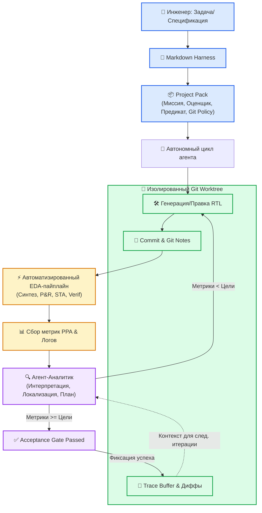
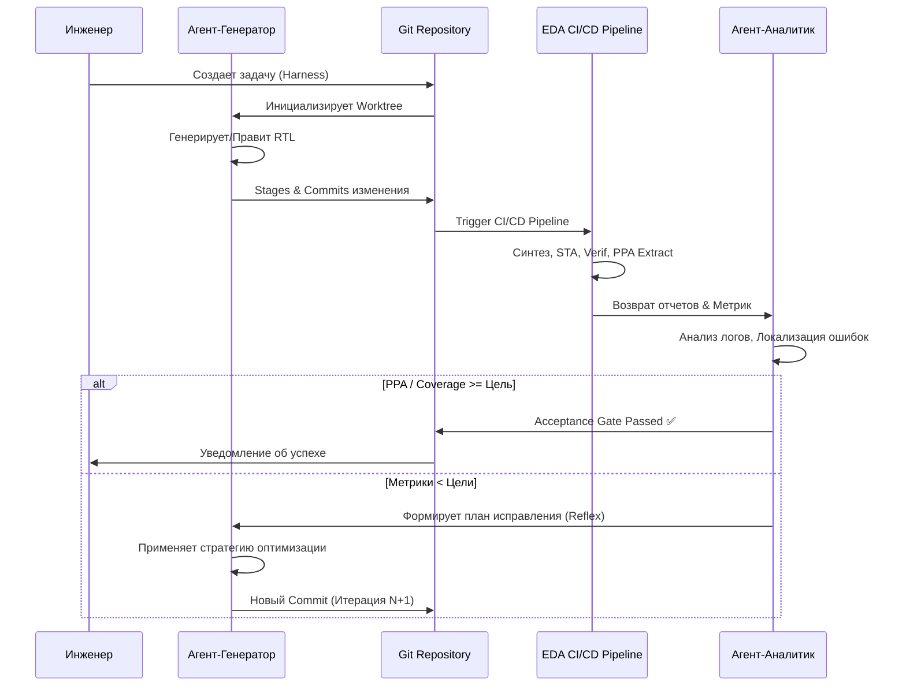

# 🧬 ChipGPT: Эволюция кода чипов на уровне Git-репозитория

> **Статус**: PRD | **Модуль**: Agentic Loop | **Обновлено**: 2026-07-02

ChipGPT представляет собой качественно новую парадигму автоматизированного проектирования электроники (Agentic EDA), которая переводит разработку аппаратного обеспечения из режима однопроходной генерации кода в режим **репозиторий-ориентированной эволюции**. Вместо изолированного инструмента, генерирующего RTL по запросу, ChipGPT функционирует как автономная, самоэволюционирующая система, где каждый этап проектирования, верификации и оптимизации PPA управляется через замкнутый цикл обратной связи, глубоко интегрированный с Git.

Система рассматривает проектирование чипов не как статическую задачу, а как динамический, итеративный процесс эволюции кода. Архитектура построена на принципах CI/CD, где агент не просто создаёт код, а постоянно анализирует его последствия, находит недостатки и оптимизирует метрики на основе объективных, измеримых данных от EDA-инструментов.

## 🏗️ Архитектура: Git как среда эволюции кода

Фундаментом ChipGPT является использование Git не только для контроля версий, но и как **основной субстрат для агентных вычислений**, изоляции контекста и трассировки поиска.

| Компонент | Функция в архитектуре |
|---|---|
| **Git Worktree** | Каждый дизайн или эксперимент разворачивается в изолированном рабочем дереве. Это гарантирует чистоту среды и позволяет запускать параллельные ветки оптимизации без риска повреждения стабильной кодовой базы. |
| **Commit как чекпоинт** | Каждая успешная итерация фиксируется коммитом. История репозитория становится воспроизводимым журналом эволюции проекта, где `git diff` раскрывает предложенные изменения, а `git notes` хранят вердикты оценщиков. |
| **Executable Harness** | Структурированная спецификация задачи (Markdown-harness) автоматически компилируется в `project_pack`, содержащий доменные знания, исполняемый оценщик, предикат принятия и политику управления версиями. |
| **Trace Buffer** | Буфер трассировки на основе Git хранит историю версий, дельты состояний, исходы эвалюатора и runtime-метрики. Это позволяет в любой момент воспроизвести путь агента к решению. |

## 🔄 Замкнутый цикл обратной связи (Hands-Free Agent Loop)

Автономный цикл ChipGPT состоит из последовательных, но тесно связанных шагов, которые выполняются без вмешательства человека до достижения явного условия принятия (acceptance predicate).

1. **Инициация и планирование:** Агент получает высокоуровневую задачу (например, «оптимизируй метрики PPA» или «исправь функциональную ошибку»).
2. **Действие (Генерация/Изменение кода):** Агент-Генератор создаёт или изменяет RTL/Verilog, используя текущий контекст, спецификации и историю изменений.
3. **Интеграция и запуск EDA-пайплайна:** Изменения применяются к рабочему дереву. Автоматический CI/CD-конвейер запускает полный цикл EDA-задач: синтез, размещение/маршрутизацию, статическую/динамическую верификацию, сбор метрик PPA и покрытие тестами.
4. **Сбор и анализ обратной связи:** Агент-Аналитик собирает количественные метрики (отчёты по PPA, статистика покрытия) и качественные данные (сообщения компилятора, отказы тестов, логи симуляторов).
5. **Рефлексия и принятие решений:** Агент анализирует результаты в контексте цели. Если метрики не соответствуют цели, он локализует проблемные участки кода, формирует конкретный план исправления и повторяет цикл.
6. **Коммит или откат:** Успешная версия коммитится с прикреплением доказательств корректности. Неудачная попытка логируется как отрицательный пример для дальнейшего обучения стратегии.

## 🚀 Ключевые преимущества ChipGPT

| Преимущество | Описание | Инженерная ценность |
|---|---|---|
| **Долгосрочное качество > Скорость первой сборки** | Система проектируется с расчётом на оптимальный PPA, а не на быструю генерацию синтаксически верного кода. | Автоматизация сложной многоэтапной доработки, которая ранее требовала недель ручной работы. |
| **Полная трассируемость и аудит** | Каждый шаг, включая неудачные попытки, документируется в Git. История диффов и вердиктов оценщика доступна для воспроизведения. | Соответствие лучшим практикам инженерной дисциплины; быстрая отладка регрессий. |
| **Автоматизация PPA-оптимизации** | Агент целенаправленно работает над улучшением метрик через серию малых, управляемых экспериментов, находя компромиссы между Power, Performance и Area. | Снижение зависимости от ручной экспертной оптимизации; достижение целевых PPA без человеческого вмешательства. |
| **Масштабируемость на уровне репозитория** | Архитектура не привязана к одному модулю. Она одинаково эффективно работает с генерацией RTL, модификацией legacy-кода, созданием testbench и отладкой. | Единый протокол покрывает весь спектр задач Agentic EDA без переписывания логики агента. |

## 🛡️ Преодоление инженерных барьеров

Реализация репозиторий-ориентированной эволюции сопряжена с архитектурными и вычислительными сложностями, которые решаются в ChipGPT через следующие механизмы:

| Барьер | Решение в ChipGPT |
|---|---|
| **Архитектурная сложность** | Разделение ответственности: `Агент-Генератор` фокусируется на коде, `Агент-Аналитик` — на интерпретации EDA-отчётов. Чёткие контракты через `project_pack` и детерминированные предикаты принятия. |
| **Высокая стоимость и время EDA-запусков** | Каскадная верификация: на ранних итерациях используются быстрые open-source линтеры и симуляторы. Коммерческие синтезаторы и STA запускаются только при достижении порога готовности. |
| **Сложность обучения и риск зацикливания** | Введение лимитов итераций, мониторинг дельты метрик между коммитами, и механизм `stuck`-флага с автоматическим переключением на альтернативную стратегию поиска. |
| **Потеря контекста и рост затрат токенов** | Сессионное переиспользование контекста (persistent model session). Хранение стабильных частей кода и истории в провайдерском кэше промптов. Биллинг затрачивается преимущественно на текущие диффы и ответы агента, снижая маржинальную стоимость каждой итерации. |

## 🔮 Заключение: От генерации к эволюции

ChipGPT демонстрирует переход от статических инструментов генерации к динамическим, рефлексирующим экосистемам. Рассматривая проектирование как непрерывный процесс эволюции кода, где каждое изменение документируется, верифицируется и воспроизводится, система автоматизирует самый сложный и ресурсоёмкий этап разработки чипов — итеративную оптимизацию и отладку.

В долгосрочной перспективе именно такой подход, основанный на Git-ориентированной обратной связи, управляемой агентом-аналитиком и автоматизированных EDA-конвейерах, становится отраслевым стандартом для создания высокопроизводительных, энергоэффективных и надёжных микросхем. ChipGPT не просто генерирует код; он управляет жизненным циклом аппаратного дизайна, превращая проектирование чипов в предсказуемый, измеримый и масштабируемый инженерный процесс.

## Приложение А: Что такое stuck-флаг?

**`stuck-флаг`** (от англ. *stuck* — «застрявший», «зависший») — это внутренний сигнал состояния в агентных или итеративных системах, который указывает, что процесс поиска/оптимизации перестал давать измеримый прогресс, несмотря на продолжение попыток.

Это не просто «стоп-кран», а **триггер для интеллектуального переключения режима работы** автономного контура.

---

### 🔍 Как система понимает, что она «застряла»?
Флаг поднимается, когда наблюдаются один или несколько паттернов:
| Критерий | Порог срабатывания |
|---|---|
| **Отсутствие дельты метрик** | Улучшение PPA, coverage или снижение ошибок `< ε` (например, `<0.1%`) в течение `N` подряд итераций |
| **Циклические патчи** | Генерируются идентичные или симметрично эквивалентные изменения кода |
| **Рост затрат без результата** | Расход токенов/времени растёт, а `weave.Evaluation` скоры не меняются |
| **Лимит итераций** | Достигнут максимальный бюджет шагов без выполнения `acceptance_predicate` |

---

### ⚙️ Что происходит при `stuck_flag = true`?
Вместо бесконечного повтора система автоматически активирует fallback-механизм:

1. **Смена стратегии поиска**  
   `local optimization → global/randomized search` (например, вместо `optimize_registers` → `ungroup + restructure FSM`)
2. **Расширение контекста**  
   Запрос к `U-Mem` через `SA-CTS` для поиска семантически похожих, но архитектурно иных решений
3. **Переключение агента/модели**  
   Запуск `DebugAgent` или запрос к альтернативной LLM с другим temperature/top-p
4. **Адаптация констрейнтов**  
   Временное ослабление/ужесточение SDC, изменение target library или clock gating policy
5. **Эскалация на HITL**  
   Если автоматические альтернативы исчерпаны → формируется структурированный запрос инженеру с диффами, логами и вариантами решения
6. **Фиксация в StreamTable/Weave**  
   Запись события `{"step":"stuck_detected", "reason":"ppa_plateau", "action":"strategy_switch"}` для аудита и последующего обучения петли

---

### 💡 Пример в контексте ChipGPT
> Агент-Синтезатор 6 раз подряд запускает `compile_ultra`, но `timing_slack` остаётся `-0.12ns`, а площадь растёт.  
> Система поднимает `stuck_flag`, автоматически:  
> 1. Меняет стратегию на `set_max_area + replace buffers`  
> 2. Загружает из `U-Mem` успешный паттерн оптимизации аналогичного блока  
> 3. Запускает следующую итерацию с новыми параметрами  
> 4. Если через 3 шага прогресса нет → передаёт задачу человеку с предзаполненным PR и логами

---

### 🛡️ Зачем это нужно в Agentic EDA?
- **Экономия ресурсов**: предотвращает бессмысленный перерасход токенов, EDA-лицензий и GPU-часов
- **Устойчивость**: превращает «слепой перебор» в осознанную адаптацию с гарантированными точками выхода
- **Обучаемость**: каждый `stuck`-кейс сохраняется в памяти как негативный/позитивный пример для улучшения политик агента
- **Прозрачность**: инженер видит не «агент просто завис», а конкретную причину, предпринятые альтернативы и точку передачи контроля

В современных архитектурах (HORIZON, ChipGPT, Cadence AgentStack) `stuck-флаг` — это ключевой элемент **exploration/exploitation баланса**, обеспечивающий детерминированность автономных пайплайнов при сохранении их адаптивности.