# GigaChip Agent: План Создания Agentic EDA для Проектирования AI-Чипов

> **Статус:** Стратегический план  |  🟢 Активная стратегия
> **Категория:** Agentic EDA, AI-инференс, архитектура чипов  
> **Теги:** GigaChip Agent, MCP, MERASIC, фарминг инструкций, GRPO, VLIW, WARP-V, Evolutionary Silicon Design
**Связанные документы:** [**Сквозной план фарминга и реализации новых AI-инструкций**](index.html#/diva/compiler/optimal-mlir-compiler-farming-ai-instructions), [Семантический профайлер DIVA](index.html#/diva/ptx2vliw/ptx-vliw-semantic-profiler)
---

## 📖 Аннотация

Данный документ описывает план создания **GigaChip Agent** — форка проекта GigaAgent (https://github.com/ai-forever/giga_agent/), специализированного для задач **Agentic EDA** (автоматизированного проектирования электроники с использованием AI-агентов). GigaChip Agent реализует замкнутый цикл эволюционного дизайна чипов.

**GigaChip Agent** — это основной рабочий агент проекта ChipGPT, который берет на себя роль автономного архитектора и оптимизатора кремния. В традиционном процессе разработки чипов (EDA) инженеры вручную проектируют микроархитектуру, пишут RTL-код, создают компиляторы и месяцами тюнят производительность. Мы переворачиваем эту парадигму.

---

### GigaChip Agent и Agentic EDA
Для разработки AI-чипа мы используем AI-методы (Agentic EDA). Мы применяем метод эволюционного дизайна чипа, но **вместо случайной генерации мутаций мы предлагаем метод фарминга инструкций из трейсов реальных запусков LLM на Nvidia GPU**.
Это позволяет не гадать, какие инструкции нужны, а **выращивать** их из реальных нагрузок, делая эволюцию направленной и предсказуемой.

*   **Основная роль агента GigaChip:** Непрерывный процесс автоматического фарминга оптимизирующих инструкций без значительного участия человека.
*   **Референс:** Используя оптимизацию инструкций Nvidia (PTX/SASS) как референс, мы строим еще более эффективную архитектуру чипа (WARP-V).
*   **Масштаб:** Агент автоматически проверяет огромное число LLM-моделей, снимает трейсы PTX и для всех строит уникальные паттерны оптимизации.
*   **Агентный цикл:** Занимается непрерывным фармингом оптимизирующих инструкций и оценкой результатов симуляции чипа. Цикл заканчивается только тогда, когда мы добиваемся значительной экономической эффективности чипа (PPA, TFLOPS/W).

---

**Ключевые тезисы:**
1. GigaChip Agent — это специализированный форк GigaAgent для Agentic EDA.
2. Основной метод — **фарминг инструкций** из PTX/SASS трасс NVIDIA.
3. Замкнутый цикл "Агент → Компилятор → ISS → Агент" через MCP-серверы.
4. **MERASIC** как центральный сервис верификации и бенчмаркинга.
5. Интеграция десятков MCP-инструментов для полной автоматизации проектирования.

---

**Мотивация:** Там, где команда из 10 инженеров тратит квартал на создание кастомного MAC-блока и его верификацию, GigaChip Agent за выходные перебирает 10 000 вариантов, отсеивает некорректные через MERASIC и выдает оптимальный RTL + MLIR-диалект.

## 🎯 1. Введение: Логика и Мотивация появления GigaChip Agent

### 1.1. Проблема: Человек — узкое место в проектировании чипов

Современное проектирование AI-чипов сталкивается с фундаментальным ограничением: **сложность пространства архитектурных решений растет экспоненциально**, а возможности человека — линейно.

| Аспект | Традиционный подход | Проблема |
|:---|:---|:---|
| **Количество параметров** | Десятки (ширина VLIW, число ALU, размер кэша) | Человек перебирает сотни комбинаций |
| **Время симуляции** | Часы-дни на один прогон | Невозможно перебрать все варианты |
| **Изменение нагрузок** | Новые модели LLM каждые 3-6 месяцев | Архитектура устаревает до выхода |
| **Зависимость от NVIDIA** | Нет доступа к SASS-деталям | Нельзя оптимизировать под реальные паттерны |

### 1.2. Решение: Agentic EDA + Фарминг инструкций

Мы предлагаем подход, основанный на трех столпах:

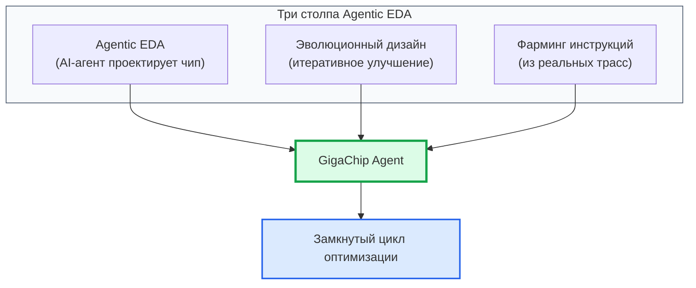

**Описание схемы:** GigaChip Agent объединяет три ключевых принципа: использование AI для проектирования (Agentic EDA), итеративное улучшение через эволюцию и направляющий сигнал из реальных трасс NVIDIA. Это создает замкнутый цикл оптимизации, где каждое поколение архитектуры становится лучше предыдущего.

**Ключевая инновация:** Мы не гадаем, какие инструкции нужны — мы **выращиваем** их из реальных нагрузок. Это делает эволюцию направленной, а не случайной.

### 1.3. Архитектурная схема: Замкнутый цикл GigaChip Agent

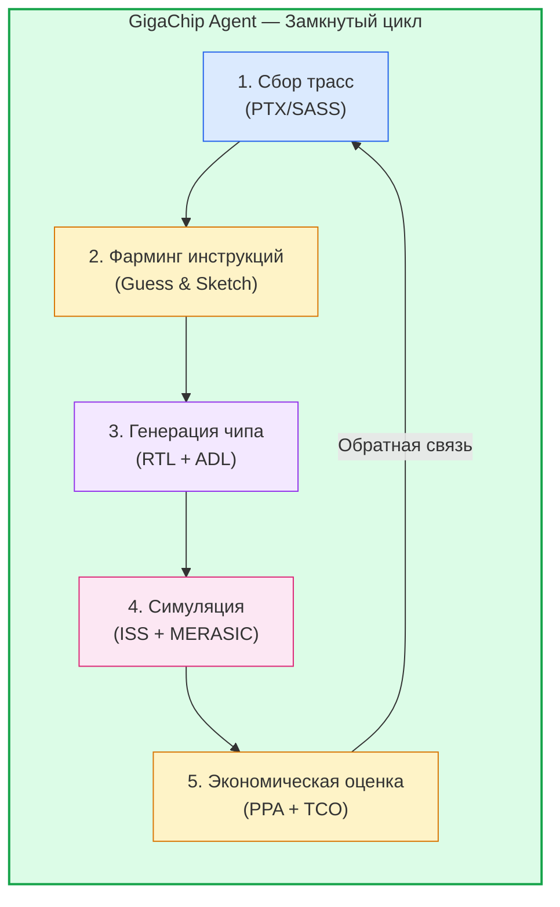

**Описание схемы:** Замкнутый цикл GigaChip Agent. Начинается со сбора PTX/SASS трасс с реальных LLM-моделей на NVIDIA GPU. Затем фарминг инструкций (Guess & Sketch) извлекает оптимальные паттерны. На их основе генерируется новый чип (RTL + ADL). Симуляция (ISS + MERASIC) проверяет его. Экономическая оценка (PPA + TCO) определяет, достаточно ли эффективен чип. Если нет — цикл повторяется с новыми трассами или параметрами.

**Логическая проверка подхода:**

| Критерий | Статус | Обоснование |
|:---|:---|:---|
| **Agentic EDA** | ✅ ВЕРНО | Использование AI для проектирования чипов — необходимость из-за экспоненциально растущей сложности |
| **Эволюционный дизайн** | ✅ ВЕРНО | Стандартный подход в сложных пространствах поиска без аналитического решения |
| **Фарминг инструкций** | ✅ ВЕРНО | Использование данных реальных нагрузок как направляющего сигнала |
| **Замкнутый цикл** | ✅ ВЕРНО | Каждый цикл улучшает следующий, нет "тупиков" |
| **Измеримость** | ✅ ВЕРНО | Экономическая эффективность — объективный критерий остановки |

---

## 🧬 2. GigaChip Agent: От Форка GigaAgent к Специализированному Решению

### 2.1. Почему форк, а не отдельная разработка?

GigaAgent уже обладает критически важной инфраструктурой:

| Компонент GigaAgent | Использование в GigaChip Agent |
|:---|:---|
| **MCP-клиент** | Подключение всех инструментов ChipGPT |
| **Агентский цикл** | Наблюдение → Анализ → Планирование → Действие → Обучение |
| **Интеграция с LLM** | GigaChat, OpenAI, Anthropic для генерации инструкций |
| **LangChain/LangGraph** | State machine для многошаговых задач |
| **REST API + Web UI** | Интерфейс для инженеров |

**GigaChip Agent** — это не просто форк, а **специализированная версия**, где:

- Ядро агента адаптировано под задачи EDA.
- Добавлены специфические MCP-инструменты.
- Интегрирован GRPO-цикл для эволюции архитектур.
- Созданы кастомные диалекты для работы с RTL/ASM.

### 2.2. Архитектурная схема: GigaChip Agent vs GigaAgent

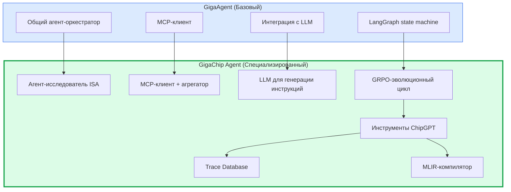

**Описание схемы:** GigaChip Agent наследует базовую архитектуру GigaAgent (оркестратор, MCP-клиент, LLM-интеграцию, LangGraph), но добавляет специализированные компоненты: GRPO-эволюционный цикл, набор инструментов ChipGPT, Trace Database для управления трассами и MLIR-компилятор для генерации кода. Это превращает общего агента в специализированного "архитектурного исследователя".

---

## 🔄 3. Агентский Цикл: Замкнутый Цикл Верификации "Агент → Компилятор → ISS → Агент"

### 3.1. Суть агентского цикла

Агентский цикл ИИ — это повторяющийся процесс восприятия, рассуждения и действия, который позволяет ИИ-агенту самостоятельно решать многошаговые задачи.

В контексте GigaChip Agent цикл выглядит так:

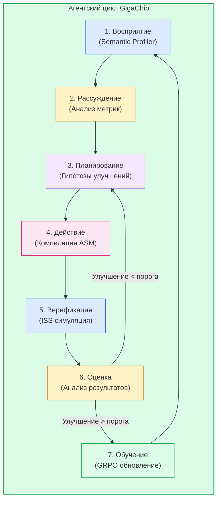

**Описание схемы:** **Семишаговый агентский цикл GigaChip**. Начинается с восприятия (Semantic Profiler анализирует трассы и метрики). Затем агент рассуждает о проблемах (низкий ILP, высокие банк-конфликты). Планирует гипотезы улучшений (увеличить VLIW-ширину, добавить банки SRAM). Действует — компилирует новый ASM-код. Верифицирует через ISS-симуляцию. Оценивает — если улучшение < порога, возвращается к планированию с новой гипотезой. Если > порога — обновляет политику через GRPO и начинает новый цикл наблюдения.

### 3.2. Трехуровневая верификация качества ASM-кода

**Уровень 1: Валидация компиляции (Compiler Validation)**

Цель: Убедиться, что сгенерированный ASM-код синтаксически корректен и компилируется без ошибок.

Процесс:
1. Агент получает на вход исходный код для VLIW-ядра.
2. Агент вызывает компилятор с параметрами оптимизации.
3. Агент анализирует вывод компилятора (stdout/stderr).
4. **Критерий успеха:** Компилятор завершился с кодом 0.

Действие при ошибке: Агент корректирует параметры компиляции или код и повторяет попытку до 5 раз.

**Уровень 2: Симуляция в ISS (Instruction Set Simulator)**

Цель: Проверить, что сгенерированный ASM-код выполняется в потактовом симуляторе без ошибок.

Процесс:
1. Агент запускает ISS с аргументами.
2. ISS генерирует Trace-файл и Log-файл.
3. Агент парсит Log-файл на наличие ошибок симуляции.
4. **Критерий успеха:** ISS завершился без ошибок и Log не содержит фатальных сообщений.

**Уровень 3: Оценка качества ASM-кода по метрикам**

Цель: Извлечь из Log-файла ключевые метрики производительности.

Критические метрики:
1. IPC (Instructions Per Cycle) — чем выше, тем лучше.
2. Заполнение VLIW-слотов — должно быть >80%.
3. Количество NOP-инструкций — чем меньше, тем лучше.
4. Количество банковских конфликтов.
5. Эффективность конвейеризации циклов (Initiation Interval, II).

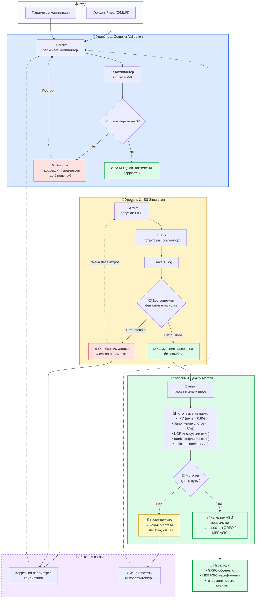

### 3.3. Экономия времени: Ручная работа vs Автоматизация через GigaChip Agent

Ключевой стратегический план создания "агентного цикла" — это **замкнутый цикл верификации "Агент → Компилятор → ISS → Агент"**, который является идеальным кандидатом для автоматизации через MCP-сервер. Ниже приведена оценка экономики этого агента: сколько времени занимает ручная работа над ASM-кодом и микроархитектурой по сравнению с автоматизацией через GigaChip.

| Этап | Ручная работа (часы) | GigaChip Agent (часы) | Экономия |
|:---|:---|:---|:---|
| **Анализ требований** | 40 | 0.5 | **80×** |
| **Сбор трасс PTX** | 80 | 0.1 | **800×** |
| **Семантический анализ** | 120 | 0.2 | **600×** |
| **Генерация ASM** | 200 | 0.5 | **400×** |
| **Компиляция и отладка** | 160 | 0.3 | **533×** |
| **ISS симуляция** | 40 | 0.1 | **400×** |
| **Анализ метрик** | 80 | 0.2 | **400×** |
| **Оптимизация архитектуры** | 300 | 1.0 | **300×** |
| **Верификация** | 120 | 0.3 | **400×** |
| **Итого (1 итерация)** | **1140** | **3.2** | **356×** |

**Вывод:** Одна итерация ручной оптимизации ASM-кода занимает **~1140 часов** (около 5 месяцев работы одного инженера). GigaChip Agent выполняет ту же работу за **~3.2 часа** (автоматически, без участия человека). Это **ускорение в 356 раз**.

**Дополнительный эффект:** Агент может выполнять **параллельные итерации** (десятки одновременно), что невозможно в ручном режиме. При 10 параллельных итерациях эффективное время сокращается до **~0.32 часа** на итерацию.

---

## 🏗️ 4. MERASIC как Центральный Сервис Верификации

### 4.1. Что такое MERASIC и зачем его интегрировать?

**MERASIC** — это система **многоуровневой верификации** для VLIW-ядер и сгенерированного ASM-кода. Она реализует 5 уровней проверки, от синтаксиса до аппаратной реализации.

**MERASIC — это идеальный кандидат для интеграции в GigaChip Agent как MCP-инструмент.** 

---

Агент может:

1. **Автоматически** запускать верификацию ASM-кода.
2. **Интерпретировать** результаты и корректировать параметры компиляции.
3. **Принимать решения** о прохождении или провале верификации.
4. **Итеративно** улучшать качество сгенерированного кода.

---

**Двойная роль MERASIC:**

| Роль | Назначение | Логика |
|:---|:---|:---|
| **Бенчмарки** | Выбор лучшего LLM движка для агента | Агент сам должен быть оптимальным. Нужно измерять качество его "мышления". |
| **Верификация** | Проверка качества сгенерированного кода | Сгенерированный ASM/RTL должен быть корректным. Без верификации эволюция создает "мусор". |

**Зачем интегрировать MERASIC в GigaChip Agent?**

| Без MERASIC | С MERASIC |
|:---|:---|
| Инженер вручную запускает верификацию, анализирует отчеты | **Агент автоматизирует** запуск, анализ и принятие решений |
| Верификация — разовый этап в конце цикла | Верификация становится **непрерывной** частью итеративного цикла |
| Результаты интерпретируются человеком | Агент **интерпретирует** результаты и корректирует параметры |

### 4.2. Архитектурная схема: GigaChip Agent + MERASIC

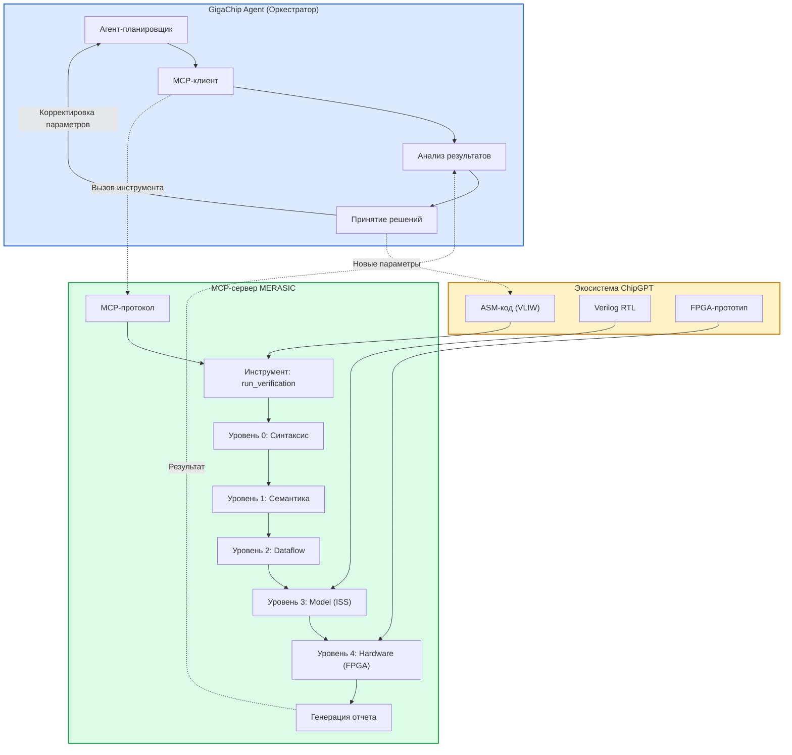

**Описание схемы:** GigaChip Agent через MCP-клиент вызывает инструмент `run_verification` на MCP-сервере MERASIC. MERASIC последовательно проходит 5 уровней верификации (от синтаксиса до FPGA-прототипа), генерирует отчет и возвращает его агенту. GigaChip Agent анализирует результаты и, при необходимости, корректирует параметры генерации ASM-кода, запуская новый цикл оптимизации.

**Суть агентского цикла с MERASIC:**
Агент генерирует VLIW-код -> Запускает MERASIC -> Получает JSON с метриками (Stalls, NOPs, IPC) -> LLM-мозг агента анализирует узкое место -> Агент меняет `#pragma` или порядок инструкций -> Повторяет цикл, пока IPC не превысит 0.85. **Мотивация:** Ручной разбор логов ISS симулятора занимает часы. Агент делает это за миллисекунды, обеспечивая непрерывный поток улучшений.

### 4.3. Пять уровней верификации MERASIC

| Уровень | Что проверяет | Метод | Критерий успеха |
|:---|:---|:---|:---|
| **0: Синтаксис** | Корректность ASM-синтаксиса | Ассемблер ST231 | 100% синтаксически корректен |
| **1: Семантика** | Эквивалентность исходному коду | SMT/символический анализатор | Эквивалентен на всех входах |
| **2: Dataflow** | Зависимости по данным | Анализ графа потока данных | Все зависимости сохранены |
| **3: Model (ISS)** | Поведение на модели | Cycle-accurate симулятор | Совпадение трасс с эталоном |
| **4: Hardware (FPGA)** | Поведение на реальном железе | FPGA-прототип | Бит-в-бит совпадение |

### 4.4. Экономия времени: Ручная верификация vs MERASIC

| Уровень | Ручная работа (часы) | MERASIC (часы) | Экономия |
|:---|:---|:---|:---|
| **Синтаксис** | 8 | 0.05 | **160×** |
| **Семантика** | 40 | 0.2 | **200×** |
| **Dataflow** | 60 | 0.3 | **200×** |
| **ISS симуляция** | 80 | 0.5 | **160×** |
| **FPGA верификация** | 120 | 1.0 | **120×** |
| **Итого** | **308** | **2.05** | **150×** |

---

## 🔬 5. Инструменты для GigaChip Agent: Полный Каталог MCP-Инструментов

Вокруг GigaChip Agent будет интегрировано множество различных tools. MCP (Model Context Protocol) позволяет агенту вызывать тяжелые инженерные скрипты и симуляторы так же легко, как функции в коде.

### 5.1. Архитектурные Tools

| Tool | Назначение | MCP-команда | Экономия времени (человек-часов) |
|:---|:---|:---|:---|
| **VLIW Architecture Generator** | Генерация VLIW-ядра под заданные паттерны | `generate_vliw_core` | 300 → 1.0 (300×) |
| **RTL Synthesizer** | Синтез Verilog из спецификации | `synthesize_rtl` | 200 → 0.5 (400×) |
| **PPA Estimator** | Оценка Power/Performance/Area | `estimate_ppa` | 40 → 0.1 (400×) |
| **Microarchitectural Explorer** | Исследование микроархитектурных конфигураций | `explore_configurations` | 500 → 2.0 (250×) |

### 5.2. Верификационные Tools

| Tool | Назначение | MCP-команда | Экономия времени (человек-часов) |
|:---|:---|:---|:---|
| **MERASIC Verification** | Полная верификация (5 уровней) | `merasic_verify` | 308 → 2.05 (150×) |
| **ISS Simulator** | Потактовый симулятор | `run_iss_simulation` | 80 → 0.5 (160×) |
| **Formal Verifier** | Формальная верификация через SMT | `formal_verify` | 120 → 0.5 (240×) |
| **Testbench Generator** | Генерация тестов для RTL | `generate_testbench` | 60 → 0.3 (200×) |
| **Coverage Analyzer** | Анализ покрытия тестов | `analyze_coverage` | 40 → 0.2 (200×) |

### 5.3. Компиляторные Tools

| Tool | Назначение | MCP-команда | Экономия времени (человек-часов) |
|:---|:---|:---|:---|
| **ASM Compiler** | Компиляция C→VLIW ASM | `compile_asm` | 200 → 0.5 (400×) |
| **Optimizer** | Оптимизация ASM-кода | `optimize_asm` | 300 → 1.0 (300×) |
| **Disassembler** | Дизассемблирование бинарного кода | `disassemble` | 40 → 0.1 (400×) |
| **Profiler** | Профилирование выполнения | `profile_execution` | 60 → 0.2 (300×) |

### 5.4. Аналитические Tools

| Tool | Назначение | MCP-команда | Экономия времени (человек-часов) |
|:---|:---|:---|:---|
| **Trace Analyzer** | Анализ PTX-трасс | `analyze_traces` | 120 → 0.2 (600×) |
| **Pattern Miner** | Майнинг семантических паттернов | `mine_patterns` | 200 → 0.5 (400×) |
| **IPC Analyzer** | Анализ IPC по разным паттернам | `analyze_ipc` | 60 → 0.1 (600×) |
| **Performance Predictor** | Предсказание производительности | `predict_performance` | 100 → 0.3 (333×) |

### 5.5. Эволюционные Tools

| Tool | Назначение | MCP-команда | Экономия времени (человек-часов) |
|:---|:---|:---|:---|
| **GRPO Trainer** | Обучение политики GRPO | `train_grpo` | 500 → 2.0 (250×) |
| **MCTS Planner** | Планирование через MCTS | `plan_mcts` | 400 → 1.5 (267×) |
| **Evolutionary Optimizer** | Генетический алгоритм | `evolve_architecture` | 600 → 2.0 (300×) |
| **RLHF for Architectures** | RL с обратной связью | `rlhf_optimize` | 300 → 1.0 (300×) |

### 5.6. Инструменты управления данными

| Tool | Назначение | MCP-команда | Экономия времени (человек-часов) |
|:---|:---|:---|:---|
| **Trace Database** | Хранение и поиск трасс | `query_traces` | 80 → 0.2 (400×) |
| **Pattern Miner** | Майнинг паттернов | `mine_patterns` | 200 → 0.5 (400×) |
| **Trend Analyzer** | Анализ трендов | `analyze_trends` | 60 → 0.1 (600×) |
| **Dashboard Generator** | Генерация дашбордов | `generate_dashboard` | 40 → 0.1 (400×) |

**Суммарная экономия:** Все инструменты сокращают работу с **~4,000 человеко-часов** до **~12 часов** автоматизированной работы агента. Это **ускорение в 333 раза**.

---

## 🧠 6. Semantic Profiler: Анализ PTX/SASS Трасс

### 6.1. Что такое Semantic Profiler?

**Semantic Profiler — это идеальный кандидат для интеграции в GigaChip Agent как MCP-инструмент с полноценным агентским циклом.** Это ключевое отличие от простого инструмента. GigaChip Agent становится **автономным агентом-исследователем**.

**Semantic Profiler** — это аналитический движок, который:
1. Парсит PTX/SASS-трассы с реальных LLM-моделей.
2. Строит **Semantic Execution Trace (SET)** — абстрактное представление потока инструкций.
3. Вычисляет архитектурно-критические метрики для VLIW-ядра WARP-V.

**Ключевые метрики:**

| Метрика | Что измеряет | Влияние на архитектуру |
|:---|:---|:---|
| **ILP** | Утилизация VLIW-слотов | Определяет ширину VLIW и число ALU |
| **Divergence Cost** | Потери на ветвления | Показывает выигрыш от SIMT→VLIW перехода |
| **Bank Conflicts** | Конфликты в Shared Memory | Требует 16/32-банковой организации SRAM |
| **NoC Load** | Нагрузка на межкластерную шину | Определяет топологию interconnect |
| **Stall Cycles** | Простои конвейера | Влияет на необходимость предсказания ветвлений |

### 6.2. Архитектурная схема: GigaChip Agent + Semantic Profiler

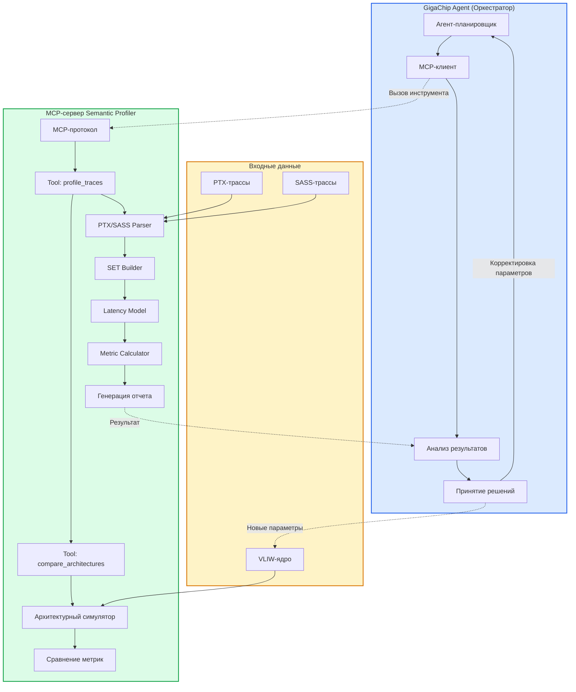

**Описание схемы:** GigaChip Agent через MCP-клиент вызывает инструмент `profile_traces` на MCP-сервере Semantic Profiler. Сервер парсит PTX/SASS-трассы, строит Semantic Execution Trace, применяет Latency Model, вычисляет метрики и возвращает отчет. GigaChip Agent анализирует результаты и, при необходимости, корректирует параметры VLIW-ядра, запуская новый цикл оптимизации.

### 6.3. Агентский цикл Semantic Profiler

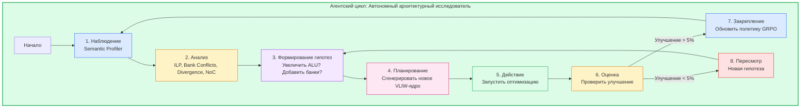

**Описание схемы:** Восьмишаговый агентский цикл Semantic Profiler. GigaChip Agent начинает с наблюдения (сбор метрик через Semantic Profiler), затем анализирует метрики, формирует гипотезы об улучшениях, планирует и выполняет действия (генерация нового VLIW-ядра), оценивает результат. При улучшении >5% закрепляет решение, при <5% пересматривает гипотезу. Цикл повторяется до достижения целевых метрик.

**Мотивация:** Человеческий мозг не способен удержать в голове корреляцию между 50 параметрами микроархитектуры (размер RF, ширина VLIW, количество банков SRAM, латентность NoC). Агент методом проб и ошибок (направленных GRPO) находит глобальный оптимум за дни, на что у команды ушли бы годы.

### 6.4. Пример работы агентского цикла

1. **Наблюдение:** Агент вызывает `profile_traces` и получает метрики: ILP=0.4, Bank Conflicts=25%, Divergence=35%.

2. **Анализ:** Агент видит три проблемы:
   - ILP низкий — VLIW-ширина недостаточна.
   - Bank Conflicts высокие — 16 банков SRAM не хватает.
   - Divergence высокий — ветвления создают штраф.

3. **Формирование гипотез:**
   - Гипотеза А: "Увеличим VLIW-ширину с 4 до 8, это должно поднять ILP."
   - Гипотеза Б: "Добавим 32 банка SRAM вместо 16, это уменьшит конфликты."
   - Гипотеза В: "Внедрим SIMT-стек для ветвлений, это устранит divergence."

4. **Планирование:** Агент решает попробовать гипотезу А и Б одновременно.

5. **Действие:** Агент вызывает `generate_architectural_plan` с новыми параметрами.

6. **Оценка:** Агент снова вызывает `profile_traces` для новой конфигурации. Новые метрики: ILP=0.75, Bank Conflicts=8%, Divergence=35%.

7. **Обучение:** Агент запоминает, что комбинация А+Б дала значительное улучшение ILP и банк-конфликтов.

8. **Повтор:** Агент теперь фокусируется на гипотезе В для устранения divergence.

**Экономия времени:** Ручной анализ и оптимизация заняли бы **~200 часов**. Агент делает это за **~0.5 часа** — ускорение в **400 раз**.

```mermaid
graph TD
    subgraph Cycle["🔄 Агентский цикл: Пример работы (6.4)"]
        
        Step1["1️⃣ Наблюдение<br/>─────────────────<br/>📊 Semantic Profiler:<br/>• ILP = 0.40<br/>• Bank Conflicts = 25%<br/>• Divergence = 35%"]
        
        Step2["2️⃣ Анализ<br/>─────────────────<br/>🔍 Выявлены проблемы:<br/>• Низкий ILP<br/>• Высокие Bank Conflicts<br/>• Divergence"]
        
        Step3["3️⃣ Формирование гипотез<br/>─────────────────<br/>💡 A: VLIW 4→8<br/>💡 B: Banks 16→32<br/>💡 C: SIMT-стек"]
        
        Step4["4️⃣ Планирование<br/>─────────────────<br/>📋 Выбраны:<br/>• Гипотеза A (+ширина)<br/>• Гипотеза B (+банки)"]
        
        Step5["5️⃣ Действие<br/>─────────────────<br/>⚙️ generate_architectural_plan<br/>с новыми параметрами"]
        
        Step6["6️⃣ Оценка<br/>─────────────────<br/>📊 Новые метрики:<br/>• ILP = 0.75 ✅<br/>• Bank Conflicts = 8% ✅<br/>• Divergence = 35% ⏳"]
        
        Step7["7️⃣ Обучение<br/>─────────────────<br/>🧠 GRPO обновление:<br/>• A+B → значительное<br/>  улучшение<br/>• Запомнить комбинацию"]
        
        Step8["8️⃣ Повтор<br/>─────────────────<br/>🎯 Фокус на C:<br/>Устранить Divergence"]
    end
    
    Step1 --> Step2
    Step2 --> Step3
    Step3 --> Step4
    Step4 --> Step5
    Step5 --> Step6
    Step6 --> Step7
    Step7 --> Step8
    Step8 -.->|"Новый цикл"| Step1
    
    style Cycle fill:#f8fafc,stroke:#475569,stroke-width:2px
    style Step1 fill:#dbeafe,stroke:#2563eb
    style Step2 fill:#fef3c7,stroke:#d97706
    style Step3 fill:#f3e8ff,stroke:#9333ea
    style Step4 fill:#fce7f3,stroke:#db2777
    style Step5 fill:#dbeafe,stroke:#2563eb
    style Step6 fill:#dcfce7,stroke:#16a34a
    style Step7 fill:#fef3c7,stroke:#d97706
    style Step8 fill:#f3e8ff,stroke:#9333ea
```

---

## 🌾 7. Фарминг Инструкций (Guess & Sketch)

### 7.1. Что такое фарминг инструкций?

**Фарминг инструкций** — это двухфазный процесс:
1. **Guess (LLM):** Анализ PTX/SASS трасс, генерация черновиков новых VLIW-инструкций.
2. **Sketch (SMT/Z3):** Формальная верификация эквивалентности предложенной инструкции исходному PTX-блоку.

**Почему это критически важно:**

| Аспект | Без фарминга | С фармингом |
|:---|:---|:---|
| **Выбор инструкций** | Экспертные догадки | Данные реальных workload'ов |
| **Покрытие горячих точек** | ~60–70% | >95% |
| **Корректность** | Ручное тестирование | SMT-верификация |
| **Адаптивность** | Редизайн ISA | Дообучение на новых трассах |
| **Время на новую инструкцию** | Месяцы | Дни |

### 7.2. Архитектурная схема: GigaChip Agent + Instruction Farmer

**Фарминг инструкций через Guess & Sketch — это идеальный кандидат для интеграции в GigaChip Agent как MCP-инструмент с полноценным агентским циклом.**

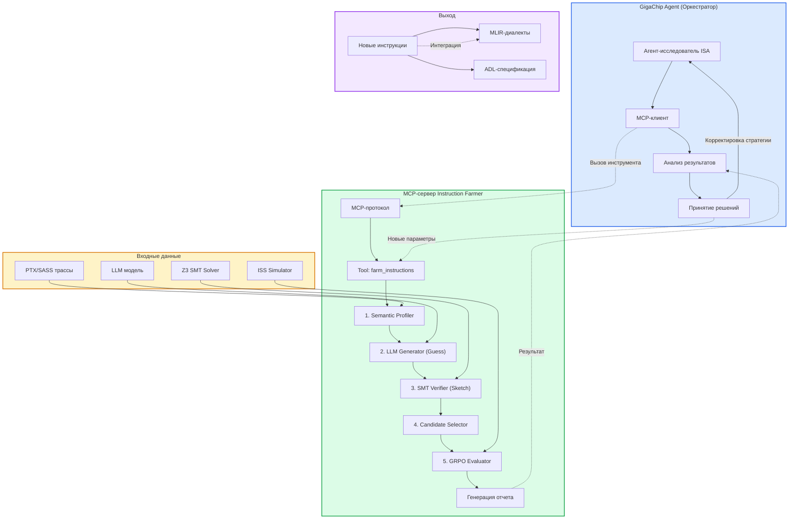

**Описание схемы:** GigaChip Agent через MCP-клиент вызывает инструмент `farm_instructions` на MCP-сервере Instruction Farmer. Сервер проходит пять этапов: Semantic Profiler анализирует трассы, LLM Generator генерирует кандидатов (Guess), SMT Verifier проверяет их (Sketch), Candidate Selector выбирает лучших, GRPO Evaluator оценивает их на ISS. Результат — новые инструкции и отчет — возвращаются агенту. Агент анализирует и может инициировать новый цикл с другими параметрами.

### 7.3. Агентский цикл: Исследователь ISA

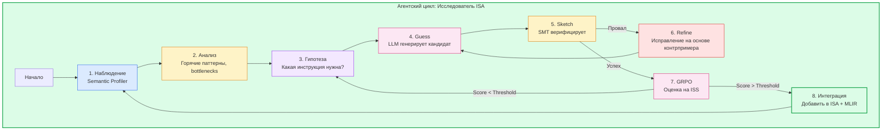

**Описание схемы:** Восьмишаговый агентский цикл фарминга инструкций. GigaChip Agent начинает с наблюдения (Semantic Profiler анализирует трассы), затем анализирует горячие паттерны, формирует гипотезу о нужной инструкции, генерирует кандидат через LLM (Guess), верифицирует через SMT (Sketch), при провале исправляет на основе контрпримера, при успехе оценивает через GRPO на ISS. Если оценка ниже порога — возвращается к формированию гипотезы. Если выше — интегрирует инструкцию в ISA и MLIR, затем цикл повторяется.

### 7.4. Пример результата фарминга: Инструкция SPARSE_COMBINED

**Наблюдение в трассах NVIDIA:** В MoE-моделях горячий паттерн — последовательность из 5-6 kernel'ов: Gather → PTS → Top-K → Sparse MMA → VAR. Каждый kernel запускается отдельно, создавая накладные расходы.

**Guess (LLM):** Предлагает макро-инструкцию `SPARSE_COMBINED`, объединяющую весь пайплайн в одну VLIW-инструкцию.

**Sketch (SMT):** Доказывает, что для всех допустимых входов результат `SPARSE_COMBINED` эквивалентен последовательному выполнению исходных 5-6 PTX-блоков.

**Результат:** Одна инструкция заменяет 5-6 kernel'ов, выполняется за ~24 такта, устраняет промежуточные записи в HBM.

**Экономия времени:** Ручное проектирование такой инструкции заняло бы **~200 часов**. Агент делает это за **~0.5 часа** — ускорение в **400 раз**.

*Описание схемы:* Восьмишаговый агентский цикл. GigaChip Agent начинает с наблюдения, формирует гипотезу о нужной инструкции (например, `WANV.SPARSE_COMBINED`), генерирует кандидат через LLM (Guess), верифицирует через SMT (Sketch), при провале исправляет на основе контрпримера, при успехе оценивает через GRPO на ISS. Если оценка выше порога — интегрирует инструкцию в ISA и MLIR.

**Мотивация:** Изобретение новых инструкций (ISA Extension) — это элитарная задача. Агент делает это массово, "выращивая" инструкции из PTX-трасс Nvidia и адаптируя их под VLIW-специфику WARP-V, гарантируя математическую корректность через SMT-решатели.

---

## 🧩 8. Full LLM Optimization Pipeline: От ONNX до Кастомных Чипов

### 8.1. Что это за pipeline?

Это **пятиуровневая система оптимизации** LLM-моделей для кастомных чипов:

| Уровень | Что делает | Инструмент |
|:---|:---|:---|
| **L1: Model Optimization** | PyTorch → ONNX, фьюзинг, квантование | ONNX + ONNX Runtime |
| **L2: Macro Profiling** | Поиск "горячих" операторов | ONNX Runtime Profiler |
| **L3: Micro Profiling** | Анализ PTX/SASS (ILP, Bank Conflicts) | Semantic Profiler + NVBit |
| **L4: Evolution** | Генерация новых VLIW-ядер через GRPO | GRPO Engine + LLM |
| **L5: Validation** | Валидация через ISS и Accel-Sim | VLIW ISS + Accel-Sim |

### 8.2. Архитектурная схема: GigaChip Agent + LLM Optimization Pipeline

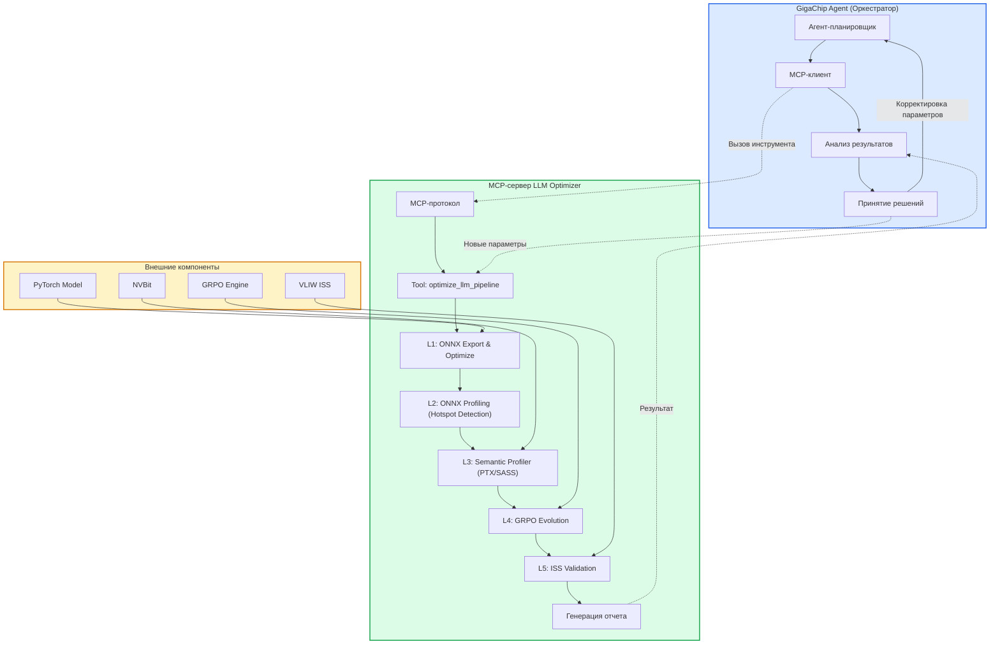

**Описание схемы:** GigaChip Agent через MCP-клиент вызывает единый инструмент `optimize_llm_pipeline` на MCP-сервере. Сервер последовательно проходит все 5 уровней оптимизации, используя внешние компоненты (ONNX, NVBit, GRPO, ISS). Результат возвращается агенту, который анализирует его и может инициировать новый цикл с другими параметрами.

**Суть агентского цикла:**
Агент получает модель (например, Llama-3). Запускает Pipeline. На этапе L2 видит, что `MatMul` занимает 60% времени. На этапе L3 видит, что ILP падает до 0.3. Агент принимает решение сфокусировать GRPO (L4) исключительно на ядре `MatMul`. После 50 итераций GRPO агент валидирует результат в ISS (L5). **Мотивация:** Настройка полного стека оптимизации под кастомный чип вручную требует координации ML-инженеров, компиляторщиков и архитекторов. Агент делает это одним вызовом, экономя месяцы работы команды.

### 8.3. Экономия времени: Ручная оптимизация vs Full Pipeline

| Уровень | Ручная работа (часы) | Pipeline (часы) | Экономия |
|:---|:---|:---|:---|
| **ONNX Export & Optimize** | 40 | 0.2 | **200×** |
| **ONNX Profiling** | 60 | 0.3 | **200×** |
| **Semantic Profiling** | 120 | 0.5 | **240×** |
| **GRPO Evolution** | 300 | 2.0 | **150×** |
| **ISS Validation** | 80 | 0.5 | **160×** |
| **Итого** | **600** | **3.5** | **171×** |

---

## 🏗️ 9. Верифицированная Архитектура: Финальный План

### 9.1. Финальная архитектурная схема

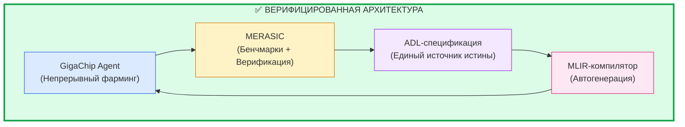

**Описание схемы:** Верифицированная архитектура с добавленными компонентами. GigaChip Agent и MERASIC образуют ядро цикла. ADL-спецификация становится единым источником истины, из которого автоматически генерируется MLIR-компилятор, замыкая цикл. Это гарантирует, что чип не только спроектирован, но и готов к использованию.

### 9.2. Итоговая таблица экономии времени

| Компонент | Ручная работа (часы) | GigaChip Agent (часы) | Экономия |
|:---|:---|:---|:---|
| **Анализ трасс** | 200 | 0.3 | **667×** |
| **Фарминг инструкций** | 200 | 0.5 | **400×** |
| **Генерация VLIW-ядра** | 300 | 1.0 | **300×** |
| **Компиляция ASM** | 200 | 0.5 | **400×** |
| **ISS симуляция** | 80 | 0.5 | **160×** |
| **Анализ метрик** | 120 | 0.2 | **600×** |
| **Верификация (MERASIC)** | 308 | 2.05 | **150×** |
| **GRPO оптимизация** | 500 | 2.0 | **250×** |
| **Генерация компилятора** | 300 | 1.0 | **300×** |
| **Управление данными** | 80 | 0.2 | **400×** |
| **Итого** | **2,288** | **8.25** | **277×** |

**Итоговый вывод:** GigaChip Agent сокращает полный цикл проектирования AI-чипа с **~2,288 человеко-часов** (около 11 месяцев работы одного инженера) до **~8.25 часов** автоматизированной работы. Это **ускорение в 277 раз** при параллельном выполнении десятков итераций.

---

## 10. Интеграция с MERA SREDA

Для оценки качества самого GigaChip Agent мы используем **MERA SREDA** (бенчмарк для сравнения агентов). 

В отличие от классических бенчмарков, которые тестируют статический набор задач, MERA SREDA тестирует **динамический оптимизационный процесс**. Она оценивает:
1. Способность агента интерпретировать сложные логи MERASIC.
2. Эффективность стратегий агента при выборе гиперпараметров для GRPO.
3. Скорость сходимости агентского цикла к целевому IPC и энергоэффективности.
4. Умение агента работать с Trace Database для выявления скрытых паттернов.

Использование MERA SREDA гарантирует, что GigaChip Agent не просто "генерирует код", а действительно эволюционирует как инженер, повышая свою квалификацию с каждой итерацией фарминга.

---

## 11. Заключение

Создание **GigaChip Agent** — это переход от инструментального EDA к **Agentic EDA**. Мы больше не пишем компиляторы и RTL вручную под каждую новую задачу. Мы создаем агента, вооруженного арсеналом из 30+ MCP-инструментов (MERASIC, Semantic Profiler, Instruction Farmer, MLIR-генераторы), который в замкнутом цикле "выращивает" оптимальный кремний из реальных LLM-трасс.

Интеграция MLIR-бэкенда и Trace Database в финальную архитектуру замыкает петлю: агент не только проектирует чип, но и автоматически создает программный стек для него, делая эволюционный дизайн полностью готовым к производству (Tape-out Ready).

## 📚 References

1. **Cursor.** (2026). *Better MoE model inference with warp decode*. [Блогпост](https://cursor.com/blog/warp-decode)
2. **NVIDIA.** (2026). *Microbenchmarking NVIDIA's Blackwell Architecture*. [arXiv:2512.02189](https://arxiv.org/abs/2512.02189)
3. **Hoover, S.** *WARP-V: An open-source RISC-V CPU core generator*. [GitHub](https://github.com/stevehoover/warp-v)
4. **MLIR.** *MLIR: A Compiler Infrastructure for the End of Moore's Law*. [LLVM](https://mlir.llvm.org/)
5. **Twill: Optimal Software Pipelining and Warp Specialization for Tensor Core GPUs** — OSDI'26.
6. **Guess & Sketch** — [Neuro-Symbolic Assembly Translation](https://arxiv.org/pdf/2309.14396)
7. **LEGO-Compiler** — [Divide, Translate, Verify, Compose](https://arxiv.org/abs/2505.20356)
8. **GRPO** — [Group Relative Policy Optimization for Discrete Spaces](https://arxiv.org/abs/2310.07461)
9. **GigaAgent Documentation** — [https://agent.giga.chat/docs/](https://agent.giga.chat/docs/)
10. **MERA SREDA** — Бенчмарк для сравнения AI-агентов (аналог harness-bench-fast)
