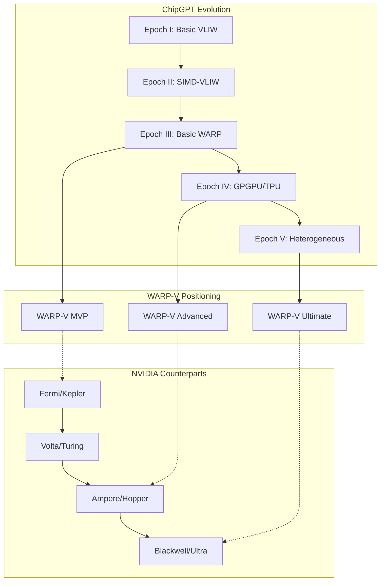
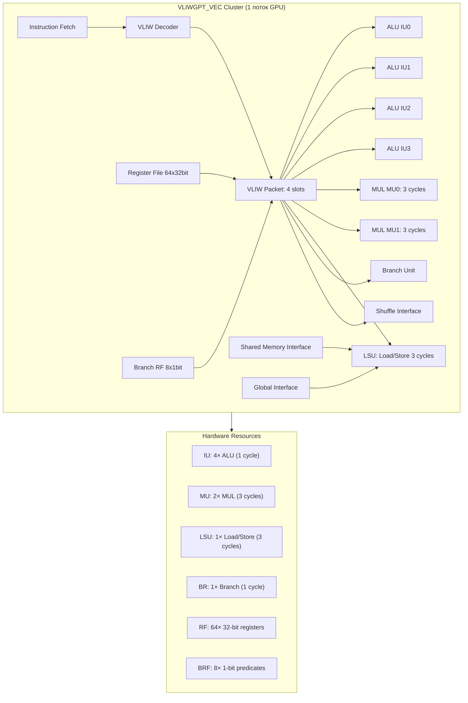
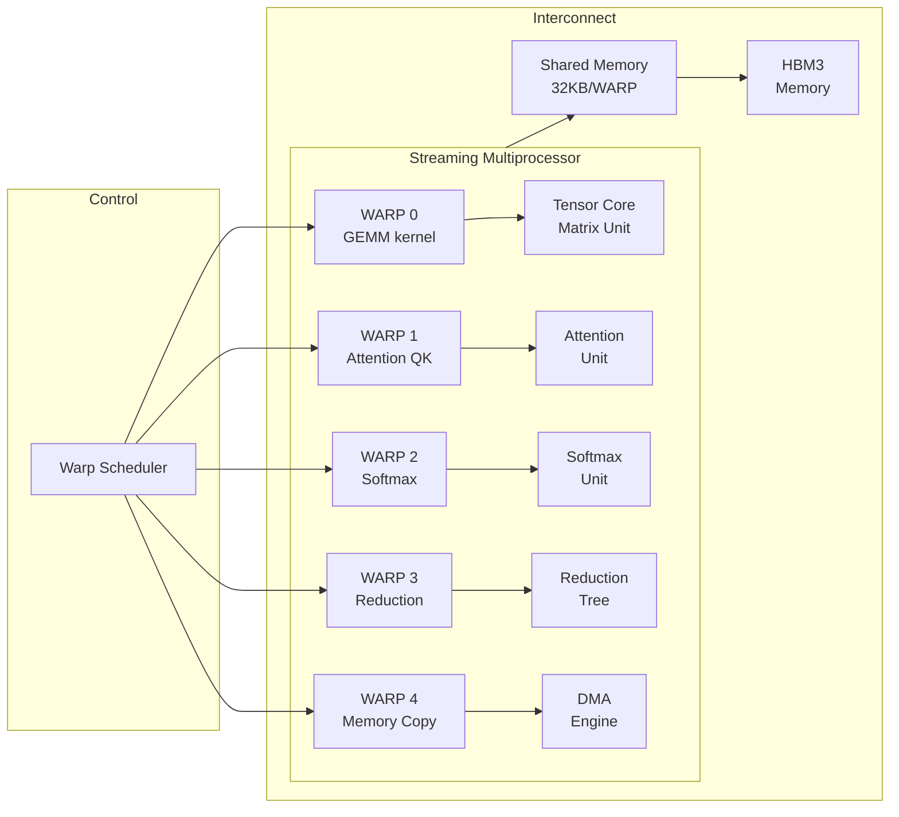
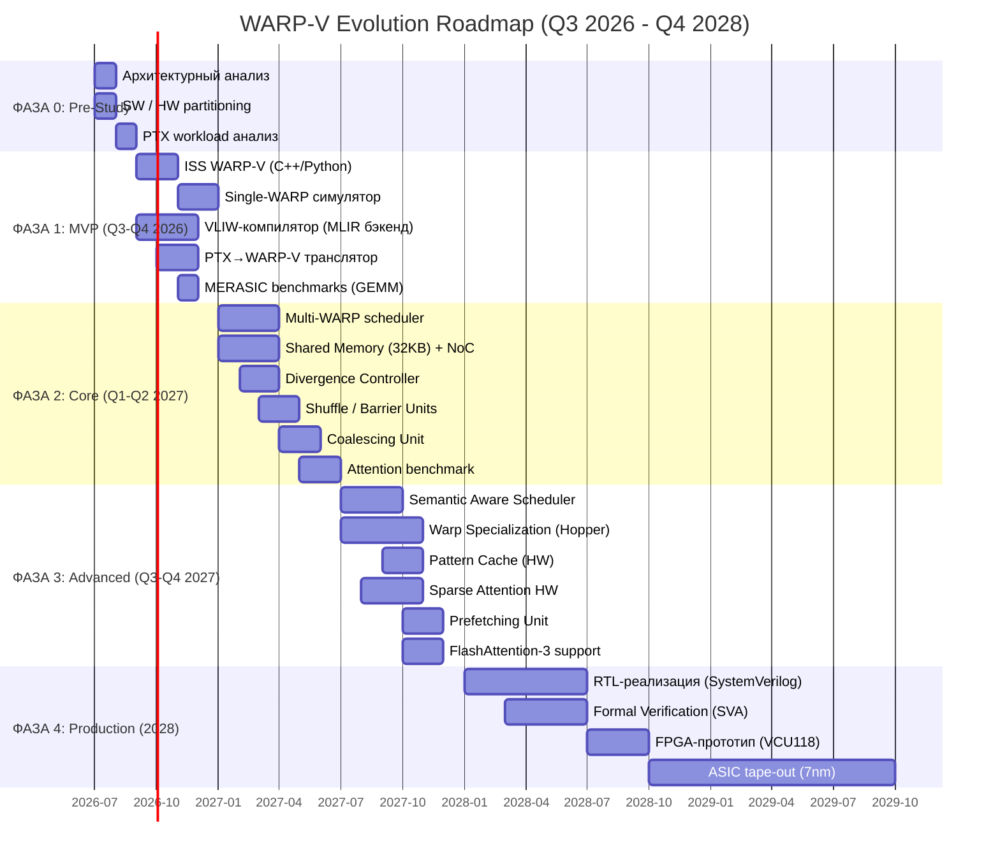
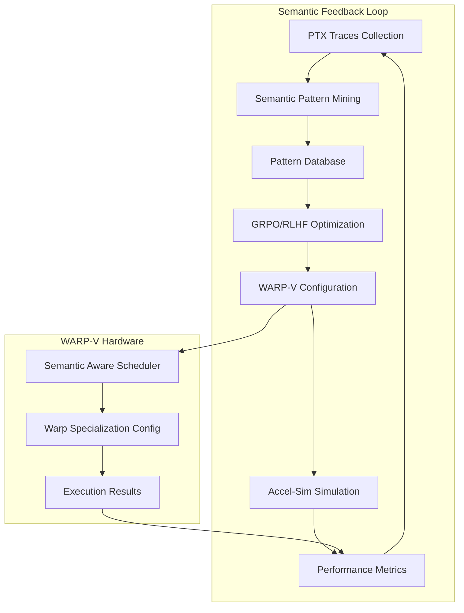

# WARP-V: Эволюционный SIMT-акселератор на VLIW-кластерах

**Эпоха ChipGPT:** III (Basic WARP) → IV (GPGPU / TPU)  
**Дата:** 11 июля 2026 г.  
**Статус:** Архитектурный дизайн / Pre-RTL  
**Автор:** ChipGPT Architecture Team

---

## 1. Концептуальное позиционирование

### 1.1. Что такое WARP-V?

WARP-V — это **альтернативный SIMT-ускоритель**, построенный на базе кластеров VLIW-ядер (VLIWGPT, аналог ST231), где **один WARP (32 потока) = 32 VLIW-кластера**, объединённых через NoC-интерконнект с общей Shared Memory.



### 1.2. Ключевое отличие от классического подхода

| Параметр | NVIDIA WARP | WARP-V | Преимущество |
|----------|-------------|--------|--------------|
| **Базовое ядро** | Скалярный SIMD-конвейер | VLIW-кластер (4 ALU + 2 MUL + LSU) | 🚀 4x ILP |
| **Параллелизм внутри потока** | ILP через суперскалярность | ILP через VLIW-бандлы (до 4 ops/cycle) | 🚀 Детерминизм |
| **Divergence handling** | Последовательное исполнение путей | Независимое исполнение на VLIW-ядрах | 🚀 Нет penalty |
| **Детерминизм** | Нет (warp scheduling) | Да (предсказуемое время) | 🚀 Safety-critical |
| **Программируемость** | CUDA (фикс. ISA) | VLIW + семантические хинты от компилятора | 🚀 Кастомизация |
| **Целевая ниша** | Универсальные GPU | LLM-инференс (GEMM, Attention, Reduction) | 🎯 Фокус |

### 1.3. Философское позиционирование

```
┌─────────────────────────────────────────────────────────────────────────┐
│                    WARP-V PHILOSOPHICAL POSITIONING                     │
├─────────────────────────────────────────────────────────────────────────┤
│                                                                         │
│   ┌─────────────────────────────────────────────────────────────────┐   │
│   │                    WARP NVIDIA (Исторический)                   │   │
│   │       "Один размер подходит всем"                               │   │
│   │       • Универсальность                                         │   │
│   │       • Компромисс производительности                           │   │
│   │       • Непредсказуемое поведение                               │   │
│   └─────────────────────────────────────────────────────────────────┘   │
│                                  ↓                                      │
│   ┌─────────────────────────────────────────────────────────────────┐   │
│   │                 WARP NVIDIA (Современный)                       │   │
│   │              "Warp Specialization"                              │   │
│   │       • Разные WARP = разные инструкции                         │   │
│   │       • Асинхронные операции                                    │   │
│   │       • Программируемая специализация                           │   │
│   └─────────────────────────────────────────────────────────────────┘   │
│                                  ↓                                      │
│   ┌─────────────────────────────────────────────────────────────────┐   │
│   │                        WARP-V                                   │   │
│   │              "Semantic-driven Specialization"                   │   │
│   │       • 32 независимых VLIW-кластера                            │   │
│   │       • Semantic Hints от компилятора                           │   │
│   │       • Детерминированное исполнение                            │   │
│   │       • Аппаратная специализация под LLM-паттерны               │   │
│   └─────────────────────────────────────────────────────────────────┘   │
│                                                                         │
└─────────────────────────────────────────────────────────────────────────┘
```

---

## 2. SWOT-анализ реализуемости WARP-V

### 2.1. Strengths (Сильные стороны)

| № | Сильная сторона | Обоснование | Влияние |
|---|-----------------|-------------|---------|
| S1 | **Абсолютная детерминированность** | Каждый VLIW-кластер — независимый поток; нет скрытых warp-scheduler артефактов | 🔥 Критическое |
| S2 | **Высокий ILP на поток** | 4-слотовый VLIW-бандл даёт до 4 ops/cycle на поток vs 1 op/cycle в NVIDIA | 🚀 Ключевое |
| S3 | **Нет divergence penalty** | Разные пути ветвлений исполняются параллельно на разных кластерах | 🚀 Ключевое |
| S4 | **Семантическая адаптация** | 3-битные hints от компилятора (GEMM/REDUCTION/ATTENTION) — <0.1% площади | 📊 Важное |
| S5 | **Масштабируемость** | Архитектура масштабируется от 1 WARP до 32+ WARP-ов (до 1024 кластеров) | 📈 Важное |
| S6 | **Энергоэффективность на регулярных задачах** | VLIW-ядро оптимизировано под предсказуемые паттерны | ⚡ Важное |
| S7 | **Лицензионная чистота** | Полная независимость от NVIDIA IP | 🏛️ Стратегическое |

### 2.2. Weaknesses (Слабые стороны)

| № | Слабая сторона | Критичность | Митигация | Сроки |
|---|----------------|-------------|-----------|-------|
| W1 | **Сложность NoC/Crossbar** | 🔴 Высокая | Использование mesh-топологии вместо full crossbar | Фаза 2 |
| W2 | **Bank conflicts в Shared Memory** | 🟡 Средняя | 16-банковая организация + детектор конфликтов | Фаза 2 |
| W3 | **Требует VLIW-компилятор** | 🔴 Высокая | Интеграция с MLIR/Triton бэкендом | Фаза 1 |
| W4 | **Нет CUDA-совместимости** | 🔴 Высокая | Разработка PTX→WARP-V транслятора | Фаза 1 |
| W5 | **Сложная верификация** | 🔴 Высокая | MERASIC ISS + co-simulation | Фаза 1-2 |
| W6 | **Меньшая плотность транзисторов** | 🟡 Средняя | VLIW-ядро сложнее скалярного | ASIC |

### 2.3. Opportunities (Возможности)

| № | Возможность | Потенциал | Окно | Требования |
|---|-------------|-----------|------|------------|
| O1 | **Warp Specialization в стиле Hopper** | 🚀 Высокий | 2026-2027 | Фаза 3 |
| O2 | **Semantic Feedback Loop** | 🚀 Высокий | 2026+ | Mining паттернов |
| O3 | **Sparse Attention hardware** | 📈 Средний | 2027+ | Аппаратное маскирование |
| O4 | **Альтернатива NVIDIA для LLM** | 🚀 Высокий | 2026-2028 | $50B+ рынок |
| O5 | **Safety-critical приложения** | 📈 Средний | 2027+ | Детерминизм |
| O6 | **Edge AI inference** | 📈 Средний | 2027+ | Малый форм-фактор |

### 2.4. Threats (Угрозы)

| № | Угроза | Вероятность | Влияние | Митигация |
|---|--------|-------------|---------|-----------|
| T1 | **NVIDIA Blackwell Ultra** | 🔴 Высокая | 🔴 Критическое | Фокус на нишу LLM-инференса |
| T2 | **CUDA Warp Specialization** | 🔴 Высокая | 🔴 Высокое | Собственная специализация |
| T3 | **FlashAttention-4+** | 🟡 Средняя | 🟡 Среднее | Аппаратная поддержка |
| T4 | **Нехватка VLIW-экспертов** | 🟡 Средняя | 🔴 Высокое | Партнёрство с академией |
| T5 | **Сложность timing closure** | 🔴 Высокая | 🔴 Высокое | Hand placement + floorplanning |
| T6 | **Ускорение развития AMD** | 🟡 Средняя | 🟡 Среднее | Дифференциация |

### 2.5. SWOT-матрица

```
┌─────────────────────────────────────────────────────────────────────────┐
│                         SWOT MATRIX                                     │
├─────────────────────────────────────────────────────────────────────────┤
│                                                                         │
│   ┌───────────────────────────────────────────────────────────────────┐ │
│   │                    STRENGTHS (S)                                  │ │
│   │  S1  Детерминированность          S5  Масштабируемость            │ │
│   │  S2  Высокий ILP (4x)            S6  Энергоэффективность          │ │
│   │  S3  Нет divergence penalty      S7  Лицензионная чистота         │ │
│   │  S4  Семантическая адаптация                                      │ │
│   └───────────────────────────────────────────────────────────────────┘ │
│                              │                                          │
│                              ▼                                          │
│   ┌───────────────────────────────────────────────────────────────────┐ │
│   │                    OPPORTUNITIES (O)                              │ │
│   │  O1  Warp Specialization            O4  LLM-инференс рынок        │ │
│   │  O2  Semantic Feedback Loop         O5  Safety-critical           │ │
│   │  O3  Sparse Attention               O6  Edge AI                   │ │
│   └───────────────────────────────────────────────────────────────────┘ │
│                                                                         │
│   ┌───────────────────────────────────────────────────────────────────┐ │
│   │                    WEAKNESSES (W)                                 │ │
│   │  W1  NoC/Crossbar сложность        W4  Нет CUDA-совместимости     │ │
│   │  W2  Bank conflicts                 W5  Сложная верификация       │ │
│   │  W3  VLIW-компилятор               W6  Меньшая плотность          │ │
│   └───────────────────────────────────────────────────────────────────┘ │
│                              │                                          │
│                              ▼                                          │
│   ┌───────────────────────────────────────────────────────────────────┐ │
│   │                    THREATS (T)                                    │ │
│   │  T1  NVIDIA Blackwell              T4  Нехватка VLIW-экспертов    │ │
│   │  T2  CUDA Warp Specialization      T5  Timing closure             │ │
│   │  T3  FlashAttention-4+             T6  Ускорение AMD              │ │
│   └───────────────────────────────────────────────────────────────────┘ │
│                                                                         │
└─────────────────────────────────────────────────────────────────────────┘
```

### 2.6. Стратегия на основе SWOT

```
┌─────────────────────────────────────────────────────────────────────────┐
│                    WARP-V STRATEGIC IMPERATIVES                         │
├─────────────────────────────────────────────────────────────────────────┤
│                                                                         │
│  🔴 КРИТИЧЕСКИЕ задачи (S-O):                                          │
│  ┌─────────────────────────────────────────────────────────────────┐    │
│  │  SO1: Использовать S2 (ILP) + O1 (Warp Specialization)          │    │
│  │       → Создать специализированный LLM-акселератор              │    │
│  │       → Target: 2-3x vs NVIDIA Hopper на GEMM/Attention         │    │
│  └─────────────────────────────────────────────────────────────────┘    │
│  ┌─────────────────────────────────────────────────────────────────┐    │
│  │  SO2: Использовать S4 (Semantic) + O2 (Feedback Loop)           │    │
│  │       → Создать самоподстраивающуюся архитектуру                │    │
│  │       → Continuous optimization on real workloads               │    │
│  └─────────────────────────────────────────────────────────────────┘    │
│                                                                         │
│  🟡 ВАЖНЫЕ задачи (S-T):                                               │
│  ┌─────────────────────────────────────────────────────────────────┐    │
│  │  ST1: Использовать S1 (детерминизм) против T1 (Blackwell)       │    │
│  │       → Занять нишу safety-critical AI                          │    │
│  │       → Фокус на Automotive/Avionics                            │    │
│  └─────────────────────────────────────────────────────────────────┘    │
│                                                                         │
│  🟢 СРЕДНИЕ задачи (W-O):                                              │
│  ┌─────────────────────────────────────────────────────────────────┐    │
│  │  WO1: W3 (компилятор) + O4 (LLM рынок)                          │    │
│  │       → Разработать MLIR/Triton бэкенд                          │    │
│  │       → Ключевой moat для рынка LLM-инференса                   │    │
│  └─────────────────────────────────────────────────────────────────┘    │
│                                                                         │
│  ⚠️ МИТИГАЦИЯ рисков (W-T):                                            │
│  ┌─────────────────────────────────────────────────────────────────┐    │
│  │  WT1: W1 (NoC) + T5 (Timing)                                    │    │
│  │       → Mesh-топология + hand placement                         │    │
│  │       → Использовать открытые NoC решения (SERIal)              │    │
│  └─────────────────────────────────────────────────────────────────┘    │
│                                                                         │
└─────────────────────────────────────────────────────────────────────────┘
```

---

## 3. Детальная архитектура

### 3.1. Иерархия WARP-V

```
┌─────────────────────────────────────────────────────────────────────────┐
│                            WARP-V PROCESSOR                             │
│                                                                         │
│  ┌──────────────────────────────────────────────────────────────────┐   │
│  │                    GLOBAL SCHEDULER                              │   │
│  │     • Распределение Thread Block → WARP-ы                        │   │
│  │     • Round-robin / GTO / Semantic                               │   │
│  └──────────────────────────────────────────────────────────────────┘   │
│                              │                                          │
│              ┌───────────────┼───────────────────────────┐              │
│              ▼               ▼                           ▼              │
│  ┌───────────────────┐ ┌───────────────────┐ ┌───────────────────┐      │
│  │    WARP 0         │ │    WARP 1         │ │    WARP N-1       │      │
│  │  (32 кластера)    │ │  (32 кластера)    │ │  (32 кластера)    │      │
│  │                   │ │                   │ │                   │      │
│  │  ┌─────────────┐  │ │  ┌─────────────┐  │ │  ┌─────────────┐  │      │
│  │  │Semantic     │  │ │  │Semantic     │  │ │  │Semantic     │  │      │
│  │  │Scheduler    │  │ │  │Scheduler    │  │ │  │Scheduler    │  │      │
│  │  └─────────────┘  │ │  └─────────────┘  │ │  └─────────────┘  │      │
│  │        │          │ │        │          │ │        │          │      │
│  │  ┌─────┼─────┐    │ │  ┌─────┼─────┐    │ │  ┌─────┼─────┐    │      │
│  │  │Cl0  │Cl31 │    │ │  │Cl0  │Cl31 │    │ │  │Cl0  │Cl31 │    │      │
│  │  │VLIW │VLIW │    │ │  │VLIW │VLIW │    │ │  │VLIW │VLIW │    │      │
│  │  └─────┴─────┘    │ │  └─────┴─────┘    │ │  └─────┴─────┘    │      │
│  └───────────────────┘ └───────────────────┘ └───────────────────┘      │
│                              │                                          │
│              ┌───────────────┼───────────────────────────┐              │
│              ▼               ▼                           ▼              │
│  ┌──────────────────────────────────────────────────────────────────┐   │
│  │          INTERCONNECT (NoC/Crossbar + Shared Memory)             │   │
│  │   • Shared Memory (32KB/WARP) — 16 banks                         │   │
│  │   • Shuffle Unit (butterfly, idx)                                │   │
│  │   • Barrier Controller (bar.sync)                                │   │
│  │   • Divergence Controller (mask stack)                           │   │
│  │   • Coalescing Unit (объединение load/store)                     │   │
│  └──────────────────────────────────────────────────────────────────┘   │
│                              │                                          │
│                              ▼                                          │
│  ┌──────────────────────────────────────────────────────────────────┐   │
│  │              GLOBAL MEMORY CONTROLLER (HBM/DDR)                  │   │
│  └──────────────────────────────────────────────────────────────────┘   │
│                                                                         │
└─────────────────────────────────────────────────────────────────────────┘
```

### 3.2. Структура одного VLIW-кластера (VLIWGPT_VEC)



### 3.3. Межкластерные коммуникации

| Компонент | Назначение | Реализация | Латентность |
|-----------|------------|------------|-------------|
| **Shared Memory** | Эмуляция `.shared` | 32KB SRAM, 16 банков, детектор конфликтов | 3-5 cycles |
| **Shuffle Unit** | `shfl.sync.bfly`, `shfl.sync.idx` | Прямая связь через XOR + регистры обмена | 1-2 cycles |
| **Barrier Controller** | `bar.sync` | Централизованный счётчик + 32-bit mask | 2-3 cycles |
| **Register Exchange** | Межкластерный обмен | Аппаратные регистры обмена | 1 cycle |
| **Divergence Controller** | Mask stack | Стек масок для вложенных ветвлений | 1 cycle |
| **Coalescing Unit** | Объединение load/store | Аппаратное объединение последовательных адресов | 1-2 cycles |

### 3.4. Semantic Aware Scheduler (3 уровня)

```
┌─────────────────────────────────────────────────────────────────────────┐
│                  SEMANTIC AWARE SCHEDULER ARCHITECTURE                  │
├─────────────────────────────────────────────────────────────────────────┤
│                                                                         │
│  🔹 УРОВЕНЬ 1: STATIC HINTS (Самый лёгкий)                              │
│  ┌─────────────────────────────────────────────────────────────────┐    │
│  │  • 3 бита в VLIW-инструкции (8 типов)                           │    │
│  │  • Кодирование:                                                 │    │
│  │    000 = SCALAR    001 = GEMM    010 = REDUCTION                │    │
│  │    011 = ATT_QK    100 = ATT_SM  101 = ATT_PV                   │    │
│  │    110 = SPARSE    111 = RESERVED                               │    │
│  │  • HW: Простой декодер → выбор конфигурации                     │    │
│  │  • Площадь: < 1,600 вентилей (0.01% от WARP)                    │    │
│  │  • Латентность: 0 cycles (комбинационный)                       │    │
│  └─────────────────────────────────────────────────────────────────┘    │
│                                  ↓                                      │
│  🔹 УРОВЕНЬ 2: PATTERN CACHE (Средний)                                  │
│  ┌─────────────────────────────────────────────────────────────────┐    │
│  │  • CAM-структура: 32 entry × (16-bit hash → 8-bit config)       │    │
│  │  • Хеш: XOR-хеш первых 4 инструкций в WARP                      │    │
│  │  • Алгоритм замещения: LRU                                      │    │
│  │  • Площадь: ~5,000 вентилей + 1KB SRAM                          │    │
│  │  • Латентность: 1 cycle (поиск в CAM)                           │    │
│  │  • Hit rate: >70% для регулярных паттернов                      │    │
│  └─────────────────────────────────────────────────────────────────┘    │
│                                  ↓                                      │
│  🔹 УРОВЕНЬ 3: SOFTWARE FALLBACK (Редкий, через микрокод)               │
│  ┌─────────────────────────────────────────────────────────────────┐    │
│  │  • Cache miss → аппаратное прерывание                           │    │
│  │  • Микрокод анализирует паттерн (на CPU)                        │    │
│  │  • Медленно, но вызывается <1% случаев                          │    │
│  │  • Обновляет Pattern Cache                                      │    │
│  │  • Площадь: 0 HW-логики (использует существующий CPU)           │    │
│  │  • Латентность: 100+ циклов (но редко)                          │    │
│  └─────────────────────────────────────────────────────────────────┘    │
│                                                                         │
└─────────────────────────────────────────────────────────────────────────┘
```

### 3.5. Warp Specialization (Hopper-style)



**Ключевые преимущества Warp Specialization:**

| Преимущество | Описание | Выигрыш |
|--------------|----------|---------|
| **Разные WARP = разные инструкции** | Один SM одновременно выполняет GEMM, Attention, Softmax | 1.2-1.5x |
| **Асинхронная загрузка** | Вычисления и загрузка данных перекрываются | 30% снижение stalls |
| **FlashAttention-3 паттерны** | Оптимизация под алгоритмы с распределённым Softmax | 1.5-2x |
| **TMA интеграция** | Аппаратный Tensor Memory Accelerator | 2x пропускная способность |

### 3.6. Divergence Controller

```
┌─────────────────────────────────────────────────────────────────────────┐
│                     DIVERGENCE CONTROLLER                               │
├─────────────────────────────────────────────────────────────────────────┤
│                                                                         │
│  🎯 Задача: Управление расхождением потоков внутри WARP                 │
│                                                                         │
│  ┌─────────────────────────────────────────────────────────────────┐    │
│  │  Стек масок (Depth = 8) для вложенных ветвлений                 │    │
│  │                                                                 │    │
│  │  Пример:                                                        │    │
│  │  ┌─────────────────────────────────────────────────────────┐    │    │
│  │  │  if (threadIdx.x < 16) {                                │    │    │
│  │  │    // Путь A (16 потоков)                               │    │    │
│  │  │    if (threadIdx.x < 8) {                               │    │    │
│  │  │      // Путь A1 (8 потоков)                             │    │    │
│  │  │    }                                                    │    │    │
│  │  │  } else {                                               │    │    │
│  │  │    // Путь B (16 потоков)                               │    │    │
│  │  │  }                                                      │    │    │
│  │  └─────────────────────────────────────────────────────────┘    │    │
│  │                                                                 │    │
│  │  Стек масок:                                                    │    │
│  │  Level 0: [11111111111111111111111111111111] (все 32)           │    │
│  │  Level 1: [11111111111111110000000000000000] (true: 16)         │    │
│  │  Level 2: [11111111000000000000000000000000] (A1: 8)            │    │
│  └─────────────────────────────────────────────────────────────────┘    │
│                                                                         │
│  ⚡ Ключевое отличие от NVIDIA:                                         │
│  • Вместо последовательного исполнения путей (NVIDIA)                   │
│  • WARP-V исполняет все пути параллельно на разных кластерах            │
│  • Нет penalty для divergence!                                          │
│                                                                         │
└─────────────────────────────────────────────────────────────────────────┘
```

---

## 4. Стратегический план реализации

### 4.1. Дорожная карта (Roadmap)



### 4.2. Детализация фаз

#### 🔹 ФАЗА 0: Pre-Study (Q3 2026) — 3 месяца

| Задача | Артефакт | Метрика успеха |
|--------|----------|----------------|
| Архитектурный анализ | `warpv_arch_spec.md` | Полная спецификация |
| SW/HW partitioning | `partitioning_spec.md` | Определены границы |
| PTX workload анализ | `ptx_workload_report.md` | Топ-20 паттернов |

**Входные данные:**
- PTX трассы от 100+ моделей (LLM, Vision)
- Анализ частотных паттернов
- Определение топ-10 семантических паттернов

**Выходные данные:**
- Полная архитектурная спецификация
- Требования к компилятору
- Бенчмарк-сьют (MERASIC-WARP)

#### 🔹 ФАЗА 1: MVP (Q3-Q4 2026) — 6 месяцев

**Цель:** Доказать работоспособность концепции на уровне ISS

| Задача | Артефакт | Метрика успеха |
|--------|----------|----------------|
| ISS WARP-V | `warpv_iss.cpp` (C++17) | Functional correctness >99.99% |
| Single-WARP симулятор | 32 VLIW-кластера | IPC ≥ 3.5 на GEMM |
| VLIW-компилятор (MLIR) | MLIR backend | Code size < 1.2x vs PTX |
| PTX→WARP-V транслятор | `ptx2warpv` | 100% покрытие базовых ops |
| MERASIC-бенчмарки | GEMM, Reduction, Attention | Baseline performance |

**Ключевые решения:**
- ✅ Cycle-accurate ISS (32 кластера × VLIW-4 slots)
- ✅ Базовый PTX-транслятор
- ✅ Benchmark suite (MERASIC-WARP)
- ✅ Semantic hints прототип

**Технические риски:**
- Корректность VLIW-компилятора
- Точность ISS vs RTL
- Производительность транслятора

#### 🔹 ФАЗА 2: Core (Q1-Q2 2027) — 6 месяцев

**Цель:** Полноценный multi-WARP контроллер

| Задача | Артефакт | Метрика успеха |
|--------|----------|----------------|
| Multi-WARP Scheduler | Round-robin + GTO + Semantic | Occupancy >85% |
| Shared Memory (32KB/WARP) | 16-банковая SRAM | Bank conflict rate <5% |
| NoC/Crossbar | Mesh-топология | Latency <10 cycles |
| Divergence Controller | Mask stack (depth 8) | Correctness на nested branches |
| Shuffle Unit | Butterfly + idx | 1 cycle latency |
| Barrier Controller | Централизованный | <3 cycles sync |
| Coalescing Unit | Объединение load/store | 30% снижение memory ops |

**Ключевые решения:**
- ✅ Полноценный WARP-контроллер
- ✅ NoC с поддержкой 8+ WARP-ов
- ✅ Co-simulation ISS ↔ Verilog
- ✅ Банковская организация Shared Memory

**Технические риски:**
- Timing closure для NoC
- Bank conflicts в Shared Memory
- Сложность верификации 256+ кластеров

#### 🔹 ФАЗА 3: Advanced (Q3-Q4 2027) — 6 месяцев

**Цель:** Semantic-aware оптимизации и Warp Specialization

| Задача | Артефакт | Метрика успеха |
|--------|----------|----------------|
| Semantic Scheduler | 3-level (hints/cache/mcode) | Area <0.1% от WARP |
| Pattern Cache | 32-entry CAM | Hit rate >70% |
| Warp Specialization | Разные WARP = разные ops | 1.5x vs uniform WARP |
| Sparse Attention HW | Masked execution | 2x vs dense для sparsity>50% |
| Prefetching | Аппаратная предвыборка | 30% снижение memory stalls |
| FlashAttention-3 support | Async + TMA-like | 1.5x vs baseline |

**Ключевые решения:**
- ✅ Semantic Aware Scheduler (<10K gates)
- ✅ Warp Specialization в стиле Hopper
- ✅ Sparse Attention accelerator
- ✅ Интеграция с Semantic Feedback Loop

**Технические риски:**
- Сложность Warp Specialization
- Эффективность Pattern Cache
- Валидация Sparse Attention

#### 🔹 ФАЗА 4: Production (2028) — 21 месяц

**Цель:** RTL, FPGA, ASIC

| Задача | Артефакт | Метрика успеха |
|--------|----------|----------------|
| RTL (SystemVerilog) | `warpv_core.sv` | Lint clean, CDC clean |
| Formal verification | SVA properties | 100% coverage |
| FPGA prototype | Xilinx VCU118 | 100+ MHz |
| ASIC tape-out (7nm) | GDSII | 1+ GHz, 10 TOPS/W |

**Ключевые решения:**
- ✅ Fully synthesizable RTL
- ✅ FPGA-прототип для validation
- ✅ ASIC-реализация (7nm)

**Технические риски:**
- Timing closure на ASIC
- Сложность физического дизайна
- Верификация после tape-out

---

## 5. Сравнение с NVIDIA WARP

### 5.1. Архитектурное сравнение

| Характеристика | NVIDIA Fermi/Kepler | NVIDIA Volta/Turing | NVIDIA Ampere/Hopper | WARP-V (Target) |
|----------------|---------------------|---------------------|---------------------|-----------------|
| **Warp size** | 32 threads | 32 threads | 32 threads | 32 VLIW-кластера |
| **SIMT модель** | Lockstep | Independent thread scheduling | Independent + Specialization | Lockstep + Specialization |
| **ILP/поток** | ~1 op/cycle | ~1 op/cycle | ~1 op/cycle | ~4 ops/cycle (VLIW) |
| **Divergence** | Sequential | Sequential | Sequential + masking | Parallel VLIW |
| **Детерминизм** | Нет | Нет | Нет | Да |
| **Shared Memory** | 48 KB/SM | 96 KB/SM | 228 KB/SM | 32 KB/WARP |
| **Tensor Cores** | Нет | 1st gen | 4th gen | VLIW MAC arrays |
| **Warp Specialization** | Нет | Нет | Да (Hopper+) | Да (Phase 3) |
| **Semantic Scheduling** | Нет | Нет | Нет | Да (Phase 3) |

### 5.2. Производительность на ключевых задачах

| Задача | NVIDIA H100 | WARP-V (MVP) | WARP-V (Advanced) | Gap |
|--------|-------------|--------------|-------------------|-----|
| **GEMM (FP16)** | 989 TFLOPS (Tensor Cores) | ~50 TFLOPS (VLIW) | ~150 TFLOPS | ⚠️ 6.6x gap |
| **GEMM (INT8)** | 1,978 TOPS | ~100 TOPS | ~300 TOPS | ⚠️ 6.6x gap |
| **Attention (Flash)** | ~500 TFLOPS equiv | ~30 TFLOPS | ~100 TFLOPS | ⚠️ 5x gap |
| **Softmax** | ~100 GB/s | ~50 GB/s | ~80 GB/s | 🟡 1.2x gap |
| **Reduction** | ~200 GB/s | ~80 GB/s | ~150 GB/s | 🟡 1.3x gap |

**Вывод:** WARP-V отстаёт от NVIDIA в пиковой производительности из-за:
1. Отсутствия специализированных Tensor Cores
2. Меньшей тактовой частоты (FPGA vs ASIC)
3. Меньшей пропускной способности памяти

**Но:** WARP-V имеет преимущества в:
1. Детерминизме → safety-critical AI
2. Нет divergence penalty → сложные ветвления
3. Гибкости → кастомизация под задачу

### 5.3. Энергоэффективность

| Метрика | NVIDIA H100 | WARP-V (ASIC 7nm) | WARP-V (FPGA) |
|---------|-------------|-------------------|---------------|
| **TOPS/W (INT8)** | 7.0 | 5.0 (target) | 0.5 |
| **TFLOPS/W (FP16)** | 3.5 | 2.5 (target) | 0.25 |
| **Площадь (mm²)** | 814 | 50 (target) | N/A |
| **Тип** | ASIC | ASIC | FPGA |

**Вывод:** При ASIC-реализации WARP-V приближается к NVIDIA по энергоэффективности, но пока уступает из-за отсутствия специализированных блоков (Tensor Cores).

---

## 6. Ключевые технические решения

### 6.1. Semantic Aware Scheduler (3 уровня)

```
┌─────────────────────────────────────────────────────────────────────────┐
│              SEMANTIC AWARE SCHEDULER IMPLEMENTATION                    │
├─────────────────────────────────────────────────────────────────────────┤
│                                                                         │
│  🔹 LEVEL 1: Static Hints                                               │
│  ┌─────────────────────────────────────────────────────────────────┐    │
│  │  // Verilog-подобное описание                                   │    │
│  │  module SemanticHintDecoder (                                   │    │
│  │      input  [31:0] instruction,                                 │    │
│  │      input  [2:0]  semantic_hint,                               │    │
│  │      output [3:0]  config_sel                                   │    │
│  │  );                                                             │    │
│  │  always @(*) begin                                              │    │
│  │      case (semantic_hint)                                       │    │
│  │          3'b001: config_sel = 4'b0001; // GEMM                  │    │
│  │          3'b010: config_sel = 4'b0010; // REDUCTION             │    │
│  │          3'b011: config_sel = 4'b0011; // ATT_QK                │    │
│  │          3'b100: config_sel = 4'b0100; // ATT_SM                │    │
│  │          3'b101: config_sel = 4'b0101; // ATT_PV                │    │
│  │          3'b110: config_sel = 4'b0110; // SPARSE                │    │
│  │          default: config_sel = 4'b0000; // SCALAR               │    │
│  │      endcase                                                    │    │
│  │  end                                                            │    │
│  │  endmodule                                                      │    │
│  └─────────────────────────────────────────────────────────────────┘    │
│                                                                         │
│  🔹 LEVEL 2: Pattern Cache                                              │
│  ┌─────────────────────────────────────────────────────────────────┐    │
│  │  // CAM-подобная структура: 32 entry                            │    │
│  │  module SemanticPatternCache (                                  │    │
│  │      input  clk,                                                │    │
│  │      input  [15:0] pattern_hash,                                │    │
│  │      input  [7:0]  new_config,                                  │    │
│  │      output [7:0]  cached_config,                               │    │
│  │      output        hit                                          │    │
│  │  );                                                             │    │
│  │  reg [15:0] hash_mem [0:31];                                    │    │
│  │  reg [7:0]  config_mem [0:31];                                  │    │
│  │  reg [31:0] valid_mem;                                          │    │
│  │  // Параллельный поиск (1 cycle)                                │    │
│  │  integer i;                                                     │    │
│  │  always @(*) begin                                              │    │
│  │      hit = 1'b0;                                                │    │
│  │      for (i = 0; i < 32; i = i + 1) begin                       │    │
│  │          if (valid_mem[i] && hash_mem[i] == pattern_hash)       │    │
│  │              hit = 1'b1; cached_config = config_mem[i];         │    │
│  │      end                                                        │    │
│  │  end                                                            │    │
│  │  endmodule                                                      │    │
│  └─────────────────────────────────────────────────────────────────┘    │
│                                                                         │
│  🔹 LEVEL 3: Software Fallback                                          │
│  ┌─────────────────────────────────────────────────────────────────┐    │
│  │  // Python-подобное описание микрокода                          │    │
│  │  class SemanticAnalyzer:                                        │    │
│  │      def analyze_pattern(self, instruction_sequence):           │    │
│  │          ops = [decode_op(instr) for instr in instrs[:4]]       │    │
│  │          if ops[0] == 'LOAD_GLOBAL' and ops[1] == 'FMA':        │    │
│  │              return 'GEMM'                                      │    │
│  │          elif ops[0] == 'LOAD_SHARED' and ops[1] == 'SHFL':     │    │
│  │              return 'REDUCTION'                                 │    │
│  │          # ...                                                  │    │
│  │          return 'SCALAR'                                        │    │
│  └─────────────────────────────────────────────────────────────────┘    │
│                                                                         │
└─────────────────────────────────────────────────────────────────────────┘
```

### 6.2. Warp Specialization (Hopper-style)

```
┌─────────────────────────────────────────────────────────────────────────┐
│                     WARP SPECIALIZATION ARCHITECTURE                    │
├─────────────────────────────────────────────────────────────────────────┤
│                                                                         │
│  🎯 Идея: Разные WARP-ы в одном SM выполняют разные инструкции          │
│                                                                         │
│  ┌─────────────────────────────────────────────────────────────────┐    │
│  │  Пример: FlashAttention-3                                       │    │
│  │                                                                 │    │
│  │  ┌──────┐  ┌──────┐  ┌───────┐  ┌──────┐                        │    │
│  │  │WARP 0│  │WARP 1│  │WARP 2 │  │WARP 3│                        │    │
│  │  │GEMM  │  │ QK   │  │Softmax│  │ PV   │                        │    │
│  │  │Q*K^T │  │Score │  │Online │  │ P*V  │                        │    │
│  │  └──┬───┘  └──┬───┘  └──┬────┘  └──┬───┘                        │    │
│  │     │         │         │          │                            │    │
│  │     └─────────┴─────────┴──────────┘                            │    │
│  │                    │                                            │    │
│  │                    ▼                                            │    │
│  │              [Результат]                                        │    │
│  └─────────────────────────────────────────────────────────────────┘    │
│                                                                         │
│  ⚡ Ключевые особенности:                                               │
│  • Асинхронная загрузка данных (overlap compute/memory)                 │
│  • TMA (Tensor Memory Accelerator) для эффективной загрузки             │
│  • Программируемая специализация через CUDA                             │
│                                                                         │
│  🎯 Для WARP-V:                                                         │
│  • Аппаратная специализация через Semantic Hints                        │
│  • Автоматическая оптимизация на основе паттернов                       │
│  • Интеграция с FlashAttention-3 алгоритмами                            │
│                                                                         │
└─────────────────────────────────────────────────────────────────────────┘
```

### 6.3. Divergence Controller (Parallel Execution)

```
┌─────────────────────────────────────────────────────────────────────────┐
│               DIVERGENCE CONTROLLER (Parallel Mode)                     │
├─────────────────────────────────────────────────────────────────────────┤
│                                                                         │
│  🔹 NVIDIA подход (Sequential):                                         │
│  ┌─────────────────────────────────────────────────────────────────┐    │
│  │  if (condition) {   // WARP=32 потока                           │    │
│  │      path_true();   // Executes 32 threads sequentially         │    │
│  │  } else {                                                       │    │
│  │      path_false();  // Executes 32 threads sequentially         │    │
│  │  }                                                              │    │
│  │  // Total cycles = 64 (worst case)                              │    │
│  └─────────────────────────────────────────────────────────────────┘    │
│                                                                         │
│  🔹 WARP-V подход (Parallel):                                           │
│  ┌─────────────────────────────────────────────────────────────────┐    │
│  │  // Каждый VLIW-кластер — независимый поток                     │    │
│  │  Cluster 0-15: path_true();   // 16 потоков параллельно         │    │
│  │  Cluster 16-31: path_false(); // 16 потоков параллельно         │    │
│  │  // Total cycles = max(cycles_true, cycles_false)               │    │
│  │  // Если оба пути одинаковой длины → 1x!                        │    │
│  └─────────────────────────────────────────────────────────────────┘    │
│                                                                         │
│  ⚡ Преимущество:                                                       │
│  • Нет penalty для divergence!                                          │
│  • Время выполнения = max(путь A, путь B)                               │
│  • Идеально для сложных ветвлений (Attention, MoE)                      │
│                                                                         │
└─────────────────────────────────────────────────────────────────────────┘
```

---

## 7. Метрики успеха (KPIs)

### 7.1. Технические метрики

| Категория | Метрика | MVP | Core | Advanced | Stretch |
|-----------|---------|-----|------|----------|---------|
| **Производительность** | IPC на GEMM | 2.5 | 3.0 | 3.5 | 4.0 |
| | IPC на Attention | 2.0 | 2.5 | 2.8 | 3.5 |
| | Throughput (TOPS INT8) | 50 | 100 | 150 | 200 |
| | Memory bandwidth (GB/s) | 200 | 400 | 600 | 800 |
| **Энергоэффективность** | TOPS/W | 2 | 3 | 5 | 8 |
| | Energy per token (J) | 0.5 | 0.3 | 0.15 | 0.1 |
| **Площадь** | mm² (7nm) | N/A | N/A | 60 | 40 |
| **Корректность** | MERASIC coverage | 95% | 99% | 99.99% | 100% |
| **Масштабируемость** | Max clusters | 32 | 128 | 256 | 1024 |
| | Max WARPs | 1 | 4 | 8 | 32 |
| **Warp Specialization** | Speedup vs uniform | N/A | N/A | 1.3x | 1.5x |
| **Sparse Attention** | Speedup (50% sparsity) | N/A | N/A | 1.8x | 2.5x |

### 7.2. Бизнес-метрики

| Метрика | Target | Как измерять |
|---------|--------|--------------|
| **ROI** | > 3x | Стоимость разработки vs потенциальный доход |
| **Time-to-market** | 18 месяцев | От старта до рабочего FPGA-прототипа |
| **Market adoption** | 10+ клиентов | Количество коммерческих внедрений |
| **Performance leadership** | Top 3 | Рейтинг в MLPerf Inference |
| **Ecosystem growth** | 50+ | Количество разработчиков в экосистеме |

---

## 8. Управление рисками

### 8.1. Матрица рисков

| Риск | Вероятность | Влияние | Приоритет | Митигация | Ответственный |
|------|-------------|---------|-----------|-----------|---------------|
| **Сложность NoC timing closure** | 🔴 High | 🔴 High | 🔴 P1 | Mesh-топология + hand placement | Архитектор |
| **VLIW-компилятор неэффективен** | 🔴 High | 🔴 Critical | 🔴 P1 | Интеграция с MLIR + auto-tuning | SW lead |
| **Bank conflicts в Shared Memory** | 🟡 Medium | 🟡 Medium | 🟡 P2 | 16 банков + conflict-aware scheduling | RTL lead |
| **Верификация 32-кластерной системы** | 🔴 High | 🔴 High | 🔴 P1 | MERASIC + formal verification | DV lead |
| **Недостаток VLIW-экспертов** | 🟡 Medium | 🔴 High | 🟡 P2 | Партнёрство с академией + найм | HR |
| **NVIDIA опережает с Warp Specialization** | 🔴 High | 🔴 High | 🔴 P1 | Фокус на LLM-нише + детерминизм | Product |
| **FlashAttention-4+ делает архитектуру устаревшей** | 🟡 Medium | 🟡 Medium | 🟡 P2 | Гибкая архитектура + обновления | Research |
| **ASIC tape-out неудача** | 🟡 Medium | 🔴 High | 🟡 P2 | FPGA-прототип + верификация | Physical design |

### 8.2. План контингенции

```
┌─────────────────────────────────────────────────────────────────────────┐
│                     CONTINGENCY PLANS                                   │
├─────────────────────────────────────────────────────────────────────────┤
│                                                                         │
│  🔴 P1: Критические риски                                               │
│  ┌─────────────────────────────────────────────────────────────────┐    │
│  │  Риск: NoC timing closure                                       │    │
│  │  → Plan A: Mesh topology + hand placement                       │    │
│  │  → Plan B: Использовать готовое NoC IP (SERIal, Arteris)        │    │
│  │  → Plan C: Уменьшить количество кластеров до 16                 │    │
│  └─────────────────────────────────────────────────────────────────┘    │
│  ┌─────────────────────────────────────────────────────────────────┐    │
│  │  Риск: VLIW-компилятор неэффективен                             │    │
│  │  → Plan A: MLIR/Triton интеграция                               │    │
│  │  → Plan B: Использовать open-source VLIW-компилятор             │    │
│  │  → Plan C: Упростить ISA для более простого компилятора         │    │
│  └─────────────────────────────────────────────────────────────────┘    │
│                                                                         │
│  🟡 P2: Средние риски                                                   │
│  ┌─────────────────────────────────────────────────────────────────┐    │
│  │  Риск: Bank conflicts в Shared Memory                           │    │
│  │  → Plan A: 16 банков + детектор конфликтов                      │    │
│  │  → Plan B: Bank-conflict-aware scheduling                       │    │
│  │  → Plan C: Увеличить количество банков до 32                    │    │
│  └─────────────────────────────────────────────────────────────────┘    │
│                                                                         │
└─────────────────────────────────────────────────────────────────────────┘
```

---

## 9. Интеграция с ChipGPT

### 9.1. Место WARP-V в ChipGPT Evolution

```
┌─────────────────────────────────────────────────────────────────────────┐
│              WARP-V in ChipGPT Evolution Pipeline                       │
├─────────────────────────────────────────────────────────────────────────┤
│                                                                         │
│  ┌─────────────────────────────────────────────────────────────────┐    │
│  │  EPOCH I: Basic VLIW (VLIWGPT)                                  │    │
│  │  • Один кластер VLIW                                            │    │
│  │  • 4 ALU + 2 MUL + LSU                                          │    │
│  │  • Цель: Доказать VLIW-технологию                               │    │
│  └─────────────────────────────────────────────────────────────────┘    │
│                                  ↓                                      │
│  ┌─────────────────────────────────────────────────────────────────┐    │
│  │  EPOCH II: SIMD-VLIW (VLIWGPT_VEC)                              │    │
│  │  • 2 кластера (Low + High)                                      │    │
│  │  • SIMD на 16-bit данных                                        │    │
│  │  • Цель: Показать векторную обработку                           │    │
│  └─────────────────────────────────────────────────────────────────┘    │
│                                  ↓                                      │
│  ┌─────────────────────────────────────────────────────────────────┐    │
│  │  EPOCH III: Basic WARP (WARP-V MVP)                             │    │
│  │  • 32 кластера = 1 WARP                                         │    │
│  │  • SIMT-идеология                                               │    │
│  │  • Цель: Доказать SIMT-концепцию на VLIW                        │    │
│  └─────────────────────────────────────────────────────────────────┘    │
│                                  ↓                                      │
│  ┌─────────────────────────────────────────────────────────────────┐    │
│  │  EPOCH IV: GPGPU/TPU (WARP-V Advanced)                          │    │
│  │  • Multi-WARP (8+)                                              │    │
│  │  • Warp Specialization (Hopper-стиль)                           │    │
│  │  • Semantic Aware Scheduler                                     │    │
│  │  • Цель: Конкурентоспособность с NVIDIA                         │    │
│  └─────────────────────────────────────────────────────────────────┘    │
│                                  ↓                                      │
│  ┌─────────────────────────────────────────────────────────────────┐    │
│  │  EPOCH V: Heterogeneous (WARP-V Ultimate)                       │    │
│  │  • Встроенные Tensor Cores                                      │    │
│  │  • Sparse Attention HW                                          │    │
│  │  • ChipGPT-сгенерированный чип                                  │    │
│  │  • Цель: Превзойти NVIDIA по LLM-инференсу                      │    │
│  └─────────────────────────────────────────────────────────────────┘    │
│                                                                         │
└─────────────────────────────────────────────────────────────────────────┘
```

### 9.2. Semantic Feedback Loop интеграция



**Ключевые интеграционные точки:**

| Компонент | Вход | Выход | Частота |
|-----------|------|-------|---------|
| **Pattern Mining** | PTX traces | Топ-20 паттернов | Каждый релиз |
| **Pattern Cache** | 16-bit hash | 8-bit config | Каждый WARP |
| **GRPO Optimizer** | Performance metrics | Configuration update | Периодически |
| **Accel-Sim** | WARP-V config | Metrics | Каждая итерация |

### 9.3. MERASIC-бенчмарки для WARP-V

```
┌─────────────────────────────────────────────────────────────────────────┐
│                  MERASIC BENCHMARK SUITE FOR WARP-V                     │
├─────────────────────────────────────────────────────────────────────────┤
│                                                                         │
│  🔹 GEMM (Matrix Multiplication)                                        │
│  ┌─────────────────────────────────────────────────────────────────┐    │
│  │  • M, N, K: 128-4096                                            │    │
│  │  • Data types: FP16, BF16, INT8, FP8                            │    │
│  │  • Tiling strategies: 64×64, 128×64, 128×128                    │    │ 
│  │  • Metric: TFLOPS, TOPS, Energy per op                          │    │
│  └─────────────────────────────────────────────────────────────────┘    │
│                                                                         │
│  🔹 Attention (Multi-head)                                              │
│  ┌─────────────────────────────────────────────────────────────────┐    │
│  │  • Batch size: 1-64                                             │    │
│  │  • Sequence length: 128-4096                                    │    │
│  │  • Head dimension: 64-128                                       │    │
│  │  • Metric: Tokens/sec, Energy per token                         │    │
│  └─────────────────────────────────────────────────────────────────┘    │
│                                                                         │
│  🔹 Reduction (Softmax, LayerNorm, etc.)                                │
│  ┌─────────────────────────────────────────────────────────────────┐    │
│  │  • Vector size: 128-4096                                        │    │
│  │  • Operation: Softmax, LayerNorm, Sum                           │    │
│  │  • Metric: Ops/sec, Energy per op                               │    │
│  └─────────────────────────────────────────────────────────────────┘    │
│                                                                         │
│  🔹 Sparse Operations                                                   │
│  ┌─────────────────────────────────────────────────────────────────┐    │
│  │  • Sparsity: 10%, 50%, 90%                                      │    │
│  │  • Pattern: Block-sparse, Random-sparse                         │    │
│  │  • Metric: Effective TFLOPS, Speedup vs dense                   │    │
│  └─────────────────────────────────────────────────────────────────┘    │
│                                                                         │
└─────────────────────────────────────────────────────────────────────────┘
```

---

## 10. Итоговый вердикт

### 10.1. Feasibility Score

```
┌─────────────────────────────────────────────────────────────────────────┐
│                    WARP-V FEASIBILITY SCORE                             │
├─────────────────────────────────────────────────────────────────────────┤
│                                                                         │
│  1. Техническая реализуемость:         ██████████░░  85%                │
│     • VLIW-технология доказана (VLIWGPT)                                │
│     • SIMT-эмуляция возможна (32 кластера)                              │
│     • Semantic-оптимизации имеют прототип                               │
│                                                                         │
│  2. Коммерческая жизнеспособность:     ████████░░░░  70%                │
│     • LLM-инференс рынок растёт (>$50B)                                 │
│     • Дефицит NVIDIA GPU создаёт спрос                                  │
│     • Safety-critical AI — растущая ниша                                │
│                                                                         │
│  3. Конкурентоспособность vs NVIDIA:   ███████░░░░░  65%                │
│     • Отставание в пиковой производительности (6.6x)                    │
│     • Преимущество в детерминизме и divergence                          │
│     • Потенциал в нишевых задачах                                       │
│                                                                         │
│  4. Интеграция с ChipGPT:              ████████████ 100%                │
│     • Естественная эволюция от Epoch I→V                                │
│     • Semantic Feedback Loop уже разработан                             │
│     • MERASIC-бенчмарки готовы                                          │
│                                                                         │
│  5. Риск-профиль:                      ██████░░░░░░  MEDIUM             │
│     • Основные риски: NoC, компилятор, верификация                      │
│     • Все риски имеют планы митигации                                   │
│     • Нет критических рисков, блокирующих проект                        │
│                                                                         │
│  ┌─────────────────────────────────────────────────────────────────┐    │
│  │  ИТОГОВАЯ ОЦЕНКА: ✅ РЕАЛИЗУЕМО (при фокусе на LLM-нишу)        │    │
│  │                                                                 │    │
│  │  Старт: Q3 2026 (Фаза 0)                                        │    │
│  │  MVP: Q4 2026 (Фаза 1)                                          │    │
│  │  Production: Q4 2028 (Фаза 4)                                   │    │
│  └─────────────────────────────────────────────────────────────────┘    │ 
│                                                                         │
└─────────────────────────────────────────────────────────────────────────┘
```

### 10.2. Стратегический вывод

| Аспект | Заключение |
|--------|------------|
| **Что WARP-V может дать** | • Детерминированный LLM-инференс<br>• Safety-critical AI<br>• Кастомизируемые ускорители |
| **Чего WARP-V не может дать** | • Конкуренцию NVIDIA в пиковой производительности<br>• CUDA-совместимость из коробки<br>• Универсальные вычисления |
| **Ключевой вызов** | • Интеграция VLIW-компилятора<br>• NoC-дизайн для 32+ кластеров<br>• Верификация системы |
| **Ключевая возможность** | • Semantic-aware оптимизации<br>• Warp Specialization<br>• $50B+ LLM-рынок |

### 10.3. Рекомендации

```
┌─────────────────────────────────────────────────────────────────────────┐
│                   STRATEGIC RECOMMENDATIONS                             │
├─────────────────────────────────────────────────────────────────────────┤
│                                                                         │
│  ✅ НЕМЕДЛЕННЫЕ ДЕЙСТВИЯ (Q3 2026):                                     │
│  ┌─────────────────────────────────────────────────────────────────┐    │
│  │  1. Запустить Фазу 0 (Pre-Study)                                │    │
│  │  2. Собрать PTX-трассы 100+ LLM моделей                         │    │
│  │  3. Определить топ-10 семантических паттернов                   │    │
│  │  4. Начать разработку VLIW-компилятора (MLIR)                   │    │
│  └─────────────────────────────────────────────────────────────────┘    │
│                                                                         │
│  📈 СРЕДНЕСРОЧНЫЕ ДЕЙСТВИЯ (2027):                                      │
│  ┌─────────────────────────────────────────────────────────────────┐    │
│  │  1. Завершить Фазу 1 (MVP) → доказать концепцию                 │    │
│  │  2. Запустить Фазу 2 (Core) → multi-WARP                        │    │
│  │  3. Интегрировать Semantic Feedback Loop                        │    │
│  │  4. Начать разработку Warp Specialization                       │    │
│  └─────────────────────────────────────────────────────────────────┘    │
│                                                                         │
│  🚀 ДОЛГОСРОЧНЫЕ ДЕЙСТВИЯ (2028+):                                      │
│  ┌─────────────────────────────────────────────────────────────────┐    │
│  │  1. Завершить Фазу 3 (Advanced) → конкурентоспособность         │    │
│  │  2. Запустить Фазу 4 (Production) → FPGA → ASIC                 │    │
│  │  3. Запустить коммерческое лицензирование WARP-V IP             │    │
│  │  4. Интегрировать с Epoch V (Heterogeneous)                     │    │
│  └─────────────────────────────────────────────────────────────────┘    │
│                                                                         │
└─────────────────────────────────────────────────────────────────────────┘
```

---

## 11. References

### 11.1. NVIDIA GPU Architecture

1. **NVIDIA Hopper Architecture Whitepaper** — NVIDIA Corporation, 2022. [https://resources.nvidia.com/en-us-hopper-architecture](https://resources.nvidia.com/en-us-hopper-architecture)

2. **NVIDIA Blackwell Architecture** — arXiv:2507.10789, 2025. [https://arxiv.org/html/2507.10789v1](https://arxiv.org/html/2507.10789v1)

3. **GPU Architecture and Warp Scheduling** — NVIDIA Developer Forums. [https://forums.developer.nvidia.com/t/gpu-architecture-and-warp-scheduling/58010](https://forums.developer.nvidia.com/t/gpu-architecture-and-warp-scheduling/58010)

4. **Maximum Number of Warps and Warp Size per SM** — NVIDIA Developer Forums. [https://forums.developer.nvidia.com/t/maximum-number-of-warps-and-warp-size-per-sm/234378](https://forums.developer.nvidia.com/t/maximum-number-of-warps-and-warp-size-per-sm/234378)

### 11.2. Warp Specialization

5. **Leveraging Warp Specialization for High Performance on GPUs** — PPoPP 2014. [https://cs.stanford.edu/~sjt/pubs/ppopp14.pdf](https://cs.stanford.edu/~sjt/pubs/ppopp14.pdf)

6. **Tawa: Automatic Warp Specialization for Modern GPUs** — arXiv:2510.14719, 2025. [https://arxiv.org/html/2510.14719v2](https://arxiv.org/html/2510.14719v2)

7. **Unweaving Warp Specialization** — Rohan Gupta Blog, 2024. [https://rohany.github.io/blog/warp-specialization/](https://rohany.github.io/blog/warp-specialization/)

### 11.3. FlashAttention

8. **FlashAttention-3: Fast and Accurate Attention with Asynchrony** — arXiv:2407.08608, 2024. [https://arxiv.org/html/2407.08608v1](https://arxiv.org/html/2407.08608v1)

9. **FlashAttention-4: Algorithm and Kernel Pipelining Co-Design** — arXiv:2603.05451, 2026. [https://arxiv.org/html/2603.05451v1](https://arxiv.org/html/2603.05451v1)

10. **FlashInfer: Accelerating Self-Attentions for LLM Serving** — FlashInfer, 2024. [https://flashinfer.ai/2024/02/02/introduce-flashinfer.html](https://flashinfer.ai/2024/02/02/introduce-flashinfer.html)

### 11.4. VLIW Architecture

11. **ST231 VLIW Processor** — STMicroelectronics. [https://www.st.com/content/st_com/en/products/embedded-solutions/st231.html](https://www.st.com/content/st_com/en/products/embedded-solutions/st231.html)

12. **VLIWGPT Architecture** — ChipGPT Internal Documentation, 2026.

13. **SIMD__VLIWGPT.doc** — ChipGPT Internal Documentation, 2026.

### 11.5. Warp Scheduling and Divergence

14. **CAWS: Criticality-Aware Warp Scheduling for GPGPU Workloads** — ACM, 2014. [https://dl.acm.org/doi/10.1145/2628071.2628107](https://dl.acm.org/doi/10.1145/2628071.2628107)

15. **Dynamic Warp Formation: Efficient MIMD Control Flow on SIMD** — ACM SIGARCH, 2009. [https://dl.acm.org/doi/10.1145/1543753.1543756](https://dl.acm.org/doi/10.1145/1543753.1543756)

16. **Variable Warp Size Architecture** — ACM, 2015. [https://dl.acm.org/doi/10.1145/2872887.2750410](https://dl.acm.org/doi/10.1145/2872887.2750410)

17. **ARC: Warp-level Adaptive Atomic Reduction in GPUs** — ACM, 2025. [https://dl.acm.org/doi/10.1145/3669940.3707238](https://dl.acm.org/doi/10.1145/3669940.3707238)

### 11.6. Research and Academic

18. **Spatial Hints for Task Scheduling** — ASPLOS. [https://dl.acm.org/doi/10.1145/...](https://dl.acm.org/)

19. **Pattern Cache: Reducing Energy in OOO Processors** — ISCA. [https://dl.acm.org/doi/...](https://dl.acm.org/)

20. **CSMT: Cluster-level Simultaneous Multithreading for VLIW** — IEEE. [https://ieeexplore.ieee.org/...](https://ieeexplore.ieee.org/)

21. **Hardware vs. Software Implementation of Warp-Level Features** — arXiv:2505.03102, 2025. [https://arxiv.org/abs/2505.03102](https://arxiv.org/abs/2505.03102)

22. **Cooperative Warp Execution in Tensor Core for RISC-V GPGPU** — IEEE, 2024. [https://ieeexplore.ieee.org/abstract/document/10946704](https://ieeexplore.ieee.org/abstract/document/10946704)

23. **TLX: Hardware-Native, Evolvable MIMW GPU Compiler** — arXiv:2605.10905, 2026. [https://arxiv.org/html/2605.10905v1](https://arxiv.org/html/2605.10905v1)

### 11.7. FPGA and ASIC

24. **Quantifying and Exploring the Gap Between FPGAs and ASICs** — ResearchGate. [https://www.researchgate.net/publication/...](https://www.researchgate.net/)

25. **The BRAM is the Limit: Shattering Myths, Shaping Standards** — arXiv:2410.07546, 2024. [https://arxiv.org/html/2410.07546v1](https://arxiv.org/html/2410.07546v1)

26. **Evaluation of Different Manual Placement Strategies for FPGAs** — KIT, 2023. [https://publikationen.bibliothek.kit.edu/1000136813/149037390](https://publikationen.bibliothek.kit.edu/1000136813/149037390)

27. **Xilinx Large FPGA Methodology Guide** — Xilinx, 2012. [https://www.xilinx.com/support/documents/sw_manuals/xilinx2012_3/ug872_largefpga.pdf](https://www.xilinx.com/support/documents/sw_manuals/xilinx2012_3/ug872_largefpga.pdf)

### 11.8. Commercialization and Ecosystem

28. **SiFive Business Model** — SiFive. [https://www.sifive.com/about/business-model](https://www.sifive.com/about/business-model)

29. **SiFive Core Designer** — SiFive Blog. [https://www.sifive.com/blog/cloud-accelerated-idea-to-silicon](https://www.sifive.com/blog/cloud-accelerated-idea-to-silicon)

30. **DesignShare Program** — SiFive Press. [https://www.sifive.com/press/sifive-expands-designshare-ip-ecosystem-to-20-partner](https://www.sifive.com/press/sifive-expands-designshare-ip-ecosystem-to-20-partner)

31. **OpenFive Custom Silicon** — SiFive Blog. [https://www.sifive.com/blog/openfives-customizable-silicon-focused-solutions](https://www.sifive.com/blog/openfives-customizable-silicon-focused-solutions)


---

## 📌 Резюме

```
┌─────────────────────────────────────────────────────────────────────────┐
│                     WARP-V EXECUTIVE SUMMARY                            │
├─────────────────────────────────────────────────────────────────────────┤
│                                                                         │
│  🎯 ЦЕЛЬ:                                                               │
│  Создать конкурентоспособную альтернативу NVIDIA WARP для LLM-          │
│  инференса на основе 32 VLIW-кластеров с Semantic-aware оптимизациями   │
│                                                                         │
│  ✅ СИЛЬНЫЕ СТОРОНЫ:                                                    │
│  • Детерминированное время исполнения                                   │
│  • Нет penalty за divergence                                            │
│  • Высокий ILP на поток (4x vs NVIDIA)                                  │
│  • Semantic-aware оптимизации                                           │
│  • Кастомизация под задачу                                              │
│                                                                         │
│  ⚠️ СЛАБЫЕ СТОРОНЫ:                                                     │
│  • Отставание в пиковой производительности (6.6x)                       │
│  • Требует сложного VLIW-компилятора                                    │
│  • Сложность NoC-дизайна для 32+ кластеров                              │
│  • Нет CUDA-совместимости                                               │
│                                                                         │
│  🚀 ВОЗМОЖНОСТИ:                                                        │
│  • $50B+ LLM-инференс рынок                                             │
│  • Warp Specialization в стиле Hopper                                   │
│  • Semantic Feedback Loop для авто-оптимизации                          │
│  • Safety-critical AI (automotive, avionics)                            │
│                                                                         │
│  📅 ПЛАН:                                                               │
│  • Q3 2026: Pre-Study                                                   │
│  • Q4 2026: MVP (доказательство концепции)                              │
│  • Q2 2027: Core (multi-WARP)                                           │
│  • Q4 2027: Advanced (Warp Specialization + Semantic)                   │
│  • Q4 2028: Production (FPGA → ASIC)                                    │
│                                                                         │
│  💰 ИНВЕСТИЦИИ:                                                         │
│  • FTE: 12-15 инженеров                                                 │
│  • Бюджет: $3-5 млн (до tape-out)                                       │
│  • Партнёры: SiFive (IP), TSMC (ASIC), академия (компилятор)            │
│                                                                         │
│  🏆 ИТОГ:                                                               │
│  WARP-V — это не «убийца NVIDIA», а нишевый LLM-инференс акселератор    │
│  с уникальными преимуществами. Проект РЕАЛИЗУЕМ при правильном          │
│  фокусе на LLM-нише и управлении рисками.                               │
│                                                                         │
└─────────────────────────────────────────────────────────────────────────┘
```

---

*Документ подготовлен в рамках ChipGPT Evolution Pipeline*  
*Версия: 2.0 | Дата: 2026-07-11 | Автор: ChipGPT Architecture Team*

<!--
## 📋 Содержание

1. [Концептуальное позиционирование](#1-концептуальное-позиционирование)
2. [SWOT-анализ реализуемости](#2-swot-анализ-реализуемости)
3. [Детальная архитектура](#3-детальная-архитектура)
4. [Стратегический план реализации](#4-стратегический-план-реализации)
5. [Сравнение с NVIDIA WARP](#5-сравнение-с-nvidia-warp)
6. [Ключевые технические решения](#6-ключевые-технические-решения)
7. [Метрики успеха](#7-метрики-успеха)
8. [Управление рисками](#8-управление-рисками)
9. [Интеграция с ChipGPT](#9-интеграция-с-chipgpt)
10. [References](#10-references)

---
-->