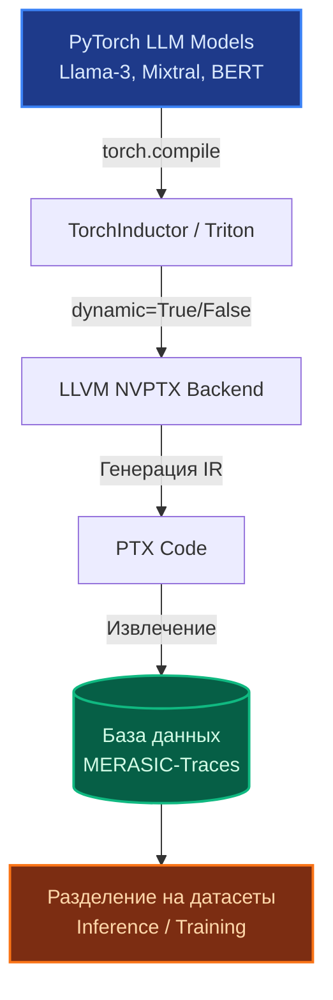
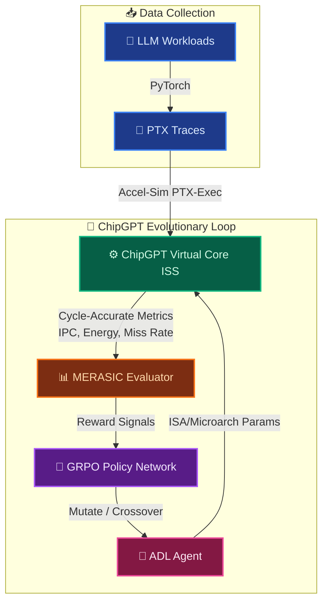
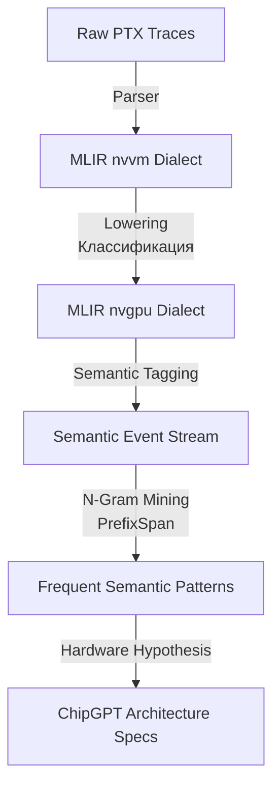

# От PTX-трасс к ChipGPT: Эволюционная семантическая архитектура

**Статус:** 🟢 Активная стратегия  
**Связанные документы:** [Архитектура VLIWGPT](index.html#/docs/architecture/vliwgpt-parametric-core), [MERASIC Benchmarks](index.html#/docs/agentic-eda/architecture-mcp-integration)

---

> ## 📈 Trace-Driven Design: Эволюция на основе реальных нагрузок

> В отличие от классического Design Space Exploration (DSE), где архитектура выбирается на основе абстрактных бенчмарков, **ChipGPT** использует методологию **Trace-Driven Evolutionary Design**. Мы не проектируем чип для выполнения абстрактного кода; мы проектируем его для выполнения *фундаментальных вычислительных операций* (семантик), которые доминируют в реальных AI-нагрузках.

> **Ключевой принцип:** Мы снимаем реальные PTX-трассы с современных GPU при выполнении актуальных нагрузок (Инференс и Обучение LLM), выделяем из них семантические паттерны с помощью MLIR и алгоритмов Sequential Pattern Mining, и используем эти паттерны как *ground truth* для эволюционного поиска оптимальной микроархитектуры.

---

## 🎯 Стратегическая цель: От универсальных GPU к семантическим акселераторам

Стратегическое обоснование данного направления заключается в переходе от универсальных архитектур к специализированным акселераторам, что является ключевым трендом в области компьютерных наук. Создание кастомного чипа, где важны семантические, а не бинарные аналоги, открывает уникальные возможности для оптимизации.

**Пример:** Вместо того чтобы иметь отдельные аппаратные блоки для загрузки из глобальной памяти, вычислений и сохранения результата, можно спроектировать единый конвейер, который непрерывно обрабатывает данные, движущиеся по этому типичному шаблону (например, `LOAD_GLOBAL -> COMPUTE_FMA -> STORE_SHARED`). Это может привести к значительному повышению производительности и энергоэффективности.

---

## 📊 Пайплайн сбора PTX-трасс с реальных LLM-нагрузок

Для построения репрезентативной базы паттернов необходим контролируемый сбор PTX-кода из экосистемы PyTorch. Успех этого этапа критически зависит от выбора моделей и режимов компиляции.

### 1. Выбор репрезентативных моделей и нагрузок

Мы должны охватить все ключевые типы вычислений, доминирующие в современных LLM.

| Категория нагрузки | Модели | Тип нагрузки | Ключевые PTX-операции (семантики) |
|---|---|---|---|
| **LLM Inference** | Llama-3, Mixtral, Qwen | PagedAttention, KV-Cache | `ld.global` (загрузка), `shfl` (warp-коммуникация), `tma` (асинхронная загрузка) |
| **LLM Training** | BERT, GPT-2, Llama-3 | Backprop, All-Reduce, FSDP | `fma` (вычисления), `barrier` (синхронизация), `st.shared` (сохранение) |
| **Vision (Baseline)**| ResNet, ViT | Convolutions, Patch Embedding | `wmma` (тензорные ядра), `ld.const` (загрузка констант) |
| **GNN (Опционально)** | GCN, GraphSAGE | Sparse Matrix Multiplication | `atom`, `gather`, `scatter` (нерегулярные операции) |

### 2. Механизм извлечения PTX с помощью `torch.compile`

Для извлечения "чистого" PTX-кода мы используем JIT-компилятор PyTorch. Это ключевой шаг, так как он дает нам доступ к промежуточному представлению (IR), которое еще не оптимизировано под конкретную микроархитектуру.

- **Режим `dynamic=False`**: Генерация статического графа. Дает базовую, детерминированную трассу для каждого слоя. Позволяет получить "базовую картину" без учета динамических размеров батчей.
- **Режим `dynamic=True` (по умолчанию)**: Генерация множества графов для разных размеров батчей и `SEQ_LEN`. Позволяет выявить **все** возможные пути выполнения (branching paths) и динамические паттерны, что критически важно для реальных нагрузок.
- **Флаги компиляции**: Использование флагов `--source-in-ptx` и `-g -lineinfo` позволяет внедрить исходный PTX и отладочную информацию прямо в скомпилированный код, что облегчает его последующее извлечение.

### 3. Схема пайплайна сбора данных

---

## ⚙️ Интеграция Accel-Sim в эволюционный контур ChipGPT

**Accel-Sim** — это критически важный инфраструктурный слой, связывающий реальные PTX-трассы с виртуальной архитектурой ChipGPT. В отличие от GPGPU-Sim, Accel-Sim предоставляет **режим исполнения на основе PTX**, что позволяет запускать реальные PyTorch-ядра на кастомной микроархитектуре, минуя сложности компиляции для GPU-симулятора.

**Выбор Accel-Sim обоснован:**
1.  **Гибкость**: Поддержка двух режимов (на основе трасс и на основе выполнения PTX).
2.  **Точность**: Спроектирован для снижения ошибки моделирования (на 79 процентных пунктов по сравнению с GPGPU-Sim).
3.  **Богатая статистика**: Поддерживает отслеживание статистики по потокам (per-thread), что критично для анализа дивергенции варпов и работы с памятью.

### Роль Accel-Sim в архитектуре ChipGPT

1.  **Digital Twin для MERASIC**: Accel-Sim выступает как cycle-accurate симулятор, который принимает PTX-ядра и исполняет их на параметризуемой архитектуре ChipGPT.
2.  **Генерация Reward-сигналов**: Симуляция возвращает метрики (IPC, Energy, Memory Bandwidth, Cache Miss Rate), которые формируют reward-функцию для GRPO.
3.  **Co-simulation**: Сравнение поведения "эволюционировавшего" ядра ChipGPT с эталонным NVIDIA GPU на одних и тех же PTX-треках.

### Детальная архитектура интеграции

---

## 🧠 Семантическая абстракция и роль MLIR

Поиск паттернов в "сыром" PTX бессмысленен, так как бинарные коды зависят от версий компиляторов. Мы переходим к **семантической абстракции**, используя компиляторный фреймворк **MLIR**. Это не просто классификация, а целенаправленный процесс декомпозиции и обобщения.

### 1. Карта семантических категорий (Пример)

Каждая PTX-инструкция маппится на семантическую метку высокого уровня, что позволяет абстрагироваться от конкретных регистров и версий.

| PTX Instruction | MLIR Dialect | Semantic Tag | Категория |
|---|---|---|---|
| `ld.global.ca.f32` | `nvvm.ld.global` | `LOAD_GLOBAL` | Загрузка данных |
| `st.shared.b32` | `nvvm.st.shared` | `STORE_SHARED` | Сохранение данных |
| `fma.rn.f32` | `nvvm.fma` | `COMPUTE_FMA` | Арифметические операции |
| `wmma.mma.sync` | `nvgpu.mma` | `TENSOR_MMA` | Тензорные ядра (Matrix Multiply-Accumulate) |
| `shfl.sync.bfly` | `nvvm.shfl` | `WARP_COMM` | Внутри-warp коммуникация |
| `tma.load` | `nvgpu.tma` | `ASYNC_COPY` | Асинхронное перемещение данных |
| `bar.sync` | `nvvm.barrier` | `SYNC` | Синхронизация потоков |
| `bra.cond` | `nvvm.bra` | `BRANCH` | Управление потоком |

### 2. MLIR Pipeline для декомпозиции

Мы используем `nvvm` и `nvgpu` диалекты MLIR для автоматической группировки инструкций в высокоуровневые вычислительные блоки.

**Пример декомпозиции:**
- **Сырая трасса:** `ld.global.ca.f32` -> `fma.rn.f32` -> `st.shared.b32`
- **Семантическая трасса:** `LOAD_GLOBAL` -> `COMPUTE_FMA` -> `STORE_SHARED`
- **Высокоуровневый паттерн:** `GEMM_KERNEL_BLOCK` (последовательность из десятков таких семантических событий, свернутая в единую операцию).

---

## 🧬 Супер-базовые ядра (Seed Cores) для эволюции

Чтобы охватить все возможные семантические паттерны LLM-нагрузок, эволюционный алгоритм ChipGPT должен стартовать из **четырех супер-базовых ядер (Seed Cores)**. Каждое ядро покрывает свой класс семантик.

**Почему именно 4?** Этого количества достаточно, чтобы замкнуть пространство поиска. Эволюционный алгоритм (GRPO) не будет изобретать "скалярный ALU" с нуля — он будет мутировать параметры конвейера, иерархию памяти и механизмы синхронизации *внутри* этих четырех фундаментальных топологий, комбинируя их в гетерогенные кластеры (MPPA).

| Эпоха | Seed Core | Архитектурный класс | Покрываемые семантики |
|---|---|---|---|
| **I** | **Scalar VLIW** | Статический параллелизм | `LOAD`, `STORE`, `ALU`, `BRANCH` (Базовые операции, ветвление) |
| **II** | **SIMD-VLIW** | Векторные вычисления | `VECTOR_FMA`, `PREDICATE`, `SIMD_LOAD` (Обработка тензоров низкой точности) |
| **III** | **SIMT (Warp)** | Динамические потоки | `WARP_COMM`, `SYNC`, `DIVERGENCE` (Алгоритмы внимания, графы) |
| **IV** | **Tensor/Systolic** | Матричные ускорители | `TENSOR_MMA`, `ASYNC_COPY`, `TMA` (Ядра LLM, GEMM) |

**Стратегический переход:** Эволюция начинается с этих четырех базовых топологий. В процессе эволюции они могут:
1.  **Мутировать**: Изменять параметры (размеры кэшей, шины данных, количество ALU).
2.  **Кроссовериться**: Обмениваться удачными архитектурными решениями (например, добавить к SIMT-ядру поддержку TMA из Tensor-ядра).
3.  **Комбинироваться**: Формировать гетерогенные кластеры, где разные ядра обрабатывают разные части нейросети (например, Scalar VLIW для управления, SIMT для внимания, Tensor для матричных умножений).

---

## 🗺️ Стратегический план развития ChipGPT (Roadmap)

Данный план обобщает методологию "От PTX-трасс к кастомному дизайну" на полный цикл развития ChipGPT. Успех проекта зависит от последовательного применения правильно подобранных методологий на каждом этапе.

### Фаза 1: Data Collection & Profiling (Месяц 1-2)
- **Действие:** Развертывание кластера для сбора PTX-трасс с реальных LLM (Llama-3, Mixtral).
- **Детали:** Настройка пайплайна `torch.compile` -> PTX extraction. Анализ обоих режимов (`dynamic=True/False`). Сбор трасс для Inference и Training.
- **Результат:** Формирование базы данных `MERASIC-Traces`, разделенной на датасеты.

### Фаза 2: Accel-Sim Integration (Месяц 2-3)
- **Действие:** Интеграция Accel-Sim (PTX-execution mode) в ISS ChipGPT.
- **Детали:** Калибровка симулятора: сравнение IPC Accel-Sim с реальными замерами на NVIDIA A100/H100. Настройка генерации per-warp статистики для анализа warp divergence.
- **Результат:** Работающий Digital Twin, готовый принимать PTX-трассы и выдавать архитектурные метрики.

### Фаза 3: Semantic Abstraction & Pattern Mining (Месяц 3-4)
- **Действие:** Разработка MLIR-конвертера из PTX в семантические теги. Использование `nvvm` и `nvgpu` диалектов.
- **Детали:** Применение алгоритмов Sequential Pattern Mining (PrefixSpan) для поиска частых N-грамм (семантических последовательностей). Выявление "Hot Patterns" (например, доминирование `TMA -> TENSOR_MMA` в Hopper-подобных нагрузках).
- **Результат:** Список топ-10 самых частых семантических паттернов (например, `[LOAD_GLOBAL, LOAD_SHARED, COMPUTE_FMA, STORE_SHARED]`), которые станут основой для эволюции.

### Фаза 4: Evolutionary Loop (GRPO) (Месяц 4-6)
- **Действие:** Запуск ADL-Agent для генерации популяции архитектур из 4 Seed Cores.
- **Детали:** Прогон "Hot Patterns" через Accel-Sim на каждой архитектуре. GRPO обновляет веса модели, отдавая приоритет архитектурам, максимизирующим **IPC на реальных LLM-паттернах**, а не на абстрактных бенчмарках.
- **Результат:** Оптимальная микроархитектура, "выращенная" под конкретные нагрузки.

### Фаза 5: RTL Generation & Tape-out Prep (Месяц 6+)
- **Действие:** Финальная архитектура фиксируется в виде nML/ADL спецификации.
- **Детали:** Генерация Verilog RTL через ChipGPT RTL-Verifier. Формальная верификация и подготовка к синтезу.

---

## 📚 References

1.  **Accel-Sim Framework**: [An Extensible Simulation Framework for Validated GPU Modeling](https://github.com/accel-sim/accel-sim-framework)
2.  **GPGPU-Sim**: [GPGPU-Sim Manual](https://gpgpu-sim.org/manual/index.php/Main_Page)
3.  **NVIDIA PTX ISA**: [Parallel Thread Execution ISA Documentation](https://docs.nvidia.com/cuda/parallel-thread-execution/index.html)
4.  **MLIR GPU Dialects**: [NVVM Dialect](https://mlir.llvm.org/docs/Dialects/NVGPU/), [GPU Dialect](https://mlir.llvm.org/docs/Dialects/GPU/)
5.  **PyTorch Compilation**: [Introduction to torch.compile](https://docs.pytorch.org/tutorials/intermediate/torch_compile_tutorial.html)
6.  **Sequential Pattern Mining**: [A Survey of Sequential Pattern Mining](https://www.cs.wisc.edu/~chen-han/doc/DSpM-paper5.pdf)
7.  **Warp-Level Analysis**: [Warp-Level CFG Construction for GPU Kernel WCET Analysis](https://drops.dagstuhl.de/opus/volltexte/2023/18430/pdf/OASIcs-WCET-2023-1.pdf)
8.  **Tensor Cores & TMA**: [Mastering the NVIDIA Tensor Memory Accelerator (TMA)](https://research.colfax-intl.com/tutorial-hopper-tma/)
9.  **ChipGPT Internal**: [MERASIC: Microarchitectural Evaluation & Reasoning for AI Silicon Co-design](index.html#/docs/agentic-eda/architecture-mcp-integration)
10. **ChipGPT Internal**: [AlphaEvolve × ChipGPT: Параметры эволюционного поиска](index.html#/docs/evolution/alphaevolve-chipgpt)