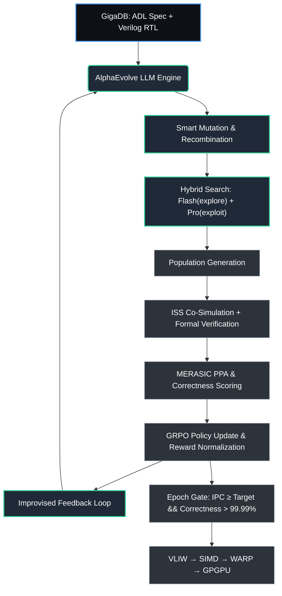

# AlphaEvolve × ChipGPT: Эволюционный поиск архитектур от VLIW к TPU/GPU

---

## 1. Введение: Почему AlphaEvolve — катализатор ChipGPT
Методология `AlphaEvolve` от Google DeepMind доказала, что LLM-ориентированный эволюционный поиск способен находить фундаментальные оптимизации там, где традиционные методы Design Space Exploration (DSE) упираются в экспоненциальную сложность. Интеграция этой парадигмы в **ChipGPT** трансформирует наш эволюционный цикл из полуавтоматического процесса в полностью автономную систему `ADRS (AI-Driven Research for Systems)`.

🔑 **Ключевой прецедент (Google TPU):**
- Оптимизация `Matrix Tiling` на уровне XLA IR → **+23% ускорения ядра**, экономия ~1% времени обучения на кластерах
- Автопоиск преобразований для `FlashAttention` → **+32% ускорения ядра**, +15% для предобработки
- Микрооптимизации `FHE/TFHE` на TPUv5e → **сокращение задержки бутстраппинга в 2.5x**
Эти результаты подтверждают: **AlphaEvolve работает не только на уровне софта, но и на уровне аппаратного дизайна**, напрямую влияя на PPA-метрики будущих поколений чипов.

---

## 2. Архитектурное соответствие: методология AlphaEvolve → конвейер ChipGPT
Базовый цикл AlphaEvolve (`Инициация → Мутация → Тестирование → Отбор`) идеально отображается на существующую архитектуру ChipGPT:

| Компонент AlphaEvolve | Аналог в ChipGPT | Роль в эволюционном цикле |
|----------------------|------------------|---------------------------|
| **Код как геном** | ADL-спецификации (GigaDB) + Verilog RTL + XLA/LLVM IR | Исходный материал для эволюции |
| **LLM-мутации** | GigaCore Agent + GRPO Policy | «Умные» изменения вместо случайного перебора. Flash-модели для широкого поиска, Pro-модели для глубокого анализа перспективных кандидатов |
| **Верификаторы** | MERASIC Benchmarks + ISS Ground Truth + Formal Verifier | Давление отбора. Оценка IPC, PPA, корректности, отсутствия метастабильности |
| **Отбор и популяция** | Group Relative Policy Optimization (GRPO) | Групповая нормализация reward, обновление весов политики, переход к следующей эпохе |
| **ImprovEvolve** | Meta-цикл самосовершенствования ChipGPT | Агент запрашивает у LLM целевое улучшение текущего лучшего решения перед генерацией следующей популяции |

---

## 3. План интеграции: от RTL-оптимизации к полной автономии
Интеграция AlphaEvolve в ChipGPT реализуется поэтапно, чтобы обеспечить стабильность верификации и управляемость поиска.

### 🔹 Этап 1: Оптимизация сгенерированного RTL (Verilog)
- **Цель:** Устранение избыточности, улучшение clock gating, сокращение площади и динамического энергопотребления.
- **Действие:** AlphaEvolve принимает на вход Verilog-описания кластеров VLIW от GigaCore Agent, применяет гибридные мутации (Gemini Flash для вариантов, Pro для timing-aware анализа), проверяет через ISS и формальные верификаторы.
- **Результат:** Готовые к синтезу модули с улучшенными PPA-метриками без потери функциональной корректности.

### 🔹 Этап 2: Эволюция компиляторного стека и планировщика
- **Цель:** Автогенерация эвристик планирования для VLIW/SIMD, оптимизация тайлинга матриц, регистрового распределения.
- **Действие:** Работа на уровне XLA-подобного IR или LLVM-бэкенда. AlphaEvolve ищет последовательности трансляционных проходов, максимизирующие ILP и минимизирующие latency межкластерных передач.
- **Результат:** Ускорение выполнения критических кернелов на 20–35% на уже существующих ядрах.

### 🔹 Этап 3: Эволюция самих верификаторов (MERASIC)
- **Цель:** Ускорение обратной связи в цикле GRPO.
- **Действие:** AlphaEvolve оптимизирует суррогатные модели оценки, создавая быстрые аппроксиматоры PPA/IPC, которые отсеивают 90% бесперспективных кандидатов до запуска тяжелого gate-level simulation.
- **Результат:** Сокращение времени одной итерации эволюции на порядок.

### 🔹 Этап 4: Замкнутый HW/SW Co-Design (ADRS Paradigm)
- **Цель:** Полностью автономный поиск архитектурных решений.
- **Действие:** Инженер задает только целевые метрики (`IPC ≥ 2.5`, `Power ≤ 1.2W`, `Area ≤ 0.8mm²`). AlphaEvolve самостоятельно исследует пространство ISA, микроархитектуры, планировщиков и компиляторных паттернов, выдавая верифицированные реализации.
- **Результат:** Переход роли инженера от «автора кода» к «руководителю процесса».

---

## 4. Путь VLIW → GPU: как AlphaEvolve строит эволюцию по эпохам ChipGPT
AlphaEvolve устраняет «дизайнерскую фиксацию», позволяя находить неочевидные, но высокоэффективные топологии на каждом этапе перехода к массовому параллелизму.

| Эпоха ChipGPT | Задача AlphaEvolve | Ожидаемый прорыв |
|---------------|-------------------|------------------|
| **I. Basic VLIW** | Оптимизация кластерных datapath, балансировка RF-портов, устранение битовой избыточности в ALU | Снижение area/power на 15–25%, стабильная частота ≥1.2GHz |
| **II. SIMD-VLIW** | Эволюция векторных расширений, автопоиск предикатных масок, оптимизация компиляторного тайлинга | Ускорение кернелов DCT/FFT на 20–30%, корректность векторизации >99.9% |
| **III. Basic WARP** | Поиск warp-планировщиков, shared memory controllers, базовых протоколов когерентности | Латентность межкластерных передач ↓40%, IPC ≥ 2.1 на многопоточных нагрузках |
| **IV. GPGPU / TPU** | Автогенерация тензорных блоков, systolic arrays, HBM-контроллеров, аппаратных atomic-операций | Прорывные топологии, обходящие человеческие ограничения. Ускорение матричных операций в 2–3x |

**Конкретные шаги внутри AlphaEvolve для перехода:**
1. **Инициализация популяции** из проверенных VLIW-спецификаций (r-VEX, st231)
2. **LLM-генерация мутаций** с фокусом на добавление параллельных исполнительных путей и буферизацию данных
3. **Верификация через ISS** на MERASIC-бенчмарках с автоматической инъекцией NOP/CDC-синхронизаторов
4. **Отбор по групповому reward** (GRPO): штраф за метастабильность и race-conditions, бонус за рост IPC/снижение toggle_rate
5. **ImprovEvolve-цикл:** LLM анализирует лучшее решение, предлагает архитектурный сдвиг (например, переход от статического расписания к динамическому warp-диспетчеру)
6. **Фиксация эпохи** при `correctness > 99.99%` и `IPC ≥ target`

---

## 5. Ключевые преимущества и смена парадигмы
- **Глубокое влияние на PPA:** Оптимизация на уровне Verilog затрагивает саму архитектуру будущих чипов, снижая стоимость кремния, энергопотребление и тепловыделение. В отличие от софтверных патчей, эффект перманентный.
- **Мгновенная выгода на существующем железе:** Оптимизация компиляторных ядер (XLA/IR) позволяет ускорять выполнение задач без замены оборудования, экономя ресурсы кластеров.
- **Преодоление многомерности:** AlphaEvolve находит неочевидные оптимизации в пространствах, где человек сталкивается с комбинаторным взрывом параметров (как в случае с TFHE-ускорением в 2.5x).
- **Новая роль инженера:** Система берет на себя творческую и экспериментальную работу. Инженер формулирует ограничения, выбирает метрики и валидирует архитектурные гипотезы, а не пишет RTL вручную.

---

## 6. Схема интеграционного пайплайна (Mermaid)

---

## 7. Заключение и следующие шаги
Интеграция AlphaEvolve в ChipGPT превращает эволюционный дизайн чипов из итеративного ручного процесса в масштабируемую AI-парадигму. Мы получаем инструмент, способный не только оптимизировать существующие ядра, но и автономно проходить путь от базового VLIW к сложным WARP/GPGPU-матрицам, обходя ограничения человеческого воображения и традиционных CAD-эвристик.

**Ближайшие шаги реализации:**
1. Развертывание open-source аналога `GigaEvo` как тестового стенда для валидации LLM-мутаций на Verilog/ADL
2. Интеграция Gemini Flash/Pro API в оркестратор ChipGPT для гибридного поиска
3. Настройка `MERASIC` как высокопроизводительного верификатора с поддержкой batch-оценки популяций
4. Запуск первого ImprovEvolve-цикла на переходе Эпоха I → Эпоха II (VLIW → SIMD-VLIW)
5. Публикация внутренних бенчмарков PPA/IPC для валидации эффективности AlphaEvolve-интеграции

---
*Документ поддерживается командой ChipGPT.*