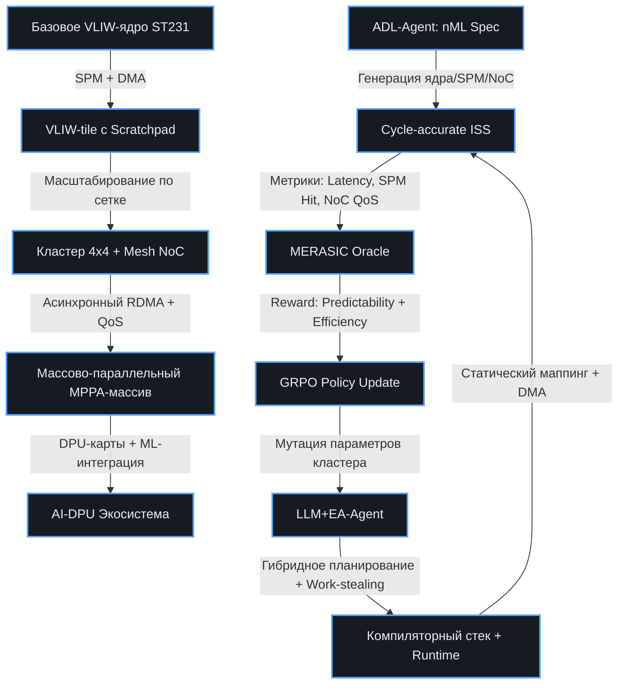

# 🔄 Эволюция VLIW → MPPA: Траектория Kalray и массово-параллельные DPU
> Стратегия перехода от классического VLIW к архитектуре MPPA (Massively Parallel Processor Array) на примере траектории Kalray. План ко-эволюции HW/SW в рамках ChipGPT для создания предсказуемых AI-DPU.

## 🎯 Концепция: От ILP к TLP/DLP без потери VLIW-фундамента
Эволюционный путь от одноядерного VLIW процессора класса VEX/ST231 к многокластерным системам массово-параллельной обработки (MPPA) компании Kalray представляет собой не просто увеличение количества вычислительных элементов, а **фундаментальный сдвиг парадигмы**: от извлечения параллелизма на уровне команд (ILP) к параллелизму на уровне задач и данных (TLP/DLP). 

Ключевой инсайт для ChipGPT: переход к MPPA **не означает отказ от VLIW**. Напротив, современные MPPA-блоки («tiles») сохраняют внутри себя высокопроизводительную VLIW-архитектуру (например, до 5 операций за такт). Эволюция заключается в масштабировании: вместо усложнения одного ядра (что ведёт к экспоненциальному росту энергопотребления и тепловыделения) создаётся массив из простых, гомогенных и легковесных ядер, каждый из которых эффективно обрабатывает свой поток задач. Это обеспечивает высокую плотность вычислений на Ватт и предсказуемость, критичную для embedded-AI и real-time систем.

---

## 🗺 План эволюции ChipGPT: от Basic VLIW к Kalray MPPA-DPU
Эволюция разбита на 4 последовательные эпохи. Каждая эпоха синхронно обновляет микроархитектуру, подсистему памяти, коммуникационный слой и компиляторно-рантайм стек, формируя замкнутую петлю верификации через ISS и GRPO.

| Эпоха | Архитектурный сдвиг | Ключевые изменения HW | Ключевые изменения SW/Компилятора | Метрика успеха (GRPO Reward) |
|:---|:---|:---|:---|:---|
| **I. Enhanced VLIW Tile** | Введение SPM и DMA в одном ядре | Локальный Scratchpad (SPM) вместо L1/L2, аппаратный DMA-контроллер, базовый NoC-порт | Компиляторное управление памятью (compile-time allocation), генерация явных `load/store` через DMA, отказ от cache-coherence протоколов | `SPM Hit Rate ≥ 85%`, `DMA Overlap ≥ 70%` |
| **II. Clustered MPPA Array** | Масштабирование до кластера (4×4 или 8×8) | Регулярная NoC-топология (mesh/torus), wormhole routing, кластерные SPM-банки, системные ядра для I/O | Статическое планирование графа задач (ILP → TLP mapping), гибридный рантайм v1 (work-stealing между кластерами) | `NoC Latency < 15 cycles`, `Load Balance ≥ 90%` |
| **III. Massively Parallel DPU** | Переход к коммерческому MPPA-256+ | 256+ вычислительных ядер, несколько независимых NoC, асинхронный RDMA, гетерогенные адресные пространства | Полноценный distributed runtime, предсказуемое статическое планирование для ML-слоёв, динамическая балансировка для ветвящихся графов | `ML Inference Latency < 2ms`, `Real-time Guarantee 100%` |
| **IV. AI-DPU Ecosystem** | Интеграция в дата-центры / edge-серверы | PCIe/DPU-карты, аппаратные гарантии сервиса QoS в NoC, изоляция кластеров под разные workload'ы | MLIR-диалекты для MPPA, авто-маппинг PyTorch/TensorFlow графов на кластеры, формальная верификация таймингов | `MLPerf Edge/Inference Compliance`, `TCO Reduction ≥ 40%` |

---

## 🔑 Ключевые архитектурные сдвиги в траектории ChipGPT

### 💾 1. Реорганизация памяти: От кэшей к Scratchpad (SPM)
Классическая иерархия кэшей (L1/L2/L3) с поддержкой когерентности (snooping/directory) не масштабируется в системах с сотнями ядер. Сложность и задержки синхронизации кэшей растут экспоненциально, убивая энергоэффективность.
- **Решение ChipGPT:** Переход к **распределённой памяти SPM**. Каждый вычислительный кластер имеет собственную быструю, но ограниченную локальную память. Доступ к ней детерминирован и предсказуем.
- **Управление:** Программист/компилятор явно управляет перемещением данных через DMA. Это снижает порог программирования, но даёт **100% предсказуемость задержек** и предотвращает каскадные кэш-промахи.
- **Интеграция:** ADL-Agent генерирует модели SPM-банков, LLM+EA-Agent оптимизирует размер банков и планирование DMA-транзакций через GRPO.

### 🌐 2. «Нервная система» чипа: NoC и асинхронный RDMA
В MPPA-архитектурах шины заменяются пакетными коммутационными сетями на кристалле (Network-on-Chip).
- **Топология:** Регулярная mesh или torus. Гарантирует предсказуемость маршрутизации.
- **Механизм:** Wormhole switching для снижения задержек и буферизации.
- **Коммуникация:** Ядра не работают с памятью других кластеров напрямую. Они инициируют асинхронные DMA/RDMA-операции. Инициировавшее ядро **немедленно освобождается** для вычислений, скрывая задержки сети.
- **ChipGPT-роль:** Генерация NoC-маршрутизаторов через ADL, верификация гарантий QoS через ISS, оптимизация трафика через EA.

### ⚖️ 3. Гибридное управление параллелизмом: Статика + Динамика
Полный отказ от статического планирования в пользу динамического runtime **не является оптимальным** для задач машинного обучения и real-time систем. Предсказуемая архитектура MPPA + SPM открывает возможности для **статического планирования с гарантированными временными характеристиками**.
- **Статический слой (Compile-time):** Компилятор анализирует DAG модели, статически размещает задачи по ядрам, выделяет память в SPM и планирует DMA. Обеспечивает детерминизм, отсутствие jitter и выполнение SLA для критичных ML-слоёв.
- **Динамический слой (Runtime):** Среда выполнения (распределённая ОС/менеджер задач) использует механизмы типа `work-stealing` для балансировки нагрузки при переменной сложности задач или асинхронных I/O.
- **ChipGPT-синергия:** Гибридный подход балансирует предсказуемость и эффективность. GRPO обучает планировщик выбирать оптимальное соотношение статического маппинга и динамического steal'а для конкретного workload'а.

---

## 🧬 Архитектура эволюционного перехода в ChipGPT

---

## 🛠 Практическая интеграция в пайплайн ChipGPT
1. **Декларативное описание кластера:** Инженер задаёт количество ядер, размер SPM, топологию NoC и пропускную способность DMA. ADL-Agent генерирует C++ ISS и компиляторные заготовки.
2. **Статическое планирование ML-графов:** LLM декомпозирует нейросеть на слои, EA оптимизирует размещение слоёв по кластерам для минимизации NoC-трафика. Компилятор генерирует статический планировщик DMA-транзакций.
3. **Верификация предсказуемости:** ISS запускает бенчмарки. Проверяются: максимальное время отклика (Worst-Case Execution Time), отсутствие deadlocks в NoC, эффективность overlap вычислений и DMA.
4. **GRPO-оптимизация:** Если статическое планирование приводит к простоям из-за неравномерной нагрузки, GRPO получает negative-reward и смещает policy в сторону более агрессивного `work-stealing` или увеличения асинхронности. Цикл повторяется до сходимости.
5. **Переход к DPU:** После стабилизации метрик на уровне массива, система генерирует драйверы, PCIe-обвязку и HAL для встраивания в коммерческие DPU-карты.

---

## 📌 Итог: Почему траектория Kalray оптимальна для ChipGPT
Архитектурная эволюция от ST231 к MPPA в случае Kalray доказывает, что **масштабируемость не требует отказа от VLIW**. Напротив, VLIW становится вычислительным «движком» внутри каждого tile, а предсказуемость системы обеспечивается за счёт явного управления памятью (SPM+DMA) и гибридного планирования (статика для SLA + динамика для гибкости). 

В рамках ChipGPT этот путь реализуется не как ручная переделка RTL, а как **автоматизированная ко-эволюция**:
- HW упрощается (отказ от кэш-когерентности, замена шин на NoC)
- SW усложняется (компилятор строит статические расписания, runtime балансирует задачи)
- ISS становится Ground Truth для верификации таймингов и SPM-эффективности
- GRPO оптимизирует баланс между детерминизмом и утилизацией ядер

Это позволяет ChipGPT создавать массово-параллельные DPU, которые не просто «быстро считают», а **гарантируют выполнение в реальном времени** при максимальной энергоэффективности, что является ключевым требованием для embedded-AI, автопилотов и промышленных контроллеров следующего поколения.