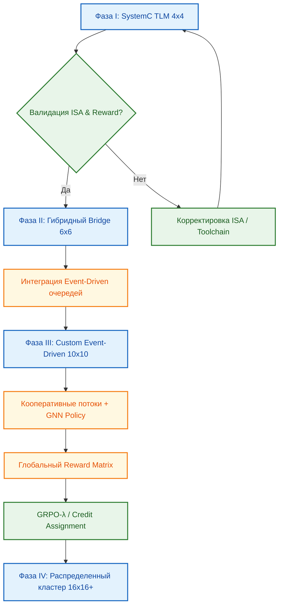

<!--
---
title: "Многоядерный ISS: Event-Driven симуляция и глобальный GRPO"
description: "Оптимальная архитектура многоядерного симулятора, фазовый переход от SystemC и влияние глобального вознаграждения на обучение GRPO"
tags: [systemc-tlm, event-driven, multi-core-iss, grpo, marl, global-reward, gpu-emulation, scalability]
last_updated: 2026-05-14
---
-->

# Многоядерный ISS: Event-Driven симуляция и глобальный GRPO для GPU-эмуляции

> **Аннотация**: Анализ ограничений SystemC TLM при масштабировании до GPU-подобных матриц (10x10 ядер), обоснование перехода к кастомной Event-Driven архитектуре и интеграция глобальной reward-функции для кооперативного GRPO-обучения.

---

## 🎯 Почему правильная архитектура многоядерного ISS критична для GRPO?

Эмуляция GPU/TPU-подобной вычислительной матрицы требует не просто параллельного запуска множества изолированных симуляторов, а создания единой, синхронизированной среды, где задержки в шине, когерентность кэшей, балансировка нагрузки и конфликты ресурсов становятся частью обучающего пространства. Для алгоритма Group Relative Policy Optimization (GRPO) корректная архитектура многоядерного ISS определяет:

- **Скорость итераций**: RL требует миллионов шагов взаимодействия. Симулятор, работающий со скоростью 2 MIPS на всю матрицу, сделает обучение экономически и временнó невозможным.
- **Детерминизм reward-сигнала**: Гонки состояний (race conditions) и неоптимальная синхронизация в симуляторе вносят шум в метрики. GRPO чувствителен к зашумленным вознаграждениям, что дестабилизирует политику.
- **Масштабируемость state space**: Глобальная функция вознаграждения требует агрегации метрик со всех ядер. Архитектура ISS должна предоставлять эти данные с минимальными накладными расходами, чтобы вектор состояния оставался вычислимым.

---

## 🔍 SystemC TLM: Стартовая площадка, но не финиш

Для начального прототипирования и валидации ISA/интерконнекта на малых масштабах (4x4) SystemC TLM 2.0 демонстрирует сильные стороны:
- ✅ **Модульность и интероперабельность**: Каждое VLIW ISS инкапсулируется в `sc_module`, подключается к стандартным шинам (AXI/TileLink) без глубокого рефакторинга.
- ✅ **Высокий уровень абстракции**: Транзакционный подход скрывает тактовые циклы, ускоряя разработку по сравнению с RTL.
- ❌ **Фундаментальный потолок масштабируемости**: Стандартная реализация SystemC однопоточная. Попытки распараллеливания через OS-потоки приводят к экспоненциальному росту контекстных переключений при `N_cores > N_physical_CPUs`.
- ❌ **Синхронизация и когерентность**: Общая память и шина создают точки блокировки. Параллельные реализации показывают ошибку моделирования ~6% против 1.8-2.1% у специализированных движков.

Для задачи эмуляции матрицы 10x10 (100 ядер) SystemC становится узким горлом. Низкая производительность и сложность управления синхронизацией делают его неоптимальным выбором для поставленной исследовательской цели.

---

## ⚙️ Оптимальный метод: Кастомный Event-Driven симулятор

На основе анализа ограничений, оптимальной архитектурой для ChipGPT является **декомпозиция на автономные Event-Driven процессы с кооперативным многопоточностью (Cooperative Multithreading)**.

**Ключевые принципы:**
1. **Асинхронная декомпозиция**: Каждое ядро ISS — независимый процесс. Взаимодействие только через очереди событий/сообщений (например, `cache_miss`, `bus_arbitration`, `sync_barrier`). Устраняет постоянные точки блокировки.
2. **Кооперативные потоки (Fibers/Coroutines)**: Переключение контекста управляется пользовательским планировщиком внутри одного процесса. Накладные расходы в десятки раз ниже, чем у системных вызовов ОС. Позволяет стабильно симулировать 100+ ядер на 32-64 физических CPU.
3. **Разрыв когерентности (Coherence Decoupling)**: Вместо строгой синхронной проверки состояний, используется асинхронная рассылка инвалидаций. Ядро работает автономно до момента ожидания внешнего события.
4. **Производительность**: При правильной реализации достижимы сотни MIPS на матрицу, что делает GRPO-обучение выполнимым в разумные сроки.

---

## 🌐 Глобальная Reward-функция и кооперативное MARL

Использование единой функции вознаграждения, отражающей производительность всей матрицы (суммарный IPC, энергоэффективность, балансировка нагрузки), переводит задачу из плоскости одноагентного RL в область **Кооперативного Многоагентного Обучения (MARL)**. Цель агентов (ядер) смещается с максимизации локального результата к совместному достижению общей цели, имитируя поведение реального многоядерного GPU.

**Влияние на GRPO и архитектуру политики:**
- **Расширение State Space**: Вектор состояния теперь включает метрики всех ядер. Прямая подача сырых данных требует более глубоких сетей. Рекомендуется **уменьшение размерности** через агрегированные метрики (кластерная загрузка, статистика очередей, сетевой трафик).
- **Проблема распределения заслуг (Credit Assignment)**: Глобальный reward не указывает, какое именно ядро или последовательность действий привела к успеху. Введение `GRPO-λ` с обучаемым параметром λ помогает адаптивно контролировать веса, придаваемые разным частям генераций.
- **Архитектура политики**: Переход от MLP к **Графовым Нейронным Сетям (GNN)**, где ядра — узлы, а интерконнект — рёбра. GNN эффективно обрабатывают топологию матрицы и справляются с межагентскими зависимостями лучше стандартных перцептронов.
- **Итеративное обучение**: Старт с локальных/групповых наград для "разогрева" модели, затем плавный переход к глобальному reward для оттачивания координации.

---

## 🗺️ План фазового перехода: от SystemC к Event-Driven

Для минимизации рисков и обеспечения непрерывности обучения предлагается поэтапная миграция симуляционной инфраструктуры:

| Фаза | Масштаб | Архитектура симулятора | Цель и фокус GRPO |
|:---|:---|:---|:---|
| **I. Прототип** | 4x4 (16 ядер) | SystemC TLM 2.0 | Валидация ISA, базового интерконнекта, отладка reward-формулы. Обучение локальных политик на малом графе. |
| **II. Гибрид** | 6x6 (36 ядер) | SystemC + Event-Driven bridge | Интеграция асинхронных очередей событий. Введение кооперативного планировщика для подмножества ядер. Тестирование GNN-политики. |
| **III. Продуктив** | 8x8 → 10x10 | Чистый Event-Driven (Custom C++/Rust) | Полный отказ от SystemC. Кооперативные потоки, разрыв когерентности. Обучение с глобальным reward, GRPO-λ, credit assignment. |
| **IV. Экстрем** | 16x16+ | Распределенный MPI / GPU-акселерация | Масштабирование на кластер. Использование CUDA/OpenCL для ускорения шагов симуляции. Fine-tuning политик на реальных топологиях. |

---

## 🔄 Архитектура перехода и потока данных GRPO

---

## 🔮 Заключение

Переход от SystemC TLM к кастомной Event-Driven архитектуре — не просто оптимизация скорости, а необходимое условие для применения GRPO к многоядерным матрицам. Глобальная reward-функция, отражающая поведение всей системы, требует от симулятора минимальных задержек синхронизации и от алгоритма обучения — мощных архитектур политик (GNN) и механизмов распределения заслуг. Предложенный пошаговый план позволяет плавно нарастить сложность, обеспечивая непрерывность обучения и гарантируя, что каждое ядро в итоговой GPU/TPU-эмуляции будет работать как часть слаженного, оптимизированного ансамбля.

> 📌 *Данный раздел описывает стратегию масштабирования симулятора и интеграцию глобального вознаграждения в GRPO. Последнее обновление: май 2026.*

---
